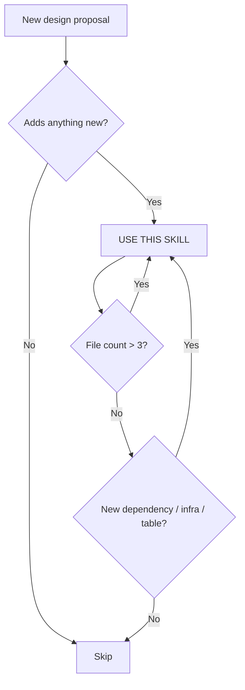

# Design Skeptic

## Overview

Relentlessly challenge every design decision to find the simplest possible solution. The default answer to every proposal is "no" — the burden of proof is on the design to justify its own existence.

**Core principle: Complexity is a bug, not a feature. Every line of code you don't write is perfectly tested, documented, and maintained.**

## When to Use

Also trigger when you hear yourself saying: "we could also...", "it would be nice to...", "for future...", "just in case...", "to be safe...", "while we're at it..."

## The Four Questions

Ask these in order. Don't proceed until each is answered convincingly:

### 1. 这有必要吗？(Is this necessary?)

**What problem are we actually solving?** Can we solve it by changing process, documentation, or behavior instead of building software? Does the problem exist *now*, or is it imagined?

### 2. 有没有更简单的方案？(What's the simplest thing that could work?)

For the identified problem: hardcode it? One SQL query? One new column? One new endpoint? Strip every part that isn't strictly required.

### 3. 这个困难能不能绕过去？(Can we bypass this difficulty?)

Instead of solving the hard problem — change the requirement. Most "hard problems" are self-inflicted by choosing a complex approach. Ask: what if we *don't* do this part?

### 4. 市面上的标准方案是什么？(What's the standard approach?)

Not "what's the most powerful approach" — what's the *boring*, proven, everyone-does-it-this-way approach? If PostgreSQL can do it, don't bring a new service. If the standard library has it, don't import a framework.

## The Rejection Checklist

For every design element proposed, demand a "yes" to ALL of these, or reject it:

| Gate | Question |
|------|----------|
| **Now** | Is this needed for the problem we have *today*? (Not "might need later") |
| **Only** | Is there no way to achieve the same outcome without this? |
| **Simple** | Is this the simplest possible implementation? (Not "cleanest" — *simplest*) |
| **Standard** | Is this how most projects at this scale do it? |

**Scale calibration**: If you have <100 users, design for <100 users. PostgreSQL single-table queries, no queues, no caches, no microservices. Scale up *when you need to*, not before.

## Design Simplification Protocol

When reviewing a design, apply these reductions in order:

1. **Delete**: Remove the feature/component entirely. What breaks? If the answer is "nothing important", delete it.
2. **Merge**: Can two tables be one? Two services be one? Two endpoints be one?
3. **Inline**: Replace abstraction with concrete code. `interface` → `func`. `Strategy pattern` → `if/switch`.
4. **Defer**: Push to "phase 2" (which means: never, until someone complains).
5. **Borrow**: Use what's already there. Existing DB, existing auth, existing patterns. Don't invent new ones.

## Common Rationalizations (and their counters)

| Excuse | Reality |
|---------|---------|
| "We'll need this later when we scale" | You have 30 users. You won't. When you do, the requirements will be different anyway. Build for now. |
| "This interface makes it extensible" | Extensible for what? Name the *concrete* second implementation you'll ship this quarter. If you can't, delete the interface. |
| "It's just one more table/column/service" | Each addition compounds. Three "just one more"s = a system nobody understands. |
| "The standard approach is too simple for our case" | No it isn't. Your case is not special. 99% of "special cases" are rationalizations. |
| "We need to do it right the first time" | "Right" = simplest thing that works. A simple system is easy to change. A "right" complex system is impossible to change. |
| "This pattern is best practice" | Best practice for 1000 users at Netflix ≠ best practice for 30 users in an internal tool. Context matters. |
| "It's cleaner to separate these concerns" | Three files that do one thing each < one file that does three things. File count is a cost, not a metric to optimize. |
| "We'll just add a cache/queue/Redis" | You just added a new failure mode, deployment dependency, and debugging surface. For what benefit at 30 users? |
| "We don't need Redis, we'll build our own lightweight X" | Hand-rolled infrastructure is NOT simpler than a third-party dependency. Your SSE Manager / Plugin System / Connection Pool is just as complex as the thing you rejected — and now YOU have to maintain it. If you rejected Redis for being too complex, you must also reject your homegrown equivalent. |
| "It's only X lines of code" | A 50-line SSE Manager with goroutines and channels is more complex than a 200-line straightforward implementation. Complexity is measured in concepts and failure modes, not lines. |

## Red Flags — STOP and Simplify

Hearing any of these from yourself or the design means you're over-engineering:

- "We could abstract this into..."
- "For future extensibility..."
- "While we're at it, we can also..."
- "This will make it easier to add X later"
- "Let's define an interface for..."
- "We should use a message queue for..."
- "The architecture should be able to handle..."
- "I'll add a cache layer..."
- "Let's build a lightweight X instead of using Y" (your "lightweight" version is NOT simpler)
- "We can manage connections/channels ourselves"

**Every one of these means: stop. Delete the thing you were about to add. Solve the problem without it.**

## The Simplest Possible Test

After designing, ask: "Would this design make sense for a 3-person startup building an MVP?"

If the answer is no, you've over-designed. Strip it down until the answer is yes.

## When NOT to Apply

- Performance-critical hot paths with measured (not predicted) bottlenecks
- Security/auth boundaries (don't "simplify" away encryption or auth checks)
- Data integrity guarantees (don't "simplify" away transactions or constraints)
- Regulatory/compliance requirements that explicitly mandate specific implementations
