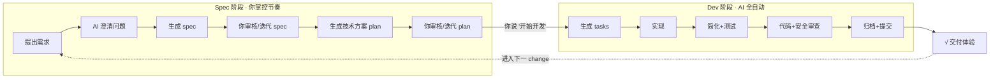

# Spec 开发指挥台

## 项目定位

本项目的核心使命是作为 **Spec 驱动开发的指挥中心**。不承载业务代码，只管理开发的发起、规划、执行和归档。

| 职能 | 说明 |
| --- | --- |
| Spec 管理 | 创建、澄清、规划、实现、归档 spec |
| 习惯沉淀 | 记录并应用用户的工作偏好，越用越懂你 |
| 一键交付 | 开发阶段全自动，从 tasks 到 archive 无需人工干预 |

---

## 角色分工

AI 全权负责以下角色，用户只参与需求澄清（Spec 阶段）和最终体验验收（Dev 交付后）：

| 角色 | 职责 | 触发时机 |
| --- | --- | --- |
| 架构师 | 审查 spec.md + plan.md，确保架构方案合理 | spec 阶段（生成 plan 时） |
| 开发者 | 按 tasks 实现功能 | dev 阶段 |
| QA | 冒烟测试、边界测试、E2E 验证 | 每个 task 后 |
| 代码审查者 | 代码质量、风格一致性 | dev 完成 |
| 重构者 | simplify 全量变更，消除重复和过度复杂逻辑 | dev 阶段第 3 步 |
| 安全审查者 | 安全性检查 | 涉及数据/网络时 |

---

## 用户约定

以下约定 AI 必须无条件遵守：

| 约定 | 说明 |
| --- | --- |
| **不询问是否继续** | AI 在 dev 阶段全自动完成，不在任何节点询问用户 |
| **交付完整功能** | 用户只参与需求澄清，之后 AI 独立完成全流程 |
| **审查失败自动修复** | 审查发现问题 AI 修复并重测，最多重试 2 次。仍失败则中止 change 并报告 |
| **修改前先简化** | 每次修改文件时如果发现重复/死代码，先简化再改功能 |

---

## 工作流程：双阶段模型

工作流分为两个阶段，**Spec 阶段归你控制，Dev 阶段 AI 全自动**。



### 会话加载

每次新会话启动时，AI 自动执行：

1. 读取 `HABITS.md` — 加载你的工作偏好
2. 如有活跃 spec（`specs/` 下未归档目录），加载其 `decisions.md`
3. 检查 `STATUS.md` — 了解项目当前状态

### Spec 阶段（你控制）

流程交互式，你决定何时推进：

```text
1. 你描述需求
2. AI 提出澄清问题（最多 5 个），消除歧义
3. AI 生成 spec.md，覆盖以下维度：
   - 用户故事（P0-P2）+ 验收场景
   - 边界情况
   - 功能/非功能需求
   - 关键实体
   - 成功标准
4. 你审核 spec，可要求修改
5. AI 生成技术方案 plan.md，覆盖以下维度：
   - 整体架构（分层、模块划分）
   - 数据流 / 状态管理方案
   - 组件树 / 模块结构
   - API/接口设计（输入输出）
   - 关键逻辑流程
   - 技术选型及理由
6. 你审核技术方案，可要求修改
7. 你说"开始开发" → 进入 Dev 阶段
```

**启动方式**：`/speckit.specify <你的需求描述>`

### Dev 阶段（AI 全自动）

一旦你确认，AI 全自动执行以下管线，不在任何节点停顿询问：

```text
 步骤                   工具/方式                       说明
 ─────────────────────────────────────────────────────────────────
 1. 生成任务             /speckit.tasks                  生成 tasks.md
 2. 按序实现             /speckit.implement              每 task 实现后自检
 3. 简化全量变更         simplify (Skill 工具调用)       消除重复、优化质量
 4. 运行测试             make test / npm test / go test  有测试文件时执行，按项目类型选命令
 5. 代码审查             优先 gstack.review，不可用时 AI 自审  正确性、边界、风格、重复
 6. 安全审查             优先 gstack.cso，不可用时 AI 自审    输入校验、存储、传输（仅涉数据/网络时）
 7. 归档                 按下方归档步骤执行              更新 HABITS/STATUS/decisions
 8. 提交                 git add + git commit            AI 自动执行
 9. 交付                 输出 "已完成，请体验"
```

**质量门禁（每个 task 后自动执行）：**

| 变更类型 | 检查内容 |
| --- | --- |
| spec 文档变更 | 四项 Design requirements 是否全部覆盖（数据模型、错误处理、边界 case、测试策略） |
| 代码变更 | 运行项目的测试命令（`make test` / `npm test` / `go test` / `cargo test` 等），确保全部通过 |
| 纯配置变更 | 语法校验 |

**失败处理**：审查发现问题 → AI 修复 → 重新验证。每步最多重试 2 次，仍失败则中止并报告。

---

## 归档步骤

每次 Dev 阶段完成后（simplify + test + 审查通过后），AI 按顺序执行归档，缺一不可：

```
1. 回顾本次开发中的用户偏好       → 更新 HABITS.md
2. 记录 spec 设计决策             → 写入 specs/<目录>/decisions.md
3. 更新 STATUS.md                 → 当前 change 移入已归档
4. git add + git commit           → AI 自动提交
5. 告知交付                       → "已完成，请体验"
```

归档即触发提交。提交后工作区干净，可进入下一 change。

---

## 下一 change

归档完成后，回到 Spec 阶段起点：

1. 你提出新需求
2. 或从 `STATUS.md` 的待启动需求中选一个
3. 开始新一轮 `/speckit.specify`

---

## Design requirements

任一 artifact 必须覆盖以下维度，否则视为草稿：

> - `[ ]` 数据模型 / API 接口定义（具体到字段）
> - `[ ]` 错误处理（外部依赖挂了怎么办？输入不合法？）
> - `[ ]` 边界 case（空状态、极限数据量、并发操作）
> - `[ ]` 测试策略（哪些写单元、哪些写集成）

---

## 全局纪律

**Commit 纪律：**

- 每个 change 结束时 AI 自动提交（归档步骤内），不中途提交
- commit message 使用中文，格式：`<type>: <中文描述>`（例：`feat: 添加邮件发送功能`）

**无孤儿变更规则：**

- 提出新 change 前，当前 change 必须已 archive
- 禁止在未 archive 的 change 上叠加新 work

---

## 用户习惯档案

AI 通过 `HABITS.md` 自动记录你的偏好，你说一次就够了。

你说"以后都用 X" → AI 立即写入 `HABITS.md`。你说"这个 spec 用 Y 方案" → AI 写入 `specs/<目录>/decisions.md`。每次新会话自动加载 `HABITS.md`。

---

## 目录规范

### specs 目录

```text
specs/
├── YYYYMMDD-Project-TAG-Desc/  # 活跃 spec
│   ├── spec.md
│   └── decisions.md
├── _archived/                   # 已归档
└── _template/                   # spec 模板
```

- `YYYYMMDD` — 创建日期
- `Project` — 所属项目（如 `Wave`、`Sensors`）
- `TAG` — 类型标签：`Feat` / `Fix` / `Refac` / `Docs` / `Chore`
- `Desc` — PascalCase 英文描述

示例：`20260626-Wave-Feat-AddAEmailHandler/`

**commit message** 对应使用中文，格式：`<type>: <中文描述>`（例：`feat: 添加邮件发送功能`）

---

## 跨设备引导

```bash
# 一键初始化
./scripts/setup.sh
```

执行后自动安装 gstack，其余能力均为内置或克隆即用：

| 能力 | 来源 |
| --- | --- |
| speckit 命令 | 项目自带 `.claude/commands/` |
| gstack（审查/QA/安全） | `setup.sh` 自动安装 |
| superpowers / simplify | Claude Code 内置 |

---

## 语言

所有文档、commit message、artifacts 使用中文。代码中的标识符保持英文。
