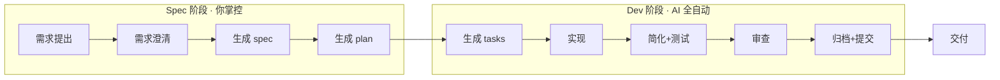

# 工具清册：工作流各阶段可用能力

## 工作流全景



文档按以下维度列出每阶段可用的工具：**工具名** / **来源** / **能力** / **工作方式** / **当前是否自动触发**。

---

## 第一阶段：需求提出 → 需求澄清

| 工具 | 来源 | 能力 | 工作方式 | 自动? |
|---|---|---|---|---|
| `/speckit.specify` | speckit（项目内建） | 从自然语言需求生成结构化 spec | 创建 spec 目录 + 写 spec.md，含用户故事、边界、需求、实体 | 手动触发 |
| `/speckit.clarify` | speckit（项目内建） | 逐条提澄清问题，消除歧义 | 扫描 spec 中模糊/缺失项，一次问一个问题，答完直接写入 spec | speckit.specify handoff |
| `/speckit.constitution` | speckit（项目内建） | 审核/更新 CLAUDE.md 项目章程 | 检查架构规则、工作流、质量门禁是否过时 | 手动触发 |
| `/gstack-office-hours` | gstack | 产品定义、命题挑战、探索替代方案 | 交互式 session，生成结构化设计文档（design doc） | 手动触发 |

**检查维度**: 需求完整性、功能范围清晰度、边界场景覆盖、术语一致性

---

## 第二阶段：生成 spec → 审核 spec

| 工具 | 来源 | 能力 | 工作方式 | 自动? |
|---|---|---|---|---|
| `/speckit.checklist` | speckit（项目内建） | 按领域生成需求质量检查清单 | 分析 spec/plan/tasks，产出针对需求质量的 checklist 文件 | 手动触发 |
| `/speckit.analyze` | speckit（项目内建） | 跨 artifact 一致性+质量分析 | 读 spec.md + plan.md + tasks.md，报告重复/歧义/遗漏/冲突/章程违规 | 可 handoff |
| `gstack-plan-ceo-review` | gstack | CEO 视角评审：产品方向、scope、战略合理性 | 交互式评审，支持 scope 扩缩、前提挑战、方案对比 | 手动触发 |
| `gstack-autoplan` | gstack | 自动串联所有 plan 评审（CEO+Eng+Design+DX） | 按顺序运行全部 review skill，auto-decision 原则决策 | 手动触发 |

**检查维度**: 产品合理性、scope 适当性、需求完整度（P0-P2 覆盖）、验收场景可测试性

---

## 第三阶段：生成 plan → 审核 plan

| 工具 | 来源 | 能力 | 工作方式 | 自动? |
|---|---|---|---|---|
| `/speckit.plan` | speckit（项目内建） | 从 spec 生成技术方案 plan.md | 写 plan.md（架构/数据流/组件树/API/技术选型）+ data-model.md | speckit.specify handoff |
| `writing-plans` 自审 | superpowers | 完整性、占位符、类型一致性检查 | 写完后自行跑一遍 checklist（不派子 agent） | writing-plans 内置 |
| `writing-plans` reviewer prompt | superpowers | 派子 agent 评审 plan 文档 | 按模板派 agent，检查 completness/spec alignment/task decomposition/buildability | 手动触发 |
| `/gstack-plan-eng-review` | gstack | 工程架构评审：架构、数据流、性能、安全、测试 | 交互式 4 段评审（架构→代码质量→测试→性能），含 outside voice | 手动触发 |
| `/gstack-plan-design-review` | gstack | 设计评审：信息架构、交互、视觉、响应式、无障碍 | 7 passes 评分制，自动生成视觉 mockup + 对比板 | 手动触发 |
| `/gstack-plan-devex-review` | gstack | 开发者体验评审 | 交互式评审开发者体验相关维度 | 手动触发 |
| `/gstack-plan-ceo-review` | gstack | CEO 视角（可复用在 plan 阶段） | 同上 | 手动触发 |
| `/gstack-autoplan` | gstack | 全自动管线（复用） | 同上 | 手动触发 |

**检查维度**: 架构合理性、数据流完整性、API 设计规范、性能/安全考量、技术选型恰当、DB schema 完整性、错误处理覆盖、测试策略、边界 case

---

## 第四阶段：生成 tasks → 实现

| 工具 | 来源 | 能力 | 工作方式 | 自动? |
|---|---|---|---|---|
| `/speckit.tasks` | speckit（项目内建） | 从 plan 生成可执行 tasks.md | 按 phase + dependency + 并行标记生成 | speckit.plan handoff |
| `/speckit.implement` | speckit（项目内建） | 按 tasks.md 逐任务实现 | TDD 循环 + 质量自检 + 技术债检查 | 手动触发 |
| `subagent-driven-development` | superpowers | 每 task 派独立子 agent 实现 | 新 agent 每 task，实现后 review gate | 手动选择 |
| `executing-plans` | superpowers | 在当前会话逐 task 执行 | 批量执行 + checkpoint | 手动选择 |
| `test-driven-development` | superpowers | TDD 纪律强制执行 | 先写测试→确认失败→实现→确认通过 | 手动触发 |
| `systematic-debugging` | superpowers | 遇 bug 时系统化排查 | 复现→根因→修复→验证 | 遇 bug 时触发 |
| `/gstack-qa` | gstack | Web 应用系统化 QA 测试 | 浏览器自动化测试 + bug 修复 | 手动触发 |
| `/gstack-qa-only` | gstack | 仅 QA 测试（不修复） | 同上，只报告 | 手动触发 |
| `/gstack-browse` | gstack | AI 控制浏览器 | Chromium 自动化 | 手动触发 |
| `/gstack-investigate` | gstack | 问题调查 | 代码+日志+行为分析 | 手动触发 |
| `/gstack-benchmark` | gstack | 性能回归检测 | 基准测试对比 | 手动触发 |

**检查维度**: 功能正确性、类型安全、测试覆盖、性能退化、UI 可用性

---

## 第五阶段：简化 + 审查

| 工具 | 来源 | 能力 | 工作方式 | 自动? |
|---|---|---|---|---|
| `simplify` | superpowers（内置） | 消除重复/过度复杂逻辑 | 分析全量变更，重构优化 | Dev 阶段第 3 步 |
| `/gstack-review` | gstack | 代码审查 | 正确性、边界、风格、重复、安全 | Dev 阶段第 5 步 |
| `/gstack-cso` | gstack | 安全审查 | 输入校验、存储、传输、认证、授权 | 涉及数据/网络时 |
| `security-review` | superpowers | 安全审查 | 安全 checklist + 代码扫描 | 手动触发 |
| `requesting-code-review` | superpowers | 代码审查请求 | 派审 reviewer agent | 手动触发 |
| `receiving-code-review` | superpowers | 接收+处理审查意见 | 处理 reviewer 反馈 | 手动触发 |
| `verification-before-completion` | superpowers | 完成前核验 | 检查完整性/测试/文档/commit | 手动触发 |
| `/gstack-design-review` | gstack | 视觉设计审查 | 像素级 UI 审查 | 手动触发 |
| `/gstack-devex-review` | gstack | 开发者体验审查 | DX 维度评审 | 手动触发 |
| `diagram` | superpowers | 图表生成 | Mermaid / Excalidraw | 按需 |

**检查维度**: 代码质量、重复/过度工程、安全漏洞、边界覆盖、可观测性、UX

---

## 第六阶段：归档 + 提交

| 工具 | 来源 | 能力 | 工作方式 | 自动? |
|---|---|---|---|---|
| `finishing-a-development-branch` | superpowers | 分支完成决策 | 分析未提交/未推送/PR 状态，建议 merge/PR/cleanup | 手动触发 |
| `/gstack-ship` | gstack | 发布管线 | squash WIP → 代码审查 → PR/MR → merge | 手动触发 |
| `/gstack-land-and-deploy` | gstack | 部署 | PR merge + deploy | 手动触发 |
| `/gstack-document-generate` | gstack | 文档生成 | 生成发布文档 | 手动触发 |
| `/gstack-document-release` | gstack | 发布文档 | 发布说明 | 手动触发 |
| `/gstack-retro` | gstack | 回顾 | 回顾记录 | 手动触发 |

---

## 能力矩阵总览

```text
阶段                    speckit              gstack                          superpowers / 内置
──────────────────── ──────────────────── ─────────────────────────────── ─────────────────────────
需求提出→澄清        specify, clarify,     office-hours                     brainstorming
                     constitution

spec 审核             analyze, checklist   plan-ceo-review, autoplan        —
                                           plan-design-review

plan 审核             plan                 plan-eng-review,                 writing-plans (自审+agent)
                                           plan-design-review,
                                           plan-ceo-review,
                                           plan-devex-review,
                                           autoplan

生成 tasks→实现       tasks, implement      browse, qa, qa-only,            tdd, subagent-driven-dev
                                           investigate, benchmark           executing-plans,
                                                                             systematic-debugging

简化+审查             —                    review, cso,                     simplify, security-review,
                                           design-review,                   requesting-code-review,
                                           devex-review                     verification-before-completion,
                                                                             diagram

归档+提交             —                    ship, land-and-deploy,           finishing-a-development-branch
                                           document-generate,
                                           document-release, retro
```

---

## 关键发现

1. **speckit 是工作流骨架** — 负责 spec/plan/tasks/implement 的生成和执行
2. **gstack 提供评审能力** — CEO/Eng/Design/DX 评审、QA、代码审查、安全审查
3. **superpowers 提供纪律框架** — TDD、系统调试、subagent 开发、简化、核验
4. **所有工具目前都是手动触发** — 没有任何评审是 artifact 产出后自动执行的
5. **speckit 已有 handoff 机制** — `speckit.specify` 可 handoff 到 `speckit.clarify` 和 `speckit.plan`；`speckit.plan` 可 handoff 到 `speckit.tasks` — 但 handoff 链中没有嵌入任何评审步骤
6. **gstack-autoplan 是最接近"一键自动评审"的工具** — 但它仍需手动调用
