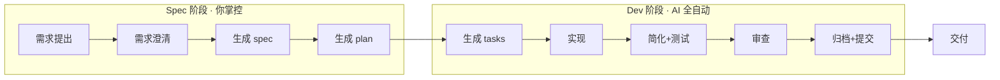

# 工具清册：工作流各阶段可用能力

## 工作流全景



文档按以下维度列出每阶段可用的工具：**工具名** / **来源** / **能力** / **工作方式** / **当前是否自动触发**。

---

## 第一阶段：需求提出 → 需求澄清

| 工具 | 来源 | 能力 | 工作方式 | 自动? |
|---|---|---|---|---|
| `/speckit.specify` | speckit（项目内建） | 从自然语言需求生成结构化 spec | 创建 spec 目录 + 写 spec.md，含用户故事、边界、需求、实体 | 手动触发 |
| `/speckit.clarify` | speckit（项目内建） | 逐条提澄清问题，消除歧义 | 扫描 spec 中模糊/缺失项，一次问一个问题，答完直接写入 spec | speckit.specify handoff |
| `/speckit.constitution` | speckit（项目内建） | 审核/更新 CLAUDE.md 项目章程 | 检查架构规则、工作流、质量门禁是否过时 | 手动触发 |
| `/gstack-office-hours` | gstack | 产品定义、命题挑战、探索替代方案 | 交互式 session，生成结构化设计文档（design doc） | 手动触发 |
| `/domain-modeling` | Matt Pocock | 领域建模（DDD 通用语言） | 从需求提取实体、聚合、限界上下文 | 手动触发 |
| `/ubiquitous-language` | Matt Pocock | 统一术语表管理 | 建立项目通用语言，减少歧义 | 手动触发 |
| `/ask-matt` | Matt Pocock | AI 编程助手问答 | 遇到不确定的问题时咨询 Matt | 手动触发 |

**检查维度**: 需求完整性、功能范围清晰度、边界场景覆盖、术语一致性

---

## 第二阶段：生成 spec → 审核 spec

| 工具 | 来源 | 能力 | 工作方式 | 自动? |
|---|---|---|---|---|
| `/speckit.checklist` | speckit（项目内建） | 按领域生成需求质量检查清单 | 分析 spec/plan/tasks，产出针对需求质量的 checklist 文件 | 手动触发 |
| `/speckit.analyze` | speckit（项目内建） | 跨 artifact 一致性+质量分析 | 读 spec.md + plan.md + tasks.md，报告重复/歧义/遗漏/冲突/章程违规 | 可 handoff |
| `/gstack-plan-ceo-review` | gstack | CEO 视角评审：产品方向、scope、战略合理性 | 交互式评审，支持 scope 扩缩、前提挑战、方案对比 | 手动触发 |
| `/gstack-autoplan` | gstack | 自动串联所有 plan 评审（CEO+Eng+Design+DX） | 按顺序运行全部 review skill，auto-decision 原则决策 | 手动触发 |
| `/to-prd` | Matt Pocock | 交互式面谈生成 PRD | 按模板提问→逐轮确认→输出结构化 PRD | 手动触发 |
| `/to-issues` | Matt Pocock | PRD 拆分为可独立认领的 issue | 按粒度、依赖、标签拆分 | 手动触发 |
| `/design-an-interface` | Matt Pocock | 接口设计多方案生成 | 派并行子 agent 生成多种设计，对比选优 | 手动触发 |

**检查维度**: 产品合理性、scope 适当性、需求完整度（P0-P2 覆盖）、验收场景可测试性

---

## 第三阶段：生成 plan → 审核 plan

| 工具 | 来源 | 能力 | 工作方式 | 自动? |
|---|---|---|---|---|
| `/speckit.plan` | speckit（项目内建） | 从 spec 生成技术方案 plan.md | 写 plan.md（架构/数据流/组件树/API/技术选型）+ data-model.md | speckit.specify handoff |
| `writing-plans` 自审 | superpowers | 完整性、占位符、类型一致性检查 | 写完后自行跑一遍 checklist（不派子 agent） | writing-plans 内置 |
| `writing-plans` reviewer prompt | superpowers | 派子 agent 评审 plan 文档 | 按模板派 agent，检查 completness/spec alignment/task decomposition/buildability | 手动触发 |
| `/gstack-plan-eng-review` | gstack | 工程架构评审：架构、数据流、性能、安全、测试 | 交互式 4 段评审（架构→代码质量→测试→性能），含 outside voice | 手动触发 |
| `/gstack-plan-design-review` | gstack | 设计评审：信息架构、交互、视觉、响应式、无障碍 | 7 passes 评分制，自动生成视觉 mockup + 对比板 | 手动触发 |
| `/gstack-plan-devex-review` | gstack | 开发者体验评审 | 交互式评审开发者体验相关维度 | 手动触发 |
| `/gstack-plan-ceo-review` | gstack | CEO 视角（可复用在 plan 阶段） | 同上 | 手动触发 |
| `/gstack-autoplan` | gstack | 全自动管线（复用） | 同上 | 手动触发 |
| `/grill-me` | Matt Pocock | 方案检讨——被"拷问"你计划的漏洞 | 逐轮追问，直到方案经得起挑战 | 手动触发 |
| `/grill-with-docs` | Matt Pocock | 方案检讨 + 自动更新 CONTEXT.md 和 ADR | 拷问的同时产出文档 | 手动触发 |
| `/codebase-design` | Matt Pocock | 代码库架构设计 | 根据需求设计模块结构和依赖关系 | 手动触发 |
| `/domain-modeling` | Matt Pocock | 领域建模（复用） | 同上 | 手动触发 |

**检查维度**: 架构合理性、数据流完整性、API 设计规范、性能/安全考量、技术选型恰当、DB schema 完整性、错误处理覆盖、测试策略、边界 case

---

## 第四阶段：生成 tasks → 实现

| 工具 | 来源 | 能力 | 工作方式 | 自动? |
|---|---|---|---|---|
| `/speckit.tasks` | speckit（项目内建） | 从 plan 生成可执行 tasks.md | 按 phase + dependency + 并行标记生成 | speckit.plan handoff |
| `/speckit.implement` | speckit（项目内建） | 按 tasks.md 逐任务实现 | TDD 循环 + 质量自检 + 技术债检查 | 手动触发 |
| `subagent-driven-development` | superpowers | 每 task 派独立子 agent 实现 | 新 agent 每 task，实现后 review gate | 手动选择 |
| `executing-plans` | superpowers | 在当前会话逐 task 执行 | 批量执行 + checkpoint | 手动选择 |
| `test-driven-development` | superpowers | TDD 纪律强制执行 | 先写测试→确认失败→实现→确认通过 | 手动触发 |
| `systematic-debugging` | superpowers | 遇 bug 时系统化排查 | 复现→根因→修复→验证 | 遇 bug 时触发 |
| `/gstack-qa` | gstack | Web 应用系统化 QA 测试 | 浏览器自动化测试 + bug 修复 | 手动触发 |
| `/gstack-qa-only` | gstack | 仅 QA 测试（不修复） | 同上，只报告 | 手动触发 |
| `/gstack-browse` | gstack | AI 控制浏览器 | Chromium 自动化 | 手动触发 |
| `/gstack-investigate` | gstack | 问题调查 | 代码+日志+行为分析 | 手动触发 |
| `/gstack-benchmark` | gstack | 性能回归检测 | 基准测试对比 | 手动触发 |
| `/tdd` | Matt Pocock | Red-Green-Refactor TDD 循环 | 先写测试→确认失败→实现→确认通过→重构 | 手动触发 |
| `/implement` | Matt Pocock | 从 PRD/plan 到实现的完整流程 | 按上下文驱动开发，自动拆解任务 | 手动触发 |
| `/prototype` | Matt Pocock | 快速原型开发 | 构建可丢弃的原型用于设计探索 | 手动触发 |
| `/research` | Matt Pocock | 代码库或技术研究 | 深入阅读代码/文档，给出研究报告 | 手动触发 |
| `/diagnosing-bugs` | Matt Pocock | 结构化 bug 诊断 | 复现→最小化→假设→验证→修复 | 遇 bug 时触发 |
| `/triage` | Matt Pocock | Issue 分类排查 | 调查 bug 根因，附带修复方案 | 遇 bug 时触发 |
| `/wayfinder` | Matt Pocock | 代码库导航指引 | 快速定位代码位置和关系 | 手动触发 |
| `/wizard` | Matt Pocock | 多步骤任务向导 | 一步步引导完成复杂任务 | 手动触发 |
| `/resolving-merge-conflicts` | Matt Pocock | 合并冲突解决 | 分析冲突原因并安全解决 | 手动触发 |
| `/improve-codebase-architecture` | Matt Pocock | 代码库架构改进 | 发现架构腐化点并改进 | 手动触发 |
| `/loop-me` | Matt Pocock | 循环执行任务 | 定期重复某个操作 | 手动触发 |
| `/request-refactor-plan` | Matt Pocock | 重构方案请求 | 生成重构计划 | 手动触发 |

**检查维度**: 功能正确性、类型安全、测试覆盖、性能退化、UI 可用性

---

## 第五阶段：简化 + 审查

| 工具 | 来源 | 能力 | 工作方式 | 自动? |
|---|---|---|---|---|
| `simplify` | superpowers（内置） | 消除重复/过度复杂逻辑 | 分析全量变更，重构优化 | Dev 阶段第 3 步 |
| `/gstack-review` | gstack | 代码审查 | 正确性、边界、风格、重复、安全 | Dev 阶段第 5 步 |
| `/gstack-cso` | gstack | 安全审查 | 输入校验、存储、传输、认证、授权 | 涉及数据/网络时 |
| `security-review` | superpowers | 安全审查 | 安全 checklist + 代码扫描 | 手动触发 |
| `requesting-code-review` | superpowers | 代码审查请求 | 派审 reviewer agent | 手动触发 |
| `receiving-code-review` | superpowers | 接收+处理审查意见 | 处理 reviewer 反馈 | 手动触发 |
| `verification-before-completion` | superpowers | 完成前核验 | 检查完整性/测试/文档/commit | 手动触发 |
| `/gstack-design-review` | gstack | 视觉设计审查 | 像素级 UI 审查 | 手动触发 |
| `/gstack-devex-review` | gstack | 开发者体验审查 | DX 维度评审 | 手动触发 |
| `diagram` | superpowers | 图表生成 | Mermaid / Excalidraw | 按需 |
| `/code-review` | Matt Pocock | 代码审查（沿两个轴：代码规范 + 需求匹配） | 并行 sub-agent，逐文件审查 | 手动触发 |
| `/ponytail` | Ponytail | 代码精简模式（lite/full/ultra） | 决策阶梯检查：是否需要→stdlib→平台原生→依赖→一行→最小实现 | Dev 阶段自动启用 |
| `/ponytail-review` | Ponytail | 审查当前 diff 是否过度工程 | 检查未提交变更，给出精简建议 | 手动触发 |
| `/ponytail-audit` | Ponytail | 全仓库扫描 | 扫描整个项目，找出可精简的代码 | 手动触发 |
| `/ponytail-debt` | Ponytail | 技术债务追踪 | 记录并跟踪精简决策留下的技术债 | 手动触发 |
| `/ponytail-gain` | Ponytail | 评估精简效果 | 对比应用 ponytail 前后的代码量变化 | 手动触发 |

**检查维度**: 代码质量、重复/过度工程、安全漏洞、边界覆盖、可观测性、UX

---

## 第六阶段：归档 + 提交

| 工具 | 来源 | 能力 | 工作方式 | 自动? |
|---|---|---|---|---|
| `finishing-a-development-branch` | superpowers | 分支完成决策 | 分析未提交/未推送/PR 状态，建议 merge/PR/cleanup | 手动触发 |
| `/gstack-ship` | gstack | 发布管线 | squash WIP → 代码审查 → PR/MR → merge | 手动触发 |
| `/gstack-land-and-deploy` | gstack | 部署 | PR merge + deploy | 手动触发 |
| `/gstack-document-generate` | gstack | 文档生成 | 生成发布文档 | 手动触发 |
| `/gstack-document-release` | gstack | 发布文档 | 发布说明 | 手动触发 |
| `/gstack-retro` | gstack | 回顾 | 回顾记录 | 手动触发 |

---

## 通用/辅助工具（不限阶段）

| 工具 | 来源 | 能力 | 工作方式 |
|---|---|---|---|
| `/handoff` | Matt Pocock | 对话交接文档 | 将当前对话压缩为交接文档，给另一 agent 继续 |
| `/claude-handoff` | Matt Pocock | Claude 专用交接 | 同上，Claude Code 优化版 |
| `/grilling` | Matt Pocock | 高强度追问模式 | 比 grill-me 更激进的方案挑战 |
| `/teach` | Matt Pocock | 教学模式 | 一步步引导学习某个概念或技术 |
| `/edit-article` | Matt Pocock | 文章编辑 | 技术写作辅助 |
| `/obsidian-vault` | Matt Pocock | Obsidian 笔记库交互 | 与 Obsidian 知识库交互 |
| `/setup-pre-commit` | Matt Pocock | 一键设置 pre-commit | Husky + lint-staged + Prettier + type-check + test |
| `/git-guardrails-claude-code` | Matt Pocock | Git 安全护栏 | 阻止危险 git 命令（push --force、reset --hard 等） |
| `/scaffold-exercises` | Matt Pocock | 练习脚手架生成 | 快速生成编程练习模板 |
| `/migrate-to-shoehorn` | Matt Pocock | 迁移到 Shoehorn 模式 | 代码迁移辅助 |
| `/setup-matt-pocock-skills` | Matt Pocock | 技能偏好设置 | 配置 issue tracker、标签偏好等 |
| `/writing-great-skills` | Matt Pocock | 编写优质技能的指南 | 教你怎么写技能 |
| `/writing-beats` | Matt Pocock | 写作节奏结构 | 文章/文档的节奏组织 |
| `/writing-fragments` | Matt Pocock | 写作片段管理 | 管理可复用的写作片段 |
| `/writing-shape` | Matt Pocock | 写作结构设计 | 文章/文档的结构规划 |
| `/qa` | Matt Pocock | 质量保证检查 | 自动化 QA 检查 |
| `/ponytail-help` | Ponytail | Ponytail 使用帮助 | 显示详细用法和模式说明 |
| `brainstorming` | superpowers | 创意发散与收敛 | 先发散后收敛的结构化头脑风暴 |
| `design-skeptic` | 项目内建（自写） | 设计方案质疑 | 四问法 + 拒绝清单，挑战过度设计 |

---

## 第三方技能速查

### Ponytail — 懒人资深开发者模式

Ponytail 的核心机制是**决策阶梯**：每一步停下问自己，能不走就不走。

```text
① 这东西需要存在吗？ ──No──→ 删除，结束
② 标准库能搞定？    ──Yes─→ 用标准库，结束
③ 浏览器/平台原生？  ──Yes─→ 用原生，结束
④ 已安装的依赖有？  ──Yes─→ 用已有依赖，结束
⑤ 能一行搞定？      ──Yes─→ 写一行，结束
⑥ 写最小可工作实现
```

**使用方式**：安装后默认 auto-trigger，每次 AI 写代码时自动应用。

**三种模式**：

| 模式 | 命令 | 行为 |
| --- | --- | --- |
| Lite | `/ponytail lite` | 提精简建议但不强制 |
| Full | `/ponytail full` | 严格执行决策阶梯（默认） |
| Ultra | `/ponytail ultra` | 激进 YAGNI，质疑你的需求 |

**配套命令**：

| 命令 | 用途 |
| --- | --- |
| `/ponytail-review` | 审查当前未提交 diff 的过度工程 |
| `/ponytail-audit` | 全仓库扫描可精简代码 |
| `/ponytail-debt` | 追踪精简决策留下的技术债 |
| `/ponytail-gain` | 评估应用 ponytail 前后的效果 |
| `/ponytail-help` | 显示完整帮助 |

---

### Matt Pocock Skills 核心工作流

Matt Pocock 的技能组织围绕**4 个 AI 编程常见失败模式**：

| 失败模式 | 解决方案 | 对应技能 |
| --- | --- | --- |
| Agent 没按你想的做 | 写 PRD + 先对齐再编码 | `/to-prd` → `/grill-me` → `/implement` |
| Agent 太啰嗦 | 建立通用语言，精简交互 | `/domain-modeling` → `/ubiquitous-language`，或用 `/handoff` |
| 代码跑不通 | TDD 纪律 + 结构化调试 | `/tdd`（红-绿-重构），`/diagnosing-bugs` |
| 代码库变成泥球 | 定期架构审视和改进 | `/improve-codebase-architecture`，`/codebase-design` |

**推荐的完整开发循环**：

```text
/to-prd         写 PRD
  → /grill-me       拷打方案
  → /design-an-interface  设计接口
  → /implement      实现（自动关联 /tdd）
  → /code-review    代码审查
```

---

## 能力矩阵总览

| 阶段 | speckit | gstack | superpowers / 内置 | Matt Pocock | Ponytail |
| --- | --- | --- | --- | --- | --- |
| **需求提出→澄清** | `specify`, `clarify`, `constitution` | `office-hours` | `brainstorming` | `domain-modeling`<br>`ubiquitous-language`<br>`ask-matt` | — |
| **spec 审核** | `analyze`, `checklist` | `plan-ceo-review`, `autoplan`<br>`plan-design-review` | — | `to-prd`, `to-issues`<br>`design-an-interface` | — |
| **plan 审核** | `plan` | `plan-eng-review`, `plan-design-review`<br>`plan-ceo-review`, `plan-devex-review`<br>`autoplan` | `writing-plans` (自审+agent) | `grill-me`, `grill-with-docs`<br>`codebase-design`, `domain-modeling` | — |
| **生成 tasks→实现** | `tasks`, `implement` | `browse`, `qa`, `qa-only`<br>`investigate`, `benchmark` | `tdd`, `subagent-driven-dev`<br>`executing-plans`<br>`systematic-debugging` | `tdd`, `implement`, `prototype`, `research`<br>`diagnosing-bugs`, `triage`, `wayfinder`<br>`wizard`, `code-review`<br>`resolving-merge-conflicts`<br>`improve-codebase-arch`, `loop-me`<br>`request-refactor-plan` | `ponytail*` |
| **简化+审查** | — | `review`, `cso`, `design-review`<br>`devex-review` | `simplify`, `security-review`<br>`requesting-code-review`<br>`verification-before-completion`<br>`diagram` | `code-review` | `ponytail`, `ponytail-review`<br>`ponytail-audit`, `ponytail-debt`<br>`ponytail-gain` |
| **归档+提交** | — | `ship`, `land-and-deploy`<br>`document-generate`<br>`document-release`, `retro` | `finishing-a-development-branch` | — | — |

*注：ponytail 标记为 `*` 表示 auto-trigger——安装后 AI 代码生成时自动应用其决策规则，无需手动调用。*

---

## 关键发现

1. **speckit 是工作流骨架** — 负责 spec/plan/tasks/implement 的生成和执行
2. **gstack 提供评审能力** — CEO/Eng/Design/DX 评审、QA、代码审查、安全审查
3. **superpowers 提供纪律框架** — TDD、系统调试、subagent 开发、简化、核验
4. **Matt Pocock 技能是开发主力** — 覆盖从 PRD 到代码审查的全流程，尤其 TDD 和实现阶段
5. **Ponytail 自动守护代码精简** — 安装即生效，无需手动调用；配套命令用于审查和审计
6. **所有工具目前都是手动触发** — 没有任何评审是 artifact 产出后自动执行的
7. **speckit 已有 handoff 机制** — `speckit.specify` 可 handoff 到 `speckit.clarify` 和 `speckit.plan`；`speckit.plan` 可 handoff 到 `speckit.tasks` — 但 handoff 链中没有嵌入任何评审步骤
8. **gstack-autoplan 是最接近"一键自动评审"的工具** — 但它仍需手动调用
