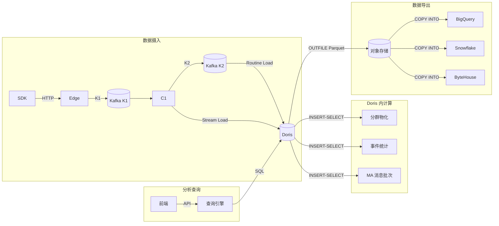

# Apache Doris in SensorsWave (Wave) — 完整调研文档

> **版本**: v1.0 · **更新日期**: 2026-07-07 · **适用范围**: SensorsWave (xray) 项目
>
> 本文档全面介绍 Apache Doris 在 Wave 项目中的设计理念、架构定位、数据模型、访问模式、运维规范及开发约定。
> 目标读者：Wave 项目开发者、数据工程师、运维人员。阅读完本文档后，应能完整理解 Doris 在 Wave 中的全景。

---

## 目录

1. [项目背景与 Doris 定位](#1-项目背景与-doris-定位)
2. [整体架构](#2-整体架构)
3. [数据模型](#3-数据模型)
4. [数据管道](#4-数据管道)
5. [数据访问层](#5-数据访问层)
6. [查询引擎](#6-查询引擎)
7. [配置与部署](#7-配置与部署)
8. [Schema 管理与迁移](#8-schema-管理与迁移)
9. [监控与告警](#9-监控与告警)
10. [Java UDF](#10-java-udf)
11. [开发约定与最佳实践](#11-开发约定与最佳实践)
12. [已知问题与排错](#12-已知问题与排错)
13. [文件索引](#13-文件索引)
14. [附录](#14-附录)

---

## 1. 项目背景与 Doris 定位

### 1.1 Wave 是什么

**SensorsWave (SW)** 是一个企业级用户行为分析平台（同类产品：神策数据、Mixpanel、Amplitude、PostHog），提供端到端的用户分析能力：

- **数据采集** — 通过 Edge 服务以 HTTP 接收来自 20+ SDK（JS、iOS、Android、Flutter、微信小程序等）的用户行为事件
- **ETL** — C1 服务对原始事件进行验证、清洗、身份映射（IDM）、GeoIP 解析
- **分析** — 事件分析、留存分析、漏斗分析、用户分群、用户行为序列、自定义 SQL
- **A/B 测试** — 实验管理、Feature Flag 评估
- **营销自动化** — 活动管理、定时/行为触发触达、Webhook 派发
- **广告归因** — 多模型归因分析、转化追踪
- **数据导出** — 管道至 BigQuery、Snowflake、ByteHouse 等目标系统

### 1.2 Doris 在架构中的角色

```
┌─────────────────────────────────────────────────────────────┐
│                    SensorsWave (Wave)                        │
│                                                              │
│  ┌──────┐   ┌──────┐   ┌──────┐   ┌────────┐   ┌─────────┐ │
│  │ Edge │──▶│  C1  │──▶│ Kafka│──▶│ Doris  │──▶│ Query   │ │
│  │采集  │   │清洗   │   │      │   │ OLAP   │   │ Engine  │ │
│  └──────┘   └──────┘   └──────┘   │ 存储   │   └─────────┘ │
│                                     │        │         │     │
│  ┌─────────┐   ┌──────────┐        └────────┘         │     │
│  │Postgres │   │  Redis   │             │              │     │
│  │元数据   │   │ 缓存/协调│             ▼              │     │
│  └─────────┘   └──────────┘       ┌──────────┐        │     │
│                                    │ 前端 API │◀───────┘     │
│  ┌──────────────────────────┐      └──────────┘              │
│  │ Connector (导出到         │                                │
│  │ BigQuery/Snowflake/...)  │                                │
│  └──────────────────────────┘                                │
└─────────────────────────────────────────────────────────────┘
```

**核心定位**: Doris 是 Wave 中**唯一的分析型 OLAP 引擎**，扮演以下角色：

| 角色 | 说明 |
|------|------|
| ⭐ **主分析数据库** | 所有用户行为事件、用户画像、分析结果都存储在 Doris 中 |
| 📊 **查询引擎后端** | 查询引擎（QE）的所有分析查询直接执行 Doris SQL |
| 🔄 **实时导入目标** | 清洗后的事件/用户数据通过 Routine Load 实时写入 Doris |
| 🏗️ **物化计算平台** | 分群计算、漏斗分析、事件统计等都在 Doris 内完成 |
| 📤 **数据导出源** | Doris OUTFILE 导出 Parquet 到对象存储，供下游系统使用 |

### 1.3 与其他存储系统的分工

| 系统 | 用途 | 与 Doris 的关系 |
|------|------|-----------------|
| **Apache Doris** | OLAP 分析存储 | 行为事件、用户画像、分群、漏斗的**主存储** |
| **PostgreSQL** (x3) | 元数据存储 | 项目配置、事件/用户属性目录、营销活动 CRUD；Doris 不承担事务性工作 |
| **Kafka** | 消息队列 | K1 原始事件 → C1 → K2 清洗后事件 → Doris Routine Load |
| **Redis** | 缓存 + 协调 | QE 查询缓存、MA 延迟队列、速率限制、发布订阅 |
| **对象存储** (MinIO/COS/S3) | 文件存储 | Doris OUTFILE Parquet 导出、Pipeline 数据中转 |
| **BigQuery/Snowflake/ByteHouse** | 导出目标 | 下游数据仓库，从 Doris 经对象存储导入 |

### 1.4 关键设计原则

1. **每个项目一个数据库**: 每个客户项目获得独立 Doris 数据库 `sw_dw_{projectID}`，完全隔离
2. **读写分离**: 每个项目有专用 RO 用户（`sw_dw_r_{pid}`）和 RW 用户（`sw_dw_rw_{pid}`）
3. **实时优先**: 数据通过 Kafka Routine Load 实现秒级实时导入
4. **Schema-on-write**: 新事件/用户属性在发布时自动添加为列（`ALTER TABLE ADD COLUMN`）
5. **计算下推**: 分群、漏斗等分析计算在 Doris 内完成，不搬运数据

---

## 2. 整体架构

### 2.1 服务模块与 Doris 关系

```
cmd/                  # Go 服务入口
├── web/              # API + QE ← 通过 dorisx 读写 Doris
├── edge/             # 事件采集 → Kafka (不直接访问 Doris)
├── c1/               # 数据清洗 → Kafka, 身份映射结果 → Stream Load Doris
├── ma/               # 营销自动化 ← 通过 dorisx 读写 Doris
├── connector/        # 数据导出 ← Doris OUTFILE → 对象存储 → 目标系统
├── abol/             # A/B 测试 (不直接访问 Doris)
├── adtol/            # 广告归因 (不直接访问 Doris)
└── simulator/        # 测试数据生成器 (不直接访问 Doris)
```

**访问 Doris 的服务**: `web`、`ma`、`connector`、`c1` — 均通过共享库 `pkg/dal/dorisx/` 访问。

### 2.2 Doris 集群拓扑

| 环境 | FE/BE 节点 | 部署方式 | 版本 |
|------|-----------|---------|------|
| 开发 (dev) | data01 (FE+BE) | Docker/裸机 | 3.1.3 |
| 生产 (prod) | data01, data02, data03 | 3节点集群 | 3.1.3 |
| 本地开发 | localhost | Docker Compose | 3.1.3 |

生产集群 3 节点（每个节点同时运行 FE 和 BE）:
- `udipper_data01` (10.129.24.84): FE + BE
- `udipper_data02` (10.129.27.100): FE + BE
- `udipper_data03` (10.129.27.207): FE + BE

### 2.3 端口映射

| 端口 | 用途 | 说明 |
|------|------|------|
| 9030 | MySQL 协议 | `go-sql-driver/mysql` 连接，用于 DDL/DML/查询 |
| 8030/8031 | HTTP (FE) | Doris API (查询 profile、kill query、trace ID) |
| 8040 | HTTP (BE) | Stream Load 导入端点、Prometheus metrics |
| 9050 | Thrift (BE) | BE 内部通信 |
| 9060 | Heartbeat (BE) | BE 心跳 |

---

## 3. 数据模型

### 3.1 表清单总览

| 表名 | 模型 | 主键/Key | 分区 | 分桶 | 用途 |
|------|------|---------|------|------|------|
| `raw_events` | UNIQUE KEY | `(time, event_id, distinct_id, trace_id)` | AUTO RANGE MONTH(`time`) | `HASH(distinct_id)` AUTO | 事件数据存储 |
| `raw_users` | UNIQUE KEY | `(ssid)` | 无 | `HASH(ssid)` AUTO | 用户画像 |
| `raw_cohorts` | UNIQUE KEY + MoW | `(cohort_id, ssid, version)` | 无 | `HASH(ssid)` AUTO | 分群成员窄表 |
| `cohort_active_version` | UNIQUE KEY + MoW | `(cohort_id)` | 无 | `HASH(cohort_id)` 1 | 分群版本指针 |
| `raw_event_stat` | UNIQUE KEY + MoW | `(stat_date, event, source_id)` | 无 | `HASH(event)` 1 | 事件预聚合统计 |
| `raw_query_log` | UNIQUE KEY | `(query_id, start_time)` | AUTO RANGE MONTH(`start_time`) | `HASH(query_id)` AUTO | 查询审计日志 |
| `ma_fanout_batch` | DUPLICATE KEY | `(fire_id, ssid)` | LIST(`fire_id`) | `HASH(ssid)` AUTO | MA 消息物化 |
| `cohorts` | VIEW | — | — | — | active cohort 视图 |
| `query_log` | VIEW | — | — | — | 审计日志 + 资源消耗 |
| `events` | VIEW (动态) | — | — | — | 事件 + 属性列 |
| `users` | VIEW (动态) | — | — | — | 用户 + 属性列 |

### 3.2 核心表详解

#### 3.2.1 `raw_events` — 事件数据表

**定位**: Wave 最核心的表，存储所有用户行为事件。数据量大、写入密集、查询模式丰富。

```sql
CREATE TABLE raw_events (
    time          DATETIME(3)    NOT NULL COMMENT '事件时间',
    event_id      INT            NOT NULL COMMENT '事件 ID',
    distinct_id   VARCHAR(128)   NOT NULL COMMENT '用户匿名/登录 ID',
    trace_id      VARCHAR(128)   NOT NULL COMMENT '事件链路追踪 ID',
    anon_id       VARCHAR(128)            COMMENT '匿名 ID',
    login_id      VARCHAR(128)            COMMENT '登录 ID',
    event         VARCHAR(128)   NOT NULL COMMENT '事件名',
    ssid          BIGINT         NOT NULL COMMENT '用户全局 ID',
    received_at   DATETIME(3)             COMMENT '服务端接收时间',
    created_at    DATETIME(3)             COMMENT '记录创建时间',
    updated_at    DATETIME(3)             COMMENT '记录更新时间'
) ENGINE = OLAP
UNIQUE KEY(`time`, `event_id`, `distinct_id`, `trace_id`)
PARTITION BY AUTO PARTITION BY RANGE (date_trunc(`time`, 'month'))
DISTRIBUTED BY HASH(`distinct_id`) BUCKETS AUTO
PROPERTIES (
    "replication_allocation" = "tag.location.default: 3",
    "function_column.sequence_col" = "received_at"
);
```

**设计要点**:

| 设计选择 | 理由 |
|---------|------|
| UNIQUE KEY(4列) | 事件去重：同一时间点同一用户不会上报两个相同事件 |
| sequence_col = `received_at` | Doris 基于此列顺序处理重复行，保证"后到达的覆盖先到达的" |
| 按月 AUTO PARTITION | 时间范围查询剪枝；不需要手动管理分区 |
| `HASH(distinct_id)` | 分桶键匹配查询过滤条件，减少数据扫描 |
| `BUCKETS AUTO` | Doris 自动决定分片数，无需人工干预 |

**动态列**: 事件属性以 `e_{property_name}` 命名、用户属性以 `u_{property_name}` 命名，在 tracking plan 发布时通过 `ALTER TABLE ADD COLUMN` 动态添加。

#### 3.2.2 `raw_users` — 用户画像表

```sql
CREATE TABLE raw_users (
    ssid         BIGINT         NOT NULL AUTO_INCREMENT COMMENT '全局用户 ID',
    login_id     VARCHAR(128)            COMMENT '登录 ID',
    anon_id      VARCHAR(128)            COMMENT '匿名 ID',
    created_at   DATETIME(3)    NOT NULL COMMENT '创建时间',
    updated_at   DATETIME(3)    NOT NULL COMMENT '更新时间',
    aid          BIGINT         NOT NULL AUTO_INCREMENT COMMENT '自增 ID',
    is_deleted   TINYINT        DEFAULT "0" COMMENT '软删除标记'
) ENGINE = OLAP
UNIQUE KEY(`ssid`)
DISTRIBUTED BY HASH(`ssid`) BUCKETS AUTO
PROPERTIES ("replication_allocation" = "tag.location.default: 3");
```

**设计要点**:

| 特性 | 说明 |
|------|------|
| AUTO_INCREMENT | `aid` 和 `ssid` 列使用自增，Doris 3.1 支持 |
| 软删除 | `is_deleted=1` 标记用户删除，Routine Load 使用 MERGE + DELETE ON 语义 |
| 无分区 | 用户表数据量相对小（项目级用户数），单分区即可 |
| 动态列 | `u_{property_name}` 在 tracking plan 发布时动态添加 |

**数据写入**: Routine Load (Kafka K2 → raw_users, MERGE 模式)、Stream Load (身份映射回写)。

#### 3.2.3 `raw_cohorts` — 分群成员表

```sql
CREATE TABLE raw_cohorts (
    cohort_id   BIGINT NOT NULL COMMENT '分群 ID',
    ssid        BIGINT NOT NULL COMMENT '用户 ID',
    version     INT    NOT NULL COMMENT '分群版本'
) ENGINE = OLAP
UNIQUE KEY(`cohort_id`, `ssid`, `version`)
DISTRIBUTED BY HASH(`ssid`) BUCKETS AUTO
PROPERTIES (
    "replication_allocation" = "tag.location.default: 3",
    "enable_unique_key_merge_on_write" = "true"
);
```

**设计要点**: 窄表设计（3 列），每条记录表示一个分群中一个用户在某个版本的成员关系。使用 MoW 避免重复记录堆积。旧版本数据自动被新版本覆盖。通过 `cohort_active_version` 表指向当前活跃版本。

#### 3.2.4 `ma_fanout_batch` — 营销自动化消息批次

```sql
CREATE TABLE ma_fanout_batch (
    fire_id     BIGINT NOT NULL COMMENT '触发 ID',
    ssid        BIGINT NOT NULL COMMENT '用户 ID',
    campaign_id BIGINT NOT NULL COMMENT '活动 ID',
    render_props JSON   NULL    COMMENT '渲染属性'
) ENGINE = OLAP
DUPLICATE KEY(`fire_id`, `ssid`)
PARTITION BY LIST(`fire_id`) ()
DISTRIBUTED BY HASH(`ssid`) BUCKETS AUTO
PROPERTIES ("replication_allocation" = "tag.location.default: 3");
```

**设计要点**:

| 特性 | 说明 |
|------|------|
| DUPLICATE KEY | 追加写模型，不需要去重 |
| LIST 分区 | 按 `fire_id` 分区，每个触发批次独立分区 |
| 动态分区分裂 | 代码通过 `ALTER TABLE ADD PARTITION (PARTITION p{n} VALUES IN (n))` 动态创建 |
| 生命周期 | 批次完成后 DROP PARTITION 清理 |
| JSON 类型 | `render_props` 存储消息渲染参数 |

#### 3.2.5 `raw_event_stat` — 事件预聚合统计

```sql
CREATE TABLE raw_event_stat (
    stat_date  DATE         NOT NULL COMMENT '统计日期',
    event      VARCHAR(128) NOT NULL COMMENT '事件名',
    source_id  BIGINT       NOT NULL DEFAULT 0 COMMENT '来源 ID',
    count      BIGINT       NOT NULL DEFAULT 0 COMMENT '事件计数',
    created_at DATETIME(3)           COMMENT '创建时间',
    updated_at DATETIME(3)           COMMENT '更新时间'
) ENGINE = OLAP
UNIQUE KEY(`stat_date`, `event`, `source_id`)
DISTRIBUTED BY HASH(`event`) BUCKETS 1
PROPERTIES (
    "replication_allocation" = "tag.location.default: 3",
    "enable_unique_key_merge_on_write" = "true"
);
```

#### 3.2.6 `raw_query_log` — 查询审计日志

存储所有通过 QE 执行的分析查询记录，包含请求信息、执行状态、关联的 Doris Query ID。外部表 `__internal_schema.audit_log` 左连接用于获取资源消耗详情。

```sql
CREATE TABLE raw_query_log (
    query_id          VARCHAR(64)          COMMENT '查询 ID',
    start_time        DATETIME(3)          COMMENT '开始时间',
    end_time          DATETIME(3)          COMMENT '结束时间',
    status            VARCHAR(20)          COMMENT '状态',
    query_sql         TEXT                 COMMENT 'SQL',
    err_msg           TEXT                 COMMENT '错误信息',
    cost_time_ms      BIGINT               COMMENT '耗时(ms)',
    account           VARCHAR(64)          COMMENT '账号',
    query_type        VARCHAR(64)          COMMENT '查询类型',
    source_type       VARCHAR(64)          COMMENT '来源类型',
    source_id         BIGINT               COMMENT '来源 ID',
    source_name       VARCHAR(128)         COMMENT '来源名称',
    cache_key         VARCHAR(128)         COMMENT '缓存键',
    cache_hit         BOOLEAN              COMMENT '是否缓存命中',
    api_request       JSON                 COMMENT 'API 请求',
    rewritten_request JSON                 COMMENT '改写后请求',
    events            ARRAY<TEXT>          COMMENT '关联事件',
    cohorts           ARRAY<BIGINT>        COMMENT '关联分群',
    event_properties  ARRAY<TEXT>          COMMENT '事件属性',
    user_properties   ARRAY<TEXT>          COMMENT '用户属性',
    doris_query_id    VARCHAR(48)          COMMENT 'Doris 查询 ID'
) ENGINE = OLAP
UNIQUE KEY(`query_id`, `start_time`)
PARTITION BY AUTO PARTITION BY RANGE (date_trunc(`start_time`, 'month'))
DISTRIBUTED BY HASH(`query_id`) BUCKETS AUTO
PROPERTIES ("replication_allocation" = "tag.location.default: 3");
```

**特别说明**: 该表使用了 Doris 的**半结构化类型**：
- `JSON` 类型存储 API 请求 / 响应
- `ARRAY<TEXT>` / `ARRAY<BIGINT>` 存储关联的事件和分群列表

### 3.3 视图体系

```
┌─────────────────┐     ┌──────────────────────┐
│   cohorts       │     │   query_log           │
│  (活跃分群成员)   │     │  (审计日志 + 资源消耗)  │
│                 │     │                        │
│ raw_cohorts     │     │ raw_query_log          │
│  + JOIN          │     │  + LEFT JOIN           │
│ cohort_active_   │     │  __internal_schema.   │
│ version          │     │  audit_log             │
└─────────────────┘     └────────────────────────┘
        VIEWs                      VIEW

┌─────────────────────────────────────┐
│   events / users                    │
│  (动态重建，随 tracking plan 变化)    │
│                                      │
│ raw_events / raw_users               │
│  + 所有 e_* / u_* 动态列             │
└──────────────────────────────────────┘
        CREATE OR REPLACE VIEW (动态)
```

- `events` / `users` 视图在 tracking plan 发布后自动重建（通过 `view.RefreshView()`）
- `query_log` 视图关联 Doris 内部审计日志获取资源消耗信息（CPU、内存、扫描行数等）

### 3.4 数据模型设计模式

**三种数据模型的选择策略**:

| 模型 | 适用场景 | Wave 中使用 |
|------|---------|------------|
| **UNIQUE KEY** (非 MoW) | 需要去重、频繁更新、但不需要强实时合并 | `raw_events`、`raw_users`、`raw_query_log` |
| **UNIQUE KEY + MoW** (Merge-on-Write) | 需要去重，更新性能要求高，有大量 UPDATE | `raw_cohorts`、`cohort_active_version`、`raw_event_stat` |
| **DUPLICATE KEY** | 纯追加写，不需要去重 | `ma_fanout_batch` |

**选择原则**:
1. 以 **INSERT / UPDATE** 为主 → 用 UNIQUE KEY
2. 小表、更新频繁、需要强一致性 → 用 UNIQUE KEY + MoW
3. 纯追加日志型 → 用 DUPLICATE KEY
4. 没有聚合需求（SUM/MAX/MIN）→ 不用 AGGREGATE KEY

### 3.5 Doris 数据类型使用

| Doris 类型 | 对应物理类型 | 使用场景 |
|-----------|-------------|---------|
| `STRING` | STRING | 事件名、ID、属性值 |
| `VARCHAR(n)` | VARCHAR | 定长标识符（distinct_id、trace_id） |
| `BIGINT` | BIGINT | 数值型 ID、计数 |
| `DOUBLE` | DOUBLE | 浮点数指标 |
| `BOOLEAN` | BOOLEAN | 布尔值属性 |
| `DATETIME(3)` | DATETIME | 时间戳（毫秒精度） |
| `DATE` | DATE | 日期（用于统计表分区） |
| `JSON` | JSON | 半结构化请求/渲染参数 |
| `ARRAY<TEXT>` | ARRAY | 多值标签/列表 |
| `ARRAY<BIGINT>` | ARRAY | 数值 ID 列表 |
| `VARIANT` | VARIANT | 自动推断的属性类型（有已知 bug） |

---

## 4. 数据管道

### 4.1 完整数据流

```
SDK/API                                HTTP/HTTPS
   │
   ▼
┌──────┐     ┌──────────┐     ┌──────────────┐     ┌──────────┐
│ Edge │────▶│  Kafka  │────▶│  C1 (清洗)   │────▶│  Kafka   │
│采集   │     │ K1 原始  │     │ 验证/IDM/GeoIP│     │ K2 清洗后 │
└──────┘     └──────────┘     └──────────────┘     └──────────┘
                                                       │
                                                    ┌──┴───┐
                               ┌────────────────────│ Doris│───────┐
                               │    Routine Load     │      │       │
                               │                     └──┬───┘       │
                               ▼                        ▼           ▼
                          ┌──────────┐          ┌───────────┐ ┌────────────┐
                          │raw_events│          │ raw_users │ │raw_event_  │
                          │          │          │           │ │stat        │
                          └──────────┘          └───────────┘ └────────────┘

Doris OUTFILE (Parquet) ──▶ 对象存储 ──▶ BigQuery / Snowflake / ByteHouse
```

### 4.2 数据摄入链路

| 阶段 | 组件 | 描述 | 模式 |
|------|------|------|------|
| 1 | **SDK** | 20+ 平台 SDK 采集用户行为 | 实时 HTTP |
| 2 | **Edge** | HTTP 网关、鉴权、写入 Kafka K1 | 实时流 |
| 3 | **Kafka K1** | 原始事件 topic: `df_{projectID}_event` / 用户 topic: `df_{projectID}_other` | 消息队列 |
| 4 | **C1** | 消费 Kafka K1 → 验证 → IDM → GeoIP → 属性标准化 → 写 Kafka K2 | 实时流 |
| 5 | **Kafka K2** | 清洗后事件/用户数据 | 消息队列 |
| 6 | **Doris Routine Load** | 消费 Kafka K2 写入 Doris 表 | 实时流 |

### 4.3 Routine Load（核心导入方式）

Routine Load 是 Wave 中最核心的实时数据导入方式。

**事件导入（raw_events）**:
```sql
CREATE ROUTINE LOAD sw_dw_{projectID}.raw_events_job ON raw_events
COLUMNS(time, event_id, distinct_id, trace_id,
        anon_id, login_id, event, ssid,
        received_at, created_at, updated_at)
PROPERTIES ("format" = "json")
FROM KAFKA ("kafka_broker_list" = "broker:9092",
             "kafka_topic"   = "df_{projectID}_event");
```

**用户导入（raw_users，MERGE + DELETE ON）**:
```sql
CREATE ROUTINE LOAD sw_dw_{projectID}.raw_users_job ON raw_users
WITH MERGE
WHERE `is_deleted` = 1
COLUMNS(ssid, login_id, anon_id, created_at, updated_at, is_deleted)
PROPERTIES ("format" = "json")
FROM KAFKA ("kafka_broker_list" = "broker:9092",
             "kafka_topic"   = "df_{projectID}_other");
```

> **注意**: `raw_users` 使用 MERGE 语义 + DELETE ON(is_deleted=1) 实现用户软删除的增量同步。

**创建时机**: 项目创建时 (`project/create.go:initDorisDB()`)  初始化 Routine Load。
**重建设置**: 迁移脚本 `doris_v20260506_raw_users_delete_routine_load.go` 演示了如何在保留 Kafka offset 的情况下重建 Routine Load（暂停 → 重建 → 恢复）。

### 4.4 Stream Load（批量导入）

用于身份映射回写等场景，通过 HTTP API 直接导入。

```go
// pkg/dal/dorisx/stream_loader.go
type StreamLoader struct {
    client    *http.Client
    host      string      // Doris HTTP 端口
    user      string
    password  string
}

func (l *StreamLoader) Load(ctx context.Context, db, table string,
    data []byte, opts ...StreamLoadOption) error
```

**使用场景**: C1 服务的身份映射结果回写 `raw_users`（`apps/c1/idm/backtrack_service.go`）。

**Stream Load 特性**:
- 支持 Merge Type: APPEND / DELETE / MERGE / UPSERT
- 部分列更新（Partial Update）
- Strict Mode / Fuzzy Parse
- Sequence Column 支持

### 4.5 Doris 内部物化流

| 场景 | 描述 | SQL 模式 |
|------|------|---------|
| 分群物化 | 分群定义 → SELECT 用户 → INSERT INTO `raw_cohorts` | INSERT-SELECT |
| 事件统计 | 每日聚合 → INSERT INTO `raw_event_stat` | INSERT-SELECT |
| MA 消息批次 | 触发消息 → INSERT INTO `ma_fanout_batch` | INSERT-SELECT |

这些计算全部在 Doris **内部**完成，数据不离开引擎。

### 4.6 数据导出链路（Doris → 外部）

Connector 服务通过 Doris OUTFILE 实现数据导出：

```
Doris SELECT ... INTO OUTFILE "s3://bucket/..."
  ──▶ Parquet 文件写入对象存储 (COS/S3/MinIO)
       ──▶ BigQuery: COPY INTO
       ──▶ Snowflake: COPY INTO / MERGE INTO
       ──▶ ByteHouse: COPY INTO
```

| 导出类型 | 数据源 | 频率 | 方式 |
|---------|--------|------|------|
| 事件增量 (Event Cron) | Kafka K2 → OSS CSV → 目标 | 每小时 | 增量 |
| 用户增量 (User Cron) | Doris `users` VIEW → OUTFILE Parquet | 每小时 | 增量 |
| 事件全量 (Event Backfill) | Doris `events` VIEW → OUTFILE Parquet | 一次性 | 全量 |
| 用户全量 (User Backfill) | Doris `users` VIEW → OUTFILE Parquet | 一次性 | 全量 |

**OUTFILE 配置示例**:
```go
// apps/connector/service/parquet_helper.go
query := fmt.Sprintf(`SELECT %s FROM %s.%s INTO OUTFILE "s3://%s/%s/"
    FORMAT AS PARQUET
    PROPERTIES (
        "s3.endpoint" = "%s",
        "s3.region" = "%s",
        "s3.access_key" = "%s",
        "s3.secret_key" = "%s",
        "max_file_size" = "1073741824"
    )`, columns, db, table, bucket, path, endpoint, region, key, secret)
```

### 4.7 数据流总结图示



---

## 5. 数据访问层

### 5.1 整体架构

```
pkg/dal/dorisx/
├── doris_pool.go      # 连接池管理者（核心入口）
├── doris_apix.go      # Doris HTTP API 客户端
├── ddl.go             # DDL 操作封装
├── stream_loader.go   # Stream Load 导入
└── doris_pool_test.go # 单元测试
```

**唯一的 Doris 数据访问入口**: 所有服务都通过 `pkg/dal/dorisx` 包访问 Doris，不允许其他方式。

### 5.2 连接池管理 (`doris_pool.go`)

**核心结构**:
```go
type DorisDB struct {
    globalDB     *sqlx.DB              // 全局连接（无数据库，用于 DDL/跨库操作）
    roDbMap      *sync.Map             // 项目只读连接池 map[projectID]*sqlx.DB
    rwDbMap      *sync.Map             // 项目读写连接池 map[projectID]*sqlx.DB
    apiClient    *DorisApiClient       // HTTP API 客户端
    streamLoader *StreamLoader         // Stream Load 客户端
    config       *DorisConfig
    ddlLocks     sync.Map              // 项目级 DDL 锁
}
```

**连接池架构**:
```
                    ┌──────────────────────────────────┐
                    │          DorisDB                  │
                    │                                    │
                    │  globalDB (无数据库)                │
                    │    - DDL: ALTER TABLE...           │
                    │    - 系统查询: SHOW TABLES...       │
                    │                                    │
                    │  roDbMap[projectID] → *sqlx.DB    │
                    │    - QE 查询（只读）                │
                    │    - 每个项目独立池                  │
                    │                                    │
                    │  rwDbMap[projectID] → *sqlx.DB    │
                    │    - 写入操作（物化、统计）          │
                    │    - 每个项目独立池                  │
                    └──────────────────────────────────┘
```

**连接池配置**:
```go
type PoolConfig struct {
    MaxOpen      int           // 最大连接数（默认 10）
    MaxIdle      int           // 最大空闲数（默认 5）
    MaxLifetime  time.Duration // 连接最大生命周期（默认 1h）
    MaxIdleTime  time.Duration // 空闲超时（默认 30m）
    MaxRetries   int           // 查询重试次数（默认 3）
    RetryDelay   time.Duration // 重试间隔（默认 1s）
}
```

**生产环境连接池覆盖** (`configs/web/web.prod.yml`):
```yaml
doris_max_open: 10
doris_max_idle: 5
doris_max_life_second: 3600   # 1 小时
doris_max_idle_time: 1800     # 30 分钟
doris_max_concurrent_queries: 20
```

**DSN 格式**:
```
全局连接: {user}:{password}@tcp({host})/?charset=utf8mb4&parseTime=True&loc=Local
项目连接: {user}:{password}@tcp({host})/{dbName}?charset=utf8mb4&parseTime=True&loc=Local
```

### 5.3 DDL 操作 (`ddl.go`)

提供安全的 Schema 变更封装：

| 方法 | 功能 | 说明 |
|------|------|------|
| `AddColumn` | 添加单列 | `ALTER TABLE ADD COLUMN` |
| `AddColumns` | 批量添加多列 | 内部调用 AddColumn |
| `DropColumn` | 删除列 | `ALTER TABLE DROP COLUMN` |
| `DropColumns` | 批量删除 | 内部调用 DropColumn |
| `ModifyColumn` | 修改列类型 | `ALTER TABLE MODIFY COLUMN` |
| `ModifyColumns` | 批量修改 | 内部调用 ModifyColumn |
| `DropDatabase` | 删除数据库 | 项目删除时调用 |
| `GetColumnType` | 查询列类型 | 查询 information_schema.COLUMNS |
| `GetColumnSet` | 获取表列集合 | 获取全量列名 |
| `TryCreateDorisColumn` | 安全创建列 | 重试 + 状态检测 |

**DDL 序列化**: 每个项目使用独立的 `sync.Mutex` 串行化 DDL 操作，防止多协程同时 ALTER TABLE 导致 `SCHEMA_CHANGE` 冲突。

```go
// ddl.go:199-212
func (d *DDL) tryAddColumn(ctx context.Context, db, table, col, typ string) error {
    lock := d.getDDLLock(projectID)  // 获取项目级 DDL 锁
    lock.Lock()
    defer lock.Unlock()
    // ... 执行 ALTER TABLE ...
}
```

**SCHEMA_CHANGE 重试逻辑** (`TryCreateDorisColumn`):
1. 执行 `ALTER TABLE ADD COLUMN`
2. 如果返回 `SCHEMA_CHANGE` 错误 → 等待 2 秒后重试
3. 最多重试 3 次
4. 成功或非 SCHEMA_CHANGE 错误则退出

### 5.4 HTTP API 客户端 (`doris_apix.go`)

```go
type DorisApiClient struct {
    httpClient *http.Client  // 超时 5 秒
    host       string        // Doris HTTP 端点 (e.g. http://data01:8031)
    authHeader string        // Basic Auth
}
```

| 方法 | API 端点 | 用途 |
|------|---------|------|
| `GetQueryIDByTraceID` | `GET /rest/v2/manager/query/trace_id/{traceId}` | 通过应用 Trace ID 查 Doris Query ID |
| `GetQueryProfileJSON` | `GET /rest/v2/manager/query/profile/json/{queryId}` | 获取查询 Profile 用于性能分析 |
| `KillQuery` | `GET /rest/v2/manager/query/kill/{queryId}` | 终止慢查询 |

### 5.5 Stream Load 客户端 (`stream_loader.go`)

```go
type StreamLoader struct {
    client   *http.Client
    host     string    // Doris HTTP BE 端点
    user     string
    password string
}

func (l *StreamLoader) Load(ctx context.Context,
    db, table string, data []byte, opts ...StreamLoadOption) error
```

**Stream Load 选项** (`StreamLoadOption`):
- `WithColumns(columns)` — 部分列导入
- `WithMergeType(mergeType)` — APPEND / DELETE / MERGE / UPSERT
- `WithStrictMode(bool)` — 严格模式
- `WithTimeZone(tz)` — 时区
- `WithFuzzyParse(bool)` — 模糊解析
- `WithSequenceCol(col)` — 序列列

---

## 6. 查询引擎

### 6.1 查询管理器 (`pkg/qm/`)

```
pkg/qm/
├── query_manager.go    # 查询管理器（核心）
├── query_log.go        # 查询日志 DAO
├── async_batch_writer.go # 异步批量日志写入
└── ......
```

**查询管理器 (`DorisQueryManager`)** 封装了所有面向用户的 Doris 查询：

```go
type DorisQueryManager struct {
    semaphores sync.Map        // 每个项目的并发信号量
    config     DorisQueryConfig
    dorisDB    *dorisx.DorisDB
}
```

**查询执行流程**:
```
前端 → QE Service → queryManager.ExecuteQuery / ExecuteExec
  → 获取项目信号量 (DorisMaxConcurrentQueries, 默认 20)
    → getConnectionWithTrace (从 dorisx 连接池获取连接)
      → SET session_context "trace_id:{queryID}"
      → SET/UNSET time_zone
        → conn.QueryContext / conn.ExecContext
  → 异步写入 raw_query_log
```

**查询日志写入**: 异步批量 (`AsyncBatchWriter`)，实现：
- 批大小 100 条，间隔 1 秒
- 每个项目独立批处理
- 最大 3 次重试，100ms 间隔
- 背压：channel 满时丢弃（不影响查询本身）

### 6.2 QE（Query Engine）层

```
apps/web/qe/
├── executor/           # 查询执行器
│   ├── candidate/      # 候选用户查询
│   ├── event/          # 事件分析查询
│   ├── funnel/         # 漏斗分析查询
│   ├── retention/      # 留存分析查询
│   ├── user_list/      # 用户列表查询
│   └── customsql/      # 自定义 SQL 查询
├── builder/            # SQL 构建器
├── cache/              # Redis 查询缓存
└── ......
```

**构建 Doris SQL 的方式**:
- 使用 `github.com/huandu/go-sqlbuilder`（Doris 方言扩展）
- 调用 `sqlbuilder.Doris.NewSelectBuilder()` 创建
- `sqlbuilder.MySQL.Interpolate()` 插值参数

**查询模式**:

| 模式 | 描述 | 适用场景 |
|------|------|---------|
| 直接 `Exec/Query` | 通过 `dorisx.DB` 执行 | DDL、写入、简单查询 |
| QM + semaphore | 通过 `DorisQueryManager` 带并发控制 | 面向用户的分析查询 |
| GORM | `gorm.io/gorm`（基于 `dorisx` 连接） | `raw_query_log` CRUD |
| Raw SQL + SQLBuilder | 编程式 SQL 构建 | QE 复杂分析查询 |

### 6.3 查询缓存

- 基于 Redis 的查询结果缓存（`CacheService`）
- 缓存键通过查询参数生成（`cache_key` 字段记录在 `raw_query_log`）
- `cache_hit` 字段标识是否命中缓存

### 6.4 查询终止

通过 Doris HTTP API 实现：
1. `KILL QUERY '{queryID}'` — 通过 MySQL 协议发送
2. `GET /rest/v2/manager/query/kill/{queryId}` — 通过 HTTP API

### 6.5 查询错误码

`pkg/errcode/errcode.go` 定义了 Doris 相关错误码：

| 错误码 | 含义 |
|--------|------|
| `ErrDorisQueryTimeout` | 查询超时 |
| `ErrDorisQueryFailed` | 查询执行失败 |
| `ErrDorisConnectionFailed` | 连接失败 |
| `ErrDorisQueryConcurrentLimit` | 达到并发上限 |
| `ErrDorisQueryIDNotFound` | 查询 ID 未找到 |
| `ErrDorisCancelQueryFailed` | 取消查询失败 |
| `ErrDorisSchemaChangeFailed` | Schema 变更失败 |
| `ErrDorisSchemaQueryFailed` | Schema 查询失败 |

---

## 7. 配置与部署

### 7.1 配置层级

```
┌─────────────────────────────────────────────────────────────┐
│ 基础设施配置 (inf.yml) — 所有服务共享                          │
│  ├── doris_host: data01:9030  # MySQL 协议连接               │
│  ├── doris_http_host: http://data01:8031  # HTTP API 端点    │
│  ├── doris_user: root                                         │
│  ├── doris_password: ...                                      │
│  └── doris_database_prefix: sw_dw_                            │
├─────────────────────────────────────────────────────────────┤
│ 应用配置 (web.yml / c1.yml / ...) — 每个服务独立               │
│  ├── doris_max_open: 10        # 连接池最大连接数              │
│  ├── doris_max_idle: 5          # 连接池最大空闲数             │
│  ├── doris_max_life_second: 60  # 连接最大生命周期              │
│  ├── doris_max_idle_time: 30    # 连接空闲超时                  │
│  ├── doris_default_compute_group: "" # 存算分离计算组          │
│  └── doris_max_concurrent_queries: 20 # 并发查询上限           │
├─────────────────────────────────────────────────────────────┤
│ 环境变量覆盖 — 优先级最高                                      │
│  └── DORIS_HOST / DORIS_USER / DORIS_PASSWORD / ...          │
└─────────────────────────────────────────────────────────────┘
```

### 7.2 环境配置对照

| 环境 | Host | HTTP | User | DB 前缀 |
|------|------|------|------|---------|
| dev (dev.yml) | data01:9030 | http://data01:8031 | root | sw_dw_ |
| dev.local | localhost:9030 | http://localhost:8031 | root | sw_dw_ |
| dev.104 | 10.129.25.104:9030 | http://10.129.25.104:8030 | root | sw_dw_ |
| dev.115 | 10.129.26.115:8210 | http://10.129.26.115:8031 | root | sw_dw_ |
| prod | data01:9030 | http://data01:8031 | root | sw_dw_ |
| test | sw.data01:9030 | http://sw.data01:8030 | root | sw_dw_ |

### 7.3 部署拓扑

**Docker Compose（本地开发）**:
```yaml
# deployments/infra.yml
services:
  doris-fe:
    image: apache/doris:fe-3.1.3
    ports: [8030:8030, 9030:9030, 9010:9010]
  doris-be:
    image: apache/doris:be-3.1.3
    ports: [8040:8040, 9060:9060, 9050:9050]
    depends_on: [doris-fe]
```

**生产 3 节点集群**: 通过 `script/doris.sh` 管理启停：
```bash
./script/doris.sh start   # 启动全部 3 节点 FE + BE
./script/doris.sh stop    # 停止全部 3 节点 FE + BE
```

**FE 路径**: `/opt/doris/fe/bin/` · **BE 路径**: `/opt/doris/be/bin/`

### 7.4 数据库与用户命名规范

| 资源 | 命名模式 | 示例 |
|------|---------|------|
| 数据库 | `sw_dw_{projectID}` | `sw_dw_3208` |
| RO 用户 | `sw_dw_r_{projectID}` | `sw_dw_r_3208` |
| RW 用户 | `sw_dw_rw_{projectID}` | `sw_dw_rw_3208` |
| Routine Load (事件) | `raw_events_job` | — |
| Routine Load (用户) | `raw_users_job` | — |
| Kafka topic (事件) | `df_{projectID}_event` | `df_3208_event` |
| Kafka topic (用户) | `df_{projectID}_other` | `df_3208_other` |

**项目初始化流程** (`project/create.go:initDorisDB()`):
1. `CREATE DATABASE IF NOT EXISTS sw_dw_{projectID}`
2. 执行完整 `doris.sql`（创建所有基础表）
3. 创建 `events` / `users` 视图
4. 创建 RO 和 RW 用户并授权
5. 创建 Routine Load 任务

---

## 8. Schema 管理与迁移

### 8.1 迁移框架

```
script/migration/
├── migration.go          # 框架定义（Migration 接口）
├── service.go            # 执行引擎（pending/completed 管理）
└── scripts/
    ├── doris_v20260506_raw_users_delete_routine_load.go
    ├── doris_v20260601_cohort_narrow_migrate.go
    ├── doris_v20260602_event_stat.go
    ├── doris_v20260620_cohort_drop_old.go
    └── doris_v20260706_ma_fanout_batch.go
```

**迁移接口**:
```go
type Migration struct {
    Version string   // doris_v20260706_ma_fanout_batch
    Name    string   // 描述
    DBType  DBType   // DBTypeDoris / DBTypeMeta / DBTypeGlobal
    Up      func(ctx context.Context, d *Dependencies) error
}
```

**DBType 三种类型**:
- `DBTypeDoris` — 对每个项目 Doris 数据库执行
- `DBTypeMeta` — 对项目 PostgreSQL 执行
- `DBTypeGlobal` — 对全局 PostgreSQL 执行

### 8.2 迁移历史

| 版本 | 名称 | 内容 | 影响表 |
|------|------|------|--------|
| `doris_v20260506_raw_users_delete` | 软删除 | 添加 `is_deleted` 列，重建 Routine Load (MERGE + DELETE ON) | `raw_users` |
| `doris_v20260601_cohort_narrow` | 分群窄表 | 宽表→窄表重构，创建 `raw_cohorts_new` + `cohort_active_version`，数据回填，RENAME 切换 | `raw_cohorts`, `cohort_active_version` |
| `doris_v20260602_event_stat` | 事件统计 | 创建 `raw_event_stat` 预聚合表 | `raw_event_stat` |
| `doris_v20260620_cohort_drop_old` | 清理 | 删除旧的宽表 (`cohorts_old`, `raw_cohorts_varchar_ssid_old`, `raw_subjects`) | 多个旧表 |
| `doris_v20260706_ma_fanout_batch` | MA 批次 | 创建 `ma_fanout_batch` LIST 分区表 | `ma_fanout_batch` |

### 8.3 动态 Schema 变更

**Tracking Plan 联动**: 当用户发布 tracking plan 时：

```
1. 用户发布 tracking plan (新增/修改事件属性)
2. catalog_sync.go → 计算属性差异
3. TryCreateDorisColumn(eventID, propName, propType)
   → ALTER TABLE raw_events ADD COLUMN e_{propName} {type}
4. RefreshView() → CREATE OR REPLACE VIEW events
   → 重构视图包含新列
5. 同样处理 raw_users 的 u_* 属性
```

**类型推断流程**:
```
Go 运行时值
  → InferDataAndPhysicalTypes() (pkg/dataflow/util.go)
    → Doris 物理类型 (STRING/BIGINT/DOUBLE/BOOLEAN/DATETIME(3)/ARRAY/VARIANT)
      → ALTER TABLE ADD COLUMN
```

---

## 9. 监控与告警

### 9.1 Prometheus 指标

Web 服务上报 Doris 查询指标:

| 指标名 | 类型 | 标签 | 说明 |
|--------|------|------|------|
| `web_doris_query_duration_seconds_bucket` | Histogram | query_type, operation | 查询耗时分布 |
| `web_doris_queries_total` | Counter | query_type, operation | 查询总数 |
| `web_doris_query_failures_total` | Counter | query_type, operation, reason | 查询失败数 |

**Grafana 面板** (`wave-overview.json`) 包含 3 个 Doris 面板：
- P50 查询延迟
- P99 查询延迟
- 查询失败聚合

### 9.2 Prometheus 采集配置

```yaml
# deployments/prometheus/prometheus.yml
- job_name: "doris"
  metrics_path: "/metrics"
  static_configs:
    - targets:
        - "10.129.24.84:8040"   # data01 BE
        - "10.129.27.100:8040"  # data02 BE
        - "10.129.27.207:8040"  # data03 BE
      labels:
        group: be
```

### 9.3 告警规则

```yaml
# deployments/prometheus/alert-rules.yml
- alert: WebDorisFailureRateHigh
  expr: rate(web_doris_query_failures_total[5m]) /
        rate(web_doris_queries_total[5m]) > 0.05
  for: 5m
  labels:
    alarm_alias: Doris 查询失败率升高
    alarm_level: P2
```

告警条件：Doris 查询失败率连续 5 分钟超过 5%，级别 P2。

### 9.4 健康检查

```go
// doris_pool.go
func (d *DorisDB) HealthCheck(ctx context.Context, projectID string) error {
    db := d.GetProjectDB(projectID)  // 获取项目连接池
    return db.PingContext(ctx)        // 通过 Ping 检测连通性
}
```

---

## 10. Java UDF

### 10.1 概述

Wave 实现了两个自定义 Doris UDF 用于漏斗分析，以 Java UDF 形式部署。

**项目位置**: `doris-udf/` (Maven, Java 17)

**JAR**: `doris-udf-funnel-1.0.4.jar`，发布至 JFrog Artifactory

### 10.2 注册的函数

```sql
-- doris-udf/deploy.sql
CREATE GLOBAL FUNCTION funnel_steps_udf(
    INT, INT, STRING, ARRAY<ARRAY<BIGINT>>
) RETURNS ARRAY<BIGINT>
PROPERTIES (
    "file" = "http://jfrog-internal/.../doris-udf-funnel-1.0.4.jar",
    "symbol" = "com.sensors.wave.funnel.FunnelStepsUDF",
    "type" = "UDAF"
);

CREATE GLOBAL FUNCTION funnel_trends_udf(...) RETURNS ARRAY<ARRAY<BIGINT>>
PROPERTIES (
    "file" = "http://jfrog-internal/.../doris-udf-funnel-1.0.4.jar",
    "symbol" = "com.sensors.wave.funnel.FunnelTrendsUDF",
    "type" = "UDAF"
);
```

| 函数 | 类型 | 输入 | 输出 | 用途 |
|------|------|------|------|------|
| `funnel_steps_udf` | UDAF | (窗口大小, 步长, 时间单位, 事件步序列) | `ARRAY<BIGINT>` | 每个步骤的用户数 |
| `funnel_trends_udf` | UDAF | (窗口, 步长, 单位, 时间范围, 事件序列...) | `ARRAY<ARRAY<BIGINT>>` | 分时段漏斗趋势 |

### 10.3 部署

```bash
cd doris-udf && make build_doris_udf    # Maven 构建
make deploy_doris_udf                    # 发布到 JFrog
# 然后在 Doris SQL 中执行 deploy.sql 注册 UDF
```

---

## 11. 开发约定与最佳实践

### 11.1 编码规范

**连接获取原则**:
```go
// ✅ 正确：通过 dorisx 获取连接
globalDB := dorisx.DB.GetGlobalDB()
roDB := dorisx.DB.GetProjectDB(projectID)
rwDB := dorisx.DB.GetProjectRWDB(projectID)

// ❌ 错误：自行创建连接
db, _ := sql.Open("mysql", dsn)
```

**读写分离原则**:
```go
// 只读查询 → 用项目 RO 连接
rows, _ := dorisx.DB.GetProjectDB(pid).QueryContext(ctx, query)

// 写入操作 → 用项目 RW 连接
dorisx.DB.GetProjectRWDB(pid).ExecContext(ctx, insertSQL)

// DDL / 无数据库操作 → 用全局连接
dorisx.DB.GetGlobalDB().ExecContext(ctx, alterSQL)
```

**DDL 安全原则**:
```go
// ✅ 正确：使用封装方法（内置重试 + 序列化）
ddl := dorisx.NewDDL(dorisx.DB)
err := ddl.TryCreateDorisColumn(ctx, projectID, table, colName, colType)

// ❌ 错误：直接 Exec ALTER TABLE
dorisx.DB.GetGlobalDB().ExecContext(ctx, "ALTER TABLE ... ADD COLUMN ...")
```

### 11.2 库名生成

```go
// ✅ 正确：通过 Database 方法
dbName := dorisx.DB.Database(projectID)  // → "sw_dw_3208"

// ❌ 错误：手写字符串拼接
dbName := fmt.Sprintf("sw_dw_%d", projectID)  // 不灵活，忽略 prefix 配置
```

### 11.3 查询管理

```go
// 面向用户的查询 → 通过 QM（带并发控制 + 审计日志）
queryManager := qm.NewDorisQueryManager(dorisx.DB, config)
result, err := queryManager.ExecuteQuery(ctx, projectID, querySQL)

// 后台任务查询 → 直接通过 dorisx（不带 QM 开销）
rows, err := dorisx.DB.GetProjectDB(pid).QueryContext(ctx, sql)
```

### 11.4 错误处理

```go
// 查询错误分类
if errors.Is(err, context.DeadlineExceeded) {
    // 查询超时
} else if errors.Is(err, context.Canceled) {
    // 查询取消
} else {
    // 一般查询失败
}
```

### 11.5 DDL 锁

> **不要跳过 DDL 锁**。并发 ALTER TABLE 会导致 schema change 冲突。

DDL 锁在 `dorisx.ddl.go` 中通过 `sync.Mutex` 自动实现，按项目 ID 隔离。使用 `TryCreateDorisColumn` / `AddColumn` 等封装方法即可自动获得保护。

### 11.6 表设计原则

| 原则 | 说明 |
|------|------|
| 优先 UNIQUE KEY | 除非明确是纯追加日志，否则用 UNIQUE KEY |
| MoW 择情使用 | 小表、频繁更新 → MoW；大表、按时间覆盖 → 非 MoW |
| AUTO 分区分桶 | 优先用 `AUTO PARTITION` + `BUCKETS AUTO`，让 Doris 自动管理 |
| 3 副本 | 所有表强制 3 副本 |
| 属性列前缀 | 事件属性用 `e_`、用户属性用 `u_` 前缀 |
| 避免过宽表 | tracking plan 属性动态扩展为列，但不设硬上限 |

### 11.7 Routine Load 运维

- Routine Load 创建在项目初始化时完成，不再手动创建
- 重建 Routine Load 时需保留 Kafka offset（参见 `doris_v20260506` 迁移）
- `raw_users` 使用 MERGE + DELETE ON 实现增量软删除
- 常见故障：Kafka 集群变更 → 需更新 Routine Load 的 broker 配置

### 11.8 Stream Load 使用

- 仅用于身份映射回写等需要指定 Merge Type 的场景
- 数据量不大（单次几千条）
- 支持 Partial Update（只更新指定列）

### 11.9 OUTFILE 导出

- 导出路径：对象存储（S3 协议统一接口）
- 格式：Parquet
- 最大文件大小：1024MB（`max_file_size`）
- 注意：VARIANT 列导出 Parquet 有已知 bug（见第 12 节）

---

## 12. 已知问题与排错

### 12.1 VARIANT + OUTFILE + Parquet Bug

**现象**: 当 VARIANT 列所有值均为 NULL 时，Doris OUTFILE 导出 Parquet 报错 `"Subcolumn is not finalized"`。

**影响范围**: Doris 3.1.3

**修复方案**: 导出时对 VARIANT 列做 CAST：
```sql
-- 修复前
SELECT variant_col INTO OUTFILE "s3://..." FORMAT AS PARQUET
-- 修复后
SELECT CAST(variant_col AS STRING) INTO OUTFILE "s3://..." FORMAT AS PARQUET
```

**研究文档**: `docs/research/doris-variant-outfile-finalize-bug.md`

### 12.2 SCHEMA_CHANGE 冲突

**现象**: 并发 `ALTER TABLE ADD COLUMN` 导致 `SCHEMA_CHANGE` 错误。

**原因**: Doris 不允许同一表并发执行 schema change。

**修复**: DDL 操作已通过 `sync.Mutex` 串行化，无需额外处理。如遇到，等 2s 后重试（内置在 `TryCreateDorisColumn` 中）。

### 12.3 Routine Load 堆积

**现象**: Routine Load 任务延迟，Kafka offset 堆积不消费。

**排查步骤**:
1. `SHOW ROUTINE LOAD FOR raw_events_job;` — 查看任务状态
2. `SHOW PROC '/jobs/{db}/routine_load/{jobId}';` — 查看进度和错误
3. 检查 Kafka broker 是否可达
4. 检查是否有 OOM 或 BE 异常

### 12.4 慢查询定位

1. 查询 `raw_query_log` 找到慢查询的 `doris_query_id`
2. 通过 Doris API 获取 Profile:
   ```go
   profile, err := dorisx.DB.ApiClient.GetQueryProfileJSON(ctx, dorisQueryID)
   ```
3. 分析 Profile 确定瓶颈（scan 行数、shuffle 开销等）
4. 在 QE 层适配：增加过滤、调整分桶键、添加物化视图

### 12.5 连接池耗尽

**现象**: `ErrDorisConnectionFailed` 或 SQL 错误 `Too many connections`。

**排查**:
```go
stats := dorisx.DB.GetProjectDB(pid).Stats()
// stats.InUse — 正在使用
// stats.Idle — 空闲
// stats.WaitCount — 等待总数
// stats.WaitDuration — 总等待时间
```

**修复**:
1. 确认 `DorisMaxOpen` 配置是否合理
2. 检查是否有连接泄漏（未关闭的 Rows）
3. 调整 `DorisMaxConcurrentQueries` 降低并发

---

## 13. 文件索引

### 13.1 核心代码

| 文件路径 | 内容 |
|---------|------|
| [`pkg/dal/dorisx/doris_pool.go`](../../pkg/dal/dorisx/doris_pool.go) | 连接池管理者 |
| [`pkg/dal/dorisx/ddl.go`](../../pkg/dal/dorisx/ddl.go) | DDL 操作封装 |
| [`pkg/dal/dorisx/doris_apix.go`](../../pkg/dal/dorisx/doris_apix.go) | HTTP API 客户端 |
| [`pkg/dal/dorisx/stream_loader.go`](../../pkg/dal/dorisx/stream_loader.go) | Stream Load 导入 |
| [`pkg/qm/query_manager.go`](../../pkg/qm/query_manager.go) | 查询管理器 |
| [`pkg/qm/async_batch_writer.go`](../../pkg/qm/async_batch_writer.go) | 异步日志写入 |
| [`pkg/config/inf_cfg.go`](../../pkg/config/inf_cfg.go) | 基础设施配置 |
| [`pkg/config/app_cfg.go`](../../pkg/config/app_cfg.go) | 应用配置 |
| [`pkg/def/meta/doris_type.go`](../../pkg/def/meta/doris_type.go) | 数据类型映射 |

### 13.2 DDL / 数据模型

| 文件路径 | 内容 |
|---------|------|
| [`script/sql/doris/doris.sql`](../../script/sql/doris/doris.sql) | 所有基础表的 DDL |
| [`script/sql/doris/users.sql`](../../script/sql/doris/users.sql) | 用户创建模板 |
| [`script/sql/doris/tables.go`](../../script/sql/doris/tables.go) | Routine Load 模板（Go 内嵌） |

### 13.3 迁移脚本

| 文件路径 | 内容 |
|---------|------|
| [`script/migration/migration.go`](../../script/migration/migration.go) | 迁移框架 |
| [`script/migration/service.go`](../../script/migration/service.go) | 迁移执行器 |
| [`script/migration/scripts/`](../../script/migration/scripts/) | 全部迁移脚本 |

### 13.4 服务集成

| 文件路径 | 内容 |
|---------|------|
| [`apps/web/service/project/create.go`](../../apps/web/service/project/create.go) | 项目创建 → Doris 初始化 |
| [`apps/web/service/view/view.go`](../../apps/web/service/view/view.go) | 动态视图重建 |
| [`apps/web/trackingplan/service/catalog_sync.go`](../../apps/web/trackingplan/service/catalog_sync.go) | Tracking Plan → 动态列 |
| [`apps/connector/service/parquet_helper.go`](../../apps/connector/service/parquet_helper.go) | OUTFILE Parquet 导出 |
| [`apps/c1/idm/backtrack_service.go`](../../apps/c1/idm/backtrack_service.go) | Stream Load 身份映射回写 |

### 13.5 配置 & 部署

| 文件路径 | 内容 |
|---------|------|
| [`configs/inf/inf.yml`](../../configs/inf/inf.yml) | 基础设施配置 |
| [`configs/web/web.yml`](../../configs/web/web.yml) | Web 连接池配置 |
| [`deployments/infra.yml`](../../deployments/infra.yml) | Docker Compose (FE+BE) |
| [`deployments/prometheus/prometheus.yml`](../../deployments/prometheus/prometheus.yml) | Prometheus 采集 |
| [`deployments/prometheus/alert-rules.yml`](../../deployments/prometheus/alert-rules.yml) | 告警规则 |
| [`deployments/grafana/dashboards/wave-overview.json`](../../deployments/grafana/dashboards/wave-overview.json) | Grafana 面板 |

### 13.6 UDF & 工具

| 文件路径 | 内容 |
|---------|------|
| [`doris-udf/pom.xml`](../../doris-udf/pom.xml) | UDF Maven 项目 |
| [`doris-udf/deploy.sql`](../../doris-udf/deploy.sql) | UDF 注册 SQL |
| [`doris-udf/build.sh`](../../doris-udf/build.sh) | UDF 构建脚本 |
| [`script/doris.sh`](../../script/doris.sh) | 集群启停脚本 |

### 13.7 文档

| 文件路径 | 内容 |
|---------|------|
| [`docs/research/doris-variant-outfile-finalize-bug.md`](../../docs/research/doris-variant-outfile-finalize-bug.md) | VARIANT OUTFILE bug 研究 |
| [`docs/architecture.md`](../../docs/architecture.md) | 架构文档 |
| [`docs/glossary.md`](../../docs/glossary.md) | 词汇表 |

---

## 14. 附录

### 附录 A: 关键技术栈与版本

| 技术 | 版本 |
|------|------|
| Apache Doris | 3.1.3 |
| Go | 1.25.0 |
| Go MySQL Driver | `github.com/go-sql-driver/mysql` |
| SQLx | `github.com/jmoiron/sqlx` |
| SQL Builder | `github.com/huandu/go-sqlbuilder` |
| GORM | `gorm.io/gorm` + `gorm.io/driver/mysql` |
| Java (UDF) | 17 |
| Kafka | — (3 broker 集群) |

### 附录 B: 环境清单

| 环境标识 | 配置文件 | Doris 节点 | 用途 |
|---------|---------|-----------|------|
| dev | `inf.dev.yml` | data01 | 开发环境 |
| dev.local | `inf.dev.local.yml` | localhost | 本地开发 |
| prod | `inf.prod.yml` | data01-03 | 生产环境 |
| test | `inf.test.yml` | sw.data01 | 测试环境 |

### 附录 C: Doris 配置项速查

| 配置项 | 类型 | 默认值 | 说明 |
|--------|------|--------|------|
| `doris_host` | string | — | MySQL 协议连接地址 |
| `doris_http_host` | string | — | HTTP API 端点 |
| `doris_user` | string | — | 连接用户名 |
| `doris_password` | string | — | 连接密码 |
| `doris_database_prefix` | string | `sw_dw_` | 数据库前缀 |
| `doris_max_open` | int | 10 | 连接池最大连接数 |
| `doris_max_idle` | int | 5 | 连接池最大空闲数 |
| `doris_max_life_second` | int | 60 | 连接最大生命周期(秒) |
| `doris_max_idle_time` | int | 30 | 空闲超时(秒) |
| `doris_default_compute_group` | string | "" | 存算分离计算组 |
| `doris_max_concurrent_queries` | int | 20 | 每项目最大并发查询数 |

### 附录 D: 常用运维命令

```bash
# 查看 Routine Load 状态
SHOW ROUTINE LOAD FOR raw_events_job;
SHOW ROUTINE LOAD FOR raw_users_job;

# 查看表分区
SHOW PARTITIONS FROM raw_events;

# 查看 Schema Change 进度
SHOW ALTER TABLE COLUMN;

# 终止查询
KILL QUERY '{queryId}';

# 查看 BE 节点状态
SHOW BACKENDS;

# 查看 FE 节点状态
SHOW FRONTENDS;

# 集群启停
./script/doris.sh start
./script/doris.sh stop
```
