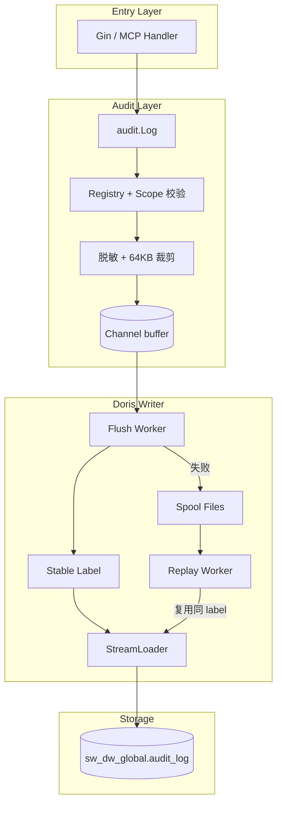
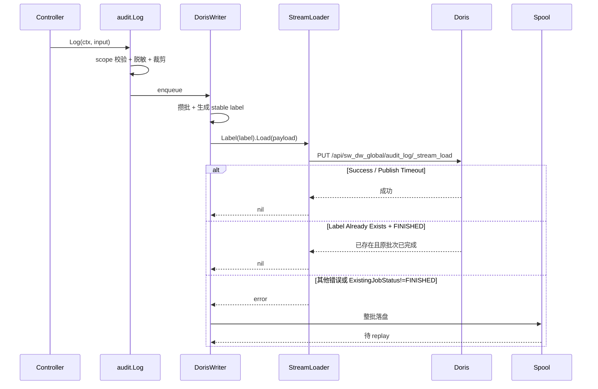

# 概要设计 B：Wave 审计日志（Doris 方案）

| 元数据 | |
|---|---|
| **目录** | `20260626-Wave-Feat-AddAuditLog` |
| **创建日期** | 2026-07-06 |
| **最后更新** | 2026-07-07（按最新 speckit 概要设计重写） |
| **状态** | Reviewing |
| **关联 spec** | [01-spec.md](./01-spec.md) |
| **关联方案** | [03-plan-pg.md](./03-plan-pg.md)（当前整体评审仍偏向 PG） |
| **设计者** | AI 架构师 |
| **产出命名** | `03-plan-doris.md`（多方案，后缀 `-doris` 标识 Doris 方案） |

---

## 1. 背景与目标

### 1.1 要解决什么

本方案与 PG 方案共享同一个产品目标：为 Wave 提供一套可导出、可追溯、能向第三方审计公司解释的审计日志底座。

之所以仍然需要把 Doris 方案独立写实，不是为了“文档上有备选”，而是因为它代表一条真实可落地的技术路径：

- Wave 已经有 Doris 基础设施、连接池、HTTP API 配置，不需要新引中间件
- 审计日志天然是 append-only，和 Doris 的写入模型并不冲突
- 如果评审最终更看重长期保留成本、压缩率和月分区运维便利，Doris 方案可以直接进入实现

### 1.2 成功标准

- **SC-001**: 覆盖 5 个 domain × 25 个 feature 的管理面操作，以及 `logged_in / logged_out / login_failed`
- **SC-002**: 只记录站外客户操作，`source ∈ {ui, api_token}`
- **SC-003**: 主流程附加开销维持在“构造 entry + enqueue”级别，P99 < 5ms
- **SC-004**: 查询与导出必须要求“时间范围 + 范围限定（org / project / account 至少一个）”，避免无界扫描
- **SC-005**: Doris 写入失败时进入本地 spool / replay，不允许静默丢失
- **SC-006**: Doris 方案复用现有 `config.Inf.GetDoris()`、`dorisx.Init()` 与 Doris HTTP Host，不新增第二套 Doris 连接配置
- **SC-007（Doris）**: 在 dev 环境完成一次可重复的 Stream Load 验证：Basic Auth 可用、stable label 可复用、重复 label 的状态判定可解释

### 1.3 本次故意不做

- **不做字段级 `changes[]` diff 引擎**：V1 只记录过滤后的对象摘要
- **不做 actor 快照冗余**：V1 以 `account_id` 为证据主键，显示名读侧 best-effort 补齐
- **不新增独立 Doris 集群或独立 Doris 配置组**：直接复用 Wave 现有 infra 配置
- **不按项目拆成 `sw_dw_{pid}.audit_log`**：这会让账号层、组织层和跨项目导出显著复杂化
- **不为审计日志引入前端页面**：V1 仍以 OpenAPI 导出为主

---

## 2. 领域模型

### 2.1 核心实体

| 实体 | 职责 | 关键属性 | 与其他实体的关系 |
|---|---|---|---|
| `AuditEntry` | 一条不可变的审计证据 | `event_id`、`org_id`、`project_id`、`account_id`、`domain`、`feature`、`action`、`source`、`ip_address`、`detail`、`occurred_at` | 被 `AuditBatch` 聚合写入 |
| `Detail` | 版本化详情 envelope | `schema_version`、`snapshot`、`comment`、`extra` | 内嵌在 `AuditEntry` |
| `AuditScope` | 查询和导出的范围锚点 | `org_id` / `project_id` / `account_id` + `start_time` / `end_time` | 限制 `AuditEntry` 的读取范围 |
| `AuditBatch` | 一批异步写入 Doris 的审计条目 | `label`、`entries`、`retry_count` | 失败后持久化到 `ReplayFile` |
| `ReplayFile` | 批次级失败兜底 | `label`、`entries`、`retry_count`、`updated_at` | 被 replay worker 读取并重放 |

### 2.2 限界上下文

审计日志仍然是一个独立的“观测上下文”：

- **写入边界**：业务成功后显式调用 `audit.Log()`，审计失败不回滚业务
- **读取边界**：查询必须带时间范围，并且必须限定到 org / project / account 的至少一个
- **存储边界**：审计表放在 `sw_dw_global.audit_log`，这是对 Wave“每项目一个 Doris DB”规则的明确例外

### 2.3 通用语言

| 术语 | 定义 | 避免混淆的别名 |
|---|---|---|
| 审计日志 | 面向第三方审计与安全追溯的 append-only 证据链 | 不是活动日志，不是系统运行日志 |
| `sw_dw_global.audit_log` | Doris 侧的统一审计表 | 不是 `sw_dw_{pid}` 项目业务库 |
| stable label | 同一批次初次写入和 replay 必须复用的 Doris Stream Load label | 不是 request id |
| replay batch | 以批次为单位落盘并重放的失败数据 | 不是单条 JSONL |
| `source` | 认证来源，而不是协议入口 | `ui` 包含浏览器 session 和 MCP session；`api_token` 包含普通 API Token 与 MCP Token |
| `snapshot` | 被操作对象的过滤后摘要 | 不是 before/after diff，不是 actor 快照 |

### 2.4 Domain / Feature / Action 完整枚举

与 PG 方案共享同一套枚举模型。所有枚举值在 `service/auditlog/types.go` 中统一定义，未注册的 domain+feature+action 组合在 `Log()` 入口直接拒绝。

**Domain 与 Feature 对照表：**

| Domain | 说明 | Features（共 25 个） |
|---|---|---|
| `account` | 账号层（登录/登出/设置） | `session`, `account_setting`, `api_token` |
| `organization` | 组织层（配置/成员/邀请） | `org_setting`, `org_member`, `org_member_invitation` |
| `project` | 项目层（配置/成员） | `project_setting`, `project_member` |
| `asset` | 项目内资产（CRUD） | `chart`, `dashboard`, `cohort`, `experiment`, `feature_gate`, `feature_config`, `pipeline`, `tracking_plan`, `layer`, `holdout`, `target` |
| `metadata` | 元数据定义（CRUD） | `metric`, `tracked_event`, `virtual_event`, `event_property`, `user_property`, `virtual_property` |

**Action 枚举（共 6 个）：**

| Action | 适用场景 | 说明 |
|---|---|---|
| `created` | 资源创建 | 含复制操作（copy 归为 created，源信息可选写入 detail.extra） |
| `updated` | 资源修改 | 配置变更、状态修改等 |
| `deleted` | 资源删除 | |
| `logged_in` | 登录成功 | 密码 / OAuth / SSO |
| `logged_out` | 登出成功 | |
| `login_failed` | 登录失败 | 不含密码等敏感信息 |

**取值规则：**

- 所有枚举值全小写，字符串类型
- feature 全局唯一，不依赖 domain 上下文消除歧义（如 `org_setting` 和 `project_setting` 都带前缀）
- action 不含 copy（归为 created）、不含状态流转（online/offline/release 等不属于管理面审计范围）
- 未注册的 domain+feature 组合在 `Log()` 入口被拒绝并记 warning metric

---

## 3. 现状与约束

### 3.1 当前架构

通过代码与现有调研确认，Doris 方案的真实上下文如下：

- Wave 中 Doris 是现有 OLAP 基础设施，`apps/web/server.go` 已在启动时调用 `dorisx.Init(...)`
- `config.Inf.GetDoris()` 已提供 `Host / HttpHost / User / Password / DatabasePrefix`
- `dorisx.DB.GetGlobalDB()` 已存在，可用于跨库 DDL 和不绑定项目库的查询
- `dorisx.DB.UseDB(ctx, query)` 会自动拼 `sw_dw_{pid}`，**不适合** `sw_dw_global.audit_log`
- `pkg/dal/dorisx/stream_loader.go` 已能发 Stream Load 请求，也已解析 `Status / Label / ExistingJobStatus`
- 但当前 `StreamLoader` 没有生产调用者，而且认证头使用的是非标准 `Bearer <base64(user:pass)>`（`stream_loader.go:122`），而 `doris_apix.go:105` 使用标准 `Basic` Auth。Phase 0 必须在 dev 验证 `Basic` 是否能正常通过 Doris FE HTTP
- 迁移框架 `script/migration/` 的 `DBType` 只有三种：`DBTypeMeta`（逐项目 PG）、`DBTypeGlobal`（全局 PG）、`DBTypeDoris`（逐项目 Doris）。**不存在针对全局 Doris 库 `sw_dw_global` 的迁移类型**，`audit_log` 表无法通过现有迁移路径创建

### 3.2 约束条件

| 类型 | 约束 | 来源/原因 |
|---|---|---|
| 技术 | 写入必须异步，不能因为审计影响管理面请求时延 | 已确认的产品约束 |
| 技术 | 失败不能静默 drop，必须进入 spool / replay | 审计可靠性要求 |
| 技术 | Doris 方案必须复用现有 Doris infra 配置 | 减少运维面和实现面 |
| 技术 | `sw_dw_global.audit_log` 必须使用全限定表名访问 | `UseDB(ctx, query)` 只适合项目库 |
| 技术 | 同一批 replay 必须复用同一 label | Doris Stream Load label 去重依赖 |
| 技术 | `sw_dw_global.audit_log` DDL 不能通过现有 `DBTypeDoris` 迁移执行 | 迁移框架只支持逐项目遍历，不适合全局单表 |
| 业务 | `domain / feature / target_id` 只有在 scope 内才有意义 | 已确认的查询约束 |
| 业务 | `source` 只保留 `ui / api_token` | 审计关注的是认证来源，不是入口协议 |
| 合规 | detail 里不能泄漏邮箱、token、密钥等敏感字段 | 已确认的脱敏要求 |

### 3.3 规模判断

审计日志和 Wave 主事件库不是一个量级：

- 只记录管理面 CUD + 登录类事件
- 查询与导出都是低频后台操作
- 第三方审计更看重“能解释、能导出、不会静默丢”，不是追求最激进的查询优化

这意味着 Doris 方案应该优先选择**最小但可落地**的路径，而不是 day-1 就为极端扫描性能付出额外复杂度。

---

## 4. 方案设计

### 4.1 Doris 子方案对比

| 对比维度 | 方案 A：全局单表 + 最小 Stream Load 补丁 | 方案 B：全局单表 + 范围优化键模型 | 方案 C：按项目分库分表 |
|---|---|---|---|
| **核心思路** | `sw_dw_global.audit_log` 单表；`DUPLICATE KEY(occurred_at, event_id)`；补齐 label、Basic Auth、重复 label 判定 | 仍是单表，但把 Key 调整为范围导向，例如 `org_id / project_id / occurred_at`，并为 key 列引入哨兵值 | 项目事件放入 `sw_dw_{pid}.audit_log`，账号/组织事件另建全局表或应用层 union |
| **架构方式** | 一条写链路、一张表、一个 replay 模型 | 一条写链路，但 writer 要做 NULL → 哨兵转换、读侧要做反向恢复 | 至少两套表模型，写入路由和读取聚合都更复杂 |
| **接口复杂度** | 小：`audit.Log()` + `StreamLoader.Label()` | 中：除了 `Label()` 还要额外处理 key 兼容、结果恢复 | 高：写入和查询接口都要带分库路由 |
| **实现工作量** | 约 7.5 人天 | 约 9 人天 | 约 11+ 人天 |
| **扩展性** | 足够支撑 V1；后续可先加倒排索引，再考虑改 key | 查询剪枝更好，但 schema 语义更重 | 最贴近 Wave 现有项目库模式，但对跨项目/账号层审计扩展最差 |
| **运维成本** | 低：一张表、月分区、现有 Doris 配置 | 中：多一层哨兵语义和恢复逻辑 | 高：排障时要看多库、多表 |
| **性能影响** | 写入最简单；读侧依赖“时间范围 + scope”约束避免无界扫描 | 范围查询更容易走前缀，但写入/导出逻辑更重 | 写入和读出都更复杂，整体收益不高 |
| **可测试性** | 高：mock HTTP + 一套 DDL 即可覆盖主风险 | 中：需要覆盖哨兵转换和导出恢复 | 低：需要覆盖路由、聚合和跨库导出 |
| **隐藏复杂度** | 主要是 label 幂等与 HTTP 通路验证 | scope 语义与 key 语义耦合，后续很难回退 | 组织层/账号层事件天然不适配“每项目一库” |

### 4.2 推荐方案：方案 A

**推荐方案 A：`sw_dw_global.audit_log` + 最小 Stream Load 补丁。**

选择理由：

1. **它最符合当前任务目标**：用户现在要的是“能拿去评审、能应对第三方审计”的 Doris 方案，而不是极限 OLAP 方案
2. **它最少破坏既有语义**：不需要把 `NULL` scope 改成 `0`，导出语义更干净
3. **它最贴合 Wave 现状**：现有 `GetGlobalDB()` 和 `HttpHost` 足够支撑，不需要引入第二套基础设施抽象
4. **它最好解释**：一张全局表、时间分区、stable label、失败批次 replay，这条链路对研发和审计都容易说清楚

**不选其他 Doris 子方案的理由：**

| 方案 | 当前不选原因 | 何时重新考虑 |
|---|---|---|
| 方案 B | 需要把查询优化提前设计进 key 模型，复杂度高于当前审计场景的真实需要 | 如果上线后确认“带时间范围的 scope 查询”仍然明显偏慢，再先评估倒排索引，最后才考虑改 key |
| 方案 C | 和账号层、组织层事件天然冲突，导出链路会被拆成多表拼接 | 只有当未来产品完全放弃组织层 / 账号层统一审计时才有意义 |

---

## 5. 架构总览

### 5.1 系统架构图



### 5.2 核心数据流



### 5.3 模块深度分析

| 模块 | 当前深度 | 目标深度 | 说明 |
|---|---|---|---|
| `audit.Log()` | — | 深 | 调用方只传业务含义，内部隐藏 scope 校验、脱敏、裁剪、enqueue |
| `DorisWriter` | — | 深 | 对外只暴露 `Start/Stop/Enqueue`，内部封装 batch、label、spool、replay |
| `StreamLoader` | 浅 | 保持浅 | 只补最小能力：`Label()`、Basic Auth 对齐、幂等状态判定 |
| `QueryService` | — | 中 | 负责限定查询范围、拼 SQL、补当前账号名，不额外承担存储抽象 |

---

## 6. 模块影响矩阵

| 模块 | 变更类型 | 影响程度 | 改动要点 | 风险等级 |
|---|---|---|---|---|
| `script/sql/doris/audit_log.sql` | 新增 | 🟢低 | 新增 `sw_dw_global.audit_log` 建库建表 DDL | 低 |
| `pkg/dal/dorisx/stream_loader.go` | 修改 | 🟡中 | 新增 `Label()`；认证头 `Bearer` → `Basic`（`stream_loader.go:122`，与 `doris_apix.go:105` 对齐）；`IsSuccess()` 追加 `Label Already Exists + FINISHED` 判定 | 中 |
| `script/migration/service.go` | 修改 | 🟡中 | 新增 `DBTypeDorisGlobal` 迁移类型，支持对全局 Doris 库执行 DDL（`sw_dw_global` 不在项目循环内） | 中 |
| `pkg/lib/pvctx/pvctx.go` | 修改 | 🟢低 | 增加 `ClientIP()` / `WithClientIP()` 并在 `BackGroundCtx` 中复制 | 低 |
| `pkg/config/app_cfg.go` | 修改 | 🟢低 | 只补审计 writer / spool / replay 配置，不新增 Doris 连接配置 | 低 |
| `apps/web/server.go` | 修改 | 🟢低 | 在 Doris 初始化后启动 audit writer，并在 shutdown 时 drain | 低 |
| `apps/web/metrics/metrics.go` | 修改 | 🟢低 | 新增 audit 指标 factory | 低 |
| `apps/web/service/auditlog/*` | 新增 | 🟡中 | 新增 Doris writer、detail 处理、query、spool、replay | 中 |
| `apps/web/controller/auditlog/audit.go` | 新增 | 🟢低 | 查询与导出 OpenAPI | 低 |
| 13 个 controller 文件 | 修改 | 🟡中 | 在业务成功路径显式调用 `audit.Log()` | 中 |

---

## 7. 接口设计

### 7.1 关键接口

应用层写入接口与 PG 方案保持一致，仍然是“业务成功后显式写审计”：

```go
type LogInput struct {
    Domain     string
    Feature    string
    Action     string
    TargetID   string
    Detail     *Detail
    OccurredAt time.Time
}

func Log(ctx context.Context, input LogInput)
```

本方案新增的 Doris 侧最小接口补丁：

```go
// Label 设置 stable label；同一批次初次写入和 replay 必须复用。
func (s *StreamLoader) Label(label string) *StreamLoader
```

同时约定 `Load()` 的成功语义修正为：

- `Status == "Success"` → 成功
- `Status == "Publish Timeout"` → 视为成功（沿用现有行为）
- `Status == "Label Already Exists" && ExistingJobStatus == "FINISHED"` → 视为幂等成功
- 其他状态 → 失败，交给 writer 落 spool / replay

### 7.2 接口深度分析

- **Interface 大小**：业务写入仍是 1 个 `Log()`；Doris 侧只补 1 个 `Label()` 方法
- **隐藏复杂度**：batch 组装、label 生成、失败落盘、replay 全收敛在 writer 内部
- **可测试性**：`Label()`、`IsSuccess()`、label 生成、spool 回放都可单测；HTTP 路径可用 `httptest` 覆盖

---

## 8. 设计拷问

| # | 挑战 | 回应 | 是否可接受 |
|---|---|---|---|
| 1 | `StreamLoader` 现在零生产调用者，而且认证头和 `doris_apix.go` 不一致，真的能直接用吗？ | 不能直接“盲信可用”。这就是 Doris 方案必须有 Phase 0 验证的原因。文档里把 Basic Auth 对齐和 dev curl 验证列为前置门槛。 | ✅ |
| 2 | 为什么故意违反 Wave”每项目一个 Doris DB”的习惯，单独做 `sw_dw_global`？ | 审计日志天然包含账号层、组织层、跨项目导出；如果按项目拆库，查询和导出会被人为拆碎，复杂度高于收益。作为**显式例外**管理：迁移框架新增 `DBTypeDorisGlobal`，在 `service.go` 中新增 `runDorisGlobalMigration()` 方法独立执行，不改变现有项目迁移流程。 | ✅ |
| 3 | 为什么不把 key 做成 `org_id / project_id / occurred_at`，让范围查询更快？ | 因为当前审计量级远小于主事件库，先保证语义简单和实现清晰更重要。未来慢了，先加索引再改 key。 | ✅ |
| 4 | 不存 actor 快照，会不会影响第三方审计？ | 第三方审计首先看“稳定 actor 标识 + 时间 + 操作 + 对象 + 来源 IP”。V1 以 `account_id` 为主证据，显示名读侧补齐即可；如果未来审计方明确要求“当时名”，再扩展。 | ✅ |
| 5 | `Label Already Exists` 能不能一概视为成功？ | 不能。必须同时检查 `ExistingJobStatus == FINISHED`。如果还是 `RUNNING` 或其他状态，writer 继续按失败路径处理。 | ✅ |
| 6 | 项目异常重启会不会把内存里的审计批次丢掉？ | 会有有限窗口，所以必须在 shutdown 时 drain；异常崩溃仍然存在极小窗口，这也是为什么需要 metrics + spool 目录放持久盘。 | ✅ |

---

## 9. 落地顺序

| Phase | 内容 | 依赖 | 交付物 | 预估时长 |
|---|---|---|---|---|
| **Phase 0（可行性验证）** | dev 环境 curl 验证 Stream Load：Basic Auth、label 重复、HTTP 通路 | 无 | “Doris 直写可用”结论 | 0.5 天 |
| **Phase 1（底座）** | 迁移框架新增 `DBTypeDorisGlobal`、DDL、`StreamLoader` 补丁、writer、spool、replay、metrics | Phase 0 | 审计写入基础能力 | 3 天 |
| **Phase 2（业务接入）** | 13 个 controller 接入 25 个 feature | Phase 1 | 全量审计写入 | 3 天 |
| **Phase 3（查询导出）** | List / Export OpenAPI、PG 补当前名称、导出格式 | Phase 2 | 审计取证能力 | 2 天 |

---

## 10. 风险与 Trade-off

| 风险类型 | 描述 | 概率 | 影响 | 应对措施 |
|---|---|---|---|---|
| 运维 | Doris FE HTTP 通路在 web 服务上未被现网路径证明 | 中 | 中 | Phase 0 先验证；不通过则 Doris 方案暂停 |
| 可靠性 | Doris 长时间不可达导致 spool 积压 | 中 | 中 | spool 放持久盘；暴露 `queue_depth / spool_bytes / oldest_pending_seconds` |
| 性能 | 以 `occurred_at + event_id` 为 key，极宽时间窗下的 scope 查询可能不如 PG | 中 | 低 | 查询强制带时间范围；后续再评估倒排索引或 key 调整 |
| 合规解释 | 不存 actor 快照，导出显示名来自读侧补齐 | 低 | 中 | 明确把 `account_id` 作为主证据字段；显示名仅作展示辅助 |
| 架构 | `sw_dw_global` 打破 Wave"每项目一库"约定，需新增 `DBTypeDorisGlobal` 迁移类型 | 高 | 中 | 显式作为例外管理；在 `script/migration/service.go` 新增 `runDorisGlobalMigration()`，不改变现有项目迁移流程 |
| 复杂度 | Doris 方案仍比 PG 多一层 label / HTTP / replay 语义 | 高 | 中 | 这是 Doris 方案固有代价，因此整体评审仍偏向 PG |

---

## 11. 下一阶段建议

**建议继续维护 Doris 方案的详细设计，不建议现在删除它。**

原因很直接：

- 用户已经明确要求 Doris 方案要能拿去评审选择
- 现有 Wave 确实具备 Doris 落地条件，但关键风险必须在 detail 中展开到函数、DDL、失败路径
- 本方案涉及数据库 schema、异步批量、重试幂等、外部依赖，按最新 speckit 规则必须进入 `04-detail-doris.md`

---

## Quality Gates

- [x] **背景与目标清晰**：问题定义、成功标准、out-of-scope 完整
- [x] **领域模型完整**：核心实体、关系、通用语言已定义
- [x] **代码探索确认**：已确认 Doris init、GlobalDB、UseDB、StreamLoader、HttpHost 的真实现状
- [x] **多方案对比**：至少 2 种 Doris 子方案，且给出明确推荐
- [x] **架构图完整**：包含系统架构图和核心数据流图
- [x] **模块影响明确**：每个受影响模块的改动点与风险等级已标注
- [x] **设计已拷问**：至少 5 个潜在挑战已记录和回应
- [x] **风险已分析**：性能、可靠性、运维、复杂度、合规解释均有评估
- [x] **落地顺序可行**：Phase 0 → Phase 3 依赖关系清楚
- [x] **下一阶段有明确建议**：应进入 [04-detail-doris.md](./04-detail-doris.md)
