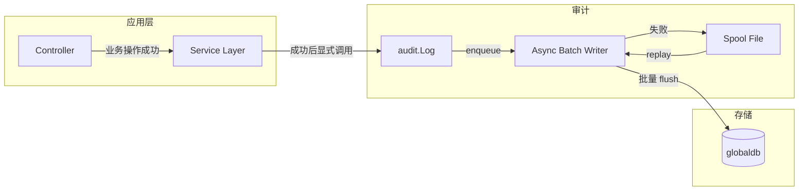
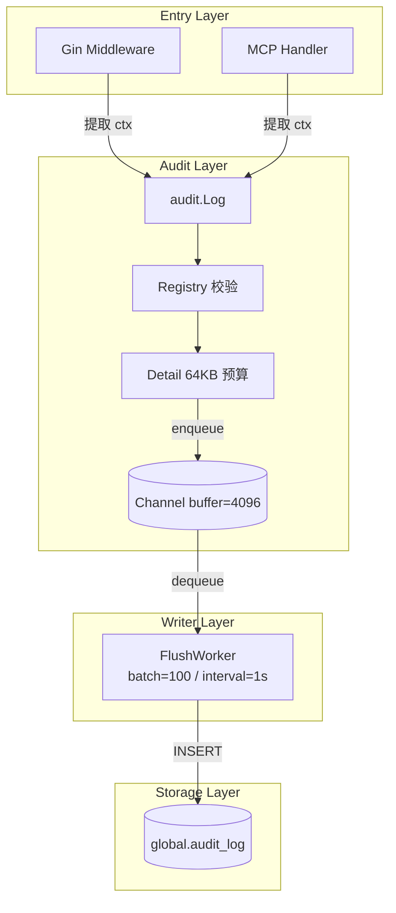
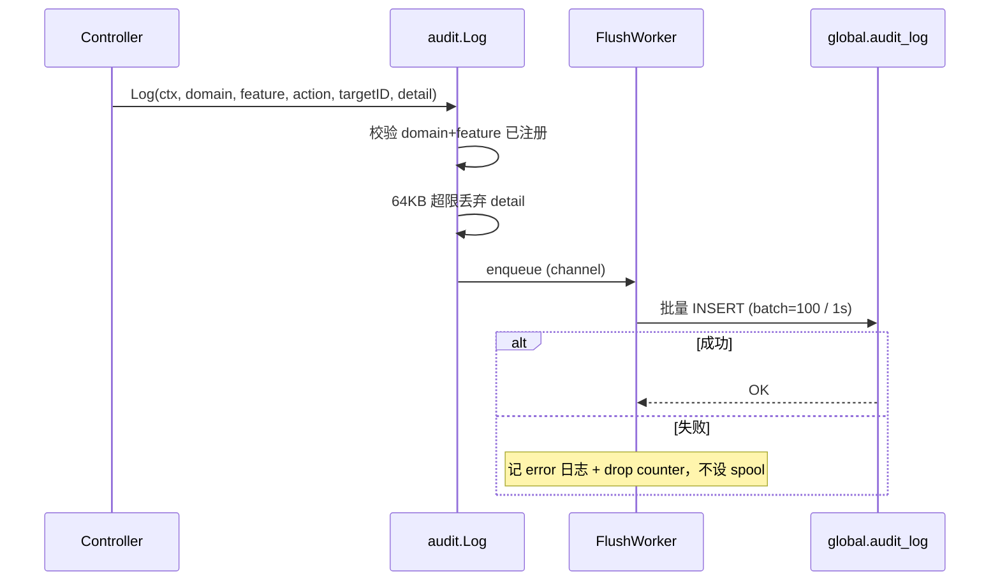

# 概要设计 A：Wave 审计日志（PostgreSQL 方案）

| 元数据 | |
|---|---|
| **目录** | `20260626-Wave-Feat-AddAuditLog` |
| **创建日期** | 2026-07-06 |
| **最后更新** | 2026-07-07（按新模版重写） |
| **状态** | Reviewing |
| **关联 spec** | [01-spec.md](./01-spec.md) |
| **设计者** | AI 架构师 |
| **产出命名** | `03-plan-pg.md`（多方案，后缀 `-pg` 标识 PostgreSQL 方案） |

---

## 1. 背景与目标

### 1.1 要解决什么

Wave 现有四套分散的操作记录系统，各自为政，无法满足第三方合规审计要求：

| 系统 | 位置 | 问题 |
|---|---|---|
| OP Console 操作记录 | `global.op_operation_log` | 仅 OP 管理面，不覆盖项目内操作 |
| AB 操作记录 | `ab_feature_flag.details` JSONB 内嵌 | 无法独立查询、无法跨对象追溯 |
| Metric 历史 | `meta.metric_define_history` | 仅覆盖 define 字段变更 |
| Asset Behavior | `meta.asset_behavior` | 分析用途，非操作记录 |

**核心缺失**：

- 没有全局统一审计表，无法回答"谁在什么时候做了什么"
- 没有 IP 记录，缺乏合规审计基本要素
- 没有明确的保留/归档策略，数据增长不可控
- 缺少导出能力，无法支撑第三方审计

### 1.2 成功标准

- **SC-001**: 审计日志覆盖 5 domain × 25 feature 的管理面操作（created/updated/deleted + logged_in/logged_out/login_failed），完整枚举见 §2.4
- **SC-002**: 仅站外流量写入（source ∈ {ui, api_token, mcp}），内部流量验证不进表
- **SC-003**: 主流程审计附加开销 P99 < 5ms（仅含构造 entry + enqueue）
- **SC-004**: 按 `org/project + time range` 的常规审计查询与导出分页 P99 < 1s
- **SC-005**: 支持 CSV/Excel 导出，通过 OpenAPI 提供
- **SC-006**: channel 满或 PG 不可达时非阻塞丢弃，记 error 日志 + drop counter，不设 spool

### 1.3 本次不解决什么

- **通用 `changes[]` diff 引擎** — V1 只记操作结果，不记字段级变更；后续通过 `detail.changes` 扩展
- **前端审计页面** — V1 仅 OpenAPI 导出，不提供 UI 查看
- **事务内强一致同步写审计** — 审计必须异步，不影响业务主流程
- **`target_id` 单独建复合索引** — 高频查询路径是 `org/project + time range`，`target_id` 在 scoped 范围内过滤即可
- **历史数据迁移** — V1 为全新系统，旧系统保留不动，不做历史迁移

---

## 2. 领域模型

### 2.1 核心实体

| 实体 | 职责 | 关键属性 | 与其他实体的关系 |
|---|---|---|---|
| `AuditEntry` | 一条不可变的审计证据 | event_id, action, domain, feature, target_id, source, ip_address, detail, occurred_at | 每条记录独立，不聚合 |
| `Detail` | 审计详情的版本化 envelope | schema_version, account, target, comment, extra | 内嵌于 AuditEntry |
| `Account` | 操作人的快照（best effort） | id, name? | detail.account 引用；`name` 仅在调用链天然已知时写入，不额外查库 |
| `Target` | 被操作资源的摘要 | id, name, type, +业务字段 | detail.target 引用 |
| `Domain` | 粗粒度领域分类 | account / organization / project / asset / metadata | AuditEntry.domain 枚举 |
| `Feature` | 细粒度实体类型 | session / chart / experiment / ... 共 25 个，完整枚举见 §2.4 | AuditEntry.feature 枚举 |

### 2.2 限界上下文

审计日志是整个系统的**观测上下文**，不隶属于任何业务上下文。它从业务上下文接收事件，但本身不参与业务逻辑：

- **写入边界**：业务 Controller/Service 成功后调用 `audit.Log()`，审计从不回滚业务事务
- **读取边界**：审计查询按层级（组织/项目）隔离，同层用户只能看同层审计数据
- **存储边界**：`global.audit_log` 表独立于业务 schema，使用独立的 `globaldb` 连接

### 2.3 通用语言

| 术语 | 定义 | 避免混淆的别名 |
|---|---|---|
| 审计日志（Audit Log） | 记录"谁在何时通过什么方式对什么资源做了什么操作"的不可变证据链 | 不是活动日志（Activity Log），不是操作日志（Operation Log） |
| 站外流量 | 客户主动发起的请求（ui / api_token / mcp） | 不是 internal / scheduler / backfill 等内部流量 |
| 管理面操作 | 资源的创建、修改、删除动作 | 不是状态流转（如 AB online/offline、Campaign Launch/Pause） |
| snapshot | 操作发生时刻的资源状态快照（"当时名"） | 不是当前名，也不是字段级 diff |
| envelope | 版本化的 detail JSON 容器 | 保持向前兼容，后续只做 add-only 扩展 |

### 2.4 Domain / Feature / Action 完整枚举

审计日志的 `domain` / `feature` / `action` 三字段构成操作分类的主骨架。所有枚举值在 `service/auditlog/types.go` 中统一定义，未注册的 domain+feature+action 组合在 `Log()` 入口直接拒绝。

**Domain 与 Feature 对照表：**

| Domain | 说明 | Features（共 25 个） |
|---|---|---|
| `account` | 账号层（登录/登出/设置） | `session`, `account_setting`, `api_token` |
| `organization` | 组织层（配置/成员/邀请） | `org_setting`, `org_member`, `org_member_invitation` |
| `project` | 项目层（配置/成员） | `project_setting`, `project_member` |
| `asset` | 项目内资产（CRUD） | `chart`, `dashboard`, `cohort`, `experiment`, `feature_gate`, `feature_config`, `pipeline`, `tracking_plan`, `layer`, `holdout`, `target` |
| `metadata` | 元数据定义（CRUD） | `metric`, `tracked_event`, `virtual_event`, `event_property`, `user_property`, `virtual_property` |

**Action 枚举（共 6 个）：**

| Action | 适用场景 | 说明 |
|---|---|---|
| `created` | 资源创建 | 含复制操作（copy 归为 created，源信息可选写入 detail.extra） |
| `updated` | 资源修改 | 配置变更、状态修改等 |
| `deleted` | 资源删除 | |
| `logged_in` | 登录成功 | 密码 / OAuth / SSO |
| `logged_out` | 登出成功 | |
| `login_failed` | 登录失败 | 不含密码等敏感信息 |

**取值规则：**

- 所有枚举值全小写，字符串类型
- feature 全局唯一，不依赖 domain 上下文消除歧义（如 `org_setting` 和 `project_setting` 都带前缀）
- action 不含 copy（归为 created）、不含状态流转（online/offline/release 等不属于管理面审计范围）
- 未注册的 domain+feature 组合在 `Log()` 入口被拒绝并记 warning metric

---

## 3. 现状与约束

### 3.1 当前架构

Wave 现有架构中与审计日志直接相关的部分：

- **上下文字段**：`pkg/lib/pvctx/pvctx.go` 已实现 `Aid() / Pid() / OrgID() / IsAccountAPIToken()` 等鉴权上下文提取方法，但还没有独立的 `audit_source`
- **异步上下文复制**：`BackGroundCtx(ctx)` 已会复制 `pid / aid / token / reqid / traceid / language` 等字段；审计只需在此基础上补 `client_ip` 与 `audit_source`
- **服务生命周期**：`apps/web/server.go` 有明确的 `Init()` → `initService()` → `startServer(graceful)` 启动路径和 `Shutdown` 退出路径
- **批量补名**：`apps/web/service/account/account.go` 已有 `GetAccountNamesMapByIds` 批量批量补当前账号名模式
- **MCP 鉴权**：`apps/web/mcp/server.go` 已注入 `Aid / Token / IsAccountAPIToken / Pid`，但它走的是 `net/http` 而非 gin，需要单独处理 `client_ip` 与 `source = mcp`
- **DAO 路径**：`apps/web/dao/global/` 目录已存在，已有 `account`、`organization`、`project` 等 global DAO
- **全局 schema 与迁移**：`script/sql/pgsql/global.sql` 只负责全新环境 bootstrap；现网增量变更走 `script/migration/scripts/global_v*.sql`
- **Metrics 模式**：`apps/web/metrics/metrics.go` 使用 `metricsx.NewFactory(...)` 创建模块指标

### 3.2 约束条件

| 类型 | 约束 | 来源/原因 |
|---|---|---|
| 技术 | 必须使用 PostgreSQL，不引入新中间件 | 当前推荐方案为 PG，降低运维复杂度 |
| 技术 | 审计必须异步写入，不阻塞业务主流程 | 设计原则 |
| 技术 | 失败不能静默丢弃 | 合规要求 |
| 业务 | V1 需覆盖全部 5 domain × 25 feature | decisions.md 2026-07-07 确认一期全量接入 |
| 运维 | 不设本地 spool | 用户决策 |
| 运维 | 必须暴露 `queue_depth / flush_failed` 等指标并配置告警 | spec NFR-007 |

### 3.3 既有模块依赖分析



> 新增模块（audit.Log / Async Writer / Spool）全部在应用层，不侵入业务核心逻辑。

---

## 4. 方案设计

### 4.1 候选方案对比

| 对比维度 | 方案 A：PostgreSQL | 方案 B：Apache Doris |
|---|---|---|
| **核心思路** | 异步批量写入 `global.audit_log`，`event_id` 唯一约束实现幂等 | 异步攒批通过 Stream Load 写入 Doris，stable label 实现幂等 |
| **架构方式** | GORM/sqlx 直连 PG | Stream Load HTTP PUT 写入 |
| **接口复杂度** | 小 — 标准 SQL INSERT | 中 — 需补 StreamLoader label 能力 |
| **实现工作量** | 底座 2 天 + 接入 3 天 + 导出 2 天 = ~7 天 | 底座 3 天 + 接入 3 天 + 导出 2 天 = ~8 天 |
| **扩展性** | V1 单表，后续可月分区 | 自动月分区，天然适合长期保留 |
| **运维成本** | 低 — 与现有 PG 一致 | 中 — Doris Stream Load 网络通路需验证 |
| **性能影响** | P99 enqueue < 5ms，flush 由后台完成 | 同左 |
| **可测试性** | 高 — 现有单元测试基础设施 | 中 — Stream Load 需网络环境 |
| **隐藏复杂度** | 低 — 标准 PG 操作，团队已熟悉 | 高 — Label 幂等语义、Doris 不可达处理、双存储一致性问题 |

### 4.2 推荐方案：方案 A (PostgreSQL)

**选择理由：**

1. **改动面最小** — Wave 现有 `globaldb`、DAO 模式、账号查询、导出链路均为 PG，审计写入同一数据库无需新增基础设施
2. **幂等语义最干净** — `event_id` 唯一约束 + `ON CONFLICT DO NOTHING`，不需要额外机制
3. **审计解释性最强** — "业务成功后异步入 PG" 容易向第三方审计方说明
4. **查询最简单** — 无需跨存储 JOIN，读侧直接查同一 PG，补 `account_name` 最自然
5. **当前不需要 Doris 的规模优势** — 审计日志仅记录管理面 CUD + 登录事件。按 1000 组织/环境推算，单组织日均 ~500 行，全环境日增 ~50 万行、年存储 ~180GB，PG 单表可承载

**不选其他方案的理由：**

| 方案 | 不选原因 | 什么条件下可能会选 |
|---|---|---|
| Doris | 写链路复杂度上升；Label 幂等需组合 label + event_id 双机制，合规解释成本高；读侧需回 PG 补名；当前没有数据量逼到必须 day-1 上 Doris | 数据量增长到 PG 分区/归档有持续成本压力，或保留周期要求显著变长 |

---

## 5. 架构总览

### 5.1 系统架构图



### 5.2 核心数据流

**写路径（正常）：**

1. 请求进入 gin / MCP → 上下文层提取 `account_id`、`client_ip`、`source`
   gin 根 middleware 默认写入 `source = ui`；`account_api_token` 命中时覆盖为 `api_token`；MCP 入口鉴权完成后显式写入 `source = mcp`
2. Controller/Service 在业务成功后显式调用 `audit.Log(ctx, domain, feature, action, targetID, detail)`
3. `Log()` 校验 domain+feature 已注册 → 64KB 超限丢弃 detail → enqueue 到 channel
4. 后台 FlushWorker 从 channel 批量取出（batch=100 或 interval=1s）
5. 批量 INSERT 到 `global.audit_log`
6. 成功则结束，失败则记 error 日志 + 累加 drop counter（不设本地 spool，极值可接受有限丢失）

**读路径：**

1. 按 `org_id / project_id / account_id + time range` 查询
2. 在 scoped 结果集上追加 `domain / feature / action / target_id` 过滤
3. JOIN `global.account` 补当前 `account_name`
4. 导出 CSV / Excel（通过 OpenAPI）



### 5.3 模块深度分析

| 模块 | 当前深度 | 目标深度 | 说明 |
|---|---|---|---|
| `audit.Log()` | — | 深 | 内部隐藏 registry 校验、裁剪、enqueue；调用方只看到 `Log(ctx, domain, feature, action, targetID, detail)` |
| `FlushWorker` | — | 深 | 内部管理 channel 消费、批量 flush、metrics 上报；对外只暴露 `Start()` / `Stop()` |
| `DAO` | 浅（现有模式） | 保持 | 标准 GORM CRUD，不需要加深 |

---

## 6. 模块影响矩阵

| 模块 | 变更类型 | 影响程度 | 改动要点 | 风险等级 |
|---|---|---|---|---|
| `script/migration/scripts/global_v20260707_audit_log.sql` | 新增 | 🟢低 | 审计表与索引的现网增量 migration | 低 |
| `script/sql/pgsql/global.sql` | 修改 | 🟢低 | 同步 bootstrap 快照，保证全新环境初始化后也有 `audit_log` | 低 |
| `pkg/lib/pvctx/pvctx.go` | 修改 | 🟢低 | 新增 `ClientIP()` / `WithClientIP()` / `AuditSource()` / `WithAuditSource()`；`BackGroundCtx` 补充复制 | 低 |
| `apps/web/config/web_cfg.go` | 修改 | 🟢低 | 新增审计相关配置项（batch size / flush interval / queue size 等） | 低 |
| `apps/web/server.go` | 修改 | 🟢低 | `initService()` 中初始化 writer，Shutdown 中 drain writer | 低 |
| `apps/web/dao/global/audit_log.go` | 新增 | 🟢低 | DAO 层：BatchInsert / List / Export | 低 |
| `apps/web/service/auditlog/*` | 新增 | 🟡中 | audit.Log 函数、registry、writer 核心逻辑 | 可控 |
| `pkg/ginx/middleware/session.go` | 修改 | 🟢低 | 站外 gin 请求默认保留 `source = ui` | 低 |
| `pkg/ginx/middleware/account_api_token.go` | 修改 | 🟢低 | token 鉴权命中时覆盖 `source = api_token` | 低 |
| `apps/web/controller/auditlog/audit.go` | 新增 | 🟢低 | OpenAPI 查询与导出 handler | 低 |
| 13 个 controller 文件 | 修改 | 🟡中 | 每个 controller 在业务成功后加 1-3 行 `audit.Log()` 调用 | 可控 |
| `apps/web/mcp/server.go` | 修改 | 🟢低 | 在鉴权完成后显式赋值 `source = mcp`，并读取 `X-Real-IP`（APISIX 透传）提取 `client_ip` | 低 |

---

## 7. 接口设计

### 7.1 关键接口

#### 写入接口

```go
// Log 记录一条审计日志。异步写入，不阻塞调用方。
// domain + feature 组合必须已在 registry 中注册。
// 内部从 ctx 提取 account_id、client_ip、audit_source，调用方无需关注。
// detail 如超过 64KB 会丢弃 detail 字段并写 warn 日志，审计行本身不丢失。
func Log(ctx context.Context, domain, feature, action, targetID string, detail *Detail)
```

**调用示例：**

```go
// 创建 Chart — 在业务成功后调用
audit.Log(ctx, audit.DomainAsset, audit.FeatureChart, audit.ActionCreated,
    fmt.Sprint(chart.ID), &audit.Detail{
        SchemaVersion: 1,
        Account: &audit.DetailAccount{ID: fmt.Sprint(aid), Name: aname}, // name 为 best effort，不额外查库
        Target: &audit.DetailTarget{ID: fmt.Sprint(chart.ID), Name: chart.Name, Type: "chart"},
    })

// 登录事件 — 在 controller/account 中
audit.Log(ctx, audit.DomainAccount, audit.FeatureSession, audit.ActionLoggedIn,
    "", &audit.Detail{
        SchemaVersion: 1,
        Account: &audit.DetailAccount{ID: fmt.Sprint(account.ID), Name: account.Name},
    })

// 批量更新 — 对象列表放 extra
audit.Log(ctx, audit.DomainProject, audit.FeatureDashboard, audit.ActionUpdated,
    fmt.Sprint(dashboard.ID), &audit.Detail{
        SchemaVersion: 1,
        Account: &audit.DetailAccount{ID: fmt.Sprint(aid), Name: aname},
        Target: &audit.DetailTarget{ID: fmt.Sprint(dashboard.ID), Name: dashboard.Name, Type: "dashboard"},
        Extra: json.RawMessage(`{"chart_ids":[1,2,3]}`),
    })
```

#### 查询接口

```go
// Query 审计日志查询参数
type Query struct {
    OrgID     *int64
    ProjectID *int64
    AccountID *int64
    Domain    string
    Feature   string
    Action    string
    TargetID  string
    StartTime *time.Time
    EndTime   *time.Time
    Cursor    string    // (occurred_at, event_id) 复合游标
    Limit     int       // 默认 50，最大 200
}

// List 返回审计日志列表，使用 cursor 分页
func List(ctx context.Context, q Query) (items []EntryView, nextCursor string, hasMore bool, err error)

// Export 导出为 CSV/Excel，通过 OpenAPI 提供
func Export(ctx context.Context, q Query, format string, w io.Writer) error
```

### 7.2 接口深度分析

- **Interface 大小**：写入接口 1 个函数（Log），查询接口 3 个函数（List / Export / Query 构造），总计 4 个公开函数
- **隐藏的实现复杂度**：Log 内部包含 registry 校验、64KB 超限丢弃、enqueue；调用方无需感知
- **可测试性**：Log 的每个子步骤（校验/64KB 超限处理）可独立单元测试；writer 可通过 mock DAO 测试 flush

---

## 8. 设计拷问

| # | 挑战 | 回应 | 是否可接受 |
|---|---|---|---|
| 1 | PG 单表存审计日志，数据量大了怎么办？ | V1 只记管理面 CUD + 登录事件，无读流量和大 JSON diff，增长可控。如果未来量级真正成问题，先做月分区，再考虑 Doris 镜像或迁移。 | ✅ 可接受 |
| 2 | 异步写入，进程崩溃丢数据怎么办？ | 优雅重启时有 drain 机制基本不丢；`kill -9` / OOM 等异常崩溃存在有限的内存队列丢失窗口。不设本地 spool。合规要求的是"尽力记录"，不是"银行级绝对不丢"。 | ✅ 可接受 |
| 3 | channel 满了怎么办？ | `Log()` 使用 `select + default` 模式：channel 有空位则 enqueue，满了直接丢弃 + error 日志 + drop counter。不设本地 spool。 | ✅ 可接受 |
| 4 | 为什么要单独加 `audit_source`，不能只靠 `IsAccountAPIToken`？ | 因为 `source` 表达的是接入通道，不是认证方式。gin 默认是 `ui`，API Token 覆盖为 `api_token`，MCP 无论底层用 session 还是 token 都应固定为 `mcp`。没有独立字段就无法把 `mcp` 和 `api_token` 区分清楚。 | ✅ 可接受 |
| 5 | 审计写入慢会影响业务吗？ | 主流程只做 enqueue（channel 写入），不等待最终落库。设计目标是 P99 < 5ms。批量 flush 由后台 goroutine 完成，独立于请求路径。 | ✅ 可接受 |
| 6 | 为什么不上全局 GORM callback，而用显式调用？ | GORM callback 在跨 `globaldb` / `metadb` / batch 场景语义过重；难以控制哪些操作入审计、哪些不入。显式调用虽然看起来多写一行，但每处调用都是明确的意图表达。 | ✅ 可接受 |

---

## 9. 落地顺序

| Phase | 内容 | 依赖 | 交付物 | 预估时长 |
|---|---|---|---|---|
| **Phase 0（底座）** | DDL + 配置 + `pvctx.client_ip` + writer + DAO | 无 | 审计日志写入基础能力可用 | 2 天 |
| **Phase 1（全部接入）** | 一期一次性接入 5 domain × 25 feature，覆盖 13 个 controller | Phase 0 | 全部管理面操作落地审计 | 3 天 |
| **Phase 2（导出）** | OpenAPI 查询 + CSV/Excel 导出 + `account_name` 补齐 | Phase 1 | 第三方审计可导出取证 | 2 天 |
| **Phase 3（评估）** | 观察真实数据量，决策是否需要分区/归档/Doris | Phase 2 | 规模化方案 | 持续 |

---

## 10. 风险与 Trade-off

| 风险类型 | 描述 | 概率 | 影响 | 应对措施 |
|---|---|---|---|---|
| 性能 | PG 单表写放大影响业务查询 | 低 | 中 | V1 只保留 3 个高频索引，不提前做写放大 |
| 可靠性 | 进程崩溃导致内存队列数据丢失 | 中 | 低 | 优雅重启 drain 保护；`kill -9` 有限丢失窗口；不设 spool |
| 安全 | IP 获取依赖反向代理透传的 `X-Real-IP`，无 `TrustedProxies` 配置 | 低 | 低 | V1 文档说明 IP 可能不准确，V2 按需引入 TrustedProxies |
| 复杂度 | 13 个 controller 的接入点维护成本 | 中 | 低 | 接入策略不做统一框架，每处显式调用；接入后在 review 中验证 |
| 数据增长 | PG 存储成本随时间线性增长 | 中 | 低 | 先观察真实量级，需要时加月分区；长期成本压力走 Doris 镜像 |

---

## 11. 下一阶段建议

**建议**：`先进入 speckit.detail` — 需进一步细化实现方案

**判断依据**：

- 底座模块（writer / 指标）有较多实现细节需要明确定义
- 异步写入的失败路径和幂等语义需在详细设计中精确描述
- `pvctx.client_ip` 的注入点需结合 Wave 部署拓扑精确定位
- 64KB 超限策略需要实现级定义

---

## Quality Gates

- [x] **背景与目标清晰**：问题定义、成功标准、out-of-scope 完整
- [x] **领域模型完整**：核心实体（AuditEntry / Detail / Account / Target）、通用语言已定义
- [x] **代码探索确认**：已在 review-adaptation.md 中完成 11 项代码级验证
- [x] **多方案对比**：PG vs Doris 两方案，8 维度对比表格 + 选择理由 + 不选理由
- [x] **架构图完整**：包含系统架构图（Mermaid flowchart）和核心数据流（sequence diagram）
- [x] **模块影响明确**：12 个受影响的模块，变更类型和风险等级已标注
- [x] **设计已拷问**：5 个潜在挑战已记录和回应（数据量、崩溃、channel 满、性能、GORM callback）
- [x] **风险已分析**：性能、可靠性、安全、复杂度、数据增长均有评估
- [x] **落地顺序可行**：4 个 Phase 划分合理，依赖关系清楚
- [x] **下一阶段有明确建议**：建议先进入 detail，含判断依据
