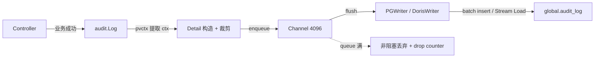

# Plan：Wave 审计日志

**目录**: `20260626-Wave-Feat-AddAuditLog`  
**创建日期**: 2026-07-08  
**状态**: 评审中  
**关联 spec**: [01-spec.md](./01-spec.md)  

---

## 1. 背景与目标

现有操作记录分散在 `op_operation_log` / `metric_define_history` / `asset_behavior` / AB 行内 JSONB，没有统一审计表，无法回答"谁在何时做了什么"。核心缺失：无 IP 记录、无导出能力、无可回溯的集中存储。

核心目标：**本次变更的核心目标是满足第三方合规审计（SOC 2），为 Wave 建立全局统一审计日志系统。**

### 价值定位

1. **合规审计（P0）**：面对 SOC 2 等第三方审计，可导出完整审计日志证明"谁在何时做了什么"
2. **安全追溯（P0）**：关键对象异常变更后可沿审计链定位到具体操作人和来源 IP
3. **组织治理（P1）**：组织管理员可审查成员的管理操作，支撑放权和问责
4. **事故排查（P1）**：排障时可快速回答 who / what / when / where

---

## 2. 范围

### 纳入审计日志

| 层级 | 内容 | 实体 |
|------|------|------|
| 账号层 | 登录/登出/登录失败、账号设置变更、API Token CRUD | Account, AccountAPIToken |
| 组织层 | 组织设置变更、成员 CRUD、邀请 CRUD | Organization, OrgMember, OrgInvite |
| 项目层 | 项目设置变更、项目成员 CRUD | Project, ProjectMember |
| 资产层 | Chart/Dashboard/Cohort/Pipeline/TrackingPlan/AB 对象 CRUD | 共 12 类 asset |
| 元数据层 | Metric/TrackedEvent/VirtualEvent/EventProperty/UserProperty/VirtualProperty CRUD | 共 6 类 metadata |

共 **3 domain × 26 feature**，一期全量接入。

### 不纳入

- 内部流量（internal / scheduler / backfill）
- 各业务内部状态流转（AB online/offline、Metric 口径变更细节、Pipeline 内部回调）
- 读取/查看操作（仅记录状态变更）
- 定时任务/cron 调度

### 设计原则

1. **Append-only**：审计日志不可修改、不可删除
2. **仅站外流量**：只记录客户主动发起的操作（source ∈ {web, openapi, mcp, agent}）
3. **管理面聚焦**：只记录 CUD 操作，不追踪内部状态流转
4. **全局单表**：统一模型 `audit_log`，不再分散在各业务表
5. **异步非阻塞**：主流程不等待最终落库
6. **自由格式 extra**：业务方控制 JSON 内容，无结构化 envelope

---

## 3. 数据流总览

关键路径：

1. **业务操作成功后**，handler/service 显式调用 `audit.Log(ctx, input)`
2. `Log()` 内部校验 domain+feature 组合、从 pvctx 提取 org_id/project_id/account_id/source、构造 detail、64KB 裁剪
3. 非阻塞 enqueue 到 channel，满则丢弃 + drop counter + error 日志（不阻塞主流程）
4. 后台 flush worker（1s/5s ticker）批次写入存储
5. 查询/导出走独立路径，与写路径共享同一套 scope 校验

---

## 4. 存储方案

### 4.1 当前推荐：PostgreSQL

- 表 `global.audit_log`（global schema）
- 改动面最小：复用 globaldb 连接池和 GORM/sqlx 模式
- 幂等最干净：`id`（UUID v7）PK 唯一性保证
- 3 个高频索引 `(project_id, occurred_at DESC)`、`(org_id, occurred_at DESC)`、`(account_id, occurred_at DESC)`

### 4.2 规模验证

| 场景 | 每 org/天 | 1,000 org/年 | PG 存储 | Doris 存储 |
|------|-----------|-------------|---------|-----------|
| CUD + 登录 | ~50 | ~18M 行 | ~18 GB | ~5 GB |
| CRUD + 登录 | ~5,000 | ~1.8B 行 | ~1.8 TB | ~0.5 TB |

**CUD 场景（V1 范围）PG 无压力**：月分区后索引/vacuum 在几千万行级别完全成熟。

### 4.3 未来演进：Apache Doris

条件：当真实数据证明 PG 不够用时（存储成本或查询性能），数据模型已对齐，可平滑迁移：

- PG ↔ Doris 共享同一套应用层代码（`audit.Log()` 签名、detail 结构、查询接口签名）
- Doris 特有工作：自建 Stream Load 客户端（`service/auditlog/doris_stream.go`）、独立 DDL bootstrap
- Doris 提供列存压缩（~3.6x vs PG）、`AUTO PARTITION` 零维护
- 托管方案参考 Aurora / RDS → Doris 的 CDC 同步，但 V1 不做

---

## 5. 核心设计决策

### 5.1 异步写入（非阻塞 + no spool）

- channel 满时直接丢弃 + drop counter + error 日志
- 不设本地 spool：Wave 全库无 spool 基础设施，完整建设需 1-2 天，V1 不值得
- 优雅重启：`Shutdown HTTP → Stop writer (drain 5s) → Close DB`
- 异常崩溃存在有限内存丢失窗口

### 5.2 显式 `audit.Log()` 替代 GORM callback

- 之前的 GORM 全局 callback 方案在 `globaldb` / `metadb` / batch 场景语义过重（~450 行框架 + changes diff 引擎）
- 改为 ~150 行显式调用，每处 handler 加 1-3 行
- `audit.Log()` 签名：`(ctx, Entry{Domain, Feature, Action, TargetID, TargetName, Extra})`（无 org_id/project_id，内部从 pvctx 提取）

### 5.3 Extra 自由格式

- 自由格式 JSON，业务方控制内容，无结构化 envelope
- 单条 2KB 预算，超限截断至前 2KB
- JSON marshal 失败 → error 日志 + 跳过事件（调用方编程错误）
- 调用方不传敏感字段

### 5.4 pvctx 上下文透传

| 上下文 | 来源 | 用途 |
|--------|------|------|
| `client_ip` | gin `c.ClientIP()` / MCP `X-Real-IP` | 合规刚需，满则拒绝审计 |
| `audit_source` | SessionMiddleware → `web`、AccountAPITokenMiddleware → `openapi`、wagent → `agent`、MCP → `mcp` | 站外流量分类 |
| `org_id` | OrganizationFilter + `GetOrgIDByProjectCached` | scope 过滤 |
| `account_id` / `aname` | 认证中间件 | 操作人标识 |

### 5.5 查询接口统一

PG / Doris 共享同一套 controller 层签名：

- `List(ctx, req)` → `{items, next_cursor, has_more}`
- `Export(ctx, req)` → CSV / XLSX 流式下载
- 默认 scope 约束：`OrgID / ProjectID / AccountID` 至少一个必填
- 时间范围必填
- Cursor 模式：基于 `id`（UUID v7），格式 `base64(id)`

---

## 6. 实现阶段

### Phase 0（可行性验证，0.5 天）

仅 Doris 方案需要：在 dev 环境用 curl 验证 Bearer Auth、label 幂等、AUTO PARTITION 可用性。未通过则 Doris 方案不进入实现。

### Phase 1（底座 + 全量接入）

| 步骤 | 内容 | 涉及文件 |
|------|------|---------|
| 1 | pvctx 扩展（ClientIP / AuditSource / OrgID / Aname 补齐） + BackGroundCtx | `pkg/lib/pvctx/pvctx.go` |
| 2 | audit writer 核心 + channel + extra 截断 | `service/auditlog/audit.go`, `extra.go`, `writer_pg.go` |
| 3 | 数据库初始化（PG migration / Doris bootstrap） | `migration/scripts/`, `doris_global.sql` |
| 4 | 13 个 controller + MCP 接入 `audit.Log()` | 各 controller 文件 |
| 5 | 查询 + 导出接口 | `controller/auditlog/`, `query_pg.go` |
| 6 | 指标 + 监控 | `metrics/metrics.go` |

### Phase 2（导出）

OpenAPI 导出（CSV / XLSX），可独立上线。

---

## 7. 文件影响清单

### 新增文件

| 文件 | 属于 |
|------|------|
| `script/migration/scripts/global_v20260707_audit_log.sql` | PG |
| `script/sql/pgsql/global.sql`（同步更新 DDL） | PG |
| `script/sql/doris/audit_log.sql` | Doris |
| `apps/web/service/auditlog/audit.go` | 公共 |
| `apps/web/service/auditlog/extra.go` | 公共 |
| `apps/web/service/auditlog/writer_pg.go` | PG |
| `apps/web/service/auditlog/doris_stream.go` | Doris |
| `apps/web/service/auditlog/writer_doris.go` | Doris |
| `apps/web/service/auditlog/query.go` | 公共（接口签名） |
| `apps/web/dao/global/audit_log.go` | PG |
| `apps/web/controller/auditlog/audit.go` | 公共 |

### 修改文件

| 文件 | 改动量 | 说明 |
|------|--------|------|
| `pkg/lib/pvctx/pvctx.go` | +~30 行 | 新增 ClientIP/AuditSource/OrgID 方法 |
| `apps/web/server.go` | +~20 行 | Writer 生命周期管理 |
| `apps/web/config/web_cfg.go` | +~10 行 | 审计配置项 |
| `apps/web/metrics/metrics.go` | +~5 行 | audit Factory |
| `pkg/ginx/middleware/session.go` | +~2 行 | source = web（默认） |
| `pkg/ginx/middleware/account_api_token.go` | +~5 行 | source = openapi + 补齐 Aname |
| `pkg/ginx/middleware/organization.go` | +~5 行 | 扩大 org_id 注入 |
| `apps/web/mcp/server.go` | +~5 行 | source = mcp + client_ip |
| `apps/web/server.go`（wagent 路由中间件） | +~5 行 | source = agent，路径前缀 `/api/wagent/` 检测 |
| 13 个 controller 文件 | 各 +1-3 行 | `audit.Log()` 调用 |

---

## 8. 关键风险

| 风险 | 概率 | 影响 | 预防 |
|------|------|------|------|
| channel 满导致写入丢弃 | 低 | 中 | 监控 `web_audit_queue_depth`，扩容 queue |
| PG 不可用导致审计行丢弃 | 低 | 中 | 3 次重试 + error 日志 + drop counter |
| extra 超限截断 | 极低 | 低 | 2KB 预算，正常 extra < 100B |
| IP 不准确（无 TrustedProxies） | 中 | 低 | V1 文档说明限制，V2 按需引入 |

### 补偿策略

| 场景 | 可重试 | 策略 |
|------|--------|------|
| PG INSERT 失败 | ✅ | 3 次 + 指数退避，仍失败则丢弃 |
| Doris Stream Load 失败 | ❌ | 非阻塞丢弃 + drop counter |
| 重复 label（Doris） | 无需 | 自然幂等（check ExistingJobStatus） |
| channel 满 | ❌ | 非阻塞丢弃 |
