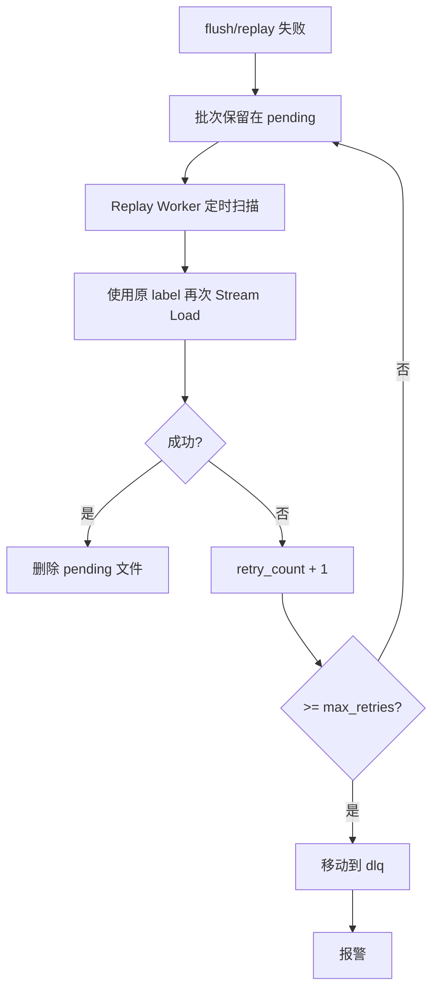
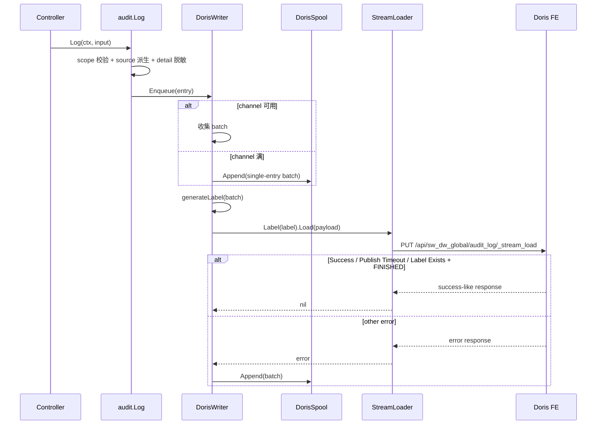

# 详细设计 B：Wave 审计日志（Doris 方案）

| 元数据 | |
|---|---|
| **目录** | `20260626-Wave-Feat-AddAuditLog` |
| **创建日期** | 2026-07-06 |
| **最后更新** | 2026-07-07（按最新 speckit 详细设计重写） |
| **状态** | Reviewing |
| **关联 spec** | [01-spec.md](./01-spec.md) |
| **关联 plan** | [03-plan-doris.md](./03-plan-doris.md) |
| **设计者** | AI 架构师 |
| **产出命名** | `04-detail-doris.md`（多方案，后缀 `-doris` 标识 Doris 方案） |

---

## 1. 背景承接

### 1.1 回顾

[03-plan-doris.md](./03-plan-doris.md) 已将 Doris 方案收敛为：

- 单表：`sw_dw_global.audit_log`
- 单写链路：业务成功后显式 `audit.Log()`，后台异步攒批 Stream Load
- 单兜底模型：批次级 spool / replay，复用 stable label
- 最小补丁：只在 `pkg/dal/dorisx/stream_loader.go` 上补足 Doris 审计写入真正需要的能力

整体设计目标不是“让 Doris 看起来更强”，而是做出一套**真的能按 Wave 现状落地**、同时又不会为了审计把代码写重的方案。

### 1.2 本详细设计聚焦的实现问题

- `sw_dw_global.audit_log` 的 DDL 如何定义，才能既可执行又不引入多余语义负担
- `StreamLoader` 最小应该改什么，才能支撑 stable label、Basic Auth、幂等重放
- queue 满、Doris 不可达、重复 label、异常重启等失败路径怎样处理才不静默丢
- 不存 actor 快照时，读侧如何导出一份仍然能给审计公司使用的结果
- Doris 查询如何避免无界扫描，同时不把 Doris key 设计提前做重

---

## 2. 一致性校验

### 2.1 Spec vs Plan

| 校验项 | 状态 | 说明 |
|---|---|---|
| P0 用户故事与方案目标 | ✅ 匹配 | 第三方审计导出、安全追溯、组织治理都被覆盖 |
| “主流程必须异步” | ✅ 匹配 | 仍然是 enqueue + 后台 flush |
| 失败不能静默丢 | ✅ 匹配 | Doris 方案保留 spool / replay |
| `source` 与 detail 文案 | ⚠️ 需按实现修正 | 当前 `01-spec.md` 中仍残留 `mcp` 作为独立 `source`、以及 actor 快照文案；本详细设计按当前评审收敛为 `ui / api_token` 与 `snapshot/comment/extra` |

### 2.2 Plan vs 代码现实

| 假设 | 验证结果 | 备注 |
|---|---|---|
| Web 服务已初始化 Doris 连接 | ✅ 已确认 | `apps/web/server.go` 已调用 `dorisx.Init(...)` 与 `dorisx.InitDorisApiClient(...)` |
| 存在可跨库查询/DDL 的 Doris 连接 | ✅ 已确认 | `dorisx.DB.GetGlobalDB()` 可直接使用 |
| `UseDB(ctx, query)` 可直接服务审计全局表 | ❌ 不成立 | 它会拼接 `sw_dw_{pid}`，不适用于 `sw_dw_global` |
| `StreamLoader` 已能解析 Stream Load 状态 | ✅ 已确认 | 已有 `Status`、`Label`、`ExistingJobStatus` 字段 |
| `StreamLoader` 可直接用于审计写入 | ⚠️ 部分成立 | 还缺 `Label()`；认证头和项目里其他 Doris HTTP 调用不一致 |
| `sw_dw_global` DDL 可通过迁移框架执行 | ❌ 不成立 | `DBTypeDoris` 只支持逐项目遍历（`sw_dw_{pid}`），`DBTypeGlobal` 指向全局 PG。必须新增 `DBTypeDorisGlobal` 类型 |
| Doris 写入一定要用哨兵值代替 NULL | ❌ 不成立 | Wave 现有 Doris 表与 Doris 官方能力都允许非 key 列为 NULL，本方案移除全量哨兵转换假设 |

### 2.3 修正记录

- **修正 1：`source` 不再存 `mcp`**
  - MCP 是入口协议，不是独立认证来源
  - 统一规则：`pvctx.IsAccountAPIToken(ctx) == true` → `api_token`，否则 `ui`

- **修正 2：detail 不再存 actor 快照**
  - V1 只保留 `snapshot / comment / extra`
  - 审计证据主键是 `account_id`，显示名读侧补齐

- **修正 3：放弃“Doris 全字段哨兵值”**
  - 单表 key 选 `occurred_at + event_id`，不把 `org_id / project_id` 强行塞进 key
  - 这样不需要把 NULL 语义改写成 `0 / ""`

- **修正 4：不新增 Doris 审计专用连接配置**
  - Doris 连接与 HTTP Host 全部复用 `config.Inf.GetDoris()`

- **修正 5：`sw_dw_global` DDL 不走 `DBTypeDoris` 迁移，新增 `DBTypeDorisGlobal`**
  - 迁移框架现在只能对逐项目 Doris 库（`sw_dw_{pid}`）执行 DDL，不支持全局库
  - `script/migration/service.go:executeMigration()` 新增 `DBTypeDorisGlobal` case，调用 `runDorisGlobalMigration()` 独立执行
  - `sw_dw_global` 的 DDL（建库+建表）通过该迁移类型执行，不走项目循环

---

## 3. 实现总览

Doris 方案与 PG 方案共享的部分不重复造轮子：

- `audit.Log()` 的业务接入方式相同：业务成功后显式调用
- `pvctx` 的 `client_ip` 透传方式相同
- detail 的不传敏感字段约定与 64KB 超限丢弃方式相同
- 查询与导出的 API 形态相同

真正不同的地方只有三块：

1. **写入层**：PG 是 batch insert；Doris 是 Stream Load
2. **幂等机制**：PG 依赖唯一约束；Doris 依赖 stable label
3. **失败兜底**：PG 可以单事件 JSONL；Doris 更适合批次级文件重放

### 3.1 文件影响清单

| 文件 | 变更类型 | 改动内容 | 改动的理由 |
|---|---|---|---|
| `script/migration/migration.go` | 修改 | 新增 `DBTypeDorisGlobal` 常量 | 迁移框架需要支持全局 Doris DDL 执行 |
| `script/migration/service.go` | 修改 | 新增 `runDorisGlobalMigration()` 方法和 `executeMigration` 对应 case | `sw_dw_global` 不在项目循环内，需要独立执行路径 |
| `script/sql/doris/audit_log.sql` | 新增 | 建库建表 DDL（与现有 `doris.sql` 风格一致） | Doris 审计表独立于 PG，需要单独 DDL |
| `pkg/dal/dorisx/stream_loader.go` | 修改 | 新增 `Label()`；认证头 `Bearer` → `Basic`；`IsSuccess()` 追加 `Label Already Exists + FINISHED` 判定 | 这是 Doris 审计链路最小且必要的底层补丁 |
| `pkg/lib/pvctx/pvctx.go` | 修改 | 新增 `ClientIP()` / `WithClientIP()`，并在 `BackGroundCtx()` 复制 | 审计必须记录 IP，异步 goroutine 也要拿到 |
| `pkg/config/app_cfg.go` | 修改 | 增加 audit writer / spool / replay 配置项 | 审计写入参数需要可配置，但 Doris 连接本身复用现有配置 |
| `apps/web/server.go` | 修改 | 在 Doris 初始化后启动 audit writer，并在 shutdown 时 drain | writer 生命周期应挂在 Web 服务主生命周期上 |
| `apps/web/metrics/metrics.go` | 修改 | 增加 audit 指标 factory | 监控必须独立，不混进现有 Doris query 指标 |
| `apps/web/service/auditlog/audit.go` | 新增 | `Log()` 入口、枚举校验、source 派生 | 统一入口最适合收口业务层接入 |
| `apps/web/service/auditlog/detail.go` | 新增 | detail 脱敏、裁剪、序列化 | detail 是合规边界，应该集中处理 |
| `apps/web/service/auditlog/writer_doris.go` | 新增 | batch、label、flush、queue overflow、replay 调度 | Doris 专用复杂度应该深埋在 writer 中 |
| `apps/web/service/auditlog/spool_doris.go` | 新增 | 批次文件落盘、重试、DLQ | 失败恢复逻辑独立，避免塞满 writer |
| `apps/web/service/auditlog/query_doris.go` | 新增 | 查询、游标、PG 补当前名称 | Doris 查询与 PG 补名天然是这一层职责 |
| `apps/web/controller/auditlog/audit.go` | 新增 | OpenAPI 查询与导出 handler | 审计产品出口在 controller 层 |
| 13 个 controller 文件 | 修改 | 在成功路径显式调用 `audit.Log()` | 它们是具体业务动作的唯一入口 |

---

## 4. 数据模型 / API / 配置定义

### 4.1 数据模型

#### 4.1.1 Doris DDL

```sql
CREATE DATABASE IF NOT EXISTS sw_dw_global;

CREATE TABLE IF NOT EXISTS sw_dw_global.audit_log (
    `occurred_at` DATETIME(6)  NOT NULL COMMENT '事件实际发生时间',
    `event_id`    VARCHAR(64)  NOT NULL COMMENT '稳定事件标识，用于导出对账与 replay 幂等',
    `org_id`      BIGINT       NULL     COMMENT '组织 ID，账号层事件为空',
    `project_id`  BIGINT       NULL     COMMENT '项目 ID，组织层/账号层事件为空',
    `account_id`  BIGINT       NULL     COMMENT '操作人账号 ID，登录失败等无法确认时为空',
    `domain`      VARCHAR(64)  NOT NULL COMMENT '粗粒度领域：account/organization/project/asset/metadata',
    `feature`     VARCHAR(64)  NOT NULL COMMENT '细粒度实体类型：session/chart/experiment/...',
    `target_id`   VARCHAR(64)  NULL     COMMENT '资源 ID，登录类事件为空',
    `action`      VARCHAR(64)  NOT NULL COMMENT 'created/updated/deleted/logged_in/logged_out/login_failed',
    `source`      VARCHAR(16)  NOT NULL COMMENT '认证来源：ui / api_token',
    `ip_address`  VARCHAR(64)  NOT NULL COMMENT '操作者 IP',
    `detail`      TEXT         NULL     COMMENT 'JSON: {schema_version,snapshot,comment,extra}',
    `created_at`  DATETIME(6)  NOT NULL DEFAULT CURRENT_TIMESTAMP(6) COMMENT '入库时间'
) ENGINE=OLAP
DUPLICATE KEY(`occurred_at`, `event_id`)
AUTO PARTITION BY RANGE (date_trunc(`occurred_at`, 'month')) ()
DISTRIBUTED BY HASH(`event_id`) BUCKETS AUTO
PROPERTIES (
    "replication_allocation" = "tag.location.default: 3"
);
```

#### 4.1.2 字段说明

| 字段 | 类型 | 约束 | 说明 |
|---|---|---|---|
| `occurred_at` | `DATETIME(6)` | NOT NULL | 事件实际发生时间；既是查询主过滤维度，也是分区列 |
| `event_id` | `VARCHAR(64)` | NOT NULL | 稳定事件标识；和 `occurred_at` 一起构成表 key |
| `org_id` | `BIGINT` | NULL | 账号层事件为空 |
| `project_id` | `BIGINT` | NULL | 组织层/账号层事件为空 |
| `account_id` | `BIGINT` | NULL | 无法确认操作者时为空 |
| `domain` | `VARCHAR(64)` | NOT NULL | 5 个 domain |
| `feature` | `VARCHAR(64)` | NOT NULL | 共 25 个，完整列表见 §10 接入清单
| `target_id` | `VARCHAR(64)` | NULL | 登录类事件为空 |
| `action` | `VARCHAR(64)` | NOT NULL | 6 个基础动作 |
| `source` | `VARCHAR(16)` | NOT NULL | 只允许 `ui / api_token` |
| `ip_address` | `VARCHAR(64)` | NOT NULL | 合规必填 |
| `detail` | `TEXT` | NULL | 过滤后的 JSON 文本 |
| `created_at` | `DATETIME(6)` | NOT NULL | Doris 入库时间 |

#### 4.1.3 不做的 Doris 索引/结构优化

V1 明确不做：

- 不额外加倒排索引
- 不把 `org_id / project_id` 放入 sort key
- 不引入 actor 快照列
- 不引入 `request_id` / `trace_id` 顶层列

理由：当前任务优先级是“第三方审计可导出、可解释、可落地”，而不是把这张审计表提前调成高频 OLAP 热表。

### 4.2 API / 接口

#### 4.2.1 写入接口

```go
type Detail struct {
    SchemaVersion int            `json:"schema_version"`
    Snapshot      map[string]any `json:"snapshot,omitempty"`
    Comment       string         `json:"comment,omitempty"`
    Extra         map[string]any `json:"extra,omitempty"`
}

type LogInput struct {
    Domain     string
    Feature    string
    Action     string
    TargetID   string
    Detail     *Detail
    OccurredAt time.Time
}

func Log(ctx context.Context, input LogInput)
```

#### 4.2.2 查询接口

```go
type Query struct {
    OrgID     *int64
    ProjectID *int64
    AccountID *int64

    Domain   string
    Feature  string
    Action   string
    TargetID string

    StartTime time.Time
    EndTime   time.Time
    Cursor    string
    Limit     int
}
```

查询校验规则：

- `StartTime` / `EndTime` 必填
- `OrgID` / `ProjectID` / `AccountID` 至少一个必填
- `Limit` 默认 100，最大 1000
- `Domain` / `Feature` / `Action` / `TargetID` 只能作为 scope 内附加过滤，不允许单独裸查

#### 4.2.3 导出接口

与 PG 方案一致：`GET /api/audit/export?format=csv|xlsx`

导出列建议：

- `occurred_at`
- `org_id`
- `project_id`
- `account_id`
- `account_name`（读侧 best-effort 补当前名，可为空）
- `domain`
- `feature`
- `action`
- `target_id`
- `source`
- `ip_address`
- `detail`

### 4.3 配置项

#### 4.3.1 复用的现有 Doris 配置

本方案**不新增**以下配置，而是直接复用：

- `config.Inf.GetDoris().Host`
- `config.Inf.GetDoris().HttpHost`
- `config.Inf.GetDoris().User`
- `config.Inf.GetDoris().Password`

#### 4.3.2 新增的审计配置

| 配置键 | 类型 | 默认值 | 说明 |
|---|---|---|---|
| `audit_log_batch_size` | `int` | `100` | 单批最大条数 |
| `audit_log_flush_interval` | `duration` | `5s` | 定时 flush 间隔 |
| `audit_log_flush_timeout` | `duration` | `30s` | 单批 Stream Load 超时 |
| `audit_log_queue_size` | `int` | `4096` | 内存队列容量，满时非阻塞丢弃 + error 日志 |
| `audit_log_replay_interval` | `duration` | `30s` | spool 扫描间隔 |
| `audit_log_spool_dir` | `string` | `${log_dir}/audit-spool` | spool 根目录，生产必须是持久盘 |
| `audit_log_spool_max_bytes` | `int64` | `1073741824` | spool 总上限，默认 1GiB |
| `audit_log_spool_max_retries` | `int` | `5` | 单批最大重试次数 |
| `audit_log_detail_max_bytes` | `int` | `65536` | detail 最大字节数，默认 64KB |

### 4.4 Detail 定义

#### 4.4.1 统一结构

```json
{
  "schema_version": 1,
  "snapshot": {
    "id": "34",
    "name": "增长看板",
    "type": "dashboard",
    "visibility": "project"
  },
  "comment": "dashboard charts updated",
  "extra": {
    "chart_ids": [1, 2, 3]
  }
}
```

#### 4.4.2 构造规则

| 场景 | `snapshot` | `comment` | `extra` |
|---|---|---|---|
| `created` | 过滤后的当前对象摘要 | 可选 | 可选 |
| `updated` | 过滤后的 after 摘要 | 可选 | 可选 |
| `deleted` | 删除前最小摘要，至少 `id / name` | 可选 | 可选 |
| `logged_in / logged_out` | 可为空 | 可选 | 可放已知的登录方式、客户端信息，但不强制 |
| `login_failed` | 可为空 | 建议短说明 | 可选失败原因码，但不额外查库 |

#### 4.4.3 明确不记录的内容

- actor 快照
- 邮箱
- token 明文
- secret / password / access key
- 字段级 before/after diff

### 4.5 外部依赖与集成契约

| 外部系统/模块 | 依赖类型 | 提供能力 | 集成方式 | 故障影响 |
|---|---|---|---|---|
| 迁移框架 | 基础设施 | 执行 `sw_dw_global.audit_log` DDL（建库+建表） | 新增 `DBTypeDorisGlobal` 迁移类型，`service.go` 中独立执行 | DDL 未执行则表不存在，写入/查询均失败 |
| Doris FE HTTP | 基础设施 | Stream Load | `PUT /api/sw_dw_global/audit_log/_stream_load` | 写入失败，批次进入 spool |
| Doris MySQL 协议 | 基础设施 | 查询 / DDL | `GetGlobalDB().QueryxContext / ExecContext` | 查询导出失败 |
| PostgreSQL account service | 内部模块 | `GetAccountNamesMapByIds` | 读侧 best-effort 补名 | 名称为空，但不影响审计主证据 |
| 本地磁盘 | 基础设施 | spool / dlq 文件持久化 | 原子写文件 + rename | 失败时只能报警，不能保证兜底 |

参考依据：

- 本地调研：[docs/wave/doris-research.md](../../docs/wave/doris-research.md)
- Doris Stream Load: <https://doris.apache.org/docs/3.x/data-operate/import/import-way/stream-load-manual/>
- Doris Duplicate Key Table: <https://doris.apache.org/docs/dev/table-design/data-model/duplicate/>
- Doris Auto Partition: <https://doris.apache.org/docs/dev/table-design/data-partitioning/auto-partitioning/>

---

## 5. 分模块详细技术方案

### 5.1 上下文模块（pvctx）

#### 职责

把 `client_ip` 放进 `context.Context`，并确保异步 flush / replay 等后台链路拿得到。

#### 新增函数

```go
func ClientIP(ctx context.Context) string
func WithClientIP(ctx context.Context, ip string) context.Context
```

#### `BackGroundCtx` 扩展

```go
func BackGroundCtx(ctx context.Context) context.Context {
    bg := context.Background()
    if pid := Pid(ctx); pid != 0 {
        bg = WithPid(bg, pid)
    }
    if aid := Aid(ctx); aid != 0 {
        bg = WithAid(bg, aid)
    }
    if token := Token(ctx); token != "" {
        bg = WithToken(bg, token)
    }
    if IsAccountAPIToken(ctx) {
        bg = WithAccountAPIToken(bg, true)
    }
    if aname := Aname(ctx); aname != "" {
        bg = WithAname(bg, aname)
    }
    if reqid := Reqid(ctx); reqid != "" {
        bg = WithReqid(bg, reqid)
    }
    if traceid := Traceid(ctx); traceid != "" {
        bg = WithTraceid(bg, traceid)
    }
    if ip := ClientIP(ctx); ip != "" {
        bg = WithClientIP(bg, ip)
    }
    return bg
}
```

#### 错误处理

- 请求上下文缺 IP：`audit.Log()` 直接拒绝写审计，并记 critical metric
- `BackGroundCtx()` 本身不返回错误

#### 接口深度评估

| 维度 | 结果 | 说明 |
|---|---|---|
| Interface 大小 | 少量方法 | 只补 2 个小函数 |
| 隐藏复杂度 | 薄实现 | 只是 ctx 透传 |
| 可测试性 | 好 | 纯函数测试即可 |
| 评价 | Deep ✅ | 小接口、非常直观 |

---

### 5.2 StreamLoader 补丁（`pkg/dal/dorisx/stream_loader.go`）

#### 职责

在不改 `Load()` 调用方式的前提下，把审计 Doris 方案需要的 3 个能力补齐：

1. 支持 stable label
2. 使用标准 Basic Auth
3. 正确识别 `Label Already Exists + ExistingJobStatus == FINISHED`

#### 关键修改

```go
func (r *DorisStreamLoaderResponse) IsSuccess() bool {
    if r.Status == "Success" || r.Status == "Publish Timeout" {
        return true
    }
    return r.Status == "Label Already Exists" && r.ExistingJobStatus == "FINISHED"
}

func (s *StreamLoader) Label(label string) *StreamLoader {
    s.initHeaders()
    s.headers["label"] = label
    return s
}
```

`addHeaders()`（`stream_loader.go:118`）中的认证头改为：

```go
auth := base64.StdEncoding.EncodeToString([]byte(fmt.Sprintf("%s:%s", s.DorisUsername, s.DorisPassword)))
s.headers["Authorization"] = "Basic " + auth
```

#### 事务边界

```
🟢 ── Stream Load Request ───────────────────────
    │ 1. 组装请求头（含 label / Basic Auth）
    │ 2. PUT 到 Doris FE HTTP 接口
    │ 3. 解析 Doris 返回 JSON
🔴 ── Success / Error ───────────────────────────
```

#### 错误处理

| 场景 | 处理方式 |
|---|---|
| HTTP 连接失败/超时 | 返回 error，由 writer 落 spool |
| `Status = Success / Publish Timeout` | 返回 nil |
| `Status = Label Already Exists` 且 `ExistingJobStatus = FINISHED` | 返回 nil |
| `Status = Label Already Exists` 且 `ExistingJobStatus != FINISHED` | 返回 error，由 writer 稍后重试 |
| 其他状态 | 返回 error |

#### 接口深度评估

| 维度 | 结果 | 说明 |
|---|---|---|
| Interface 大小 | 少量方法 | 只加 `Label()`，不改 `Load()` 签名 |
| 隐藏复杂度 | 薄实现 | 仍然是轻量 wrapper |
| 可测试性 | 好 | 可直接 mock 响应体验证状态机 |
| 评价 | Deep ✅ | 对上层是小补丁，对底层语义修正足够关键 |

---

### 5.3 Doris Writer 模块（writer_doris）

#### 职责

消费内存队列中的审计条目，按批次生成 stable label，调用 Stream Load 写入 Doris；失败时转交 spool。

#### 关键结构与函数

```go
type DorisWriter struct {
    ch      chan *Entry
    loader  *dorisx.StreamLoader
    spool   *DorisSpool
    metrics *Metrics
    cfg     WriterConfig

    stopCh chan struct{}
    wg     sync.WaitGroup
}

func (w *DorisWriter) Enqueue(ctx context.Context, e *Entry) error
func (w *DorisWriter) Start(ctx context.Context)
func (w *DorisWriter) Stop(ctx context.Context) error
func (w *DorisWriter) flush(ctx context.Context, batch []*Entry) error
func (w *DorisWriter) generateLabel(batch []*Entry) string
```

初始化 `loader` 时固定使用全局审计表 URL：

```go
streamURL := strings.TrimRight(config.Inf.GetDoris().HttpHost, "/") +
    "/api/sw_dw_global/audit_log/_stream_load"

loader := &dorisx.StreamLoader{
    Client:        http.Client{Timeout: cfg.FlushTimeout},
    Url:           streamURL,
    DorisUsername: config.Inf.GetDoris().User,
    DorisPassword: config.Inf.GetDoris().Password,
}
```

#### `Enqueue()` 规则

```go
func (w *DorisWriter) Enqueue(ctx context.Context, e *Entry) error {
    select {
    case w.ch <- e:
        return nil
    default:
        // 不能阻塞主流程，也不能静默丢
        batch := []*Entry{e}
        label := w.generateLabel(batch)
        w.metrics.QueueOverflowTotal.Inc()
        return w.spool.Append(ctx, SpoolBatch{
            Label:      label,
            RetryCount: 0,
            Entries:    batch,
        })
    }
}
```

#### flush 逻辑

```text
flushLoop:
  ticker every 5s
  collect up to 100 entries
  if batch empty -> continue
  label = generateLabel(batch)
  payload = marshal(batch)
  loader.Label(label).Load(ctx, payload)
  if success -> done
  if error -> spool.Append(batch with same label)
```

#### label 规则

```go
func (w *DorisWriter) generateLabel(batch []*Entry) string {
    first := safePrefix(batch[0].EventID)
    last := safePrefix(batch[len(batch)-1].EventID)
    return fmt.Sprintf("audit_log_%s_%s_%d", first, last, len(batch))
}
```

规则：

- 长度必须小于 128
- 同一批次初次 flush 与 replay 必须复用同一 label
- label 的来源只依赖 batch 内容，不依赖当前时间

#### 事务边界

```
🟢 ── Flush Batch ───────────────────────────────
    │ 1. 组装 batch
    │ 2. 生成 stable label
    │ 3. JSON 编码
    │ 4. Stream Load HTTP PUT
🔴 ── Success / Error ───────────────────────────
```

#### 错误处理

| 失败场景 | 处理方式 | 最终一致性 |
|---|---|---|
| Doris HTTP 不可达 | 批次落 spool，后续 replay | 通过同 label 重试保证 |
| Doris 返回 `Label Already Exists` + `FINISHED` | 当作成功 | 自然幂等 |
| Doris 返回 `Label Already Exists` + `RUNNING` | 当作失败，稍后重试 | 避免误判成功 |
| JSON 编码失败 | 记 error metric，批次进 DLQ | 需要人工排查 |
| queue 满 | 单条直接溢出到 spool | 不阻塞主流程，也不丢数据 |

#### 接口深度评估

| 维度 | 结果 | 说明 |
|---|---|---|
| Interface 大小 | 少量方法 | 入口只有 `Enqueue / Start / Stop` |
| 隐藏复杂度 | 大量实现 | batch、label、spool、replay、metrics 全藏内部 |
| 可测试性 | 中 | 需要 mock Stream Load 与文件系统 |
| 评价 | Deep ✅ | 复杂度集中收口，调用方最轻 |

---

### 5.4 Spool / Replay 模块（spool_doris）

#### 职责

以**批次文件**为单位持久化失败数据，并在后台重试。

#### 为什么不用 JSONL

旧稿里用的是“一个文件多行 JSONL”。这里改成“一个批次一个文件”，原因很简单：

- 删除已成功回放的批次更简单
- 不需要做行级重写
- Doris 审计失败量预期很低，文件数量可控

#### 文件结构

目录：

```text
{audit_log_spool_dir}/doris/
├── pending/
│   └── 20260707T120102Z-audit_log_01JAAAAB_01JAAACD_100.json
└── dlq/
    └── 20260707T120102Z-audit_log_01JAAAAB_01JAAACD_100.json
```

文件内容：

```json
{
  "label": "audit_log_01JAAAAB_01JAAACD_100",
  "retry_count": 2,
  "entries": [
    {
      "event_id": "01JAAAAB...",
      "org_id": 12,
      "project_id": 34,
      "account_id": 56,
      "domain": "asset",
      "feature": "dashboard",
      "action": "updated",
      "source": "ui",
      "ip_address": "10.0.0.1",
      "detail": "{\"schema_version\":1}",
      "occurred_at": "2026-07-07T12:00:00Z"
    }
  ]
}
```

#### 关键函数

```go
type SpoolBatch struct {
    Label      string   `json:"label"`
    RetryCount int      `json:"retry_count"`
    Entries    []*Entry `json:"entries"`
}

func (s *DorisSpool) Append(ctx context.Context, batch SpoolBatch) error
func (s *DorisSpool) Replay(ctx context.Context, loader *dorisx.StreamLoader) error
func (s *DorisSpool) MoveToDLQ(ctx context.Context, path string) error
```

#### `Append()` 规则

- 写入临时文件 `${name}.tmp`
- `Close()` 后 `Rename()` 到 `pending/`
- 失败时立即上报 `web_audit_spool_write_failed_total`
- 单批失败不影响主业务，只影响审计最终一致性

#### Replay 规则

1. 扫描 `pending/`，按文件名升序回放
2. 读取一个批次文件
3. `loader.Label(batch.Label).Load(...)`
4. 成功则删除文件
5. 失败则 `retry_count++`
6. 若 `retry_count >= max_retries`，移动到 `dlq/`

#### 事务边界

```
🟢 ── Spool Append ──────────────────────────────
    │ 1. 写临时文件
    │ 2. fsync / close
    │ 3. rename 到 pending 目录
🔴 ── Append Done / Error ───────────────────────
```

#### 接口深度评估

| 维度 | 结果 | 说明 |
|---|---|---|
| Interface 大小 | 少量方法 | `Append / Replay / MoveToDLQ` 即可 |
| 隐藏复杂度 | 中 | 文件原子写、重试、DLQ 全封装 |
| 可测试性 | 好 | `t.TempDir()` 即可覆盖 |
| 评价 | Deep ✅ | 文件模型简单，职责边界清楚 |

---

### 5.5 查询模块（query_doris）

#### 职责

在 Doris 中按“时间范围 + scope”查询审计数据，并在应用层 best-effort 补齐当前账号名。

#### 查询 SQL

实现上必须直接走 `dorisx.DB.GetGlobalDB()` 并使用**全限定表名**，不能复用 `UseDB()`、`QueryRow()` 之类会自动拼接 `sw_dw_{pid}` 的封装。

```sql
SELECT
    occurred_at,
    event_id,
    org_id,
    project_id,
    account_id,
    domain,
    feature,
    target_id,
    action,
    source,
    ip_address,
    detail,
    created_at
FROM sw_dw_global.audit_log
WHERE occurred_at >= ?
  AND occurred_at < ?
  AND (? IS NULL OR org_id = ?)
  AND (? IS NULL OR project_id = ?)
  AND (? IS NULL OR account_id = ?)
  AND (? = '' OR domain = ?)
  AND (? = '' OR feature = ?)
  AND (? = '' OR action = ?)
  AND (? = '' OR target_id = ?)
  AND (
      ? = ''
      OR occurred_at < ?
      OR (occurred_at = ? AND event_id < ?)
  )
ORDER BY occurred_at DESC, event_id DESC
LIMIT ?;
```

实现时应按实际条件动态拼 SQL，避免无意义的 `OR` 条件。

#### 账号名补齐

1. 收集查询结果中的 `account_id`
2. 去重后调用 `GetAccountNamesMapByIds(ctx, ids)`
3. 组装 `account_name`
4. 若补齐失败，返回 `account_id`，`account_name` 留空

#### 游标编码

```text
base64(occurred_at.RFC3339Nano + "|" + event_id)
```

#### 错误处理

| 场景 | 处理方式 |
|---|---|
| 缺少 `StartTime/EndTime` | 直接返回 400 |
| 缺少 org/project/account 全部 scope | 直接返回 400 |
| Doris 查询失败 | 返回 5xx |
| PG 补名失败 | 降级成功返回，`account_name` 为空 |

#### 接口深度评估

| 维度 | 结果 | 说明 |
|---|---|---|
| Interface 大小 | 少量方法 | `List / Export` 两个入口即可 |
| 隐藏复杂度 | 中 | SQL 组装、游标、PG 补名都在内部 |
| 可测试性 | 中 | 需要 mock 查询结果与 PG 补名 |
| 评价 | Deep ✅ | 对 controller 暴露的是稳定业务接口 |

---

## 6. 业务流程图

### 6.1 正常流程

```mermaid
flowchart TD
    Start([业务操作成功]) --> Build[构造 AuditEntry]
    Build --> Validate[校验 scope/source/domain/feature]
    Validate --> Detail[脱敏 + 64KB 裁剪]
    Detail --> Enqueue{队列有空位?}
    Enqueue -->|是| Queue[进入内存队列]
    Enqueue -->|否| Spill[单条批次直接写 spool]
    Queue --> Flush[Flush Worker 攒批]
    Flush --> Label[生成 stable label]
    Label --> Load[StreamLoader.Label(label).Load]
    Load -->|成功| Done([完成])
    Load -->|失败| Spool[整批写 spool]
    Spill --> Done
    Spool --> Done
```

### 6.2 失败流程



---

## 7. 时序图



---

## 8. 测试策略

### 8.1 测试矩阵

| 测试类型 | 范围 | 具体场景 | 方法 |
|---|---|---|---|
| 单元测试 | `DorisStreamLoaderResponse.IsSuccess()` | `Success`、`Publish Timeout`、`Label Already Exists + FINISHED`、`Label Already Exists + RUNNING` | Go testing |
| 单元测试 | `generateLabel()` | 单条、多条、长度截断、稳定性 | Go testing |
| 单元测试 | detail 脱敏 / 裁剪 | 邮箱脱敏、超 64KB 裁剪、空 detail | Go testing |
| 单元测试 | Query 校验 | 缺时间范围、缺 scope、limit 越界 | Go testing |
| 集成测试 | Writer + mock Doris FE | HTTP 200 成功、超时、重复 label、500 错误 | `httptest.Server` |
| 集成测试 | Spool | append、replay 成功、replay 失败、进入 DLQ | `t.TempDir()` |
| 集成测试 | Query + PG 补名 | Doris 成功 / PG 补名失败降级 | mock DAO/service |
| 边界测试 | queue 满 | `Enqueue()` 溢出到 spool | 参数化测试 |
| 边界测试 | replay 文件损坏 | 文件无法解析时进入 DLQ | 文件级测试 |

### 8.2 必测用例清单

- `source` 派生：UI session → `ui`；API Token → `api_token`
- `client_ip` 丢失时不写审计、但业务不回滚
- `Label Already Exists + ExistingJobStatus=FINISHED` 不重复落 spool
- `Label Already Exists + ExistingJobStatus=RUNNING` 会保留重试
- spool 目录放在临时盘时指标能正确暴露积压风险
- 查询没有 scope 时必须被拒绝
- 导出时绝不输出邮箱字段

---

## 9. 实现风险评估

| 风险点 | 概率 | 影响 | 预防 | 补救 |
|---|---|---|---|---|
| Stream Load HTTP 通路不通 | 中 | 高 | Phase 0 先 curl 验证 | 方案回退 PG，不硬上 Doris |
| `Label Already Exists` 误判成功 | 低 | 高 | 必须检查 `ExistingJobStatus == FINISHED` | 修正 `IsSuccess()` 并重放 DLQ |
| queue 长期满导致大量直写 spool | 低 | 中 | 暴露 `web_audit_queue_depth` 与 `web_audit_queue_overflow_total` | 扩容 queue / 降低 flush interval |
| spool 落在非持久盘 | 中 | 中 | 配置文档明确要求持久盘 | 运维整改，必要时暂停 Doris 方案 |
| 无 actor 快照导致导出显示名缺失 | 中 | 低 | 读侧 best-effort 补名 | 明确 `account_id` 才是主证据 |

### 9.1 补偿策略总表

| 场景 | 可重试 | 策略 | 最终一致性 |
|---|---|---|---|
| Stream Load 超时 / 网络错误 | ✅ | spool + replay | 同 label 重试 |
| 重复 label 且已完成 | 不需要 | 视为成功 | 自然幂等 |
| 重复 label 但原任务未完成 | ✅ | 稍后重试 | 避免假成功 |
| PG 补名失败 | ❌ | 只降级展示 | 不影响审计主数据 |
| spool 文件损坏 | ❌ | 进 DLQ + 告警 | 需要人工排查 |

---

## 10. 接入清单：Controller → Domain/Feature/Action 映射

> Doris 方案与 PG 方案共享完全相同的 controller 接入清单。完整的 68 行映射表、4 个典型场景的代码示例见 [04-detail-pg.md §10](./04-detail-pg.md#10-接入清单controller--domainfeatureaction-映射)。区别仅在于存储层：Doris 方案下 `audit.Log()` 内部将 entry enqueue 到 DorisWriter，而非 PGWriter。

按 Domain 分组的接入汇总（各 Domain 包含的 feature 列表）：

| Domain | 涉及的 Controller 文件 | Feature |
|---|---|---|
| account | `controller/account/account.go` | `session`, `account_setting` |
| account | `controller/account/api_token.go` | `api_token` |
| organization | `controller/org/org.go` | `org_setting` |
| organization | `controller/org/member.go` | `org_member` |
| organization | `controller/org/invitation.go` | `org_member_invitation` |
| project | `controller/project/project.go` | `project_setting` |
| project | `controller/project/member.go` | `project_member` |
| asset | `controller/chart/chart.go` | `chart` |
| asset | `controller/dashboard/dashboard.go` | `dashboard` |
| asset | `controller/cohort/cohort.go` | `cohort` |
| asset | `controller/experiment/experiment.go` | `experiment` |
| asset | `controller/feature/feature_gate.go` | `feature_gate` |
| asset | `controller/feature/feature_config.go` | `feature_config` |
| asset | `controller/pipeline/pipeline.go` | `pipeline` |
| asset | `controller/tracking_plan/tracking_plan.go` | `tracking_plan` |
| asset | `controller/ab/layer.go` | `layer` |
| asset | `controller/ab/holdout.go` | `holdout` |
| asset | `controller/ab/target.go` | `target` |
| metadata | `controller/metric/metric.go` | `metric` |
| metadata | `controller/event/tracked_event.go` | `tracked_event` |
| metadata | `controller/event/virtual_event.go` | `virtual_event` |
| metadata | `controller/property/event_property.go` | `event_property` |
| metadata | `controller/property/user_property.go` | `user_property` |
| metadata | `controller/property/virtual_property.go` | `virtual_property` |

---

## 11. 上线与回滚方案

### 11.1 部署顺序

| 步骤 | 操作 | 预期影响 | 回滚方式 |
|---|---|---|---|
| 1 | 合并迁移框架修改（`DBTypeDorisGlobal` + `runDorisGlobalMigration()`） | 仅代码变更，无数据影响 | 回滚代码 |
| 2 | 运行 `doris_v20260707_audit_log_global` 迁移（Create `sw_dw_global.audit_log`） | 新增表，无线上读写影响 | `DROP TABLE sw_dw_global.audit_log`（未接入前） |
| 3 | dev 环境 curl 验证 Stream Load | 无业务影响 | 不需要 |
| 4 | 发布带 `StreamLoader` 补丁与 audit writer 的服务 | 开始具备 Doris 审计能力 | 回滚服务版本 |
| 5 | 接入业务 controller | 审计开始写入 | 回滚服务版本或移除调用点 |
| 6 | 开启查询导出接口 | 审计能力对外可用 | 回滚服务版本 |

### 11.2 回滚检查清单

- [x] Doris DDL 是新增型，不影响既有业务表
- [x] `DBTypeDorisGlobal` 迁移只对 `sw_dw_global` 执行，不影响每项目 Doris 迁移流程
- [x] 回滚服务版本不会破坏已写入的审计数据
- [x] Doris 写入失败会落 spool，不需要额外补业务数据
- [x] 迁移回滚只需标记迁移为失败，删除 DDL 回滚语句

### 11.3 上线观测

| 指标 | 正常范围 | 告警阈值 | 说明 |
|---|---|---|---|
| `web_audit_queue_depth` | < 800 | > 800 持续 5 分钟 | 队列积压 |
| `web_audit_queue_overflow_total` | 0 | 持续增长 | 主流程开始直接 spill 到磁盘 |
| `web_audit_flush_failed_total` | 0 | 持续增长 | Doris 写入失败 |
| `web_audit_replay_failed_total` | 0 | 持续增长 | replay 无法清空 |
| `web_audit_spool_bytes` | 0 或小幅波动 | > 512MiB | 磁盘积压 |
| `web_audit_oldest_pending_seconds` | < 60 | > 300 | 有旧批次长时间未清理 |

---

## Quality Gates

### QG-1 Performance
- [x] 无 N+1：读侧补名使用批量 `GetAccountNamesMapByIds`
- [x] 无大事务：Doris 方案没有数据库事务，只做单批 HTTP PUT
- [x] 查询必须带时间范围和 scope，避免无界扫描

### QG-2 Data Integrity
- [x] queue 满不丢数据，直接 spill 到 spool
- [x] replay 复用同一 label
- [x] `Label Already Exists` 只在 `FINISHED` 时视为成功

### QG-3 Security
- [x] 每个入口都明确 source 派生规则
- [x] detail 脱敏边界已定义
- [x] 导出不返回邮箱

### QG-4 Simplicity

- [ ] ~~无新增框架~~ — `DBTypeDorisGlobal` 是迁移框架的新枚举值，不是新框架，是现有模式的扩展
- [x] Doris 连接配置完全复用现有 infra
- [x] spool 采用”一批一个文件”的最小模型

### QG-5 Completeness
- [x] 文件清单完整
- [x] 失败路径完整
- [x] 测试矩阵完整

### QG-6 Architecture
- [x] 业务层只依赖 `audit.Log()`，不直接碰 Doris DAO
- [x] Doris 细节都收口在 `auditlog` 子模块

### QG-7 Cache / Redis
- [x] 不涉及缓存一致性

### QG-8 分布式部署兼容性
- [x] 主流程不阻塞等待 Doris
- [x] 幂等依赖 stable label，不依赖单机内存状态

### QG-9 一致性校验
- [x] Spec ↔ Plan ↔ Code 差异已显式记录
- [x] 老稿中的 `mcp source / actor 快照 / 全量哨兵值` 已被修正

### QG-10 外部依赖

- [x] Doris HTTP / MySQL 协议、PG 补名、磁盘 spool、迁移框架的契约都已记录
- [x] 每个外部依赖的故障影响已评估

### QG-11 上线回滚
- [x] DDL 为新增型，可安全回滚服务版本
- [x] 上线观测指标和告警阈值已定义
- [x] 回滚检查清单已覆盖
