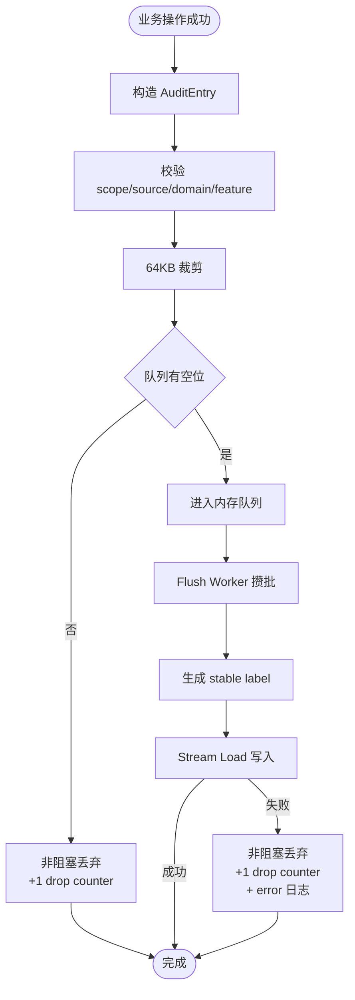
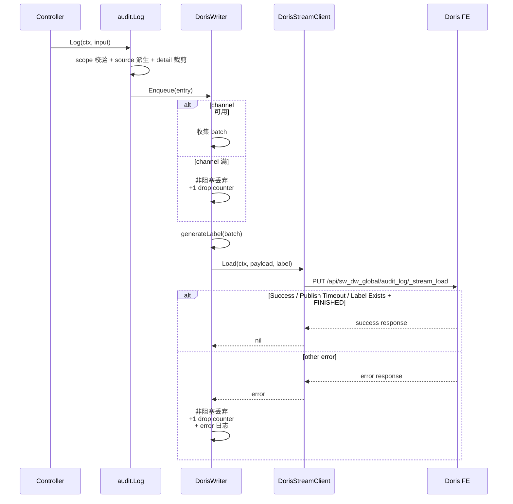

# 详细设计 B：Wave 审计日志（Doris 方案）

| 元数据 | |
|---|---|
| **目录** | `20260626-Wave-Feat-AddAuditLog` |
| **创建日期** | 2026-07-06 |
| **最后更新** | 2026-07-08（Stream Load 客户端：自建不修 dead code） |
| **状态** | Reviewing |
| **关联 spec** | [01-spec.md](./01-spec.md) |
| **关联 plan** | [03-plan-doris.md](./03-plan-doris.md) |
| **设计者** | AI 架构师 |
| **产出命名** | `04-detail-doris.md`（多方案，后缀 `-doris` 标识 Doris 方案） |

---

## 1. 背景承接

### 1.1 回顾

[03-plan-doris.md](./03-plan-doris.md) 已将 Doris 方案收敛为：

- 单表：`sw_dw_global.audit_log`
- 单写链路：业务成功后显式 `audit.Log()`，后台异步攒批 Stream Load
- 单兜底模型：失败时非阻塞丢弃 + drop counter + error 日志（同 PG 方案）
- 轻量客户端：在 `service/auditlog/doris_stream.go` 中写一份专注的 Doris Stream Load 客户端，不碰 `pkg/dal/dorisx/stream_loader.go` 死代码

整体设计目标不是“让 Doris 看起来更强”，而是做出一套**真的能按 Wave 现状落地**、同时又不会为了审计把代码写重的方案。

### 1.2 本详细设计聚焦的实现问题

- `sw_dw_global.audit_log` 的 DDL 如何定义，才能既可执行又不引入多余语义负担
- Stream Load 客户端应该暴露什么接口，才能让 Doris 写入层「即插即用」
- queue 满、Doris 不可达、重复 label、异常重启等失败路径怎样处理才不静默丢
- 不存 actor 快照时，读侧如何导出一份仍然能给审计公司使用的结果
- Doris 查询如何避免无界扫描，同时不把 Doris key 设计提前做重

---

## 2. 一致性校验

### 2.1 Spec vs Plan

| 校验项 | 状态 | 说明 |
|---|---|---|
| P0 用户故事与方案目标 | ✅ 匹配 | 第三方审计导出、安全追溯、组织治理都被覆盖 |
| “主流程必须异步” | ✅ 匹配 | 仍然是 enqueue + 后台 flush |
| 失败不能静默丢 | ✅ 匹配 | Doris 方案同 PG 方案：非阻塞丢弃 + drop counter + error 日志 |
| `source` 与 detail 文案 | ✅ 已同步 | 与 PG 方案一致：`ui / api_token / mcp`、`Account + Target` 结构 |

### 2.2 Plan vs 代码现实

| 假设 | 验证结果 | 备注 |
|---|---|---|
| Web 服务已初始化 Doris 连接 | ✅ 已确认 | `apps/web/server.go` 已调用 `dorisx.Init(...)` 与 `dorisx.InitDorisApiClient(...)` |
| 存在可跨库查询/DDL 的 Doris 连接 | ✅ 已确认 | `dorisx.DB.GetGlobalDB()` 可直接使用 |
| `UseDB(ctx, query)` 可直接服务审计全局表 | ❌ 不成立 | 它会拼接 `sw_dw_{pid}`，不适用于 `sw_dw_global` |
| `StreamLoader` 已能解析 Stream Load 状态 | ✅ 已确认 | 已有 `Status`、`Label`、`ExistingJobStatus` 字段 |
| `StreamLoader` 可直接用于审计写入 | ⚠️ 部分成立 | 还缺 `Label()`；认证头和项目里其他 Doris HTTP 调用不一致 |
| `sw_dw_global` DDL 可通过迁移框架执行 | ❌ 不成立 | `DBTypeDoris` 只支持逐项目遍历（`sw_dw_{pid}`），`DBTypeGlobal` 指向全局 PG。改为 `initDatabase()` 在 `dorisx.Init()` 后 bootstrap 执行 |
| Doris 写入一定要用哨兵值代替 NULL | ❌ 不成立 | Wave 现有 Doris 表与 Doris 官方能力都允许非 key 列为 NULL，本方案移除全量哨兵转换假设 |

### 2.3 修正记录

- **修正 1：`source` 新增 `mcp` 枚举值**
  - MCP 是入口协议，不是独立认证来源
  - 统一规则：`pvctx.IsAccountAPIToken(ctx) == true` → `api_token`，否则 `ui`

- **修正 2：detail 不再存 actor 快照**
  - V1 只保留 `schema_version / account / target / comment / extra`
  - 审计证据主键是 `account_id`，显示名读侧补齐，详见 [01-spec.md §Detail 结构](./01-spec.md#detail-结构)

- **修正 3：放弃“Doris 全字段哨兵值”**
  - DUPLICATE KEY 选 `(occurred_at, org_id, project_id, account_id, event_id)`：前 4 列确保分区剪枝 + scope 前缀加速；`event_id` 放最后位，使 `ORDER BY occurred_at DESC, event_id DESC` 无需额外排序，同时支持按 `event_id` 点查的对账场景
  - 不把 NULL scope 改写成哨兵值

- **修正 4：不新增 Doris 审计专用连接配置**
  - Doris 连接与 HTTP Host 全部复用 `config.Inf.GetDoris()`

- **修正 5：`sw_dw_global` DDL 不走迁移框架，改为 `initDatabase()` bootstrap**
  - 迁移框架现在只能对逐项目 Doris 库（`sw_dw_{pid}`）执行 DDL，不支持全局库
  - 在 `server.go` 的 `initDatabase()` 中，于 `dorisx.Init()` 成功后调用 `dorisx.DB.GetGlobalDB().ExecContext(ctx, doris_global_sql)`
  - 使用 `CREATE DATABASE IF NOT EXISTS` + `CREATE TABLE IF NOT EXISTS` 保证幂等

---

## 3. 实现总览

Doris 方案与 PG 方案共享的部分不重复造轮子：

- `audit.Log()` 的业务接入方式相同：业务成功后显式调用
- `pvctx` 的 `client_ip` 透传方式相同
- detail 的不传敏感字段约定与 64KB 超限丢弃方式相同
- 查询与导出的 API 形态相同

真正不同的地方只有三块：

1. **写入层**：PG 是 batch insert；Doris 是 Stream Load
2. **幂等机制**：PG 依赖唯一约束；Doris 依赖 stable label
3. **失败兜底**：PG 可以单事件 JSONL；Doris 更适合批次级文件重放

### 3.1 文件影响清单

| 文件 | 变更类型 | 改动内容 | 改动的理由 |
| --- | --- | --- | --- |
| `script/migration/migration.go` | — | — | Doris 全局 DDL 不走迁移框架，通过 `initDatabase()` bootstrap |
| `script/migration/service.go` | — | — | Doris 全局 DDL 不走迁移框架，通过 `initDatabase()` bootstrap |
| `script/sql/doris/audit_log.sql` | 新增 | 建库建表 DDL（与现有 `doris.sql` 风格一致） | Doris 审计表独立于 PG，需要单独 DDL |
| `apps/web/service/auditlog/doris_stream.go` | 新增 | 专注的 Stream Load 客户端，Bearer Auth、stable label、幂等判定、超时控制 | 不碰 `pkg/dal/dorisx/stream_loader.go` 死代码；在 auditlog 包内新写一份只给审计用的客户端 |
| `pkg/lib/pvctx/pvctx.go` | 修改 | 新增 `ClientIP()` / `WithClientIP()`，并在 `BackGroundCtx()` 复制 | 审计必须记录 IP，异步 goroutine 也要拿到 |
| `pkg/config/app_cfg.go` | 修改 | 增加 audit writer 配置项 | 审计写入参数需要可配置，但 Doris 连接本身复用现有配置 |
| `apps/web/server.go` | 修改 | 在 Doris 初始化后启动 audit writer，并在 shutdown 时 drain | writer 生命周期应挂在 Web 服务主生命周期上 |
| `apps/web/metrics/metrics.go` | 修改 | 增加 audit 指标 factory | 监控必须独立，不混进现有 Doris query 指标 |
| `apps/web/service/auditlog/audit.go` | 新增 | `Log()` 入口、枚举校验、source 派生 | 统一入口最适合收口业务层接入 |
| `apps/web/service/auditlog/detail.go` | 新增 | detail 脱敏、裁剪、序列化 | detail 是合规边界，应该集中处理 |
| `apps/web/service/auditlog/writer_doris.go` | 新增 | batch、label、flush、queue overflow 处理 | Doris 专用复杂度深埋在 writer 中 |
| `apps/web/service/auditlog/spool_doris.go` | — | — | Doris 方案不设本地 spool（同 PG 方案），此文件不需要 |
| `apps/web/service/auditlog/query_doris.go` | 新增 | 查询、游标、PG 补当前名称 | Doris 查询与 PG 补名天然是这一层职责 |
| `apps/web/controller/auditlog/audit.go` | 新增 | OpenAPI 查询与导出 handler | 审计产品出口在 controller 层 |
| 13 个 controller 文件 | 修改 | 在成功路径显式调用 `audit.Log()` | 它们是具体业务动作的唯一入口 |

---

## 4. 数据模型 / API / 配置定义

### 4.1 数据模型

#### 4.1.1 Doris DDL

```sql
CREATE DATABASE IF NOT EXISTS sw_dw_global;

CREATE TABLE IF NOT EXISTS sw_dw_global.audit_log (
    `occurred_at` DATETIME(3)  NOT NULL COMMENT '事件实际发生时间',
    `event_id`    VARCHAR(64)  NOT NULL COMMENT 'UUID v7，稳定事件标识；用于导出对账与 Stream Load 幂等',
    `org_id`      BIGINT       NULL     COMMENT '组织 ID，账号层事件为空',
    `project_id`  BIGINT       NULL     COMMENT '项目 ID，组织层/账号层事件为空',
    `account_id`  BIGINT       NULL     COMMENT '操作人账号 ID，登录失败等无法确认时为空',
    `domain`      VARCHAR(64)  NOT NULL COMMENT '粗粒度领域：account/organization/project/asset/metadata',
    `feature`     VARCHAR(64)  NOT NULL COMMENT '细粒度实体类型：session/chart/experiment/...',
    `target_id`   VARCHAR(64)  NULL     COMMENT '资源 ID，登录类事件为空',
    `action`      VARCHAR(64)  NOT NULL COMMENT 'created/updated/deleted/logged_in/logged_out/login_failed',
    `source`      VARCHAR(16)  NOT NULL COMMENT '认证来源：ui / api_token / mcp',
    `ip_address`  VARCHAR(64)  NOT NULL COMMENT '操作者 IP',
    `detail`      TEXT         NULL     COMMENT 'JSON: {schema_version,account,target,comment,extra}',
    `created_at`  DATETIME(3)  NOT NULL DEFAULT CURRENT_TIMESTAMP(3) COMMENT '入库时间'
) ENGINE=OLAP
DUPLICATE KEY(`occurred_at`, `org_id`, `project_id`, `account_id`, `event_id`)
AUTO PARTITION BY RANGE (date_trunc(`occurred_at`, 'month')) ()
DISTRIBUTED BY HASH(`event_id`) BUCKETS AUTO
PROPERTIES (
    "replication_allocation" = "tag.location.default: 3"
);
```

#### 4.1.2 字段说明

| 字段 | 类型 | 约束 | 说明 |
| --- | --- | --- | --- |
| `occurred_at` | `DATETIME(3)` | NOT NULL | 事件实际发生时间；既是查询主过滤维度，也是分区列 |
| `event_id` | `VARCHAR(64)` | NOT NULL | UUID v7（`pkg/lib/util.NewUUID()`）；DUPLICATE KEY 末列，使 `ORDER BY occurred_at, event_id` 无需额外排序；用于导出对账与 Stream Load label 生成 |
| `org_id` | `BIGINT` | NULL | 账号层事件为空 |
| `project_id` | `BIGINT` | NULL | 组织层/账号层事件为空 |
| `account_id` | `BIGINT` | NULL | 无法确认操作者时为空 |
| `domain` | `VARCHAR(64)` | NOT NULL | 5 个 domain |
| `feature` | `VARCHAR(64)` | NOT NULL | 共 25 个，完整列表见 §10 接入清单
| `target_id` | `VARCHAR(64)` | NULL | 登录类事件为空 |
| `action` | `VARCHAR(64)` | NOT NULL | 6 个基础动作 |
| `source` | `VARCHAR(16)` | NOT NULL | 允许 `ui / api_token / mcp` |
| `ip_address` | `VARCHAR(64)` | NOT NULL | 合规必填 |
| `detail` | `TEXT` | NULL | 过滤后的 JSON 文本 |
| `created_at` | `DATETIME(3)` | NOT NULL | Doris 入库时间 |

#### 4.1.3 V1 不做、但留好升迁路径的设计决策

| 决策 | V1 做法 | 未来升级路径 | 原理 |
| --- | --- | --- | --- |
| `detail` 类型 | `TEXT`，存 JSON 字符串 | `ALTER TABLE MODIFY COLUMN detail JSON` 原地转换 | Doris 可自动将有效 JSON 字符串转为内部二进制格式，无需重写数据。V1 不建 inverted index，JSON 查询能力用不上，TEXT 写入更快、导出更安全 |
| 倒排索引 | 不加 | V2 按需在 `domain/feature/action/target_id` 上加 | 当前规模下前缀索引 + 分区剪枝已够用 |
| `org_id/project_id/account_id` 排序优化 | 不放入 sort key | 无需改动，已在 DUPLICATE KEY 第 2-4 位 | DUPLICATE KEY 就是排序列，已在其中 |
| `request_id/trace_id` | 不入顶层列 | 放入 `detail.extra` 扩展 | 避免列膨胀，V1 已验证不需要 |
| actor 快照 | 不入列 | 读侧 best-effort 补名 | 审计主证据是 `account_id` |

**`detail` 类型选 TEXT 而非 JSON 的考量**：

当前 V1 优先级是”可导出、可解释、可落地”，半结构化查询不在 V1 范围内。TEXT 在此阶段是最稳妥的选择：

- Stream Load 序列化更简单：`json.Marshal` 后直接作为 JSON 字符串字段，无需 `json.RawMessage` 处理
- OUTFILE 导出（CSV / XLSX / Parquet）全链路已验证，无类型兼容风险
- Doris `ALTER TABLE MODIFY COLUMN … JSON` 是 schema change，按月分区可逐分区滚动迁移，不停服务

如果 V2 需要对 detail 做半结构化查询（如 `WHERE detail['comment'] IS NOT NULL`），原地升 JSON 即可。

### 4.2 API / 接口

#### 4.2.1 写入接口

```go
type Detail struct {
    SchemaVersion int            `json:"schema_version"`
    Account       map[string]any `json:"account,omitempty"`
    Target        map[string]any `json:"target,omitempty"`
    Comment       string         `json:"comment,omitempty"`
    Extra         map[string]any `json:"extra,omitempty"`
}

type LogInput struct {
    Domain     string
    Feature    string
    Action     string
    TargetID   string
    Detail     *Detail
    OccurredAt time.Time
}

func Log(ctx context.Context, input LogInput)
```

#### 4.2.2 查询接口

```go
type Query struct {
    OrgID     *int64
    ProjectID *int64
    AccountID *int64

    Domain   string
    Feature  string
    Action   string
    TargetID string

    StartTime time.Time
    EndTime   time.Time
    Cursor    string
    Limit     int
}
```

查询校验规则：

- `StartTime` / `EndTime` 必填
- `OrgID` / `ProjectID` / `AccountID` 至少一个必填
- `Limit` 默认 100，最大 1000
- `Domain` / `Feature` / `Action` / `TargetID` 只能作为 scope 内附加过滤，不允许单独裸查

#### 4.2.3 导出接口

与 PG 方案一致：`GET /api/audit/export?format=csv|xlsx`

导出列建议：

- `occurred_at`
- `org_id`
- `project_id`
- `account_id`
- `account_name`（读侧 best-effort 补当前名，可为空）
- `domain`
- `feature`
- `action`
- `target_id`
- `source`
- `ip_address`
- `detail`

### 4.3 配置项

#### 4.3.1 复用的现有 Doris 配置

本方案**不新增**以下配置，而是直接复用：

- `config.Inf.GetDoris().Host`
- `config.Inf.GetDoris().HttpHost`
- `config.Inf.GetDoris().User`
- `config.Inf.GetDoris().Password`

#### 4.3.2 新增的审计配置

| 配置键 | 类型 | 默认值 | 说明 |
| --- | --- | --- | --- |
| `audit_log_batch_size` | `int` | `500` | 单批最大条数；Doris Stream Load 适合较大批次，默认 500 优于 PG 的 100 |
| `audit_log_flush_interval` | `duration` | `5s` | 定时 flush 间隔 |
| `audit_log_flush_timeout` | `duration` | `30s` | 单批 Stream Load 超时 |
| `audit_log_queue_size` | `int` | `4096` | 内存队列容量 / channel buffer 大小，满时非阻塞丢弃 + error 日志 |
| `audit_log_detail_max_bytes` | `int` | `64000` | detail 最大字节数。Doris `STRING` 默认 ~1 MB、最大 ~2 GB，无硬限压力；64000 与 PG 64KB 对齐、enqueue 时已裁剪，不触及 Stream Load 侧限制 |

### 4.4 Detail 定义

#### 4.4.1 统一结构

```json
{
  "schema_version": 1,
  "account": {
    "id": 42,
    "name": "张三"
  },
  "target": {
    "id": "34",
    "name": "增长看板",
    "type": "dashboard",
    "visibility": "project"
  },
  "comment": "dashboard charts updated",
  "extra": {
    "chart_ids": [1, 2, 3]
  }
}
```

#### 4.4.2 构造规则

| 场景 | `target` | `account` | `comment` | `extra` |
| --- | --- | --- | --- | --- |
| `created` | 过滤后的当前对象摘要 | 操作人当时名快照（best effort） | 可选 | 可选 |
| `updated` | 过滤后的 after 摘要 | 同上 | 可选 | 可选 |
| `deleted` | 删除前最小摘要，至少 `id / name` | 同上 | 可选 | 可选 |
| `logged_in / logged_out` | 可为空 | 同上 | 可选 | 可放已知的登录方式、客户端信息，但不强制 |
| `login_failed` | 可为空 | 无法确定时留空 | 建议短说明 | 可选失败原因码，但不额外查库 |

#### 4.4.3 明确不记录的内容

- actor 快照
- 邮箱
- token 明文
- secret / password / access key
- 字段级 before/after diff

### 4.5 外部依赖与集成契约

| 外部系统/模块 | 依赖类型 | 提供能力 | 集成方式 | 故障影响 |
| --- | --- | --- | --- |---|
| `initDatabase()` bootstrap | 基础设施 | 执行 `sw_dw_global.audit_log` DDL（建库+建表） | 在 `dorisx.Init()` 后执行 bootstrap；现有迁移框架不支持全局 Doris 库 | DDL 未执行则表不存在，写入/查询均失败 |
| Doris FE HTTP | 基础设施 | Stream Load | `PUT /api/sw_dw_global/audit_log/_stream_load` | 写入失败，非阻塞丢弃 + drop counter |
| Doris MySQL 协议 | 基础设施 | 查询 / DDL | `GetGlobalDB().QueryxContext / ExecContext` | 查询导出失败 |
| PostgreSQL account service | 内部模块 | `GetAccountNamesMapByIds` | 读侧 best-effort 补名 | 名称为空，但不影响审计主证据 |
| 本地磁盘 | 基础设施 | 无 | Doris 方案不设本地 spool，等价 PG 方案的 drop counter | 异常崩溃存在有限内存丢失窗口 |

参考依据：

- 本地调研：[docs/wave/doris-research.md](../../docs/wave/doris-research.md)
- Doris Stream Load: <https://doris.apache.org/docs/3.x/data-operate/import/import-way/stream-load-manual/>
- Doris Duplicate Key Table: <https://doris.apache.org/docs/dev/table-design/data-model/duplicate/>
- Doris Auto Partition: <https://doris.apache.org/docs/dev/table-design/data-partitioning/auto-partitioning/>

---

## 5. 分模块详细技术方案

### 5.1 上下文模块（pvctx）

#### 职责

把 `client_ip` 放进 `context.Context`，并确保异步 flush 等后台链路拿得到。

#### 新增函数

```go
func ClientIP(ctx context.Context) string
func WithClientIP(ctx context.Context, ip string) context.Context
```

#### `BackGroundCtx` 扩展

仅在现有复制逻辑末尾追加 `client_ip`（其余字段与 PG 方案一致，详见 [04-detail-pg.md §5.1](./04-detail-pg.md#51-上下文模块pvctx)）：

```go
if ip := ClientIP(ctx); ip != "" {
    bg = WithClientIP(bg, ip)
}
```

#### 错误处理

- 请求上下文缺 IP：`audit.Log()` 直接拒绝写审计，并记 critical metric
- `BackGroundCtx()` 本身不返回错误

#### 接口深度评估

| 维度 | 结果 | 说明 |
|---|---|---|
| Interface 大小 | 少量方法 | 只补 2 个小函数 |
| 隐藏复杂度 | 薄实现 | 只是 ctx 透传 |
| 可测试性 | 好 | 纯函数测试即可 |
| 评价 | Deep ✅ | 小接口、非常直观 |

---

### 5.2 Stream Load 客户端（`service/auditlog/doris_stream.go`）

#### 职责

写一份专注的 Doris Stream Load HTTP 客户端，对齐 Wave 真实调用规范（`http_test.go` 中确认的约定和 `stream_loader.go` 中的认证头写法），不依赖现有死代码：

1. **Bearer Auth** — 对齐 Wave Stream Load 真实约定（`Authorization: Bearer <base64(user:pass)>`），非 `doris_apix.go` 的 Query API Basic Auth 模式
2. **Stable label** — 调用方传入 label，实现幂等重试
3. **幂等判定** — 正确识别 `Label Already Exists + ExistingJobStatus == FINISHED` 为成功
4. **标准 header** — `Expect: 100-continue`、`strip_outer_array: true`、`format: json`
5. **超时控制** — 客户端由上层 writer 传入 `http.Client`，不持零值 Client

#### 接口定义

```go
type DorisStreamClient struct {
    url      string
    username string
    password string
    client   *http.Client
}

func NewDorisStreamClient(url, username, password string, timeout time.Duration) *DorisStreamClient

// Load 发送 Stream Load 请求。label 为空时不设 label 头。
// 返回 nil 表示成功（含幂等成功）；返回 error 表示失败，调用方重试或丢弃。
func (c *DorisStreamClient) Load(ctx context.Context, data []byte, label string) error
```

`Load()` 内部实现：

```go
func (c *DorisStreamClient) Load(ctx context.Context, data []byte, label string) error {
    req, _ := http.NewRequestWithContext(ctx, http.MethodPut, c.url, bytes.NewReader(data))

    auth := base64.StdEncoding.EncodeToString([]byte(c.username + ":" + c.password))
    req.Header.Set("Authorization", "Bearer "+auth)
    req.Header.Set("Expect", "100-continue")
    req.Header.Set("strip_outer_array", "true")
    req.Header.Set("format", "json")
    if label != "" {
        req.Header.Set("label", label)
    }

    resp, err := c.client.Do(req)
    if err != nil {
        return fmt.Errorf("doris stream load: %w", err)
    }
    defer resp.Body.Close()

    body, _ := io.ReadAll(resp.Body)
    if resp.StatusCode != http.StatusOK {
        return fmt.Errorf("doris stream load: status=%d body=%s", resp.StatusCode, string(body))
    }

    var loadResp dorisStreamLoaderResponse
    if err := json.Unmarshal(body, &loadResp); err != nil {
        return fmt.Errorf("doris stream load decode: %s err=%w", string(body), err)
    }
    if loadResp.isSuccess() {
        return nil
    }
    return fmt.Errorf("doris stream load: status=%s msg=%s", loadResp.Status, loadResp.Message)
}
```

#### 响应解析

```go
type dorisStreamLoaderResponse struct {
    Status            string `json:"Status"`
    ExistingJobStatus string `json:"ExistingJobStatus"`
    Message           string `json:"Message"`
}

func (r *dorisStreamLoaderResponse) isSuccess() bool {
    if r.Status == "Success" || r.Status == "Publish Timeout" {
        return true
    }
    return r.Status == "Label Already Exists" && r.ExistingJobStatus == "FINISHED"
}
```

结构体不导出（包内使用），无需为外部调用者设计泛化接口。

#### 请求/响应边界

```
🟢 ── Stream Load Request ───────────────────────
    │ 1. 组装请求头（含 label / Bearer Auth）
    │ 2. PUT 到 Doris FE HTTP 接口
    │ 3. 解析 Doris 返回 JSON
🔴 ── Success / Error ───────────────────────────
```

#### 错误处理

| 场景 | 处理方式 |
|---|---|
| HTTP 连接失败/超时 | 返回 error，非阻塞丢弃 + drop counter（同 PG 方案） |
| `Status = Success / Publish Timeout` | 返回 nil |
| `Status = Label Already Exists` 且 `ExistingJobStatus = FINISHED` | 返回 nil |
| `Status = Label Already Exists` 且 `ExistingJobStatus != FINISHED` | 返回 error，由 writer 稍后重试 |
| 其他状态 | 返回 error |

#### 接口深度评估

| 维度 | 结果 | 说明 |
|---|---|---|
| Interface 大小 | 1 个方法 | 只有 `Load(ctx, data, label)`，无 builder chain |
| 隐藏复杂度 | 薄实现 | 纯 HTTP PUT + JSON 解析，无状态 |
| 可测试性 | 好 | 可 mock HTTP server 验证状态机 |
| 评价 | Deep ✅ | 只做一件事，定义清晰 |

---

### 5.3 Doris Writer 模块（writer_doris）

#### 职责

消费内存队列中的审计条目，按批次生成 stable label，调用 Stream Load 写入 Doris；写入失败时非阻塞丢弃并记 drop counter。

#### 关键结构与函数

```go
type DorisWriter struct {
    ch      chan *Entry
    client  *DorisStreamClient
    metrics *Metrics
    cfg     WriterConfig

    stopCh chan struct{}
    wg     sync.WaitGroup
}

func (w *DorisWriter) Enqueue(ctx context.Context, e *Entry) error
func (w *DorisWriter) Start(ctx context.Context)
func (w *DorisWriter) Stop(ctx context.Context) error
func (w *DorisWriter) flush(ctx context.Context, batch []*Entry) error
func (w *DorisWriter) generateLabel(batch []*Entry) string
```

初始化客户端时固定使用全局审计表 URL：

```go
streamURL := strings.TrimRight(config.Inf.GetDoris().HttpHost, "/") +
    "/api/sw_dw_global/audit_log/_stream_load"

client := NewDorisStreamClient(
    streamURL,
    config.Inf.GetDoris().User,
    config.Inf.GetDoris().Password,
    cfg.FlushTimeout,
)
```

#### `Enqueue()` 规则（同 PG 方案）

channel 满时非阻塞丢弃，不 spill 到磁盘：

```go
func (w *DorisWriter) Enqueue(ctx context.Context, e *Entry) error {
    select {
    case w.ch <- e:
        return nil
    default:
        w.metrics.DropTotal.Inc()
        log.CtxError(ctx, "audit channel full, drop entry")
        return nil
    }
}
```

#### flush 逻辑

```text
flushLoop:
  ticker every 5s
  collect up to 500 entries
  if batch empty -> continue
  label = generateLabel(batch)
  payload = marshal(batch)
  client.Load(ctx, payload, label)
  if success -> done
  if error -> drop +1 DropTotal + error log
```

#### label 规则

```go
func (w *DorisWriter) generateLabel(batch []*Entry) string {
    first := safePrefix(batch[0].EventID)
    last := safePrefix(batch[len(batch)-1].EventID)
    return fmt.Sprintf("audit_log_%s_%s_%d", first, last, len(batch))
}
```

规则：

- 长度必须小于 128
- 同一批次初次 flush 与重试必须复用同一 label
- label 的来源只依赖 batch 内容，不依赖当前时间

#### Flush 边界

```
🟢 ── Flush Batch ───────────────────────────────
    │ 1. 组装 batch
    │ 2. 生成 stable label
    │ 3. JSON 编码
    │ 4. Stream Load HTTP PUT
🔴 ── Success / Error ───────────────────────────
```

#### 错误处理

| 失败场景 | 处理方式 | 尽力投递 |
|---|---|---|
| Doris HTTP 不可达 | 非阻塞丢弃 + drop counter + error 日志 | Doris 恢复后正常写入新数据，已丢数据不补偿 |
| Doris 返回 `Label Already Exists` + `FINISHED` | 当作成功 | 自然幂等 |
| Doris 返回 `Label Already Exists` + `RUNNING` | 当作失败，稍后重试 | 避免误判成功 |
| JSON 编码失败 | 记 error metric，丢弃 | 需要人工排查采集数据链路 |
| queue 满 | 非阻塞丢弃 + drop counter + error 日志（同 PG 方案） | 不阻塞主流程 |

#### 接口深度评估

| 维度 | 结果 | 说明 |
|---|---|---|
| Interface 大小 | 少量方法 | 入口只有 `Enqueue / Start / Stop` |
| 隐藏复杂度 | 中等 | batch、label、metrics 全藏内部（同 PG 方案） |
| 可测试性 | 中 | 需要 mock Stream Load 与文件系统 |
| 评价 | Deep ✅ | 复杂度集中收口，调用方最轻 |

---

### 5.4 失败处理

**Doris 方案不设本地 spool**（与 PG 方案一致）。

- channel 满：非阻塞丢弃 + `DropTotal` counter + error 日志
- Stream Load 失败（HTTP 错误、超时、Doris 不可达）：非阻塞丢弃 + `DropTotal` counter + error 日志
- 服务优雅退出时由 `Stop()` drain 剩余批次，异常崩溃存在有限内存丢失窗口
- 无磁盘持久化，无 replay 机制。审计数据尽力投递，不保证最终一致；等价 PG 方案的丢弃语义。
| 评价 | Deep ✅ | 文件模型简单，职责边界清楚 |

---

### 5.5 查询模块（query_doris）

#### 职责

在 Doris 中按”时间范围 + scope”查询审计数据，并在应用层 best-effort 补齐当前账号名。

与 PG 方案的核心区别：

- **不走 GORM**：Doris 无 GORM 映射；用 `dorisx` 的原始 SQL 查询
- **新增 `UseGlobalDB()`**：现有 `UseDB(ctx, query)` 会拼 `USE sw_dw_{pid};`，不适用于全局表。新增 `UseGlobalDB()` 返回 `globalDB` 但不拼数据库名，查询 `sw_dw_global.audit_log` 需用全限定表名。改动只加一行方法声明，不影响既有行为
- **无 JOIN 补名**：Doris 不存 `global.account` 表，补名在应用层额外查询 PG
- **同一套查询接口**：`List / Export` 对 controller 暴露同一套签名，不因底层引擎暴露差异

#### 查询接口

与 PG 方案共享同一套 controller 层签名：

```go
// List 返回一页审计记录及下一页游标
func (s *QueryService) List(ctx context.Context, req *ListRequest) (*ListResult, error)

// Export 导出全量结果（适用游标循环），不走同一页限制
func (s *QueryService) Export(ctx context.Context, req *ExportRequest) ([]*AuditLogEntry, error)

type ListRequest struct {
    Cursor     string  // base64 游标，首次为空
    Limit      int     // 页大小，默认 50，上限 200
    StartTime  time.Time
    EndTime    time.Time
    OrgID      *int64  // nil = 不过滤
    ProjectID  *int64
    AccountID  *int64
    Domain     string
    Feature    string
    Action     string
    TargetID   string
}

type ListResult struct {
    Items    []*AuditLogEntry
    NextCursor string
    HasMore  bool
}
```

scope 过滤由 controller 层根据当前用户角色注入：

- 账号层用户：只能查 `account_id = 自己`
- 组织管理员：查 `org_id = 所属组织`，可指定 `project_id`
- 项目管理员：查 `org_id + project_id`
- 平台管理员：不限 scope（加上 `IsPlatformAdmin` 守卫）
- 不允许全部三个 scope 同时为空（防止全表扫，与 PG 方案一致）

#### 查询 SQL

通过新增的 `UseGlobalDB()` 执行，不走 `UseDB()`（会拼 `sw_dw_{pid}`），表名使用全限定 `sw_dw_global.audit_log`：

```go
rows, err := dorisx.DB.UseGlobalDB().QueryContext(ctx, query, args...)
```

```sql
SELECT
    occurred_at,
    event_id,
    org_id,
    project_id,
    account_id,
    domain,
    feature,
    target_id,
    action,
    source,
    ip_address,
    detail,
    created_at
FROM sw_dw_global.audit_log
WHERE occurred_at >= ?
  AND occurred_at < ?
  AND (? IS NULL OR org_id = ?)
  AND (? IS NULL OR project_id = ?)
  AND (? IS NULL OR account_id = ?)
  AND (? = '' OR domain = ?)
  AND (? = '' OR feature = ?)
  AND (? = '' OR action = ?)
  AND (? = '' OR target_id = ?)
  AND (
      ? = ''
      OR occurred_at < ?
      OR (occurred_at = ? AND event_id < ?)
  )
ORDER BY occurred_at DESC, event_id DESC
LIMIT ?;
```

实现时应按实际条件动态拼 SQL，避免无意义的 `OR` 条件。

#### 账号名补齐

1. 收集查询结果中的 `account_id`
2. 去重后调用 `GetAccountNamesMapByIds(ctx, ids)`
3. 组装 `account_name`
4. 若补齐失败，返回 `account_id`，`account_name` 留空

#### 游标编码

```text
base64(occurred_at.RFC3339Nano + "|" + event_id)
```

#### 错误处理

| 场景 | 处理方式 |
|---|---|
| 缺少 `StartTime/EndTime` | 直接返回 400 |
| 缺少 org/project/account 全部 scope | 直接返回 400 |
| Doris 查询失败 | 返回 5xx |
| PG 补名失败 | 降级成功返回，`account_name` 为空 |

#### 接口深度评估

| 维度 | 结果 | 说明 |
|---|---|---|
| Interface 大小 | 少量方法 | `List / Export` 两个入口即可 |
| 隐藏复杂度 | 中 | SQL 组装、游标、PG 补名都在内部 |
| 可测试性 | 中 | 需要 mock 查询结果与 PG 补名 |
| 评价 | Deep ✅ | 对 controller 暴露的是稳定业务接口 |

---

## 6. 业务流程图

### 6.1 正常流程



### 6.2 失败流程

不再需要单独的失败流程图。Doris 方案与 PG 方案一致：写入失败 = 非阻塞丢弃 + drop counter + error 日志。无 spool / replay / DLQ。

---

## 7. 时序图



---

## 8. 测试策略

### 8.1 测试矩阵

| 测试类型 | 范围 | 具体场景 | 方法 |
| --- | --- | --- | --- |
| 单元测试 | `dorisStreamLoaderResponse.isSuccess()` | `Success`、`Publish Timeout`、`Label Already Exists + FINISHED`、`Label Already Exists + RUNNING` | Go testing |
| 单元测试 | `generateLabel()` | 单条、多条、长度截断、稳定性 | Go testing |
| 单元测试 | detail 脱敏 / 裁剪 | 邮箱脱敏、超 64KB 裁剪、空 detail | Go testing |
| 单元测试 | Query 校验 | 缺时间范围、缺 scope、limit 越界 | Go testing |
| 集成测试 | Writer + mock Doris FE | HTTP 200 成功、超时、重复 label、500 错误 | `httptest.Server` |
| 集成测试 | Query + PG 补名 | Doris 成功 / PG 补名失败降级 | mock DAO/service |
| 边界测试 | queue 满 | `Enqueue()` 非阻塞丢弃 | 参数化测试 |

### 8.2 必测用例清单

- `source` 派生：UI session → `ui`；API Token → `api_token`；MCP → `mcp`
- `client_ip` 丢失时不写审计、但业务不回滚
- `Label Already Exists + ExistingJobStatus=FINISHED` 视为成功，不记 drop
- `Label Already Exists + ExistingJobStatus=RUNNING` 视为失败，计 drop counter
- 查询没有 scope 时必须被拒绝
- 导出时绝不输出邮箱字段

---

## 9. 实现风险评估

| 风险点 | 概率 | 影响 | 预防 | 补救 |
| --- | --- | --- | --- |---|
| Stream Load HTTP 通路不通 | 中 | 高 | Phase 0 先 curl 验证 | 方案回退 PG，不硬上 Doris |
| `Label Already Exists` 误判成功 | 低 | 高 | 必须检查 `ExistingJobStatus == FINISHED` | 修正 `IsSuccess()` 确保正确判定 |
| queue 长期满导致写入丢弃 | 低 | 中 | 暴露 `audit_channel_drop_total` 与 `web_audit_queue_depth` | 扩容 queue / 降低 flush interval |
| 无 actor 快照导致导出显示名缺失 | 中 | 低 | 读侧 best-effort 补名 | 明确 `account_id` 才是主证据 |

### 9.1 补偿策略总表

| 场景 | 可重试 | 策略 | 尽力投递 |
| --- | --- | --- | --- |
| Stream Load 超时 / 网络错误 | ❌ | 非阻塞丢弃 + drop counter | 审计数据不补偿，Doris 恢复后正常写入新数据 |
| 重复 label 且已完成 | 不需要 | 视为成功 | 自然幂等 |
| 重复 label 但原任务未完成 | ❌ | 视为失败，计 drop counter | 等待下次 flush 写入新批次 |
| PG 补名失败 | ❌ | 只降级展示 | 不影响审计主数据 |

---

## 10. 接入清单

> Doris 方案与 PG 方案共享完全相同的 controller 接入清单。完整的 68 行映射表、4 个典型场景的代码示例见 [04-detail-pg.md §10](./04-detail-pg.md#10-接入清单controller--domainfeatureaction-映射)。区别仅在于存储层：Doris 方案下 `audit.Log()` 内部将 entry enqueue 到 DorisWriter，而非 PGWriter。

## 11. 上线与回滚方案

### 11.1 部署顺序

| 步骤 | 操作 | 预期影响 | 回滚方式 |
| --- | --- | --- | --- |
| 1 | 在 `initDatabase()` 中新增 `doris_global.sql` DDL（`sw_dw_global.audit_log` 建表），在 `dorisx.Init()` 后执行 bootstrap | 仅代码变更，无数据影响 | 回滚代码 |
| 2 | 上线第 1 版（此版本中 Doris 建表逻辑生效，writer 尚未接入 controller） | 新增表，无线上读写影响 | `DROP TABLE sw_dw_global.audit_log`（未接入前） |
| 3 | dev 环境 curl 验证 Stream Load | 无业务影响 | 不需要 |
| 4 | 发布带 `doris_stream.go` 客户端、audit writer、`initDatabase()` bootstrap 全部就绪的服务 | 开始具备 Doris 审计能力 | 回滚服务版本 |
| 5 | 接入业务 controller | 审计开始写入 | 回滚服务版本或移除调用点 |
| 6 | 开启查询导出接口 | 审计能力对外可用 | 回滚服务版本 |

### 11.2 回滚检查清单

- [x] Doris DDL 是新增型，不影响既有业务表
- [x] `initDatabase()` bootstrap 只对 `sw_dw_global` 执行，不影响每项目 Doris 迁移流程
- [x] 回滚服务版本不会破坏已写入的审计数据
- [x] 迁移回滚只需删除 `doris_global.sql` 中的 DDL 并回退代码

### 11.3 上线观测

| 指标 | 正常范围 | 告警阈值 | 说明 |
| --- | --- | --- | --- |
| `web_audit_queue_depth` | < 800 | > 800 持续 5 分钟 | 队列积压 |
| `audit_channel_drop_total` | 0 | > 0（需确认是否短暂峰值） | 主流程开始丢弃（channel 满或 flush 失败） |
| `web_audit_flush_failed_total` | 0 | 持续增长 | Doris 写入失败 |

---

## 12. Phase 0：Stream Load 可行性验证

### 12.1 验证目标

在 Dev 环境用真实的 Doris FE HTTP 端点完成以下验证，**Phase 0 未通过则 Doris 方案不进入实现**：

| # | 验证项 | 通过标准 |
|---|---|---|
| 1 | Bearer Auth 可用 | Doris 返回 HTTP 200，而非 401 |
| 2 | label 可设置且 Stream Load 成功 | 返回 `"Status": "Success"` |
| 3 | 重复 label + 已完成批次 | 返回 `"Status": "Label Already Exists"` + `"ExistingJobStatus": "FINISHED"` |
| 4 | 重复 label + 运行中批次（可选） | 返回 `"ExistingJobStatus": "RUNNING"` |
| 5 | `sw_dw_global` 库创建 | `CREATE DATABASE` 成功，`USE sw_dw_global` 可用 |

### 12.2 验证结果的方案影响

| 验证结果 | 影响 | 后续动作 |
|---|---|---|
| 全部通过 | Doris 方案可进入 Phase 1 | 文档按当前设计维护 |
| Bearer Auth 不通过 | Doris 方案阻塞 | 排查 Doris 配置；如需要，切到 PG 方案 |
| AUTO PARTITION 不支持（需 Doris ≥ 2.1.0） | 降级 | 回退到手动 `PARTITION BY RANGE` 按月建分区，或升级 Doris 集群 |
| Label 幂等语义异常 | 方案设计需调整 | 重新评估 Stable Label 策略或降级 PG 方案 |

---

## Quality Gates

### QG-1 Performance
- [x] 无 N+1：读侧补名使用批量 `GetAccountNamesMapByIds`
- [x] 无大事务：Doris 方案没有数据库事务，只做单批 HTTP PUT
- [x] 查询必须带时间范围和 scope，避免无界扫描

### QG-2 Data Integrity
- [x] queue 满时非阻塞丢弃 + drop counter + error 日志（同 PG 方案）
- [x] Doris Stream Load 幂等通过 stable label + ExistingJobStatus 判断保证
- [x] `Label Already Exists` 只在 `FINISHED` 时视为成功

### QG-3 Security
- [x] 每个入口都明确 source 派生规则
- [x] detail 脱敏边界已定义
- [x] 导出不返回邮箱

### QG-4 Simplicity

- [ ] ~~无新增框架~~ — Doris 全局 DDL 不走迁移框架，通过 `initDatabase()` bootstrap，不是新框架
- [x] Doris 连接配置完全复用现有 infra

### QG-5 Completeness
- [x] 文件清单完整
- [x] 失败路径完整
- [x] 测试矩阵完整

### QG-6 Architecture
- [x] 业务层只依赖 `audit.Log()`，不直接碰 Doris DAO
- [x] Doris 细节都收口在 `auditlog` 子模块

### QG-7 Cache / Redis
- [x] 不涉及缓存一致性

### QG-8 分布式部署兼容性
- [x] 主流程不阻塞等待 Doris
- [x] 幂等依赖 stable label，不依赖单机内存状态

### QG-9 一致性校验
- [x] Spec ↔ Plan ↔ Code 差异已显式记录
- [x] 老稿中的 `mcp source / actor 快照 / 全量哨兵值` 已被修正

### QG-10 外部依赖

- [x] Doris HTTP / MySQL 协议、PG 补名、迁移框架的契约都已记录
- [x] 每个外部依赖的故障影响已评估

### QG-11 上线回滚
- [x] DDL 为新增型，可安全回滚服务版本
- [x] 上线观测指标和告警阈值已定义
- [x] 回滚检查清单已覆盖
