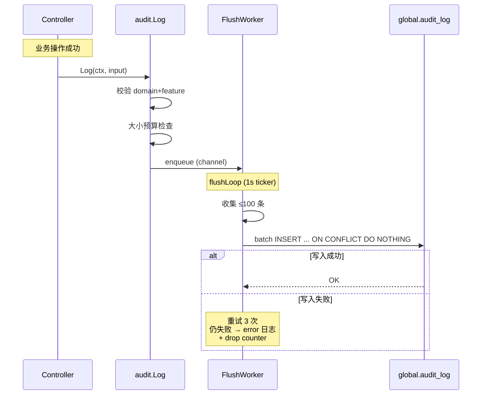
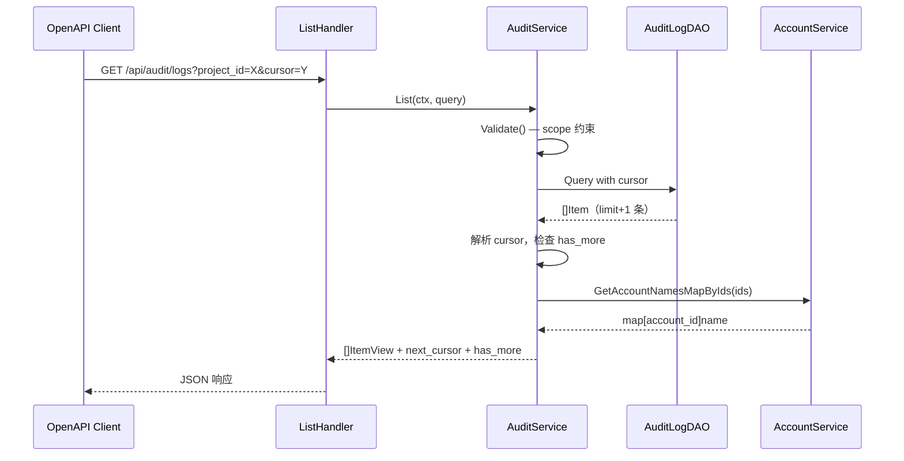

# 详细设计 A：Wave 审计日志（PostgreSQL 方案）

| 元数据 | |
|---|---|
| **目录** | `20260626-Wave-Feat-AddAuditLog` |
| **创建日期** | 2026-07-06 |
| **最后更新** | 2026-07-07（按新模版重写） |
| **状态** | Reviewing |
| **关联 spec** | [01-spec.md](./01-spec.md) |
| **关联 plan** | [03-plan.md](./03-plan.md) |
| **设计者** | AI 架构师 |
| **产出命名** | `04-detail-pg.md`（多方案，后缀 `-pg` 标识 PostgreSQL 方案） |

---

## 1. 背景承接

### 1.1 回顾

[03-plan-pg.md](./03-plan-pg.md) 选择 PostgreSQL 作为审计日志 V1 的存储方案。PG 方案的核心思路是：业务操作成功后，Controller/Service 显式调用 `audit.Log()` 将审计事件 enqueue 到内存 channel；后台 FlushWorker 批量写入 `global.audit_log`；写入失败则记 error 日志 + 累加 drop counter，不设本地 spool。

PG 优先的理由是改动面最小（复用现有 `globaldb` 和 DAO 模式）、幂等语义最干净（`id` PK 唯一性 + `ON CONFLICT DO NOTHING`）、审计解释性最强。

### 1.2 本详细设计聚焦的实现问题

- FlushWorker 的 goroutine 生命周期管理：Start / Stop / Shutdown drain
- channel 满时非阻塞 enqueue 与丢弃策略
- detail 大小预算与 PG TOAST 压缩
- Cursor 编解码格式：基于 `id`（UUID v7）


---

## 3. 实现总览

审计日志模块在 Wave 中属于**新增基础设施**，不修改现有业务逻辑。变更集中在三层：

1. **上下文层**（`pvctx`）：新增 `client_ip` 与 `audit_source` 的读取/写入/异步透传
2. **审计核心层**（`apps/web/service/auditlog/`）：Log 入口、枚举常量、writer
3. **接入层**（13 个 controller + MCP server）：每处加 1-3 行显式调用

数据流动方向：Controller → `audit.Log()` → channel → FlushWorker → `global.audit_log`（失败则丢弃 + error 日志）


---

## 4. 数据模型 / API / 配置定义

### 4.1 数据模型

#### 新增表

> global migration 脚本命名如 `script/migration/scripts/global_v20260707_audit_log.sql`；bootstrap DDL 同步到 `script/sql/pgsql/global.sql`。  
> 因现有 SQL migration 运行在事务中，**不要使用 `CREATE INDEX CONCURRENTLY`**；这里建的是新表，普通 `CREATE INDEX IF NOT EXISTS` 即可。

```sql
CREATE TABLE IF NOT EXISTS audit_log (
    id           VARCHAR(64) PRIMARY KEY,
    org_id       BIGINT,
    project_id   BIGINT,
    account_id   BIGINT,
    account_name VARCHAR(128),
    target_id    VARCHAR(64),
    target_name  VARCHAR(256),
    action       VARCHAR(64) NOT NULL,
    domain       VARCHAR(64) NOT NULL,
    feature      VARCHAR(64) NOT NULL,
    source       VARCHAR(16) NOT NULL DEFAULT 'web',
    extra        TEXT,
    ip_address   VARCHAR(64) NOT NULL,
    occurred_at  TIMESTAMPTZ NOT NULL
);

CREATE INDEX IF NOT EXISTS idx_audit_log_project_time
    ON audit_log (project_id, occurred_at DESC);

CREATE INDEX IF NOT EXISTS idx_audit_log_org_time
    ON audit_log (org_id, occurred_at DESC);

CREATE INDEX IF NOT EXISTS idx_audit_log_account_time
    ON audit_log (account_id, occurred_at DESC)
    WHERE account_id IS NOT NULL;
```

| 字段 | 类型 | 约束 | 默认值 | 说明 |
|---|---|---|---|---|
| `id` | `VARCHAR(64)` | PK | — | UUID v7，嵌入 ms 时间戳，可用作游标 |
| `org_id` | `BIGINT` | NULL | — | 账号层事件为 NULL |
| `project_id` | `BIGINT` | NULL | — | 组织/账号层事件为 NULL |
| `account_id` | `BIGINT` | NULL | — | login_failed 等无法确认为 NULL |
| `account_name` | `VARCHAR(128)` | NULL | — | 事件发生时操作人名称快照，best effort |
| `target_id` | `VARCHAR(64)` | NULL | — | 登录事件为 NULL |
| `target_name` | `VARCHAR(256)` | NULL | — | 事件发生时被操作对象名称快照 |
| `action` | `VARCHAR(64)` | NOT NULL | — | created/updated/deleted/logged_in/logged_out/login_failed |
| `domain` | `VARCHAR(64)` | NOT NULL | — | account/organization/project |
| `feature` | `VARCHAR(64)` | NOT NULL | — | 共 26 个，完整列表见 §10：session/chart/experiment/... |
| `source` | `VARCHAR(16)` | NOT NULL | `'web'` | web/openapi/mcp/agent |
| `extra` | `TEXT` | NULL | — | 自由格式 JSON 字符串 |
| `ip_address` | `VARCHAR(64)` | NOT NULL | — | 合规刚需 |
| `occurred_at` | `TIMESTAMPTZ` | NOT NULL | — | 事件发生时间，唯一时间戳 |

#### 索引策略

| 索引 | 所属表 | 列 | 原因 |
|---|---|---|---|
| `idx_audit_log_project_time` | `global.audit_log` | `(project_id, occurred_at DESC)` | 项目级时间范围查询，最高频 |
| `idx_audit_log_org_time` | `global.audit_log` | `(org_id, occurred_at DESC)` | 组织级时间范围查询 |
| `idx_audit_log_account_time` | `global.audit_log` | `(account_id, occurred_at DESC)` WHERE account_id NOT NULL | 按人追溯查询 |

> 注：V1 未创建 `id` 独立索引。所有查询均以 project_id / org_id / account_id 为先导条件，独立索引无实际查询收益，仅增加写入开销。V2 可替换为 `(project_id, id DESC)` 复合索引，利用 UUID v7 时序性消除 `occurred_at` 的冗余排序。

### 4.2 API / 接口

#### 新增接口

| 方法 | 路径 | 输入 | 输出 | 权限 | 频率限制 |
|---|---|---|---|---|---|
| `GET` | `/api/audit/logs` | Query params: org_id, project_id, account_id, domain, feature, action, target_id, start_time, end_time, cursor, limit | `{items: [], next_cursor: string, has_more: bool}` | 组织管理员/项目管理员 | 60 req/min |
| `GET` | `/api/audit/export` | 同上 + `format: csv\|xlsx` | `Content-Disposition: attachment`；上限 1000 行 | 组织管理员/项目管理员 | 10 req/min |

### 4.3 配置项

| 配置键 | 类型 | 默认值 | 说明 | 动态生效? |
|---|---|---|---|---|
| `audit_log_batch_size` | `int` | `100` | 单批最大行数；上限 500（spec 约束） | ❌ |
| `audit_log_flush_interval` | `duration` | `1s` | 定时 flush 间隔 | ❌ |
| `audit_log_queue_size` | `int` | `4096` | channel 容量，满时非阻塞丢弃并记 counter + error 日志，不设 spool。日均 ~6 条/秒（全环境 50 万行/天），4096 可容纳 ~11 分钟突发峰值（4096 条 × 假设每条 Entry ~1KB ≈ 4MB 内存，完全可以接受，后续再按实际调整） | ❌ |
| `audit_log_extra_max_bytes` | `int` | `2048` | extra 大小预算 (2KB)，超限截断至前 2KB 并打 warn 日志。正常 extra < 100B，2KB 充足 | ❌ |
| `audit_log_export_max_rows` | `int` | `1000` | 单次导出最大行数。CSV < 1MB。按需逐步上调 | ❌ |

### 4.4 Entry 结构与 Extra 约定

```go
// Entry 审计日志条目。调用方只需填充业务字段，其余由 Log 内部从 pvctx 提取。
type Entry struct {
    Domain     Domain
    Feature    Feature
    Action     Action
    TargetID   string         // 被操作资源 ID
    TargetName string         // 事件发生时被操作对象名称快照
    Extra      map[string]any // 自由格式 JSON，由 Log 内部序列化
}

type Domain string
const (
    DomainAccount      Domain = "account"
    DomainOrganization Domain = "organization"
    DomainProject      Domain = "project"
)

type Feature string
const (
    FeatureSession            Feature = "session"
    FeatureAccountSetting     Feature = "account_setting"
    FeatureAPIToken           Feature = "api_token"
    FeatureOrgSetting         Feature = "org_setting"
    FeatureOrgMember          Feature = "org_member"
    FeatureOrgMemberInvitation Feature = "org_member_invitation"
    FeatureProjectSetting     Feature = "project_setting"
    FeatureProjectMember      Feature = "project_member"
    FeatureChart              Feature = "chart"
    FeatureDashboard          Feature = "dashboard"
    FeatureCohort             Feature = "cohort"
    FeaturePipeline           Feature = "pipeline"
    FeatureTrackingPlan       Feature = "tracking_plan"
    FeatureExperiment         Feature = "experiment"
    FeatureFeatureGate        Feature = "feature_gate"
    FeatureFeatureConfig      Feature = "feature_config"
    FeatureLayer              Feature = "layer"
    FeatureHoldout            Feature = "holdout"
    FeatureTarget             Feature = "target"
    FeatureMetric             Feature = "metric"
    FeatureTrackedEvent       Feature = "tracked_event"
    FeatureVirtualEvent       Feature = "virtual_event"
    FeatureEventProperty      Feature = "event_property"
    FeatureUserProperty       Feature = "user_property"
    FeatureUserVirtualProperty  Feature = "user_virtual_property"
    FeatureEventVirtualProperty Feature = "event_virtual_property"
)

type Action string
const (
    ActionCreated     Action = "created"
    ActionUpdated     Action = "updated"
    ActionDeleted     Action = "deleted"
    ActionLoggedIn    Action = "logged_in"
    ActionLoggedOut   Action = "logged_out"
    ActionLoginFailed Action = "login_failed"
)

// Log 审计日志入口。domain/feature/action 使用编译时常量。
// occurred_at 由 Log 内部取 time.Now()；org_id/project_id/account_id/account_name/source/client_ip 从 pvctx 自动提取。
func Log(ctx context.Context, e Entry)
```

**Extra 约定**：

- 自由格式 JSON，业务方控制内容，无结构化 envelope
- 单条 extra 大小预算 **2KB**（JSON 序列化后），超限直接截断至前 2KB + warn 日志
- JSON marshal 失败视为编程错误，error 日志 + 跳过该事件
- 调用方不得将密码、token、secret、email 等敏感内容放入 Extra

### 4.5 外部依赖与集成契约

#### 依赖清单

| 外部系统/模块 | 依赖类型 | 提供的接口 | 集成方式 | 版本要求 | SLA | 故障影响 |
|---|---|---|---|---|---|---|
| PostgreSQL（globaldb） | 基础设施 | SQL INSERT/SELECT | GORM / sqlx 直连 | PG 12+ | 集群 SLA | 审计写入失败则丢弃 + error 日志 |
| gin `ClientIP()` | 框架 | gin 路由 IP 提取 | `c.ClientIP()`，反向代理透传 `X-Real-IP` | gin v1.x | 框架提供 | 无 TrustedProxies 配置时 IP 可能为容器 IP；V1 文档说明此限制 |
| `net/http.Request` | 框架 | MCP 路由 IP 提取 | 优先读 `X-Real-IP`（反向代理透传），降级读 `RemoteAddr` | Go stdlib | 框架提供 | 网关丢帧时降级值不准确 |
| `pvctx` | 内部模块 | 鉴权与审计上下文 | 函数调用 | 当前版本 | 内部 | 需新增 `audit_source` 与 `client_ip` |

> **IP 提取策略**：优先读反向代理透传的 `X-Real-IP`，降级读 `RemoteAddr`。不配置全局 `TrustedProxies`（影响所有 gin 路由，超出审计范围）。V1 文档说明此限制，IP 可能在某些场景下不准确。

> **连接池**：PGWriter 复用 globaldb 的连接池，不创建独立连接池。分布式下多副本 × 独立池会无谓增加 PG 连接数，且审计丢弃可接受（尽力记录原则），无需隔离。如未来审计流量显著影响业务池，见 §12 V2 规划 #4。

#### 集成契约

- **PostgreSQL（globaldb）**：
  - 接口契约：标准 SQL `INSERT ... ON CONFLICT DO NOTHING` / `SELECT ... WHERE ... ORDER BY ... LIMIT`
  - 鉴权方式：复用 globaldb 连接池（同一 PG 实例、同一凭据），不创建独立池
  - 错误语义：连接超时（可重试）、唯一约束冲突（幂等正常）、字段超长（不可恢复）
  - 超时配置：查询超时 10s，写入超时 5s
  - 熔断降级：写入失败丢弃 + error 日志，不熔断
  - 联调计划：不需要跨团队联调

---

## 5. 分模块详细技术方案

### 5.1 上下文模块（pvctx）

#### 职责

在请求上下文中保持 `client_ip` 与 `audit_source`，并支持异步 goroutine 通过 `BackGroundCtx` 获取。

#### 新增函数

```go
func ClientIP(ctx context.Context) string                      // 从 ctx 读取 client_ip
func WithClientIP(ctx context.Context, ip string) context.Context // 将 client_ip 写入 ctx
func AuditSource(ctx context.Context) string                   // 从 ctx 读取审计来源：web / openapi / mcp / agent
func WithAuditSource(ctx context.Context, source string) context.Context
```

#### `BackGroundCtx` 扩展

```go
func BackGroundCtx(ctx context.Context) context.Context {
    bg := context.Background()
    if pid := Pid(ctx); pid != 0 { bg = WithPid(bg, pid) }
    if aid := Aid(ctx); aid != 0 { bg = WithAid(bg, aid) }
    if token := Token(ctx); token != "" { bg = WithToken(bg, token) }
    if IsAccountAPIToken(ctx) { bg = WithAccountAPIToken(bg, true) }
    if aname := Aname(ctx); aname != "" { bg = WithAname(bg, aname) }
    if reqid := Reqid(ctx); reqid != "" { bg = WithReqid(bg, reqid) }
    if traceid := Traceid(ctx); traceid != "" { bg = WithTraceid(bg, traceid) }
    if lang := Language(ctx); lang != "" { bg = WithLanguage(bg, lang) }
    if ip := ClientIP(ctx); ip != "" { bg = WithClientIP(bg, ip) }
    if source := AuditSource(ctx); source != "" { bg = WithAuditSource(bg, source) }
    if oid := OrgID(ctx); oid != 0 { bg = WithOrgID(bg, oid) }
    return bg
}
```

#### 注入点

| 入口 | 注入时机 | 代码位置 |
|---|---|---|
| gin 根 middleware | 站外请求进入时默认注入 `source = ui` | `apps/web/server.go` 或通用 middleware |
| Session 认证 | 保留默认 `source = ui`，并写入 `Aname` | `pkg/ginx/middleware/session.go` |
| API Token 认证 | token 鉴权命中后覆盖为 `source = api_token` | `pkg/ginx/middleware/account_api_token.go` |
| MCP 请求 | `contextInjectionHandler` 中显式注入 `source = mcp` 与 `client_ip` | `apps/web/mcp/server.go` |
| **OrganizationFilter** | **扩大范围注入 `org_id`**，去掉 `IsAccountAPIToken` 短路；API Token / Session 统一走提取逻辑；无上下文路径（account/OP）不注入，写 NULL | `pkg/ginx/middleware/organization.go` |

---

### 5.2 审计写入模块（writer_pg）

#### 职责

消费 channel 中的审计条目，批量写入 PG。

#### 关键函数

```go
func (w *PGWriter) Start(ctx context.Context)    // 启动 flushLoop goroutine
func (w *PGWriter) Stop(ctx context.Context)     // 停止 flushLoop，drain 剩余条目
```

#### Channel 配置

| 参数 | 值 | 说明 |
|------|----|------|
| buffer 大小 | 4096 | 内存上限约 4MB（按 1KB/条估算），容纳突发写入 |
| 满时行为 | 非阻塞 enqueue，满时丢弃并记 `audit_channel_drop_total` + error 日志 | V1 全量事件均为尽力投递，不设本地 spool |
| Stop() drain | 等待 channel 消费完毕或超时 5s | 保证滚动更新不丢 in-flight 条目 |
| 背压监控 | channel 使用率（depth/cap）每 10s 记一次 metric | 用于观察消费能力是否足够 |

> channel 是 Go 原生 `chan *Entry`，进程内 FIFO 队列。多副本时各进程独立，不跨副本协调。条目不会在 channel 中阻塞主流程——buffer 满时立即丢弃并记 counter + error 日志，不存在阻塞等待路径。
> 
> **优雅重启 drain 机制**：shutdown 顺序为 `server.Shutdown()`（先停 HTTP）→ `writer.Stop()`（等待 channel 消费完毕或超时 5s）→ `globaldb.Close()`。HTTP 先停保证无新 `audit.Log()` 调用，writer 执行时数据库连接仍可用。`kill -9`/OOM 等非优雅退出存在内存队列丢失窗口。
> 
> **连接池**：PGWriter 复用 globaldb 的 `*sql.DB`，不创建独立池。详见 §4.5。

| 函数 | 作用 | 事务边界 | 权限校验 | 重入安全? |
|---|---|---|---|---|
| `Start()` | 启动后台 goroutine | 无 | 无 | ✅ 幂等 |
| `Stop()` | drain 后退出 | 🟢 Begin → 🔴 Commit | 无 | ✅ 幂等 |
| `flush()` | 批量写入 PG | 🟢 Begin → 🔴 Commit | 无 | ✅ 幂等 |

#### 核心逻辑流程

```
flushLoop:
  ticker 1s
  ┌─ channel 有数据？→ 收集最多 batchSize 条
  ├─ 够 batchSize 或 ticker 触发 → flush
  │    ├─ batch INSERT ON CONFLICT DO NOTHING
  │    ├─ 成功 → continue
  │    └─ 失败 → retry 3 次
  │         ├─ 重试成功 → continue
  │         └─ 重试耗尽 → error 日志 + drop counter（不设 spool）
  └─ shutdown signal → drain 剩余数据 → flush → exit
```

#### 事务边界标记

```
🟢 ── Begin Transaction ──────────────────────────
    │ 1. batch INSERT 最多 100 行
    │ 2. 影响范围：global.audit_log 表
🔴 ── Commit ─────────────────────────────────────
```

> 事务内不包含任何跨网络调用。每个 batch 独立事务，不与其他 batch 共享事务。

#### 错误处理

| 失败场景 | 错误类型 | 处理方式 | 补偿机制 |
|---|---|---|---|
| PG 连接超时 | 可重试 | 重试 3 次，指数退避（100ms/500ms/1s），仍失败则丢弃 + error 日志 | 不设 spool，接受极值有限丢失 |
| 唯一约束冲突（id） | 可忽略 | ON CONFLICT DO NOTHING，影响行数 0 | 天然幂等，无补偿 |
| 字段超长 | 不可恢复 | 记 error log，跳过该条 | 人工排查 |

#### 接口深度评估

- **Interface 大小**：2 个方法（`Start` / `Stop`），无公开配置方法
- **隐藏的实现复杂度**：内部管理 goroutine 生命周期、channel 消费节流、batch 聚合、重试退避
- **可测试性**：通过 mock DAO 层可独立测试 flush/replay 逻辑
- **评价**：Deep ✅ — 大量行为隐藏在 `Start` / `Stop` 背后

---

### 5.3 指标

| 指标 | 类型 | 说明 |
|---|---|---|
| `audit_channel_drop_total` | counter | channel 满或 flush 失败时丢弃条目数；仅此一个指标 |

---

### 5.4 Extra 模块（extra）

#### 职责

处理 `Entry.Extra` 的 JSON 序列化与大小预算检查。

#### 敏感字段处理

调用方在构造 Extra 时自行排除敏感字段。入口层不设脱敏过滤，不依赖运行时脱敏。

**约束约定**：调用方不得将密码、token、secret、email、api_key、connection_string 等敏感内容放入 Extra。DAO 层做 batched INSERT，不对 Extra 内容做字段级检查。

#### Extra 大小预算

单条 extra（JSON 序列化后）上限 **2KB**。超限时直接截断至前 2KB + warn 日志。JSON marshal 失败视为编程错误，error 日志 + 跳过该事件。

---

### 5.5 查询与导出模块（query）

#### 职责

提供审计日志的 scoped 查询和 CSV/Excel 导出。

#### 查询约束校验

```go
func (q *Query) Validate() error {
    if q.OrgID == nil && q.ProjectID == nil && q.AccountID == nil {
        return errors.New("audit: at least one of OrgID/ProjectID/AccountID is required")
    }
    if q.StartTime == nil || q.EndTime == nil {
        return errors.New("audit: start_time and end_time are required")
    }
    if q.EndTime.Before(*q.StartTime) {
        return errors.New("audit: end_time must be greater than or equal to start_time")
    }
    if q.Limit <= 0 || q.Limit > 1000 {
        q.Limit = 100  // 默认 100，最大 1000
    }
    return nil
}
```

#### Cursor 编解码

UUID v7 内含毫秒级时间戳且全局唯一，天然按时间排序，可用作游标。Wave 中直接复用 `pkg/lib/util.NewUUID()`（已封装 `google/uuid v1.6.0`，零新增依赖）。

```go
// cursor 格式：base64(id)
func EncodeCursor(id string) string {
    return base64.RawURLEncoding.EncodeToString([]byte(id))
}

func DecodeCursor(cursor string) (id string, err error) {
    raw, err := base64.RawURLEncoding.DecodeString(cursor)
    if err != nil { return "", err }
    return string(raw), nil
}
```

查询 SQL（时间范围由 start_time/end_time 控制，游标仅用于分页翻页）：
```sql
SELECT id, org_id, project_id, account_id, account_name,
       target_id, target_name, domain, feature, action, source,
       ip_address, extra, occurred_at
FROM global.audit_log
WHERE project_id = $1
  AND occurred_at >= $2
  AND occurred_at < $3
  AND id < $cursor_id
ORDER BY id DESC
LIMIT $4;
```

#### 导出一致性

Export（CSV/XLSX）不承诺快照一致性。导出结果包含开始时刻前的全部数据，导出期间新写入的条目可能部分包含。原因是审计日志是 append-only 表，几秒偏差对归档/分析无实质影响。如未来有合规要求再做事务快照隔离。

#### 导出实现

- **上限**：单次导出最多 1,000 行，超过返回 422 Unprocessable Entity，提示缩小时间范围或分批导出
- **CSV 流式**：DAO 层通过 `LIMIT/OFFSET` 分段读取（每批 1,000 行），service 层循环写入 `csv.Writer` 到 `http.ResponseWriter`，每批 flush 一次。不缓存全部数据在内存中
- **XLSX 非流式**：使用 `excelize` 库构建完整 workbook 再写出，上限 1,000 行，内存约 500KB

#### 账号名补齐

```go
// 查询后补齐当前 account_name（辅助可读性字段）。
// account_name 若存在，代表写入时可获得的快照名；若为空，不额外回填成”历史快照”。
func (s *Service) enrichAccountNames(ctx context.Context, items []Item) []ItemView {
    ids := collectAccountIDs(items)
    if len(ids) == 0 { return toViews(items) }
    names := accountSvc.GetAccountNamesMapByIds(ctx, ids)
    return toViewsWithCurrentName(items, names)
}
```

---

## 6. 业务流程图

### 6.1 正常流程（写路径）

> 流程图与 [§7 时序图](#7-时序图) 展示相同流程，以时序图为准。

---

## 7. 时序图

### 7.1 主调用链路（写路径）



### 7.2 查询路径



---

## 8. 测试策略

### 8.1 测试矩阵

| 测试类型 | 覆盖范围 | 方法 | 关键场景 |
|---|---|---|---|
| **单元测试** | extra.go / writer_pg.go / query.go | Go testing + mock DAO | 大小预算、cursor 编解码、scope 校验、flush 逻辑 |
| **集成测试** | globaldb + audit writer | testcontainers PG | batch INSERT、ON CONFLICT、channel 满丢弃 |
| **边界测试** | detail 大小超限、account_id NULL、队列满 | 参数化测试 | 超限清零 detail 并告警；空值写入；channel 满丢弃 |
| **并发测试** | 多 goroutine 同时 Log() | `go test -race` | channel 竞争 |

### 8.2 可测试性分析

| 模块 | 测试策略 | 依赖注入方式 | 是否需要 Mock 服务 |
|---|---|---|---|
| `Extra` 截断 | 纯函数测试 | 函数参数传入 Extra | 否 |
| `PGWriter` flush | 接口测试 | DAO 接口注入 | 是，mock DAO |
| `Query` cursor/scope | 纯函数测试 | 函数参数传入 Query | 否 |

---

## 9. 实现风险评估

| # | 风险点 | 概率 | 影响 | 预防措施 | 补救措施 |
|---|---|---|---|---|---|
| 1 | IP 地址可能不准确 | 中 | 低 | 无 TrustedProxies 配置，依赖反向代理透传 X-Real-IP；文档说明限制 | V2 按需引入 TrustedProxies |
| 2 | PG 不可用导致审计行丢弃 | 低 | 中 | 3 次重试 + error 日志 + drop counter | 告警后人工恢复 PG |
| 3 | extra 超限截断 | 极低 | 低 | 2KB 预算，超限截断至前 2KB + warn 日志 | 人工排查上游数据建模 |
| 4 | id 冲突导致写入丢失 | 极低 | 低 | UUID v7，PK 唯一性保证 | 天然安全 |

### 9.1 补偿策略总表

| 失败场景 | 可重试? | 重试策略 | 回滚策略 | 最终一致性保障 |
|---|---|---|---|---|
| PG INSERT 失败 | ✅ | 3 次 + 指数退避，仍失败则丢弃 | 无（不涉及业务回滚） | error 日志 + drop counter |
| extra 超限 | ❌ | 不重试，截断至前 2KB | 记 warn 日志 | 审计行不丢失 |
| channel 满 | ❌ | 非阻塞丢弃 + error 日志 | 记 drop counter | 接受极值有限丢失 |

> **V1 已知限制：IP 地址准确性**
>
> V1 的 `client_ip` 来源依赖反向代理透传的 `X-Real-IP` 请求头。在未配置 `TrustedProxies` 白名单时，恶意客户端可伪造该头。这是 V1 的有意简化——IP 在审计中作为参考线索而非唯一证据，且内部环境下篡改风险可控。如合规要求提升，V2 按需引入 `TrustedProxies` + `gin.ClientIP()` 严格模式。

---

## 10. 接入清单：Controller → Domain/Feature/Action 映射

> 以下按 Domain 分组，列出每个 Controller 中需要调用 `audit.Log()` 的具体 handler、对应的 domain/feature/action、以及 detail 构造示例。
>
> 调用时机：**业务操作成功后**（INSERT/UPDATE/DELETE 已提交或已确认生效后），异步写入不阻塞返回。
>
> **org_id 来源说明**：`audit.Log()` 内部从 `pvctx.OrgID(ctx)` 提取 org_id。账号层事件（§10.1）ctx 中无 OrgID，写 NULL。组织/项目层事件（§10.2–§10.5）由 OrganizationFilter 中间件统一注入——该中间件已扩大范围，去掉 `IsAccountAPIToken` 提前返回。Org 路由从请求参数提取 org_id；项目路由通过 `GetOrgIDByProjectCached` 反查（走缓存）；Account/OP 等无上下文路径不注入，写 NULL。MCP 由 `authorizeProjectContext` 注入。各 handler 无需手动处理 org_id。
>
> Extra 只包含业务相关字段（name、label、role 等），不含冗余的 id/type。
>
> 代码形态统一为：
> ```go
> audit.Log(ctx, audit.Entry{
>     Domain:     audit.DomainXxx,
>     Feature:    audit.FeatureXxx,
>     Action:     audit.ActionXxx,
>     TargetID:   targetID,
>     TargetName: name,
>     Extra:      map[string]any{...}, // 可选
> })
> ```
>
> 各 handler 只需替换 Domain/Feature/Action/TargetID/TargetName 字段值即可，不再为每个 handler 重复全量示例。

### 10.1 Domain: account

| # | Feature | Action | Controller | Handler | targetID | Extra 要点 |
|---|---|---|---|---|---|---|
| 1 | `session` | `logged_in` | `controller/account/account.go` | `LoginAccount` | 空 | Account: `{id}`, 无 Target |
| 2 | `session` | `logged_out` | `controller/account/account.go` | `LogoutAccount` | 空 | Account: `{id}`, 无 Target |
| 3 | `session` | `login_failed` | `controller/account/account.go` | `LoginAccount`（失败路径） | 空 | Account: `{id}`（可识别时）或 `{name: "登录名"}`（仅标识），不记录密码 |
| 4 | `account_setting` | `updated` | `controller/account/account.go` | `UpdateAccountInfo` / `UpdateAccountPwd` | account ID | Target: `{name}` |
| 5 | `api_token` | `created` | `controller/account/account_api_token.go` | `CreateAAPIToken` | token ID | Target: `{label}` |
| 6 | `api_token` | `updated` | 同上 | `UpdateAAPIToken` / `OperateAAPITokenStatus` | token ID | Target: `{label}` |
| 7 | `api_token` | `deleted` | 同上 | `DeleteAAPIToken` | token ID | Target: `{label}` |

### 10.2 Domain: organization

| # | Feature | Action | Controller | Handler | targetID | Extra 要点 |
|---|---|---|---|---|---|---|
| 8 | `org_setting` | `updated` | `controller/organization/organization.go` | `UpdateOrgInfo` | org ID | Target: `{name}` |
| 9 | `org_member` | `created` | `controller/organization/member.go` | `CreateOrgMemberInvite` | 成员 account ID | Target: `{name, role}` |
| 10 | `org_member` | `updated` | 同上 | `UpdateOrgMember` | 成员 account ID | Extra: `{role_before, role_after}` |
| 11 | `org_member` | `deleted` | 同上 | `DeleteOrgMember` | 成员 account ID | Target: `{name}` |
| 12 | `org_member_invitation` | `created` | `controller/organization/member.go` | `CreateOrgMemberInvite` | invitation ID | Target: `{email_hint}` |
| 13 | `org_member_invitation` | `deleted` | 同上 | —（不存在独立 handler） | invitation ID | Target: `{}` |

### 10.3 Domain: project

| # | Feature | Action | Controller | Handler | targetID | Extra 要点 |
|---|---|---|---|---|---|---|
| 14 | `project_setting` | `updated` | `controller/project/project.go` | `UpdateProjectInfo` | project ID | Target: `{name}` |
| 15 | `project_member` | `created` | `controller/project/member.go` | `AddProjectMember` | 成员 account ID | Target: `{name, role}` |
| 16 | `project_member` | `updated` | 同上 | `UpdateProjectMember` | 成员 account ID | Extra: `{role_before, role_after}` |
| 17 | `project_member` | `deleted` | 同上 | `DeleteProjectMember` | 成员 account ID | Target: `{name}` |

### 10.4 Domain: project（资产类）

| # | Feature | Action | Controller | Handler | targetID | Extra 要点 |
|---|---|---|---|---|---|---|
| 18 | `chart` | `created` | `controller/chart/chart.go` | `AddNewChart` | chart ID | Target: `{name, ...filtered}` |
| 19 | `chart` | `updated` | 同上 | `UpdateChartDetail` | chart ID | Target: `{name, ...filtered}` |
| 20 | `chart` | `deleted` | 同上 | `DeleteChart` | chart ID | Extra: `{ids: [...]}`（批量时需手动循环） |
| 21 | `dashboard` | `created` | `controller/dashboard/dashboard.go` | `CreateNewDashboard` | dashboard ID | Target: `{name}` |
| 22 | `dashboard` | `updated` | 同上 | `UpdateDashboardDetail` / `AddChartsToDashboard` / `PostUbaDashboardsChartsDelete` | dashboard ID | Extra: `{chart_ids: [...]}` |
| 23 | `dashboard` | `deleted` | 同上 | `DeleteDashboard` | dashboard ID | Extra: `{ids: [...]}`（批量时需手动循环） |
| 24 | `cohort` | `created` | `controller/analysis/cohort.go` | `CreateRuleCohort` | cohort ID | Target: `{name}` |
| 25 | `cohort` | `updated` | 同上 | `UpdateRuleCohort` | cohort ID | Target: `{name}` |
| 26 | `cohort` | `deleted` | 同上 | `DeleteCohort` | cohort ID | Target: `{name}` |
| 27 | `experiment` | `created` | `controller/ab/ab.go` | `PostAbCreate` | experiment ID | Target: `{name}` |
| 28 | `experiment` | `updated` | 同上 | `PostAbExpUpdate` | experiment ID | Target: `{name}` |
| 29 | `experiment` | `deleted` | 同上 | `PostAbStatusUpdate` | experiment ID | Target: `{name}`（仅 DELETE） |
| 30 | `feature_gate` | `created` | `controller/ab/ab.go` | `PostAbCreate` | flag ID | Target: `{name}` |
| 31 | `feature_gate` | `updated` | 同上 | `PostAbGateUpdate` | flag ID | Target: `{name}` |
| 32 | `feature_gate` | `deleted` | 同上 | `PostAbStatusUpdate` | flag ID | Target: `{name}`（仅 DELETE） |
| 33 | `feature_config` | `created` | `controller/ab/ab.go` | `PostAbCreate` | config ID | Target: `{name}` |
| 34 | `feature_config` | `updated` | 同上 | `PostAbConfigUpdate` | config ID | Target: `{name}` |
| 35 | `feature_config` | `deleted` | 同上 | `PostAbStatusUpdate` | config ID | Target: `{name}`（仅 DELETE） |
| 36 | `pipeline` | `created` | `controller/pipeline/pipeline.go` | `PipelineCreate` | pipeline ID | Target: `{name}` |
| 37 | `pipeline` | `updated` | 同上 | `PipelineUpdate` | pipeline ID | Target: `{name}` |
| 38 | `pipeline` | `deleted` | 同上 | `PipelineDelete` | pipeline ID | Target: `{name}` |
| 39 | `tracking_plan` | `created` | `trackingplan/controller/tracking_plan.go` | `PostDcTrackingPlanSave` | plan ID | Target: `{name}` |
| 40 | `tracking_plan` | `updated` | 同上 | `PostDcTrackingPlanSave` | plan ID | Target: `{name}` |
| 41 | `tracking_plan` | `deleted` | 同上 | `PostDcTrackingPlanDelete` | plan ID | Target: `{name}` |
| 42 | `layer` | `created` | `controller/ab/ab.go` | `PostAbLayerCreate` | layer ID | Target: `{name, parent_experiment_id}` |
| 43 | `layer` | `updated` | 同上 | —（不存在独立 handler） | layer ID | Target: `{name}` |
| 44 | `layer` | `deleted` | 同上 | `PostAbLayerDelete` | layer ID | Target: `{name}` |
| 45 | `holdout` | `created` | `controller/ab/ab.go` | `PostAbHoldoutCreate` | holdout ID | Target: `{name, parent_experiment_id}` |
| 46 | `holdout` | `updated` | 同上 | `PostAbHoldoutUpdate` | holdout ID | Target: `{name}` |
| 47 | `holdout` | `deleted` | 同上 | `PostAbHoldoutDelete` | holdout ID | Target: `{name}` |
| 48 | `target` | `created` | `controller/ab/ab.go` | `PostAbTargetCreate` | target ID | Target: `{name, parent_experiment_id}` |
| 49 | `target` | `updated` | 同上 | `PostAbTargetUpdate` | target ID | Target: `{name}` |
| 50 | `target` | `deleted` | 同上 | `PostAbTargetDelete` | target ID | Target: `{name}` |

> - PostAbStatusUpdate 仅对 `operation_type=DELETE` 场景审计；状态变更（ONLINE/OFFLINE/DEBUG）属产品功能，不审计。

### 10.5 Domain: project（元数据类）

| # | Feature | Action | Controller | Handler | targetID | Extra 要点 |
|---|---|---|---|---|---|---|
| 51 | `metric` | `created` | `controller/metadata/metric.go` | `CreateMetric` | metric ID | 对象名 |
| 52 | `metric` | `updated` | 同上 | `UpdateMetric` | metric ID | 对象名 |
| 53 | `metric` | `deleted` | 同上 | `DeleteMetrics` | metric ID | 对象名 |
| 54 | `tracked_event` | `created` | `controller/metadata/tracked_event.go` | `CreateTrackedEvent` | event ID | 对象名 |
| 55 | `tracked_event` | `updated` | 同上 | `UpdateTrackedEvent` | event ID | 对象名 |
| 56 | `tracked_event` | `deleted` | 同上 | `DeleteTrackedEvent` | event ID | 对象名 |
| 57 | `virtual_event` | `created` | `controller/metadata/virtual_event.go` | `CreateVirtualEvent` | event ID | 对象名 |
| 58 | `virtual_event` | `updated` | 同上 | `UpdateVirtualEvent` | event ID | 对象名 |
| 59 | `virtual_event` | `deleted` | 同上 | `DeleteVirtualEvent` | event ID | 对象名 |
| 60 | `event_property` | `created` | `controller/metadata/event_property.go` | `CreateEventProperty` | property ID | 对象名 |
| 61 | `event_property` | `updated` | 同上 | `UpdateEventProperty` | property ID | 对象名 |
| 62 | `event_property` | `deleted` | 同上 | `DeleteEventProperty` | property ID | 对象名 |
| 63 | `user_property` | `created` | `controller/metadata/user_property.go` | `CreateUserProperty` | property ID | 对象名 |
| 64 | `user_property` | `updated` | 同上 | `UpdateUserProperty` | property ID | 对象名 |
| 65 | `user_property` | `deleted` | 同上 | `DeleteUserProperty` | property ID | 对象名 |
| 66 | `user_virtual_property` | `created` | `controller/metadata/virtual_property.go` | `CreateVirtualProperty` | property ID | 对象名 |
| 67 | `user_virtual_property` | `updated` | 同上 | `UpdateVirtualProperty` | property ID | 对象名 |
| 68 | `user_virtual_property` | `deleted` | 同上 | `DeleteVirtualProperty` | property ID | 对象名 |
| 69 | `event_virtual_property` | `created` | `controller/metadata/virtual_property.go` | `CreateVirtualProperty` | property ID | 对象名 |
| 70 | `event_virtual_property` | `updated` | 同上 | `UpdateVirtualProperty` | property ID | 对象名 |
| 71 | `event_virtual_property` | `deleted` | 同上 | `DeleteVirtualProperty` | property ID | 对象名 |

### 10.6 接入代码示例

以下为四种典型场景的调用代码：

**场景 A：Chart Update（project domain 标准模式）**

```go
// controller/chart/chart.go
func (h *ChartHandler) UpdateChart(ctx, id, req) (res, err) {
    chart := h.dao.Get(id)
    // ... 权限校验、业务逻辑 ...
    h.dao.Update(chart) // 业务操作成功

    // 审计 — 异步，不阻塞返回
    audit.Log(ctx, audit.Entry{
        Domain:     audit.DomainProject,
        Feature:    audit.FeatureChart,
        Action:     audit.ActionUpdated,
        TargetID:   fmt.Sprint(chart.ID),
        TargetName: chart.Name,
    })
    return res, nil
}
```

**场景 B：Login（account domain，无 target）**

```go
// controller/account/account.go
func (h *AccountHandler) Login(ctx, req) (res, err) {
    account, err := h.auth.Authenticate(req)
    if err != nil {
        // 登录失败 — 仍记审计，account_id 可能为空
        audit.Log(ctx, audit.Entry{
            Domain:  audit.DomainAccount,
            Feature: audit.FeatureSession,
            Action:  audit.ActionLoginFailed,
            Extra:   map[string]any{"reason": "invalid credentials"},
        })
        return nil, err
    }

    token, _ := h.auth.GenerateToken(account)
    // 登录成功
    audit.Log(ctx, audit.Entry{
        Domain:  audit.DomainAccount,
        Feature: audit.FeatureSession,
        Action:  audit.ActionLoggedIn,
    })
    return token, nil
}
```

**场景 C：Batch Delete（project domain，extra 记录多对象）**

```go
// controller/dashboard/dashboard.go
func (h *DashboardHandler) BatchDeleteDashboards(ctx, ids) (res, err) {
    dashboards := h.dao.GetByIds(ids)
    h.dao.BatchDelete(ids) // 业务操作成功

    audit.Log(ctx, audit.Entry{
        Domain:     audit.DomainProject,
        Feature:    audit.FeatureDashboard,
        Action:     audit.ActionDeleted,
        TargetID:   fmt.Sprint(ids[0]),
        TargetName: dashboards[0].Name,
        Extra:      map[string]any{"ids": ids, "count": len(ids)},
    })
    return res, nil
}
```

**场景 D：Org Member Role Change（organization domain，extra 记录变更前后）**

```go
// controller/organization/member.go
func (h *OrgMemberHandler) UpdateMemberRole(ctx, memberID, newRole) (res, err) {
    member := h.dao.Get(memberID)
    oldRole := member.Role
    member.Role = newRole
    h.dao.Update(member) // 业务操作成功

    audit.Log(ctx, audit.Entry{
        Domain:     audit.DomainOrganization,
        Feature:    audit.FeatureOrgMember,
        Action:     audit.ActionUpdated,
        TargetID:   fmt.Sprint(member.AccountID),
        TargetName: member.Name,
        Extra:      map[string]any{"role_before": oldRole, "role_after": newRole},
    })
    return res, nil
}
```

---

## 11. 上线与回滚方案

### 11.1 部署顺序

| 步骤 | 操作 | 预期影响 | 回滚方式 |
|---|---|---|---|
| 1 | 执行 database migration：创建 `global.audit_log` 表 | 新增表，无向前不兼容 | `DROP TABLE global.audit_log` |
| 2 | 发布新版本服务（含 audit writer 和 controller 接入） | 新建审计底座，不会影响现有业务 | 回滚到上一版本 |
| 3 | 配置 `TrustedProxies` | IP 地址记录正确 | 移除 CIDR 或留空 |
| 4 | 观察审计指标 `audit_channel_drop_total` | 确认写入正常 | 不需要回滚 |

### 11.2 回滚检查清单

- [x] 数据库 migration 可回退（`DROP TABLE global.audit_log`）
- [x] 旧版代码与新版 schema 兼容（仅新增表，不改已有表）
- [x] 数据迁移任务不涉及（V1 不做历史数据迁移）
- [x] 回滚后业务数据不丢失（审计数据存在时不影响业务）
- [x] 回滚后可重新部署新版（幂等：表存在则跳过）

### 11.3 上线观测

| 关注指标 | 正常范围 | 告警触发 | 回滚触发条件 |
|---|---|---|---|
| audit_channel_drop_total | 0 | > 0（需确认是否短暂峰值） | > 1000 持续增长 |
| 业务 P99 延迟 | 增量 ≤ 5ms | 增量 > 10ms | 增量 > 50ms |

---

## 12. V2 规划

以下为 V1 明确不做的功能，列入 V2 范围：

| # | 项目 | 原因 | 触发条件 |
|---|---|---|---|
| 1 | **防篡改**：对 `audit_log` 表施加写入权限约束（TRIGGER / RLS / 独立 DB 用户），防止应用层被入侵后攻击者抹除审计痕迹 | V1 优先保证功能完整性和通路畅通，安全加固在底座稳定后跟进 | 安全审计要求 / SOC 2 认证 |
| 2 | **IP 地址可信**：引入 `TrustedProxies` 白名单，启用 `gin.ClientIP()` 严格模式 | V1 依赖反向代理透传，IP 作为参考线索 | 合规要求提升 |
| 3 | **复合索引优化**：`(project_id, id DESC)` 替换现有 `(project_id, occurred_at DESC)`，利用 UUID v7 天然时序保序特性消除 `occurred_at` 的冗余排序 | V1 现有索引已满足查询需求；迁移索引需停机窗口 | 查询性能瓶颈 / 表数据量 > 5000 万行 |
| 4 | **连接池隔离**：PGWriter 使用独立 `*sql.DB`，避免审计写满时影响业务 globaldb | V1 审计流量预期低，且 drop 可接受（尽力记录原则），无需隔离 | 审计流量明显影响业务 P99 |
