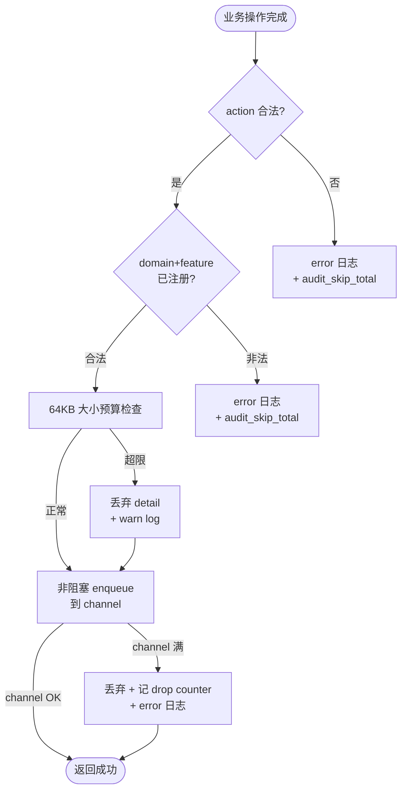
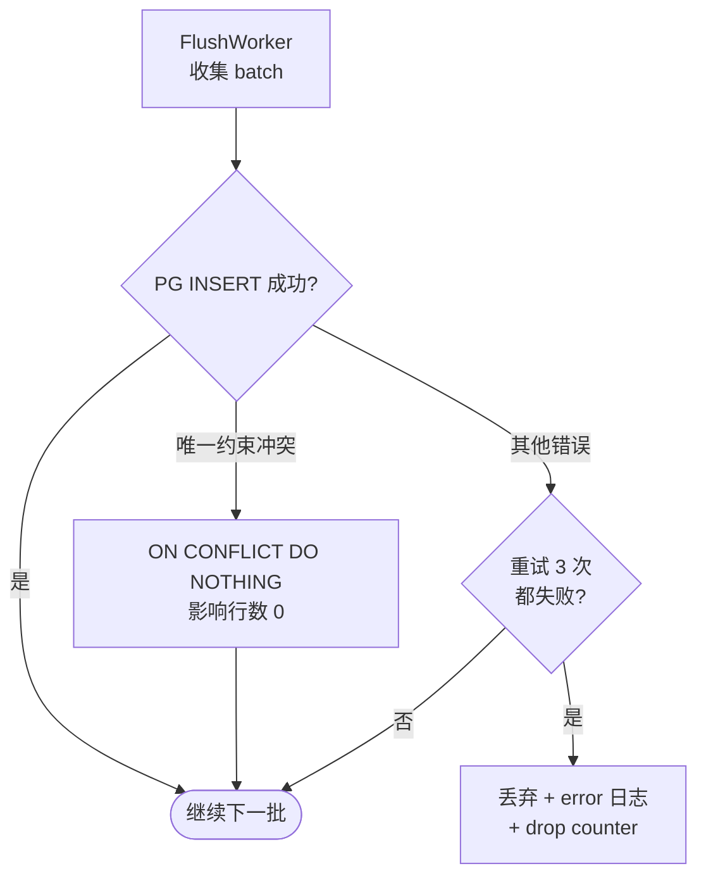
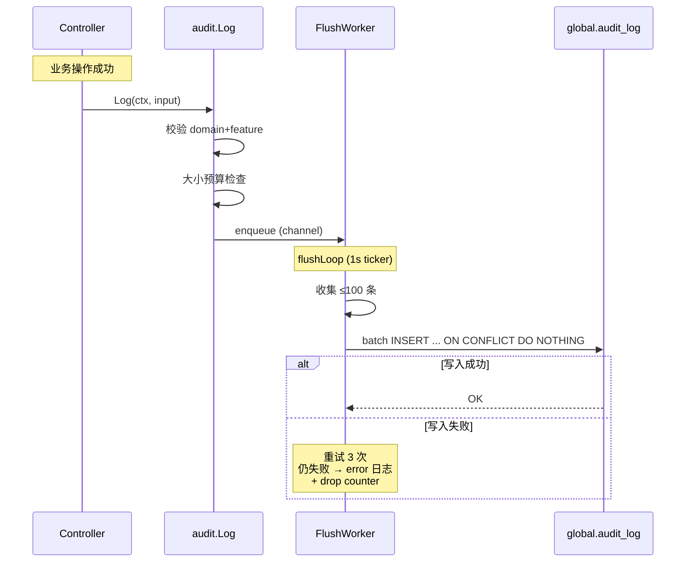
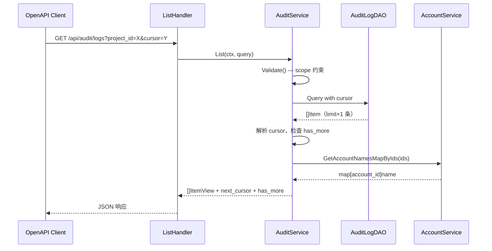

# 详细设计 A：Wave 审计日志（PostgreSQL 方案）

| 元数据 | |
|---|---|
| **目录** | `20260626-Wave-Feat-AddAuditLog` |
| **创建日期** | 2026-07-06 |
| **最后更新** | 2026-07-07（按新模版重写） |
| **状态** | Reviewing |
| **关联 spec** | [01-spec.md](./01-spec.md) |
| **关联 plan** | [03-plan-pg.md](./03-plan-pg.md) |
| **设计者** | AI 架构师 |
| **产出命名** | `04-detail-pg.md`（多方案，后缀 `-pg` 标识 PostgreSQL 方案） |

---

## 1. 背景承接

### 1.1 回顾

[03-plan-pg.md](./03-plan-pg.md) 选择 PostgreSQL 作为审计日志 V1 的存储方案。PG 方案的核心思路是：业务操作成功后，Controller/Service 显式调用 `audit.Log()` 将审计事件 enqueue 到内存 channel；后台 FlushWorker 批量写入 `global.audit_log`；写入失败则记 error 日志 + 累加 drop counter，不设本地 spool。

PG 优先的理由是改动面最小（复用现有 `globaldb` 和 DAO 模式）、幂等语义最干净（`event_id` 唯一约束 + `ON CONFLICT DO NOTHING`）、审计解释性最强。

### 1.2 本详细设计聚焦的实现问题

- FlushWorker 的 goroutine 生命周期管理：Start / Stop / Shutdown drain
- channel 满时非阻塞 enqueue 与丢弃策略
- detail 大小预算与 PG TOAST 压缩
- Cursor 编解码格式：`occurred_at` 与 `event_id` 如何拼接

---

## 2. 一致性校验

### 2.1 Spec vs Plan

| 校验项 | 状态 | 说明 |
|---|---|---|
| Spec 所有用户故事在 plan 中有对应方案 | ✅ 匹配 | 5 个价值定位在 plan 中均有对应设计 |
| Plan 的 out-of-scope 与 spec 一致 | ✅ 一致 | changes diff、前端审计页面、强一致同步写均在 out-of-scope |
| Spec 中的边界情况在 plan 中有考量 | ✅ 覆盖 | 大小预算、缺 IP、channel 满、PG 故障均有处理 |

### 2.2 Plan vs 代码现实

| 假设 | 验证结果 | 备注 |
|---|---|---|
| `pvctx.IsAccountAPIToken` 可用于识别 token 鉴权 | ⚠️ 部分满足 | 可覆盖 `ui / api_token`，但不能表达 `mcp`；需新增独立 `audit_source` ctx 字段 |
| `BackGroundCtx` 可扩展复制 client_ip / source | ✅ 可扩展 | 现实现已复制 `token / reqid / traceid / language` 等字段，审计补充时不能把这些能力退化掉 |
| MCP 写路径可直接复用 gin 的 IP 提取 | ❌ 不成立 | MCP 走 `net/http`，需单独从 `X-Real-IP`（APISIX 透传）提取 `client_ip` |
| 登录/登出在 controller/account | ✅ 存在 | `apps/web/controller/account/account.go:70-114` |
| 服务启动/关闭有明确接入点 | ✅ 存在 | `apps/web/server.go:94,212,326` |
| 现有异步 writer 不可复用 | ✅ 确认 | `pkg/qm/async_batch_writer.go:87-110` select + default drop |
| 批量补账号名模式已存在 | ✅ 存在 | `apps/web/service/account/account.go:390-408` |

### 2.3 修正记录

- **plan-pg.md §1 out-of-scope 修正**：已从"V1 明确不做"列表中删除"actor 快照/邮箱快照"（该限制与 decisions.md 2026-07-07 矛盾）
- **`Detail` struct 字段修正**：`snapshot` 拆分为 `account` + `target` 两独立字段

---

## 3. 实现总览

审计日志模块在 Wave 中属于**新增基础设施**，不修改现有业务逻辑。变更集中在三层：

1. **上下文层**（`pvctx`）：新增 `client_ip` 与 `audit_source` 的读取/写入/异步透传
2. **审计核心层**（`apps/web/service/auditlog/`）：Log 入口、registry、writer
3. **接入层**（13 个 controller + MCP server）：每处加 1-3 行显式调用

数据流动方向：Controller → `audit.Log()` → channel → FlushWorker → `global.audit_log`（失败则丢弃 + error 日志）

### 3.1 文件影响清单

| 文件 | 变更类型 | 改动内容 | 改动的理由 |
|---|---|---|---|
| `script/migration/scripts/global_v20260707_audit_log.sql` | 新增 | 新增 `audit_log` 表与索引的现网 migration | 现网 rollout 不能只改 `global.sql` |
| `script/sql/pgsql/global.sql` | 修改 | 同步 `audit_log` DDL 到 bootstrap 快照 | 保证全新环境首次初始化也带上该表 |
| `pkg/lib/pvctx/pvctx.go` | 修改 | 新增 `ClientIP()` / `WithClientIP()` / `AuditSource()` / `WithAuditSource()`；`BackGroundCtx` 增加复制 client_ip / audit_source / org_id | 审计 IP、source、org_id 都需要透传到异步 goroutine |
| `apps/web/config/web_cfg.go` | 修改 | 新增 audit 配置项（batch/flush/queue） | 审计是 web 模块专属，放 WebConf |
| `apps/web/server.go` | 修改 | `initService()` 中 init audit writer；`Shutdown` 中 drain | 管理 writer 生命周期 |
| `pkg/ginx/middleware/session.go` | 修改 | gin 站外请求默认注入 `source = ui` | 覆盖登录/登出/登录失败等无 token 路径 |
| `pkg/ginx/middleware/account_api_token.go` | 修改 | token 鉴权命中时覆盖 `source = api_token` | 保证 API token 请求来源正确 |
| `apps/web/metrics/metrics.go` | 修改 | 新增 `audit` Factory | 审计指标隔离 |
| `apps/web/dao/global/audit_log.go` | 新增 | BatchInsert / List / Export 方法 | DAO 层 |
| `apps/web/service/auditlog/audit.go` | 新增 | Log() / Detail 类型 / 常量 / registry | 核心入口 |
| `apps/web/service/auditlog/writer_pg.go` | 新增 | FlushWorker / batch INSERT / ON CONFLICT | 异步批量写入 |
| `apps/web/service/auditlog/detail.go` | 新增 | Detail 构造 / 大小预算检查 | 审计详情处理 |
| `apps/web/controller/auditlog/audit.go` | 新增 | OpenAPI List / Export handler | 查询导出接口 |
| `apps/web/controller/account/account.go` | 修改 | 成功后调用 `audit.Log()` | 登录/登出/登录失败审计 |
| `apps/web/mcp/server.go` | 修改 | 显式注入 `source = mcp`，并按 trusted proxies 规则提取 `client_ip` | MCP 不走 gin，不能复用 `ClientIP()` |
| 12 个其他 controller 文件 | 修改 | 每个 handler 成功路径加 `audit.Log()` | 25 feature 审计接入 |

---

## 4. 数据模型 / API / 配置定义

### 4.1 数据模型

#### 新增表

> 逻辑表名仍记为 `schema_global.audit_log`，但 **实际 global migration SQL** 应使用无 schema 限定的 `audit_log`，由 Wave 的 global migration 在事务内设置 `search_path` 后执行。  
> global migration 脚本命名如 `script/migration/scripts/global_v20260707_audit_log.sql`；bootstrap DDL 同步到 `script/sql/pgsql/global.sql`。  
> 因现有 SQL migration 运行在事务中，**不要使用 `CREATE INDEX CONCURRENTLY`**；这里建的是新表，普通 `CREATE INDEX IF NOT EXISTS` 即可。

```sql
CREATE TABLE IF NOT EXISTS audit_log (
    id           BIGSERIAL PRIMARY KEY,
    event_id     VARCHAR(64) NOT NULL UNIQUE,
    org_id       BIGINT,
    project_id   BIGINT,
    account_id   BIGINT,
    domain       VARCHAR(64) NOT NULL,
    feature      VARCHAR(64) NOT NULL,
    target_id    VARCHAR(64),
    action       VARCHAR(64) NOT NULL,
    source       VARCHAR(16) NOT NULL DEFAULT 'ui',
    detail       TEXT,
    ip_address   VARCHAR(64) NOT NULL,
    occurred_at  TIMESTAMPTZ NOT NULL,
    created_at   TIMESTAMPTZ NOT NULL DEFAULT NOW()
);

CREATE INDEX IF NOT EXISTS idx_audit_log_project_time
    ON audit_log (project_id, occurred_at DESC);

CREATE INDEX IF NOT EXISTS idx_audit_log_org_time
    ON audit_log (org_id, occurred_at DESC);

CREATE INDEX IF NOT EXISTS idx_audit_log_account_time
    ON audit_log (account_id, occurred_at DESC)
    WHERE account_id IS NOT NULL;
```

| 字段 | 类型 | 约束 | 默认值 | 说明 |
|---|---|---|---|---|
| `id` | `BIGSERIAL` | PK | — | 自增主键 |
| `event_id` | `VARCHAR(64)` | NOT NULL, UNIQUE | — | UUID v7，幂等去重 |
| `org_id` | `BIGINT` | NULL | — | 账号层事件为 NULL |
| `project_id` | `BIGINT` | NULL | — | 组织/账号层事件为 NULL |
| `account_id` | `BIGINT` | NULL | — | login_failed 等无法确认为 NULL |
| `domain` | `VARCHAR(64)` | NOT NULL | — | account/organization/project/asset/metadata |
| `feature` | `VARCHAR(64)` | NOT NULL | — | 共 25 个，完整列表见 §10：session/chart/experiment/... |
| `target_id` | `VARCHAR(64)` | NULL | — | 登录事件为 NULL |
| `action` | `VARCHAR(64)` | NOT NULL | — | created/updated/deleted/logged_in/logged_out/login_failed |
| `source` | `VARCHAR(16)` | NOT NULL | `'ui'` | ui/api_token/mcp |
| `detail` | `TEXT` | NULL | — | JSON 字符串 |
| `ip_address` | `VARCHAR(64)` | NOT NULL | — | 合规刚需 |
| `occurred_at` | `TIMESTAMPTZ` | NOT NULL | — | 事件发生时间 |
| `created_at` | `TIMESTAMPTZ` | NOT NULL | `NOW()` | 入库时间 |

#### 索引策略

| 索引 | 所属表 | 列 | 原因 |
|---|---|---|---|
| `idx_audit_log_project_time` | `global.audit_log` | `(project_id, occurred_at DESC)` | 项目级时间范围查询，最高频 |
| `idx_audit_log_org_time` | `global.audit_log` | `(org_id, occurred_at DESC)` | 组织级时间范围查询 |
| `idx_audit_log_account_time` | `global.audit_log` | `(account_id, occurred_at DESC)` WHERE account_id NOT NULL | 按人追溯查询 |

### 4.2 API / 接口

#### 新增接口

| 方法 | 路径 | 输入 | 输出 | 权限 | 频率限制 |
|---|---|---|---|---|---|
| `GET` | `/api/audit/logs` | Query params: org_id, project_id, account_id, domain, feature, action, target_id, start_time, end_time, cursor, limit | `{items: [], next_cursor: string, has_more: bool}` | 组织管理员/项目管理员 | 60 req/min |
| `GET` | `/api/audit/export` | 同上 + `format: csv\|xlsx` | `Content-Disposition: attachment`；上限 100,000 行 | 组织管理员/项目管理员 | 10 req/min |

### 4.3 配置项

| 配置键 | 类型 | 默认值 | 说明 | 动态生效? |
|---|---|---|---|---|
| `audit_log_batch_size` | `int` | `100` | 单批最大行数；上限 500（spec 约束） | ❌ |
| `audit_log_flush_interval` | `duration` | `1s` | 定时 flush 间隔 | ❌ |
| `audit_log_queue_size` | `int` | `4096` | channel 容量，满时非阻塞丢弃并记 counter + error 日志，不设 spool。日均 ~6 条/秒（全环境 50 万行/天），4096 可容纳 ~11 分钟突发峰值 | ❌ |
| `audit_log_detail_max_bytes` | `int` | `65536` | detail 大小预算 (64KB)，超限丢弃 detail 并打 warn 日志。正常 detail 1-10KB，64KB = 6-10x 正常值 | ❌ |
| `audit_log_export_max_rows` | `int` | `100000` | 单次导出最大行数。全环境约 5.6 小时数据；XLSX 约 50MB | ❌ |

### 4.4 Detail 结构

```go
// Detail 审计详情。schema_version 由 Log 内部写入，调用方不关注。
type Detail struct {
    Account       map[string]any `json:"account,omitempty"`       // {id, name?} 操作时 actor 快照；name 仅在天然已知时写入，不额外查库，不含邮箱
    Target        map[string]any `json:"target,omitempty"`        // {id, name, type, ...} 资源摘要
    Comment       string         `json:"comment,omitempty"`       // 可选人类可读说明
    Extra         map[string]any `json:"extra,omitempty"`         // 批量对象列表或事件专属扩展
}

// Log 审计日志入口。调用方只需传入 domain/feature/action，以及可选的 targetID 和 detail。
// domain/feature/action 使用 audit 包定义的常量枚举。
// 入参强校验：未注册的 domain/feature/action 组合记 error 日志 + audit_skip_total metric（编程错误，调用方无需处理）。
// occurred_at 由 Log 内部取 time.Now()；schema_version 由 Log 内部写入。
// org_id 和 project_id 从 pvctx 自动提取（调用方需确保 ctx 中已注入），拿不到时写入 NULL。
func Log(ctx context.Context, domain, feature, action, targetID string, detail *Detail)
```

补充约束：

- `detail.account.id` 在能识别操作者时应写入
- `detail.account.name` 是 best effort 字段；session 链路通常可写，API token 链路默认不额外查库补名
- `detail.account` 禁止写入邮箱等敏感信息

**JSON 序列化示例：**

```json
{
  "account": {"id": "123", "name": "张三"},
  "target": {
    "id": "34", "name": "增长看板",
    "type": "dashboard", "visibility": "project"
  },
  "comment": "dashboard charts updated",
  "extra": {"chart_ids": [1, 2, 3]}
}
```

### 4.5 外部依赖与集成契约

#### 依赖清单

| 外部系统/模块 | 依赖类型 | 提供的接口 | 集成方式 | 版本要求 | SLA | 故障影响 |
|---|---|---|---|---|---|---|
| PostgreSQL（globaldb） | 基础设施 | SQL INSERT/SELECT | GORM / sqlx 直连 | PG 12+ | 集群 SLA | 审计写入失败则丢弃 + error 日志 |
| gin `ClientIP()` | 框架 | gin 路由 IP 提取 | `c.ClientIP()`，反向代理透传 `X-Real-IP` | gin v1.x | 框架提供 | 无 TrustedProxies 配置时 IP 可能为容器 IP；V1 文档说明此限制 |
| `net/http.Request` | 框架 | MCP 路由 IP 提取 | 优先读 `X-Real-IP`（反向代理透传），降级读 `RemoteAddr` | Go stdlib | 框架提供 | 网关丢帧时降级值不准确 |
| `pvctx` | 内部模块 | 鉴权与审计上下文 | 函数调用 | 当前版本 | 内部 | 需新增 `audit_source` 与 `client_ip` |

> **IP 提取策略**：优先读反向代理透传的 `X-Real-IP`，降级读 `RemoteAddr`。不配置全局 `TrustedProxies`（影响所有 gin 路由，超出审计范围）。V1 文档说明此限制，IP 可能在某些场景下不准确。

#### 集成契约

- **PostgreSQL（globaldb）**：
  - 接口契约：标准 SQL `INSERT ... ON CONFLICT DO NOTHING` / `SELECT ... WHERE ... ORDER BY ... LIMIT`
  - 鉴权方式：连接池已建立，审计 writer 复用同一连接池
  - 错误语义：连接超时（可重试）、唯一约束冲突（幂等正常）、字段超长（不可恢复）
  - 超时配置：查询超时 10s，写入超时 5s
  - 熔断降级：写入失败丢弃 + error 日志，不熔断
  - 联调计划：不需要跨团队联调

---

## 5. 分模块详细技术方案

### 5.1 上下文模块（pvctx）

#### 职责

在请求上下文中保持 `client_ip` 与 `audit_source`，并支持异步 goroutine 通过 `BackGroundCtx` 获取。

#### 新增函数

```go
func ClientIP(ctx context.Context) string                      // 从 ctx 读取 client_ip
func WithClientIP(ctx context.Context, ip string) context.Context // 将 client_ip 写入 ctx
func AuditSource(ctx context.Context) string                   // 从 ctx 读取审计来源：ui / api_token / mcp
func WithAuditSource(ctx context.Context, source string) context.Context
```

#### `BackGroundCtx` 扩展

```go
func BackGroundCtx(ctx context.Context) context.Context {
    bg := context.Background()
    if pid := Pid(ctx); pid != 0 { bg = WithPid(bg, pid) }
    if aid := Aid(ctx); aid != 0 { bg = WithAid(bg, aid) }
    if token := Token(ctx); token != "" { bg = WithToken(bg, token) }
    if IsAccountAPIToken(ctx) { bg = WithAccountAPIToken(bg, true) }
    if aname := Aname(ctx); aname != "" { bg = WithAname(bg, aname) }
    if reqid := Reqid(ctx); reqid != "" { bg = WithReqid(bg, reqid) }
    if traceid := Traceid(ctx); traceid != "" { bg = WithTraceid(bg, traceid) }
    if lang := Language(ctx); lang != "" { bg = WithLanguage(bg, lang) }
    if ip := ClientIP(ctx); ip != "" { bg = WithClientIP(bg, ip) }
    if source := AuditSource(ctx); source != "" { bg = WithAuditSource(bg, source) }
    if oid := OrgID(ctx); oid != 0 { bg = WithOrgID(bg, oid) }
    return bg
}
```

#### 注入点

| 入口 | 注入时机 | 代码位置 |
|---|---|---|
| gin 根 middleware | 站外请求进入时默认注入 `source = ui` | `apps/web/server.go` 或通用 middleware |
| Session 认证 | 保留默认 `source = ui`，并写入 `Aname` | `pkg/ginx/middleware/session.go` |
| API Token 认证 | token 鉴权命中后覆盖为 `source = api_token` | `pkg/ginx/middleware/account_api_token.go` |
| MCP 请求 | `contextInjectionHandler` 中显式注入 `source = mcp` 与 `client_ip` | `apps/web/mcp/server.go` |
| **OrganizationFilter** | **扩大范围注入 `org_id`**，去掉 `IsAccountAPIToken` 短路；API Token / Session 统一走提取逻辑；无上下文路径（account/OP）不注入，写 NULL | `pkg/ginx/middleware/organization.go` |

---

### 5.2 审计写入模块（writer_pg）

#### 职责

消费 channel 中的审计条目，批量写入 PG。

#### 关键函数

```go
func (w *PGWriter) Start(ctx context.Context)    // 启动 flushLoop goroutine
func (w *PGWriter) Stop(ctx context.Context)     // 停止 flushLoop，drain 剩余条目
```

#### Channel 配置

| 参数 | 值 | 说明 |
|------|----|------|
| buffer 大小 | 4096 | 内存上限约 4MB（按 1KB/条估算），容纳突发写入 |
| 满时行为 | 非阻塞 enqueue，满时丢弃并记 `audit_channel_drop_total` + error 日志 | V1 全量事件均为尽力投递，不设本地 spool |
| Stop() drain | 等待 channel 消费完毕或超时 5s | 保证滚动更新不丢 in-flight 条目 |
| 背压监控 | channel 使用率（depth/cap）每 10s 记一次 metric | 用于观察消费能力是否足够 |

> channel 是 Go 原生 `chan *Entry`，进程内 FIFO 队列。多副本时各进程独立，不跨副本协调。条目不会在 channel 中阻塞主流程——buffer 满时立即丢弃并记 counter + error 日志，不存在阻塞等待路径。
> 
> **优雅重启 drain 机制**：shutdown 顺序为 `server.Shutdown()`（先停 HTTP）→ `writer.Stop()`（等待 channel 消费完毕或超时 5s）→ `globaldb.Close()`。HTTP 先停保证无新 `audit.Log()` 调用，writer 执行时数据库连接仍可用。`kill -9`/OOM 等非优雅退出存在内存队列丢失窗口。

| 函数 | 作用 | 事务边界 | 权限校验 | 重入安全? |
|---|---|---|---|---|
| `Start()` | 启动后台 goroutine | 无 | 无 | ✅ 幂等 |
| `Stop()` | drain 后退出 | 🟢 Begin → 🔴 Commit | 无 | ✅ 幂等 |
| `flush()` | 批量写入 PG | 🟢 Begin → 🔴 Commit | 无 | ✅ 幂等 |

#### 核心逻辑流程

```
flushLoop:
  ticker 1s
  ┌─ channel 有数据？→ 收集最多 batchSize 条
  ├─ 够 batchSize 或 ticker 触发 → flush
  │    ├─ batch INSERT ON CONFLICT DO NOTHING
  │    ├─ 成功 → continue
  │    └─ 失败 → retry 3 次
  │         ├─ 重试成功 → continue
  │         └─ 重试耗尽 → error 日志 + drop counter（不设 spool）
  └─ shutdown signal → drain 剩余数据 → flush → exit
```

#### 事务边界标记

```
🟢 ── Begin Transaction ──────────────────────────
    │ 1. batch INSERT 最多 100 行
    │ 2. 影响范围：global.audit_log 表
🔴 ── Commit ─────────────────────────────────────
```

> 事务内不包含任何跨网络调用。每个 batch 独立事务，不与其他 batch 共享事务。

#### 错误处理

| 失败场景 | 错误类型 | 处理方式 | 补偿机制 |
|---|---|---|---|
| PG 连接超时 | 可重试 | 重试 3 次，指数退避（100ms/500ms/1s），仍失败则丢弃 + error 日志 | 不设 spool，接受极值有限丢失 |
| 唯一约束冲突（event_id） | 可忽略 | ON CONFLICT DO NOTHING，影响行数 0 | 天然幂等，无补偿 |
| 字段超长 | 不可恢复 | 记 error log，跳过该条 | 人工排查 |

#### 接口深度评估

- **Interface 大小**：2 个方法（`Start` / `Stop`），无公开配置方法
- **隐藏的实现复杂度**：内部管理 goroutine 生命周期、channel 消费节流、batch 聚合、重试退避
- **可测试性**：通过 mock DAO 层可独立测试 flush/replay 逻辑
- **评价**：Deep ✅ — 大量行为隐藏在 `Start` / `Stop` 背后

---

### 5.3 指标

| 指标 | 类型 | 说明 |
|---|---|---|
| `audit_channel_drop_total` | counter | channel 满或 flush 失败时丢弃条目数；仅此一个指标 |

---

### 5.4 Detail 模块（detail）

#### 职责

构造审计详情。V1 不做裁剪，超 64KB 直接丢弃 detail。

#### 敏感字段处理

调用方在构造 detail 时自行排除敏感字段。入口层不设脱敏过滤，不依赖运行时脱敏。

**约束约定**：调用方不得将密码、token、secret、email、api_key、connection_string 等敏感内容放入 detail。DAO 层做 batched INSERT，不对 detail 内容做字段级检查。

#### detail 大小预算

单条 detail（JSON 序列化后）上限 **64KB**。超限时直接丢弃整个 detail 字段（`detail_payload = NULL`），将 `comment` 设为 `"detail exceeds 64KB, discarded"`，并打 warn 日志。审计行本身正常写入，不因超限丢弃整条。

> 阈值依据：正常操作（Chart/Dashboard/Cohort/Member 变更）detail 在 1-10KB 范围内。64KB 作为预警线。256KB 是 PG TOAST 物理上限，不作为逻辑限制。
>
> 权衡：简单性优先于 detail 完整性。合规审计只需要知道"谁在何时做了什么"，detail 为空不影响行级追溯。后续如有实际细化需求可补充逐级裁剪方案。**此决策记录于 `02-decisions.md`。**

---

### 5.5 查询与导出模块（query）

#### 职责

提供审计日志的 scoped 查询和 CSV/Excel 导出。

#### 查询约束校验

```go
func (q *Query) Validate() error {
    if q.OrgID == nil && q.ProjectID == nil && q.AccountID == nil {
        return errors.New("audit: at least one of OrgID/ProjectID/AccountID is required")
    }
    if q.StartTime == nil || q.EndTime == nil {
        return errors.New("audit: start_time and end_time are required")
    }
    if q.EndTime.Before(*q.StartTime) {
        return errors.New("audit: end_time must be greater than or equal to start_time")
    }
    if q.Limit <= 0 || q.Limit > 1000 {
        q.Limit = 100  // 默认 100，最大 1000
    }
    return nil
}
```

#### Cursor 编解码

UUID v7 内含毫秒级时间戳且全局唯一，可独立保序。Wave 中直接复用 `pkg/lib/util.NewUUID()`（已封装 `google/uuid v1.6.0`，零新增依赖）。游标使用纯 `event_id`，不再依赖双字段组合。

```go
// cursor 格式：base64(event_id)
func EncodeCursor(eventID string) string {
    return base64.RawURLEncoding.EncodeToString([]byte(eventID))
}

func DecodeCursor(cursor string) (eventID string, err error) {
    raw, err := base64.RawURLEncoding.DecodeString(cursor)
    if err != nil { return "", err }
    return string(raw), nil
}
```

查询 SQL（时间范围由 start_time/end_time 控制，游标仅用于分页翻页）：
```sql
SELECT id, event_id, org_id, project_id, account_id,
       domain, feature, target_id, action, source,
       ip_address, detail, occurred_at, created_at
FROM global.audit_log
WHERE project_id = $1
  AND occurred_at >= $2
  AND occurred_at < $3
  AND event_id < $cursor_event_id
ORDER BY event_id DESC
LIMIT $4;
```

#### 导出一致性

Export（CSV/XLSX）不承诺快照一致性。导出结果包含开始时刻前的全部数据，导出期间新写入的条目可能部分包含。原因是审计日志是 append-only 表，几秒偏差对归档/分析无实质影响。如未来有合规要求再做事务快照隔离。

#### 导出实现

- **上限**：单次导出最多 100,000 行，超过返回 422 Unprocessable Entity，提示缩小时间范围或分批导出
- **CSV 流式**：DAO 层通过 `LIMIT/OFFSET` 分段读取（每批 1,000 行），service 层循环写入 `csv.Writer` 到 `http.ResponseWriter`，每批 flush 一次。不缓存全部数据在内存中
- **XLSX 非流式**：使用 `excelize` 库构建完整 workbook 再写出，内存约 50MB（100,000 行 × 500B/行），可接受

#### 账号名补齐

```go
// 查询后补齐当前 account_name（辅助可读性字段）。
// detail.account.name 若存在，代表写入时可获得的快照名；若为空，不额外回填成“历史快照”。
func (s *Service) enrichAccountNames(ctx context.Context, items []Item) []ItemView {
    ids := collectAccountIDs(items)
    if len(ids) == 0 { return toViews(items) }
    names := accountSvc.GetAccountNamesMapByIds(ctx, ids)
    return toViewsWithCurrentName(items, names)
}
```

---

## 6. 业务流程图

### 6.1 正常流程（写路径）



### 6.2 失败流程（flush + 重试）



---

## 7. 时序图

### 7.1 主调用链路（写路径）



### 7.2 查询路径



---

## 8. 测试策略

### 8.1 测试矩阵

| 测试类型 | 覆盖范围 | 方法 | 关键场景 |
|---|---|---|---|
| **单元测试** | detail.go / registry.go / writer_pg.go / query.go | Go testing + mock DAO | 大小预算、cursor 编解码、scope 校验、flush 逻辑 |
| **集成测试** | globaldb + audit writer | testcontainers PG | batch INSERT、ON CONFLICT、channel 满丢弃 |
| **边界测试** | detail 大小超限、account_id NULL、队列满 | 参数化测试 | 超限丢弃 detail 并告警；空值写入；channel 满丢弃 |
| **并发测试** | 多 goroutine 同时 Log() | `go test -race` | channel 竞争 |

### 8.2 可测试性分析

| 模块 | 测试策略 | 依赖注入方式 | 是否需要 Mock 服务 |
|---|---|---|---|
| `Detail` 大小预算 | 纯函数测试 | 函数参数传入 Detail struct | 否 |
| `Registry` 校验 | 纯函数测试 | 函数参数传入 domain/feature | 否 |
| `PGWriter` flush | 接口测试 | DAO 接口注入 | 是，mock DAO |
| `Query` cursor/scope | 纯函数测试 | 函数参数传入 Query | 否 |

---

## 9. 实现风险评估

| # | 风险点 | 概率 | 影响 | 预防措施 | 补救措施 |
|---|---|---|---|---|---|
| 1 | IP 地址可能不准确 | 中 | 低 | 无 TrustedProxies 配置，依赖 APISIX X-Real-IP；文档说明限制 | V2 按需引入 TrustedProxies |
| 2 | PG 不可用导致审计行丢弃 | 低 | 中 | 3 次重试 + error 日志 + drop counter | 告警后人工恢复 PG |
| 3 | detail 超大导致 detail 被丢弃 | 极低 | 低 | 64KB 预算，超限丢弃 detail 并告警 | 人工排查上游数据建模 |
| 4 | event_id 冲突导致写入丢失 | 极低 | 低 | UUID v7，ON CONFLICT DO NOTHING 不影响已有记录 | 天然安全 |

### 9.1 补偿策略总表

| 失败场景 | 可重试? | 重试策略 | 回滚策略 | 最终一致性保障 |
|---|---|---|---|---|
| PG INSERT 失败 | ✅ | 3 次 + 指数退避，仍失败则丢弃 | 无（不涉及业务回滚） | error 日志 + drop counter |
| detail 超限 | ❌ | 不重试，丢弃 detail | 记 warn 日志 | 审计行不丢失 |
| channel 满 | ❌ | 非阻塞丢弃 + error 日志 | 记 drop counter | 接受极值有限丢失 |

---

## 10. 接入清单：Controller → Domain/Feature/Action 映射

> 以下按 Domain 分组，列出每个 Controller 中需要调用 `audit.Log()` 的具体 handler、对应的 domain/feature/action、以及 detail 构造示例。
>
> 调用时机：**业务操作成功后**（INSERT/UPDATE/DELETE 已提交或已确认生效后），异步写入不阻塞返回。
>
> **org_id 来源说明**：`audit.Log()` 内部从 `pvctx.OrgID(ctx)` 提取 org_id。账号层事件（§10.1）ctx 中无 OrgID，写 NULL。组织/项目层事件（§10.2–§10.5）由 OrganizationFilter 中间件统一注入——该中间件已扩大范围，去掉 `IsAccountAPIToken` 提前返回。Org 路由从请求参数提取 org_id；项目路由通过 `GetOrgIDByProjectCached` 反查（走缓存）；Account/OP 等无上下文路径不注入，写 NULL。MCP 由 `authorizeProjectContext` 注入。各 handler 无需手动处理 org_id。
>
> 代码形态统一为：
> ```go
> audit.Log(ctx, audit.DomainXxx, audit.FeatureXxx, audit.ActionXxx,
>     targetID, &audit.Detail{
>         Account: map[string]any{"id": aid},
>         Target: map[string]any{"id": tid, "name": name, "type": "xxx"},
>     })
> ```
>
> 各 handler 只需替换 Domain/Feature/Action/TargetID 和 Detail 中的字段值即可，不再为每个 handler 重复全量示例。

### 10.1 Domain: account

| # | Feature | Action | Controller | Handler | targetID | Detail 要点 |
|---|---|---|---|---|---|---|
| 1 | `session` | `logged_in` | `controller/account/account.go` | `LoginAccount` | 空 | Account: `{id}`, 无 Target |
| 2 | `session` | `logged_out` | `controller/account/account.go` | `LogoutAccount` | 空 | Account: `{id}`, 无 Target |
| 3 | `session` | `login_failed` | `controller/account/account.go` | `LoginAccount`（失败路径） | 空 | Account: `{id}`（可识别时）或 `{name: "登录名"}`（仅标识），不记录密码 |
| 4 | `account_setting` | `updated` | `controller/account/account.go` | `UpdateAccountInfo` / `UpdateAccountPwd` | account ID | Target: `{id, name, type:"account"}` |
| 5 | `api_token` | `created` | `controller/account/account_api_token.go` | `CreateAAPIToken` | token ID | Target: `{id, name, type:"api_token"}` |
| 6 | `api_token` | `updated` | 同上 | `UpdateAAPIToken` / `OperateAAPITokenStatus` | token ID | Target: `{id, name, type:"api_token"}` |
| 7 | `api_token` | `deleted` | 同上 | `DeleteAAPIToken` | token ID | Target: `{id, name, type:"api_token"}` |

### 10.2 Domain: organization

| # | Feature | Action | Controller | Handler | targetID | Detail 要点 |
|---|---|---|---|---|---|---|
| 8 | `org_setting` | `updated` | `controller/organization/organization.go` | `UpdateOrgInfo` | org ID | Target: `{id, name, type:"organization"}` |
| 9 | `org_member` | `created` | `controller/organization/member.go` | `CreateOrgMemberInvite` | 成员 account ID | Target: `{id, name, type:"org_member", role}` |
| 10 | `org_member` | `updated` | 同上 | `UpdateOrgMember` | 成员 account ID | Extra: `{role_before, role_after}` |
| 11 | `org_member` | `deleted` | 同上 | `DeleteOrgMember` | 成员 account ID | Target: `{id, name, type:"org_member"}` |
| 12 | `org_member_invitation` | `created` | `controller/organization/member.go` | `CreateOrgMemberInvite` | invitation ID | Target: `{id, email_hint, type:"org_invitation"}` |
| 13 | `org_member_invitation` | `deleted` | 同上 | —（不存在独立 handler） | invitation ID | Target: `{id, type:"org_invitation"}` |

### 10.3 Domain: project

| # | Feature | Action | Controller | Handler | targetID | Detail 要点 |
|---|---|---|---|---|---|---|
| 14 | `project_setting` | `updated` | `controller/project/project.go` | `UpdateProjectInfo` | project ID | Target: `{id, name, type:"project"}` |
| 15 | `project_member` | `created` | `controller/project/member.go` | `AddMember` | 成员 account ID | Target: `{id, name, type:"project_member", role}` |
| 16 | `project_member` | `updated` | 同上 | `UpdateMemberRole` | 成员 account ID | Extra: `{role_before, role_after}` |
| 17 | `project_member` | `deleted` | 同上 | `RemoveMember` | 成员 account ID | Target: `{id, name, type:"project_member"}` |

### 10.4 Domain: asset

| # | Feature | Action | Controller | Handler | targetID | Detail 要点 |
|---|---|---|---|---|---|---|
| 18 | `chart` | `created` | `controller/chart/chart.go` | `AddNewChart` | chart ID | Target: `{id, name, type:"chart", ...filtered}` |
| 19 | `chart` | `updated` | 同上 | `UpdateChartDetail` | chart ID | Target: `{id, name, type:"chart", ...filtered}` |
| 20 | `chart` | `deleted` | 同上 | `DeleteChart` | chart ID | Extra: `{ids: [...]}`（批量时需手动循环） |
| 21 | `dashboard` | `created` | `controller/dashboard/dashboard.go` | `CreateNewDashboard` | dashboard ID | Target: `{id, name, type:"dashboard"}` |
| 22 | `dashboard` | `updated` | 同上 | `UpdateDashboardDetail` / `AddChartsToDashboard` / `PostUbaDashboardsChartsDelete` | dashboard ID | Extra: `{chart_ids: [...]}` |
| 23 | `dashboard` | `deleted` | 同上 | `DeleteDashboard` | dashboard ID | Extra: `{ids: [...]}`（批量时需手动循环） |
| 24 | `cohort` | `created` | `controller/analysis/cohort.go` | `CreateCohort` | cohort ID | Target: `{id, name, type:"cohort"}` |
| 25 | `cohort` | `updated` | 同上 | `UpdateCohort` | cohort ID | Target: `{id, name, type:"cohort"}` |
| 26 | `cohort` | `deleted` | 同上 | `DeleteCohort` | cohort ID | Target: `{id, name, type:"cohort"}` |
| 27 | `experiment` | `created` | `controller/ab/ab.go` | `PostAbCreate` | experiment ID | Target: `{id, name, type:"experiment"}` |
| 28 | `experiment` | `updated` | 同上 | `PostAbExpUpdate` | experiment ID | Target: `{id, name, type:"experiment"}` |
| 29 | `experiment` | `deleted` | 同上 | `PostAbStatusUpdate` | experiment ID | Target: `{id, name, type:"experiment"}` |
| 30 | `feature_gate` | `created` | `controller/ab/ab.go` | `PostAbCreate` | flag ID | Target: `{id, name, type:"feature_gate"}` |
| 31 | `feature_gate` | `updated` | 同上 | `PostAbGateUpdate` | flag ID | Target: `{id, name, type:"feature_gate"}` |
| 32 | `feature_gate` | `deleted` | 同上 | `PostAbStatusUpdate` | flag ID | Target: `{id, name, type:"feature_gate"}` |
| 33 | `feature_config` | `created` | `controller/ab/ab.go` | `PostAbCreate` | config ID | Target: `{id, name, type:"feature_config"}` |
| 34 | `feature_config` | `updated` | 同上 | `PostAbConfigUpdate` | config ID | Target: `{id, name, type:"feature_config"}` |
| 35 | `feature_config` | `deleted` | 同上 | `PostAbStatusUpdate` | config ID | Target: `{id, name, type:"feature_config"}` |
| 36 | `pipeline` | `created` | `controller/pipeline/pipeline.go` | `PipelineCreate` | pipeline ID | Target: `{id, name, type:"pipeline"}` |
| 37 | `pipeline` | `updated` | 同上 | `PipelineUpdate` | pipeline ID | Target: `{id, name, type:"pipeline"}` |
| 38 | `pipeline` | `deleted` | 同上 | `PipelineDelete` | pipeline ID | Target: `{id, name, type:"pipeline"}` |
| 39 | `tracking_plan` | `created` | `trackingplan/controller/tracking_plan.go` | `PostDcTrackingPlanSave` | plan ID | Target: `{id, name, type:"tracking_plan"}` |
| 40 | `tracking_plan` | `updated` | 同上 | `PostDcTrackingPlanSave` | plan ID | Target: `{id, name, type:"tracking_plan"}` |
| 41 | `tracking_plan` | `deleted` | 同上 | `PostDcTrackingPlanDelete` | plan ID | Target: `{id, name, type:"tracking_plan"}` |
| 42 | `layer` | `created` | `controller/ab/ab.go` | `PostAbLayerCreate` | layer ID | Target: `{id, name, type:"layer", parent_experiment_id}` |
| 43 | `layer` | `updated` | 同上 | —（不存在独立 handler） | layer ID | Target: `{id, name, type:"layer"}` |
| 44 | `layer` | `deleted` | 同上 | `PostAbLayerDelete` | layer ID | Target: `{id, name, type:"layer"}` |
| 45 | `holdout` | `created` | `controller/ab/ab.go` | `PostAbHoldoutCreate` | holdout ID | Target: `{id, name, type:"holdout", parent_experiment_id}` |
| 46 | `holdout` | `updated` | 同上 | `PostAbHoldoutUpdate` | holdout ID | Target: `{id, name, type:"holdout"}` |
| 47 | `holdout` | `deleted` | 同上 | `PostAbHoldoutDelete` | holdout ID | Target: `{id, name, type:"holdout"}` |
| 48 | `target` | `created` | `controller/ab/ab.go` | `PostAbTargetCreate` | target ID | Target: `{id, name, type:"target", parent_experiment_id}` |
| 49 | `target` | `updated` | 同上 | `PostAbTargetUpdate` | target ID | Target: `{id, name, type:"target"}` |
| 50 | `target` | `deleted` | 同上 | `PostAbTargetDelete` | target ID | Target: `{id, name, type:"target"}` |

### 10.5 Domain: metadata

| # | Feature | Action | Controller | Handler | targetID | Detail 要点 |
|---|---|---|---|---|---|---|
| 51 | `metric` | `created` | `controller/metadata/metric.go` | `CreateMetric` | metric ID | Target: `{id, name, type:"metric"}` |
| 52 | `metric` | `updated` | 同上 | `UpdateMetric` | metric ID | Target: `{id, name, type:"metric"}` |
| 53 | `metric` | `deleted` | 同上 | `DeleteMetrics` | metric ID | Target: `{id, name, type:"metric"}` |
| 54 | `tracked_event` | `created` | `controller/metadata/tracked_event.go` | `CreateTrackedEvent` | event ID | Target: `{id, name, type:"tracked_event"}` |
| 55 | `tracked_event` | `updated` | 同上 | `UpdateTrackedEvent` | event ID | Target: `{id, name, type:"tracked_event"}` |
| 56 | `tracked_event` | `deleted` | 同上 | `DeleteTrackedEvent` | event ID | Target: `{id, name, type:"tracked_event"}` |
| 57 | `virtual_event` | `created` | `controller/metadata/virtual_event.go` | `CreateVirtualEvent` | event ID | Target: `{id, name, type:"virtual_event"}` |
| 58 | `virtual_event` | `updated` | 同上 | `UpdateVirtualEvent` | event ID | Target: `{id, name, type:"virtual_event"}` |
| 59 | `virtual_event` | `deleted` | 同上 | `DeleteVirtualEvent` | event ID | Target: `{id, name, type:"virtual_event"}` |
| 60 | `event_property` | `created` | `controller/metadata/event_property.go` | `CreateEventProperty` | property ID | Target: `{id, name, type:"event_property"}` |
| 61 | `event_property` | `updated` | 同上 | `UpdateEventProperty` | property ID | Target: `{id, name, type:"event_property"}` |
| 62 | `event_property` | `deleted` | 同上 | `DeleteEventProperty` | property ID | Target: `{id, name, type:"event_property"}` |
| 63 | `user_property` | `created` | `controller/metadata/user_property.go` | `CreateUserProperty` | property ID | Target: `{id, name, type:"user_property"}` |
| 64 | `user_property` | `updated` | 同上 | `UpdateUserProperty` | property ID | Target: `{id, name, type:"user_property"}` |
| 65 | `user_property` | `deleted` | 同上 | `DeleteUserProperty` | property ID | Target: `{id, name, type:"user_property"}` |
| 66 | `virtual_property` | `created` | `controller/metadata/virtual_property.go` | `CreateVirtualProperty` | property ID | Target: `{id, name, type:"virtual_property"}` |
| 67 | `virtual_property` | `updated` | 同上 | `UpdateVirtualProperty` | property ID | Target: `{id, name, type:"virtual_property"}` |
| 68 | `virtual_property` | `deleted` | 同上 | `DeleteVirtualProperty` | property ID | Target: `{id, name, type:"virtual_property"}` |

### 10.6 接入代码示例

以下为四种典型场景的调用代码：

**场景 A：Chart Update（asset domain 标准模式）**

```go
// controller/chart/chart.go
func (h *ChartHandler) UpdateChart(ctx, id, req) (res, err) {
    chart := h.dao.Get(id)
    // ... 权限校验、业务逻辑 ...
    h.dao.Update(chart) // 业务操作成功

    // 审计 — 异步，不阻塞返回
    audit.Log(ctx, audit.DomainAsset, audit.FeatureChart, audit.ActionUpdated,
        fmt.Sprint(chart.ID), &audit.Detail{
            Account: map[string]any{"id": fmt.Sprint(pvctx.Aid(ctx))}, // name 天然已知时也可填
            Target:        map[string]any{"id": chart.ID, "name": chart.Name, "type": "chart"},
        })
    return res, nil
}
```

**场景 B：Login（account domain，无 target）**

```go
// controller/account/account.go
func (h *AccountHandler) Login(ctx, req) (res, err) {
    account, err := h.auth.Authenticate(req)
    if err != nil {
        // 登录失败 — 仍记审计，account_id 可能为空
        // account.name 记录登录用户名用于标识，不依赖 id
        accountName := req.Username
        audit.Log(ctx, audit.DomainAccount, audit.FeatureSession, audit.ActionLoginFailed,
            "", &audit.Detail{
                Account: map[string]any{"name": accountName},
                Comment: "login failed: invalid credentials",
            })
        return nil, err
    }

    token, _ := h.auth.GenerateToken(account)
    // 登录成功
    audit.Log(ctx, audit.DomainAccount, audit.FeatureSession, audit.ActionLoggedIn,
        "", &audit.Detail{
            Account: map[string]any{"id": fmt.Sprint(account.ID), "name": account.Name},
        })
    return token, nil
}
```

**场景 C：Batch Delete（asset domain，extra 记录多对象）**

```go
// controller/dashboard/dashboard.go
func (h *DashboardHandler) BatchDeleteDashboards(ctx, ids) (res, err) {
    dashboards := h.dao.GetByIds(ids)
    h.dao.BatchDelete(ids) // 业务操作成功

    audit.Log(ctx, audit.DomainAsset, audit.FeatureDashboard, audit.ActionDeleted,
        fmt.Sprint(ids[0]), &audit.Detail{
            Account: map[string]any{"id": fmt.Sprint(pvctx.Aid(ctx))},
            Target:  map[string]any{"type": "dashboard"},
            Extra:   map[string]any{"ids": ids, "count": len(ids)},
        })
    return res, nil
}
```

**场景 D：Org Member Role Change（organization domain，extra 记录变更前后）**

```go
// controller/organization/member.go
func (h *OrgMemberHandler) UpdateMemberRole(ctx, memberID, newRole) (res, err) {
    member := h.dao.Get(memberID)
    oldRole := member.Role
    member.Role = newRole
    h.dao.Update(member) // 业务操作成功

    audit.Log(ctx, audit.DomainOrganization, audit.FeatureOrgMember, audit.ActionUpdated,
        fmt.Sprint(member.AccountID), &audit.Detail{
            Account: map[string]any{"id": fmt.Sprint(pvctx.Aid(ctx))},
            Target:        map[string]any{"id": member.AccountID, "type": "org_member"},
            Extra:         map[string]any{"role_before": oldRole, "role_after": newRole},
        })
    return res, nil
}
```

---

## 11. 上线与回滚方案

### 11.1 部署顺序

| 步骤 | 操作 | 预期影响 | 回滚方式 |
|---|---|---|---|
| 1 | 执行 database migration：创建 `global.audit_log` 表 | 新增表，无向前不兼容 | `DROP TABLE global.audit_log` |
| 2 | 发布新版本服务（含 audit writer 和 controller 接入） | 新建审计底座，不会影响现有业务 | 回滚到上一版本 |
| 3 | 配置 `TrustedProxies` | IP 地址记录正确 | 移除 CIDR 或留空 |
| 4 | 观察审计指标 `audit_channel_drop_total` | 确认写入正常 | 不需要回滚 |

### 11.2 回滚检查清单

- [x] 数据库 migration 可回退（`DROP TABLE global.audit_log`）
- [x] 旧版代码与新版 schema 兼容（仅新增表，不改已有表）
- [x] 数据迁移任务不涉及（V1 不做历史数据迁移）
- [x] 回滚后业务数据不丢失（审计数据存在时不影响业务）
- [x] 回滚后可重新部署新版（幂等：表存在则跳过）

### 11.3 上线观测

| 关注指标 | 正常范围 | 告警触发 | 回滚触发条件 |
|---|---|---|---|
| audit_channel_drop_total | 0 | > 0（需确认是否短暂峰值） | > 1000 持续增长 |
| 业务 P99 延迟 | 增量 ≤ 5ms | 增量 > 10ms | 增量 > 50ms |

---

## Quality Gates

### QG-1: Performance — N+1 查询禁止
- [x] 集合操作用 batch/bulk 接口（`GetAccountNamesMapByIds`）
- [x] 大事务锁范围已评估（单事务 < 200ms，仅含 100 行 INSERT）
- [x] 关键查询已设计索引

### QG-2: Data Integrity — 禁止孤儿数据
- [x] 操作在同一事务内完成（batch INSERT 单条事务）
- [x] 有异常处理机制（重试 + error 日志 + drop counter）

### QG-3: Security
- [x] 每个接口标注了权限校验逻辑（组织管理员/项目管理员）
- [x] 跨组织数据访问显式隔离（scope 约束：OrgID/ProjectID/AccountID 至少一个非空）

### QG-4: Simplicity — 禁止过度设计
- [x] 无新框架/中间件引入（PG 方案复用现有 globaldb）
- [x] 不涉及 3+ 文件且可简化时已评估合并方案
- [x] 抽象层级不超过 2 层（Log → Writer → DAO）

### QG-5: Completeness
- [x] 文件影响清单完整，每个文件有修改理由
- [x] 主要失败路径已分析（PG 故障、channel 满、detail 超限）
- [x] 新增逻辑有对应测试策略

### QG-6: Architecture — 跨模块只能依赖 Service
- [x] 无跨模块 DAO 直接注入（所有查询通过 AuditService）

### QG-7: Cache / Redis 安全
- [ ] 不涉及缓存

### QG-8: 分布式部署兼容性
- [x] 事务内无跨网络调用（batch INSERT 无 RPC）
- [x] 跨服务补偿/重试逻辑已保证幂等（ON CONFLICT DO NOTHING）

### QG-9: 一致性校验通过
- [x] Spec vs Plan 无遗漏
- [x] Plan vs 代码现实无矛盾（或已修正）

### QG-10: 外部依赖
- [x] 所有外部依赖及其接口契约已记录（globaldb / gin ClientIP / pvctx）
- [x] 每个依赖的故障影响已评估

### QG-11: 上线与回滚
- [x] 数据库 migration 有可回退的 DOWN 语句（DROP TABLE）
- [x] 回滚检查清单已逐项确认
- [x] 上线观测指标和回滚触发条件已定义
