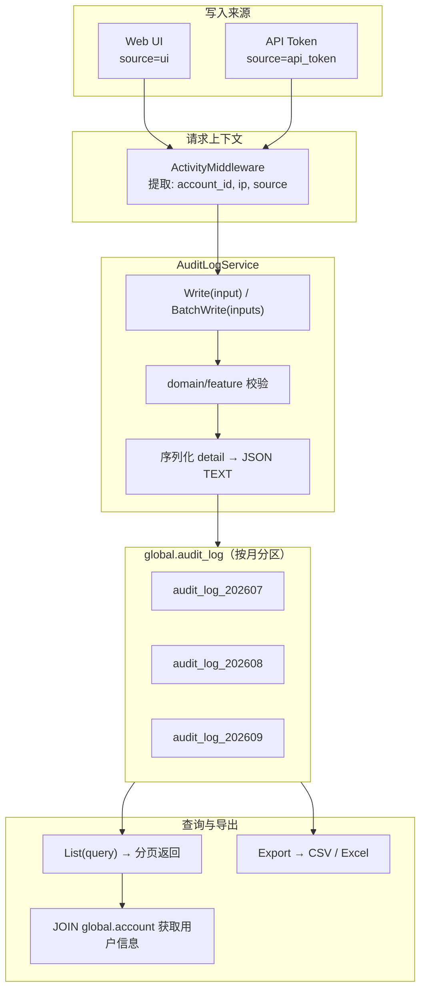

<!-- /autoplan restore point: /Users/wenshiqin/.gstack/projects/qinwenshiCH-workflow/main-autoplan-restore-20260702-151119.md -->
# 技术方案：Wave 审计日志

**对应规格**: [spec.md](./spec.md)
**参考**: [decisions.md](./decisions.md) | [posthog-to-wave-audit-mapping.md](./_research/posthog-to-wave-audit-mapping.md) | [posthog-research.md](./_research/posthog-research.md)

---

## 1. 架构总览



### 1.1 核心约束

| 约束 | 实现方式 |
|------|---------|
| **只记站外流量** | HTTP: Middleware 判断 source；MCP: handler 独立注入 `source=api_token`，internal/scheduler/backfill 不走写入路径 |
| **Append-only** | 只暴露 INSERT 接口，没有 UPDATE/DELETE |
| **不干涉业务内部** | 不替换 AB/Metric/MA 自身的记录表；两条路径并存 |
| **Blocking 写入** | 审计日志写入失败直接返回 error |

### 1.2 为什么没有异步解耦

审计日志定位为合规基础设施，写入失败意味着"客户的操作没有被审计到"，这在合规场景下是不可接受的。Blocking 写入确保：
- 调用方能感知失败并决定事务级回滚
- 不隐藏审计链的断点
- V1 不做异步，后续有性能瓶颈时可加 ActivityWriter 接口扩展（见旧方案 §2.4）

---

## 2. 数据模型

### 2.1 建表 DDL

```sql
CREATE TABLE global.audit_log (
    id              BIGSERIAL,
    org_id          INT,
    project_id      INT,
    account_id      INT NOT NULL,

    domain          VARCHAR(64) NOT NULL,
    feature         VARCHAR(64) NOT NULL,
    target_id       VARCHAR(72),
    action          VARCHAR(64) NOT NULL,
    source          VARCHAR(16) NOT NULL DEFAULT 'ui',  -- ui / api_token
    detail          TEXT,

    ip_address      VARCHAR(64) NOT NULL,
    created_at      TIMESTAMPTZ NOT NULL DEFAULT now(),
    PRIMARY KEY (id)
);
```

### 2.2 分区策略

V1 不分区。单表写入日均 200 万行，年 ~7.2 亿行。待数据规模达到需要分区时再引入，届时按 `created_at` RANGE 按月分区，`PRIMARY KEY` 调整为 `(id, created_at)`。

### 2.3 Detail 结构（JSON, TEXT 列）

统一格式，参考 PostHog change 模型：

```json
{
    "name": "new-dashboard",
    "changes": [
        {"field": "name", "action": "created", "after": "new-dashboard"},
        {"field": "description", "action": "created", "after": "销售数据看板"}
    ]
}
```

**Change 字段说明**：

| 字段 | 类型 | 说明 |
| ---- | ---- | ---- |
| `field` | string | 字段名（投影函数输出的 map key） |
| `action` | string | `created` / `changed` / `deleted` |
| `before` | any | 旧值（创建场景为 null；敏感字段为 "masked"） |
| `after` | any | 新值（删除场景为 null；敏感字段为 "masked"） |

**场景对照**：

| 场景 | changes 构造 |
| ---- | ------------ |
| create | 所有字段 `{action: "created", after: 初始值}` |
| update | 仅变更字段 `{action: "changed", before, after}` |
| delete | `{action: "deleted", before: 值}`，至少含 name 字段 |
| logged_in / logged_out | changes 为空数组 |

**敏感字段掩盖**：

在 changesBetween 计算之后、序列化之前，对匹配敏感字段名单的值替换为 `"masked"`。掩盖规则按 feature 配置：

```go
var maskFields = map[string][]string{
    "token": {"token", "token_hash"},
}
```

### 2.4 索引设计

```sql
-- 核心：按组织+领域+实体查询（组织管理员查所有项目下的资源历史）
CREATE INDEX idx_alog_org_domain_feature ON global.audit_log (org_id, domain, feature, target_id);

-- 核心：按项目+领域+实体查询（最常用模式：查某项目的某资源历史）
CREATE INDEX idx_alog_proj_domain_feature ON global.audit_log (project_id, domain, feature, target_id);

-- 时间排序（通用降序查询）
CREATE INDEX idx_alog_created_at ON global.audit_log (created_at DESC);

-- 按操作人查（用于"用户最近操作"场景）
CREATE INDEX idx_alog_account ON global.audit_log (account_id, created_at DESC);
```

**索引说明**：
- V1 先建这 4 个核心索引，覆盖最常用的查询模式
- 未来可参考 PostHog 加部分索引（WHERE 排除某些 action），等实际查询模式稳定后补充
- 分区表下索引是分区本地索引，每个分区独立

### 2.5 数据规模估算

| 维度 | 数值 |
| ---- | ---- |
| 组织数 | ~1000 |
| 日写入 / 组织 | ~2000 条 |
| 日总写入 | ~200 万行 |
| 月写入 | ~6000 万行 |
| 年写入 | ~7.2 亿行 |
| 单行大小 | ~500 bytes（含 detail） |
| 每月存储 | ~30 GB |
| 每年存储 | ~360 GB |

---

## 3. 写入路径

### 3.1 AuditLogService 接口

```go
package auditlog

type Service interface {
    // Write 写入一条审计日志（blocking，写入失败返回 error）
    Write(ctx context.Context, input *WriteInput) error

    // BatchWrite 批量写入，上限 500 行/批
    BatchWrite(ctx context.Context, inputs []*WriteInput) error

    // List 查询审计日志
    List(ctx context.Context, q *Query) (*ListResult, error)

    // Export 导出审计日志
    Export(ctx context.Context, q *Query, format ExportFormat) (io.Reader, error)
}

type WriteInput struct {
    OrgID     int64   // 可由 Middleware 从 ctx 自动填充
    ProjectID int64   // 可由 Middleware 从 ctx 自动填充
    AccountID int64   // 可由 Middleware 从 ctx 自动填充
    Action    string  // created / updated / deleted / logged_in / logged_out
    Domain    string  // account / organization / project / asset / metadata
    Feature   string  // auth / token / chart / experiment / ...
    TargetID  string  // 资源 ID（string 化）
    Source    string  // ui / api_token（Middleware 从 ctx 自动填充）
    IPAddress string  // 操作者 IP（Middleware 从 ctx 自动填充）
    Detail    *Detail // {Name, Changes}
}

type Detail struct {
    Name    string   `json:"name"`
    Changes []Change `json:"changes"`
}

type Change struct {
    Field  string `json:"field"`
    Action string `json:"action"` // created / changed / deleted
    Before any    `json:"before,omitempty"`
    After  any    `json:"after,omitempty"`
}

type Query struct {
    OrgID     int64
    ProjectID int64
    Domain    string
    Feature   string
    TargetID  string
    AccountID int64
    Action    string
    StartTime time.Time
    EndTime   time.Time
    Cursor    string     // last_seen created_at（ISO8601），首次查询传空
    PageSize  int        // 默认 500
}

type ListResult struct {
    Items    []*Record `json:"items"`
    Cursor   string    `json:"next_cursor"`  // 空 = 无更多
    HasMore  bool      `json:"has_more"`
}

// Record 是一条完整的审计日志记录（DB 行 + 查询时 JOIN 的账号信息）
type Record struct {
    ID           int64     `json:"id"`
    OrgID        *int64    `json:"org_id"`
    ProjectID    *int64    `json:"project_id"`
    AccountID    int64     `json:"account_id"`
    AccountName  string    `json:"account_name,omitempty"`   // JOIN global.account
    AccountEmail string    `json:"account_email,omitempty"`  // JOIN global.account
    Action       string    `json:"action"`
    Domain       string    `json:"domain"`
    Feature      string    `json:"feature"`
    TargetID     string    `json:"target_id,omitempty"`
    Source       string    `json:"source"`
    IPAddress    string    `json:"ip_address"`
    Detail       *Detail   `json:"detail,omitempty"`
    CreatedAt    time.Time `json:"created_at"`
}

// ── Detail 工厂方法（业务显式写入入口）──

// NewUpdateDetail 对 old/new 做投影 → diff → 脱敏，返回 Update 场景的 Detail。
// cfg 用于 Expand 投影，maskList 用于脱敏（nil = 不脱敏）。
// oldRow/newRow 的 key 为 DB 列名，Expand 声明的 JSON 列会被自动展开。
func NewUpdateDetail(name string, oldRow, newRow map[string]any, cfg *TableConfig, maskList []string) *Detail {
    old := expandRow(oldRow, cfg)
    new := expandRow(newRow, cfg)
    changes := changesBetween(old, new)
    changes = applyMaskRules(changes, maskList)
    return &Detail{Name: name, Changes: changes}
}

// NewDeleteDetail 返回 Delete 场景的 Detail。
func NewDeleteDetail(name string) *Detail {
    return &Detail{Name: name, Changes: []Change{
        {Field: "name", Action: "deleted", Before: name},
    }}
}

// GetTableConfig 根据表名查找注册的 TableConfig。
func GetTableConfig(tableName string) *TableConfig {
    return auditTables[tableName]
}

// MaskFields 根据 feature 名返回需脱敏的字段列表。
func MaskFields(feature string) []string {
    return maskFields[feature]
}
```

### 3.2 Middleware 提取上下文

```go
// ActivityMiddleware 从请求中提取审计上下文
func ActivityMiddleware() gin.HandlerFunc {
    return func(c *gin.Context) {
        // 从认证信息中提取 account_id
        accountID := pvctx.RequiredAid(c)

        // 从请求中提取 IP
        ip := c.ClientIP()

        // 判断 source
        source := resolveSource(c) // ui 或 api_token

        // 只对站外流量注入审计上下文
        if source == "internal" || source == "scheduler" {
            c.Next()
            return
        }

        // 注入到 context
        ctx := WithAuditContext(c.Request.Context(), &AuditContext{
            AccountID: accountID,
            IPAddress: ip,
            Source:    source,
        })
        c.Request = c.Request.WithContext(ctx)
        c.Next()
    }
}
```

> **MCP 入口**：MCP 协议不走标准 HTTP middleware，在 MCP handler 中独立完成 source 注入（认证后手动将 `source = api_token` 写入 context），下游逻辑统一处理。
>
> **上下文传播要求**：GORM 审计插件（§3.3）依赖 `tx.Statement.Context` 获取审计上下文。业务 service 在调用 GORM 时必须使用 `db.WithContext(ctx)` 传播上下文——这是 Go 项目中 context 传递的标准实践，通常已有 trace/logging 需求保障。

### 3.3 GORM 审计插件：自动捕获 CRUD

通过 GORM 全局 callback 机制，自动拦截所有经 GORM 的 **CREATE / UPDATE / DELETE** 操作。**业务 service 和 handler 零修改。**

#### 设计原理

GORM 为每个 CRUD 操作提供了标准 callback 链，插件在关键节点注入审计逻辑：

```
CREATE:  gorm:create → gorm:after_create → [插件提取模型字段，写 audit_log]
UPDATE:  gorm:before_update → [插件读取并暂存旧值] → gorm:update → gorm:after_update → [插件读取新值，diff，写 audit_log]
DELETE:  gorm:delete → gorm:after_delete → [插件从内存模型读取 name，写 audit_log]
```

所有回调与业务操作在同一事务中——审计写入与业务操作**原子提交或回滚**，天然满足 blocking 要求。

#### 注册表：表名 → domain/feature 映射

```go
type TableConfig struct {
    Domain      string                    // account / organization / project / asset / metadata
    Feature     string                    // chart / experiment / metric / ...（FeatureFunc 非空时忽略）
    FeatureFunc func(tx *gorm.DB) string  // 动态检测 feature（用于同一表多 feature 场景）
    OrgField    string                    // 模型上 org_id 的 Go 字段名（空=从 context 回退）
    ProjField   string                    // 模型上 project_id 的 Go 字段名（空=从 context 回退）
    IDField     string                    // 主键字段名，默认 "ID"
    NameField   string                    // 展示名字段名，默认 "Name"
    Expand      map[string][]string       // JSON 列 → 应作为独立 change 单元的子键名（nil=不展开，整列 opaque diff）
}

var auditTables = map[string]TableConfig{
    // ── account（仅 token，auth 走认证层）──
    // account_api_token 无 OrgId/ProjId，account_id 来自 AccountID 字段，用 Label 作展示名
    "account_api_token": {Domain: "account", Feature: "token", NameField: "Label"},
    // ── organization ──
    // Organization.ID 即 org_id；OrganizationMember.OrgId / MemberInvite.OrgId 引用 org
    "organization":        {Domain: "organization", Feature: "org",    OrgField: "ID"},
    "organization_member": {Domain: "organization", Feature: "member", OrgField: "OrgId"},
    "member_invite":       {Domain: "organization", Feature: "invite", OrgField: "OrgId"},
    // ── project ──
    // Project.OrgId 引用 org，Project.ID 即 project_id；ProjectMember 无 OrgId（从 context 回退）
    "project":        {Domain: "project", Feature: "project", OrgField: "OrgId", ProjField: "ID"},
    "project_member": {Domain: "project", Feature: "member",  ProjField: "ProjectId"},
    // ── asset（metadb 实体，无 OrgId/ProjId 字段，从 context 回退）──
    "chart": {
        Domain: "asset", Feature: "chart",
        Expand: map[string][]string{"config": {"measures", "dimensions", "filters"}},
    },
    "dashboard":     {Domain: "asset", Feature: "dashboard"},
    "cohort_define": {Domain: "asset", Feature: "cohort"},
    "pipeline":      {Domain: "asset", Feature: "pipeline"},
    "ma_campaign":   {Domain: "asset", Feature: "campaign"},
    // ab_feature_flag 一张表承载 5 种类型（1=gate, 2=config, 3=experiment, 4=layer, 5=holdout），
    // 仅 1/2/3 在审计范围。FeatureFunc 动态区分。
    // details 列存 JSON，Expand 声明应作为独立 change 单元的子键——业务控制投影粒度。
    "ab_feature_flag": {
        Domain: "asset",
        FeatureFunc: func(tx *gorm.DB) string {
            v := abFeatureFlagType(tx)
            if v == "" { return "experiment" }
            return v
        },
        Expand: map[string][]string{
            "details": {
                "exp_setting", "gate_setting", "config_setting", // 通用配置（按 Typ 互斥出现）
                "variants", "metrics",
                "release_plan", "override", "gates", "params",
            },
        },
    },
    // ── metadata（metadb 实体，无 OrgId/ProjId 字段）──
    "metric_define":           {Domain: "metadata", Feature: "metric"},
    "event_define":            {Domain: "metadata", Feature: "tracked_event"},
    "virtual_event_define":    {Domain: "metadata", Feature: "virtual_event"},
    "event_property_define":   {Domain: "metadata", Feature: "event_property"},
    "user_property_define":    {Domain: "metadata", Feature: "user_property"},
    "virtual_property_define": {Domain: "metadata", Feature: "virtual_property"},
}

// abFeatureFlagType 根据 AbFeatureFlag.Typ 字段返回 feature 名。
// 1=feature_gate, 2=feature_config, 3=experiment, 4/5/其他 不在审计范围（返回空跳过）。
func abFeatureFlagType(tx *gorm.DB) string {
    if tx.Statement.Schema == nil { return "" }
    f := tx.Statement.Schema.LookUpField("Typ")
    if f == nil { return "" }
    v, _ := f.ValueOf(tx.Statement.ReflectValue())
    typ, ok := v.(int)
    if !ok { return "" }
    switch typ {
    case 1: return "feature_gate"
    case 2: return "feature_config"
    case 3: return "experiment"
    default: return "" // layer(4)/holdout(5) 不列入审计
    }
}
```

> 表名已对照 Wave 实际 DAO 注册名（`NewTableDao(...)`），均为单数。metadb 实体无 OrgId/ProjId 字段，org_id/project_id 由 resolveOrgID/resolveProjectID 从 context 回退。

#### Plugin 核心实现

```go
type AuditPlugin struct{ tables map[string]TableConfig }

func (p *AuditPlugin) Name() string { return "audit:plugin" }

func (p *AuditPlugin) Initialize(db *gorm.DB) error {
    db.Callback().Create().After("gorm:after_create").
        Register("audit:create", p.afterCreate)
    db.Callback().Update().Before("gorm:before_update").
        Register("audit:before_update", p.beforeUpdate)
    db.Callback().Update().After("gorm:after_update").
        Register("audit:after_update", p.afterUpdate)
    db.Callback().Delete().After("gorm:after_delete").
        Register("audit:delete", p.afterDelete)
    return nil
}

// configFor 提取表配置 + 审计上下文。
// 自动处理 schema 前缀表名（如 "meta_1".chart、global.chart → 匹配 chart）。
func (p *AuditPlugin) configFor(tx *gorm.DB) (*TableConfig, *AuditContext) {
    table := p.tableName(tx)
    cfg, ok := p.tables[table]
    if !ok { return nil, nil }

    // FeatureFunc 动态区分：返回空表示不在审计范围（如 ab_feature_flag 的 layer/holdout）
    if cfg.resolveFeature(tx) == "" { return nil, nil }

    ctx := auditlog.FromAuditContext(tx.Statement.Context)
    if ctx == nil || !ctx.IsExternal() { return nil, nil }
    return &cfg, ctx
}

// resolveFeature 返回最终 feature 名。FeatureFunc 非空时用它，否则取静态 Feature。
func (c *TableConfig) resolveFeature(tx *gorm.DB) string {
    if c.FeatureFunc != nil {
        return c.FeatureFunc(tx)
    }
    return c.Feature
}

// tableName 从 GORM 回调中提取纯表名（去掉 schema 前缀和引号）。
func (p *AuditPlugin) tableName(tx *gorm.DB) string {
    if tx.Statement.Schema != nil {
        return tx.Statement.Schema.Table
    }
    table := tx.Statement.Table
    if idx := strings.LastIndex(table, "."); idx != -1 {
        return strings.Trim(table[idx+1:], `"`)
    }
    return strings.Trim(table, `"`)
}
```

**afterCreate** — 模型已写入 DB，自动回填了 ID 和 CreatedAt 等字段：

```go
func (p *AuditPlugin) afterCreate(tx *gorm.DB) {
    cfg, actx := p.configFor(tx)
    if actx == nil { return }

    name   := fieldString(tx, cfg.NameField)
    target := fmt.Sprint(fieldValue(tx, cfg.IDField))
    changes := p.buildCreateChanges(tx, cfg)

    writeAudit(tx, &WriteInput{
        OrgID: p.resolveOrgID(tx, cfg),
        ProjectID: p.resolveProjectID(tx, cfg),
        AccountID: actx.AccountID,
        IPAddress: actx.IPAddress,
        Domain: cfg.Domain, Feature: cfg.resolveFeature(tx),
        TargetID: target, Action: "created",
        Detail: &Detail{Name: name, Changes: changes},
    })
}
```

**beforeUpdate + afterUpdate** — 两个函数协作。`beforeUpdate` 先判断操作类型：**软删除**还是**普通更新**。`afterUpdate` 按类型分别处理。

> **关键设计决策**：beforeUpdate 中旧值**必须从 DB 读取**（clone session SELECT），不能从 `ReflectValue` 读取。因为业务层在调用 `Updates(chart)` 前已将 `chart` 结构体修改为新值，ReflectValue 此时已反映新状态而非旧状态。afterUpdate 中新值同理从 DB 读取（UPDATE 已执行，DB 是新状态）。

```go
// beforeUpdate 在 UPDATE 执行前触发。Wave 管理实体绝大多数使用 is_deleted 软删除而非硬 Delete。
func (p *AuditPlugin) beforeUpdate(tx *gorm.DB) {
    cfg, actx := p.configFor(tx)
    if actx == nil { return }

    id := p.extractID(tx)
    if id == 0 { return }

    // ── 场景 1：软删除（is_deleted = true） ──
    if p.isSoftDelete(tx) {
        // UPDATE 执行前，clone 会话读取当前记录的 name
        n := p.readNameFromDB(tx, id)
        tx.Statement.Set("audit:delete", &audit.DeleteInfo{
            Name:     n,
            TargetID: fmt.Sprint(id),
        })
        return
    }

    // ── 场景 2：普通更新，从 DB 读旧值用于 diff ──
    old := p.readFieldsFromDB(tx, cfg)
    tx.Statement.Set("audit:old", old)
}

// afterUpdate 在 UPDATE 已执行后触发。根据 beforeUpdate 中的判断分叉处理。
func (p *AuditPlugin) afterUpdate(tx *gorm.DB) {
    cfg, actx := p.configFor(tx)
    if actx == nil { return }

    // ── 场景 1：软删除审计 ──
    if di, ok := tx.Statement.Get("audit:delete"); ok {
        info := di.(*audit.DeleteInfo)
        writeAudit(tx, &WriteInput{
            OrgID: p.resolveOrgID(tx, cfg),
            ProjectID: p.resolveProjectID(tx, cfg),
            AccountID: actx.AccountID, IPAddress: actx.IPAddress,
            Domain: cfg.Domain, Feature: cfg.resolveFeature(tx),
            TargetID: info.TargetID, Action: "deleted",
            Detail: &Detail{Name: info.Name, Changes: []Change{
                {Field: "name", Action: "deleted", Before: info.Name},
            }},
        })
        return
    }

    // ── 场景 2：普通更新，从 DB 读新值后 diff ──
    raw, _ := tx.Statement.Get("audit:old")
    if raw == nil { return }  // 无旧值（批量更新/Schema=nil 场景），跳过
    old := raw.(map[string]any)

    id := p.extractID(tx)
    if id == 0 { return }
    cur := p.readFieldsFromDB(tx, cfg)       // UPDATE 已执行，DB 中是新值
    changes := changesBetween(old, cur)
    changes = applyMaskRules(changes, maskFields[cfg.resolveFeature(tx)])
    if len(changes) == 0 { return }

    name := cur["name"]   // 从 DB 读取的新值中取 name
    if s, ok := name.(string); ok {
        writeAudit(tx, &WriteInput{
            OrgID: p.resolveOrgID(tx, cfg),
            ProjectID: p.resolveProjectID(tx, cfg),
            AccountID: actx.AccountID, IPAddress: actx.IPAddress,
            Domain: cfg.Domain, Feature: cfg.resolveFeature(tx),
            TargetID: fmt.Sprint(id), Action: "updated",
            Detail: &Detail{Name: s, Changes: changes},
        })
    }
}
```

**afterDelete** — Wave 管理实体通常使用 is_deleted 软删除（走 AfterUpdate），此处仅覆盖硬删除场景（如 ProjectDao.DeleteRecord 等极少数调用）：

```go
func (p *AuditPlugin) afterDelete(tx *gorm.DB) {
    cfg, actx := p.configFor(tx)
    if actx == nil { return }

    name   := fieldString(tx, cfg.NameField)
    target := fmt.Sprint(fieldValue(tx, cfg.IDField))

    writeAudit(tx, &WriteInput{
        OrgID: p.resolveOrgID(tx, cfg),
        ProjectID: p.resolveProjectID(tx, cfg),
        AccountID: actx.AccountID,
        IPAddress: actx.IPAddress,
        Domain: cfg.Domain, Feature: cfg.resolveFeature(tx),
        TargetID: target, Action: "deleted",
        Detail: &Detail{Name: name, Changes: []Change{
            {Field: "name", Action: "deleted", Before: name},
        }},
    })
}
```

**辅助函数**：

```go
// DeleteInfo 暂存软删除时的记录信息（BeforeUpdate 保存，AfterUpdate 取出）
type DeleteInfo struct {
    Name     string
    TargetID string
}

// isSoftDelete 检查当前 UPDATE 是否为软删除（is_deleted = true）
func (p *AuditPlugin) isSoftDelete(tx *gorm.DB) bool {
    d, ok := tx.Statement.Dest.(map[string]interface{})
    if !ok { return false }
    v, ok := d["is_deleted"]
    return ok && v == true
}

// extractID 从 GORM 回调中提取主键 ID。
// 优先从 Schema.ReflectValue 读取；无 Schema 时从 WHERE 子句的 clause.Expr 解析。
//
// 注意：GORM 的 BuildCondition 对 "id = ?" 产生 clause.Expr，而非 clause.Eq。
// 因为含 "?" 的字符串被判定为 raw where condition，不经结构化解析。
func (p *AuditPlugin) extractID(tx *gorm.DB) int64 {
    if tx.Statement.Schema != nil {
        if v := fieldValue(tx, "ID"); v != nil {
            if id, ok := v.(int64); ok { return id }
            if id, ok := v.(int); ok { return int64(id) }
        }
    }
    // 回退：从 WHERE clause.Expr 的 SQL 中解析 "id = ?" 或 "id IN ?"
    return extractIDFromWhere(tx)
}

// idVarRegex 匹配 WHERE SQL 中 "id = ?" 或 "id IN ?" 模式，提取列名位置。
var idVarRegex = regexp.MustCompile(`\b(id)\s*(=|IN)\s*\?`)

func extractIDFromWhere(tx *gorm.DB) int64 {
    c, ok := tx.Statement.Clauses["WHERE"]
    if !ok { return 0 }
    w, ok := c.Expression.(clause.Where)
    if !ok { return 0 }

    for _, expr := range w.Exprs {
        raw, ok := expr.(clause.Expr)
        if !ok { continue }
        m := idVarRegex.FindStringSubmatchIndex(raw.SQL)
        if m == nil { continue }
        // 统计 "id = ?" 之前已出现的 "?" 数量 → 参数在 Vars 中的下标
        qIdx := strings.Count(raw.SQL[:m[0]], "?")
        if qIdx >= len(raw.Vars) { return 0 }
        // IN 子句的 Var 是切片，取第一个元素
        if v, ok := raw.Vars[qIdx].([]int); ok && len(v) > 0 {
            return int64(v[0])
        }
        return toInt64(raw.Vars[qIdx])
    }
    return 0
}

// ── DB 读取函数 ──

// readNameFromDB clone 当前事务会话，从 DB 读取记录的 name 字段。
// 用于软删除前的名称快照；此时 UPDATE 尚未执行，读到的是旧值。
func (p *AuditPlugin) readNameFromDB(tx *gorm.DB, id int64) string {
    var name string
    clone := tx.Session(&gorm.Session{})
    clone.Table(tx.Statement.Table).Select("name").Where("id = ?", id).Scan(&name)
    return name
}

// readFieldsFromDB clone 当前事务会话，从 DB 读取整行记录到 map[string]any。
// 读取后先排除字段，再投影 Expand JSON 列。beforeUpdate 中 DB 为旧值，afterUpdate 中为新值。
func (p *AuditPlugin) readFieldsFromDB(tx *gorm.DB, cfg *TableConfig) map[string]any {
    row := make(map[string]any)
    clone := tx.Session(&gorm.Session{})
    clone.Table(tx.Statement.Table).Where("id = ?", p.extractID(tx)).Take(&row)
    // 排除全局排除字段（Expand 未声明的 JSON 子键在 expandRow 阶段自动丢弃）
    for k := range row {
        if globalExcludedFields[k] {
            delete(row, k)
        }
    }
    // JSON 列展开投影：details → rules, variants, ...
    return expandRow(row, cfg)
}

// expandRow 应用 TableConfig.Expand 投影规则（公开函数，插件和业务共用）。
// 对 Expand 中声明的列名，解析 JSON 字符串，提取声明的子键，删除原列名。
// 未声明的列原样保留。nil Expand 不做任何转换。
func expandRow(row map[string]any, cfg *TableConfig) map[string]any {
    if cfg.Expand == nil {
        return row
    }
    for colName, subKeys := range cfg.Expand {
        raw, ok := row[colName]
        if !ok { continue }
        s, ok := raw.(string)
        if !ok { continue }
        parsed := parseJSON(s)
        if parsed == nil { continue }
        for _, sk := range subKeys {
            if v, ok := parsed[sk]; ok {
                row[sk] = v // "rules" → [...], "variants" → [...]
            }
        }
        delete(row, colName) // 去掉 "details" 原 key
    }
    return row
}

// parseJSON 安全解析 JSON 字符串到 map[string]any。
func parseJSON(s string) map[string]any {
    var m map[string]any
    if err := json.Unmarshal([]byte(s), &m); err != nil {
        return nil
    }
    return m
}

// ── Org/Project 解析 ──

// resolveOrgID 获取 org_id。优先从模型字段读取，其次从 context（pvctx.OrgID）回退。
func (p *AuditPlugin) resolveOrgID(tx *gorm.DB, cfg *TableConfig) *int64 {
    if cfg.OrgField != "" {
        if v := fieldInt64(tx, cfg.OrgField); v != 0 {
            return &v
        }
    }
    if orgID := pvctx.OrgID(tx.Statement.Context); orgID != 0 {
        return &orgID
    }
    return nil
}

// resolveProjectID 获取 project_id。优先从模型字段读取，其次从 context（pvctx.Pid）回退。
func (p *AuditPlugin) resolveProjectID(tx *gorm.DB, cfg *TableConfig) *int64 {
    if cfg.ProjField != "" {
        if v := fieldInt64(tx, cfg.ProjField); v != 0 {
            return &v
        }
    }
    if pid := pvctx.Pid(tx.Statement.Context); pid != 0 {
        return &pid
    }
    return nil
}

// ── 字段读取 ──

func fieldValue(tx *gorm.DB, name string) any {
    if name == "" || tx.Statement.Schema == nil { return nil }
    f := tx.Statement.Schema.LookUpField(name)
    if f == nil { return nil }
    v, _ := f.ValueOf(tx.Statement.ReflectValue())
    return v
}

func fieldString(tx *gorm.DB, name string) string {
    v := fieldValue(tx, name)
    if s, ok := v.(string); ok { return s }
    return ""
}

func fieldInt64(tx *gorm.DB, name string) int64 {
    v := fieldValue(tx, name)
    if v == nil { return 0 }
    switch n := v.(type) {
    case int64:  return n
    case int:    return int64(n)
    case uint:   return int64(n)
    default:     return 0
    }
}
```

#### 安全性保证

| 风险 | 应对 |
|------|------|
| **递归回调**（写 audit_log 又触发 audit） | 使用 `tx.Exec()` 写入 audit_log，不经过 GORM Create 回调链，无递归 |
| **批量 Updatspecs/20260626-Wave-Feat-AddAuditLog/plan-audit-log.md#L706e**（`Where(...).Update(...)` 不逐行回调） | 无 Schema/ReflectValue 时跳过；管理面操作为单对象，批量操作为内部流量，不影响审计覆盖 |
| **关联操作**（`Association("X").Append()`） | `Statement.Schema` 在关联操作中可能为 nil，检测到直接跳过 |
| **内部流量误入** | `configFor()` 中 `IsExternal()` 自动过滤 internal/scheduler/backfill |
| **连接池回收** | 回调在事务中执行，连接不会在回调中途被回收 |

#### 接入

Wave 有两个 schema 层级，对应三个 GORM 实例：

| 实例 | Schema | 涵盖实体 |
|------|--------|----------|
| `globaldb` | `global` | Organization、Project、Account、AccountAPIToken |
| `metadb` | 每项目独立 schema（`"meta_<project_id>"`） | Chart、Dashboard、CohortDefine、Pipeline、ma_campaign、MetricDefine 等 |
| `pgdata` | 每项目独立 schema | ab_feature_flag、ab_feature_flag_target 等 |

插件启动时分别注册到三个实例：

```go
plugin := &AuditPlugin{tables: auditTables}
globaldb.GetClient().DB().Use(plugin)
metadb.GetClient().DB().Use(plugin)
pgdata.GetClient().DB().Use(plugin)
```

业务无感知。插件通过 `TableCtx()` → `DBCtx(ctx)` → `db.WithContext(ctx)` 链路自动获取 `pvctx` 中的 `project_id`，处理 schema 前缀表名（`global.chart` / `"meta_1"."chart"`）。

#### 3.3.1 写入路径边界：插件 vs 业务显式

插件自动捕获单对象 CRUD，但不覆盖所有场景。`AuditLogService.Write` / `BatchWrite` 本就是公开接口，以下场景由业务侧显式调用：

```
插件自动捕获                    业务显式写入
─────────────                  ─────────────
Create(&entity)                BatchDelete(ids)     → BatchWrite()
Save(&entity)                  BatchUpdateLevel()   → BatchWrite()
Where("id=?", id).Updates()    登录 / 登出           → Write()
Delete(&entity) (硬删除)
```

| 场景 | 写入方式 | 为什么插件不行 |
|------|----------|----------------|
| 单对象 Create / Update / Delete | GORM 插件自动 | 有 Model/Schema，ID 可定位 |
| 批量删除（Chart.BatchDelete）| 业务调 `BatchWrite` | 无 Model，`id IN ?` 多行 |
| 批量修改（批量改 member level）| 业务调 `BatchWrite` | 无 Model，需每行新旧值 diff |
| 登录 / 登出 | 认证 filter 调 `Write` | 非 DB 操作，无 GORM 回调 |
| 批量硬删除（DashboardChart）| 业务调 `BatchWrite` | 无 Model，关联表独立审计 |

**业务侧显式写入示例：**

业务只需提供 old/new 原始数据，投影 → diff → 脱敏由 `auditlog.NewUpdateDetail` / `NewDeleteDetail` 工厂方法内部完成：

```go
// ── 批量删除 ──
inputs := make([]*auditlog.WriteInput, len(charts))
for i, c := range charts {
    inputs[i] = &auditlog.WriteInput{
        Domain: "asset", Feature: "chart", Action: "deleted",
        TargetID: fmt.Sprint(c.ID),
        Detail:   auditlog.NewDeleteDetail(c.Name),
    }
}

// ── 批量修改 level（无 JSON 列，cfg 传 nil）──
inputs := make([]*auditlog.WriteInput, len(members))
for i, m := range members {
    inputs[i] = &auditlog.WriteInput{
        Domain: "organization", Feature: "member", Action: "updated",
        TargetID: fmt.Sprint(m.ID),
        Detail: auditlog.NewUpdateDetail(m.AccountName,
            map[string]any{"level": m.OldLevel},
            map[string]any{"level": newLevel},
            nil, nil, // member 无 JSON 列，无敏感字段
        ),
    }
}

// ── 批量修改 AB Experiment（有 JSON 列，通过 GetTableConfig 获取 Expand 规则）──
cfg := auditlog.GetTableConfig("ab_feature_flag")
inputs := make([]*auditlog.WriteInput, len(exps))
for i, e := range exps {
    inputs[i] = &auditlog.WriteInput{
        Domain: "asset", Feature: "experiment", Action: "updated",
        TargetID: fmt.Sprint(e.ID),
        Detail: auditlog.NewUpdateDetail(e.Name,
            map[string]any{"details": e.OldDetails},  // oldRow
            map[string]any{"details": e.NewDetails},   // newRow
            cfg, auditlog.MaskFields("experiment"),     // cfg.Expand 投影 details → rules/variants/...
        ),
    }
}
auditlogService.BatchWrite(ctx, inputs)
```

> 业务只调用 `NewUpdateDetail` / `NewDeleteDetail`。`expandRow` / `changesBetween` / `applyMaskRules` 是 `auditlog` 包内部函数，插件和工厂方法共用，不直接暴露给业务。

**原则：插件解决 90% 高频场景（单对象 CRUD），不掉入 SQL 解析器的陷阱。剩余 10% 业务自己写，代码量可控（每个场景 ~10 行），不破坏插件统一性。**

### 3.4 认证层：登录/登出

登录/登出不涉及 DB 操作，GORM 插件无法捕获。在**认证 filter**（OAuth callback / password auth / session 创建销毁处）中显式写入，AuthService 本身不感知审计日志：

```go
func (f *AuthFilter) onLogin(account *Account, ctx context.Context) {
    actx := auditlog.FromAuditContext(ctx)
    if actx == nil || !actx.IsExternal() {
        return
    }
    auditlogService.Write(ctx, &WriteInput{
        AccountID: account.ID,
        Source:    actx.Source,
        IPAddress: actx.IPAddress,
        Domain:    "account",
        Feature:   "auth",
        TargetID:  strconv.FormatInt(account.ID, 10),
        Action:    "logged_in",
        Detail:    &Detail{Name: account.Name},
    })
}

func (f *AuthFilter) onLogout(account *Account, ctx context.Context) {
    // 同上，action = "logged_out"
    // 登出时可从 ctx 获取 account_id（从 session token 解析）
}
```

登录/登出的 changes 为空——审计关心的只是"谁在何时登录/登出"。

### 3.5 Domain/Feature 注册与校验

```go
// 启动时注册所有合法的 domain + feature 组合
type FeatureKey struct {
    Domain  string
    Feature string
}

var registeredFeatures = map[FeatureKey]bool{}

func init() {
    features := []FeatureKey{
        {Domain: "account", Feature: "auth"},
        {Domain: "account", Feature: "token"},
        {Domain: "organization", Feature: "org"},
        {Domain: "organization", Feature: "member"},
        {Domain: "organization", Feature: "invite"},
        {Domain: "project", Feature: "project"},
        {Domain: "project", Feature: "member"},
        {Domain: "asset", Feature: "chart"},
        {Domain: "asset", Feature: "dashboard"},
        {Domain: "asset", Feature: "cohort"},
        {Domain: "asset", Feature: "pipeline"},
        {Domain: "asset", Feature: "campaign"},
        {Domain: "asset", Feature: "experiment"},
        {Domain: "asset", Feature: "feature_gate"},
        {Domain: "asset", Feature: "feature_config"},
        {Domain: "metadata", Feature: "metric"},
        {Domain: "metadata", Feature: "tracked_event"},
        {Domain: "metadata", Feature: "virtual_event"},
        {Domain: "metadata", Feature: "event_property"},
        {Domain: "metadata", Feature: "user_property"},
        {Domain: "metadata", Feature: "virtual_property"},
    }
    for _, f := range features {
        registeredFeatures[f] = true
    }
}

func validateFeature(domain, feature string) error {
    if !registeredFeatures[FeatureKey{Domain: domain, Feature: feature}] {
        return fmt.Errorf("auditlog: unregistered domain/feature combination %q/%q", domain, feature)
    }
    return nil
}
```

### 3.6 changesBetween 算法

参考 PostHog `changes_between()`，对两个投影 map 做逐字段 diff：

```go
func changesBetween(old, new map[string]any) []Change {
    var changes []Change
    allFields := unionKeys(old, new)

    for _, field := range allFields {
        oldVal, oldExists := old[field]
        newVal, newExists := new[field]

        switch {
        case !oldExists && newExists:
            changes = append(changes, Change{Field: field, Action: "created", After: newVal})
        case oldExists && !newExists:
            changes = append(changes, Change{Field: field, Action: "deleted", Before: oldVal})
        case oldExists && newExists && !reflect.DeepEqual(oldVal, newVal):
            changes = append(changes, Change{Field: field, Action: "changed", Before: oldVal, After: newVal})
        }
    }
    return changes
}
```

**排除字段**（不参与 diff，不记录）：

```go
var globalExcludedFields = map[string]bool{
    "id": true, "created_at": true, "updated_at": true,
    "version": true, "deleted_at": true, "is_deleted": true,
    "created_by": true, "updated_by": true,
}

// ── 写入与构建 ──

// writeAudit 使用 tx.Exec() 直接执行 INSERT，绕过 GORM callback 链，避免递归审计。
func writeAudit(tx *gorm.DB, input *WriteInput) {
    detailJSON, _ := json.Marshal(input.Detail)
    tx.Exec(`
        INSERT INTO global.audit_log
            (org_id, project_id, account_id, action, domain, feature, target_id, source, ip_address, detail, created_at)
        VALUES (?, ?, ?, ?, ?, ?, ?, ?, ?, ?, NOW())
    `, input.OrgID, input.ProjectID, input.AccountID, input.Action,
       input.Domain, input.Feature, input.TargetID, input.Source, input.IPAddress, string(detailJSON))
}

// buildCreateChanges 为 Create 场景构造初始变更列表。
// 遍历 Model 的 Schema 字段，跳过 globalExcludedFields 系统列，JSON 列按 Expand 拆子键。
func (p *AuditPlugin) buildCreateChanges(tx *gorm.DB, cfg *TableConfig) []Change {
    // 实现：for each Schema.Field → skip if globalExcludedFields[name]
    //       → if cfg.Expand[name] then parseJSON + emit sub-keys
    //       → else emit {Field: name, Action: "created", After: value}
}

// ── 工具函数 ──

func unionKeys(a, b map[string]any) []string {
    seen := make(map[string]bool)
    var keys []string
    for k := range a { seen[k] = true; keys = append(keys, k) }
    for k := range b { if !seen[k] { keys = append(keys, k) } }
    return keys
}

func contains(slice []string, s string) bool {
    for _, v := range slice { if v == s { return true } }
    return false
}

func makeSet(slice []string) map[string]bool {
    m := make(map[string]bool, len(slice))
    for _, v := range slice { m[v] = true }
    return m
}

func toInt64(v interface{}) int64 {
    switch n := v.(type) {
    case int64:  return n
    case int:    return int64(n)
    case int32:  return int64(n)
    case uint:   return int64(n)
    default:     return 0
    }
}
```

### 3.7 端到端走查：Chart CRUD（零业务代码变更）

以 Chart 为例，完整追踪一次 HTTP API 请求中审计日志如何自动产生。**业务层不改一行代码。**

#### 3.7.0 前提：一次性的框架接入（Phase 0 完成）

在实现 Phase 0 时，以下 3 项是一次性的框架级配置，不针对任何具体业务：

**a) 注册 GORM 插件到 3 个 DB 实例：**

```go
// main.go 或 init()
plugin := auditlog.NewPlugin(auditTables)
globaldb.GetClient().DB().Use(plugin)
metadb.GetClient().DB().Use(plugin)
pgdata.GetClient().DB().Use(plugin)
```

**b) 注册 ActivityMiddleware 到 Gin middleware chain：**

```go
// router setup（在 auth middleware 之后）
router.Use(ActivityMiddleware())
```

**c) auth filter 接入登录/登出：**

在 `onLogin` / `onLogout` 中显式调用 `auditlogService.Write(...)`（登录不涉及 GORM CRUD）。

之后 Phase 1-3 每接入一个 entity，**仅在插件注册表中加一行 config 即可**，无任何其他代码变更。

#### 3.7.1 Chart Create 全链路

```
HTTP POST /api/projects/123/charts  { "name": "my-chart", ... }
│
├─ 1. auth middleware        → ctx 中注入 Aid=42, Aname="张三", OrgID=5
├─ 2. project middleware     → ctx 中注入 Pid=123
├─ 3. ActivityMiddleware     → 提取 IP=1.2.3.4, source=ui → 注入 AuditContext
│                                (internal/scheduler/backfill 请求在第 2 步直接跳过)
├─ 4. ChartController        → 调用 chartService.CreateChartWithDashboards(ctx, req)
├─ 5. ChartService           → 调用 s.chartDao.Create(ctx, &chart)
│                                chart = {Name: "my-chart", QueryType: "sql", ...}
├─ 6. ChartDao.Create        → dao.TableCtx(ctx).Create(&chart)
│                                TableCtx → DBCtx(ctx) → DB.WithContext(ctx)
│                                ctx 中已有 AuditContext + pvctx 值
└─ 7. GORM AfterCreate 回调
    │
    ├─ configFor(tx):
    │   tableName = "chart" (从 Schema.Table)
    │   → auditTables["chart"] = {Domain: "asset", Feature: "chart", OrgField: "", ProjField: ""}
    │   → cfg.resolveFeature(tx) = "chart" ✓
    │   → FromAuditContext(ctx) = {AccountID:42, IP:1.2.3.4} ✓
    │   → IsExternal() = true (source=ui) ✓
    │
    ├─ fieldString(tx, "Name")  = "my-chart"   ← 从 model struct 读取
    ├─ fieldValue(tx, "ID")     = 100           ← GORM 自动回填
    │
    ├─ buildCreateChanges(tx, cfg):
    │   遍历 Chart struct 所有字段，排除 {id, created_at, updated_at, version,
    │   is_deleted, created_by, updated_by}
    │   → [{field:"name", action:"created", after:"my-chart"},
    │       {field:"query_type", action:"created", after:"sql"},
    │       {field:"config", action:"created", after:"{...}"}, ...]
    │
    ├─ resolveOrgID:  OrgField="" → pvctx.OrgID(ctx)=5 → &5
    ├─ resolveProjectID: ProjField="" → pvctx.Pid(ctx)=123 → &123
    │
    └─ writeAudit(tx, ...):
        INSERT INTO global.audit_log (
          org_id=5, project_id=123, account_id=42,
          domain="asset", feature="chart", target_id="100",
          action="created", ip_address="1.2.3.4",
          detail='{"name":"my-chart","changes":[...]}'
        )
        -- 在同一事务中执行，业务提交则审计提交，业务回滚则审计回滚
```

#### 3.7.2 Chart Update 全链路

```
HTTP PUT /api/projects/123/charts  { "id": 100, "name": "new-name", ... }
│
├─ ... middleware chain（同 Create）
├─ ChartController → ChartService.UpdateChart(ctx, req)
│
├─ Service: db.First(&chart, 100)  → chart = {Name: "old-name", Version: 5, ...}
│            chart.Name = "new-name"     ← 内存中修改
│            chart.Version = 6           ← 乐观锁 +1
├─ ChartDao.Update:
│    dao.TableCtx(ctx).
│      Where("id = ? AND version = ?", 100, 5).
│      Updates(chart)                    ← chart 传进去时已是新值
│
├─ 8. GORM BeforeUpdate 回调
│   ├─ configFor(tx) → 匹配 chart config ✓
│   ├─ isSoftDelete(tx) → Dest 是 *Chart struct，不是 map → false
│   ├─ extractID(tx) → Schema 存在 → fieldValue("ID") → 100
│   ├─ readFieldsFromDB(tx, cfg):
│   │   clone session → SELECT * FROM "meta_123"."chart" WHERE id = 100
│   │   (UPDATE 尚未执行，DB 中仍是旧值)
│   │   → row = {"id":100, "name":"old-name", "version":5, "query_type":"sql", ...}
│   │   排除 {id,created_at,updated_at,version,is_deleted,created_by,updated_by}
│   │   → old = {"name":"old-name", "query_type":"sql", ...}
│   └─ tx.Statement.Set("audit:old", old)
│
├─ 9. GORM 执行 UPDATE "meta_123"."chart" SET ... WHERE id=100 AND version=5
│
├─ 10. GORM AfterUpdate 回调
│   ├─ tx.Statement.Get("audit:delete") = nil → 非软删除，走 diff 路径
│   ├─ tx.Statement.Get("audit:old") → old = {"name":"old-name", ...}
│   ├─ readFieldsFromDB(tx, cfg):
│   │   (UPDATE 已执行，DB 中是新值)
│   │   → cur = {"name":"new-name", "version":6, "query_type":"sql", ...}
│   ├─ changesBetween(old, cur):
│   │   name:    "old-name" → "new-name"  → {action:"changed", before:"old-name", after:"new-name"}
│   │   version: 5 → 6 → globalExcludedFields["version"] → 排除
│   │   query_type: "sql" → "sql" → 相同 → 跳过
│   │   → changes = [{field:"name", action:"changed", before:"old-name", after:"new-name"}]
│   ├─ applyMaskRules: maskFields["chart"] = nil → 无掩盖
│   └─ writeAudit(tx, ...):
│       INSERT ... action="updated", target_id="100",
│       detail='{"name":"new-name","changes":[{"field":"name","action":"changed","before":"old-name","after":"new-name"}]}'
│
│   ★ 乐观锁失败（version 不匹配）：UPDATE 影响 0 行，afterUpdate 仍触发，
│     但 readFieldsFromDB 读到的值与 old 相同 → changesBetween 无变更 → 不写审计 ✓
```

#### 3.7.3 Chart Delete（软删除）全链路

```
HTTP DELETE /api/projects/123/charts  { "id": 100 }
│
├─ ... middleware chain
├─ ChartController → ChartService.Delete(ctx, 100)
├─ ChartDao.Delete:
│    dao.TableCtx(ctx).Where("id = ?", 100).Update("is_deleted", true)
│    ★ 注意：无 Model() 调用，Statement.Schema = nil
│
├─ 11. GORM BeforeUpdate 回调
│   ├─ configFor(tx):
│   │   tableName(tx) → Schema=nil → 从 Statement.Table "meta_123"."chart" 解析
│   │   → "chart" → 匹配 config ✓
│   ├─ isSoftDelete(tx):
│   │   GORM 将 Update("is_deleted", true) 转为 Dest = map["is_deleted":true]
│   │   → 匹配 → true ✓
│   ├─ extractID(tx):
│   │   Schema=nil → 从 WHERE clause 解析
│   │   → clause.Expr{SQL:"id = ?", Vars:[100]} → regex 匹配 → Vars[0]=100 ✓
│   ├─ readNameFromDB(tx, 100):
│   │   clone session → SELECT name FROM "meta_123"."chart" WHERE id=100
│   │   (UPDATE 尚未执行，DB 中仍是旧值)
│   │   → "my-chart"
│   └─ tx.Statement.Set("audit:delete", &DeleteInfo{Name:"my-chart", TargetID:"100"})
│
├─ 12. GORM 执行 UPDATE "meta_123"."chart" SET is_deleted=true WHERE id=100
│
├─ 13. GORM AfterUpdate 回调
│   ├─ tx.Statement.Get("audit:delete") → DeleteInfo ✓
│   ├─ resolveOrgID → pvctx.OrgID(ctx)=5 → &5
│   ├─ resolveProjectID → pvctx.Pid(ctx)=123 → &123
│   └─ writeAudit(tx, ...):
│       INSERT ... action="deleted", target_id="100",
│       detail='{"name":"my-chart","changes":[{"field":"name","action":"deleted","before":"my-chart"}]}'
```

#### 3.7.4 Detail 投影与脱敏机制

**字段投影（projection）**：决定哪些字段进入 changes：

```
数据来源: readFieldsFromDB 从 DB 读取的完整行 (map[string]any)
    ↓
排除 globalExcludedFields: {id, created_at, updated_at, version, is_deleted, deleted_at, created_by, updated_by}
    ↓
Expand 白名单投影（未声明的 JSON 子键自动丢弃，如 operation_records）
    ↓
排除字段不参与 changesBetween diff，不写入 detail
```

**数据脱敏（masking）**：在 changesBetween 之后、序列化之前执行：

```go
// mask.go
var maskFields = map[string][]string{
    "token": {"token", "token_hash"},  // API Token 的敏感字段
}

func applyMaskRules(changes []Change, maskFieldList []string) []Change {
    maskSet := makeSet(maskFieldList)
    for i, c := range changes {
        if maskSet[c.Field] {
            if c.Before != nil { changes[i].Before = "masked" }
            if c.After != nil  { changes[i].After = "masked" }
        }
    }
    return changes
}
```

**完整流程（以 Chart Update 为例）**：

```
readFieldsFromDB → {"name":"new-name","query_type":"sql","config":"{...}", ...}
    │   ↑ 从 DB 读取的是数据库列的 snake_case 名
    │
changesBetween(old, cur) → [{field:"name", action:"changed", before:"old-name", after:"new-name"}]
    │   ↑ 只有真正变更的字段才出现在 changes 中
    │
applyMaskRules → ["name"] 不在 maskFields["chart"] 中 → 无改变
    │
json.Marshal → 写入 audit_log.detail (TEXT)
```

#### 3.7.5 什么不走审计

| 场景 | 拦截点 | 原因 |
|------|--------|------|
| 内部/scheduler/backfill 请求 | ActivityMiddleware → source 判断 | 只记录站外流量 |
| MCP 未注入 source | ActivityMiddleware → ctx 无 AuditContext | `configFor` 中 `ctx == nil` 直接跳过 |
| 批量 Update（无 Model） | `beforeUpdate` → `isSoftDelete=false` + `extractID=0` | ID 无法提取，跳过 |
| 关联操作（Association Append/Replace） | `configFor` → Schema 可能为 nil | 关联表不在 auditTables 注册中 |
| 审计日志表自身 CRUD | 递归防护 → `tx.Exec()` 直接写入，不经过 GORM callback | 避免审计"审计" |
| Layer/Holdout 的 AbFeatureFlag | `configFor` → `resolveFeature` 返回 "" | 不在审计范围 |
| DashboardChart 关联表 | 表不在 auditTables 注册中 | 关联变更在 Dashboard 的 changes 中体现 |

#### 3.7.6 各实体接入所需变更对照

以 Phase 1 为例，展示每种实体接入时的**实际代码变更量**：

| 实体 | 插件配置 | DAO/Service | Middleware | 说明 |
|------|----------|-------------|------------|------|
| Chart | 1 行 config | **0 行** | 0 行 | Create 走 AfterCreate, Update 走 before+afterUpdate, Delete 走 isSoftDelete |
| Dashboard | 1 行 config | **0 行** | 0 行 | 同上 |
| CohortDefine | 1 行 config | **0 行** | 0 行 | 同上，表名 = `cohort_define` |
| Organization | 1 行 config | **0 行** | 0 行 | globaldb，OrgField="ID" |
| OrganizationMember | 1 行 config | **0 行** | 0 行 | globaldb，OrgField="OrgId" |
| Project | 1 行 config | **0 行** | 0 行 | globaldb，OrgField="OrgId", ProjField="ID" |
| ProjectMember | 1 行 config | **0 行** | 0 行 | globaldb，ProjField="ProjectId", org_id 从 context |
| 登录/登出 | — | 认证 filter 写入 | 0 行 | 非 DB 操作，GORM 无法捕获 |

> metadb 实体（Chart/Dashboard/CohortDefine/Pipeline/ma_campaign/ab_feature_flag/metadata 各表）的 project_id 由 `pvctx.Pid(ctx)` 提供，org_id 由 `pvctx.OrgID(ctx)` 提供。这些值在 middleware chain 中已完成注入，插件无需额外处理。

#### 3.7.7 AB Experiment 投影走查

以 Experiment（`ab_feature_flag` Typ=3）Update 为例，说明 `Expand` 投影机制如何工作。

**Config 声明：**

```go
"ab_feature_flag": {
    Domain: "asset",
    FeatureFunc: func(tx *gorm.DB) string { ... }, // Typ=3 → "experiment"
    Expand: map[string][]string{
        "details": {
            "exp_setting", "variant", "metrics",
            "release_plan", "override", "gates", "params",
        },
    },
},
```

**DB 行原始数据：**

```
row = {
    "name":    "pricing-test",
    "status":  "DRAFT",
    "ffkey":   "pricing-test",
    "traffic": "100",
    "enabled": true,
    "details": "{\"exp_setting\":{\"desc\":\"价格实验\"},
                 \"variants\":[{\"key\":\"control\"},{\"key\":\"test\"}],
                 \"metrics\":[{\"id\":42}],
                 \"release_plan\":[],
                 \"params\":[],
                 \"operation_records\":[{...}],
                 \"max_variant_id\":2}",
    ...
}
```

**expandRow 处理：**

```
details 命中 Expand["details"]
→ parseJSON(details字符串) → {"exp_setting":{...}, "variants":[...], "metrics":[...], ...}
→ 只取声明的子键: exp_setting, variants, metrics, release_plan, params
→ operation_records、max_variant_id 未声明 → 丢弃


projected = {
    "name":          "pricing-test",
    "status":        "DRAFT",
    "ffkey":         "pricing-test",
    "traffic":       "100",
    "enabled":       true,
    "exp_setting":   {"desc":"价格实验"},     ← 从 details 拆出
    "variants":      [{"key":"control"},{"key":"test"}],  ← 从 details 拆出
    "metrics":       [{"id":42}],            ← 从 details 拆出
    "release_plan":  [],
    "params":        [],
}
"details" 原 key 已被删除
```

**排除字段过滤后 → 存入 `audit:old`**

**假设操作**：exp_setting.desc 改成 "价格实验V2"，variants 不变，status 改成 RUNNING：

```
changesBetween(old, cur):
  status:      "DRAFT" → "RUNNING" → {field:"status", action:"changed", before:"DRAFT", after:"RUNNING"}
  exp_setting: {desc:"价格实验"} → {desc:"价格实验V2"} → {field:"exp_setting", action:"changed", ...}
  variants:    相同 → skip
  metrics:     相同 → skip
  name/ffkey/traffic/enabled: 相同 → skip

changes = [
    {field:"status",      action:"changed", before:"DRAFT", after:"RUNNING"},
    {field:"exp_setting", action:"changed",
     before:{"desc":"价格实验"}, after:{"desc":"价格实验V2"}},
]
```

**落库 detail：**

```json
{
  "name": "pricing-test",
  "changes": [
    {"field":"status","action":"changed","before":"DRAFT","after":"RUNNING"},
    {"field":"exp_setting","action":"changed",
     "before":{"desc":"价格实验"},"after":{"desc":"价格实验V2"}}
  ]
}
```

**关键点：**
- `operation_records` 不参与 diff（未在 Expand 中声明），AB 自有操作记录与审计日志隔离
- `max_variant_id` 系统自增字段不参与 diff
- `variants`/`metrics` 作为整体值比较（数组级 DeepEqual），内部元素变更被整体捕获
- 投影规则完全由业务在 `TableConfig.Expand` 中声明，插件只负责执行

### 4.1 查询接口实现

```sql
-- 按项目+领域+实体查询（最常用）
SELECT al.*, a.name AS account_name, a.email AS account_email
FROM global.audit_log al
LEFT JOIN global.account a ON a.id = al.account_id
WHERE al.project_id = $1
  AND al.domain = $2
  AND al.feature = $3
  AND al.target_id = $4
  AND al.created_at BETWEEN $5 AND $6
  AND ($7 = '' OR al.created_at < $7::timestamptz)  -- cursor
ORDER BY al.created_at DESC
LIMIT $8;  -- page_size
```

### 4.2 过滤维度

| 参数 | SQL 条件 | 必填？ |
| ---- | -------- | ----- |
| `org_id` | `al.org_id = ?` | 组织管理员查看时必填 |
| `project_id` | `al.project_id = ?` | 项目级查询时必填 |
| `domain` | `al.domain = ?` | 按领域过滤 |
| `feature` | `al.feature = ?` | 按实体类型过滤 |
| `target_id` | `al.target_id = ?` | 按资源过滤 |
| `account_id` | `al.account_id = ?` | 按操作人过滤 |
| `action` | `al.action = ?` | 按操作类型过滤 |
| `start_time` / `end_time` | `al.created_at BETWEEN ? AND ?` | 可选 |
| `cursor` / `page_size` | `WHERE created_at < ?` + `LIMIT ?` | cursor 分页，首次为空 |

**可见性限制**（V1 仅在导出时应用过滤，无前端 UI）：

| 角色 | 可见范围 |
| ---- | -------- |
| 账号本人 | 自己触发的操作 |
| 组织管理员 | 组织下所有操作 |
| 项目管理员 | 项目下所有操作 |
| 普通成员 | 项目下 domain + feature + target_id 匹配的操作 |

### 4.3 导出

```go
type ExportFormat string
const (
    ExportCSV   ExportFormat = "csv"
    ExportExcel ExportFormat = "xlsx"
)

func (s *service) Export(ctx context.Context, q *Query, format ExportFormat) (io.Reader, error) {
    rows, err := s.dao.Query(ctx, q)
    if err != nil {
        return nil, err
    }

    switch format {
    case ExportCSV:
        return s.exportCSV(rows)
    case ExportExcel:
        return s.exportExcel(rows)
    }
}
```

导出列：

```
时间,操作人,邮箱,IP,来源,操作类型,领域,实体,资源ID,资源名,变更详情
2026-07-01 10:00,张三,zhang@corp.com,203.0.113.1,ui,updated,metadata,metric,42,DAU,"聚合方式: avg → p90"
```

---

## 5. 接入清单

### 5.1 Phase 0：底座

| 内容 | 说明 |
| ---- | ---- |
| `global.audit_log` 建表（含分区）| DDL + 月度分区管理脚本 |
| AuditLogService | Write / BatchWrite / List / Export 接口 |
| GORM AuditPlugin | 自动拦截 CRUD 写入审计日志（afterCreate / before+afterUpdate / afterDelete）|
| ActivityMiddleware + MCP 注入 | 提取 account_id、ip、source，传播到 context |
| Auth filter 登录/登出 | 在认证层写入 logged_in / logged_out |
| domain/feature 注册 + 插件配置表 | 初始化时注册 5 domain × 21 feature + 表映射 |

无业务接入，底座独立部署验证。

### 5.2 Phase 1：高价值对象接入

由 GORM 插件自动捕获 CRUD，仅需在注册表中添加配置。auth（登录/登出）需认证 filter 显式接入。

| domain | feature | 注册表配置 | 操作 | 备注 |
| --- | --- | --- | --- | --- |
| `account` | `auth` | 无表，认证 filter 处理 | logged_in / logged_out | — |
| `organization` | `org` | `organization` | created/updated/deleted | OrgField: ID |
| `organization` | `member` | `organization_member` | created/updated/deleted | OrgField: OrgId |
| `organization` | `invite` | `member_invite` | created / deleted | OrgField: OrgId |
| `project` | `project` | `project` | created/updated/deleted | OrgField: OrgId, ProjField: ID |
| `project` | `member` | `project_member` | created/updated/deleted | ProjField: ProjectId |
| `asset` | `chart` | `chart` | created/updated/deleted | metadb，org/proj 从 context |
| `asset` | `dashboard` | `dashboard` | created/updated/deleted | metadb，org/proj 从 context |
| `asset` | `cohort` | `cohort_define` | created/updated/deleted | metadb，org/proj 从 context |

### 5.3 Phase 2：长尾对象接入

| domain | feature | 注册表配置 | 操作 | 备注 |
| --- | --- | --- | --- | --- |
| `asset` | `experiment` / `feature_gate` / `feature_config` | `ab_feature_flag` | created/updated/deleted | FeatureFunc 根据 Typ 字段区分；layer(4)/holdout(5) 不允许写入 |
| `metadata` | `metric` | `metric_define` | created/updated/deleted | metadb，org/proj 从 context |
| `asset` | `campaign` | `ma_campaign` | created/updated/deleted | metadb，org/proj 从 context |
| `asset` | `pipeline` | `pipeline` | created/updated/deleted | metadb，org/proj 从 context |
| `account` | `token` | `account_api_token` | created/updated/deleted | NameField: Label |

### 5.4 Phase 3：元数据对象接入

| domain | feature | 注册表配置 | 操作 | 备注 |
| --- | --- | --- | --- | --- |
| `metadata` | `tracked_event` / `virtual_event` | `event_define` / `virtual_event_define` | created/updated/deleted | metadb，org/proj 从 context |
| `metadata` | `event_property` / `user_property` / `virtual_property` | `event_property_define` / `user_property_define` / `virtual_property_define` | created/updated/deleted | metadb，org/proj 从 context |

> 注：`event_property` 和 `user_property` 对应的是 define 表（属性定义），不是 join 表。属性与事件的关联关系在事件更新时通过审计日志的 changes 体现，join 表本身不独立审计。

### 5.5 Phase 4：OpenAPI 导出

| 内容 | 说明 |
| ---- | ---- |
| OpenAPI 导出接口 | 带过滤条件的 CSV / Excel 导出 |

---

## 6. 测试策略

| 层级 | 覆盖内容 |
| ---- | -------- |
| 单元测试 | changesBetween、applyMaskRules、domain/feature 校验 |
| 集成测试 | Write + List + Export 全链路，含分区表 |
| 接入测试 | 每个 domain/feature 的场景验证：成功写入、拦截（internal 不写入）、失败回滚 |
| 故障注入 | DB 不可用时 blocking 写入返回 error |
| 数据规模 | 模拟 1000 万行数据验证索引性能 |

---

## 7. 运维

| 操作 | 频率 | 说明 |
| ---- | ---- | ---- |
| 创建下月分区 | 每月 | cron 脚本，提前创建下月分区 |
| 删除过期分区 | 按保留策略 | DROP 或 detach 归档 |
| 监控写入延迟 | 实时 | P99 > 50ms 告警 |
| 监控分区大小 | 每日 | 单分区 > 1 亿行告警 |
| 导出归档 | 按需 | 客户自行导出 |

---

## 8. 与现有系统的关系

| 系统 | 关系 |
| ---- | ---- |
| AB `details.operation_records` | **保留不动**。新审计日志不干涉 AB 内部记录 |
| `meta.metric_define_history` | **保留不动**。Metric 自有历史不受影响 |
| `ma_operation_log` | **保留不动**。MA 自有日志不受影响 |
| `global.op_operation_log` | **保留不动**。OP 管理后台继续使用自己的审计表 |
| `meta.asset_behavior` | **不接入**。分析用途，不是操作记录 |

审计日志与这些系统**并存**：各自服务不同目的，不替代、不迁移、不双写。

## 9. 自动评审发现

### 9.1 决策审计轨迹

| # | 阶段 | 决策 | 分类 | 原则 | 理由 |
|---|------|------|------|------|------|
| 1 | CEO | 阻塞写入策略 | 机械（用户已决定） | P3务实 | decisions.md 已明确合规场景不可静默丢失，保持现有决定 |
| 2 | CEO | 21 个 entity 分阶段交付 | 机械（方案已覆盖） | P1完整性 | 5 阶段交付已按 domain/feature 分组，CEOs 担忧已被 plan 结构解决 |
| 3 | CEO | detail 列用 TEXT 而非 JSONB | 机械（用户已决定） | P3务实 | decisions.md 明确锁定 TEXT，不做无谓争论 |
| 4 | CEO | 不跟踪读取操作 | 机械（用户已决定） | P3务实 | specs 明确排除读取操作，保持现有范围 |
| 5 | CEO | 添加默认分区兜底 | 口味 | P1完整性 | 防止 cron 失败导致写入中断，低风险高收益改进 |
| 6 | CEO | 光标分页 vs 页码分页 | 口味 | P5 显式优于巧妙 | PageNumber V1 可行，但合规场景下 cursor 更优 |
| 7 | CEO | 构建 vs 购买评估 | 口味 | P5 显式优于巧妙 | 记录考量可减少后续审查问题 |

### 9.2 采纳的改进

| # | 改进 | 来源 | 说明 |
|---|------|------|------|
| A-1 | 添加默认分区 | CEO α | 在分区管理脚本中添加 `audit_log_default` 分区（覆盖范围 `MINVALUE TO MAXVALUE`），防止 cron 创建分区失败导致写入中断 |
| A-2 | 分区创建监控 | CEO α | 增加分区创建成功的监控告警，cron 失败时通知 |
| A-3 | 存储估算含索引 | CEO α | 在数据规模估算中注明 4 个索引带来的额外存储（约 2-3 倍原始数据） |

### 9.3 已知延迟决策（口味选择）

| # | 议题 | 选项 A | 选项 B | 推荐 |
|---|------|--------|--------|------|
| T-1 | V1 分页策略 | 保持 PageNumber（简单） | 改用 Cursor（合规正确） | **已采纳 Cursor**：审计导出场景下数据漂移不可接受，Cursor 是合规基线 |
| T-2 | 构建 vs 购买文档 | 不记录（保持简洁） | 在 spec 或 decisions 中记录考量 | 在 decisions.md 增加一条记录 |

---

## 10. GSTACK 评审报告

### 运行信息

| 项目 | 值 |
|------|-----|
| 计划文件 | `plan-audit-log.md` |
| 基础分支 | `main` |
| 当前分支 | `main` |
| 审查类型 | `/autoplan` |
| 双模型状态 | 仅 Claude 子代理（已标记） |
| 日期 | 2026-07-02 |

### 状态

| 阶段 | 状态 | 问题数 | 严重 |
|------|------|--------|------|
| CEO | 已完成 | 8 项发现 → 3 项采纳，2 项口味，3 项自动驳回 | 0 严重 |
| Design | 跳过（无前端范围） | — | — |
| Eng | 未运行 | — | — |
| DX | 跳过（无开发者面向范围） | — | — |

### 裁决

**批准，有标记。** 计划在技术上是合理的，并且经历了用户的广泛审查。3 项采纳的改进（默认分区，分区监控，存储估算）应纳入更新。2 项口味决定在上面的 T-1/T-2 中呈现供用户选择。

### 待处理决策状态

**无未解决的决策** — 如果用户不同意，口味决定会在最终关卡中呈现。
