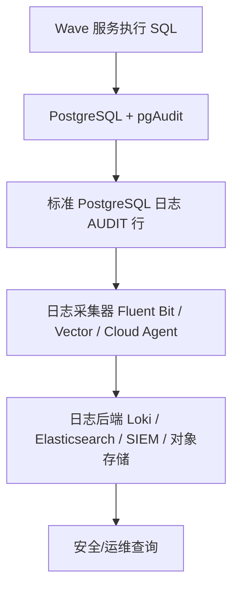
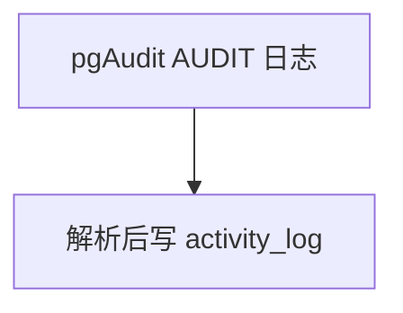

# 备选技术方案：pgAudit 数据库审计日志

> 本文评估的是 PostgreSQL pgAudit 方案。它不是业务活动日志，也不是行级历史表。
> pgAudit 的主流定位是**数据库层安全/合规审计**：记录哪个 DB user 在什么时候执行了什么 SQL、触碰了什么数据库对象。它不保存 OLD / NEW 行快照，也不天然知道 Wave 的业务用户、业务动作和对象语义。

---

## 1. 结论

### 1.1 直接建议

对 Wave 而言，pgAudit 可以作为**数据库层兜底审计**，不建议作为“历史留痕”或 V1 activity log 主方案。

如果“历史留痕”指的是：

- 某个 Chart / Metric / AB 配置以前是什么样；
- 某一行的 before / after；
- 某个字段从 A 变成 B；
- 对象删除后还能看旧快照；

那么 pgAudit **不是最佳方案**。更主流、更可实施的是 [PostgreSQL Trigger 行级历史留痕](./plan-postgre-trigger.md)，或者当前主方案 [ActivityService 显式业务活动日志](./plan-activity-log.md)。

如果“历史留痕”指的是：

- 有人绕过应用直接执行 SQL；
- DBA / 运维脚本 / migration 修改过哪些表；
- 某段时间内哪些数据库对象被读写；
- 安全或合规团队要数据库访问审计证据；

那么 pgAudit 是主流方案之一。

### 1.2 三类方案的清晰分工

| 方案 | 记录什么 | 最适合回答 | 不适合回答 |
|------|----------|------------|------------|
| ActivityService | 业务活动事件 | 谁以什么业务动作改了哪个业务对象 | 绕过应用的 SQL |
| PostgreSQL Trigger | 行级 before/after 快照 | 某一行以前是什么样 | 业务意图、HTTP 用户、source |
| pgAudit | SQL / 对象访问日志 | 哪个 DB 用户执行了什么 SQL、触碰了什么对象 | 行快照、字段级 diff、业务 action |

最稳的架构边界是：

- V1 activity log 继续走 `ActivityService`。
- 如果要 row history，单独建 `row_history_log` + trigger。
- 如果要 DB 层安全审计，独立建设 pgAudit + 日志采集管道。
- 不要把 pgAudit 日志导入 `activity_log`，否则会把 SQL 审计和业务活动混成一个难查询、难解释的模型。

---

## 2. 外部依据与主流实现方式

pgAudit 官方 README 明确说明：pgAudit 通过 PostgreSQL 标准日志设施提供 session audit logging 和 object audit logging，目标是帮助 PostgreSQL 用户生成政府、金融或 ISO 认证常要求的审计日志。

它相比 `log_statement = all` 的价值在于：不仅记录用户请求的 SQL 文本，还会按语句类别、对象类型、对象名等结构化字段输出审计记录，方便审计人员查找“哪些语句触碰了某张表”。

官方能力边界：

- Session audit logging：按 DB session 记录语句，类别包括 `READ / WRITE / FUNCTION / ROLE / DDL / MISC / MISC_SET / ALL`。
- Object audit logging：按对象和权限控制记录 `SELECT / INSERT / UPDATE / DELETE`，用于降低全量日志噪音。
- 输出落点：PostgreSQL 标准日志设施，不是 PostgreSQL 表。
- 日志格式：`AUDIT_TYPE, STATEMENT_ID, SUBSTATEMENT_ID, CLASS, COMMAND, OBJECT_TYPE, OBJECT_NAME, STATEMENT, PARAMETER` 等 CSV-like 字段。
- 参数日志默认关闭；开启 `pgaudit.log_parameter` 后会记录 bind 参数，存在敏感信息风险。
- pgAudit 需要 `shared_preload_libraries` 加载，并需要 `CREATE EXTENSION pgaudit` 才能获得完整 DDL object 信息。
- pgAudit 支持 PostgreSQL 14+，且按 PostgreSQL major version 维护对应分支；Wave 本地开发环境使用 PostgreSQL 17，版本层面可匹配 pgAudit v17.x。

最关键的 caveat：pgAudit 官方说明 audit logging 是 best-effort 且不是事务性的。它通过 PostgreSQL 标准日志设施写日志，不会和产生它的事务同步 fsync，也不会把日志写入错误反馈给当前 session；因此不能保证每个已提交事务都有对应审计日志，也可能出现事务回滚但语句日志已经写出的情况。

参考来源：

- pgAudit README: <https://github.com/pgaudit/pgaudit/blob/main/README.md>
- PostgreSQL logging: <https://www.postgresql.org/docs/current/runtime-config-logging.html>
- PostgreSQL `shared_preload_libraries`: <https://www.postgresql.org/docs/current/runtime-config-client.html#GUC-SHARED-PRELOAD-LIBRARIES>

---

## 3. Wave 项目本地可行性

### 3.1 已具备的基础

Wave 使用 PostgreSQL 作为元数据存储：

- 本地 `deployments/infra.yml` 使用 `postgres:17-alpine`。
- `pkg/dal/pgsqlx` 基于 GORM 连接 PostgreSQL。
- `metadb` 使用 project schema 隔离项目级元数据。
- `globaldb` 使用 global schema 保存账号、组织、项目等全局对象。
- 迁移系统可以执行 meta/global SQL migration，但 pgAudit 的关键配置不完全属于 migration 范畴。

版本上，pgAudit 支持 PostgreSQL 14+，Wave 的 PostgreSQL 17 是可行的。

### 3.2 关键阻碍

| 阻碍 | 影响 |
|------|------|
| 需要 `shared_preload_libraries = 'pgaudit'` | 需要改 PostgreSQL 启动参数并重启，不是纯 SQL migration |
| `postgres:17-alpine` 默认不一定内置 pgAudit | 可能需要自定义 PostgreSQL 镜像或安装 OS package |
| 输出到 PostgreSQL 日志 | 需要日志采集、解析、存储、查询链路，不是应用表查询 |
| Wave app 可能共用 DB user | pgAudit 只能自然看到 DB user，不知道真实 Wave account |
| 当前 DSN 没有 `application_name` | 日志里难区分 web/c1/ma/connector 等服务 |
| meta 多 project schema | object audit logging 要按 schema/table/权限维护，管理成本高 |
| GORM 参数化 SQL | 默认不记录 bind 参数；开启参数记录又有敏感泄露风险 |
| best-effort 非事务 | 不适合作为“历史完整性”的唯一依据 |

### 3.3 与 Wave 当前代码的适配点

如果只是做 pgAudit Spike，Wave 代码层需要的最小改动不是写 activity 代码，而是补可观测身份：

1. 在 `pkg/dal/pgsqlx.buildDSN` 增加 `application_name` 配置，至少区分 `wave-web`、`wave-c1`、`wave-ma`、`wave-connector`。
2. 尽量避免所有服务共用一个高权限 DB user；否则 pgAudit 只能看到同一个用户。
3. 如果要追踪到 HTTP account，不能依赖 pgAudit 原生字段；需要应用层另建 activity log，或者把 account 写入业务 activity。

不建议把真实 account ID 写进 `application_name`：

- GORM 连接池复用连接，请求级动态 `application_name` 容易泄漏或串线。
- PostgreSQL `application_name` 长度有限，不适合承载复杂上下文。
- 即使可做，也会把业务身份管理绑到 DB session，复杂度不比 ActivityService 低。

---

## 4. 推荐设计

### 4.1 最小 pgAudit 配置形态

pgAudit 不是应用 schema migration，而是数据库部署配置。推荐把它作为独立运维能力交付。

PostgreSQL 启动配置示意：

```conf
shared_preload_libraries = 'pgaudit'
log_destination = 'csvlog'
logging_collector = on
log_line_prefix = '%m [%p] %q%u@%d/%a '
```

数据库初始化：

```sql
CREATE EXTENSION IF NOT EXISTS pgaudit;
```

基础 session audit：

```sql
ALTER SYSTEM SET pgaudit.log = 'write, ddl, role';
ALTER SYSTEM SET pgaudit.log_relation = 'on';
ALTER SYSTEM SET pgaudit.log_parameter = 'off';
ALTER SYSTEM SET pgaudit.log_rows = 'on';
```

说明：

- 不建议生产直接 `pgaudit.log = 'all'`，日志量会非常大。
- 不建议默认打开 `pgaudit.log_parameter`，因为参数可能包含 password、token、secret、配置正文等敏感值。
- `log_destination = 'csvlog'` 方便后续导入日志系统；如果基础设施已经统一采集 stderr/jsonlog，也可以选择相应格式。

### 4.2 Object audit 精细化方案

如果目标是减少日志量，可以走 object audit：

```sql
CREATE ROLE auditor;
ALTER SYSTEM SET pgaudit.role = 'auditor';

GRANT INSERT, UPDATE, DELETE ON TABLE schema_global.organization TO auditor;
GRANT INSERT, UPDATE, DELETE ON TABLE schema_global.project TO auditor;
GRANT INSERT, UPDATE, DELETE ON TABLE schema_global.account_api_token TO auditor;
```

project schema 下的问题更复杂：

- 每个项目 schema 都有同名表。
- 新项目创建时也要补 GRANT。
- 新表上线时也要补 GRANT。
- 如果使用 column-level 权限做敏感字段审计控制，维护成本更高。

因此对 Wave 来说，object audit 更适合少量 global 敏感表，不适合覆盖所有 project item 表。

### 4.3 日志采集与查询链路

pgAudit 的主链路应该是：



不要设计成：



原因：

- pgAudit 的单位是 SQL statement，不是业务 item。
- 一条业务操作可能产生多条 SQL。
- 一条 SQL 可能影响多行甚至多对象。
- rollback 与 commit 语义不等价。
- 解析 SQL 重建业务 action 会变成脆弱的反向工程。

---

## 5. 数据模型与查询模型

pgAudit 不推荐在 Wave 应用库里新增业务表保存主数据。

如果为了内部查询体验一定要落 PostgreSQL 表，也应该作为**日志索引表**，不是 activity 表：

```sql
CREATE TABLE IF NOT EXISTS global.db_audit_log_index (
    id              BIGSERIAL PRIMARY KEY,
    log_time        TIMESTAMPTZ NOT NULL,
    db_user         TEXT NOT NULL DEFAULT '',
    database_name   TEXT NOT NULL DEFAULT '',
    application_name TEXT NOT NULL DEFAULT '',
    audit_type      TEXT NOT NULL DEFAULT '',
    class           TEXT NOT NULL DEFAULT '',
    command         TEXT NOT NULL DEFAULT '',
    object_type     TEXT NOT NULL DEFAULT '',
    object_name     TEXT NOT NULL DEFAULT '',
    statement       TEXT NOT NULL DEFAULT '',
    parameter       TEXT NOT NULL DEFAULT '',
    raw_message     TEXT NOT NULL DEFAULT '',
    imported_at     TIMESTAMPTZ NOT NULL DEFAULT CURRENT_TIMESTAMP
);

CREATE INDEX IF NOT EXISTS idx_db_audit_log_index_object_time
    ON global.db_audit_log_index (object_name, log_time DESC);

CREATE INDEX IF NOT EXISTS idx_db_audit_log_index_user_time
    ON global.db_audit_log_index (db_user, log_time DESC);
```

但这张表也只能回答：

- 哪个 DB user 执行了什么 SQL；
- 哪个数据库对象被访问；
- 某段时间 DDL / ROLE / WRITE 操作有哪些。

它不能可靠回答：

- Chart 123 的名称从什么改成什么；
- Dashboard copy 产生了哪些对象；
- AB 状态为什么从 debug 到 online；
- 真实 Wave account 是谁。

---

## 6. 错误处理与失败语义

pgAudit 的失败语义和 ActivityService / Trigger 都不同：

| 方案 | 失败时业务是否回滚 | 是否事务一致 | 是否能 best-effort |
|------|--------------------|--------------|--------------------|
| ActivityService blocking | 可回滚 | 可做到同事务 | 可由 PolicyKey 决定 |
| ActivityService best-effort | 不回滚 | 不强一致 | 是 |
| Trigger | 回滚 | 是 | 否 |
| pgAudit | 不回滚 | 否 | 天然 best-effort |

pgAudit 官方 caveat 已说明：日志通过标准 logging facility 写出，不与事务同步持久化；日志目标不可用也不会把错误反馈给 session。

这意味着：

- pgAudit 不适合做“历史完整性”证明。
- pgAudit 适合做安全取证辅助证据。
- 如果审计日志缺失会影响合规承诺，需要额外的日志管道可用性监控和告警。

---

## 7. 边界 Case

| 场景 | pgAudit 表现 | 评估 |
|------|--------------|------|
| 业务 update 一行 | 记录 UPDATE SQL / object | 没有 OLD / NEW |
| GORM 参数化更新 | 默认参数 `<not logged>` | 安全但无法还原值 |
| 打开 `log_parameter` | 可记录参数 | 高敏感泄露风险 |
| 事务 rollback | 语句可能已经写日志 | 不能当 committed history |
| 批量 UPDATE 100 行 | 一条 SQL 或对象日志 | 不知道每行 before/after |
| 软删除 | 记录 UPDATE | 不知道业务上是 delete |
| CopyDashboard | 多条 INSERT/UPDATE | 不知道业务动作是 copy |
| DBA 手工改表 | 能记录 SQL | pgAudit 的强项 |
| migration DDL | 能记录 DDL | pgAudit 的强项 |
| superuser 操作 | 官方说明不能可靠审计 superuser | 需要限制 superuser 使用 |
| 日志盘满 | 可能丢日志或阻塞，取决于 logging collector/syslog | 需要运维监控 |

---

## 8. 测试策略

### 8.1 环境验证

- 自定义 PostgreSQL 17 镜像，安装 pgAudit。
- 启动参数包含 `shared_preload_libraries=pgaudit`。
- 执行 `CREATE EXTENSION pgaudit`。
- 验证 `SHOW pgaudit.log`、`SHOW shared_preload_libraries`。
- 验证日志中出现 `AUDIT:` 行。

### 8.2 功能验证

- `pgaudit.log='write, ddl, role'` 时，INSERT/UPDATE/DELETE/DDL/GRANT 有日志。
- `pgaudit.log_relation=on` 时，DML 能输出 relation 级日志。
- `pgaudit.log_parameter=off` 时，参数不落日志。
- 打开 `pgaudit.log_rows=on` 后，能看到影响行数。
- object audit 只对授权给 `auditor` 的表生效。

### 8.3 安全验证

- 对 `account_api_token`、`account`、`project.secret` 相关操作，确认日志不包含 token/password/secret 明文。
- 验证 `log_line_prefix` 包含 user/database/application_name。
- 验证不同 Wave 服务的 `application_name` 可区分。

### 8.4 性能与容量验证

- 对典型 web 写入压测，比较开启前后的 P95/P99 延迟。
- 批量写入和高频 metadata 更新场景观察日志量。
- 估算日志保留 7/30/90 天所需容量。
- 验证日志采集器积压、日志盘满、后端不可用时的行为。

---

## 9. 推荐交付计划

如果要推进 pgAudit，建议作为**独立安全审计 Spike**，不要塞进 activity log V1。

### Phase A0：本地可运行

目标：证明 Wave PostgreSQL 17 可以加载 pgAudit。

范围：

- 自定义本地 PostgreSQL 镜像或安装 pgAudit package。
- 配置 `shared_preload_libraries=pgaudit`。
- 开启 `write, ddl, role`。
- 运行 2-3 个 Wave API，确认日志可用。

成功标准：

- 日志中能看到 DML/DDL/ROLE。
- 不记录敏感参数。
- 日志量初步可控。

### Phase A1：服务身份可观测

目标：让 pgAudit 至少能区分哪个 Wave 服务产生 SQL。

范围：

- `PgConfig` 增加 `ApplicationName` 或从服务名注入。
- `buildDSN` 拼接 `application_name`。
- 验证 PostgreSQL 日志中可见 `application_name`。

不建议在这个阶段追求 HTTP account 级别身份；那已经是 ActivityService 的职责。

### Phase A2：日志管道

目标：把 pgAudit 从“文件里有日志”变成“安全同学可查询”。

范围：

- 选择日志后端：Loki / Elasticsearch / SIEM / 对象存储。
- 定义 AUDIT 日志解析规则。
- 建立保留期、权限、告警。

### Phase A3：有限表 object audit

目标：对少量高风险 global 表做精细化 audit。

候选：

- `schema_global.account`
- `schema_global.account_api_token`
- `schema_global.organization`
- `schema_global.project`

谨慎项：

- `account_api_token` 不得开启参数记录。
- 如果 DB user 是 superuser，审计价值会下降。

---

## 10. 最终判断

pgAudit 是 PostgreSQL 世界里非常正统的**数据库审计**方案，但它不是“历史留痕”的银弹。

在 Wave 的方案评审里，可以把它放在第三象限：

- **ActivityService**：业务活动主方案，适合产品/排障视角。
- **PostgreSQL Trigger**：行级历史留痕备选，适合 before/after 快照。
- **pgAudit**：DB 层安全审计备选，适合 DBA/migration/绕过应用的 SQL 取证。

如果我们当前讨论的是“只是为了历史留痕，不是业务审计”，pgAudit 反而不是最合适的主方案；Trigger 更贴近历史留痕。

如果未来客户或安全团队明确要求“数据库访问审计、DDL/ROLE 操作留证、手工 SQL 可追踪”，再单独引入 pgAudit，并且必须同步建设日志采集、保留、权限和告警体系。
