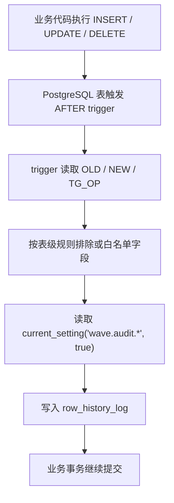
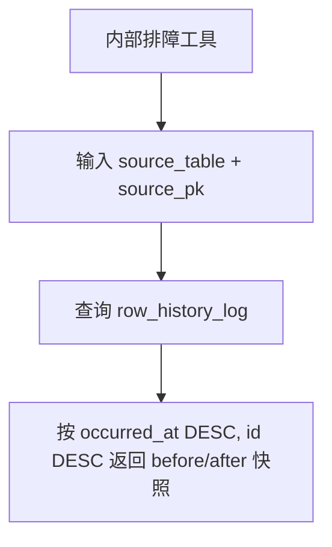

# 备选技术方案：PostgreSQL Trigger 行级历史留痕

> 本文评估的是“历史留痕 / row history”方案，不是当前主方案里的“业务活动日志 / business activity log”。
> 如果目标只是回答“某张表某一行以前是什么样”，PostgreSQL trigger 是主流、可行、工程成本可控的方案；如果目标是回答“谁以什么业务意图对哪个业务对象做了什么”，它不能替代 `ActivityService` 显式写入方案。

---

## 1. 结论

### 1.1 直接建议

对 Wave 而言，PostgreSQL trigger 方案可以作为**行级历史留痕备选方案**，但不建议作为 V1 业务活动日志主方案。

适合使用 trigger 的场景：

- 只需要保留表行 `INSERT / UPDATE / DELETE` 的 before / after 快照。
- 主要查询路径是 `source_table + primary_key`，而不是业务 `item_type + item_id + action_type`。
- 能接受日志写入与业务写入强一致：trigger 失败会导致主写入失败。
- 能为敏感表维护明确的字段白名单 / 黑名单，避免把密钥、密码、token、salt 写进历史表。

不适合使用 trigger 的场景：

- 需要表达 `copy / release / online / launch / pause` 这类业务动作。
- 需要记录一次业务操作影响多个对象的业务语义。
- 需要由业务 owner 自己选择 `blocking / best_effort`。
- 需要写入前脱敏，并且敏感字段规则要和业务 detail schema 解耦。
- 需要生成面向用户或 OP 的稳定 `changes[] / snapshot` 语义。

### 1.2 与主方案的定位关系

| 目标 | 推荐方案 | 原因 |
|------|----------|------|
| 业务活动日志 | `ActivityService` 显式写入 | 应用层拥有 actor、source、action、item、业务 detail |
| 行级历史留痕 | PostgreSQL trigger | 数据库天然拥有 OLD / NEW，覆盖所有 DB 写入路径 |
| 安全强审计 | 独立审计管线 | 需要 request、IP、设备、策略、保留、不可篡改等能力 |

因此，最清晰的边界是：

- `meta.activity_log` / `global.activity_log`：业务活动日志。
- `*_history` 或统一 `row_history_log`：行级历史留痕。
- 两者不要混用同一张表，否则字段会被迫同时服务“业务解释”和“行快照”，最后两边都不优雅。

---

## 2. 外部依据与主流实现方式

PostgreSQL 官方支持 `CREATE TRIGGER` 在 `INSERT / UPDATE / DELETE / TRUNCATE` 等事件上执行 trigger function，并支持 row-level 与 statement-level trigger。官方文档也明确说明 row-level trigger 会对每个被修改的行调用一次；statement-level trigger 会对每条 SQL 调用一次。

PostgreSQL PL/pgSQL trigger function 可读取 `OLD` / `NEW` / `TG_OP` 等特殊变量，这是行级历史留痕的核心能力。官方示例也展示了用 trigger 把 `INSERT / UPDATE / DELETE` 写入 audit table 的模式。

如果需要在 trigger 中读取应用层上下文，PostgreSQL 支持 `current_setting(name, missing_ok)` 和 `set_config(name, value, is_local)`。其中 `is_local = true` 只在当前事务内生效，这对连接池场景很重要。

Go 生态的 `go-history` 也是这一类方案：Go 代码负责生成 history table / trigger DDL，并通过 `database/sql` driver wrapper 把 actor / trace 写入 PostgreSQL session settings；真正捕获行变更的是 PostgreSQL trigger。

参考来源：

- PostgreSQL `CREATE TRIGGER`: <https://www.postgresql.org/docs/current/sql-createtrigger.html>
- PostgreSQL PL/pgSQL Trigger Functions: <https://www.postgresql.org/docs/current/plpgsql-trigger.html>
- PostgreSQL Configuration Settings Functions: <https://www.postgresql.org/docs/current/functions-admin.html>
- PostgreSQL JSON creation functions: <https://www.postgresql.org/docs/current/functions-json.html>
- go-history: <https://github.com/mickamy/go-history>

---

## 3. Wave 项目本地可行性

### 3.1 已具备的基础

Wave 当前代码对 PostgreSQL trigger 并不陌生：

- `script/sql/pgsql/meta.sql` 和 `script/sql/pgsql/global.sql` 已有 `update_updated_at_column()` trigger function。
- meta schema 是按项目隔离的 project schema，`script/migration` 已支持 `DBTypeMeta` 对每个项目 schema 执行迁移。
- global schema 也有独立 `DBTypeGlobal` 迁移。
- 数据访问使用 GORM + PostgreSQL，`pkg/dal/pgsqlx` 已提供事务封装 `Transaction / WithTransaction`。
- 大量表已有 `created_by / updated_by / created_at / updated_at / is_deleted / version` 这类审计字段，trigger 能直接看到行级状态。

这意味着：从工程落地角度看，新增 trigger function、history table、触发器迁移是可行的。

### 3.2 关键约束

| 约束 | 对 trigger 方案的影响 |
|------|----------------------|
| meta 是多项目 schema | 每个 project schema 都要创建 history table / trigger / function |
| global 与 meta 的 ID 类型不同 | history 表主键、actor_id、source_pk 应避免绑定单一 int 类型 |
| GORM 连接池 | 如果用 session settings 注入 actor/source，必须用事务级 `set_config(..., true)`，不能泄漏到下一个请求 |
| 软删除普遍存在 | DELETE 可能是 `UPDATE is_deleted = true`，trigger 只能看到 UPDATE，无法天然知道业务上是 delete |
| AB details / conf 等字段是 TEXT | trigger 可保存整行 TEXT 快照，但无法理解内部 JSON 语义 |
| 用户坚持 `detail_payload` 不用 JSONB | history 表也应使用 TEXT 存储 JSON 字符串，JSON/JSONB 只作为 trigger 内部构造工具 |

---

## 4. 推荐设计

### 4.1 表结构

如果要在 Wave 做 trigger history，推荐使用**统一行历史表**，而不是每个源表一张 history 表。

原因：

- 查询工具和清理策略更简单。
- 多表可共用同一套 viewer / DAO。
- 只需要按 `source_table + source_pk` 建索引。
- 与业务活动表隔离，不污染 `activity_log` 的业务语义。

project schema：

```sql
CREATE TABLE IF NOT EXISTS row_history_log (
    id             BIGSERIAL PRIMARY KEY,
    source_table   VARCHAR(128) NOT NULL,
    source_pk      TEXT NOT NULL,
    op             VARCHAR(16) NOT NULL, -- insert / update / delete
    actor_id       TEXT NOT NULL DEFAULT '',
    source         VARCHAR(32) NOT NULL DEFAULT '',
    correlation_id VARCHAR(64) NOT NULL DEFAULT '',
    before_payload TEXT NOT NULL DEFAULT '',
    after_payload  TEXT NOT NULL DEFAULT '',
    occurred_at    TIMESTAMPTZ NOT NULL DEFAULT CURRENT_TIMESTAMP,
    created_at     TIMESTAMPTZ NOT NULL DEFAULT CURRENT_TIMESTAMP
);

CREATE INDEX IF NOT EXISTS idx_row_history_log_source
    ON row_history_log (source_table, source_pk, occurred_at DESC, id DESC);
```

global schema 可以复用同结构。这里 `source_pk` 和 `actor_id` 使用 TEXT，是为了兼容 meta/global 不同 ID 类型，并避免未来复合主键无法表达。

### 4.2 Trigger function

推荐先做一个通用 trigger function，通过 trigger 参数传入主键列名和敏感字段策略。

示意：

```sql
CREATE OR REPLACE FUNCTION record_row_history()
RETURNS TRIGGER AS $$
DECLARE
    pk_column TEXT := TG_ARGV[0];
    excluded_columns TEXT[] := COALESCE(TG_ARGV[1], '{}')::TEXT[];
    old_doc JSONB;
    new_doc JSONB;
    pk_value TEXT;
BEGIN
    IF TG_OP = 'INSERT' THEN
        new_doc := to_jsonb(NEW) - excluded_columns;
        pk_value := new_doc ->> pk_column;
    ELSIF TG_OP = 'UPDATE' THEN
        old_doc := to_jsonb(OLD) - excluded_columns;
        new_doc := to_jsonb(NEW) - excluded_columns;
        pk_value := COALESCE(new_doc ->> pk_column, old_doc ->> pk_column);

        IF old_doc IS NOT DISTINCT FROM new_doc THEN
            RETURN NULL;
        END IF;
    ELSIF TG_OP = 'DELETE' THEN
        old_doc := to_jsonb(OLD) - excluded_columns;
        pk_value := old_doc ->> pk_column;
    END IF;

    INSERT INTO row_history_log (
        source_table,
        source_pk,
        op,
        actor_id,
        source,
        correlation_id,
        before_payload,
        after_payload,
        occurred_at
    ) VALUES (
        TG_TABLE_NAME,
        COALESCE(pk_value, ''),
        lower(TG_OP),
        COALESCE(current_setting('wave.audit.actor_id', true), ''),
        COALESCE(current_setting('wave.audit.source', true), ''),
        COALESCE(current_setting('wave.audit.correlation_id', true), ''),
        COALESCE(old_doc::TEXT, ''),
        COALESCE(new_doc::TEXT, ''),
        CURRENT_TIMESTAMP
    );

    RETURN NULL;
END;
$$ LANGUAGE plpgsql;
```

> 说明：存储列仍然是 TEXT；`to_jsonb` 只在 trigger 内部用于从 `OLD / NEW` 构造可排除字段的 JSON 文档。如果要严格避免任何 JSONB 表达式，也可以为每张表写白名单字段构造函数，但维护成本会明显上升。

### 4.3 Trigger 绑定

对普通表：

```sql
DROP TRIGGER IF EXISTS trg_chart_row_history ON chart;
CREATE TRIGGER trg_chart_row_history
AFTER INSERT OR UPDATE OR DELETE ON chart
FOR EACH ROW
EXECUTE FUNCTION record_row_history('id', '{updated_at}');
```

对敏感表必须显式排除敏感列：

```sql
DROP TRIGGER IF EXISTS trg_account_api_token_row_history ON account_api_token;
CREATE TRIGGER trg_account_api_token_row_history
AFTER INSERT OR UPDATE OR DELETE ON account_api_token
FOR EACH ROW
EXECUTE FUNCTION record_row_history(
    'id',
    '{token_hash,token_hint,created_at,updated_at}'
);
```

更安全的做法是：敏感表不要使用通用 “整行 - 黑名单” 方案，而是使用**表级白名单函数**，只写允许追溯的字段。

### 4.4 应用层上下文注入

Trigger 如果只靠表里的 `created_by / updated_by`，可以做到零应用改动，但 actor/source/correlation 会不完整。

如果要补充请求上下文，需要在 DAL 层提供轻量 helper：

```go
func SetAuditSession(ctx context.Context, actorID int64, source, correlationID string) error {
    return metadb.GetClient().DBCtx(ctx).Exec(`
        SELECT
            set_config('wave.audit.actor_id', ?, true),
            set_config('wave.audit.source', ?, true),
            set_config('wave.audit.correlation_id', ?, true)
    `, strconv.FormatInt(actorID, 10), source, correlationID).Error
}
```

约束：

- 必须在 `metadb.WithTransaction` / `globaldb.Transaction` 开启的事务内调用。
- 必须使用 `is_local = true`，保证事务结束后配置自动失效。
- 如果业务写入没有显式事务，则不要使用 session settings；否则连接池下很容易污染后续请求。
- 对没有调用 helper 的路径，trigger 仍应写 row history，但 actor/source/correlation 为空或从行字段 fallback。

### 4.5 迁移形态

Wave 迁移系统已经支持 SQL 迁移，因此 trigger 方案可以落成：

- `meta_vYYYYMMDD_row_history_log.sql`：创建 `row_history_log`、`record_row_history()`、绑定首批 meta 表 trigger。
- `global_vYYYYMMDD_row_history_log.sql`：创建 global 版本 history 表、function、绑定 global 表 trigger。
- 同步更新 `script/sql/pgsql/meta.sql` / `global.sql`，保证新环境初始化也有同样 DDL。

所有 DDL 必须幂等：

- `CREATE TABLE IF NOT EXISTS`
- `CREATE OR REPLACE FUNCTION`
- `DROP TRIGGER IF EXISTS` + `CREATE TRIGGER`
- 索引 `CREATE INDEX IF NOT EXISTS`

---

## 5. 数据流



查询链路：



---

## 6. 与 ActivityService 主方案的对比

| 维度 | PostgreSQL Trigger | ActivityService 显式写入 |
|------|--------------------|--------------------------|
| 定位 | 行级历史留痕 | 业务活动日志 |
| 捕获覆盖 | 所有 DB 写路径 | 已接入业务路径 |
| 业务语义 | 弱，只知道表和 I/U/D | 强，知道 item/action/source/detail |
| actor | 依赖行字段或 session settings | 从 ctx / 业务服务自然获得 |
| source | 依赖 session settings | 从入口自然获得 |
| copy / publish 等动作 | 无法天然表达 | 可通过 action_type 注册 |
| before / after | OLD / NEW 天然可得 | 业务投影生成 |
| 敏感字段 | 必须在 DB 函数内维护规则 | 应用层投影 + ActivityService 兜底 |
| 失败策略 | trigger 失败即业务失败 | PolicyKey 可 blocking / best_effort |
| 批量操作 | 每行一条或 statement trigger | 可 batch + correlation_id |
| 可维护性 | DDL 与 schema 强绑定 | Go 类型和测试更容易维护 |
| 查询体验 | source_table + source_pk | item_type + item_id |

### 6.1 关键判断

如果 Wave 评审最终把目标改成“历史快照兜底”，trigger 是更简单、更主流的路线。

如果目标仍是当前 spec 定义的“项目内对象活动记录”，trigger 只能作为辅助方案，不能替代主方案。

---

## 7. 错误处理

Trigger 方案最大的差异是失败语义：

- trigger function 抛错时，当前业务写入会回滚。
- history 表索引、字段类型、函数 bug 都可能影响主写入。
- 不能像 `ActivityService` 一样在调用点选择 best-effort。

建议：

1. trigger function 保持极简，不做复杂 diff、不调用外部服务、不依赖跨表查询。
2. 对高风险表先灰度：只绑定 1-2 张低频表验证。
3. 上线前做故障注入：删除 history 表、破坏 function、字段新增/删除，确认失败模式可接受。
4. 不要在 trigger 内吞异常。吞异常会让“历史留痕完整性”变成不可验证的幻觉。

---

## 8. 边界 Case

| 场景 | Trigger 表现 | 评估 |
|------|--------------|------|
| `UPDATE SET updated_at = now()` | 会写历史，除非排除字段后比较无变化 | 必须排除噪音字段 |
| 软删除 | 表现为 UPDATE，不是 DELETE | 可在查询层把 `is_deleted false -> true` 展示为 delete-like |
| 批量删除 50 条 | row trigger 写 50 条 | 历史留痕合理，但没有业务 batch 语义 |
| CopyDashboard | 新 dashboard 是 INSERT，关联表也可能 INSERT 多行 | 只能看出行变化，不能知道这是 copy |
| Account API Token | 可能触碰 token_hash/token_hint | 必须白名单，不能整行记录 |
| 表新增敏感列 | 黑名单方案可能漏记风险 | 敏感表必须白名单 |
| schema 多租户 | 每个 project schema 都要有函数和 trigger | 迁移系统可做，但执行耗时要评估 |
| 写入路径绕过 Go 服务 | 仍可被 trigger 捕获 | 这是 trigger 的最大优势 |

---

## 9. 测试策略

### 9.1 单元 / 集成测试

- 创建测试 schema，执行 trigger migration。
- INSERT 一行，断言 `row_history_log` 有 `op=insert` 和 `after_payload`。
- UPDATE 业务字段，断言 before/after 都存在。
- 只更新 `updated_at`，断言不写或 payload 不包含噪音字段。
- soft delete，断言记录为 update，payload 中 `is_deleted` 变化可见。
- 敏感表写入，断言 payload 不包含 `password / password_salt / token_hash / token_hint / secret`。
- 未设置 session metadata，断言 history 仍写入但 actor/source 为空。
- 在事务内设置 session metadata，断言 actor/source/correlation 写入且事务结束后不泄漏。

### 9.2 性能测试

- 单行 INSERT/UPDATE 延迟增量。
- 批量 UPDATE 100 / 500 / 1000 行的额外耗时。
- `row_history_log` 百万级后按 `(source_table, source_pk, occurred_at DESC, id DESC)` 查询耗时。
- meta 多项目迁移执行耗时。

### 9.3 回归测试

- 新增列后 trigger 不报错。
- 删除被记录列后 trigger migration 能正确替换 function。
- GORM `Updates(map)` / struct update / raw SQL 都能触发。

---

## 10. 推荐交付计划

如果要把 PostgreSQL trigger 作为备选方案真正推进，建议拆成 3 个小阶段。

### Phase T0：验证 Spike

目标：证明 Wave 当前 GORM + migration + project schema 能稳定运行 trigger history。

范围：

- 只选 `chart` 或 `metric_define` 一张低风险 meta 表。
- 建 `row_history_log`。
- 写通用 trigger function。
- 不做 session metadata，只从行字段读取 `created_by / updated_by`。
- 跑集成测试和简单压测。

成功标准：

- INSERT/UPDATE/soft delete 都有历史。
- payload 不含噪音字段。
- 单行写入额外延迟可接受。
- trigger 失败模式清晰。

### Phase T1：上下文注入

目标：验证 actor/source/correlation 是否值得补。

范围：

- 在 `pgsqlx` 或 activity history helper 中增加 `SetAuditSession`。
- 只要求显式事务路径使用。
- 证明连接池下不会泄漏。

如果 T1 需要改大量业务入口，说明 trigger 的“低侵入”优势正在消失，应停止扩大。

### Phase T2：扩大覆盖

目标：只把 trigger 用在真正需要“行历史”的表。

范围建议：

- 适合：`metric_define`、`event_property_define`、配置类元数据表。
- 谨慎：`chart`、`dashboard`，因为业务 activity 价值更高。
- 不建议：`account`、`account_api_token`、`project.secret` 等敏感字段密集表，除非采用白名单函数。

---

## 11. 最终判断

PostgreSQL trigger 是“历史留痕”的主流工程方案，不是“不标准”。它的优点很真实：覆盖所有 DB 写入、before/after 天然、接入业务代码少。

但它解决的是另一类问题：**row history**。

当前 AddAuditLog spec 的核心目标是 **business activity log**。这类问题的最佳实践更接近 Harbor / Grafana 的应用层显式记录：actor、action、resource、source、detail 都由业务层负责表达。

所以推荐保留当前主方案，同时把 PostgreSQL trigger 作为一个清晰的备选分支：

- 如果评审决定目标是“业务排障、责任链、活动解释”：继续 `ActivityService` 主方案。
- 如果评审决定目标收敛为“数据库行历史快照”：切换到 PostgreSQL trigger 方案，避免过度设计业务活动框架。
- 如果两者都要：分两张表、两条链路，绝不混成一个抽象。
