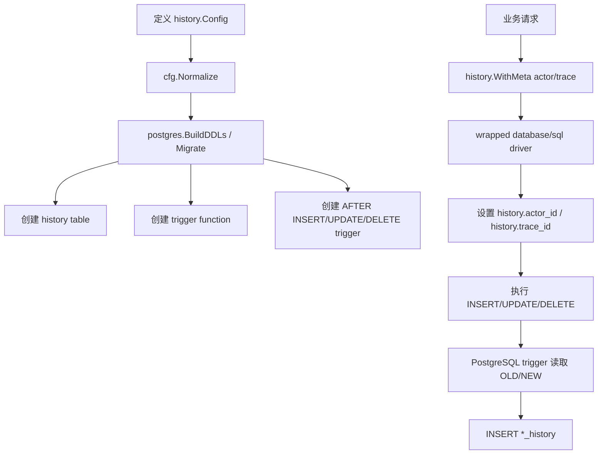

# go-history 案例研究

**项目**: `mickamy/go-history`
**技术栈**: Go + PostgreSQL trigger + `database/sql` driver wrapper
**类型**: 行级历史记录库
**与 Wave 相似度**: 中，适合作为 row history 备选方案参照，不适合作为 business activity log 主方案
**一句话心智模型**: go-history 通过 PostgreSQL trigger 为每张业务表生成 `_history` 表，自动保存 INSERT/UPDATE/DELETE 的 before/after 快照；Go 代码主要负责生成 DDL 和注入 actor/trace metadata。

**来源**:

- 上游仓库: <https://github.com/mickamy/go-history>
- 源码抽样版本: `/private/tmp/go-history-research`，commit `904083b`

---

## 1. 背景：go-history 解决什么问题

go-history 不是完整产品，而是一个 Go 库。它解决的问题是：

- 不想在每个业务 service 里手写历史记录。
- 希望数据库层自动记录每行的 before/after。
- 希望覆盖 ORM、raw SQL、脚本等所有 DB 写入路径。
- 希望保留 actor_id / trace_id，方便排查。
- 希望有 CLI viewer 能看 log 和 diff。

它的核心目标是 **row history**，不是 **business activity**。

能回答：

- 这行 `orders.id=42` 以前是什么样？
- 谁的 actor_id 修改过这行？
- 某个 trace_id 造成了哪些行变化？

不能自然回答：

- 用户是“复制 dashboard”还是“创建 dashboard”？
- AB 是发布、调试、回滚还是普通更新？
- 哪些字段是业务噪音、哪些字段该隐藏？

---

## 2. 为什么 go-history 这样设计

### 2.1 Trigger 是 row history 的天然工具

PostgreSQL trigger 能在行写入时直接读取：

- `OLD`
- `NEW`
- `TG_OP`

这使它非常适合捕获 before/after 快照。应用层不需要先读旧值，也不需要每个 DAO 都写日志。

### 2.2 每张表一张 history table

go-history 默认用 suffix 生成历史表，例如：

- `orders` → `orders_history`
- `order_items` → `order_items_history`

这比单张巨型 history 表更贴近源表，也便于按表生成 trigger、索引和 viewer 查询。

### 2.3 driver wrapper 注入上下文

Trigger 在 DB 内部运行，拿不到 Go context。go-history 用 `database/sql` driver wrapper 解决这件事：

- 应用层通过 `history.WithMeta(ctx, history.Meta{ActorID, TraceID})` 写入 context。
- wrapped driver 在连接上设置 PostgreSQL session setting。
- trigger 用 `current_setting('history.actor_id', true)` 和 `current_setting('history.trace_id', true)` 读取。

这个设计能把少量应用上下文传到 DB trigger，但它也引入连接池和驱动接入约束。

---

## 3. 具体设计

### 3.1 配置模型

go-history 的 YAML 配置大致是：

```yaml
driver: postgres

history_table:
  suffix: "_history"

default_operations: all

tables:
  orders:
    pk: ["id"]
  order_items:
    pk: ["order_id", "line_no"]
    operations: insert|update
```

核心配置：

| 配置 | 说明 | Wave 类比 |
|------|------|-----------|
| `driver` | 当前主要支持 postgres | Wave 也是 PostgreSQL |
| `history_table.suffix` | 历史表命名规则 | 可类比 `row_history_log` 或 `*_history` |
| `default_operations` | 默认记录 insert/update/delete | Wave action_type 不是同一层概念 |
| `tables.<name>.pk` | 源表主键，支持复合主键 | Wave 多数 meta/global 表是单主键 |
| `tables.<name>.operations` | 表级操作过滤 | Wave PolicyKey 是业务场景级 |

### 3.2 History row schema

`row.go` 定义统一历史行：

| 字段 | 说明 |
|------|------|
| `id` | history row 自增主键 |
| `op` | `insert/update/delete` |
| `pk` | JSON 主键，支持复合主键 |
| `before` | 操作前行快照，INSERT 为空 |
| `after` | 操作后行快照，DELETE 为空 |
| `actor_id` | 可选 actor metadata |
| `trace_id` | 可选 trace metadata |
| `at` | trigger 执行时间 |

PostgreSQL DDL 生成器会创建类似结构：

```sql
CREATE TABLE IF NOT EXISTS orders_history (
    id       BIGSERIAL PRIMARY KEY,
    op       TEXT NOT NULL,
    pk       JSONB NOT NULL,
    before   JSONB,
    after    JSONB,
    actor_id TEXT,
    trace_id TEXT,
    at       TIMESTAMPTZ NOT NULL DEFAULT now()
);
```

索引：

| 索引 | 目的 |
|------|------|
| GIN `(pk)` | 按主键查某行历史 |
| BTREE `(at)` | 按时间查 |
| BTREE `(actor_id)` | 按操作人查 |
| BTREE `(trace_id)` | 按请求链路查 |

### 3.3 Trigger function

go-history 为每张表生成 trigger function：

- INSERT：写 `after = to_jsonb(NEW)`，`before = NULL`
- UPDATE：写 `before = to_jsonb(OLD)`，`after = to_jsonb(NEW)`
- DELETE：写 `before = to_jsonb(OLD)`，`after = NULL`
- `op = lower(TG_OP)`
- `actor_id/trace_id` 从 PostgreSQL session setting 读取

这是非常标准的 row history 实现。

### 3.4 Driver wrapper

go-history 的 `postgres.Install(...)` 会注册一个 history-aware driver。应用使用这个 driver 打开 DB 后：

- `ExecContext/QueryContext` 能读取 context 中的 `history.Meta`。
- driver 在执行 SQL 前把 actor/trace 设置到连接 session。
- trigger 从 session setting 读取 metadata。

这要求所有需要 metadata 的 DB 写入都走这个 wrapped driver。对 Wave 的 GORM 封装来说，这不是零成本接入。

---

## 4. 写入流程



---

## 5. 查询流程

go-history 提供 viewer CLI：

```text
go-history-viewer log --limit 20 orders
go-history-viewer diff --pk "id=42" orders
go-history-viewer serve --addr :8080
```

查询本质是读 `orders_history`：

- `log` 看历史行列表；
- `diff` 对比 before/after；
- `serve` 提供轻量 web UI；
- config 决定表名、PK 解析和 history table 名。

这个查询模型非常适合“按 DB 表主键看历史”，不适合“按业务 item_type/action_type 看活动”。

---

## 6. 对 Wave 的判断

### 6.1 最值得借鉴

- 如果目标是 row history，trigger + history table 是主流且优雅的方案。
- `actor_id/trace_id` 通过 session setting 注入，是 DB trigger 获取请求上下文的常见做法。
- history row schema 简洁，适合 before/after 快照。
- viewer / diff 工具能显著提高排障体验。

### 6.2 不适合作为 Activity Log 主方案

- 它记录的是表行，不是业务对象。
- `op` 只有 insert/update/delete，没有 copy/release/online 等领域动作。
- 默认 `to_jsonb(OLD/NEW)` 容易把敏感字段先落库。
- 对 Wave 的 TEXT detail 约束不友好；go-history 使用 JSONB。
- Wave 使用 GORM + 自有 `pgsqlx` 封装，driver wrapper 不是无侵入替换。
- 批量业务操作只是一堆行变化，没有业务 batch 语义。

### 6.3 如果 Wave 选择 row history，应如何调整

如果评审最终决定“我们其实只要历史留痕，不要业务活动解释”，可以参考 go-history，但要做 Wave 化调整：

- 使用统一 `row_history_log` 还是每表 `*_history` 需要单独决策。
- 存储列可用 TEXT 承载 JSON 字符串，避免主方案中已否定的 JSONB 存储争议。
- 敏感表必须白名单，不要简单 `to_jsonb(OLD/NEW)`。
- metadata 注入必须和 `pgsqlx.Transaction/WithTransaction` 配合，避免连接池泄漏。
- 不应把 row history 写进 `activity_log`，两者语义不同。

### 6.4 设计结论

go-history 证明：如果目标是“这行数据以前是什么样”，PostgreSQL trigger 是可落地的主流方案。但它也反向证明：row history 和 business activity 是两件事。Wave 当前如果仍要支持 AB/Metric/Dashboard 的业务排障和责任链，ActivityService 仍然更合适；如果目标收敛为纯历史快照，就应转向 trigger 方案。
