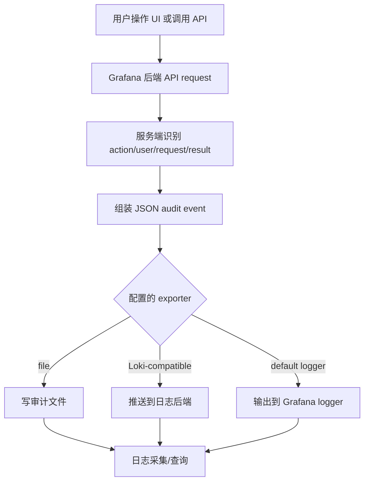

# Grafana Audit Log 案例研究

**产品**: Grafana Enterprise / Grafana Cloud
**技术栈**: Go 后端 + TypeScript/React 前端 + 日志后端
**类型**: 可观测性平台的产品级 audit event stream
**与 Wave 相似度**: 中高
**一句话心智模型**: Grafana 把 API request / UI action 转成结构化 audit event，然后输出到 file、Loki-compatible endpoint 或默认 logger；它不是 DB 表历史，也不是 trigger。

**来源**:

- 官方文档: <https://grafana.com/docs/grafana/latest/setup-grafana/configure-security/audit-grafana/>
- 上游仓库: <https://github.com/grafana/grafana>
- 说明：Grafana Enterprise audit log 的完整实现不是完整 OSS 表结构；本文只陈述公开文档和公开仓库可确认的部分。

---

## 1. 背景：Grafana 为什么需要 audit log

Grafana 是多租户可观测性平台，用户会管理：

- dashboard
- folder
- datasource
- alert rule
- team
- user
- organization
- service account / token

这些对象的变更影响企业监控、告警、数据访问权限和安全合规。管理员关心的问题是：

- 谁创建、修改、删除了 dashboard？
- 谁变更了 datasource？
- 谁修改了用户、团队或权限？
- 操作来自哪个 request？
- 操作成功还是失败？
- 审计日志能否进入 Loki 或企业日志系统？

Grafana 的天然优势是“它本身就是可观测性产品”，因此 audit log 更适合做成结构化事件流，交给日志后端分析，而不是塞进业务数据库表。

---

## 2. 为什么 Grafana 这样设计

### 2.1 审计点放在 API/UI action 层

Grafana 官方文档说明：audit log 由 API request 或触发 API request 的 UI action 产生。这个边界很重要：

- 它不承诺捕获所有数据库行变化。
- 它关注用户可理解的产品操作。
- 它能拿到 request、user、result、resources 等上下文。

这和 Wave 当前 ActivityService 的思想接近：业务活动日志应该从业务入口生成，而不是从 DB 反推。

### 2.2 输出到日志系统，而不是产品主库

Grafana 支持把 audit event 输出到：

- file
- Loki-compatible endpoint
- Grafana default logger / console

这符合 Grafana 的产品基因：日志流进入日志系统后更适合检索、保留、告警和外部安全平台对接。

Wave 当前需求不同：内部排障要按 `item_type + item_id` 快速查对象历史，因此 PG 表比日志 exporter 更直接。

### 2.3 resources 是列表

Grafana 的 audit event 可以表达一个 action 影响多个 resource。这比单纯 `resource_id` 更通用，适合：

- 一个请求创建多个对象；
- 一个权限变更影响 team/user/resource；
- 一个 dashboard 操作关联 folder、dashboard 等资源。

这对 Wave 的启发是：V1 可以用 `correlation_id` 串联多条单对象日志；未来如果真的需要一个 event 多 target 查询，再引入 `activity_log_target` 投影表，而不是把 scope 字段无限塞进主表。

---

## 3. 具体设计

### 3.1 事件模型

公开文档描述的 Grafana audit event 是 JSON 事件，核心字段概念包括：

| 字段概念 | 说明 | Wave 类比 |
|----------|------|-----------|
| `timestamp` | 事件时间 | `occurred_at` |
| `user` / `userId` | 操作人 | `operator_id/operator_name` |
| `action` | 发生的动作 | `action_type` 或扩展 action |
| `requestUri` | API 请求路径 | Wave V1 暂不记录 |
| `ipAddress` | 请求来源 IP | Wave V1 暂不记录 |
| `result` | success / failure | Wave V1 主要记录成功变更 |
| `resources` | 受影响资源列表 | `item_type/item_id` 或未来 target 表 |
| `metadata` | 补充上下文 | `detail.extra` |

这不是 field-level diff。Grafana 的 audit log 主要告诉你“哪个用户对哪些资源执行了哪个 action，结果如何”，而不是“字段 A 从 X 改成 Y”。

### 3.2 落点

Grafana 没有公开文档说明 audit event 存在某张 PostgreSQL 业务表。公开文档强调的是 exporter / logger：

| 落点 | 用途 | 对 Wave 的判断 |
|------|------|----------------|
| file | 本机文件审计，便于采集 | Wave 可作为未来外部 sink |
| Loki-compatible endpoint | 集中日志查询和告警 | Wave 后续可考虑 |
| default logger / console | 跟随 Grafana 日志 | 仅适合运维审计 |

这里要明确一点：

- **Grafana 审计没有 Harbor 那样的产品内审计表**
- **Grafana 的主交付物是结构化 audit event，不是 audit row**
- **Grafana 的查询默认依赖外部日志系统，而不是业务主库分页**

### 3.3 核心模块与配置视图

虽然 Enterprise 审计能力不是完整开源的“数据库表实现”，但从官方文档和公开仓库仍能看出它的模块边界：

| 层次 | 可确认的模块/概念 | 作用 |
|------|------------------|------|
| 入口层 | API request / 触发 API request 的 UI action | 决定哪些用户动作会产生审计事件 |
| 事件层 | audit event JSON | 统一承载 `action/user/request/result/resources` |
| 配置层 | audit logging 配置、exporter 配置 | 决定启用状态和输出目标 |
| OSS 抽象层 | `pkg/apiserver/auditing` | 公开仓库里可见的 auditing event / policy / logger 抽象 |
| 输出层 | file / Loki-compatible endpoint / default logger | 实际落点 |

如果从“阅读者脑内模型”看，Grafana 的关键不是某几个 Go 文件，而是这 5 层关系：

```text
UI/API action
  → audit event
  → exporter config
  → file/Loki/logger
  → 外部日志查询
```

### 3.4 公开 OSS 代码边界

Grafana OSS 仓库中存在 `pkg/apiserver/auditing`，说明新 API server 路径有 audit event / policy / logger 抽象。但 Grafana Enterprise audit logging 的完整实现并不能从 OSS 代码完全还原。

因此，本文不声称 Grafana 有某张 audit DB 表，也不把它描述成 PostgreSQL 方案。

---

## 4. 写入/输出流程



这个流程的核心不是“事务内落库”，而是“把用户行为变成可观测事件”。

---

## 5. 查询与运维模型

Grafana 的 audit log 查询更像日志检索：

- 通过日志后端按时间检索；
- 按 action、user、resource、result 过滤；
- 可接入 Loki 或企业日志系统；
- 保留期和权限通常由日志后端管理。

这和 Harbor 的“产品内 audit table + UI list”不同。

对 Wave 来说，如果 V1 主要查询对象历史：

- `activity_log` 表更直接；
- OP / 内部接口分页更简单；
- 不需要先引入 Loki/SIEM 查询链路。

---

## 6. 对 Wave 的判断

### 6.1 最值得借鉴

- **action 和 resource 分离**：不要把 `add_org_member` 这种业务句子塞进 action；用 `item_type + action_type` 表达。
- **resources[] 思想**：多对象操作可以用 correlation 或 target 投影表达。
- **audit event 输出可扩展**：V1 写 PG，未来可加 Loki/SIEM exporter。
- **只记录 API/UI action**：说明成熟产品也不会试图从 DB 行变化反推出业务审计。

### 6.2 不应照搬

- 不应把 Wave V1 变成日志 exporter 项目。
- 不应把 requestUri/ipAddress/result 全量拉进 V1 主表；这些是安全审计维度。
- 不应为了模拟 Grafana 的 resources[] 在 V1 过早引入 target 表，除非查询场景真的需要。

### 6.3 设计结论

Grafana 证明：当审计目标是产品行为和安全可观测性时，应用层事件 + 日志 sink 是主流方案。但 Wave 当前最核心的需求是“按对象查看历史”，所以 Wave 可以借鉴 Grafana 的事件模型，不应照搬它的日志落点。
