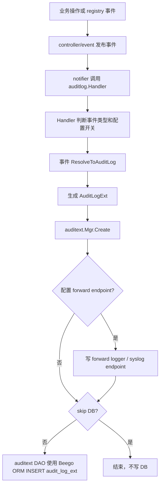
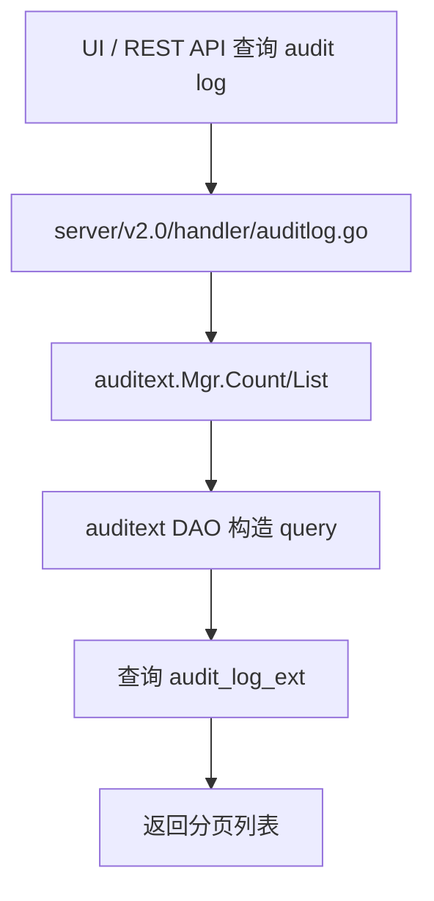

# Harbor Audit Log 案例研究

**产品**: Harbor
**技术栈**: Go 后端 + Angular Web UI + Harbor DB
**类型**: 企业镜像仓库的产品级资源操作日志
**与 Wave 相似度**: 高
**一句话心智模型**: Harbor 把 registry / project / robot / tag 等业务事件转换成一张管理员可查询的资源操作表，而不是通过 DB trigger 记录行快照。

**来源**:

- 官方文档: <https://goharbor.io/docs/2.13.0/administration/audit-log/>
- 上游仓库: <https://github.com/goharbor/harbor>
- 源码抽样版本: `/private/tmp/harbor-audit-research`，commit `a11480b`

---

## 1. 背景：Harbor 为什么需要 audit log

Harbor 是企业级容器镜像仓库。它的关键对象不是普通数据库表，而是用户能理解的产品资源：

- project
- repository
- artifact / image
- tag
- robot account
- user
- system configuration

管理员关心的问题是：

- 谁 push / pull / delete 了某个 artifact？
- 谁创建或删除了 project？
- 谁创建或删除了 robot account？
- 某个 project 最近发生了哪些资源操作？
- 日志能不能转发到外部 syslog / SIEM？

所以 Harbor 的审计目标不是“这行数据库 before/after 是什么”，而是“这个 registry 资源发生了什么产品操作”。这决定了它不会选择 DB trigger，而是选择**事件层业务审计**。

---

## 2. 为什么 Harbor 这样设计

### 2.1 业务事件比数据库行更接近用户语言

镜像仓库里一次用户动作可能跨多个表、多个服务甚至 registry 回调。DB 层只能看到行变化，看不到“push artifact”“delete repository”“create robot”这些产品语义。

Harbor 因此把审计点放在事件系统：

- registry / project / robot 等模块产生事件。
- audit handler 订阅这些事件。
- 每类事件自己实现 `ResolveToAuditLog()`，把事件转换成统一 audit row。

这和 Wave 当前 “业务 service 显式写 activity” 的方向一致：审计行由业务语义产生，而不是从数据库反推。

### 2.2 审计表服务管理员列表，不服务 diff 排障

Harbor 的 UI 是典型 audit list。管理员需要过滤、分页、排序、看 operation description，但不需要看每个字段的 before/after。

因此 Harbor 的表字段很克制：

- 操作时间
- 操作人
- 资源类型
- 资源名
- 操作类型
- 操作描述
- 结果
- project scope

它没有 `changes[]`，也没有通用 diff engine。

### 2.3 默认入库，但允许外部转发和跳过 DB

Harbor 既要产品内可查，也要满足企业外部审计系统对接，所以它在 manager 层做两个决策：

- 配置 `audit_log_forward_endpoint` 时，把 audit log 输出到 forward logger / syslog endpoint。
- 配置 `skip_audit_log_database` 时，不写 DB，只保留外部转发。

这个设计把“审计事件生成”和“落点选择”分开了。

---

## 3. 具体设计

### 3.1 表模型

Harbor 当前扩展表模型来自 `src/pkg/auditext/model/model.go`：

| 字段 | 类型语义 | 说明 | Wave 类比 |
|------|----------|------|-----------|
| `id` | int64 PK | audit row ID | `id` |
| `project_id` | int64 | project scope | Wave project schema 内不需要冗余 |
| `operation` | string | create / delete / pull 等 | `action_type` |
| `op_desc` | string | 人可读操作说明 | `detail.extra` 或展示文案 |
| `op_result` | bool | 操作是否成功 | Wave V1 暂只记成功活动 |
| `resource_type` | string | artifact / project / repository / robot / tag | `item_type` |
| `resource` | string | 资源名或摘要 | `item_name` |
| `username` | string | 操作人快照 | `operator_name` |
| `op_time` | time | 操作时间 | `occurred_at` |

源码中 `AuditLogExt.TableName()` 返回 `audit_log_ext`。旧模型 `src/pkg/audit/model/model.go` 使用旧表 `audit_log`，字段少于 `audit_log_ext`，没有 `op_desc/op_result`。

> 注意：这里说的是 Harbor 源码级 ORM table name；具体数据库引擎由 Harbor 部署决定。它不是 PostgreSQL trigger，也不是 PostgreSQL JSONB 历史表。

### 3.2 事件到审计行的映射

Harbor 的每类事件自己知道如何转 audit log。典型映射逻辑在 `src/controller/event/topic.go` 和 `src/controller/event/model/event.go`：

| 事件 | operation | resource_type | resource | operation_description |
|------|-----------|---------------|----------|-----------------------|
| `CreateProjectEvent` | `create` | `project` | project name | create project |
| `DeleteProjectEvent` | `delete` | `project` | project name | delete project |
| `PushArtifactEvent` | `push` | `artifact` | repository / digest | push artifact |
| `PullArtifactEvent` | `pull` | `artifact` | repository / digest | pull artifact |
| `CreateTagEvent` | `create` | `tag` | repository:tag | create tag |
| `CreateRobotEvent` | `create` | `robot` | robot name | create robot |

这个映射说明 Harbor 的 `operation` 不是简单 CRUD 四件套，它会保留镜像仓库领域动作，例如 `push/pull`。

对 Wave 的启发是：如果领域动作非常强，扩展 `action_type` 是合理的；但如果只是普通属性变化，基础 `create/update/delete/copy` 更简洁。

### 3.3 配置开关

源码中和审计相关的配置包括：

| 配置 | 作用 | 设计动机 |
|------|------|----------|
| `audit_log_forward_endpoint` | 将 audit log 输出到外部 endpoint/logger | 企业对接 SIEM/syslog |
| `skip_audit_log_database` | 跳过 DB 入库 | 只用外部审计系统时减少 DB 压力 |
| `disabled_audit_log_event_types` | 按 `operation_resource_type` 禁用部分事件 | 控制日志量或关闭低价值事件 |
| `pull_audit_log_disable` | 禁用 pull artifact 事件 | pull 高频，容易产生巨大日志量 |
| `gdpr_audit_logs` | 删除用户后 username 可替换/hash | GDPR 场景 |

这说明成熟产品会明确面对两个现实问题：日志量和隐私合规。

---

## 4. 写入流程

源码关键点：

- `controller/event/handler/init.go` 订阅 audit 相关事件。
- `controller/event/handler/auditlog/auditlog.go` 判断事件类型、调用 `ResolveToAuditLog()`。
- `pkg/auditext/manager.go` 决定转发和入库。
- `pkg/auditext/dao/dao.go` 调用 Beego ORM `Insert`。

### 4.1 失败语义

`auditlog.Handler.Handle()` 在调用 `auditext.Mgr.Create()` 失败时记录日志，但不会把这个错误继续返回成业务失败。也就是说，Harbor audit log 写入偏 **best-effort**，不是 Vault 那种 fail-closed 强审计。

这对 Wave 很有启发：业务活动日志默认不应阻塞所有主流程；只有业务 owner 明确要求的高风险场景才应选择 blocking。

---

## 5. 查询与运维流程

Harbor 的查询体验围绕列表过滤：

- 时间
- username
- operation
- resource
- resource_type
- project

运维侧还提供 purge：

- `auditext.Mgr.Purge(retentionHour, includeOperations, dryRun)`
- DAO 直接删除 `op_time < now() - retention` 且 operation/resource type 命中的记录

这说明 audit log 从一开始就要考虑保留期和清理，否则表增长很快。

---

## 6. 对 Wave 的判断

### 6.1 最值得借鉴

- **事件/业务层生成审计行**：只有业务层知道 action 和 resource 的真实语义。
- **表字段克制**：主表不要变成大杂烩。
- **人可读快照**：`resource/username/op_desc` 都是写入时快照。
- **默认 DB + 可选转发**：Wave V1 可先只写 PG，未来再加外部 sink。
- **高频事件可单独关闭**：Wave 可以保留 write-only feature flag，但不必 V1 做复杂 per-event 配置。

### 6.2 不应照搬

- Harbor 不记录 field-level before/after；Wave 的 AB/Metric 排障确实需要 `changes[]`。
- Harbor 有 `project_id` scope；Wave project activity 在 project schema 内，`project_id` 列可能冗余。
- Harbor 主要是资源操作列表；Wave 当前更强调单对象历史链路。

### 6.3 设计结论

Harbor 证明：对产品级 activity/audit log，主流且优雅的做法是应用层事件或 service 层显式写入，而不是 DB trigger。它的数据模型越接近管理员语言，越容易查询和解释。
