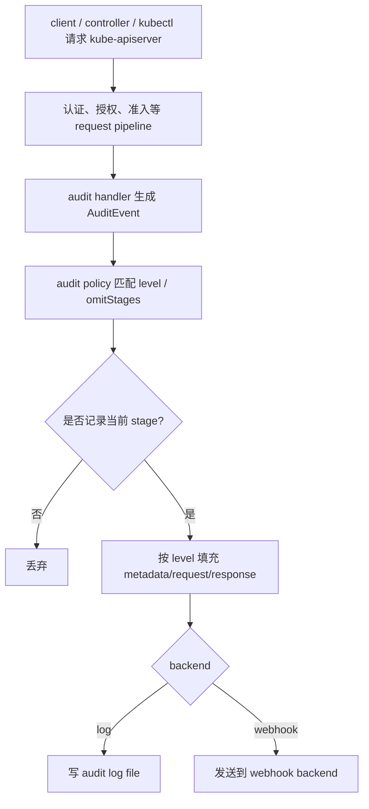

# Kubernetes Auditing 案例研究

**产品**: Kubernetes
**技术栈**: Go
**类型**: API Server 安全审计
**与 Wave 相似度**: 中
**一句话心智模型**: Kubernetes 在唯一控制面入口 kube-apiserver 上记录 API request lifecycle，通过 policy 决定记录粒度，再写到 log/webhook backend；它不是业务对象活动表。

**来源**:

- 官方文档: <https://kubernetes.io/docs/tasks/debug/debug-cluster/audit/>
- 上游仓库: <https://github.com/kubernetes/kubernetes>

---

## 1. 背景：Kubernetes 为什么这样做审计

Kubernetes 的所有集群控制面操作理论上都经过 kube-apiserver：

- 创建 / 更新 / 删除 Pod、Deployment、Service、ConfigMap、Secret
- 读取资源
- 修改 RBAC
- 执行 exec / port-forward 等子资源操作
- 控制器、kubectl、operator、用户都走同一个 API server

因此 Kubernetes 的审计问题不是“某个业务对象字段怎么变”，而是：

- 谁向 API server 发起了请求？
- 请求 verb 是什么？
- 操作哪个 namespace / resource / object？
- 请求在哪个 lifecycle stage？
- 是否需要记录 request body / response body？
- 审计事件要写到文件还是 webhook？

它有一个 Wave 没有的优势：**统一入口非常强**。Wave 的业务操作分散在多个 service/domain，不存在像 kube-apiserver 这样天然完整的业务语义入口。

---

## 2. 为什么 Kubernetes 这样设计

### 2.1 审计点放在 API server，而不是 DB

Kubernetes 的真相源是 etcd，但它没有选择在 etcd 层做审计。原因很直接：

- etcd 只知道 key/value 变化，不知道 Kubernetes user、verb、impersonation、userAgent、sourceIPs。
- 安全审计关心 request 语义，不是存储行变化。
- API server 能统一处理认证、授权、准入、响应结果和错误。

这说明：即使底层存储能看到所有变化，成熟系统仍倾向在**语义更完整的入口层**做审计。

### 2.2 通过 policy 控制成本和敏感信息

Kubernetes 集群请求量非常大。如果全量记录 request/response body：

- 日志量会爆炸；
- Secret 等敏感资源可能泄露；
- 审计后端压力很大。

所以它设计了 Audit Policy，用规则决定记录哪些请求，以及记录到什么 level。

### 2.3 记录 request lifecycle stage

Kubernetes 不只关心“请求完成了吗”，还关心请求在哪个阶段：

- 收到请求
- 开始返回长连接响应
- 完成响应
- panic

这是安全审计和故障分析需要的；但 Wave 的业务 activity log 通常只需要“业务操作成功后记录一次”。

---

## 3. 具体设计

### 3.1 AuditEvent 关键字段

Kubernetes audit event 的核心字段概念：

| 字段概念 | 说明 | Wave 类比 |
|----------|------|-----------|
| `auditID` | 单个请求的唯一审计 ID | `correlation_id` 的远亲 |
| `stage` | request lifecycle 阶段 | Wave V1 不需要 |
| `requestURI` | 请求路径 | Wave V1 暂不记录 |
| `verb` | get/list/create/update/delete/patch/watch 等 | `action_type` |
| `user` | 认证用户 | `operator_id/operator_name` |
| `impersonatedUser` | impersonation 用户 | Wave V1 不需要 |
| `sourceIPs` | 来源 IP | Wave V1 暂不记录 |
| `userAgent` | 客户端 | `source` 的更底层版本 |
| `objectRef` | 目标 Kubernetes 对象 | `item_type/item_id` |
| `responseStatus` | HTTP/status 结果 | Wave V1 主要记录成功 |
| `requestObject` | 请求体，取决于 level | 不建议 Wave 全量记录 |
| `responseObject` | 响应体，取决于 level | 不建议 Wave 全量记录 |
| `annotations` | audit annotation | `detail.extra` |
| `requestReceivedTimestamp` | 请求接收时间 | `occurred_at` 的 API 视角 |
| `stageTimestamp` | 当前 stage 时间 | Wave V1 不需要 |

`objectRef` 又包含 resource、namespace、name、uid、apiGroup、apiVersion 等信息，这是 Kubernetes 的资源定位方式。

### 3.2 Audit Level

Kubernetes 用 level 控制记录粒度：

| Level | 记录内容 | 设计动机 |
|-------|----------|----------|
| `None` | 不记录 | 降低噪音 |
| `Metadata` | 只记录 metadata，不记录 request/response body | 默认安全、成本较低 |
| `Request` | 记录 request body，不记录 response body | 排查写入输入 |
| `RequestResponse` | request 和 response 都记录 | 最详细，也最贵最敏感 |

这对 Wave 的启发是：detail 不能无脑全量序列化。投影和敏感字段策略是必要的。

### 3.3 Audit Stage

Kubernetes 的 stage 包括：

| Stage | 含义 |
|-------|------|
| `RequestReceived` | API server 已收到请求，handler 尚未处理 |
| `ResponseStarted` | response header 已发送，body 还在流式返回 |
| `ResponseComplete` | response 完成 |
| `Panic` | 请求处理 panic |

Wave 的 activity log 不需要这些 stage，因为 Wave 记录的是业务对象变更事实，不是 API request 生命周期。

### 3.4 Audit Policy

Policy 是一组规则。规则可以按这些维度匹配：

- user
- userGroup
- verb
- resource / apiGroup
- namespace
- nonResourceURL
- level
- omitStages

这套规则体现了成熟安全审计的关键：不同资源和动作的记录粒度不一样，不是所有请求都同等重要。

### 3.5 Backend

Kubernetes 官方支持的审计后端包括：

| Backend | 说明 |
|---------|------|
| log file | 写本地审计日志文件 |
| webhook | 发到远端审计服务 |

它不写 PostgreSQL 表，也不提供业务对象 activity list。

### 3.6 核心模块与配置视图

如果把 Kubernetes auditing 当成一个实现系统，而不是一个文档概念，可以拆成下面几层：

| 层次 | 模块/概念 | 作用 |
|------|-----------|------|
| 入口层 | `kube-apiserver` request pipeline | 所有控制面请求的统一入口 |
| 事件模型 | `audit.k8s.io/v1 Event` | 审计事件结构 |
| 上下文层 | `k8s.io/apiserver/pkg/audit` | 在请求上下文里维护 audit context |
| 规则层 | audit policy / `PolicyRule` | 决定是否记录、记录到哪个 level |
| 输出层 | log backend / webhook backend | 把事件写文件或发远端 |
| 运维层 | `--audit-*` flags | 控制文件路径、批处理、截断、模式等 |

这套模块结构说明：  
Kubernetes 的审计不是“某个业务模块顺手打日志”，而是**API server 内建的一条平台级管线**。

### 3.7 为什么它没有审计表

Kubernetes 不做内建 audit table，有两个根因：

1. 它要服务的是整个 cluster control plane，而不是某个产品 UI 列表
2. 它的主消费方是外部日志/安全平台，而不是 Kubernetes 自己的业务查询 API

所以读 Kubernetes 时一定要记住：

- 它产出的是 **AuditEvent 流**
- 不是 `resource_activity_log` 这类关系表

---

## 4. 写入流程

---

## 5. 查询与运维模型

Kubernetes audit log 的消费通常不在 Kubernetes API 内完成，而是在日志后端：

- 文件被日志采集器收走；
- webhook 发到安全审计系统；
- SIEM / Elasticsearch / Loki 等系统负责索引和查询；
- policy 控制日志量和敏感信息。

这也是它不适合直接照搬 Wave 的原因：Wave V1 的主路径是 OP / 内部接口按对象分页查询，不是安全团队离线搜日志。

---

## 6. 对 Wave 的判断

### 6.1 最值得借鉴

- **策略注册思想**：不是调用方运行时随意传强弱审计，而是用稳定规则控制记录策略。
- **记录粒度分层**：Metadata vs Request vs RequestResponse 说明 detail 必须受控。
- **统一 actor/source/object/action/time 字段**：这些是所有审计系统的基础。
- **不要全量 request/response**：敏感和容量风险都太高。

### 6.2 不应照搬

- 不应引入 Kubernetes 级别的 policy file / level / stage。
- 不应把 Wave V1 做成 API request 审计系统。
- 不应用统一 HTTP middleware 替代业务 activity，因为 Wave 的业务语义不在 HTTP 层完整表达。

### 6.3 设计结论

Kubernetes 证明：安全审计适合放在统一入口，并用 policy 控制记录粒度；但 Wave 的目标是业务对象活动，不是 API 安全审计。Wave 可以借鉴“稳定策略”和“受控 detail”，不应照搬 stage/backend/policy file。
