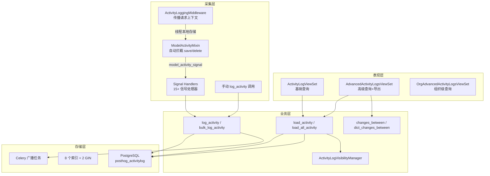
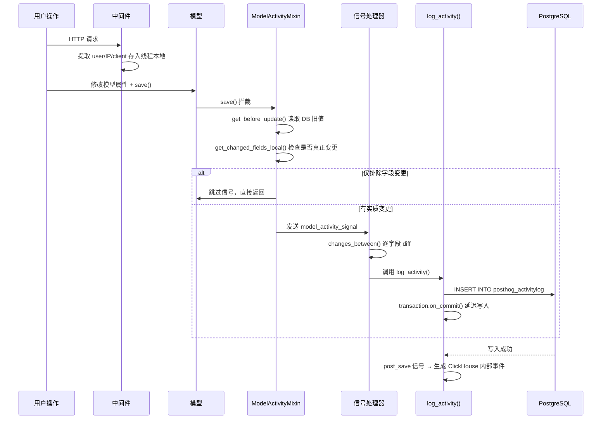

# 技术调研：PostHog Activity Log 实现分析

**日期**: 2026-06-26
**源码位置**: `~/go-project/posthog-master/`
**核心代码**: `posthog/models/activity_logging/`

---

## 一、背景

PostHog 是一个开源的产品分析平台（类似 Amplitude + Hotjar + LaunchDarkly），使用 Python/Django + PostgreSQL + ClickHouse 构建。截至 2026 年，其代码库约 2000+ 文件，服务数千个团队。

Activity Log 是 PostHog 的企业级审计功能，属于 **Premium Feature**（需要 `AUDIT_LOGS` 附加功能订阅）。它于 2022 年 3 月引入（migration 0221），经过 3 年演变成覆盖 60+ 实体类型、10 种操作类型的成熟审计系统。

目标用户场景：
- **项目管理员**：追溯谁在什么时候改了哪个 Feature Flag
- **组织管理员**：查看组织内所有成员的活动
- **合规审计**：谁访问了什么数据？谁修改了敏感配置？
- **调试排障**：这个 Experiment 什么时候上线的？配置怎么变的？

---

## 二、架构总览

### 2.1 分层架构



### 2.2 数据流



---

## 三、数据模型

### 3.1 表结构

**表名**: `posthog_activitylog`

| 字段 | 类型 | 约束 | 说明 |
|------|------|------|------|
| `id` | UUID | PK, default=UUIDT | 时间有序 UUID |
| `team_id` | PositiveInteger | nullable | 所属团队(项目) ID |
| `organization_id` | UUID | nullable | 所属组织 ID |
| `user_id` | UUID | FK→User, SET_NULL | 操作人 |
| `was_impersonated` | Boolean | nullable | 是否模拟操作 |
| `is_system` | Boolean | nullable | 是否系统自动 |
| `client` | VARCHAR(32) | nullable | `x-posthog-client` 请求头 |
| `ip_address` | INET | nullable | 客户端 IP |
| `activity` | VARCHAR(79) | NOT NULL | 操作类型 |
| `scope` | VARCHAR(79) | NOT NULL | 实体类型 |
| `item_id` | VARCHAR(72) | nullable | 实体 ID |
| `detail` | JSONB | nullable | 变更详情 |
| `created_at` | TIMESTAMPTZ | default=now() | 记录时间 |

**约束**: `CHECK(team_id IS NOT NULL OR organization_id IS NOT NULL)` — 每行必须属于团队或组织。

### 3.2 操作类型（activity 字段）

PostHog 定义了 10 种操作类型，存储在 `ChangeAction` Literal：

```python
ChangeAction = Literal[
    "changed",      # 修改
    "created",      # 创建
    "deleted",      # 删除
    "merged",       # 合并
    "split",        # 拆分
    "exported",     # 导出
    "revoked",      # 撤销
    "logged_in",    # 登录
    "logged_out",   # 登出
    "copied",       # 复制
]
```

### 3.3 实体类型（scope 字段）

60+ 种实体类型，使用 CharField 自由文本存储（应用层验证）：

```
Cohort, FeatureFlag, Person, Group, Insight, Dashboard, Experiment,
Survey, Notebook, HogFunction, Plugin, Organization, Team, User,
Annotation, Tag, BatchExport, Integration, Subscription, Role, ...
```

### 3.4 Detail 结构（JSONB）

这是最核心的设计决策——用结构化的 `Change` 对象表示字段级变更，而不是存原始 before/after JSON：

```json
{
    "name": "用户信息页面",
    "changes": [
        {
            "field": "name",
            "action": "changed",
            "before": "旧名称",
            "after": "新名称"
        },
        {
            "field": "description",
            "action": "changed",
            "before": "旧描述",
            "after": "新描述"
        }
    ],
    "type": "internal_dashboard"
}
```

**Detail 所有可选字段**:

| 字段 | 类型 | 说明 |
|------|------|------|
| `name` | string | 资源的展示名称 |
| `short_id` | string | 短 ID（如 Insight 的 short_id） |
| `type` | string | 子类型鉴别器（如 "holdout", "shared_metric"） |
| `changes` | Change[] | 字段级变更列表 |
| `trigger` | {job_type, job_id, payload} | 定时任务触发的事件 |
| `context` | object | 领域特定扩展上下文 |

**Change 结构**:

| 字段 | 类型 | 说明 |
|------|------|------|
| `type` | string | 所属 scope |
| `action` | string | changed/created/deleted |
| `field` | string | 变更的字段名 |
| `before` | any | 旧值（敏感字段为 "masked"） |
| `after` | any | 新值（敏感字段为 "masked"） |

### 3.5 索引设计

PostHog 为 activity_log 表设计了 **8 个索引**，涵盖不同的查询模式：

```sql
-- 1. 基础查找：按实体查询操作记录
CREATE INDEX idx_alog_team_scope_item
    ON posthog_activitylog(team_id, scope, item_id);

-- 2. 组织级最近活动（仅在有 detail 时）
CREATE INDEX idx_alog_org_scope_created_at
    ON posthog_activitylog(organization_id, scope, created_at DESC)
    WHERE detail IS NOT NULL AND jsonb_typeof(detail) = 'object';

-- 3. 组织级 detail 过滤
CREATE INDEX idx_alog_org_detail_exists
    ON posthog_activitylog(organization_id)
    WHERE detail IS NOT NULL AND jsonb_typeof(detail) = 'object';

-- 4. detail JSONB 全文搜索（GIN）
CREATE INDEX CONCURRENTLY activitylog_detail_gin
    ON posthog_activitylog USING gin(detail jsonb_ops);

-- 5. detail 路径查询优化（GIN）
CREATE INDEX CONCURRENTLY idx_alog_detail_gin_path_ops
    ON posthog_activitylog USING gin(detail jsonb_path_ops)
    WHERE detail IS NOT NULL;

-- 6. 用户常用查询（过滤掉系统/模拟条目，减小索引体积）
CREATE INDEX idx_alog_team_act_scope_usr
    ON posthog_activitylog(team_id, activity, scope, user_id)
    WHERE was_impersonated = false AND is_system = false;

-- 7. 团队级最近活动
CREATE INDEX idx_alog_team_scope_created
    ON posthog_activitylog(team_id, scope, created_at DESC)
    WHERE was_impersonated = false AND is_system = false;

-- 8. 团队+活动类型过滤
CREATE INDEX idx_alog_team_scp_act_crtd
    ON posthog_activitylog(team_id, scope, activity, created_at DESC)
    WHERE was_impersonated = false AND is_system = false;
```

**索引设计要点**:
- **部分索引**是核心优化手段——排除系统/模拟条目的索引体积更小
- **GIN 索引**用于 JSONB 内容搜索，`jsonb_path_ops` 比 `jsonb_ops` 快但只支持 `@>` 操作符
- **CONCURRENTLY 创建**避免锁表
- **覆盖了所有常见查询模式**：按团队、按组织、按实体、按操作人、按时间

---

## 四、变更检测机制

### 4.1 changes_between() — 核心 diff 引擎

PostHog 的变更检测不是让调用方自己算 diff，而是由框架自动比较模型的前后状态：

```python
def changes_between(
    model_type: AuditableScope,      # 实体类型，如 "FeatureFlag"
    previous: Optional[models.Model], # 修改前的模型实例
    current: Optional[models.Model],  # 修改后的模型实例
) -> list[Change]:                    # 返回字段级变更列表
```

**算法**:
1. 合并排除字段列表：`field_exclusions[scope] + common_field_exclusions`
2. 对每个非排除字段，比较 before/after 值
3. 针对不同情况生成 `Change`：
   - before=None, after=值 → `{action: "created", after: 值}`
   - before=值, after=None → `{action: "deleted", before: 值}`
   - before≠after → `{action: "changed", before, after}`
4. 处理特殊字段映射（如 `dashboard_tiles` → `dashboards`）
5. 对敏感字段替换值为 `"masked"`

### 4.2 排除字段体系（三层）

PostHog 用三层排除机制精细控制什么需要记录：

**第一层：通用排除字段**（所有场景跳过）

```python
common_field_exclusions = [
    "id", "uuid", "short_id", "created_at", "created_by",
    "last_modified_at", "last_modified_by", "updated_at",
    "updated_by", "team", "team_id",
]
```

**第二层：按实体类型排除字段**（不参与 diff，不记录变化）

覆盖 28 个实体类型，例如：
- **Experiment**: `feature_flag`, `exposure_cohort`, `holdout`, `saved_metrics`
- **Insight**: `filters_hash`, `refreshing`, `result`, `last_refresh`（20 个字段）
- **Person**: `distinct_ids`, `properties_last_updated_at`, `version`
- **FeatureFlag**: `experiment`, `usage_dashboard`, `flag_evaluation_contexts`

**第三层：信号排除字段**（仅这些字段变更时完全跳过记录）

```python
signal_exclusions = {
    "Dashboard": ["last_accessed_at"],               # 仅访问不记录
    "AlertConfiguration": ["last_checked_at", ...],   # 监控轮询不记录
    "User": ["last_login", "date_joined", ...],       # 自动字段不记录
    "PersonalAPIKey": ["last_used_at"],               # 使用时间不记录
    "SignalScoutConfig": ["last_run_at"],             # 每 15 分钟轮询不记录
}
```

### 4.3 敏感字段掩盖

在变更记录中，敏感字段的值被替换为字符串 `"masked"`：

```python
field_with_masked_contents = {
    "HogFunction": ["encrypted_inputs"],
    "Integration": ["config", "sensitive_config"],
    "BatchImport": ["import_config"],
    "User": ["email", "password", "temporary_token"],
    "OrganizationDomain": ["scim_bearer_token", "saml_x509_cert"],
    # ...
}
```

### 4.4 字段名显示优化

后台字段名 → 前端展示名称的映射：

```python
field_name_overrides = {
    "Organization": {
        "name": "organization name",
        "enforce_2fa": "two-factor authentication requirement",
        "members_can_invite": "member invitation permissions",
    },
    "BatchExport": {
        "paused": "enabled",  # 注意：语义反转
    },
}
```

---

## 五、采集集成方式

PostHog 的“自动记录 / 非侵入式”不是数据库层自动审计，而是建立在 **Django 框架能力** 之上的应用层自动化。

准确说，它使用 **4 层互补机制**，覆盖 **5 类事件来源**：

| 层/来源 | 是否产生事件 | 依赖的 Django 能力 | 作用 |
|---------|--------------|--------------------|------|
| `ModelActivityMixin` | 是 | Django ORM Model 可继承抽象 Mixin，重写 `save()` / `delete()` | 标准模型 CRUD 自动采集 |
| PostHog 自定义 Signal Handlers | 是 | Django Signal / 自定义 signal | 把模型变化翻译成 ActivityLog |
| Django 内置信号 | 是 | `user_logged_in` / `user_logged_out` / `pre_delete` 等框架信号 | 捕获登录、登出、删除等框架生命周期事件 |
| `ActivityLoggingMiddleware` | 否 | Django Middleware 请求生命周期 | 传播 user / IP / client / impersonation 上下文 |
| 手动 `log_activity()` | 是 | 普通应用层函数调用，可结合 Django transaction | 覆盖复杂业务动作和非 CRUD 语义 |

这个设计的“非侵入式”含义需要拆开理解：

- **不是零接入**：模型必须显式继承 `ModelActivityMixin`，handler 也要注册。
- **不是数据库自动审计**：只有经过 Django ORM / 应用层路径的写入才会被这套机制理解；原始 SQL、绕过 ORM 的批量更新、后台脚本如果不走相同路径，就不会天然获得同样语义。
- **对业务 service 低侵入**：简单 CRUD 不需要每个 service 手写 `log_activity()`，因为 Mixin + Signal 会自动补齐大部分模型变更记录。
- **复杂业务仍显式记录**：状态流转、复制、导出、撤销等非 CRUD 动作仍需要手动调用或专门 handler 表达业务语义。

### 5.0 Django 相关能力说明

与 Activity Log 相关的 Django 能力主要有四类：

1. **ORM Model 生命周期**
   Django 模型的 `save()` / `delete()` 是应用层持久化入口。`ModelActivityMixin` 作为抽象 Mixin 重写这些方法，在真正写库前后读取旧值、新值，并发送 activity signal。这使 PostHog 能在“不改每个业务 service”的情况下覆盖一批标准模型。

2. **Signal 机制**
   Django Signal 是进程内发布-订阅机制。PostHog 一方面定义自己的 `model_activity_signal`，另一方面接入 Django 内置信号（如登录/登出/pre_delete）。需要注意：Django signal 默认不是消息队列异步，也不是数据库 trigger；它是应用进程内的回调机制，优点是解耦，缺点是仍然依赖应用层写入路径。

3. **Middleware 请求上下文**
   Django Middleware 包裹整个 HTTP 请求生命周期。PostHog 在请求进入时读取当前用户、IP、client、是否 impersonation，并放入 `asgiref.local.Local`。后续 Mixin / Signal Handler / `log_activity()` 可以从本地上下文读取操作者信息，而不需要每层函数显式传参。

4. **事务提交钩子**
   Django 提供 `transaction.on_commit()`，允许在数据库事务成功提交后执行回调。PostHog 用它避免“业务事务回滚了但活动日志已经写出”的不一致风险。它解决的是事务时机问题，不改变采集仍发生在应用层这一事实。

### 5.1 ModelActivityMixin（自动采集，覆盖面最广）

一个 Django 抽象模型 Mixin，自动拦截 `save()` 和 `delete()`：

```python
class ModelActivityMixin(models.Model):
    activity_logging_on_delete = False  # 类属性控制是否记录删除

    def save(self, *args, **kwargs):
        change_type = "created" if self._state.adding else "updated"
        before_update = None

        if change_type == "updated":
            should_log, before_update = self._should_log_activity_for_update()
            if not should_log:
                return super().save(*args, **kwargs)  # 跳过信号直接保存

        super().save(*args, **kwargs)  # 先保存

        if before_update is not None or change_type == "created":
            model_activity_signal.send(
                sender=self.__class__,
                scope=self.__class__.__name__,
                activity=change_type,
                before_update=before_update,
                after_update=self,
                user=get_current_user(),
                was_impersonated=get_was_impersonated(),
            )

    def delete(self, *args, **kwargs):
        if self.activity_logging_on_delete:
            model_activity_signal.send(
                sender=self.__class__,
                scope=self.__class__.__name__,
                activity="deleted",
                before_update=self._get_before_update(),
                after_update=None,
                ...
            )
        super().delete(*args, **kwargs)
```

**使用该 Mixin 的模型**: Organization, OrganizationMembership, OrganizationDomain, OrganizationInvite, User, PersonalAPIKey, Tag, TaggedItem, OAuthApplication, ProjectSecretAPIKey（10 个模型）

### 5.2 Signal Handlers（15+ 信号处理器）

通过 Django Signal 机制，在模型保存/删除后解耦处理活动日志：

```
model_activity_signal 处理器:
  User                → 记录到用户所属的每个组织
  OrganizationDomain  → 记录域名变更
  ExperimentSavedMetric → 记录实验保存指标
  ExperimentHoldout   → 记录实验 Holdout
  OAuthApplication    → 记录 OAuth 应用范围变更
  Tag / TaggedItem    → 记录标签变更
  Organization        → 记录组织信息变更
  OrganizationMembership → 记录成员级别变更
  OrganizationInvite  → 记录邀请变更
  PersonalAPIKey      → 记录 API Key 变更

Django 内置信号处理器:
  user_logged_in      → 记录登录事件
  user_logged_out     → 记录登出事件
  pre_delete          → 记录删除事件（4 个模型）
```

### 5.3 请求上下文中间件（传播用户/IP/客户端信息）

```python
class ActivityLoggingMiddleware:
    def __call__(self, request):
        if request.user.is_authenticated:
            activity_storage.set_user(request.user)
            activity_storage.set_was_impersonated(
                is_impersonated_session(request)
            )
        activity_storage.set_client(
            request.headers.get("x-posthog-client", "")[:32]
        )
        activity_storage.set_ip_address(get_ip_address(request))
        try:
            response = self.get_response(request)
        finally:
            activity_storage.clear_all()  # 防止信息泄漏
```

使用 `asgiref.local.Local`（线程/协程安全本地存储），在整个请求生命周期内携带用户上下文，信号处理器和 Mixin 从中读取。

这层本身**不产生 ActivityLog**，它只是给自动采集和手动调用提供归因上下文。没有这层，Mixin 仍能知道“哪个模型变了”，但很难稳定知道“是谁、从哪个客户端、是否 impersonation”。

### 5.4 手动调用（覆盖复杂场景）

对于 Mixin 无法覆盖的复杂场景，直接调用 `log_activity()`：

```python
log_activity(
    organization_id=org_id,
    team_id=team_id,
    user=user,
    item_id=feature_flag.id,
    scope="FeatureFlag",
    activity="status_changed",  # 非 CRUD 操作
    detail=Detail(
        name=feature_flag.key,
        changes=[
            Change(field="status", action="changed",
                   before="DRAFT", after="RUNNING")
        ]
    ),
    was_impersonated=False,
)
```

### 5.5 这套机制对 Wave 的启发

PostHog 值得 Wave 借鉴的是**分层思想**，不是 Django 具体实现：

| PostHog | Wave 可借鉴形态 | 不建议照搬 |
|---------|----------------|------------|
| Middleware + Local | `activity.WithActivityContext` / Web middleware，从 ctx 统一解析 operator/source/correlation | 让每个调用方自由传 operator/source |
| ModelActivityMixin | 显式 CRUD helper / 接入模板，减少 Chart/Dashboard 这类简单对象重复代码 | GORM hook 自动写业务活动日志 |
| Signal Handlers | 业务模块 projector / adapter，把 DAO struct 投影为 `OldProjection/NewProjection/MaskRules` | 隐式 signal 链路，让业务动作来源难追踪 |
| 手动 `log_activity()` | `ActivityService.WriteLog/BatchWriteLog`，AB/Metric/Token 等复杂场景显式调用 | 试图从 DB 行变化反推 `online/release/copy` |

因此，Wave 如果要吸收 PostHog 经验，推荐表述为：

> 使用 Context + ActivityService + CRUD Helper + Domain Projector 的应用层采集模型；简单 CRUD 尽量模板化，复杂业务动作必须显式写入。

---

## 六、API 与查询

### 6.1 三个 API 端点

| 端点 | 路径 | 功能 | 付费 |
|------|------|------|------|
| 基础 | `GET /api/projects/<id>/activity_log` | 简单分页查询 | ✅ 需要 AUDIT_LOGS |
| 高级 | `GET /api/projects/<id>/advanced_activity_logs` | 丰富过滤+导出 | ✅ 需要 AUDIT_LOGS |
| 组织级 | `GET /api/organizations/<org_id>/advanced_activity_logs` | 组织级查询（管理员） | ✅ 需要 AUDIT_LOGS |

### 6.2 高级过滤参数

| 参数 | 类型 | 说明 |
|------|------|------|
| `start_date` / `end_date` | ISO8601 | 时间范围过滤 |
| `users` | UUID[] | 按操作人过滤 |
| `scopes` | String[] | 按实体类型过滤 |
| `activities` | String[] | 按操作类型过滤 |
| `item_ids` | String[] | 按资源 ID 过滤 |
| `search_text` | String | detail 字段全文搜索 |
| `detail_filters` | JSON | 按 detail 内部字段过滤 |
| `was_impersonated` | Boolean | 是否模拟操作 |
| `is_system` | Boolean | 是否系统自动 |
| `clients` | String[] | 按客户端过滤 |
| `ip_addresses` | String[] | 按 IP 过滤（支持通配符 `203.0.113.*`）|
| `page` / `page_size` | Int | 分页（默认 100，最大 1000）|

### 6.3 分页策略

双模式分页：
- **Cursor Pagination**（默认）：基于 `-created_at` 游标，避免 OFFSET 性能问题
- **PageNumber Pagination**（当提供 `?page=` 时）：传统分页

### 6.4 可见性限制

非员工用户无法看到以下内容：
- 用户的登录/登出事件（除非是模拟操作）
- 用户资料创建/更新
- SCIM 用户/角色操作
- 实例设置变更

---

## 七、数据规模与性能设计

### 7.1 数据规模估计

PostHog 的 Activity Log 是**全量记录、无过期策略**的设计。基于其用户规模和功能定位，合理估计：

| 规模级别 | 日新增 | 月新增 | 年累计 | 说明 |
|---------|--------|--------|--------|------|
| 小型团队 | ~100 条 | ~3K | ~36K | 几个操作人员，少量资产操作 |
| 中型组织 | ~1K 条 | ~30K | ~365K | 10-50 人团队 |
| 大型组织 | ~10K 条 | ~300K | ~3.6M | 50-200 人，频繁操作 |
| **超大规模** | ~100K 条 | ~3M | ~36M | 数百人+自动化操作 |

### 7.2 性能保障措施

| 措施 | 说明 |
|------|------|
| **部分索引** | 排除 was_impersonated/is_system 的索引体积更小，查询更快 |
| **GIN 索引** | JSONB 全文搜索 + 路径查询优化 |
| **CONCURRENTLY 创建** | 索引创建不锁表，可在线执行 |
| **Cursor 分页** | 避免 OFFSET 性能悬崖 |
| **信号排除** | 噪音字段变更不触发记录（如 last_accessed_at）|
| **mute_selected_signals** | 批量操作时全局静音信号 |
| **bulk_create** | 批量写入，默认 500 条一批 |
| **transaction.on_commit** | 主事务提交后才写审计，不影响业务 |
| **计费回溯限制** | 免费版只能查最近 2 个月数据 |
| **字段发现采样** | 10% TABLESAMPLE + Redis 缓存（12h TTL）|
| **Redshift 字段缓存** | 大组织避免全表扫描 `detail` 列 |

### 7.3 潜在风险

| 风险 | 说明 |
|------|------|
| **无数据保留策略** | 表无限增长，无归档/清理机制。大组织 3 年可能积累亿级数据 |
| **无分区** | 单表未分区，数据量极大时索引维护和 VACUUM 压力大 |
| **信号风暴** | 批量操作（如导入 1 万个用户）可能产生大量 activity log |
| **JSONB 膨胀** | detail 列长期存储，无压缩策略 |
| **TABLESAMPLE 局限** | PostgreSQL SYSTEM 采样不是真正的随机采样 |

### 7.4 ClickHouse 集成（仅用于事件广播，不用于查询）

PostHog 的双写机制：
1. 主写 PostgreSQL → 所有查询走 PG
2. 异步写 ClickHouse → 生成 `$activity_log_entry_created` 内部事件

ClickHouse 仅用于**实时事件广播**（如前端实时通知），不是查询存储。PG 故障时 ClickHouse 写入失败会被静默吞掉。

---

## 八、模式演变（3 年迁移历史）

| 迁移 | 日期 | 变更内容 |
|------|------|---------|
| 0221 | 2022-03 | 初始创建：id(UUID), team_id, org_id, user, activity, scope, item_id, detail, created_at |
| 0266 | 2022-09 | +is_system（区分系统操作） |
| 0384 | 2024-01 | +was_impersonated（模拟操作标记） |
| 0848 | 2025-09 | +detail GIN 索引（jsonb_ops, CONCURRENTLY） |
| 0850 | 2025-09 | +组织级索引（organization_id, scope, -created_at） |
| 0854 | 2025-09 | +detail GIN path_ops 索引 |
| 0868 | 2025-10 | 数据迁移：`scope='recording'` → `scope='Replay'` |
| 0874 | 2025-10 | 优化组织级索引为部分索引 |
| 0875 | 2025-10 | +团队级部分索引（WHERE NOT impersonated AND NOT system） |
| 0900 | 2025-10 | Team 表 +receive_org_level_activity_logs |
| 1101 | 近期 | +client（请求头捕获） |
| 1186 | 近期 | +ip_address（IP 记录） |

**关键观察**：索引是在功能上线 3 年后才逐步完善的。早期仅有一个基础索引，到 2025 年才根据实际查询模式补全了 7 个高性能部分索引。

---

## 九、核心设计决策总结

### 9.1 PostHog 做对了什么

| 决策 | 理由 |
|------|------|
| **结构化 changes 而非原始 snapshot** | 每条变更精确到字段级 before/after，查询时能回答"name 字段改了什么"，存储大小仅为 full snapshot 的 1/N |
| **三层排除体系** | 通用排除 + 按类型排除 + 信号排除，精细控制系统不记录噪音 |
| **部分索引** | 排除系统/模拟条目的部分索引体积减少 50%+ |
| **写入异步化** | transaction.on_commit 延迟写入，审计故障不影响业务流程 |
| **请求上下文中间件** | 自动传播 user/IP/client，调用方不需要手动传参 |
| **双通道采集** | Mixin 自动覆盖 + 手动调用覆盖，各有适用场景 |
| **付费功能门禁** | 审计功能需要 AUDIT_LOGS 订阅，控制市场规模 |

### 9.2 PostHog 的不足

| 不足 | 影响 |
|------|------|
| **无数据保留策略** | 表无限增长，长期运维成本高 |
| **无分区设计** | 历史数据无法高效清理 |
| **信号风暴风险** | 批量操作时没有限流机制 |
| **敏感字段掩盖不够细** | 全量替换为 "masked"，丢失"哪些字段被改过"的信息 |

### 9.3 对我们的启示

| 维度 | PostHog 方案 | 对我们的借鉴 |
|------|-------------|------------|
| **Detail schema** | `changes: [{field, action, before, after}]` | ✅ 直接采用 |
| **排除字段** | 三层排除体系 | ✅ 必须实现，否则被 `last_accessed_at` 这类噪音淹没 |
| **敏感字段掩盖** | 替换值为 "masked" | ✅ 安全审计刚需 |
| **自动 diff** | `changes_between()` 比较模型实例 | ✅ GORM 版本可实现 |
| **请求上下文** | 中间件传播 user/IP | ✅ 已有 `pvctx.Aid()` 可复用 |
| **写入容错** | `transaction.on_commit` 延迟 | ✅ `LogWithFallback` 模式已在 OP Audit 验证 |
| **批量写入** | `bulk_create` + `batch_size` | ✅ 批量删除场景必须 |
| **索引设计** | 部分索引 + GIN + 覆盖查询模式 | ⚠️ 按 Wave 实际查询模式设计 |
| **数据规模** | 无过期策略，单表无限增长 | ⚠️ **需要设计保留策略**，用户已强调规模问题 |
| **分页** | Cursor + PageNumber 双模式 | ✅ 已有分页方案可复用 |

---

## 十、关键文件索引

```
posthog/models/activity_logging/
├── __init__.py
├── activity_log.py          # 核心：模型、dataclass、log_activity、changes_between
├── model_activity.py        # ModelActivityMixin 自动采集
├── signal_handlers.py       # 15+ 信号处理器
├── utils.py                 # 线程本地存储、可见性管理、变更检测工具
├── serializers.py           # API 序列化器
├── activity_page.py         # 分页响应辅助
├── batch_export_utils.py    # BatchExport 活动名辅助
├── external_data_utils.py   # ExternalDataSource 活动名辅助
├── personal_api_key_utils.py # API Key 范围变更记录
├── project_secret_api_key_utils.py
├── tag_utils.py             # 标签相关对象信息解析
└── notification_viewed.py   # 未读通知模型

posthog/middleware.py                           # ActivityLoggingMiddleware
posthog/models/signals.py                       # model_activity_signal + mutable_receiver
posthog/models/utils.py                         # ActivityDetailEncoder (JSON 编码器)
posthog/api/advanced_activity_logs/
├── viewset.py              # 3 个 API 端点
├── filters.py              # 高级过滤逻辑
├── utils.py                # 计费回溯限制
├── constants.py            # 常量定义
├── field_discovery.py      # 字段发现（TABLESAMPLE 采样）
└── fields_cache.py         # Redis 字段缓存
posthog/tasks/activity_log.py                   # Celery 广播任务
```

---

## 十一、附录：典型 ActivityLog 行示例

### Feature Flag 创建

```json
{
    "id": "018b0a1e-2b76-0000-0000-000000000001",
    "team_id": 123,
    "user_id": "abc-123",
    "activity": "created",
    "scope": "FeatureFlag",
    "item_id": "456",
    "detail": {
        "name": "new-homepage-v2",
        "changes": [
            {
                "field": "key",
                "action": "created",
                "after": "new-homepage-v2"
            },
            {
                "field": "name",
                "action": "created",
                "after": "New Homepage Experiment"
            },
            {
                "field": "active",
                "action": "created",
                "after": false
            }
        ]
    },
    "created_at": "2024-01-15T10:30:00Z"
}
```

### Feature Flag 上线（状态变更，非 CRUD）

```json
{
    "team_id": 123,
    "user_id": "abc-123",
    "activity": "changed",
    "scope": "FeatureFlag",
    "item_id": "456",
    "detail": {
        "name": "new-homepage-v2",
        "changes": [
            {
                "field": "active",
                "action": "changed",
                "before": false,
                "after": true
            }
        ]
    }
}
```

### 用户登录事件

```json
{
    "organization_id": "org-001",
    "user_id": "abc-123",
    "activity": "logged_in",
    "scope": "User",
    "item_id": "abc-123",
    "detail": {
        "context": {
            "login_method": "Google",
            "ip_address": "203.0.113.42",
            "reauth": false
        }
    }
}
```
