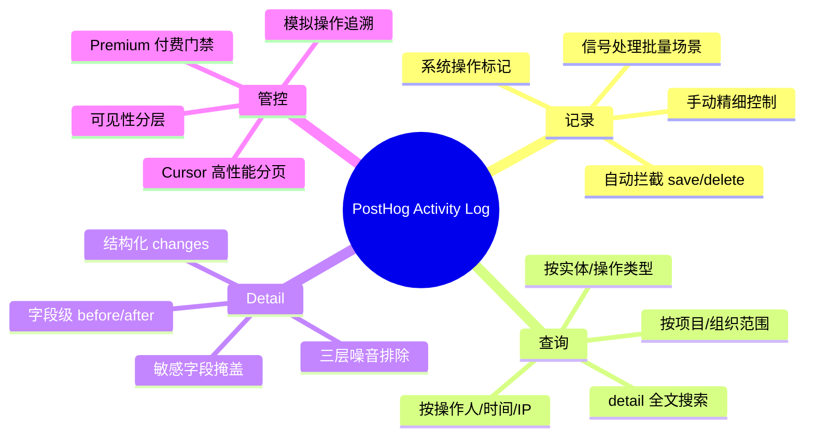
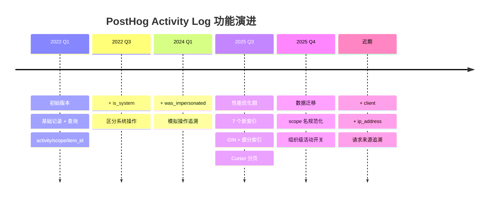

# 逆向 PRD：PostHog Activity Log 需求分析

**用途**: 从需求角度理解 PostHog 审计日志"为什么这样设计"，辅助 Wave 需求决策
**分析方法**: 从 PostHog 的**技术实现**逆向推导其背后的**用户需求**和**产品逻辑**

---

## 一、能力全景图



---

## 二、Use Case 全景

### UC-01：谁在什么时候做了什么 (P0)

**用户故事**:

> 作为项目管理员，我想查看项目内所有成员的操作记录，了解"谁在什么时候做了什么"，以便在出现问题时追溯责任。

**PostHog 怎么满足的**:

| 需求 | PostHog 实现 |
|------|-------------|
| 知道谁操作的 | `user_id` + 中间件自动传播用户上下文 |
| 知道什么时候 | `created_at` + 时间有序 UUID（天然按时间排序）|
| 知道做了什么 | `activity`（操作类型）+ `scope`（实体类型）+ `item_id`（实体 ID）|
| 只看某个范围 | 三个 API 端点覆盖 project / organization 层级 |

**背后的产品逻辑**:
- 这是审计功能最基础的 use case。PostHog 把它做成了**基础设施**而不是某个页面的附属功能，所以通过中间件自动传播上下文，避免每个模块重复传入 `user_id`。这也是为什么 `user_id` 用 FK 但 SET_NULL——即使删了用户，审计记录不能丢。

---

### UC-02：精确追溯字段级变更 (P0)

**用户故事**:

> 作为 Feature Flag 管理员，当线上出现问题时，我想精确知道"这个 Flag 的 `rollout_percentage` 从 50% 改成了 100%，是谁改的、什么时候改的"，而不是看到一个模糊的"配置已更新"。

**PostHog 怎么满足的**:

| 需求 | PostHog 实现 |
|------|-------------|
| 区分不同字段的变更 | `changes[].field` 记录每个变更字段 |
| 知道改前改后值 | `changes[].before` + `changes[].after` |
| 知道哪些是新字段 | `action: "created"`（before 为 null）|
| 知道哪些字段被删了 | `action: "deleted"`（after 为 null）|
| 知道是什么类型的变更 | `activity: "changed" / "created" / "deleted"` |

**detail 示例**:
```json
{
  "name": "rollout-test",
  "changes": [
    {
      "field": "rollout_percentage",
      "action": "changed",
      "before": 50,
      "after": 100
    }
  ]
}
```

**背后的产品逻辑**:
- PostHog **放弃**了存原始 before/after JSON snapshot 的方案，选择了结构化的 changes 列表。
- **为什么**：假设一个 Dashboard 有 20 个字段，用户只改了 1 个字段的 name。存全量 snapshot 浪费 95% 的存储，且查询端无法直接回答"name 字段的变更历史"。结构化的 `changes` 用 1/N 的存储成本，支持精确查询。
- **代价**：需要 diff 引擎（`changes_between`），实现复杂度增加。

---

### UC-03：排除噪音，只看有效变更 (P0)

**用户故事**:

> 作为审计查询者，我不想看到 `last_accessed_at`、`updated_at` 这类系统字段的变更记录。这些字段每访问一次就变一次，会淹没真正有意义的变更。

**PostHog 怎么满足的**：

三层排除：

| 层级 | 排除内容 | 示例 | 作用 |
|------|---------|------|------|
| 通用排除 | 所有实体都跳过的字段 | `id`, `created_at`, `updated_at`, `created_by` | 避免系统字段浪费存储 |
| 按类型排除 | 特定实体不参与 diff 的字段 | Insight 的 `result`、Experiment 的 `exposure_cohort` | 避免关联/计算字段干扰 |
| 信号排除 | 仅这些字段变更时跳过整条记录 | Dashboard 的 `last_accessed_at`、User 的 `last_login` | 避免看一眼就产生一条日志 |

**背后的产品逻辑**:
- 如果没有排除体系，一个 Dashboard 被访问 1000 次，审计日志里就多 1000 条 `last_accessed_at` 变更记录。审计变成了白噪音。
- PostHog 用 3 年积累了这个排除列表（覆盖 28 个实体类型），说明排除体系需要**持续迭代**，不可能一蹴而就。

---

### UC-04：非 CRUD 操作记录 (P1)

**用户故事**:

> 作为 Experiment 管理员，当我把一个 Experiment 从 DRAFT 切换到 RUNNING，或者发布一个新版本，这不是"修改了一条记录"的语义，而是"状态变更"的语义。我想查询这类非 CRUD 操作。

**PostHog 怎么满足的**:

| 用户操作 | 记录的 activity | 说明 |
|---------|----------------|------|
| Feature Flag 上线 | `changed` | 本质是 `active: false → true` 的字段变更 |
| 用户登录 | `logged_in` | 非实体操作，走 Django 内置信号 |
| 用户登出 | `logged_out` | 同上 |
| 批量导入 | `exported` | 覆盖数据导入/导出场景 |
| 合并/拆分 | `merged` / `split` | 覆盖实体生命周期的高级操作 |
| 撤销 | `revoked` | 覆盖权限/凭证的管理操作 |

**背后的产品逻辑**:
- PostHog 的 `activity` 字段用了 10 种操作类型而非仅 3 种 CRUD，因为真实的域操作比 CRUD 丰富得多。
- 但有趣的是：PostHog **没有**单独的 `status_change` 类型——Feature Flag 上线被映射为字段级 `active: false → true` 的变更。说明他们的立场是"优先用字段级变更表达状态变化，实在表达不了才加新操作类型"。

---

### UC-05：敏感信息不暴露 (P1)

**用户故事**:

> 作为安全管理员，审计日志中如果记录了用户的密码明文、API Key、集成配置，那审计本身就成了安全漏洞。PostHog 必须确保敏感字段在审计日志中被掩盖。

**PostHog 怎么满足的**:

```python
field_with_masked_contents = {
    "HogFunction": ["encrypted_inputs"],
    "Integration": ["config", "sensitive_config"],
    "User": ["email", "password", "temporary_token"],
}
```

在 `changes_between()` 中，如果字段在敏感列表中，`before` 和 `after` 替换为字符串 `"masked"`。

**背后的产品逻辑**:
- 这个设计透露了一个重要判断：**审计的安全性比审计的完备性更重要**。宁可丢失敏感字段的变更值信息，也不能让敏感数据明文存储在审计表中。
- PostHog 的掩盖比较粗暴（全部替换为 "masked"），丢失了"哪些敏感字段被改过"的信息。更精细的做法可能是保留字段名但掩盖值。

---

### UC-06：审计不能影响业务 (P0)

**用户故事**:

> 作为系统，当 PostgreSQL 响应变慢或审计表写入失败时，核心业务流程（创建 Feature Flag、修改 Dashboard）不应该受到影响。审计是附加功能，不是关键路径。

**PostHog 怎么满足的**:

1. **`transaction.on_commit()`** → 主业务事务提交后才写审计。主事务回滚时不写审计，主事务成功但审计写入失败不影响业务。
2. **`bulk_create` + `batch_size=500`** → 批量操作也是异步收集后一次性写入。
3. **`mute_selected_signals`** → 批量导入时可以静音活动日志信号，避免信号风暴。
4. **ClickHouse 双写是尽力而为** → PG 正常就写 PG，ClickHouse 写入失败静默吞掉。

**背后的产品逻辑**:
- 这是一个**架构层面的决策**：审计日志和业务数据不在同一个事务中。这意味着审计记录可能是最终一致（而非强一致）的。PostHog 接受了这个权衡。
- **只有在 PostHog 把审计定位为 Premium Feature 的前提下才能这么做**——如果是合规强要求（如金融行业），可能需要更强的一致性保证。

---

### UC-07：海量数据下高效查询 (P0)

**用户故事**:

> 作为大型组织的管理员，我的项目下有数百万条操作记录。当我想查"上个月谁改了这个 Feature Flag"，查询响应不能超过几秒钟。

**PostHog 怎么满足的**:

| 手段 | 解决什么问题 |
|------|------------|
| 8 个索引 + 2 个 GIN | 覆盖所有常见查询模式 |
| 部分索引（排除 is_system / was_impersonated）| 缩小索引体积 50%+ |
| Cursor 分页 | 避免深分页的 OFFSET 性能悬崖 |
| GIN jsonb_path_ops | detail 内部字段搜索优化 |

**背后的产品逻辑**:
- 索引不是一开始就 8 个的。PostHog 最初只有 1 个索引，另外 7 个是在上线 3 年后根据**实际查询模式**逐步添加的。
- 这说明：**索引设计不要追求一步到位，但数据结构必须一开始就正确**。表结构决定了你能回答什么问题，索引只决定回答得快不快。
- 部分索引是 PostHog 最聪明的索引策略——不是所有行都进索引，只有"用户主动操作"（非系统、非模拟）才进核心索引，大幅压缩索引体积。

---

### UC-08：多层级可见性控制 (P1)

**用户故事**:

> 作为 PostHog 实例管理员，用户的登录/登出事件、SCIM 角色变更、用户资料更新等操作，属于敏感信息。普通项目成员不应该看到这些，只有组织管理员或员工才能查看。

**PostHog 怎么满足的**:

`ActivityLogVisibilityManager` — 可见性管理器，非员工用户无法看到：
- 用户的登录/登出事件（除非是模拟操作）
- 用户资料创建/更新
- SCIM 用户/角色操作
- 实例设置变更

**背后的产品逻辑**:
- 审计能力越强，越需要管控谁能看到什么。如果所有操作对所有成员可见，那"查看 CEO 的登录记录"就成了一个内部攻击面。
- PostHog 用 `was_impersonated` 和 `is_system` 两个标记字段 + 部分索引，实现了精细的可见性控制和性能优化的一体设计。

---

### UC-09：系统操作 vs 人工操作区分 (P2)

**用户故事**:

> 作为审计查询者，我想区分"这个变更是一个真实用户改的，还是系统自动触发的"。在查问题时我通常只关心人工操作，系统自动操作（如定时任务、自动化规则）应该能被我轻松过滤掉。

**PostHog 怎么满足的**:

两个标记字段：
- `is_system: bool` — 系统自动操作（定时任务、自动化规则）
- `was_impersonated: bool` — 模拟操作（管理员以他人身份执行）

配合部分索引，在常用查询中直接排除这两种条目。

**背后的产品逻辑**:
- 这两个字段是**上线后才加的**（分别在第 6 个月和第 22 个月），说明 PostHog 在初始设计时没有意识到区分系统/人工操作的重要性，是在实际使用中才发现的。
- 有了 `is_system` 标记，PostHog 才能做有意义的统计——"本周人工操作有多少条"、"系统自动化占比是多少"。

---

### UC-10：查询请求来源 (P2)

**用户故事**:

> 当安全审查时，我想知道某个敏感操作是来自 Web 前端、API 调用、还是某个第三方集成。这样我才能判断该操作是否异常。

**PostHog 怎么满足的**:

- `client: VARCHAR(32)` — 来自 `x-posthog-client` 请求头（如 `web`, `api`, `plugin-server`）
- `ip_address: INET` — 客户端 IP

这两个字段也是较晚才加上的（2025 年），属于"有了基础审计后自然进阶"的功能。

**背后的产品逻辑**:
- 这两个字段告诉了我们：**审计深度是逐步递进的**。先记录谁做了什么，再记录从哪里做的。一步到位做太细的审计，投入产出比不高。

---

### UC-11：审计是付费功能 (P0)

**用户故事**:

> 作为商业公司，PostHog 需要把审计日志作为 Premium 功能（需要 AUDIT_LOGS 订阅），只有付费用户才能使用 API 查询审计记录。免费用户的操作仍然被记录（PostHog 自身需要），只是不能查询。

**PostHog 怎么满足的**:

三个查询端点都检查 `request.user.organization.is_feature_available("AUDIT_LOGS")`。计费回溯限制：免费版只能查最近 2 个月数据。

**背后的产品逻辑**:
- 这个设计很聪明：**记录和查询是两个不同的门禁**。所有用户的操作都被记录——因为 PostHog 自己需要审计数据来做安全分析和排障。但查询的权限是付费功能。
- 对 Wave 的启示：如果 Wave 是商业化产品，可以考虑同样的分层——记录是基础设施（免费），高级查询/导出是付费能力。

---

## 三、功能需求与技术实现的映射

### 3.1 核心功能清单

| 功能 | PostHog 实现方式 | Use Case |
|------|-----------------|----------|
| 记录项目内任意实体的操作 | `ModelActivityMixin` + Signal + 手动调用 | UC-01, UC-04 |
| 精确到字段级的变更查询 | `changes_between()` + 结构化 `Change[]` | UC-02 |
| 自动排除噪音字段 | 三层排除体系（通用/按类型/信号级） | UC-03 |
| 敏感字段自动掩盖 | `field_with_masked_contents` → 替换为 "masked" | UC-05 |
| 审计不阻塞业务 | `transaction.on_commit()` + 异步写入 | UC-06 |
| 海量数据下快速查询 | 8 个索引 + Cursor 分页 + 部分索引 | UC-07 |
| 多层级可见性控制 | `ActivityLogVisibilityManager` | UC-08 |
| 区分系统/人工/模拟操作 | `is_system` + `was_impersonated` 标记字段 | UC-09 |
| 追溯请求来源 | `client` + `ip_address` | UC-10 |
| 付费功能门禁 | AUDIT_LOGS 订阅检查 | UC-11 |

### 3.2 PostHog 没有的功能（值得注意）

| 未实现 | 为什么不 | Wave 是否需要 |
|--------|---------|--------------|
| 数据保留/归档策略 | 3 年后仍未做，说明用户不太需要主动删除审计数据 | 如果 Wave 目标客户有合规需求，可考虑 |
| 表分区 | 单表亿级后性能下降，但多数客户未到那个规模 | 应参考，按 project_id 分区 |
| 审计日志通知/告警 | PostHog 通过 ClickHouse 广播事件，但未做"当 X 发生时通知我" | 可后续考虑 |
| 全文搜索引擎 | 直接用 PG GIN 索引，未引入 Elasticsearch | 当前够用 |

---

## 四、进化路线：PostHog 3 年的功能递进

从迁移历史可以还原 PostHog 的功能优先级：



**关键发现**:
1. **第一批做的**：表结构 + 基础记录/查询（data model 必须一开始就正确）
2. **第二批做的**：is_system（发现需要区分系统 vs 人工）
3. **第三批做的**：was_impersonated（企业客户提出模拟操作追溯需求）
4. **第四批做的**：性能优化（数据量大了才发现索引不够）
5. **最新做的**：client/ip_address（基础功能完善后的进阶审计）

---

## 五、对 Wave 的需求启示

### 5.1 直接复用的设计

| PostHog 设计 | Wave 做法 | 理由 |
|-------------|----------|------|
| 结构化 `changes: [{field, action, before, after}]` | 直接采用 | 存储效率 + 查询灵活性 |
| 三层排除体系 | 直接采用 | 否则被噪音淹没 |
| 敏感字段掩盖 | 直接采用 | 安全审计刚需 |
| 写入不阻塞业务 | 直接采用（已有 LogWithFallback） | OP Audit 已验证 |
| Cursor 分页 | 直接采用 | 大页数性能保障 |

### 5.2 差异化决策

| PostHog 做法 | Wave 是否跟随 | 理由 |
|-------------|-------------|------|
| 无限增长无保留策略 | **不跟随**，设计保留策略 | 用户已强调规模问题 |
| 单表无分区 | **不跟随**，按 project_id 分区 | 用户已强调规模问题 |
| 三种操作类型（changed/created/deleted）+ 扩展 | **可参考**，增加 status_change 等 Wave 特有类型 | 需要覆盖 AB 状态变更 |
| Mixin 自动拦截 save/delete | **不直接使用**，Wave 已有 AssetOperator 模式 | 应在 AssetOperator 中集成而非另起一套 |
| 60+ 种实体类型 | **不需要**，Wave 只有 6 种资产类型 | 范围明确，不需要 PostHog 级别的灵活性 |

### 5.3 值得先不做但保持扩展点的能力

| 能力 | 建议时机 | 扩展点 |
|------|---------|--------|
| 请求来源追溯（client/ip） | V2 | 表结构预留字段 |
| 组织级全局查询 | 有跨项目需求时 | 索引设计时预留 organization_id |
| 可见性分层控制 | 有非管理员使用审计时 | 查询层加 filter 即可 |
| 审计日志通知/告警 | 有自动化需求时 | 可走事件系统 |
