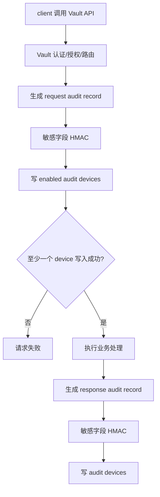

# Vault Audit Devices 案例研究

**产品**: HashiCorp Vault
**技术栈**: Go
**类型**: Secret 管理系统强安全审计
**与 Wave 相似度**: 中低
**一句话心智模型**: Vault 把 audit device 当作安全边界：每个 API request/response 都要被审计设备记录，敏感值默认 HMAC；如果所有审计设备不可用，请求可能失败。

**来源**:

- 官方文档: <https://developer.hashicorp.com/vault/docs/audit>
- 上游仓库: <https://github.com/hashicorp/vault>

---

## 1. 背景：Vault 为什么需要强审计

Vault 管理的是最高敏感等级的数据：

- token
- secret
- dynamic credential
- encryption key
- policy
- auth method

Vault 的审计不是普通产品功能，而是安全边界的一部分。它必须回答：

- 谁访问了哪个 secret path？
- 请求成功还是失败？
- 使用了什么 auth 信息？
- 返回了什么类型的结果？
- 能否在不泄露 secret 明文的前提下追踪同一个敏感值？
- 如果审计设备不可用，是否还允许请求继续？

这和 Wave 的 activity log 不是同一类问题。Wave 的默认目标是排障和责任链；Vault 的目标是安全取证和合规。

---

## 2. 为什么 Vault 这样设计

### 2.1 request/response 是审计核心

Vault 的资源语义主要体现在 path 和 operation 上，比如读写某个 secret path、创建 token、启用 auth method。相比业务对象表，API request/response 更接近安全审计需要的事实。

因此 Vault 记录的是 request 和 response，而不是某张业务 DB 表。

### 2.2 默认 HMAC，避免 secret 泄露

Vault 的审计日志必须“可追踪但不可泄密”。如果直接把 secret 写进 audit log，审计系统本身就会变成高危 secret 副本。

因此 Vault 默认对大多数字符串值做 HMAC-SHA256：

- 审计人员可以判断两个请求是否涉及同一个值。
- 不能从审计日志还原原始 secret。
- 一些非敏感字段可以保留明文，便于查询。

这比普通 mask 更强，但也更重。

### 2.3 audit device 可用性影响请求

Vault 支持多个 audit device。它的设计原则是：启用审计后，系统不能在完全无法审计的情况下继续处理敏感请求。

官方文档说明，如果所有 enabled audit devices 都无法写入，Vault 会拒绝相关请求。这个 fail-closed 语义很适合 secret 系统，但不适合 Wave 默认 activity log。

---

## 3. 具体设计

### 3.1 Audit Device

Vault audit device 是审计输出插件。常见类型：

| Device | 说明 | Wave 类比 |
|--------|------|-----------|
| file | 写本地文件 | 未来日志 sink |
| syslog | 写系统日志 | 未来 SIEM/syslog |
| socket | 写 socket | 未来外部审计管道 |

启用 audit device 后，Vault 会在请求路径中生成 audit record 并写入设备。

从实现心智模型看，Vault 的模块关系可以理解为：

| 层次 | 模块/概念 | 作用 |
|------|-----------|------|
| 入口层 | Vault API path | 所有高敏感请求都会经过这里 |
| 记录层 | request audit record / response audit record | 统一描述请求与响应 |
| 脱敏层 | HMAC / elision / header 规则 | 决定哪些值如何进入审计 |
| 输出层 | enabled audit devices | 真正持久化或发送审计数据 |
| 可用性层 | 至少一个 device 成功 | 决定请求能否继续 |

这说明 Vault 的审计不是“记录完再说”，而是**和请求生命周期硬绑定的安全管线**。

### 3.2 Audit Record 模型

Vault audit log 通常分 request 和 response 两类记录：

| 字段概念 | 说明 | Wave 类比 |
|----------|------|-----------|
| `type` | request / response | Wave V1 不区分 |
| `auth` | token、entity、policy 等认证上下文 | `operator` 的安全强化版 |
| `request.id` | 请求 ID | `correlation_id` |
| `request.operation` | read/write/update/delete/list 等 | `action_type` |
| `request.path` | Vault path | `item_type/item_id` 的路径化版本 |
| `request.remote_address` | 来源地址 | Wave V1 暂不记录 |
| `response` | 响应摘要 | Wave 不应全量记录 |
| `error` | 错误信息 | Wave V1 主要成功活动 |

Vault 的对象标识是 path，不是关系数据库的 item_id。这符合 secret 系统的领域模型。

### 3.3 敏感字段策略

Vault 的默认策略不是简单删除字段，而是 HMAC：

| 方案 | 优点 | 代价 |
|------|------|------|
| 明文 | 查询方便 | 泄密风险不可接受 |
| mask/drop | 安全 | 无法判断两个值是否相同 |
| HMAC | 可关联、不可还原 | 实现和密钥管理更复杂 |

对 Wave 来说，Account API Token 的处理可以借鉴 Vault 的原则，但不必照搬全局 HMAC 框架：

- raw token 永不进入 activity detail。
- password / secret / salt 永不进入。
- `token_hash` 默认也不进 detail。
- 如需排障，只记录 `token_hint` 或业务安全认可的不可逆线索。

### 3.4 为什么它没有审计表

Vault 不做业务数据库审计表，有两个根因：

1. 它的审计目标是安全取证，不是产品内列表查询
2. 它不希望把 secret access evidence 再强耦合到业务主存储

所以 Vault 的主设计问题永远是：

- device 是否可用
- 敏感值是否泄露
- request/response 证据链是否完整

而不是：

- 这张表怎么分页
- 这行记录怎么按对象回放

---

## 4. 写入流程

这条链路说明 Vault 把 audit 作为请求处理的一部分，而不是异步最好努力日志。

---

## 5. 查询与运维模型

Vault 不把 audit log 写入业务 DB 表。查询通常由设备落点决定：

- file 由日志采集器收走；
- syslog 进入安全日志系统；
- socket 可以接入专门审计服务；
- 保留期、权限、索引通常由外部日志平台或 SIEM 管理。

这和 Wave V1 的 PG 查询模型不同。Wave 如果只是内部排障，不应该先引入多 audit device 和外部日志管道。

---

## 6. 失败语义

Vault 的失败语义偏强安全：

| 场景 | Vault 倾向 | Wave V1 建议 |
|------|------------|--------------|
| audit device 全部不可用 | 拒绝请求 | 默认不应如此 |
| 某个 device 不可用但仍有 device 成功 | 允许继续 | 未来多 sink 可参考 |
| 敏感字段 | 默认 HMAC | drop/mask/hint 足够 |
| request/response | 审计核心 | Wave 不应全量记录 |

这提醒 Wave：不要把“审计日志”四个字一说出口就默认 fail-closed。失败策略必须跟产品风险等级绑定。

---

## 7. 对 Wave 的判断

### 7.1 最值得借鉴

- raw token/password/secret 永不落日志。
- 对敏感值可以考虑不可逆关联线索，而不是明文。
- 高风险操作可以选择 blocking，但必须由业务 owner 明确声明。
- 如果未来做外部审计 sink，可以参考 audit device 思路。

### 7.2 不应照搬

- 不应默认所有 activity log 失败都阻塞业务。
- 不应记录完整 request/response。
- 不应在 V1 引入多 audit device、HMAC 全字段框架和 fail-closed 安全边界。

### 7.3 设计结论

Vault 是强安全审计的典型案例。它能帮助 Wave 明确敏感字段和失败策略的上限，但它不是 Wave V1 activity log 的形态。Wave 需要的是业务活动表，而不是 secret 系统级 audit device。
