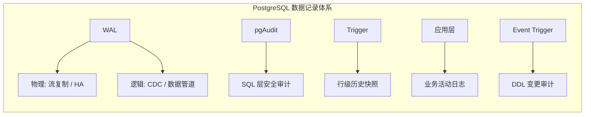
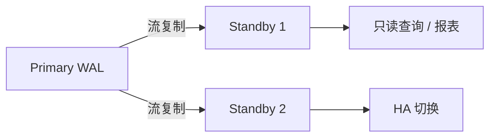
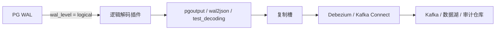
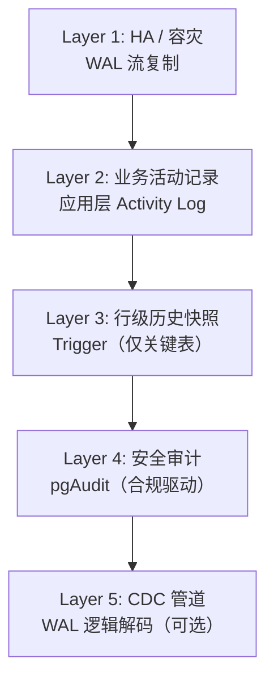
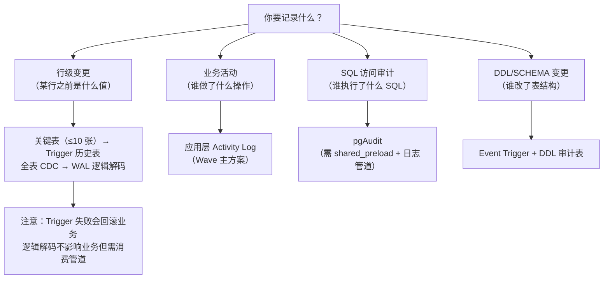
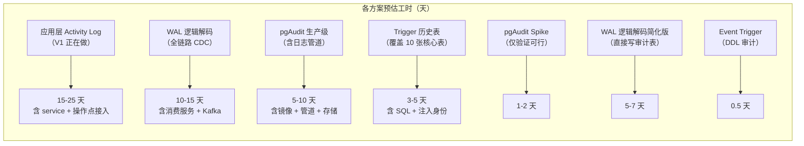

# PostgreSQL 数据记录机制全景

**日期**: 2026-07-02
**目的**: 梳理 PostgreSQL 生态中所有与"数据记录/留痕/审计"相关的机制，澄清常见混淆，为 Wave 技术选型提供全景参考。

> 如果你是从 MySQL 转到 PostgreSQL，建议先读 [§4：来自 MySQL 的映射指南](#4-来自-mysql-的映射指南)。

---

## 1. 一句话总结

PostgreSQL 采用**责任分离**（separation of concerns）的哲学——不存在一个机制能覆盖所有"记录"需求。每种机制解决一个特定问题，组合使用才构成完整体系。



| 机制 | 记录什么 | 典型用途 | 原生/扩展 |
|---|---|---|---|
| WAL 物理复制 | 数据页变更 | 高可用、容灾、只读副本 | 原生 |
| WAL 逻辑解码 | 行级 INSERT/UPDATE/DELETE | CDC、Kafka 同步、审计管道 | 原生（`pgoutput`） |
| pgAudit | SQL 语句、数据库对象访问 | 安全合规（SOC2/PCI-DSS/SOX） | 扩展 |
| Trigger + 历史表 | 行级 OLD/NEW 快照 | 关键表字段级追溯 | 原生 |
| Event Trigger | DDL 操作（CREATE/ALTER/DROP） | schema 变更审计 | 原生 |
| 应用层 Activity Log | 业务活动（含语义） | 用户可读的操作记录 | 应用代码 |

---

## 2. 各机制深度解析

### 2.1 WAL 物理复制（流复制）

**本质**：PostgreSQL 核心日志，记录数据页的物理变更。所有数据修改先写 WAL，再写数据文件。

**波使用法**：流复制（streaming replication）——主库 WAL 实时传输到备库，备库回放。



| 维度 | 说明 |
|---|---|
| **对 Wave 有价值吗** | ✅ 高可用已有，但不是"留痕"方案 |
| **能追溯历史吗** | ❌ 不能（WAL 持续被 checkpoint 清理） |
| **性能影响** | 极低（WAL 是 PG 必有组件，只是多传一份） |
| **配置** | `wal_level = replica`（默认） |

**结论**：HA 基础设施，不是"历史记录"方案。

---

### 2.2 WAL 逻辑解码（Logical Decoding / CDC）

**本质**：将 WAL 中的物理变更**解码**为逻辑事件（INSERT/UPDATE/DELETE + 行数据）。

**这是 PostgreSQL 对标 MySQL binlog row format 的机制。**



| 维度 | 说明 |
|---|---|
| **能看行历史吗** | ✅ 行级 OLD/NEW 值（需 `REPLICA IDENTITY FULL`） |
| **能知业务语义吗** | ❌ 只有行数据，不知道"为什么变" |
| **性能影响** | 低（5-10% WAL 开销，无应用层代码） |
| **配置** | `wal_level = logical`，需建复制槽 |
| **运维注意** | 消费者挂了会导致 WAL 堆积、磁盘爆满 |

**对 Wave 的价值评估：**

- 如果目标是"有一个管道把 PG 行变更同步到审计系统" → ✅ 合适
- 如果目标是"用户界面展示谁改了 Chart 名称" → ❌ 不合适（没有业务语义、没有 HTTP user）
- 如果目标是"给 DBA 看某行在某个时间点的值" → ✅ 可以，但需要额外消费者和存储

---

### 2.3 pgAudit

**本质**：记录**哪个 DB 用户，在什么时候，执行了什么 SQL，触碰了哪个数据库对象**。

详细分析见 [plan-pgAudit.md](../../plan-pgAudit.md)，本文只强调关键区别：

| 常被误解为 | 实际不是 |
|---|---|
| MySQL binlog 的 PG 版 | ❌ binlog 记录行数据变更；pgAudit 记录 SQL 文本 |
| 行级历史追溯工具 | ❌ 没有 OLD/NEW 值 |
| 业务活动日志 | ❌ 不知道 HTTP user、业务 action |

---

### 2.4 Trigger + 历史表

**本质**：在表上挂 AFTER trigger，DML 发生时将 OLD/NEW 行快照写入历史表。

```sql
-- 标准模式：一张历史表记所有变更
CREATE TABLE row_history (
    id          BIGSERIAL PRIMARY KEY,
    table_name  TEXT NOT NULL,
    operation   TEXT NOT NULL,  -- INSERT / UPDATE / DELETE
    old_data    JSONB,
    new_data    JSONB,
    changed_at  TIMESTAMPTZ NOT NULL DEFAULT now(),
    changed_by  TEXT,           -- 可注入应用 user
    source_ip   TEXT,
    request_id  TEXT
);
```

| 维度 | 说明 |
|---|---|
| **行级 OLD/NEW** | ✅ 可以拿到完整行快照 |
| **业务语义** | ❌ 原生没有，但可以通过 `changed_by` 等字段注入 |
| **性能影响** | 中-高（每个 DML 多一次 INSERT） |
| **维护成本** | 中（每张审计表都要单独挂 trigger） |
| **SELECT 审计** | ❌ 不捕获 |

详见 [plan-postgre-trigger.md](../../plan-postgre-trigger.md)。

---

### 2.5 Event Trigger（DDL 审计）

**本质**：PostgreSQL 9.3+ 引入的机制，捕获 DDL 事件（CREATE / ALTER / DROP）。

```sql
CREATE OR REPLACE FUNCTION log_ddl()
RETURNS event_trigger LANGUAGE plpgsql AS $$
BEGIN
    INSERT INTO ddl_audit_log(
        event_type, object_type, object_identity,
        command_tag, ddl_user, ddl_time
    ) VALUES (
        TG_EVENT, TG_TAG,
        pg_event_trigger_ddl_commands()::text,
        current_user, now()
    );
END;
$$;

CREATE EVENT TRIGGER log_ddl_trg ON ddl_command_end
    EXECUTE FUNCTION log_ddl();
```

| 维度 | 说明 |
|---|---|
| **对 Wave 有价值吗** | ✅ 追踪 migration 和手动 DDL |
| **能记行变更吗** | ❌ 只记 DDL，不记 DML |
| **性能影响** | 极低（DDL 频率远低于 DML） |

---

### 2.6 应用层 Activity Log

**本质**：应用代码里显式写入业务活动记录。

```go
activityService.Log(ctx, ActivityLog{
    Action:      "chart.rename",
    TargetType:  "chart",
    TargetID:    chart.ID,
    AccountID:   currentUser.ID,
    Before:      oldName,  // 业务语义的 before
    After:       newName,  // 业务语义的 after
    Source:      "web",
})
```

这是 Wave 当前正在做的方案（主方案 [plan.md](../../plan.md)）。

| 维度 | 说明 |
|---|---|
| **业务语义** | ✅ 知道"谁以什么动作改了哪个业务对象" |
| **行级 OLD/NEW** | ❌ 只记录业务关心的字段，不是整行快照 |
| **绕过应用的 SQL** | ❌ 捕获不到 |
| **实现成本** | 中（需在每个操作点显式调用） |

---

## 3. 对比矩阵

### 3.1 能力对比

| 能力 | WAL 流复制 | WAL 逻辑解码 | pgAudit | Trigger 历史表 | Event Trigger | 应用层 Activity |
|---|---|---|---|---|---|---|
| 行级 OLD/NEW 值 | ❌ | ✅ | ❌ | ✅ | ❌ | △（业务字段级） |
| SQL 文本 | ❌ | ❌ | ✅ | ❌ | ❌ | ❌ |
| HTTP/user 身份 | ❌ | ❌ | ❌（仅 DB user） | △（可注入） | ❌（仅 DB user） | ✅ |
| 业务 action 语义 | ❌ | ❌ | ❌ | ❌ | ❌ | ✅ |
| DDL 变更 | ❌ | ❌ | ✅ | ❌ | ✅ | △（人工记录） |
| SELECT 审计 | ❌ | ❌ | ✅ | ❌ | ❌ | ❌ |
| 绕过应用的 SQL | ❌ | ❌ | ✅ | ❌ | ❌ | ❌ |
| 实时流式输出 | ✅ | ✅ | ❌（日志文件） | ❌ | ❌ | ✅（同步/异步） |

### 3.2 性能与运维对比

| 维度 | WAL 流复制 | WAL 逻辑解码 | pgAudit | Trigger 历史表 | Event Trigger | 应用层 Activity |
|---|---|---|---|---|---|---|
| 性能影响 | 极低 | 低（5-10%） | 中（10-20% TPS） | 中-高 | 极低 | 取决于实现 |
| 是否需重启 PG | ❌ | ❌（`pg_reload_conf`） | ✅（`shared_preload`） | ❌ | ❌ | ❌ |
| 是否需要自定义镜像 | ❌ | ❌ | ✅ | ❌ | ❌ | ❌ |
| 消费者/存储依赖 | 备库 | 复制槽 + Kafka | 日志采集系统 | 无 | 无 | 数据库 |
| 运维陷阱 | 网络 | WAL 堆积 | 日志盘满 | 表膨胀 | 无 | 业务复杂性 |

### 3.3 失败语义对比

| 机制 | 目标不可用时 | 是否事务一致 | 是否影响业务 |
|---|---|---|---|
| WAL 流复制 | 备库断开→WAL 堆积 | ✅ | ❌（主库不受影响，但 WAL 堆积会） |
| WAL 逻辑解码 | 消费者积压→WAL 堆积 | ✅（WAL 是事务性的） | ❌（同流复制） |
| pgAudit | 日志写失败→无反馈 | ❌（best-effort） | ❌ |
| Trigger 历史表 | 历史表 INSERT 失败→业务**回滚** | ✅ | ✅（**影响业务**） |
| 应用层 Activity | 取决于 WritePolicy | 取决于实现 | 取决于实现 |

关键发现：Trigger 方案是唯一**插入历史记录失败会导致业务回滚**的机制。pgAudit 和逻辑解码都不会阻塞业务。

---

## 4. 来自 MySQL 的映射指南

| 你的 MySQL 经验 | PostgreSQL 对应物 | 关键差异 |
|---|---|---|
| **binlog**（row format） | **WAL 逻辑解码**（logical decoding） | 概念最接近：都记录行级变更，都可用于 CDC/复制 |
| **binlog**（statement format） | **pgAudit** | ⚠️ **这是最容易被误解的对应关系**。statement 格式记录 SQL，pgAudit 也记录 SQL，但用户习惯把 binlog 当"历史恢复工具"而不是"SQL 审计工具"。**binlog ≈ 逻辑解码，不是 pgAudit** |
| **binlog** 用于高可用 | **WAL 流复制** | 功能对标，实现不同。MySQL 基于 binlog，PG 基于 WAL |
| **general_log / slow_log** | **pgAudit** | 这才是 pgAudit 的真正对标——记录执行的 SQL |
| **Trigger** | **Trigger** | 概念一致，语法不同 |
| 无直接对应 | **Event Trigger** | PG 特有，捕获 DDL 事件 |

### 常见误解速查

> **误解 1：pgAudit 是 PostgreSQL 的 binlog。**
> ❌ 错。pgAudit ≈ MySQL 的 general_log（记录 SQL），不是 binlog。
> PostgreSQL binlog 等价物是 WAL 逻辑解码。

> **误解 2：开启 pgAudit 就能做行级历史追溯。**
> ❌ 错。pgAudit 没有 OLD/NEW 值。行级追溯用 Trigger 或逻辑解码。

> **误解 3：Trigger 历史表是最完善的审计方案。**
> ❌ 错。Trigger 只能按行记录变更，没有业务语义，且性能开销大、失败时阻塞业务。

> **误解 4：逻辑解码太复杂，不适合小团队。**
> △ 部分正确。逻辑解码确实需要额外的消费管道（Kafka / Debezium），但如果你只需要"行级变更同步到审计表"，可以用 PG 内置的 `pglogical` 扩展或简单解码插件，不做 Kafka 全链路。

---

## 5. PostgreSQL 标准最佳实践

### 5.1 分层防御（Defense in Depth）

成熟 PostgreSQL 生产环境的"记录"体系不是单一方案，而是**分层叠加**：



大多数 PG 用户只走到 Layer 1 和 Layer 2。Layer 3-5 按需叠加，不是必须。

### 5.2 选型决策树



### 5.3 社区推荐模式（2025-2026）

根据 PostgreSQL 社区和实践总结：

| 场景 | 推荐模式 |
|---|---|
| **我有一个关键业务表，需要知道谁在什么时候改了哪个字段** | ✅ 应用层 Activity Log（有语义） + 关键表 Trigger 行快照（有证据） |
| **我需要满足 SOC2/PCI-DSS 合规审计** | ✅ pgAudit（SQL 级）+ 日志采集管道 |
| **我需要实时同步 PG 数据到 Kafka/数据湖** | ✅ WAL 逻辑解码 + Debezium |
| **我需要高可用，主库挂了自动切换** | ✅ WAL 流复制 + Patroni |
| **我只要行级变更历史，不要业务语义** | ✅ WAL 逻辑解码（不改代码）或 Trigger（简单直接） |
| **我想知道谁改了表结构** | ✅ Event Trigger |

---

## 6. 对 Wave 的选型意义

结合 Wave 的实际需求（活动日志）和当前架构：

### 6.1 当前方案的主次关系

| 角色 | 方案 | 优先级 |
|---|---|---|
| **主** | 应用层 ActivityService 业务活动日志 | V1 必做 |
| **备选** | Trigger + 历史表 | 如需行级快照证据 |
| **兜底** | pgAudit | 安全审计 / 绕过应用的 SQL |
| **未来** | WAL 逻辑解码 | CDC 管道 / 数据同步 |

### 6.2 不需要做的事

- ❌ 不需要为活动日志开启 `wal_level = logical`
- ❌ 不需要为活动日志安装 pgAudit
- ❌ 不需要为活动日志上 Event Trigger
- ✅ 以上这些都是独立于活动日志的能力，**不是活动日志的依赖**

### 6.3 何时追加其他层级

- 当出现"这个 Chart 的名称之前是什么？"且 ActivityService 还没记录时 → 追加 Trigger 历史表覆盖 `chart` 表
- 当出现合规审计"有没有人绕过应用直接改了数据？" → 追加 pgAudit
- 当出现"我们需要把 PG 数据变更实时同步到 XX 系统" → 追加 WAL 逻辑解码

---

## 7. Wave 适配工作量评估

> 以下评估基于 Wave 当前代码库（`add_audit_record` 分支）的实际情况。  
> 工作量估算单位为人天（man-day），含开发 + 验证，不含生产部署和运维体系建设。

### 7.1 总览

| 机制 | Wave PG 兼容性 | 配置变更 | 代码变更 | 基础设施变更 | 新增运维 | 预估工时 |
|---|---|---|---|---|---|---|
| **WAL 流复制** | ✅ 开箱即用 | infra.yml 加备库 | 无 | 备库机器 | PG 日常维护 | 1-2 天（如新增备库） |
| **WAL 逻辑解码** | ⚠️ 需改配置 | `wal_level = logical` + 复制槽 | 新建 CDC 消费者服务 | Kafka / Debezium（可选） | WAL 堆积监控 | 5-15 天（含消费管道） |
| **pgAudit** | ⚠️ 需改镜像 + 配置 | `shared_preload_libraries` + 参数 | `buildDSN` 加 `application_name` | 自定义 PG Dockerfile 或改用预装镜像 | 日志采集 + 存储 + 监控 | Spike 1-2 天，生产 5-10 天 |
| **Trigger 历史表** | ✅ 纯 SQL 操作 | 无 | 按需挂 trigger（Go 代码零改动） | 无 | 历史表增长/清理 | 每张表 0.5-1 天 |
| **Event Trigger** | ✅ 纯 SQL 操作 | 无 | 无 | 无 | 无 | 0.5 天 |
| **应用层 Activity Log** | ✅ 无 PG 依赖 | 无 | 新建 service + 各操作点接入 | 无 | 无 | Wave 当前 Dev 阶段 |

### 7.2 各机制详细适配分析

#### 7.2.1 WAL 物理复制（流复制 + HA）

```text
Wave 当前状态:          未配备库（infra.yml 只有单 PG 实例）
需要新增:               infra.yml 增加 standby 节点
```

| 项目 | 说明 |
|---|---|
| **配置变更** | infra.yml 增加第二个 `postgres:17-alpine` 容器，配置主从关系 |
| **代码变更** | 无 |
| **基础设施变更** | 多一台 PG 实例占用的资源 |
| **新增运维** | 主从复制延迟监控、故障切换演练 |
| **如果已有 Patroni/HA** | 可直接沿用，无需变更 |
| **对 Wave 应用透明** | 是（应用通过同一 DSN 连接主库） |
| **预估工时** | 1-2 天（备库部署 + 主从配置 + 验证切换） |

Wave 目前没有配备库。如果只是做 activity log，**不需要**。

#### 7.2.2 WAL 逻辑解码（CDC）

```text
Wave 当前状态:          wal_level = replica（默认），未开启逻辑解码
需要新增:               改配置 + 建复制槽 + 消费服务
```

| 项目 | 说明 |
|---|---|
| **PG 配置** | `wal_level = logical`，`max_replication_slots = N`，需 `pg_reload_conf` 或重启 |
| **应用代码** | 新建一个独立的 CDC 消费者服务（Go），消费复制槽事件写入目标 |
| **Pipeline 选项** | A）直接消费复制槽 → 写 JSON 到 Kafka；B）透过 Debezium → Kafka → 下沉；C）消费后直接写审计表 |
| **schema 变化处理** | 表结构变更可能使解码失败，需要 migration 时维护复制槽 |
| **WAL 堆积风险** | 消费者挂掉 → WAL 不被清理 → 磁盘爆满 → 主库不可用 |
| **对 Wave 应用透明** | 是（应用不需要改任何代码） |
| **预估工时** | 简化版（直接消费写审计表）5-7 天；全链路（Kafka + Debezium）10-15 天 |

**Wave 现状兼容性分析：**

- Wave 的 `pkg/dal/pgsqlx` 层不需要改任何代码——逻辑解码是 PG 层能力，GORM 无感知。
- 但 Wave 的 `deployments/infra.yml` 里 PG 是裸 `postgres:17-alpine`，没有 HA 集群、没有 Patroni，复制槽的运维保障需要额外建设。
- 活动日志不需要这个能力。

#### 7.2.3 pgAudit

```text
Wave 当前状态:          postgres:17-alpine（不含 pgAudit），DSN 无 application_name
需要新增:               自定义镜像 + 改 infra.yml + 改 buildDSN + 日志管道
```

| 项目 | 说明 |
|---|---|
| **PG 镜像** | 官方 `postgres:17-alpine` 不内置 pgAudit。需要：A）改 Dockerfile `apk add pgaudit`；B）或使用社区预装镜像 |
| **PG 配置** | `shared_preload_libraries = 'pgaudit'`（需重启 PG）+ 各级 `pgaudit.*` 参数 |
| **Extension** | 执行 `CREATE EXTENSION pgaudit`（可在 init SQL 或 migration 中执行） |
| **代码变更** | `pkg/dal/pgsqlx/client.go` 中 `buildDSN` 增加 `application_name` 拼接；`PgConfig` 增加对应字段。各 `main.go` 传入服务标识。共约 10-15 行 |
| **日志采集** | PG 日志文件 → 采集器（Fluent Bit/Vector）→ 存储（Loki/ES/S3）。这是最大工作量 |
| **对 Wave 应用透明** | 是（应用不需要感知；`application_name` 只影响 DSN，不改变行为） |
| **Spike 预估工时** | 1-2 天（自定义镜像 + 配置 + CREATE EXTENSION + 验证日志存在） |
| **生产预估工时** | 5-10 天（含日志采集、存储、查询、告警、保留策略） |

**Wave 现状兼容性分析：**

- `postgres:17-alpine` 的 apk 仓库有 `pgaudit` 包，版本匹配，无需编译。
- GORM 层是参数化 SQL，pgAudit 默认不记录 bind 参数（即看不到具体值），安全但审计粒度受限。
- 开启 `pgaudit.log_parameter = on` 可看到参数值，但 token/password 也会落日志，需额外脱敏。
- 当前所有服务都连 `postgres` 同一个 DB user，pgAudit 无法区分是 ma 还是 connector 在没有 `application_name` 的情况下。

#### 7.2.4 Trigger + 历史表

```text
Wave 当前状态:          无 trigger 机制（已有的历史表是应用层写入）
需要新增:               SQL 创建 trigger 函数 + 按表挂 trigger
```

| 项目 | 说明 |
|---|---|
| **PG 配置** | 无（trigger 是纯 SQL 对象，不需要改任何 PG 配置、不需要重启） |
| **代码变更** | 无（如果只做纯行快照）。如果需要在历史表中记录 Wave 的 HTTP user，需要在 Go 代码中通过 `SET SESSION` 或 `current_setting` 传入用户身份 |
| **SQL 变更** | 创建 trigger 函数 + 历史表 + 各表挂 trigger。可通过 migration 执行 |
| **性能影响** | 每张被审计的表每个 DML 多一次 INSERT。受影响的表写入延迟增加 |
| **业务影响** | trigger 中的 INSERT 失败会导致原事务回滚（即用户操作失败） |
| **对 Wave 应用透明** | 基本透明（不需要改业务代码，除非要注入 account 身份） |
| **预估工时** | 每张表 0.5-1 天（创建历史表 + trigger 函数 + 挂 trigger + 验证）。覆盖全部核心表约 3-5 天 |

**Wave 现状兼容性分析：**

- Wave 的 meta 库使用 project schema（`schema_{prefix}{projectID}`），如果要在所有 project schema 的 `chart` 表上挂 trigger，需要**为每个已有 project 建一次 trigger**，新建 project 时也要自动建。
- `globaldb` 的表（account、organization、project）是固定 schema，挂 trigger 简单。
- 如果要注入 account 身份，Wave 的 `pgsqlx` 层需要有在连接上 `SET SESSION wave.account_id = X` 的机制，然后 trigger 内通过 `current_setting('wave.account_id')` 读取。这需要一些底层改动。

#### 7.2.5 Event Trigger（DDL 审计）

```text
Wave 当前状态:          无 event trigger
需要新增:               执行 SQL 创建 event trigger
```

| 项目 | 说明 |
|---|---|
| **PG 配置** | 无 |
| **代码变更** | 无 |
| **SQL 变更** | 一个 migration 执行 `CREATE EVENT TRIGGER` |
| **对 Wave 应用透明** | 完全透明 |
| **预估工时** | 0.5 天 |

**Wave 现状兼容性分析：**

- 最简单的一个方案。一次 SQL 执行，永久有效。
- 不建议和 activity log V1 绑定，但可以作为一个独立的 bonus 能力。

#### 7.2.6 应用层 Activity Log

```text
Wave 当前状态:          已有 ActivityService 设计（plan.md + 正在 Dev）
需要新增:               Service 实现 + 各操作点接入
```

详见 [plan.md](../../plan.md)。本文不多展开。

### 7.3 工作量对比总结



### 7.4 Wave 兼容性速查

| 机制 | 需要改 PG 镜像 | 需要重启 PG | 需要改 Go 代码 | 需要新增服务 | 需要外部存储 |
|---|---|---|---|---|---|
| WAL 流复制 | ❌ | ❌ | ❌ | ❌（备库是 PG） | ❌ |
| WAL 逻辑解码 | ❌ | △（`pg_reload_conf` 即可） | ✅（新建消费服务） | ✅ | △（可选 Kafka） |
| pgAudit | ✅（自定义 Dockerfile） | ✅（`shared_preload` 需重启） | ✅（`buildDSN` + `PgConfig`） | ❌ | ✅（日志存储） |
| Trigger 历史表 | ❌ | ❌ | △（若要注入 user） | ❌ | ❌ |
| Event Trigger | ❌ | ❌ | ❌ | ❌ | ❌ |
| 应用层 Activity | ❌ | ❌ | ✅（新建 service） | ❌ | ❌ |

---

## 8. 参考来源

- [PostgreSQL WAL 文档](https://www.postgresql.org/docs/17/wal-intro.html)
- [PostgreSQL Logical Decoding](https://www.postgresql.org/docs/17/logicaldecoding.html)
- [PostgreSQL Event Trigger](https://www.postgresql.org/docs/17/event-trigger-definition.html)
- [pgAudit GitHub](https://github.com/pgaudit/pgaudit)
- [Bytebase: Postgres Audit Logging Guide](https://www.bytebase.com/blog/postgres-audit-logging/)
- [PostgreSQL CDC with Logical Decoding](https://www.techbuddies.io/2026/02/17/postgresql-change-data-capture-with-logical-decoding-and-event-triggers/)
