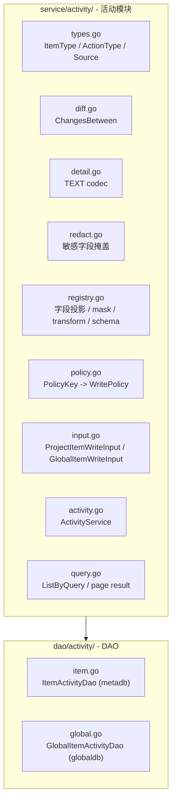

# 架构总览：活动日志

> 一套活动模块，两个表。共享事件模型、TEXT envelope、diff/redaction、写入策略，独立存储和服务路由。
> 评审建议先读 [README.md](./README.md)，再读本架构总览。

## 设计原则

- **最小语义集合**：记录模型只保留 `item_type + action_type + detail` 这组最小必要语义；不引入 `action_name`
- **共享引擎**：ItemType 枚举、基础 `action_type`、diff/redaction、中心化写入策略与两个表共用
- **独立存储**：`meta.activity_log` 在 project schema（meta）内，`global.activity_log` 在 web global schema 内。不试图统一
- **显式路由**：`WriteProjectItemLog` / `WriteGlobalItemLog`，调用方选哪个就写哪个表，不搞自省
- **展示快照**：`item_name` 和 `operator_name` 写入时快照，不随主表变更回写
- **Envelope 归口**：`detail` 顶层结构由活动模块统一拥有，业务侧只提供投影后的 `changes/extra/snapshot`
- **TEXT 存储边界**：V1 的 `detail_payload` 列类型使用 TEXT，不用 PG JSONB；TEXT 内是否启用应用层压缩在上线前按规模评估锁定

## 模块结构

```text
apps/web/service/activity/      # 活动模块
  types.go                      # ItemType / ActionType / Source 枚举
  detail.go                     # Detail 结构体 + TEXT codec 序列化/反序列化
  diff.go                       # ChangesBetween diff 引擎
  redact.go                     # 敏感字段掩盖 / 字段规则应用
  registry.go                   # item 投影 / mask / transform / detail schema 注册
  policy.go                     # PolicyKey -> WritePolicy 中心化策略
  input.go                      # ProjectItemWriteInput / GlobalItemWriteInput
  activity.go                   # ActivityService（WriteProjectItemLog / WriteGlobalItemLog）
  query.go                      # ListByQuery / page result

apps/web/dao/activity/          # DAO 层
  item.go                       # ItemActivity 模型 + DAO（metadb）
  global.go                     # GlobalItemActivity 模型 + DAO（globaldb）

script/migration/scripts/
  meta_v20260701_activity_log.sql      # meta.activity_log DDL
  global_v20260701_activity_log.sql    # global.activity_log DDL
```

## 架构图



## 存储

### meta.activity_log（project schema）

| 字段 | 类型 | 说明 |
|---|---|---|
| id | BIGSERIAL PK | |
| item_type | VARCHAR(64) | CHART / DASHBOARD / COHORT / ... |
| item_id | INTEGER | |
| item_name | VARCHAR(255) | 展示快照 |
| action_type | VARCHAR(32) | 基础动作枚举；V1 默认 create / update / delete / copy，后续如确有必要在活动模块统一扩展 |
| operator_id | INTEGER | |
| operator_name | VARCHAR(255) | 展示快照 |
| source | VARCHAR(32) | web / openapi / internal / backfill |
| correlation_id | VARCHAR(64) | 批量或跨对象关联标识 |
| detail_payload | TEXT | 稳定 envelope 的 TEXT payload；查询接口读出后返回解析后的 `detail` 对象 |
| occurred_at | TIMESTAMPTZ | 活动事件时间 |
| created_at | TIMESTAMPTZ | DB 入库时间 |

索引：`(item_type, item_id, occurred_at DESC, id DESC)`

### global.activity_log（web global schema）

这是 global schema 内的 **item activity 表**，不是 org 专用表。V1 首批 item_type 聚焦 `ORGANIZATION` / `PROJECT` / `ORG_MEMBER` / `PROJECT_MEMBER` / `ACCOUNT_API_TOKEN`，后续可接入 integration、billing config 等 global 级对象。

字段集 = meta.activity_log + scope 字段：

| 字段 | 类型 | 说明 |
|---|---|---|
| org_id | BIGINT NULL | org-scoped global item 填写；account-scoped item 可为空 |
| project_id | BIGINT NULL | project-scoped global item 填写 |
| account_id | BIGINT NULL | account-scoped global item 填写，例如 Account API Token |

Account API Token 没有天然 `org_id`，因此 `global.activity_log` 不能把 `org_id` 设计为所有记录必填。服务层按 item registry 校验 scope 组合：组织/项目/成员类必须有对应 org/project scope，账号 API Token 必须有 `account_id`。

索引：
- `(org_id, item_type, occurred_at DESC, id DESC)`，仅 `org_id IS NOT NULL`
- `(project_id, item_type, occurred_at DESC, id DESC)`，仅 `project_id IS NOT NULL`
- `(account_id, item_type, occurred_at DESC, id DESC)`，仅 `account_id IS NOT NULL`
- `(operator_id, occurred_at DESC, id DESC)`

## 链路分界

| 链路 | 存储 | 覆盖范围 |
|---|---|---|
| **项目 item 活动** | `meta.activity_log` | Chart / Dashboard / Cohort / AB / Metric / Pipeline / Event / Property |
| **全局 item 活动** | `global.activity_log` | global schema 下的 item 活动；V1 首批为组织/项目生命周期、成员、权限同步、Account API Token |
| **OP 操作记录** | `global.op_operation_log`（不变） | OP 人员的组织/项目配置操作 |
| **账号活跃字段** | `global.account` 表 3 列 | last_login_at / last_logout_at / last_active_at |

## 落地流程

每个新活动接入必须按同一条流水线做，避免业务模块各写各的：

1. **注册对象**：在 `types.go` 增加 `ItemType`，在 `registry.go` 注册 storage scope（project/global）、字段投影 allowlist、redaction 规则、对象名提取规则。
2. **注册动作**：优先使用基础 `create/update/delete/copy`。确实需要扩展 action_type 时，先走评审并在 `types.go` 注册；未注册字符串入口拒绝。
3. **注册接入场景**：在 `policy.go` 增加 `PolicyKey`，配置 `required_full/required_core/best_effort`。策略按接入场景走，不按模块粗暴继承。
4. **实现领域包装函数**：在业务 service 附近提供小函数，例如 `LogChartUpdated(ctx, old, next)` 或 `LogGlobalProjectMemberAdded(ctx, input)`，里面固定 `ItemType/ActionType/PolicyKey`。
5. **业务事务接入**：在主操作成功路径、事务提交前调用 `ActivityService`。update/delete 需要在修改前读取旧快照，create 需要使用创建后的 ID 和展示名。
6. **统一处理 detail**：调用方给 old/new 快照或必要 extra；活动模块负责投影、脱敏、diff、截断、序列化，调用方不手写敏感字段 diff。
7. **验证闭环**：每个接入点必须有成功写入测试、无变化不写测试、活动写入失败策略测试、查询接口可读测试。

最小代码形态：

```go
activity.WriteProjectItemLog(ctx, activity.ProjectItemWriteInput{
    ItemType:   activity.ItemTypeChart,
    ItemID:     chart.ID,
    ItemName:   chart.Name,
    ActionType: activity.ActionTypeUpdate,
    PolicyKey:  activity.PolicyChartUpdate,
    Source:     activity.SourceWeb,
    OldValue:   oldChart,
    NewValue:   chart,
})
```

global item 使用同一模型，只是路由到 `global.activity_log`：

```go
activity.WriteGlobalItemLog(ctx, activity.GlobalItemWriteInput{
    OrgID:      orgID,
    ProjectID:  projectID,
    ItemType:   activity.ItemTypeProjectMember,
    ItemID:     accountID,
    ItemName:   member.DisplayName,
    ActionType: activity.ActionTypeCreate,
    PolicyKey:  activity.PolicyProjectMemberCreate,
    Source:     activity.SourceWeb,
    Extra:      map[string]any{"roles": roleIDs},
})
```

Account API Token 这类账号级 global item 不填 `OrgID/ProjectID`，而是填 `AccountID`：

```go
activity.WriteGlobalItemLog(ctx, activity.GlobalItemWriteInput{
    AccountID:  accountID,
    ItemType:   activity.ItemTypeAccountAPIToken,
    ItemID:     token.ID,
    ItemName:   token.Label,
    ActionType: activity.ActionTypeUpdate,
    PolicyKey:  activity.PolicyAccountAPITokenUpdate,
    Source:     activity.SourceWeb,
    OldValue:   oldToken,
    NewValue:   token,
})
```

核心注册结构建议：

```go
type StorageScope string

const (
    StorageScopeProject StorageScope = "project"
    StorageScopeGlobal  StorageScope = "global"
)

type ScopeRules struct {
    RequireOrg     bool
    RequireProject bool
    RequireAccount bool
}

type ItemRegistration struct {
    ItemType      ItemType
    StorageScope  StorageScope
    ScopeRules    ScopeRules
    Project       ProjectionBuilder
    FieldRules    []FieldRule
    ResolveName   func(projected map[string]any) string
}

type PolicyRegistration struct {
    PolicyKey  ActivityPolicyKey
    ItemType   ItemType
    ActionType ActionType
    Policy     WritePolicy
}
```

服务内执行顺序固定为：

1. 根据调用方法确定 storage scope：project 写 `meta.activity_log`，global 写 `global.activity_log`。
2. 校验 `ItemType`、`ActionType`、`PolicyKey` 都已注册，且 scope 匹配。
3. 从 ctx 解析 operator/source/correlation_id，补齐展示快照。
4. 根据 registry 对 old/new 做投影、脱敏、diff，合成 `detail`。
5. 对 detail 做大小预算、截断、TEXT codec 序列化。
6. 按 `PolicyKey` 取得 `WritePolicy`，执行 DAO insert 或 batch insert。
7. 记录 metrics/log；按 policy 决定返回 error、降级 detail，还是 warning 后继续。

## 查询模型

V1 的对象历史查询保持 `page + page_size + total` 简单分页，不改成 cursor-only：

- 主要消费者是 OP / 内部排障链路，直接看到 `total` 更利于判断历史规模、页数和是否需要继续追查
- 当前主查询是单对象时间序列，分页成本可控，没有必要为了理论上的深翻页优化先把契约复杂化
- 若未来出现超深翻页压力，可在查询层增量补 cursor 版本，但不替换当前内部契约

## detail 演进边界

- V1 不新增 `detail_version` 字段。当前只有一套共享 envelope，单独落版本字段只会增加治理点
- 如未来真的出现不兼容演进，由 `apps/web/service/activity` 统一维护 serializer/parser 兼容，不把版本治理下放给各业务模块

## 参与文档

| 文档 | 内容 |
|---|---|
| [spec.md](./spec.md) | 功能规格与需求 |
| [plan-object.md](./plan-object.md) | 项目活动记录技术方案 |
| [plan-global.md](./plan-global.md) | global item 活动技术方案 |
| [plan-account.md](./plan-account.md) | 账号活跃字段方案 |
| [decisions.md](./decisions.md) | 设计决策记录 |
| [_research/](./_research/) | 调研参考（PostHog 研究等） |
