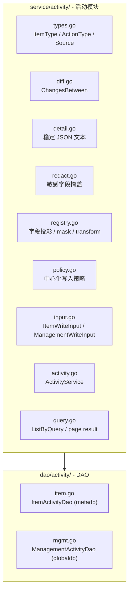

# 架构总览：活动日志

> 一套活动模块，两个表。共享事件模型、TEXT envelope、diff/redaction、写入策略，独立存储和服务路由。

## 设计原则

- **最小语义集合**：记录模型只保留 `item_type + action_type + detail` 这组最小必要语义；不引入 `action_name`
- **共享引擎**：ItemType 枚举、基础 `action_type`、diff/redaction、中心化写入策略与两个表共用
- **独立存储**：`meta.activity_log` 在 project schema（meta）内，`global.activity_log` 在 global schema 内。不试图统一
- **显式路由**：`WriteItemLog` / `WriteManagementLog`，调用方选哪个就写哪个表，不搞自省
- **展示快照**：`item_name` 和 `operator_name` 写入时快照，不随主表变更回写
- **Envelope 归口**：`detail` 顶层结构由活动模块统一拥有，业务侧只提供投影后的 `changes/extra/snapshot`
- **可读优先**：V1 的 detail payload 以可读 JSON 文本落盘，不默认使用应用层压缩

## 模块结构

```text
apps/web/service/activity/      # 活动模块
  types.go                      # ItemType / ActionType / Source 枚举
  detail.go                     # Detail 结构体 + JSON 文本序列化
  diff.go                       # ChangesBetween diff 引擎
  redact.go                     # 敏感字段掩盖 / 字段规则应用
  registry.go                   # item 投影 / mask / transform 注册
  policy.go                     # 中心化写入策略
  input.go                      # ItemWriteInput / ManagementWriteInput
  activity.go                   # ActivityService（WriteItemLog / WriteManagementLog）
  query.go                      # ListByQuery / page result

apps/web/dao/activity/          # DAO 层
  item.go                       # ItemActivity 模型 + DAO（metadb）
  mgmt.go                       # ManagementActivity 模型 + DAO（globaldb）

script/migration/scripts/
  meta_v20260701_activity_log.sql      # meta.activity_log DDL
  global_v20260701_activity_log.sql    # global.activity_log DDL
```

## 架构图



## 存储

### meta.activity_log（project schema）

| 字段 | 类型 | 说明 |
|---|---|---|
| id | BIGSERIAL PK | |
| item_type | VARCHAR(64) | CHART / DASHBOARD / COHORT / ... |
| item_id | INTEGER | |
| item_name | VARCHAR(255) | 展示快照 |
| action_type | VARCHAR(32) | 基础动作枚举；V1 默认 create / update / delete / copy，后续如确有必要在活动模块统一扩展 |
| operator_id | INTEGER | |
| operator_name | VARCHAR(255) | 展示快照 |
| source | VARCHAR(32) | web / openapi / internal / backfill |
| correlation_id | VARCHAR(64) | 批量或跨对象关联标识 |
| detail_payload | TEXT | 稳定 envelope 的 JSON 文本；查询接口读出后返回解析后的 `detail` 对象 |
| occurred_at | TIMESTAMPTZ | 活动事件时间 |
| created_at | TIMESTAMPTZ | DB 入库时间 |

索引：`(item_type, item_id, occurred_at DESC, id DESC)`

### global.activity_log（global schema）

同 meta.activity_log + org_id（BIGINT NOT NULL）+ project_id（BIGINT DEFAULT NULL）。

索引：
- `(org_id, item_type, occurred_at DESC, id DESC)`
- `(project_id, item_type, occurred_at DESC, id DESC)`

## 链路分界

| 链路 | 存储 | 覆盖范围 |
|---|---|---|
| **项目活动记录** | `meta.activity_log` | Chart / Dashboard / Cohort / AB / Metric / Pipeline / Event / Property |
| **管理活动记录** | `global.activity_log` | 组织/项目生命周期、成员管理、权限同步 |
| **OP 操作记录** | `global.op_operation_log`（不变） | OP 人员的组织/项目配置操作 |
| **账号活跃字段** | `global.account` 表 3 列 | last_login_at / last_logout_at / last_active_at |

## 查询模型

V1 的对象历史查询保持 `page + page_size + total` 简单分页，不改成 cursor-only：

- 主要消费者是 OP / 内部排障链路，直接看到 `total` 更利于判断历史规模、页数和是否需要继续追查
- 当前主查询是单对象时间序列，分页成本可控，没有必要为了理论上的深翻页优化先把契约复杂化
- 若未来出现超深翻页压力，可在查询层增量补 cursor 版本，但不替换当前内部契约

## detail 演进边界

- V1 不新增 `detail_version` 字段。当前只有一套共享 envelope，单独落版本字段只会增加治理点
- 如未来真的出现不兼容演进，由 `apps/web/service/activity` 统一维护 serializer/parser 兼容，不把版本治理下放给各业务模块

## 参与文档

| 文档 | 内容 |
|---|---|
| [spec.md](./spec.md) | 功能规格与需求 |
| [plan-object.md](./plan-object.md) | 项目活动记录技术方案 |
| [plan-org.md](./plan-org.md) | 管理活动记录技术方案 |
| [plan-account.md](./plan-account.md) | 账号活跃字段方案 |
| [decisions.md](./decisions.md) | 设计决策记录 |
| [_research/](./_research/) | 调研参考（PostHog 研究等） |
