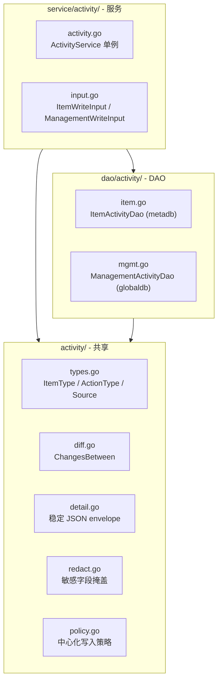

# 架构总览：活动日志

> 一套引擎，两个表。共享事件模型、diff/redaction、写入策略，独立存储和服务路由。

## 设计原则

- **共享引擎**：ItemType 枚举、基础 `action_type` + 可选 `action_name`、diff/redaction、中心化写入策略与两个表共用
- **独立存储**：`meta.activity_log` 在 project schema（meta）内，`global.activity_log` 在 global schema 内。不试图统一
- **显式路由**：`WriteItemLog` / `WriteManagementLog`，调用方选哪个就写哪个表，不搞自省
- **展示快照**：`item_name` 和 `operator_name` 写入时快照，不随主表变更回写
- **可读优先**：V1 的 detail payload 以可读 JSON 落盘，不默认使用应用层压缩

## 模块结构

```
apps/web/activity/              # 共享类型与引擎
  types.go                      # ItemType / ActionType / Source 枚举
  detail.go                     # Detail 结构体 + JSON envelope 序列化
  diff.go                       # ChangesBetween diff 引擎
  redact.go                     # 敏感字段掩盖 / 字段规则应用
  policy.go                     # 中心化写入策略

apps/web/dao/activity/          # DAO 层
  item.go                     # ItemActivity 模型 + DAO（metadb）
  mgmt.go                       # ManagementActivity 模型 + DAO（globaldb）

apps/web/service/activity/      # 服务层
  input.go                      # ItemWriteInput / ManagementWriteInput
  activity.go                   # ActivityService 单例（WriteItemLog / WriteManagementLog）

script/migration/scripts/
  meta_v20260701_activity_log.sql    # meta.activity_log DDL
  global_v20260701_activity_log.sql    # global.activity_log DDL
```

## 架构图



## 存储

### meta.activity_log（project schema）

| 字段 | 类型 | 说明 |
|---|---|---|
| id | BIGSERIAL PK | |
| item_type | VARCHAR(64) | CHART / DASHBOARD / COHORT / ... |
| item_id | INTEGER | |
| item_name | VARCHAR(255) | 展示快照 |
| action_type | VARCHAR(32) | 基础动作：create / update / delete / copy |
| action_name | VARCHAR(64) | 可选领域动作：online / release / add_org_member / ... |
| operator_kind | VARCHAR(32) | account / system / backfill |
| operator_id | INTEGER NULL | |
| operator_name | VARCHAR(255) | 展示快照 |
| source | VARCHAR(32) | web / openapi / internal / backfill |
| correlation_id | VARCHAR(64) | 批量或跨对象关联标识 |
| detail_version | SMALLINT | V1 固定 1 |
| detail_payload | JSONB | 稳定 envelope |
| occurred_at | TIMESTAMPTZ | 活动事件时间 |
| recorded_at | TIMESTAMPTZ | DB 入库时间 |

索引：`(item_type, item_id, occurred_at DESC, id DESC)`

### global.activity_log（global schema）

同 meta.activity_log + org_id（BIGINT NOT NULL）+ project_id（BIGINT DEFAULT NULL）。

索引：
- `(org_id, item_type, occurred_at DESC, id DESC)`
- `(project_id, item_type, occurred_at DESC, id DESC)`
- `(item_type, item_id, occurred_at DESC, id DESC)`
- `(operator_id, occurred_at DESC, id DESC)`

## 链路分界

| 链路 | 存储 | 覆盖范围 |
|---|---|---|
| **项目活动记录** | `meta.activity_log` | Chart / Dashboard / Cohort / AB / Metric / Pipeline / Event / Property |
| **管理活动记录** | `global.activity_log` | 组织/项目生命周期、成员管理、权限同步 |
| **OP 操作记录** | `global.op_operation_log`（不变） | OP 人员的组织/项目配置操作 |
| **账号活跃字段** | `global.account` 表 3 列 | last_login_at / last_logout_at / last_active_at |

## 参与文档

| 文档 | 内容 |
|---|---|
| [spec.md](./spec.md) | 功能规格与需求 |
| [plan-object.md](./plan-object.md) | 项目活动记录技术方案 |
| [plan-org.md](./plan-org.md) | 管理活动记录技术方案 |
| [plan-account.md](./plan-account.md) | 账号活跃字段方案 |
| [decisions.md](./decisions.md) | 设计决策记录 |
| [_research/](./_research/) | 调研参考（PostHog 研究等） |
