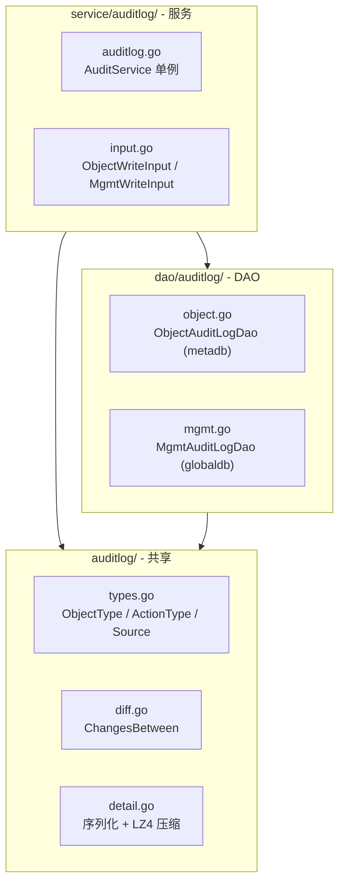

# 架构总览：审计日志

> 一套引擎，两个表。共享类型和序列化，独立存储和服务路由。

## 设计原则

- **共享引擎**：ObjectType 枚举、detail 序列化（LZ4 + BYTEA）、diff 引擎三件套与两个表共用
- **独立存储**：`object_audit_log` 在 project schema（meta）内，`mgmt_audit_log` 在 global schema 内。不试图统一
- **显式路由**：`WriteObjectLog` / `WriteMgmtLog`，调用方选哪个就写哪个表，不搞自省
- **展示快照**：`object_name` 和 `operator_name` 写入时快照，不随主表变更回写

## 模块结构

```
apps/web/auditlog/              # 共享类型与引擎
  types.go                      # ObjectType / ActionType / Source 枚举
  detail.go                     # Detail 结构体 + SerializeDetail / DeserializeDetail（含 LZ4）
  diff.go                       # ChangesBetween diff 引擎

apps/web/dao/auditlog/          # DAO 层
  object.go                     # ObjectAuditLog 模型 + DAO（metadb）
  mgmt.go                       # MgmtAuditLog 模型 + DAO（globaldb）

apps/web/service/auditlog/      # 服务层
  input.go                      # ObjectWriteInput / MgmtWriteInput
  auditlog.go                   # AuditService 单例（WriteObjectLog / WriteMgmtLog）

script/migration/scripts/
  meta_v20260701_object_audit_log.sql    # object_audit_log DDL
  global_v20260701_mgmt_audit_log.sql    # mgmt_audit_log DDL
```

## 架构图



## 存储

### object_audit_log（project schema — meta）

| 字段 | 类型 | 说明 |
|---|---|---|
| id | BIGSERIAL PK | |
| object_type | VARCHAR(64) | CHART / DASHBOARD / COHORT / ... |
| object_id | INTEGER | |
| object_name | VARCHAR(255) | 展示快照 |
| action_type | VARCHAR(32) | 自有枚举（create / update / delete / copy + 扩展） |
| operator_id | INTEGER | |
| operator_name | VARCHAR(255) | 展示快照 |
| source | VARCHAR(32) | web / openapi / internal / backfill |
| detail_version | SMALLINT | V1 固定 1 |
| detail_payload | BYTEA | LZ4 压缩序列化 |
| created_at | TIMESTAMPTZ | 审计事件时间 |

索引：`(object_type, object_id, created_at DESC)`

### mgmt_audit_log（global schema）

同 object_audit_log + org_id（BIGINT NOT NULL）+ project_id（BIGINT DEFAULT NULL）。

索引：
- `(org_id, object_type, created_at DESC)`
- `(project_id, object_type, created_at DESC)`
- `(object_type, object_id, created_at DESC)`
- `(operator_id, created_at DESC)`

## 链路分界

| 链路 | 存储 | 覆盖范围 |
|---|---|---|
| **项目对象审计** | `meta.object_audit_log` | Chart / Dashboard / Cohort / AB / Metric / Pipeline / Event / Property |
| **客户管理审计** | `global.mgmt_audit_log` | 组织/项目生命周期、成员管理、权限同步 |
| **OP 操作审计** | `global.op_operation_log`（不变） | OP 人员的组织/项目配置操作 |
| **账号活跃字段** | `global.account` 表 3 列 | last_login_at / last_logout_at / last_active_at |

## 参与文档

| 文档 | 内容 |
|---|---|
| [spec.md](./spec.md) | 功能规格与需求 |
| [plan-object.md](./plan-object.md) | 项目对象审计技术方案 |
| [plan-org.md](./plan-org.md) | 组织/项目管理审计技术方案 |
| [plan-account.md](./plan-account.md) | 账号活跃字段方案 |
| [decisions.md](./decisions.md) | 设计决策记录 |
| [_research/](./_research/) | 调研参考（PostHog 研究等） |
