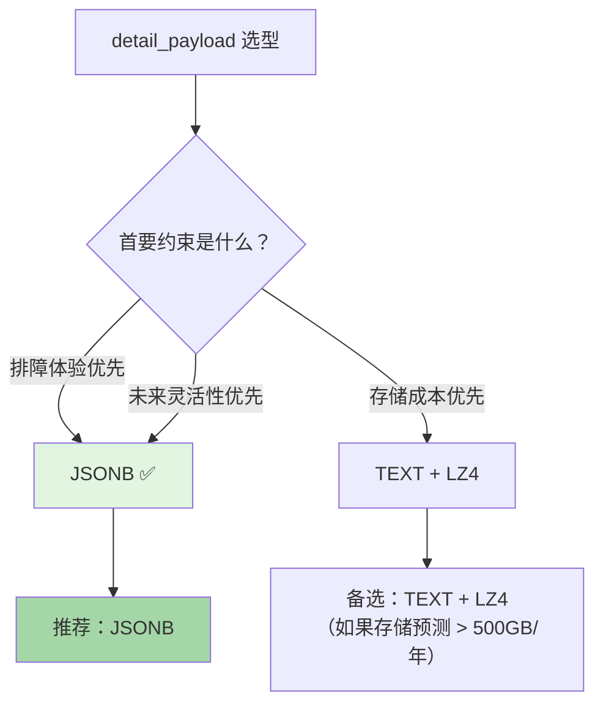

# 待讨论议题

> 本文件存放评审中识别但尚未锁定的议题。每个议题有完整分析，但决策搁置，待后续讨论再定。

## D-P4: detail_payload 存储格式

**状态**: 未锁定 | **优先级**: P3（影响不大，不阻塞 V1）

**背景**: CEO 前提门要求调整，但评审认为影响不大，暂不锁定。

---

### 术语

| 术语 | 说明 |
|------|------|
| TOAST | PG 大字段溢出存储（行外压缩），对 >2KB 的字段自动触发 |
| LZ4 | 应用层压缩算法，压缩/解压速度 ~500MB/s，压缩率 ~3-5x |
| JSONB | PG 原生二进制 JSON 格式，内部去重 key + 排序，支持索引和路径查询 |
| query_path | JSONB 的 `@>`, `->>`, `#>` 等路径操作符，可在 SQL 中直接查询字段 |
| WAL | PG 预写日志，行宽影响 WAL 产生量和复制带宽 |

---

### 按规模对比

**Stage 1 — 小型规模（< 1M 行，单表 < 1GB）**

| 维度 | TEXT + JSON | JSONB | TEXT + LZ4 |
|------|------------|-------|-----------|
| 磁盘占用 | ~1 GB（基线） | ~1.05 GB（+5% TOAST 元数据） | ~200-350 MB（LZ4 ~3-5x） |
| 写入延迟 | 基线（~0.5ms） | +0.05ms（JSONB 验证） | +0.2ms（LZ4 压缩） |
| 排障直接可查 | ✅ 直接 cat/less | ✅ `SELECT detail->>'field'` | ❌ 需应用层解压 |
| migration 成本 | 低（直接转 JSONB 可原地 ALTER） | 低 | 低 |
| 索引支持 | ❌ 不支持内容索引 | ✅ 支持 GIN 索引 | ❌ 不支持内容索引 |

结论：**< 1M 行三方案差异极小**，TEXT 最简，JSONB 最灵活，LZ4 存储最优。选哪个都不需要 backfill。

---

**Stage 2 — 中等规模（1M - 100M 行，单表 1-100 GB）**

| 维度 | TEXT + JSON | JSONB | TEXT + LZ4 |
|------|------------|-------|-----------|
| 磁盘占用 | ~10-100 GB | ~10-105 GB | ~2-20 GB（LZ4 优势开始显现） |
| 写入延迟 | 基线 | +0.01-0.05ms（验证，可忽略） | +0.1-0.3ms（压缩） |
| 查询延迟（单对象历史） | ✅ 索引查询无差异 | ✅ 索引查询无差异 | ✅ 索引查询无差异 ❌ detail 查询需解压 |
| 内容搜索（如查某个字段变更） | ❌ 无法直接 SQL 筛选 detail | ✅ `WHERE detail @> '{"field":"x"}'` | ❌ 无法直接 SQL 筛选 |
| 热更新（频繁 update 同一行） | ❌ PG TOAST 写放大 | ⚠️ JSONB 同样 TOAST 写放大 | ❌ 同左，且解压成本更高 |
| 运维复杂度 | 低 | 低 | 中（需维护 codec 兼容） |

要点：
- 中等规模下，**存储成本差异开始显现**，但 Wave 场景下 100GB 仍属可接受
- **JSONB 的路径查询能力开始体现价值**：排障时可以直接 `WHERE detail @> '{"field":"name"}'` 找改过某字段的记录
- LZ4 的查询路径多一层解压，对 API 响应时间影响不大（解压 < 0.01ms），但对直接查库排障不友好

---

**Stage 3 — 大规模（> 100M 行，单表 > 100 GB）**

| 维度 | TEXT + JSON | JSONB | TEXT + LZ4 |
|------|------------|-------|-----------|
| 磁盘占用 | > 100 GB | > 105 GB | > 20 GB |
| WAL 产生量 | ~写入行数 × 行宽 | 同左 | 减少 3-5x |
| 备份/恢复时间 | 基线 | ~相同 | 减少 3-5x |
| 冷热数据分层 | JSON 不适合压缩 | same | 已压缩 |
| 运维成本 | 需监控存储增长 | 同左 | 低（存储少，IO 少） |
| 未来演进难度 | 高（必须 backfill 才能换格式） | 中（JSONB 已是通用格式） | 高（LZ4 转其他格式需要全量解压再压缩） |

要点：
- **> 100M 行时存储成本和 WAL 量成为主要矛盾**，LZ4 的压缩优势显著
- 但 Wave V1 要到 100M+ 行可能需 1-2 年，届时 PG 版本可能已支持内置列级压缩
- JSONB 的 TOAST 压缩（PG 内置 LZ TOAST）已经提供了一定程度的压缩

---

### 行业参考

| 系统 | 方案 | 规模参考 |
|------|------|---------|
| **PostHog** | JSONB | ~1B+ events/月，detail 用 JSONB + TOAST 压缩 |
| **GitLab Audit Events** | JSONB | 已验证大规模 |
| **Logflare** | JSONB | 日志分析场景 |
| **AuditTrigger (PG 生态)** | JSONB | PG 审计插件默认 JSONB |

### 风险矩阵

| 风险 | TEXT + JSON | JSONB | TEXT + LZ4 |
|------|------------|-------|-----------|
| 查询 detail 内字段不可用 | **P1** — 2 年后需要加列或 backfill | ✅ 原生支持 | **P1** — 无法 SQL 查询 |
| 存储增长超预期 | 低风险（可后续转压缩） | 低风险 | ✅ 已压缩 |
| codec 兼容问题 | ✅ 无 | ✅ 无（PG 负责） | **P2** — 升级算法需处理旧数据 |
| 排障效率低（不可直接查库） | ✅ 直接可读 | ✅ 直接可读 | ❌ 需要工具链 |
| ORM/框架兼容性 | ✅ 全兼容 | ✅ 主流 ORM 支持 | ⚠️ 需自定义 scanner/serializer |
| 未来 PG 升级兼容 | ✅ | ✅ JSONB 是 PG 核心类型 | ⚠️ 应用层方案，不受 PG 版本影响 |

### 评审结论（待确认）

初步推荐路径：

- **推荐**：JSONB（排障直接可查 SQL、行业已验证、PG 原生类型）
- **备选**：TEXT + LZ4（当单表 > 500GB 或月写入 > 500M 行时评估切换）
- **否决**：纯 TEXT（CEO 前提门要求调整）、V1 双写（过度设计）
- Migration path：TEXT → JSONB 可以原地 `ALTER COLUMN ... TYPE JSONB USING detail_payload::jsonb`
