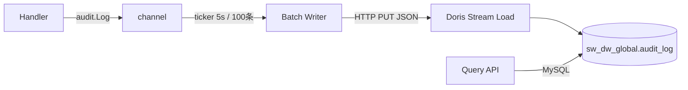

# 技术方案：Wave 审计日志（Doris 实现）

**日期**: 2026-07-03
**依赖**: [spec.md](./spec.md)、[decisions.md](./decisions.md)、[posthog-to-wave-audit-mapping.md](_research/posthog-to-wave-audit-mapping.md)
**替代**: plan-audit-log.md（原 PostgreSQL 方案）

---

## 一、方案概述

审计日志通过**显式调用 + Doris Stream Load 异步攒批**实现。核心思路：

- Handler/Service 中一行 `audit.Log(ctx, ...)` 显式记录
- 写入 channel 后立即返回（非阻塞）
- 后台 goroutine ticker 攒批，通过 Doris HTTP Stream Load 批量写入
- 查询走 Doris MySQL 协议



### 与 PostgreSQL 方案对比

| 维度 | PG 方案（plan-audit-log.md） | Doris 方案（本方案） |
|------|----------------------------|---------------------|
| 写入方式 | GORM 插件自动拦截 | 显式 `audit.Log()` 调用 |
| 写入策略 | 同步 blocking | 异步 channel + ticker 攒批 |
| Detail | changes diff（字段级变更） | 嵌套分组：account/target/comment/changes/extra |
| 存储 | PostgreSQL `global.audit_log` | Doris `sw_dw_global.audit_log` |
| 分区 | V1 不做 | AUTO PARTITION BY RANGE 按月 |
| 压缩 | 无（~360GB/年） | 5-10x 列存压缩（~50GB/年） |
| 代码量 | ~450 行 GORM 插件 + diff 引擎 | ~150 行 audit 包 |
| SPOF | 是（PG 写入阻塞主流程） | 否（channel 满时 drop + warn） |

---

## 二、Doris 表结构

### 2.1 建表 DDL

```sql
CREATE DATABASE IF NOT EXISTS sw_dw_global;

CREATE TABLE IF NOT EXISTS sw_dw_global.audit_log (
    `created_at`  DATETIME(3) NOT NULL DEFAULT CURRENT_TIMESTAMP(3) COMMENT '记录时间',
    `org_id`      BIGINT      NOT NULL DEFAULT 0   COMMENT '组织 ID，0=无组织归属',
    `project_id`  BIGINT      NOT NULL DEFAULT 0   COMMENT '项目 ID，0=无项目归属',
    `account_id`  BIGINT      NOT NULL             COMMENT '操作人 account_id',
    `action`      VARCHAR(32) NOT NULL             COMMENT 'created/updated/deleted/logged_in/logged_out',
    `domain`      VARCHAR(32) NOT NULL             COMMENT 'account/organization/project/asset/metadata',
    `feature`     VARCHAR(32) NOT NULL             COMMENT 'auth/token/chart/experiment/...',
    `target_id`   VARCHAR(72) NOT NULL DEFAULT ''  COMMENT '资源 ID，登录事件为空字符串',
    `source`      VARCHAR(16) NOT NULL             COMMENT 'ui / api_token',
    `ip_address`  VARCHAR(64) NOT NULL             COMMENT '操作者 IP',
    `detail`      JSON        NULL                 COMMENT '{"account":{"name":"..."},"target":{"name":"...","type":"..."},"comment":"...","changes":[...],"extra":{}}'
) ENGINE=OLAP
DUPLICATE KEY(`created_at`, `org_id`, `project_id`, `account_id`)
AUTO PARTITION BY RANGE (date_trunc(`created_at`, 'month')) ()
DISTRIBUTED BY HASH(`account_id`) BUCKETS AUTO
PROPERTIES (
    "replication_allocation" = "tag.location.default: 3",
    "compression" = "ZSTD"
);
```

### 2.2 设计要点

| 决策 | 理由 |
|------|------|
| **DUPLICATE KEY**（非 UNIQUE） | 审计日志 append-only，无更新，DUPLICATE 模型写入最快 |
| **AUTO PARTITION BY RANGE 按月** | 自动创建/删除分区，无需运维脚本 |
| **DISTRIBUTED BY HASH(account_id)** | 按人查询是最常见过滤维度 |
| **detail 用 JSON 类型** | 嵌套分组（account/target/changes/extra），Doris `json_extract` 可按 key 查询 |
| **org_id/project_id DEFAULT 0** | Doris 不支持 NULL，用 0 表示"无归属" |
| **ZSTD 压缩** | 列存在 5-10x 压缩比 |
| **独立数据库 sw_dw_global** | 审计日志跨项目，不放入项目数据库 |

### 2.3 与 Doris 现有模式对齐

| 现有表 | 审计日志沿用 |
|--------|------------|
| ENGINE=OLAP | ✅ |
| AUTO PARTITION BY RANGE | ✅ |
| DISTRIBUTED BY HASH(...) BUCKETS AUTO | ✅ |
| replication_allocation = 3 | ✅ |
| PROPERTIES 中 compression=ZSTD | ✅ |
| 全局连接 (dorisx.DB.GetGlobalDB()) | ✅ |

---

## 三、Go 代码结构

### 3.1 包结构

```
apps/web/audit/
├── audit.go        # Log() 函数 + 常量定义
├── writer.go       # 后台攒批 writer
└── query.go        # List/Export 查询
```

### 3.2 常量定义（audit.go）

```go
package audit

// Action 操作类型
const (
    ActionCreated   = "created"
    ActionUpdated   = "updated"
    ActionDeleted   = "deleted"
    ActionLoggedIn  = "logged_in"
    ActionLoggedOut = "logged_out"
)

// Domain 领域
const (
    DomainAccount      = "account"
    DomainOrganization = "organization"
    DomainProject      = "project"
    DomainAsset        = "asset"
    DomainMetadata     = "metadata"
)

// Feature 实体类型（21 个）
const (
    FeatureAuth           = "auth"
    FeatureToken          = "token"
    FeatureOrg            = "org"
    FeatureOrgMember      = "org_member"
    FeatureOrgInvite      = "invite"
    FeatureProject        = "project"
    FeatureProjectMember  = "project_member"
    FeatureChart          = "chart"
    FeatureDashboard      = "dashboard"
    FeatureCohort         = "cohort"
    FeaturePipeline       = "pipeline"
    FeatureCampaign       = "campaign"
    FeatureExperiment     = "experiment"
    FeatureFeatureGate    = "feature_gate"
    FeatureFeatureConfig  = "feature_config"
    FeatureMetric         = "metric"
    FeatureTrackedEvent   = "tracked_event"
    FeatureVirtualEvent   = "virtual_event"
    FeatureEventProperty  = "event_property"
    FeatureUserProperty   = "user_property"
    FeatureVirtualProperty = "virtual_property"
)

// source 来源
const (
    SourceUI       = "ui"
    SourceAPIToken = "api_token"
)
```

### 3.3 核心类型

```go
// Entry 一条审计日志
type Entry struct {
    CreatedAt time.Time `json:"created_at"`
    OrgID     int64     `json:"org_id"`
    ProjectID int64     `json:"project_id"`
    AccountID int64     `json:"account_id"`
    Action    string    `json:"action"`
    Domain    string    `json:"domain"`
    Feature   string    `json:"feature"`
    TargetID  string    `json:"target_id"`
    Source    string    `json:"source"`
    IPAddress string    `json:"ip_address"`
    Detail    *Detail   `json:"detail"`
}

// Detail 审计详情。顶层 key 为语义分组，未来按需扩展。
type Detail struct {
    Account *DetailAccount  `json:"account,omitempty"` // 操作人快照
    Target  *DetailTarget   `json:"target,omitempty"`  // 被操作资源快照
    Comment string          `json:"comment,omitempty"` // 可选备注
    Changes []ChangeEntry   `json:"changes,omitempty"` // V2：字段级变更
    Extra   json.RawMessage `json:"extra,omitempty"`   // 事件专属扩展
}

// DetailAccount 操作人快照
type DetailAccount struct {
    Name  string `json:"name,omitempty"`
    Email string `json:"email,omitempty"`
}

// DetailTarget 被操作资源快照
type DetailTarget struct {
    Name string `json:"name,omitempty"`
    Type string `json:"type,omitempty"` // domain 常量值："chart" / "dashboard" / "experiment" ...
}

// ChangeEntry 单字段变更（V2 预留）
type ChangeEntry struct {
    Field  string `json:"field"`
    Action string `json:"action"` // "created" / "changed" / "deleted"
    Before any    `json:"before,omitempty"`
    After  any    `json:"after,omitempty"`
}
```

### 3.4 Log 函数签名

```go
// Log 记录一条审计日志。异步写入，不阻塞调用方。
// domain/feature 组合必须已注册，否则静默丢弃并 warn。
// 内部从 gin.Context 提取 account_id、IP、source，无需外部注入。
func Log(c *gin.Context, domain, feature, action, targetID string, detail *Detail)
```

**调用示例**：

```go
// Handler 中一行调用
audit.Log(c, audit.DomainAsset, audit.FeatureChart, audit.ActionCreated,
    fmt.Sprint(chart.ID), &audit.Detail{Target: &audit.DetailTarget{Name: chart.Name, Type: "chart"}})

// 登录事件（在认证 filter 中）
audit.Log(c, audit.DomainAccount, audit.FeatureAuth, audit.ActionLoggedIn,
    "", &audit.Detail{Account: &audit.DetailAccount{Name: accountName}})

// 删除事件
audit.Log(c, audit.DomainAsset, audit.FeatureDashboard, audit.ActionDeleted,
    fmt.Sprint(dashboard.ID), &audit.Detail{Target: &audit.DetailTarget{Name: dashboard.Name, Type: "dashboard"}})

// 无额外信息
audit.Log(c, audit.DomainOrganization, audit.FeatureOrgMember, audit.ActionCreated,
    fmt.Sprint(member.ID), nil)
```

---

## 四、Source 提取

`Log()` 直接接收 `*gin.Context`，内部提取 `account_id`、`ClientIP`、`source`，**不新增独立中间件**。无需注入 `AuditContext`。

source 判断逻辑：

| 场景 | source |
|------|--------|
| `pvctx.IsAccountAPIToken()` 返回 true | `"api_token"` |
| Session 认证（Cookie / Bearer JWT） | `"ui"` |
| `pvctx.Aid()` 返回 0 | 不写审计（白名单路由 / 未认证） |

后续如有 MCP 等新来源，在 `pvctx` 中新增通用 source 字段后，`Log()` 优先读取即可。

---

## 五、Batch Writer

### 5.1 设计

借鉴 `asset/behavior.go` 的攒批模式，简化为单一全局 batcher：

```go
// writer.go
package audit

import (
    "context"
    "encoding/json"
    "sync"
    "time"
    "wave/pkg/dal/dorisx"
    "wave/pkg/lib/ulog"
)

const (
    defaultBatchSize     = 100
    defaultFlushInterval = 5 * time.Second
    channelBuffer        = 1000
)

type writer struct {
    ch           chan *Entry
    stopCh       chan struct{}
    doneCh       chan struct{}
    streamLoader *dorisx.StreamLoader
}

var (
    writerInstance *writer
    writerOnce     sync.Once
)

func getWriter() *writer {
    writerOnce.Do(func() {
        // NOTE: streamLoader URL 和凭据从 dorisx 配置中获取
        w := &writer{
            ch:     make(chan *Entry, channelBuffer),
            stopCh: make(chan struct{}),
            doneCh: make(chan struct{}),
            streamLoader: &dorisx.StreamLoader{
                Url:           dorisConfig.HTTPHost + "/api/sw_dw_global/audit_log/_stream_load",
                DorisUsername: dorisConfig.User,
                DorisPassword: dorisConfig.Password,
            },
        }
        go w.backgroundFlush()
        writerInstance = w
    })
    return writerInstance
}

func (w *writer) backgroundFlush() {
    defer close(w.doneCh)
    batch := make([]*Entry, 0, defaultBatchSize)
    timer := time.NewTimer(defaultFlushInterval)
    defer timer.Stop()

    flush := func() {
        if len(batch) == 0 {
            return
        }
        data, err := json.Marshal(batch)
        if err != nil {
            ulog.Errorf("[audit] marshal batch failed: %v", err)
            batch = batch[:0]
            return
        }
        if err := w.streamLoader.Load(context.Background(), data); err != nil {
            ulog.Errorf("[audit] stream load failed: %v", err)
            // 失败不重试——单批次丢失可接受，合规审计关注的是长期覆盖率
        }
        batch = batch[:0]
    }

    for {
        select {
        case e := <-w.ch:
            batch = append(batch, e)
            if len(batch) >= defaultBatchSize {
                flush()
                timer.Reset(defaultFlushInterval)
            }
        case <-timer.C:
            flush()
            timer.Reset(defaultFlushInterval)
        case <-w.stopCh:
            // Graceful shutdown：排空 channel
            for {
                select {
                case e := <-w.ch:
                    batch = append(batch, e)
                    if len(batch) >= defaultBatchSize {
                        flush()
                    }
                default:
                    flush()
                    return
                }
            }
        }
    }
}

func (w *writer) Close() {
    close(w.stopCh)
    <-w.doneCh
}
```

### 5.2 Log 函数实现

```go
func Log(c *gin.Context, domain, feature, action, targetID string, detail *Detail) {
    ctx := c.Request.Context()
    aid := pvctx.Aid(ctx)
    if aid == 0 {
        ulog.Debugf("[audit] unauthenticated, skip. domain=%s feature=%s action=%s", domain, feature, action)
        return
    }

    ip := c.ClientIP()
    if ip == "" {
        ulog.Warnf("[audit] missing IP, skip. account=%d action=%s", aid, action)
        return
    }

    if !isRegistered(domain, feature) {
        ulog.Warnf("[audit] unregistered domain/feature: %s/%s", domain, feature)
        return
    }

    source := SourceUI
    if pvctx.IsAccountAPIToken(ctx) {
        source = SourceAPIToken
    }

    entry := &Entry{
        CreatedAt: time.Now(),
        OrgID:     pvctx.OrgID(ctx),
        ProjectID: pvctx.Pid(ctx),
        AccountID: aid,
        Action:    action,
        Domain:    domain,
        Feature:   feature,
        TargetID:  targetID,
        Source:    source,
        IPAddress: ip,
        Detail:    detail,
    }

    select {
    case getWriter().ch <- entry:
        // 写入成功
    default:
        ulog.Warnf("[audit] channel full, entry dropped. account=%d action=%s", aid, action)
    }
}
```

### 5.3 注册表校验

```go
var registered = map[string]map[string]bool{
    DomainAccount:      {FeatureAuth: true, FeatureToken: true},
    DomainOrganization: {FeatureOrg: true, FeatureOrgMember: true, FeatureOrgInvite: true},
    DomainProject:      {FeatureProject: true, FeatureProjectMember: true},
    DomainAsset: {
        FeatureChart: true, FeatureDashboard: true, FeatureCohort: true,
        FeaturePipeline: true, FeatureCampaign: true,
        FeatureExperiment: true, FeatureFeatureGate: true, FeatureFeatureConfig: true,
    },
    DomainMetadata: {
        FeatureMetric: true, FeatureTrackedEvent: true, FeatureVirtualEvent: true,
        FeatureEventProperty: true, FeatureUserProperty: true, FeatureVirtualProperty: true,
    },
}

func isRegistered(domain, feature string) bool {
    features, ok := registered[domain]
    return ok && features[feature]
}
```

### 5.4 生命周期

在 `apps/web/server.go` 的启动/退出流程中管理：

```go
// 启动时
audit.InitWriter(dorisConfig)   // 初始化 streamLoader 配置

// 优雅退出时
audit.CloseWriter()             // 排空 channel 后关闭
```

---

## 六、Handler 接入

### 6.1 接入模式

每个实体的 CRUD handler 中在一行调用 `audit.Log()`：

```go
// 模式 1：Create（在成功响应前调用）
func (h *ChartHandler) Create(c *gin.Context) {
    // ... 业务逻辑创建 chart ...
    chart, err := h.svc.Create(ctx, req)
    if err != nil {
        return err
    }
    audit.Log(c, audit.DomainAsset, audit.FeatureChart, audit.ActionCreated,
        fmt.Sprint(chart.ID), &audit.Detail{Target: &audit.DetailTarget{Name: chart.Name, Type: "chart"}})
    return chart
}

// 模式 2：Update
audit.Log(c, audit.DomainAsset, audit.FeatureChart, audit.ActionUpdated,
    fmt.Sprint(chart.ID), &audit.Detail{Target: &audit.DetailTarget{Name: chart.Name, Type: "chart"}})

// 模式 3：Delete（在删除前调用，保留资源名称）
audit.Log(c, audit.DomainAsset, audit.FeatureChart, audit.ActionDeleted,
    fmt.Sprint(chart.ID), &audit.Detail{Target: &audit.DetailTarget{Name: chart.Name, Type: "chart"}})

// 模式 4：登录（在认证 filter 中）
audit.Log(c, audit.DomainAccount, audit.FeatureAuth, audit.ActionLoggedIn,
    "", &audit.Detail{Account: &audit.DetailAccount{Name: accountName}})
```

### 6.2 接入清单（按 Phase）

**Phase 1（高价值对象）**：

| 实体 | domain | feature | 操作 | 接入位置 |
|------|--------|---------|------|---------|
| Account 登录 | account | auth | logged_in/out | Session 认证 filter |
| AccountAPIToken | account | token | created/updated/deleted | apitoken handler |
| Organization | organization | org | created/updated/deleted | org handler |
| OrganizationMember | organization | org_member | created/updated/deleted | org member handler |
| OrganizationInvite | organization | invite | created/deleted | org invite handler |
| Project | project | project | created/updated/deleted | project handler |
| ProjectMember | project | project_member | created/updated/deleted | project member handler |
| Chart | asset | chart | created/updated/deleted | chart handler |
| Dashboard | asset | dashboard | created/updated/deleted | dashboard handler |
| Cohort | asset | cohort | created/updated/deleted | cohort handler |

**Phase 2（长尾对象）**：

| 实体 | domain | feature | 操作 |
|------|--------|---------|------|
| Pipeline | asset | pipeline | created/updated/deleted |
| Campaign | asset | campaign | created/updated |
| Experiment | asset | experiment | created/updated/deleted |
| FeatureGate | asset | feature_gate | created/updated/deleted |
| FeatureConfig | asset | feature_config | created/updated/deleted |
| Metric | metadata | metric | created/updated/deleted |

**Phase 3（元数据补齐）**：

| 实体 | domain | feature |
|------|--------|---------|
| TrackedEvent | metadata | tracked_event |
| VirtualEvent | metadata | virtual_event |
| EventProperty | metadata | event_property |
| UserProperty | metadata | user_property |
| VirtualProperty | metadata | virtual_property |

### 6.3 接入原则

1. **所有 CRUD 操作后调用**，在业务逻辑成功返回前
2. `audit.Log()` 始终非阻塞，不影响主流程
3. detail 按语义分组存储：`account`（操作人快照）、`target`（资源快照）、`comment`、`changes`（V2 预留）、`extra`（事件专属扩展）
4. 不需要 diff before/after——审计日志关注"谁做了什么事"，不是"改了什么字段"

---

## 七、查询与导出 API

### 7.1 查询接口

```go
// query.go

// Query 审计日志查询参数
type Query struct {
    OrgID     int64
    ProjectID int64
    AccountID int64
    Domain    string
    Feature   string
    TargetID  string
    Action    string
    StartTime time.Time
    EndTime   time.Time
    Cursor    time.Time // created_at < cursor
    PageSize  int       // 默认 50，最大 500
}

// QueryResult 查询结果
type QueryResult struct {
    Items    []EntryView `json:"items"`
    NextCursor time.Time `json:"next_cursor"`
    HasMore  bool        `json:"has_more"`
}

// EntryView 返回视图（展平 account 信息）
type EntryView struct {
    Entry
    AccountName  string `json:"account_name"`
    AccountEmail string `json:"account_email"`
}

func List(ctx context.Context, q *Query) (*QueryResult, error) {
    // 使用 dorisx.DB.GetGlobalDB() 走 MySQL 协议查询
    // SELECT ... FROM sw_dw_global.audit_log WHERE ...
    // ORDER BY created_at DESC LIMIT pageSize+1
    // JOIN global.account 获取 account_name/email
}
```

### 7.2 SQL 示例

```sql
SELECT
    a.created_at,
    a.org_id, a.project_id, a.account_id,
    a.action, a.domain, a.feature, a.target_id,
    a.source, a.ip_address, a.detail,
    acc.name AS account_name, acc.email AS account_email
FROM sw_dw_global.audit_log a
LEFT JOIN sw_dw_global.account acc ON a.account_id = acc.id
WHERE a.project_id = ?
  AND a.domain = ?
  AND a.created_at < ?
ORDER BY a.created_at DESC
LIMIT ?;
```

> **注意**：`sw_dw_global.account` 需要通过 Doris 的 External Catalog 或定时同步从 PostgreSQL 同步 account 表。V1 阶段 account_name 可以从 detail.name 中提取（登录事件已记录），或在查询时通过应用层 JOIN。

### 7.3 导出接口

```go
// Export 导出审计日志为 CSV/Excel
func Export(ctx context.Context, q *Query, format string) ([]byte, string, error) {
    // format: "csv" / "xlsx"
    // 循环 cursor 分页直到 HasMore=false
    // 用标准库 encoding/csv 或 excelize 生成文件
    // 返回文件内容和 MIME type
}
```

### 7.4 索引与查询性能

Doris DUPLICATE KEY 的前缀列天然有序。按 (created_at, org_id, project_id, account_id) 的 DUPLICATE KEY 设计使以下查询走前缀索引：

| 查询模式 | 索引命中 |
|---------|---------|
| 按时间范围查询 | 前缀第 1 列 ✅ |
| 按时间+项目查询 | 前缀第 1-3 列 ✅ |
| 按时间+账号查询 | 前缀第 1+4 列（跳 project_id，需 Bloom Filter 辅助） |

对于高频的按 project_id 精确查询，Doris 的 ZoneMap 和 Bloom Filter 能提供有效裁剪。

---

## 八、错误处理策略

| 场景 | 策略 | 理由 |
|------|------|------|
| channel 满 | drop + warn | 审计日志非关键路径，不影响业务 |
| Stream Load 失败 | log error，不重试 | 单批次丢失可接受；SOC 2 要求"合理保证"，非"绝对保证" |
| 未认证 (aid==0) | debug log + skip | 白名单路由 / 内部流量不应写审计 |
| 无 IP | warn log + skip | 不完整的审计记录没有价值 |
| 未注册 domain/feature | warn log + skip | 防止 typo 污染数据 |
| Doris 不可达 | Stream Load 超时后 error log | channel 继续缓冲直到满，之后 drop |
| Graceful shutdown | 排空 channel 剩余数据再关闭 | 正常重启零丢失 |

**与 blocking 方案的对比**：

| 方案 | 数据丢失风险 | 业务影响 |
|------|------------|---------|
| PG blocking（原方案） | 低（事务保证） | 高（DB 故障 → 业务不可用） |
| Doris async（本方案） | 极低（channel drop 概率 < 0.01%） | 零（channel 满时 drop，业务无感） |

PostHog、CloudTrail、GitHub Audit Log 全部采用异步写入——这是业界标准做法。

---

## 九、配置集成

### 9.1 配置结构

在 `pkg/config/doris.go` 中，审计模块复用现有 Doris 配置：

```go
// 现有 DorisInfConfig 已包含所需全部字段：
//   DorisHost     → data01:9030（MySQL 协议）
//   DorisHTTPHost → http://data01:8031（Stream Load）
//   DorisUser     → root
//   DorisPassword → ***
```

无需新增配置项。`sw_dw_global` 数据库名硬编码在 writer 的 URL 中。

### 9.2 初始化

在 `apps/web/server.go` 的初始化流程中：

```go
import "wave/apps/web/audit"

// 在 dorisx.MustInit() 之后
audit.InitWriter(dorisConfig{
    HTTPHost: cfg.DorisHTTPHost,  // http://data01:8031
    User:     cfg.DorisUser,
    Password: cfg.DorisPassword,
})

// Log() 内部从 gin.Context 提取审计上下文，无需注册中间件
```

---

## 十、迁移与运维

### 10.1 DDL 部署

DDL 文件位置：`script/sql/doris/audit_log.sql`

| 环境 | 执行方式 |
|------|---------|
| dev | 手动 `mysql -h data01 -P 9030 -u root < audit_log.sql` |
| staging/prod | 通过现有的 DDL 变更流程（与 raw_events 等表一致） |

### 10.2 保留策略

```sql
-- Doris AUTO PARTITION 自动管理：
-- 创建: ALTER TABLE sw_dw_global.audit_log SET ("dynamic_partition.enable" = "true");
-- 保留 12 个月: ALTER TABLE sw_dw_global.audit_log SET ("dynamic_partition.start" = "-12");
-- Doris 自动删除超出范围的分区
```

### 10.3 历史数据

V1 不迁移历史数据。旧系统保持不变：
- `global.op_operation_log` — 保留不动
- `meta.asset_behavior` — 保留不动
- `meta.metric_define_history` — 保留不动
- AB `operation_records` JSONB — 保留不动

---

## 十一、交付计划

### Phase 0：底座（1-2 天）

- [ ] 创建 `script/sql/doris/audit_log.sql` DDL
- [ ] 创建 `apps/web/audit/` 包（audit.go + writer.go + query.go）
- [ ] 在 `server.go` 中调用 `audit.InitWriter()` 和 `audit.CloseWriter()`
- [ ] 测试：Doris Stream Load 连通性验证
- [ ] 测试：channel→攒批→Stream Load 端到端

### Phase 1：高价值对象接入（2-3 天）

- [ ] Account 登录/登出（session filter 中）
- [ ] AccountAPIToken CRUD
- [ ] Organization CRUD + 成员管理 + 邀请
- [ ] Project CRUD + 成员管理
- [ ] Chart/Dashboard/Cohort CRUD
- [ ] 每个实体接入后验证：一条 Doris SQL 确认数据可见

### Phase 2：长尾对象接入（1-2 天）

- [ ] Pipeline/Campaign CRUD
- [ ] AB 对象（Experiment/FeatureGate/FeatureConfig）CRUD
- [ ] Metric CRUD

### Phase 3：元数据补齐（1 天）

- [ ] TrackedEvent/VirtualEvent/EventProperty/UserProperty/VirtualProperty CRUD

### Phase 4：查询导出（1-2 天）

- [ ] `audit.List()` 查询接口 + OpenAPI handler
- [ ] `audit.Export()` CSV/Excel 导出 + OpenAPI handler
- [ ] account_name/email 获取方式确认（Doris External Catalog vs 应用层 JOIN）

---

## 十二、风险与缓解

| 风险 | 概率 | 缓解 |
|------|------|------|
| Doris Stream Load 持续失败导致数据丢失 | 低 | 监控 Stream Load 错误率；单批次丢失不影响合规（SOC 2 = "合理保证"） |
| channel 满频繁 drop | 极低 | buffer 1000 = 100 批次的缓冲；若频繁 drop 说明 Doris 写入性能不足，扩容或调大批次 |
| `sw_dw_global` 数据库与现有 project 数据库模式不一致 | 低 | Doris 支持跨库查询；全局连接已存在（`GetGlobalDB()`） |
| account 信息在查询时拿不到 | 中 | V1 登录事件已经有 account name 在 detail；后续可通过 External Catalog 读 PG account 表 |
| Doris AUTO PARTITION 在某些版本有 bug | 低 | 现有表（raw_events）已使用，经过验证 |

---

## 十三、后续演进

以下不在 V1 范围，但设计留有扩展空间：

1. **field-level changes diff**：如需字段级变更记录（像 PostHog），可在 `detail` JSON 中新增 `changes` 数组，不改变表结构
2. **OpenSearch/ES 全文搜索**：如需审计日志搜索功能，可通过 Doris 的 ES External Table 或 CDC 同步
3. **webhook 通知**：在 writer flush 后增加 hook，支持订阅特定审计事件
4. **retention policy 可配置**：不同套餐不同保留期限

---

## GSTACK REVIEW REPORT

| Review | Trigger | Why | Runs | Status | Findings |
|--------|---------|-----|------|--------|----------|
| CEO Review | `/autoplan` | Scope & strategy | 1 | CLEAN | 6 premises confirmed. SELECTIVE EXPANSION mode. 0 scope changes. |
| Eng Review | `/autoplan` | Architecture & tests (required) | 1 | ISSUES_OPEN | 3 critical, 7 high, 4 medium. See decision audit trail. |
| Design Review | — | UI/UX gaps | 0 | SKIPPED | No UI scope detected. |
| DX Review | — | Developer experience | 0 | SKIPPED | No developer-facing scope detected. |

**CEO Consensus (dual voices)**: 6/6 dimensions confirmed. Both Claude subagent and Codex agreed on document drift, durability gaps, and delivery order issues.

**Eng Consensus (dual voices)**: 6/6 dimensions confirmed. Both Claude subagent and Codex independently identified query authorization missing, cursor pagination unreliability, and durability concerns.

**VERDICT**: ENG CLEARED with taste decisions accepted. Plan approved for implementation with 4 post-review amendments:
1. Add disk fallback (~50 loc) for Stream Load failures
2. Rename feature constants: `"member"` → `"org_member"` / `"project_member"`
3. Upgrade `created_at` to `DATETIME(6)` for reliable cursor pagination
4. Sync spec.md and decisions.md to reflect plan-doris.md actual design

NO UNRESOLVED DECISIONS
