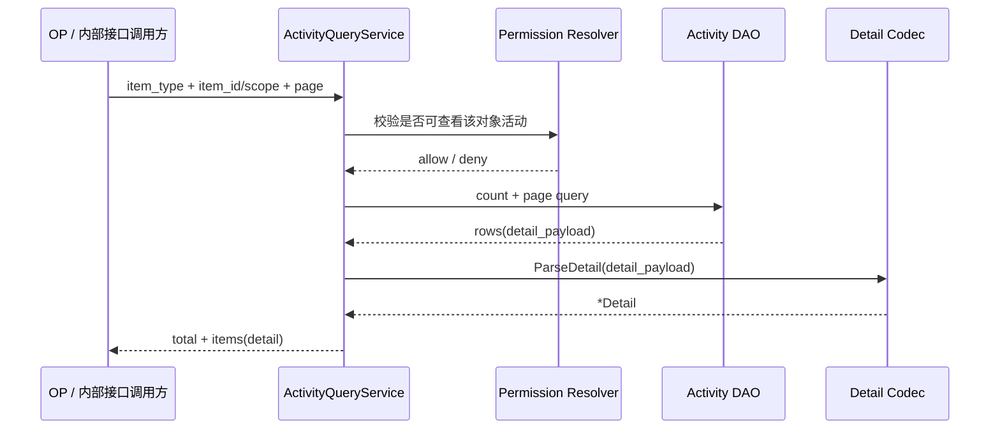
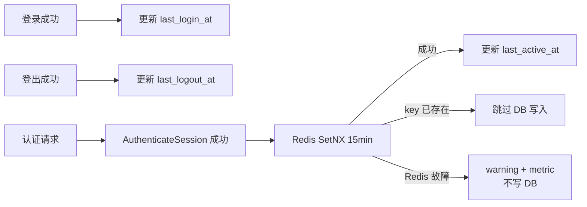
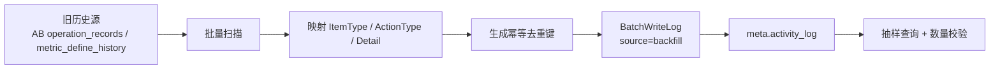

# 技术方案：活动日志 V1 最小闭环

> 统一的活动基础设施，覆盖 project item activity、global item activity、账号活跃字段。
> V1 只做可落地的活动记录闭环：写入、落库、查询、迁移。治理平台化能力只保留扩展点，不进入主实现。

---

## 1. 范围与链路分界

三条可独立实施的链路：

| 链路 | 存储 | 覆盖范围 |
|------|------|---------|
| **项目 item 活动**（主线） | `meta.activity_log` | Chart / Dashboard / Cohort / AB / Metric / Pipeline / Event / Property |
| **Global item 活动** | `global.activity_log` | 组织/项目生命周期、成员管理、Account API Token |
| **账号活跃字段** | `global.account` 表 3 列 | last_login_at / last_logout_at / last_active_at |

**OP 操作记录**（`global.op_operation_log`）维持现状不变，OP 人员配置操作继续走既有链路。

分界原则：OP 人员在 OP 后台的操作走 `op_operation_log`；客户（含组织管理员）在业务系统中的操作走 `global.activity_log`。

### 1.1 首批对象范围

| 类别 | 对象 |
|------|------|
| 资产对象 | `chart` / `dashboard` / `cohort` / `experiment` / `feature_gate` / `feature_config` / `pipeline` / `campaign` |
| 元数据对象 | `metric` / `tracked_event` / `virtual_event` / `event_property` / `user_property` / `virtual_property` |
| Global item | `organization` / `project` / `org_member` / `project_member` / `account_api_token` / `account` |

### 1.2 非目标

- V1 不做官方产品端的新通用活动 UI（仅保留 AB / Metric 既有查看能力，其余走 OP / 内部接口）
- V1 不优先支持按 `operator_id`、按组织范围、按跨项目的活动分析
- V1 不从 `asset_behavior` 反推活动历史（其本质不是可靠活动源）
- V1 不做分区、TTL、审批、告警、可见性策略、复杂 redaction registry、`activity_log_target` 查询投影
- V1 不先做通用审计平台；只做业务活动日志的标准落点和最小查询闭环

---

## 2. 整体架构

### 2.1 三层架构

| 层 | 职责 | 代码位置 |
|----|------|---------|
| **业务 service** | 读旧快照 → 执行变更 → 读新快照 → 投影原始值 + 声明规则 → 调用 ActivityService | 业务域 service 包 |
| **activity 模块** | 接收原始投影 + 规则 → ChangesBetween → ApplyMaskRules → 补齐 operator → 敏感字段兜底 → 序列化 → 写入 | `service/activity/` |
| **存储层** | `meta.activity_log`（INTEGER PK）/ `global.activity_log`（BIGINT PK），两表结构一致 | DAO + PG |

边界规则：业务 service 决定"写不写"和"阻不阻塞"，activity 模块只执行写入策略。

### 2.2 写入流水线

活动日志写入在业务侧视角只有**四步**，Detail 构造由 ActivityService 统一完成。

| 步骤 | 谁执行 | 发生了什么 | 场景差异 |
| --- | --- | --- | --- |
| ① **业务执行** | 业务 service | 读旧值 → DB 变更 → 读新值 | Create: 无旧值；Update: 有旧+新；Delete: 有旧无新 |
| ② **投影 + 规则声明** | 业务 service | DAO struct → 投影为原始 `map[string]any`（不脱敏）；声明脱敏函数和 extra | 三场景共用同一投影函数；Create 的 old=nil，Delete 的 new=nil |
| ③ **调用写入** | 业务 service | `WriteLog` / `BatchWriteLog`，传原始投影 + 规则 | PolicyKey 由注册声明 |
| ④ **处理结果** | 业务 service | `err != nil` 时按 WritePolicy 决策：`required_full` 回滚事务、`required_core` 主行已落可继续、`best_effort` 记 warning | 由 PolicyKey 决定 |

ActivityService 内部（业务不感知）：校验 → `ChangesBetween(oldProj, newProj)` → 按声明对敏感字段 ApplyMaskRules → 补齐 operator/source → 敏感字段兜底拦截 → Delete 时自动捕获 snapshot = oldProj→ 组装 Detail → 序列化 → INSERT。

> **关于脱敏**：脱敏在 ChangesBetween **之后**做。原因是：投影时脱敏会丢失敏感字段的变更事件（old/new 都被抹成 `"***"`，ChangesBetween 认为没变）。先投影原始值 → 检测到变更 → 再抹值，才能同时保留"敏感字段被改了"的事实和防止敏感值泄露。详见 §6.4。

以下三个示例展示完整的数据流：从业务投影 → WriteInput → ActivityService 构造 → 序列化落盘。

---

#### 示例 A：更新账号手机号（Update + 脱敏）

**场景**：用户 "张三" 在个人设置中将手机号从 `13800138000` 改为 `13900139000`。

**Step ①-②: 投影原始值**

```go
oldProj = map[string]any{
    "name":  "张三",
    "phone": "13800138000",    // 原始值，不脱敏
}

newProj = map[string]any{
    "name":  "张三",
    "phone": "13900139000",    // 原始值，不脱敏
}
```

**Step ③: 调用 WriteLog**

```go
svc.WriteLog(ctx, activity.WriteInput{
    ItemType:      "account",
    ItemID:        1024,
    ItemName:      "张三",
    ActionType:    "update",
    PolicyKey:     "account.update_profile",
    OldProjection: oldProj,
    NewProjection: newProj,
    MaskRules: activity.MaskRules{
        "phone": func(v any) any {
            s := v.(string)
            return s[:3] + "****" + s[len(s)-4:]   // "138****8000"
        },
    },
})
```

**ActivityService 内部执行：**

ChangesBetween(oldProj, newProj) → `"name"` 未变化，`"phone"` 变化：
```json
[
  {"field": "phone", "action": "changed", "before": "13800138000", "after": "13900139000"}
]
```

ApplyMaskRules → `"phone"` 命中 `MaskRules`，脱敏后：
```json
[
  {"field": "phone", "action": "changed", "before": "138****8000", "after": "139****9000"}
]
```

序列化 → INSERT → `detail_payload`：
```json
{"changes":[{"field":"phone","action":"changed","before":"138****8000","after":"139****9000"}]}
```

> 脱敏后仍能看出号码确实变了（138→139），但看不到完整号码。变更事件不丢、隐私值已抹。

**Step ④: 处理结果**

PolicyKey `account.update_profile` → WritePolicy `required_core` → 主行已落，detail 失败时记 warning 不阻塞业务。

---

#### 示例 B：AB Experiment 发布（多字段变更 + extra）

**场景**：实验 "new_checkout" 从 RUNNING 发布为 RELEASED。伴随状态、流量、分桶等多个字段同时变更。

**Step ①-②: 投影原始值**

```go
oldProj = map[string]any{
    "status":      "RUNNING",
    "enabled":     true,
    "traffic":     30,
    "bucket":      "slot_7",
    "bucket_bits": 10,
}

newProj = map[string]any{
    "status":       "RELEASED",
    "enabled":      true,
    "traffic":      100,
    "release_plan": []map[string]any{
        {"step": 1, "traffic": 30, "duration_min": 60},
        {"step": 2, "traffic": 60, "duration_min": 60},
        {"step": 3, "traffic": 100},
    },
    "bucket":       "",
    "bucket_bits":  0,
}
```

**Step ③: 调用 WriteLog**

```go
svc.WriteLog(ctx, activity.WriteInput{
    ItemType:      "experiment",
    ItemID:        15,
    ItemName:      "new_checkout",
    ActionType:    "update",
    PolicyKey:     "ab.release",
    OldProjection: oldProj,
    NewProjection: newProj,
    Extra:         map[string]any{"transition": "running_to_released"},
    // 无敏感字段，MaskRules 为空
})
```

**ActivityService 内部执行：**

ChangesBetween(oldProj, newProj) → `"enabled"` 未变化，其余 4 个字段变更：
```json
[
  {"field": "status",       "action": "changed", "before": "RUNNING",   "after": "RELEASED"},
  {"field": "traffic",      "action": "changed", "before": 30,          "after": 100},
  {"field": "release_plan", "action": "created", "after": [{"step":1,"traffic":30,"duration_min":60},{"step":2,"traffic":60,"duration_min":60},{"step":3,"traffic":100}]},
  {"field": "bucket",       "action": "changed", "before": "slot_7",    "after": ""},
  {"field": "bucket_bits",  "action": "changed", "before": 10,          "after": 0}
]
```

ApplyMaskRules → MaskRules 为空，跳过。组装 Extra。

序列化 → INSERT → `detail_payload`：
```json
{
  "changes": [
    {"field": "status",       "action": "changed", "before": "RUNNING", "after": "RELEASED"},
    {"field": "traffic",      "action": "changed", "before": 30,        "after": 100},
    {"field": "release_plan", "action": "created", "after": [{"step":1,"traffic":30,"duration_min":60},{"step":2,"traffic":60,"duration_min":60},{"step":3,"traffic":100}]},
    {"field": "bucket",       "action": "changed", "before": "slot_7",  "after": ""},
    {"field": "bucket_bits",  "action": "changed", "before": 10,        "after": 0}
  ],
  "extra": {"transition": "running_to_released"}
}
```

> `release_plan` 是一个嵌套数组，ChangesBetween 不区分标量和嵌套，直接记录全量 before/after。受 64KB 预算约束。

**Step ④: 处理结果**

PolicyKey `ab.release` → WritePolicy `required_full` → 如果 `err != nil` 则返回 error 回滚事务。

---

#### 示例 C：批量删除 Chart（BatchWriteLog + Delete → 自动捕获快照）

**场景**：用户选中 3 张图表批量删除——折线图（ID=101，v3，属于 dashboard #5/#8）、柱状图（ID=102，v1）、饼图（ID=103，v5）。

**Step ①-②: 投影**（delete 场景只需 old 投影，投影 = 我关心的全部字段）

```go
// Chart #101 — DAU趋势，存在于 2 个 Dashboard 中
oldProj_101 = map[string]any{
    "name":          "DAU趋势",
    "type":          "line",
    "version":       3,
    "dashboard_ids": []int64{5, 8},
}

// Chart #102 — 新增用户
oldProj_102 = map[string]any{
    "name":          "新增用户",
    "type":          "bar",
    "version":       1,
    "dashboard_ids": []int64{},
}

// Chart #103 — 来源分布
oldProj_103 = map[string]any{
    "name":          "来源分布",
    "type":          "pie",
    "version":       5,
    "dashboard_ids": []int64{5},
}
```

**Step ③: 调用 BatchWriteLog**

```go
svc.BatchWriteLog(ctx, []activity.WriteInput{
    {ItemType: "chart", ItemID: 101, ItemName: "DAU趋势", ActionType: "delete",
     PolicyKey: "chart.delete", OldProjection: oldProj_101},
    {ItemType: "chart", ItemID: 102, ItemName: "新增用户", ActionType: "delete",
     PolicyKey: "chart.delete", OldProjection: oldProj_102},
    {ItemType: "chart", ItemID: 103, ItemName: "来源分布", ActionType: "delete",
     PolicyKey: "chart.delete", OldProjection: oldProj_103},
})
// 同批共享 correlation_id，任意一条失败 → 整体 error，业务事务回滚。
```

**ActivityService 内部执行：**

`ActionType == "delete"` → 不跑 ChangesBetween（没必要），直接将 oldProj 捕获为 snapshot。

序列化 → INSERT：
```json
// Row 1
{"snapshot":{"name":"DAU趋势","type":"line","version":3,"dashboard_ids":[5,8]}}
// Row 2
{"snapshot":{"name":"新增用户","type":"bar","version":1,"dashboard_ids":[]}}
// Row 3
{"snapshot":{"name":"来源分布","type":"pie","version":5,"dashboard_ids":[5]}}
```

> Delete 时 changes[] 无意义（对象已删、字段级 `{action:"deleted"}` 是噪音）。规则：`Create → changes(nil, newProj)`，`Update → changes(oldProj, newProj)`，`Delete → snapshot(oldProj)`，由 ActionType 自动推导，业务方只管投影。

**Step ④: 处理结果**

PolicyKey `chart.delete` → WritePolicy `required_full` → 任一失败则整体返回 error，业务事务回滚。

### 2.3 设计原则

| 原则 | 说明 |
|------|------|
| **最小语义集合** | 每条记录只记录 `item_type + item_id + action_type + detail`，不承载业务的完整 state |
| **Troubleshooting First** | 索引、字段取舍优先服务对象历史排查，不优先做分析型报表 |
| **Attribution by Default** | 默认保留 who / what / when / source / detail，责任链路完整 |
| **V1 Small Core** | 只做写入、落库、查询、迁移，不提前做审计平台 |
| **展示快照** | `item_name` / `operator_name` 写入时快照，不回写历史 |
| **TEXT 存储** | V1 使用 `TEXT`，不使用 PG `JSONB`；默认 readable JSON |
| **投影一视同仁** | `ChangesBetween` 不区分标量和嵌套——所有字段记录 before/after 全量，受 64KB 预算约束 |
| **脱敏在 diff 后** | 投影提供原始值 → ChangesBetween 检测变更 → ApplyMaskRules 抹值。不在投影阶段脱敏 |
| **Envelope 三容器** | `changes[]` = 字段级 diff（Create/Update 场景）；`snapshot` = 投影全量（仅 Delete）；`extra` = 语义标记（辅）。由 ActionType 硬编码，不由 PolicyKey 配置 |

## 3. 数据模型

### 3.1 meta.activity_log（project schema）

| 字段 | 类型 | 约束 | 说明 |
|------|------|------|------|
| `id` | BIGSERIAL | PK | |
| `item_type` | VARCHAR(64) | NOT NULL | 活动域自有类型，全小写，不沿用 `def.AssetType` |
| `item_id` | INTEGER | NOT NULL | meta schema 对象使用 INTEGER PK |
| `item_name` | VARCHAR(255) | NOT NULL DEFAULT '' | 写入时展示快照 |
| `action_type` | VARCHAR(32) | NOT NULL | `create / update / delete / copy`；扩展动作须统一注册 |
| `operator_id` | INTEGER | NOT NULL | 操作人 ID，不设外键。系统操作（无真实用户）填 0 |
| `operator_name` | VARCHAR(255) | NOT NULL DEFAULT '' | 写入时展示快照。系统操作填空字符串 |
| `source` | VARCHAR(32) | NOT NULL DEFAULT '' | `web / openapi / internal / backfill` |
| `correlation_id` | VARCHAR(64) | NOT NULL DEFAULT '' | 跨对象关联标识，基础设施自动生成或继承上下文 |
| `detail_payload` | TEXT | NOT NULL DEFAULT '{}' | 稳定 JSON envelope；V1 不使用 PG JSONB；查询返回解析后 `detail` |
| `occurred_at` | TIMESTAMPTZ | NOT NULL | 事件发生时间（历史迁移时回填原始事件时间） |
| `created_at` | TIMESTAMPTZ | NOT NULL DEFAULT CURRENT_TIMESTAMP | 入库时间 |

```sql
-- meta schema 的 item_id/operator_id 使用 INTEGER，与 meta 表主键类型一致。
CREATE TABLE IF NOT EXISTS meta.activity_log (
    id              BIGSERIAL    PRIMARY KEY,
    item_type       VARCHAR(64)  NOT NULL,
    item_id         INTEGER      NOT NULL,
    item_name       VARCHAR(255) NOT NULL DEFAULT '',
    action_type     VARCHAR(32)  NOT NULL,
    operator_id     INTEGER      NOT NULL,
    operator_name   VARCHAR(255) NOT NULL DEFAULT '',
    source          VARCHAR(32)  NOT NULL DEFAULT '',
    correlation_id  VARCHAR(64)  NOT NULL DEFAULT '',
    detail_payload  TEXT         NOT NULL DEFAULT '{}',
    occurred_at     TIMESTAMPTZ  NOT NULL,
    created_at      TIMESTAMPTZ  NOT NULL DEFAULT CURRENT_TIMESTAMP
);

CREATE INDEX idx_activity_log_item ON meta.activity_log (item_type, item_id, occurred_at DESC);
```

说明：
- 表在 project schema（meta）内，`project_id` 列冗余，不设
- `occurred_at` 与 `created_at` 语义明确区分

### 3.2 global.activity_log（web global schema）

结构同 `meta.activity_log`，仅 ID 类型使用 `BIGINT`（与 global schema PK 类型对齐）：

```sql
CREATE TABLE IF NOT EXISTS global.activity_log (
    id              BIGSERIAL    PRIMARY KEY,
    item_type       VARCHAR(64)  NOT NULL,
    item_id         BIGINT       NOT NULL,    -- global schema 对象使用 BIGINT PK
    item_name       VARCHAR(255) NOT NULL DEFAULT '',
    action_type     VARCHAR(32)  NOT NULL,
    operator_id     BIGINT       NOT NULL,    -- global schema 账号使用 BIGINT PK
    operator_name   VARCHAR(255) NOT NULL DEFAULT '',
    source          VARCHAR(32)  NOT NULL DEFAULT '',
    correlation_id  VARCHAR(64)  NOT NULL DEFAULT '',
    detail_payload  TEXT         NOT NULL DEFAULT '{}',
    occurred_at     TIMESTAMPTZ  NOT NULL,
    created_at      TIMESTAMPTZ  NOT NULL DEFAULT CURRENT_TIMESTAMP
);
```

**索引**：
- `(item_type, item_id, occurred_at DESC)`
- `(operator_id, occurred_at DESC)`

### 3.3 枚举规范

所有常量统一定义在 `activity/types.go`。命名使用字符串类型（非 int），自描述。

所有常量的**字符串值**统一为全小写。规则只一条：活动日志枚举值一律小写。

**ItemType** — 全小写，与 Go 常量标识符（PascalCase）区分：

```go
// Go 常量标识符保持 PascalCase，字符串值全小写
// 资产对象
ItemTypeChart           = "chart"
ItemTypeDashboard       = "dashboard"
ItemTypeCohort          = "cohort"
ItemTypeExperiment      = "experiment"
ItemTypeFeatureGate     = "feature_gate"
ItemTypeFeatureConfig   = "feature_config"
ItemTypePipeline        = "pipeline"
ItemTypeCampaign        = "campaign"

// 元数据对象
ItemTypeMetric          = "metric"
ItemTypeTrackedEvent    = "tracked_event"
ItemTypeVirtualEvent    = "virtual_event"
ItemTypeEventProperty   = "event_property"
ItemTypeUserProperty    = "user_property"
ItemTypeVirtualProperty = "virtual_property"

// Global schema item
ItemTypeOrganization    = "organization"
ItemTypeProject         = "project"
ItemTypeOrgMember       = "org_member"
ItemTypeProjectMember   = "project_member"
ItemTypeAccount         = "account"
ItemTypeAccountAPIToken = "account_api_token"
```

**ActionType** — 全小写描述性字符串：

```go
ActionTypeCreate = "create"
ActionTypeUpdate = "update"
ActionTypeDelete = "delete"
ActionTypeCopy   = "copy"
```

扩展原则：只有当 `item_type + detail` 不足表达语义时，才允许统一注册扩展 action_type。未注册字符串在 `WriteLog` / `BatchWriteLog` 入口直接拒绝。

注册流程：
1. 业务 owner 提交注册说明（动作名、适用 ItemType、无法用基础动作 + detail 表达的理由）
2. 活动模块 owner 审核命名，避免近义词分裂（如 `publish` / `release` / `online`）
3. 同一 PR 补齐：常量定义、detail 最小 schema、迁移映射、单测和接入示例

**Source** — 全小写：

```go
SourceWeb      = "web"       // 用户通过 Web 界面操作
SourceOpenAPI  = "openapi"   // 用户通过 OpenAPI/MCP 接口操作
SourceInternal = "internal"  // 系统内部操作（冲突解决、迁移回调等）
SourceBackfill = "backfill"  // 历史迁移回填
```

### 3.4 关键约定

- `item_name` / `operator_name` 是**写入时展示快照**——对象删除或操作人改名后仍可追溯，历史不回写
- `occurred_at` = 活动事件时间，`created_at` = 入库时间
- V1 不记录 IP 地址（`operator_id` 在排障场景已够用）
- V1 不引入 `detail_version`（serializer/parser 兼容由活动模块统一维护）

---

## 4. Detail 规范

### 4.1 Envelope 结构

```json
// Update 场景：changes + extra
{
  "changes": [{"field": "name", "action": "changed", "before": "旧名称", "after": "新名称"}],
  "extra": {"transition": "online"}
}

// Create 场景：changes（初始字段清单）
{
  "changes": [
    {"field": "name", "action": "created", "after": "DAU趋势"},
    {"field": "type", "action": "created", "after": "line"}
  ]
}

// Delete 场景：snapshot（删前投影全量）
{
  "snapshot": {"name": "DAU趋势", "type": "line", "version": 3, "dashboard_ids": [5, 8]}
}
```

三个顶层容器的语义定位和约束见 [§6.6](#66-detail-envelope-三容器语义)。简短总结：

- `changes` — 字段级 before/after diff，Update 的主路径，Create 的初始字段清单
- `snapshot` — 投影全量，Delete 场景自动捕获 oldProj，事后追溯"删了什么"
- `extra` — 业务语义标记（如 `transition:"online"`），非字段变更

**Change 结构**：

| 字段 | 类型 | 必填 | 说明 |
|------|------|------|------|
| `field` | string | 是 | 变更的字段名（稳定字段名，非 GORM 字段名） |
| `action` | string | 是 | `created` / `changed` / `deleted` |
| `before` | any | 否 | 旧值（首次创建时为 null） |
| `after` | any | 否 | 新值（被删除时为 null） |

### 4.2 场景示例

changes 和 snapshot 的产出规则由 **ActionType 硬编码**，不由 PolicyKey 配置——ActionType 是语义，PolicyKey 管策略（写失败怎么处理），两者职责不同。也不需要业务方传参声明。

| ActionType | ActivityService 产出 | 说明 |
|------------|---------------------|------|
| `create` | `changes[]` — `ChangesBetween(nil, newProj)` | 初始字段清单 |
| `update` | `changes[]` — `ChangesBetween(oldProj, newProj)` | 仅差异字段 |
| `delete` | `snapshot` — `oldProj` 全量 | 删前全貌，不要字段级 `{action:"deleted"}` |
| `copy` | `extra` — 来源对象信息 | changes 通常为空（新对象已独立记录 create） |

**create** — 初始字段清单：
```json
{"changes": [
  {"field": "name", "action": "created", "after": "新图表"},
  {"field": "type", "action": "created", "after": "line"}
]}
```

**update** — 仅变更字段：
```json
{"changes": [
  {"field": "name", "action": "changed", "before": "旧名称", "after": "新名称"}
]}
```

**delete** — 删前投影全量，不跑 ChangesBetween：
```json
{"snapshot": {"name": "旧图表", "type": "line", "version": 7, "dashboard_ids": [1, 2, 3]}}
```

**copy** — extra 记录来源：
```json
{"extra": {"source_item_id": 123, "source_item_name": "原始名称"}}
```

**AB 状态变更** — update + extra，和标准 update 一致：
```json
{
  "changes": [
    {"field": "status", "action": "changed", "before": "DRAFT", "after": "RUNNING"}
  ],
  "extra": {"transition": "online"}
}
```

### 4.3 排除字段体系

三层排除（完整说明和代码落位见 [§6.3](#63-三层排除的落位)）：通用排除在 `ChangesBetween` 内部硬编码 → 按类型排除靠投影函数自然排除 → 变更级别排除在调用时通过 `SkipNoiseFields` 传入。

### 4.4 敏感字段处理

V1 不做复杂 redaction registry。原则是：敏感字段默认不进入 `Detail`；确实需要展示线索时，由业务 service 写入已脱敏值，ActivityService 只做最后的安全兜底。

| 字段 | 处理 |
|------|------|
| 邮箱 | 复用 `ulog.MaskEmail()`，保留首字符 + `***` |
| 密码/密钥/token | 不读 DB 明文，`before`/`after` 统一写 `"masked"` |
| Account API Token 原文 | 永不进入活动 detail、日志或持久化 payload |
| `token_hash` | 不进入 `Detail` |
| `token_hint` | 可作为 `extra` 或 snapshot 线索，但不得扩大长度或反推原 token |
| Integration 敏感配置 | V1 默认不接入；后续接入前先定义字段 allowlist |
| Webhook/endpoint 含凭据 | 默认不进入 `Detail`；如必须进入，先在业务代码中剔除凭据片段 |
| OAuth client credentials | 不进入 `Detail` |
| `last_used_at` | 默认不进入 update diff，避免使用行为噪音污染管理操作历史 |

活动模块提供 `MaskedValue = "***"` 常量作为自定义 `MaskFunc` 返回值。V1 不尝试读取或恢复实际敏感值。

---

## 5. 写入模型

### 5.1 核心类型定义

所有类型统一定义在活动的 `types.go`。

```go
package activity

// ——— Detail 类型 ———
type Detail struct {
    Changes  []Change       `json:"changes,omitempty"`
    Extra    map[string]any `json:"extra,omitempty"`
    Snapshot map[string]any `json:"snapshot,omitempty"`
}

type Change struct {
    Field  string `json:"field"`
    Action string `json:"action"` // "created" | "changed" | "deleted"
    Before any    `json:"before,omitempty"`
    After  any    `json:"after,omitempty"`
}

const ChangeCreated = "created"
const ChangeChanged = "changed"
const ChangeDeleted = "deleted"

// 脱敏规则声明：字段名 → 脱敏函数。可用内置函数（MaskValue/MaskEmail）或自定义。
type MaskRules map[string]func(rawValue any) any

// ——— ActivityService 接口 ———
// ItemType 已在 registry 中声明所属 schema，Service 内部自动推导目标表。
// 调用方不需要区分 meta.activity_log 还是 global.activity_log。
type Service interface {
    WriteLog(ctx context.Context, input WriteInput) error
    BatchWriteLog(ctx context.Context, inputs []WriteInput) error
    ListByQuery(ctx context.Context, query Query) ([]Item, int64, error)
}

// ——— 写入输入 ———
// 业务方传原始投影 + 规则声明，ActivityService 统一完成 ChangesBetween、脱敏、Detail 组装。
type WriteInput struct {
    ItemType      string
    ItemID        int64
    ItemName      string    // 写入时快照，为空时从业务对象自动补齐
    ActionType    string
    PolicyKey     string    // 已注册接入场景（不落库），用于解析 WritePolicy

    // 标准路径：ActivityService 内部执行 ChangesBetween → ApplyMaskRules → 组装 Detail
    OldProjection map[string]any   // 投影原始值，Create 为 nil
    NewProjection map[string]any   // 投影原始值，Delete 为 nil
    MaskRules     MaskRules        // 字段名 → 脱敏函数
    Extra         map[string]any   // 业务语义标记（见下方 Extra 约束）

    // 快捷路径：迁移/回填等特殊场景，跳过 ChangesBetween + ApplyMaskRules
    PreBuiltChanges []Change

    OccurredAt    *time.Time // 为空时取 time.Now()
    CorrelationID string     // 为空时自动生成 UUID
    // OperatorID/OperatorName/Source 不在 input 中作为可选字段暴露
    // ActivityService 统一从 ctx 解析并覆盖；回填场景通过 WithContext 模式设置
}

// ——— 查询 ———
// 与 WriteLog 一样，ItemType 在 registry 中已声明所属 schema（meta/global），
// ListByQuery 内部通过 ItemType 查 registry 推导目标表，调用方不需要指定。
type Query struct {
    ItemType string `json:"item_type"`
    ItemID   int64  `json:"item_id"`
    Page     int    `json:"page"`
    PageSize int    `json:"page_size"`
}

type Item struct {
    ID            int64        `json:"id"`
    ItemType      string       `json:"item_type"`
    ItemID        int64        `json:"item_id"`
    ItemName      string       `json:"item_name"`
    ActionType    string       `json:"action_type"`
    OperatorID    int64        `json:"operator_id"`
    OperatorName  string       `json:"operator_name"`
    Source        string       `json:"source"`
    Detail        *Detail      `json:"detail"` // 已反序列化，非原始 TEXT
    OccurredAt    time.Time    `json:"occurred_at"`
}
```

`OperatorID` / `OperatorName` / `Source` 不在 input 中作为可选字段暴露——ActivityService 内部统一从 ctx 解析并覆盖，调用方不要自行填充。如需覆盖（如迁移回填），使用 `WithActivityContext` 将操作人注入 ctx：

```go
// 回填/migration 场景：ctx 里的操作人是脚本账号，需要覆写为历史操作人
ctx = activity.WithActivityContext(ctx, activity.ActivityContext{
    OperatorID:    oldRecord.OperatorID,      // 历史操作人
    OperatorName:  oldRecord.OperatorName,
    Source:        "backfill",
})

// 后续 WriteLog 将继承 ctx 中的 operator/source
// 普通 Web 请求则自动从请求鉴权中间件解析，无需手动调用
```

`WriteInput.CorrelationID` 为空时 ActivityService 自动生成 UUID；需要跨对象关联时调用方显式传入同一值。

写入目标表由 Service 根据 `ItemType` 注册表自动判断，调用方不感知 `meta.activity_log` 与 `global.activity_log` 的差异。

### 5.2 调用方视角

业务方只需把 DAO struct 投影为原始 `map[string]any`，声明脱敏规则，交给 ActivityService：

```go
// 业务传原始投影 + 规则，ActivityService 统一构造
input := activity.WriteInput{
    OldProjection: oldProj,               // 原始值，不脱敏
    NewProjection: newProj,               // 原始值，不脱敏
    MaskRules: activity.MaskRules{        // 字段名 → 脱敏函数
        "token_hash": func(v any) any { return "***" },
        "email":      activity.MaskEmail,
    },
    Extra: map[string]any{"ab_action": "RELEASE"},
}
```

谁负责什么：

| 模块 | 负责 |
|------|------|
| 业务 service | 在正确事务点读取 old/new 快照；投影为 `map[string]any`；声明脱敏规则；填写 `Extra` |
| ActivityService | 接收原始投影 + 规则 → `ChangesBetween` → `ApplyMaskRules` → 组装 `*Detail` → 校验 → 序列化 → 落库 |

内置脱敏函数：

| 函数 | 效果 |
|------|------|
| `func(v any) any { return "***" }` | 固定占位值替换 |
| `activity.MaskEmail` | 保留首字符 + `***`（如 `a***@example.com`） |
| `activity.MaskTruncate(maxLen)` | 截断到指定长度 |

关键约束：
- **业务原始 struct 不直接进入 ActivityService**。业务方必须将 DAO struct 投影为 `map[string]any`，再填进 `WriteInput.OldProjection`/`NewProjection`。
- **投影保留原始值**（敏感字段也不脱敏）——ChangesBetween 需要真实值才能正确检测变更。脱敏在 ActivityService 内部 `ChangesBetween → ApplyMaskRules` 的顺序完成。
- **`PreBuiltChanges` 快捷路径**：用于迁移/回填等场景，跳过 ChangesBetween 和 ApplyMaskRules，直接使用已造好的 changes。V1 只有 backfill 场景走此路径。
- 如果只有噪音字段变化，ChangesBetween 返回空列表，ActivityService 自动跳过写入。

### 5.3 写入流程（ActivityService 内部）

```text
WriteLog(ctx, input)
│
├─ ① 校验 ItemType / ActionType / PolicyKey 已注册且 scope 匹配
├─ ② 从 ctx 解析 operator / source / correlation_id，补齐展示快照
│
├─ ③ 构造 Detail
│   ├─ (a) PreBuiltChanges 非空 → 直接用（快捷路径）
│   └─ (b) 标准路径：
│       ├─ ChangesBetween(input.OldProjection, input.NewProjection)
│       ├─ ApplyMaskRules(changes, input.MaskRules)
│       └─ 组装 Detail{Changes, Extra}；Delete 时捕获 Snapshot=oldProj
│
├─ ④ 敏感字段兜底拦截（拒绝敏感字段名进入 detail）
├─ ⑤ 64KB 预算检查 + TEXT 序列化
├─ ⑥ 按 PolicyKey 取得 WritePolicy
├─ ⑦ DAO INSERT
└─ ⑧ 记录 metrics/log，按 policy 返回 error/warning/nil
```

### 5.4 写入失败策略（轻量映射）

V1 保留 `PolicyKey`，但它只是稳定接入场景名，不是复杂策略系统。业务 owner 在接入时注册该场景的失败返回行为；ActivityService 只负责按注册表执行，调用方不能在运行时自由传策略。

```go
// policy.go

type WritePolicy string

const (
    WritePolicyRequiredFull WritePolicy = "required_full"
    WritePolicyRequiredCore WritePolicy = "required_core"
    WritePolicyBestEffort   WritePolicy = "best_effort"
)

// ActivityPolicyKey 是稳定接入场景名，不由调用方运行时指定
type ActivityPolicyKey string

// 全局注册表，包加载时由业务模块 register 填充
var policyRegistry = map[ActivityPolicyKey]WritePolicy{}

func RegisterPolicy(key ActivityPolicyKey, policy WritePolicy) {
    if _, ok := policyRegistry[key]; ok {
        panic(fmt.Sprintf("activity: duplicate policy key: %s", key))
    }
    policyRegistry[key] = policy
}

func resolvePolicy(key ActivityPolicyKey) (WritePolicy, bool) {
    p, ok := policyRegistry[key]
    return p, ok
}
```

| 策略 | 活动主行 | detail_payload | 返回语义 |
|------|---------|---------------|----------|
| `required_full` | 失败→返回 error | 失败→返回 error | 调用方通常应让业务事务失败 |
| `required_core` | 失败→返回 error | 失败→降级 detail + warning | 调用方通常只要求主活动行存在 |
| `best_effort` | 失败→warning | 失败→warning | 调用方通常不阻塞主业务 |

核心字段定义为：`item_type, item_id, action_type, operator_id, source, occurred_at`。

**注册机制**：

每个 PolicyKey 在 `init()` 中注册一次，未注册 key 在写入入口直接拒绝：

```go
// service/activity/policy.go — 初始注册表（示例）

const (
    PolicyChartUpdate      ActivityPolicyKey = "chart.update"
    PolicyChartDelete      ActivityPolicyKey = "chart.delete"
    PolicyDashboardUpdate  ActivityPolicyKey = "dashboard.update"
    PolicyMetricUpdate     ActivityPolicyKey = "metric.update"
    PolicyAbStatusOnline   ActivityPolicyKey = "ab.status_online"
    PolicyAbRelease        ActivityPolicyKey = "ab.release"
    PolicyActivityBackfill ActivityPolicyKey = "activity.backfill"

    // Global item
    PolicyOrgMemberCreate  ActivityPolicyKey = "org_member.create"
    PolicyAccountAPITokenUpdate ActivityPolicyKey = "account_api_token.update"
)

func init() {
    RegisterPolicy(PolicyChartUpdate,      WritePolicyRequiredCore)
    RegisterPolicy(PolicyChartDelete,      WritePolicyRequiredFull)
    RegisterPolicy(PolicyDashboardUpdate,  WritePolicyRequiredCore)
    RegisterPolicy(PolicyMetricUpdate,     WritePolicyRequiredCore)
    RegisterPolicy(PolicyAbStatusOnline,   WritePolicyRequiredFull)
    RegisterPolicy(PolicyAbRelease,        WritePolicyRequiredFull)
    RegisterPolicy(PolicyActivityBackfill, WritePolicyBestEffort)

    RegisterPolicy(PolicyOrgMemberCreate,  WritePolicyRequiredCore)
    RegisterPolicy(PolicyAccountAPITokenUpdate, WritePolicyRequiredCore)
}
```

维护方式：
- 每个接入点定义自己的 `ActivityPolicyKey` 常量；策略值由业务 owner 在接入 PR 中声明
- ActivityService 只审核命名、返回语义和测试覆盖，不替业务决策策略强度
- 未注册 key 在写入入口直接拒绝，异常时由 write-only feature flag 兜底关闭写入
- 策略变更走代码评审，不允许调用方运行时随意切换

**注册保障**：`WriteLog` 入口拒绝未注册 key 是最后防线，但防护太晚。真正的保障是 init-time test——用反射遍历所有 `ActivityPolicyKey` 常量，断言每个都调了 `RegisterPolicy`。业务方加新 key 忘注册 → 测试直接失败。

**V1 初始示例**：

| PolicyKey | 策略 | 原因 |
|-----------|------|------|
| `ab.status_online` / `ab.release` | `required_full` | 状态发布风险高，缺活动直接影响排障与责任链 |
| `dashboard.update` / `metric.update` | `required_core` | 主活动行必须有，detail 可降级 |
| `activity.backfill` | `best_effort` | 不应因历史回填阻断迁移任务 |

删除、权限、成员管理等场景不预设强弱，接入时由对应业务 owner 明确。

### 5.5 批量写入原子性

- 同一业务事务内的多条活动记录，通过 `BatchWriteLog` 一次性写入
- `required_full` / `required_core` 下：任一核心字段写入失败 → 整体返回 error；是否回滚业务事务由调用方事务边界决定
- `best_effort` 下：失败折入 warning，不影响业务事务
- 同批活动记录自动共享 `correlation_id`
- 单次 `BatchInsert` 不超过 **500 行**，超出由调用方自行分批

### 5.6 为什么不采用 CDC / Outbox / Trigger

| 方案 | 排除理由 |
|------|----------|
| DB Trigger | 看不到业务语义、操作人、source、状态机意图 |
| CDC / WAL 订阅 | 适合数据同步，不适合生成审计语义；难以拿到请求上下文和稳定 detail 投影 |
| Outbox | 增加投递、重试、幂等和延迟治理；V1 主诉求是对象历史立即可排障，引入 outbox 过早复杂化 |

V1 采用显式 `WriteLog` / `BatchWriteLog`。Outbox、分区和 TTL 放入后续扩展讨论，不进入主实现。

---

## 6. Detail 构造：旧值、投影、排除与脱敏

> 业务方负责读旧值 → 投影为原始 map；ActivityService 统一完成 ChangesBetween → ApplyMaskRules → 组装 Detail。

### 6.1 旧值从哪来

**大部分 Update 方法本来就有一条"读旧值"的代码**——用于权限校验、乐观锁、或业务判断。

```go
func (s *MetricService) UpdateMetric(ctx, id, req) error {
    metric := s.dao.Get(id)             // ← 本来就有的读，不是为了 activity log
    if metric.OrgID != userOrg(ctx) {   //    权限校验，复用这个读取
        return ErrForbidden
    }
    // ... 业务变更 ...
}
```

Activity log 复用的就是这次读，不是额外多查一次。关键理解：**不是"为了写日志加读"，而是"本来就读了，顺手投影"。**

**如果方法本来没有读（直接调 dao.Update 的薄方法）：**

```go
func (s *MetricService) PauseSchedule(ctx, id uint64) error {
    return s.dao.UpdateField(id, "schedule_status", "paused")
}
```

这种情况需要增加一次"预热读"——在执行变更之前读一次当前值。不改 DAO、不改事务边界，只在方法体开头加一行 `s.dao.Get(id)`。

**改动评估：**

| 方法类型 | 改动量 | 具体 |
|---------|--------|------|
| 已有 `dao.Get` 的 Update | +3 行 | 在 Get 后加投影；在 Update 后加新值投影 + 写入 |
| 没有 `dao.Get` 的 Update | +4 行 | 预热读 + 投影 + 写入 |
| Create | +3 行 | Create 返回 model 后，投影 + 写入（无旧值） |
| Delete | +2 行 | Delete 前投影 + 写入（无需新值） |

接入成本在每点 3-10 行代码，不改 DAO 层、不改 DB schema、不改已有事务边界。

### 6.2 投影函数定义在哪

每个接入点在自己的 service 包下定义 projection 函数，与业务代码同包：

```
metric/
├── metric_service.go       ← 业务方法
├── projection.go           ← metricProjection
chart/
├── chart_service.go
├── projection.go           ← chartProjection
```

**投影 = 天然的排除声明。** 不写进 projection map 的字段，ChangesBetween 就不会记录。

```go
// 例：metric/projection.go
func metricProjection(m *Metric) map[string]any {
    return map[string]any{
        "name":      m.Name,
        "define":    m.Define,
        "precision": m.Precision,
        // ↓ 以下字段没有写进 projection map，自然排除
        // last_calculated_at, run_at, created_at, updated_at, version
    }
}
```

### 6.3 三层排除的落位

| 层级 | 范围 | 实现位置 | 维护者 |
|------|------|---------|--------|
| 通用排除 | 全类型 | `ChangesBetween` 内部固定 | activity 模块 |
| 按类型排除 | 按 ItemType | 投影函数——不投影 = 排除 | 各业务 service |
| 变更级别排除 | 特定字段 | 调用时传入 `SkipNoiseFields` | 各业务 service |

**通用排除字段写在 ChangesBetween 内部：**

```go
// service/activity/changes_between.go
var commonExcludedKeys = map[string]bool{
    "id": true, "created_at": true, "updated_at": true,
    "created_by": true, "last_modified_by": true,
    "version": true, "lock_version": true,
}

func ChangesBetween(old, new_ map[string]any) ([]Change, error) {
    // 收集所有 key（去重），跳过 commonExcludedKeys 中的字段
    keys := map[string]bool{}
    for k := range old { if !commonExcludedKeys[k] { keys[k] = true } }
    for k := range new_ { if !commonExcludedKeys[k] { keys[k] = true } }
    // 对每个 key 比较 old/new 值，生成 Change 列表
    // ...
}
```

**为什么通用排除放在 ChangesBetween 而不是投影函数里：**
- 通用排除是安全兜底——即使投影函数不小心把 `version` 写进了 map，ChangesBetween 也会忽略
- 一处修改全局生效，不需要在每个投影函数里重复

### 6.4 敏感字段在哪脱敏

**两层防护：**

**第一层（主要防线）——业务方声明 `MaskRules`：**

投影函数**保留原始值**（不脱敏）：

```go
// apitoken/projection.go（示意）
func accountAPITokenProjection(t *AccountAPIToken) map[string]any {
    return map[string]any{
        "name":       t.Name,
        "role":       t.Role,
        "token_hash": t.TokenHash,  // ← 原始值！不脱敏。准确 diff 的前提
        "hint":       t.Hint,
    }
}
```

调用时声明脱敏规则，由 ActivityService 统一执行：

```go
// 调用处：CreateToken / UpdateToken
input := WriteInput{
    OldProjection: oldProj,
    NewProjection: newProj,
    MaskRules: activity.MaskRules{
        "token_hash": activity.MaskValue("***"),  // → 所有值替换为 "***"
    },
    // ...
}
```

内置脱敏函数见 §5.2。业务方也可自定义：

```go
MaskRules: activity.MaskRules{
    "email": func(raw any) any {
        s := raw.(string)
        if len(s) == 0 { return s }
        return string(s[0]) + "***@" + strings.SplitN(s, "@", 2)[1]
    },
}
```

**为什么不在投影中脱敏：** 投影时把 `token_hash` 写成 `"***"`，ChangesBetween 看到 old 和 new 都是 `"***"` → 认为没变 → 丢失"token_hash 被改了"这个事件。投影保留原始值 → ChangesBetween 检测到变更 → ApplyMaskRules 抹值，三件事分离，既保留变更事件又防止敏感值泄露。

**第二层（兜底防线）——ActivityService 字段名拦截：**

```go
// service/activity/sensitive.go
// 即使业务方忘了声明 MaskRules，ActivityService 也拒绝以下字段名进入 detail
var sensitiveFieldNames = map[string]bool{
    "password": true, "secret": true, "token": true,
    "token_hash": true, "encrypted": true, "credential": true,
    "private_key": true, "api_key": true,
}
```

第二层在写入流程（§5.3 第 ④ 步）执行：如果投影 map 的 key 命中了此列表，拒绝写入并返回 error。这是最后一道防线，不应依赖。

### 6.5 三种场景代码模板

三个模板的共同模式：业务方只做**投影 + 调用 Write**，ChangesBetween / ApplyMaskRules 由 ActivityService 内部完成。

#### Create（无旧值，old=nil）

```go
func (s *MetricService) CreateMetric(ctx, req) (*Metric, error) {
    metric, err := s.dao.Create(req)
    if err != nil {
        return nil, err
    }

    newProj := metricProjection(metric)        // 投影（原始值），old=nil
    writeErr := s.activitySvc.WriteLog(ctx, activity.WriteInput{
        ItemType:      "metric",
        ItemID:        metric.ID,
        ItemName:      metric.Name,
        ActionType:    "create",
        PolicyKey:     PolicyMetricCreate,
        NewProjection: newProj,                 // ActivityService 内部 ChangesBetween(nil, newProj)
        MaskRules:     activity.MaskRules{...}, // 有敏感字段时声明
    })
    // WritePolicy 决定 writeErr 是否返回
    if writeErr != nil && policyRegistry[PolicyMetricCreate] == WritePolicyRequiredFull {
        return nil, writeErr
    }
    return metric, nil
}
```

#### Update（old + new 双投影）

```go
func (s *MetricService) UpdateMetric(ctx, id, req) error {
    // ① 读旧值（复用业务本来就有的读）
    old := s.dao.Get(id)
    if old.OrgID != userOrg(ctx) {
        return ErrForbidden
    }

    oldProj := metricProjection(old)           // ② old 投影（原始值）

    if err := s.dao.Update(id, req); err != nil { // ③ 业务变更
        return err
    }

    cur := s.dao.Get(id)                       // ④ 读新值
    newProj := metricProjection(cur)           // ⑤ new 投影（原始值）

    err := s.activitySvc.WriteLog(ctx, activity.WriteInput{
        ItemType:      "metric",
        ItemID:        cur.ID,
        ItemName:      cur.Name,
        ActionType:    "update",
        PolicyKey:     PolicyMetricUpdate,
        OldProjection: oldProj,                // ActivityService 内部 ChangesBetween(oldProj, newProj)
        NewProjection: newProj,
    })
    if err != nil {
        // WritePolicy 决定是否回滚业务事务
        if policyRegistry[PolicyMetricUpdate] == WritePolicyRequiredFull {
            return err
        }
        slog.Warn("activity log best-effort failed", "err", err)
    }
    return nil
}
```

> **事务说明**：`dao.Get(①)` → `dao.Get(④)` 必须在同一个事务连接上执行，才能保证④读到的是③刚写入的值。调用方需要将事务连接透传到 dao 方法中（Wave 现有模式是用 `tx *gorm.DB` 或在 ctx 中携带事务）。

#### Delete（删除前投影，new=nil）

```go
func (s *MetricService) DeleteMetric(ctx, id) error {
    old := s.dao.Get(id)              // 删除前读
    oldProj := metricProjection(old)  // 删除前投影（原始值）

    if err := s.dao.Delete(id); err != nil {
        return err
    }

    // new=nil → ActivityService 内部 ChangesBetween(oldProj, nil)
    // changes 全部为 {action: "deleted", before: 值}

    err := s.activitySvc.WriteLog(ctx, activity.WriteInput{
        ItemType:      "metric",
        ItemID:        old.ID,
        ItemName:      old.Name,
        ActionType:    "delete",
        PolicyKey:     PolicyMetricDelete,
        OldProjection: oldProj,
    })
    // ...
}
```

### 6.6 Detail Envelope 三容器语义

`detail` 的 JSON envelope 固定为三个顶层容器，每个有明确的定位和约束：

| 容器 | 定位 | 谁构造 | 使用场景 | 稳定性契约 |
| --- | --- | --- | --- | --- |
| `changes[]` | **字段级 before/after diff** | `ChangesBetween` 自动生成 | Create/Update 场景 | keys = 投影字段名（稳定）；before/after = 当时值（自包含，不依赖未来 schema） |
| `snapshot` | **投影全量** | ActivityService 按 ActionType 自动捕获：仅 Delete 产生（oldProj），Create/Update 不产生 | 需要了解被删除对象删除前的最后状态时 | keys = 投影字段名（稳定） |
| `extra` | **轻量业务语义标记** | 业务方手写 | 标记操作类型（如 `ab_action:"RELEASE"`）、触发条件（如 `trigger:"schedule"`）、关联信息 | 仅用于标记"不属于 DAO 投影的操作上下文"；值应为历史稳定的简单类型（string/number/bool）；key 必须在活动模块注册 |

**核心规则：**

1. **`changes[]` 和 `snapshot` 互斥。** Create → ChangesBetween(nil, newProj) 输出 changes[]（初始字段清单）；Update → ChangesBetween(oldProj, newProj) 输出 changes[]（差异字段）；Delete → 不跑 ChangesBetween，oldProj 作为 snapshot 落盘。由 ActionType 硬编码，不由 PolicyKey 配置。

2. **`extra` 不得承载字段变更信息。** 如果一条信息是字段的新值/旧值，它就应该进投影 → changes[]。extra 只放"不属于任何 DAO 字段的上下文"。反例：不要在 extra 里写 `{"name_before":"foo","name_after":"bar"}`——这应该在 changes[] 里。

3. **`extra` 的 key 注册制。** 新增 extra key 需要和新增 action_type 一样走注册评审，说明 key 名、值类型、值的变化预期、历史兼容方案。注册位置在 `activity/extra_keys.go`。

4. **历史兼容。** `extra` 的值应对未来 reader 友好——使用稳定枚举串而不是业务内部 ID。未知 key 或未知值不应导致 reader 崩溃，展示原文即可。

5. **64KB 预算共享。** `changes[]` + `snapshot` + `extra` 合并受 64KB 约束。extra 不应包含大嵌套结构——如果 extra 内容超过 1KB，说明信息应该进投影。

### 6.7 配置归属总结

| 配置 | 定义位置 | 维护者 | 说明 |
|------|---------|--------|------|
| 通用排除字段 | `service/activity/changes_between.go` | activity 模块 | `ChangesBetween` 内部固定，全类型有效 |
| 投影函数（按类型排除） | `service/<type>/projection.go` | 各业务 service | 不投影 = 自然排除 |
| `MaskRules` 声明 | 各业务 service 调用处 | 各业务 service | 选内置函数或自定义；按字段名匹配投影 key |
| 敏感字段兜底名单 | `service/activity/sensitive.go` | activity 模块 | 写入前拒绝未脱敏字段名 |
| WritePolicy | `service/activity/policy.go` | 业务 owner + activity 审核 | `init()` 中注册 |
| ItemType 白名单 | `service/activity/registry.go` | 接入时加一行 + review | 声明 type → 所属 schema（meta/global） |

**新增一个接入点的最小 checklist：**

```
 1. 在 service/<type>/projection.go 写投影函数（返回原始值，不脱敏）
 2. 在 service/activity/policy.go 注册 PolicyKey + WritePolicy
 3. 在 service/activity/registry.go 加一行 ItemType 白名单（如未加过）
 4. 在业务方法中插入投影 + 调用 Write（+3~4 行，按需声明 MaskRules）
```

### 6.8 权责边界

| 模块 | 负责 | 不负责 |
|------|------|--------|
| 业务 service | 读 old/new 快照 → 投影为原始 `map[string]any` → 声明 `MaskRules`/`Extra` → 调用 `WriteLog` → 按 Policy 处理结果 | 调 `ChangesBetween`、调 `ApplyMaskRules`、拼 `detail_payload` |
| ActivityService | `ChangesBetween` → `ApplyMaskRules` → 按 ActionType 捕获 Snapshot → 组装 Detail → 序列化 → INSERT → 按 PolicyKey 返回 error/warning | 理解各业务 struct 含义 |
| `ChangesBetween` | 比较两投影 map、生成 `[]Change`、跳过通用排除字段 | 持有业务事务、读业务表、理解业务 struct |

---

## 7. 查询接口

### 7.1 项目 item 查询

**Request**：
```json
{
  "item_type": "chart",
  "item_id": 123,
  "page": 1,
  "page_size": 20
}
```

**Response**：
```json
{
  "total": 2,
  "items": [
    {
      "id": 9001,
      "item_type": "chart",
      "item_id": 123,
      "item_name": "DAU 趋势",
      "action_type": "update",
      "operator_id": 7,
      "operator_name": "alice",
      "source": "web",
      "detail": {
        "changes": [{"field": "name", "action": "changed", "before": "DAU", "after": "DAU 趋势"}]
      },
      "occurred_at": "2026-06-29T10:00:00+08:00"
    }
  ]
}
```

V1 不承诺：`operator_id` 维度筛选、跨项目检索、全文检索 detail。

查询权限以 OP / 内部排障权限为准，响应中 `detail` 必须保持掩码后的读视图。

### 7.2 Global item 查询

支持按 org / project / account 维度查询（V1 不承诺 operator_id 筛选）：

```json
{
  "org_id": 1,
  "item_type": "org_member",
  "page": 1,
  "page_size": 20
}
```

**查询权限**：
- OP / 内部排障链路可按 org / project / account 查询
- 组织管理员可查看所属 org/project 的 global item 活动
- 账号本人可查看自己的 Account API Token 活动

保留 `total` 的原因：OP / 内部排障需要先判断历史规模再决定是否继续翻页。当前查询是单对象或单维度时间序列，count 成本可控，不为了 V1 先改成 cursor-only。

### 7.3 查询处理流程



查询约束：

- 查询接口只面向 OP / 内部排障或等价受控入口，V1 不提供官方产品通用活动页。
- `detail_payload` parse 失败不能把原始 TEXT 直接暴露给前端；返回降级 detail、记录 error metric，并保留 row 的 who / what / when。
- `total` 与分页列表使用同一过滤条件；排序固定为 `(occurred_at DESC, id DESC)`，避免同一毫秒内顺序不稳定。
- 权限校验可以依赖业务对象或 scope resolver，但活动表读路径不应该反向依赖 detail TEXT。

---

## 8. 项目内对象活动场景目录

以下所有操作写入 `meta.activity_log`。每条记录标注 `action_type`（基础动作），细语义通过 `detail.changes/extra` 表达。注意：表中的 `online/release/stop` 等列在"场景"列的只是业务语义说明，不是额外落库字段。

### 8.1 CHART

| 场景 | action_type | detail.changes[] 最小集合 | extra / 备注 |
|------|------------|---------------------------|--------------|
| 创建 | `create` | `name`, `type`, `query_type`, `api_request`, `config`, `version` | 含初始字段；`config` 需投影控制 |
| 更新 | `update` | 仅变更字段的 before/after | 若只有噪音字段变化则跳过 |
| 删除 | `delete` | 至少 `name` 快照 | `snapshot.version`, `snapshot.dashboard_ids`；读 DB 获取删除前快照 |
| 批量删除 | `delete` × N | 同上，每条一行 | `extra.batch_id`, `extra.batch_index`；`BatchWriteLog` 共享事务 |
| 复制 | `copy` | 可为空 | `extra.source_item_id`, `extra.source_item_name`, `extra.target_name` |

### 8.2 DASHBOARD

| 场景 | action_type | detail.changes[] 最小集合 | extra / 备注 |
|------|------------|---------------------------|--------------|
| 创建 | `create` | `name`, `description`, `version` | 若含初始 chart 则记 `chart_ids` |
| 更新（含 chart/layout） | `update` | `name`, `description`, `chart_ids`, `layout_overrides` 中有变更的字段 | `chart_ids` diff 需处理空集合、重复 ID |
| 仅更新 meta | `update` | `name` 或 `description` 的 before/after | `PatchDashboardMeta` |
| 仅更新 layout | `update` | `layout_overrides` 变更 | `SetDashboardChartLayouts` |
| 添加 Chart | `update` | `chart_ids` before/after | `extra.added_chart_ids`；记在 Dashboard 活动中 |
| 移除 Chart | `update` | `chart_ids` before/after | `extra.removed_chart_ids`；记在 Dashboard 活动中 |
| 删除 | `delete` | 至少 `name` 快照 | `snapshot.version`, `snapshot.chart_count` |
| 批量删除 | `delete` × N | 同上 | `extra.batch_id` |
| 复制 | `copy` | 可为空 | `extra.source_item_id`, `extra.copy_charts`；若 `copyCharts=true` 则每个 Chart 也产一条 |

### 8.3 COHORT

| 场景 | action_type | detail.changes[] 最小集合 | extra / 备注 |
|------|------------|---------------------------|--------------|
| 创建 | `create` | `name`, `description`, `rule_config`, `calc_mode`, `calc_time`, `cohort_version` | `extra.scheduler_job_id` |
| 更新（含规则） | `update` | 变更字段 before/after | 若调度参数变更则记 `extra.scheduler_job_updated` |
| 更新（仅调度） | `update` | `calc_mode`/`calc_time` before/after | `extra.scheduler_job_action: updated/created` |
| 删除 | `delete` | 至少 `name` 快照 | `snapshot.rule_summary`, `extra.scheduler_job_deleted`；读 DB 获取删除前快照 |
| 手动重算 | — | — | **不进入活动表**，是 create/update 内部副作用 |
| 定时重算 | — | — | **不进入活动表**，cron 调度回调，属系统运维日志 |

### 8.4 AB: EXPERIMENT / FEATURE_GATE / FEATURE_CONFIG

三者遵循相同模型，差异在变化字段列表和 extra。

| 场景 | action_type | detail.changes[] 最小集合 | extra / 备注 |
|------|------------|---------------------------|--------------|
| 创建 | `create` | `ffkey`, `name`, `status`, `enabled`, `traffic`, `version` | Experiment 额外 `extra.subject_id`, `extra.layer_id` |
| 更新配置 | `update` | 变更字段 before/after | 若 `details` 变更则仅投影摘要 |
| 状态变更：Debug/Online/Offline | `update` | `status`, `enabled` before/after | `extra.transition`；Online 触冲突解决时补 `extra.conflict_resolution` |
| 状态变更：Delete | `delete` | `status` before/after, 至少 `name` 快照 | `extra.buckets_released`, `extra.references_removed` |
| Release | `update` | `status`, `release_plan` before/after | `extra.transition = "release"`；`extra.release_scope` |
| 复制 | `copy` | 可为空 | `extra.source_item_id`, `extra.source_ffkey` |
| 内部下线（冲突解决） | `update` | `status`, `enabled` before/after | `source=internal`；`extra.transition`, `extra.reason: conflict_resolution`, `extra.conflict_ffkey` |
| 内部删除（冲突解决） | `delete` | `status` before/after, 至少 `name` 快照 | `source=internal`；同上 |

FEATURE_CONFIG 额外：
- **变体变更** → `update`，`changes[]` 含变体字段 before/after，`extra.change_kind = "variant_change"`，`extra.changed_variant_keys`

### 8.5 METRIC

| 场景 | action_type | detail.changes[] 最小集合 | extra / 备注 |
|------|------------|---------------------------|--------------|
| 创建 | `create` | `name`, `description`, `define`, `precision` | `define` 是核心字段 |
| 更新 | `update` | 变更字段 before/after | 若仅 `define` 变更则 `changes=[{field:"define",...}]` |
| 删除 | `delete` | 至少 `name` 快照 | `snapshot.define_summary` |

### 8.6 TRACKED_EVENT / VIRTUAL_EVENT / EVENT_PROPERTY / USER_PROPERTY / VIRTUAL_PROPERTY

所有元数据对象遵循统一模式，差异在 `changes[]` 字段列表：

| 场景 | action_type | detail.changes[] 最小集合 | extra / 备注 |
|------|------------|---------------------------|--------------|
| 创建 | `create` | `name`, `display_name`, `description`, 核心配置字段摘要 | 事件/属性各自字段列表不同 |
| 更新 | `update` | 变更字段 before/after | 含敏感值字段统一掩盖 |
| 删除 | `delete` | 至少 `name` 快照 | `snapshot.display_name`, `snapshot.category/data_type` 等 |

### 8.7 PIPELINE

| 场景 | action_type | detail.changes[] 最小集合 | extra / 备注 |
|------|------------|---------------------------|--------------|
| 创建 | `create` | `name`, `type`, `pipeline_type`, `data_type` | `extra.work`, `extra.data_source_id` |
| 更新 | `update` | 变更字段 before/after | |
| 删除 | `delete` | 至少 `name` 快照 | `snapshot.pipeline_type`, `snapshot.work`；软删除 |
| 停止 | `update` | `exec_status` before/after | `extra.change_kind = "stop"`；`extra.stop_reason` |

**不进入 `activity_log`**：
- Pipeline Process（系统级执行，已有 `exec_info` / `batch_export_run` 跟踪）
- Pipeline callback（AB target 状态同步，属基础设施层状态变更）

### 8.8 CAMPAIGN (MA)

Campaign 现有 `ma_operation_log` 记录状态变更。纳入统一活动模型后，新操作走 `meta.activity_log`，旧历史走迁移。

| 场景 | action_type | detail.changes[] 最小集合 | extra / 备注 |
|------|------------|---------------------------|--------------|
| 创建 | `create` | `name`, `channel`, `trigger_type`, `status` | `extra.audience_type`, `extra.goal_type` |
| 更新配置 | `update` | 变更字段 before/after | |
| 状态变更：Launch | `update` | `status` before/after | `extra.transition = "launch"` |
| 状态变更：Pause | `update` | `status` before/after | `extra.transition = "pause"` |
| 状态变更：Resume | `update` | `status` before/after | `extra.transition = "resume"` |
| 状态变更：Finish | `update` | `status` before/after | `extra.transition = "finish"` |
| 删除 | `delete` | 至少 `name` 快照 | `snapshot` 记录触发类型、渠道等关键配置 |

**不进入 `activity_log`**：
- MA Job 调度执行（cron 回调，属系统运维）
- Audience 重算（系统自动，非人工操作）

**历史迁移**：
- 源：`ma_operation_log`（campaign 状态变更历史）
- 映射：`create` → `create`，`update` → `update`，`launch/pause/resume/finish` → `update`（`extra.transition` 承载语义）
- 幂等去重键：`ma_operation_log` + `campaign_id` + `operation_type` + `operated_at`

### 8.9 明确不记录的操作

| 操作 | 原因 | 替代落点 |
|------|------|---------|
| `asset_behavior` 的 VIEW/MODIFY/DELIVER | 分析/热度用途，非活动语义 | 保持现有表 |
| Cohort 定时重算/清理 | 系统自动运维 | scheduler 日志 |
| AB target pipeline 状态同步 | 基础设施层变更 | V1 不做 |
| AB 调度报告任务创建/停止 | 已在 Experiment 状态变更的 extra 引用 | 不单独成行 |
| Asset 收藏（Add/Remove） | 轻量交互，排障价值低 | 保持现有表 |
| Asset 权限变更 | V1 先不做 | 后续可扩展 |
| 项目成员增删/角色变更 | global item 活动域 | `global.activity_log` |
| 组织成员管理 | global item 活动域 | `global.activity_log` |

---

## 9. Global Item 活动场景目录

以下操作写入 `global.activity_log`。

### 9.1 V1 item_type 与 action_type

| item_type | create | update | delete | 说明 |
|-----------|--------|--------|--------|------|
| `organization` | ✓ | ✓ | ✓ | 初始化、信息修改/配置变更、归档 |
| `org_member` | ✓ | ✓ | ✓ | 添加成员、级别/主管变更、移除；`create` vs `update` 通过先读已有状态判定 |
| `project` | ✓ | ✓ | ✓ | 创建、信息修改/配置变更、删除 |
| `project_member` | ✓ | ✓ | ✓ | 加入项目、角色变更、移出项目 |
| `account_api_token` | ✓ | ✓ | ✓ | 创建、更新 label/scope/expires_at/启用禁用、软删除；refresh 记两条（新 create + 旧 update） |

**V1 不做**：邀请创建/发送/撤回（接受邀请后生效操作写 `activity_log`）、预设角色变更（极低频）、组织级联操作子项（顶层 `delete ORGANIZATION` 已记录）。

### 9.2 Global item 接入要点

每个 global item 接入必须先回答 4 个问题：

| 问题 | 规则 |
|------|------|
| `item_type` 是什么？ | 用业务对象名，不用动作名（如 `project_member`，不是 `ADD_PROJECT_MEMBER`） |
| `item_id` 指向谁？ | 成员类用 `account_id`，组织类用 `org_id`，项目类用 `project_id`，token 类用 token id；复合身份放 `detail.extra` |
| 是否需要批量写？ | 批量用 `BatchWriteLog`，同批共享 `correlation_id` |
| 策略是什么？ | 用 `PolicyKey` 注册，不在调用处传策略 |

**操作人解析**：

| 场景 | 操作人来源 |
|------|-----------|
| Web 用户操作 | `pvctx.Aid(ctx)` / `pvctx.Aname(ctx)` |
| 注册时自动创建组织 | 注册用户本人 |
| Account API Token 管理 | token owner（系统初始化 token 继承 `accountID`） |
| 系统同步 / 回填 | 优先继承触发任务的账号 |

### 9.3 组织成员（4 项）

item_type = `"org_member"`，item_id = `account_id`。

| action_type | 接入位置 | 触发条件 | item_name | detail 最小形态 |
|------------|---------|---------|-----------|----------------|
| `create` | `Upsert` | 成员不存在 | `display_name` | `{"level":"...","role_ids":[...]}` |
| `update` | `BatchUpdateLevel` | level 实际变更 | `display_name` | `{"old_level":"...","new_level":"..."}` |
| `update` | `BatchReplaceSupervisor` | supervisor 集合变更 | `display_name` | `{"change_kind":"supervisor_added"}` 或 `"supervisor_removed"` |
| `delete` | `DeleteByOrgAndAccounts` | 成员被软删除 | `display_name` | `{}` |

**注意**：
- `Upsert` 先读已有状态，无变更不记
- `DeleteByOrgAndAccounts` 级联删除所有项目 membership，只记一条 `ORG_MEMBER delete`
- **Org member 与 Project member 不重复**：`create PROJECT_MEMBER` 是独立的权限授予操作

### 9.4 项目成员（3 项）

item_type = `"project_member"`，item_id = `account_id`。

| action_type | 接入位置 | 触发条件 | item_name | detail 最小形态 |
|------------|---------|---------|-----------|----------------|
| `create` | `BatchUpsert` | 成员在项目中不存在 | `display_name` | `{"roles":[...]}` |
| `update` | `BatchUpdateRoles` | 角色实际变更 | `display_name` | `{"old_roles":[...],"new_roles":[...]}` |
| `delete` | `BatchDeleteByProjectAndAccounts` | 成员被移出项目 | `display_name` | `{}` |

`UpdateAccountProjectAuths`（全量同步跨项目授权）：视作一条 `action_type=update, item_type=ORG_MEMBER`，detail 含变更摘要（涉及项目数、成员数）。

### 9.5 组织/项目生命周期（6 项）

| action_type | item_type | item_id | 接入位置 | item_name | detail 最小形态 |
|------------|-----------|---------|---------|-----------|----------------|
| `create` | `organization` | org_id | `Init` | org name | `{"creator_id":<id>}` |
| `update` | `organization` | org_id | 信息/配置变更入口 | org name | 按 diff 记录变更字段 |
| `delete` | `organization` | org_id | `Archive` | org name | `{"status_before":"active","status_after":"archived"}` |
| `create` | `project` | project_id | `Create` | project name | `{"org_id":<id>}` |
| `update` | `project` | project_id | 信息/配置变更入口 | project name | 按 diff 记录变更字段 |
| `delete` | `project` | project_id | `Archive` | project name | `{"org_id":<id>}` |

### 9.6 Account API Token（5 项）

item_type = `"account_api_token"`，item_id = token id。

接入点对应 controller → service → DAO 三层，由业务方按实际代码结构确定。

| action_type | 接入位置 | 触发条件 | item_name | detail 最小形态 |
|------------|---------|---------|-----------|----------------|
| `create` | `CreateTokenWithExpiry` / `CreateTokenNoQuotaWithExpiry` | 创建成功 | token label | `changes` 记录 `label/status/scopes/expires_at` 初始值 |
| `update` | `UpdateTokenWithExpiry` | label/scopes/expires_at 实际变更 | token label | 变更字段 before/after |
| `update` | `EnableToken` / `DisableToken` / `DisableByRawToken` | status 实际变更 | token label | `changes: [{"field":"status","before":"ACTIVE","after":"DISABLED"}]` |
| `update` | `RefreshToken` | 新 token 创建并禁旧 token | new token label | `extra.refresh_from_token_id`；与旧 token status update 共享 `correlation_id` |
| `delete` | `DeleteToken` | 软删除 | token label | `snapshot` 记录 `status/scopes/expires_at/token_hint` |

敏感字段规则：token 原文永不进入 detail；`token_hash` drop；`token_hint` 可记录但不可反推原 token。

---

## 10. 账号活跃字段

3 个 `TIMESTAMPTZ NULL` 列加在 `global.account` 表，不入 `activity_log`：

```sql
ALTER TABLE global.account
  ADD COLUMN last_login_at  TIMESTAMPTZ DEFAULT NULL,
  ADD COLUMN last_logout_at TIMESTAMPTZ DEFAULT NULL,
  ADD COLUMN last_active_at TIMESTAMPTZ DEFAULT NULL;
```

| 字段 | 写入时机 | 写入方式 |
|------|---------|---------|
| `last_login_at` | 登录成功（密码 + OAuth） | controller 在 `generateToken` 后调用 `accountDao.UpdateFields` |
| `last_logout_at` | 登出成功 | controller 在 `session.Delete` 后调用 `UpdateFields` |
| `last_active_at` | 会话活跃（每个认证请求） | 中间件 `SessionMiddleware` — `AuthenticateSession` 成功后 Redis SetNX 15 分钟节流 |

`last_active_at` 节流策略：
- 每个认证请求 → Redis `SetNX("last_active_throttle:{aid}", 15min)`
  - SetNX 成功 → DB 写一次
  - SetNX 失败 → 跳过，零 DB 开销
- Redis 不可用 → 跳过本次刷新 + warning 日志 + 指标上报，**不降级为每次请求写 DB**

3 个字段均为 NULLABLE，老账号迁移后全部为 NULL。

账号活跃数据流：



这里不写 `activity_log`，因为登录/活跃是账号状态字段，不是某个 item 的业务变更。安全审查若需要登录历史，应另立登录事件或安全日志，不把 `last_active_at` 复用成审计事件流。

---

## 11. 历史迁移

### 11.1 迁移原则

1. 一次性复制旧历史
2. 迁移后查询只读新活动表
3. 升级后新写入只写新活动表
4. 旧字段或旧表保留，不做双写

### 11.2 迁移源

| 历史源 | 迁移到新项目活动 | 原因 |
|--------|----------------|------|
| `ab_feature_flag.details.operation_records` | 是 | AB 唯一真实历史源，必须统一收口 |
| `meta.metric_define_history` | 是 | 明确历史债务，Metric 已纳入统一规范 |
| `meta.asset_behavior` | 否 | 只有 VIEW 有效，不具备可靠活动语义 |
| `global.op_operation_log` | 否 | 作用域不同，继续留在 OP 操作记录链路 |

### 11.3 映射规则

| 源操作 | → action_type |
|--------|-------------|
| AB `CREATE` | `create` |
| AB `UPDATE` / `DEBUG` / `ONLINE` / `OFFLINE` / `RELEASE` / `VARIANT_CHANGE` | `update` |
| AB `COPY` | `copy` |
| AB `DELETE` | `delete` |
| Metric history | `update`，`changes = [{field: "define", before, after}]` |

对历史 AB 记录缺少 before/after 的场景：
- 允许 `changes` 为空
- 必须保留 `name`、`source = "backfill"`、`extra.legacy_source`
- `operator_name` 尽量回填，查不到允许空字符串
- `occurred_at` 直接回填原始操作时间

**幂等去重键**：`legacy_source` + `item_type` + `item_id` + `legacy_action_type` + `operator_id` + `occurred_at`

### 11.4 Chart/Dashboard/Cohort/Event/Property

该类对象**当前没有可靠旧操作历史源**，不从 `asset_behavior` 或访问记录伪造历史。上线后从新表开始连续记账。

### 11.5 迁移数据流



迁移闭环要求：

- 回填必须走 activity 模块的 serializer，不允许脚本直接拼 `detail_payload` SQL。
- `occurred_at` 使用旧历史事件时间，`created_at` 使用回填入库时间。
- 每批回填记录 `legacy_source`，便于问题排查和回滚识别。
- 迁移完成后，AB / Metric 的历史查询入口只读新活动表；旧表/旧字段保留但不再作为在线查询源。
- 验证至少包含总量对账、重复执行幂等、抽样 detail 可读、按对象查询能串起旧历史四项。

### 11.6 具体迁移脚本示例

#### AB operation_records 提取

AB 历史存储在 `ab_feature_flag.details` 的 JSONB `operation_records` 数组中。每条记录的原始结构：

```json
{
  "action": "UPDATE",
  "name": "someone@example.com",
  "timestamp": 1680000000,
  "old_value": "...",
  "new_value": "..."
}
```

**SQL 提取**（分批扫描，避免全表锁）：

```sql
-- 每批 500 条
SELECT
    f.id              AS feature_flag_id,
    f.name            AS flag_name,
    f.type            AS flag_type,       -- 'gate' | 'config' | 'exp'
    jsonb_array_elements(f.details->'operation_records') AS record
FROM ab_feature_flag f
WHERE f.id > :last_id
  AND f.details->'operation_records' IS NOT NULL
  AND jsonb_array_length(f.details->'operation_records') > 0
ORDER BY f.id
LIMIT 500;
```

**Go 映射伪代码**：

```go
type ABOperationRecord struct {
    Action    string `json:"action"`
    Name      string `json:"name"`      // operator_name
    Timestamp int64  `json:"timestamp"` // occurred_at (unix)
    OldValue  string `json:"old_value"`
    NewValue  string `json:"new_value"`
}

func mapABRecordToActivity(flagID int64, flagName, flagType string, rec ABOperationRecord) (*activity.WriteInput, error) {
    actionType := mapABAction(rec.Action)

    var changes []activity.Change
    if rec.OldValue != "" || rec.NewValue != "" {
        changes, _ = activity.ChangesBetween(
            map[string]any{"value": rec.OldValue},
            map[string]any{"value": rec.NewValue},
        )
    }

    return &activity.WriteInput{
        ItemType:         itemTypeForABFlag(flagType),
        ItemID:           flagID,
        ItemName:         flagName,
        ActionType:       actionType,
        PolicyKey:        string(activity.PolicyActivityBackfill),
        PreBuiltChanges:  changes,                        // 迁移走快捷路径
        Extra:            map[string]any{
            "legacy_source":      "ab_feature_flag.details.operation_records",
            "legacy_flag_type":   flagType,
            "legacy_action_type": rec.Action,
        },
        OccurredAt:       time.Unix(rec.Timestamp, 0),
    }, nil
}

func mapABAction(action string) string {
    switch action {
    case "CREATE":         return "create"
    case "UPDATE", "DEBUG", "ONLINE", "OFFLINE",
         "RELEASE", "VARIANT_CHANGE": return "update"
    case "COPY":           return "copy"
    case "DELETE":         return "delete"
    default:               return "update" // fallback
    }
}

func itemTypeForABFlag(flagType string) string {
    switch flagType {
    case "gate":   return "feature_gate"
    case "config": return "feature_config"
    case "exp":    return "experiment"
    default:       return "experiment"
    }
}
```

#### Metric define_history 提取

```sql
SELECT
    mdh.id,
    mdh.metric_id,
    m.name            AS metric_name,
    mdh.old_define,
    mdh.new_define,
    mdh.operated_by   AS operator_id,
    mdh.created_at    AS occurred_at
FROM meta.metric_define_history mdh
JOIN meta.metric m ON m.id = mdh.metric_id
WHERE mdh.id > :last_id
ORDER BY mdh.id
LIMIT 500;
```

**Go 映射**：

```go
type MetricHistoryRow struct {
    ID           int64
    MetricID     int64
    MetricName   string
    OldDefine    string
    NewDefine    string
    OperatorID   int64
    OccurredAt   time.Time
}

func mapMetricHistoryToActivity(row MetricHistoryRow) *activity.WriteInput {
    changes, _ := activity.ChangesBetween(
        map[string]any{"define": row.OldDefine},
        map[string]any{"define": row.NewDefine},
    )

    return &activity.WriteInput{
        ItemType:        "metric",
        ItemID:          row.MetricID,
        ItemName:        row.MetricName,
        ActionType:      "update",
        PolicyKey:       string(activity.PolicyActivityBackfill),
        PreBuiltChanges: changes,
        Extra:           map[string]any{"legacy_source": "meta.metric_define_history"},
        OccurredAt:      row.OccurredAt,
    }
}
```

#### 批量回填与幂等控制

```go
func BackfillABHistory(ctx context.Context, batchSize int) (int, error) {
    var lastID int64
    total := 0
    for {
        rows, err := dao.ScanABOperationRecords(ctx, lastID, batchSize)
        if err != nil || len(rows) == 0 {
            break
        }
        lastID = rows[len(rows)-1].FeatureFlagID

        var inputs []activity.WriteInput
        for _, row := range rows {
            input := mapABRecordToActivity(row.FlagID, row.FlagName, row.FlagType, row.Record)
            inputs = append(inputs, *input)
        }

        // 使用 BatchWrite 走统一 SerializeDetail → DAO insert
        // 幂等性由 DB 层 unique index 或写入前按去重键去重保障
        err = activitySvc.BatchWriteLog(ctx, inputs)
        if err != nil {
            return total, fmt.Errorf("batch %d: %w", lastID, err)
        }
        total += len(rows)
    }
    return total, nil
}
```

#### 迁移验证

```sql
-- 总量对账
SELECT COUNT(*) FROM meta.activity_log WHERE source = 'backfill' AND detail_payload LIKE '%"legacy_source":"ab_feature_flag%';

-- 按对象抽样
SELECT * FROM meta.activity_log
WHERE item_type = 'FEATURE_GATE' AND item_id = 15
ORDER BY occurred_at DESC;

-- 幂等校验（重复执行去重键不应该增加记录）
SELECT item_type, item_id, action_type, operator_id, occurred_at, COUNT(*)
FROM meta.activity_log
WHERE source = 'backfill'
GROUP BY item_type, item_id, action_type, operator_id, occurred_at
HAVING COUNT(*) > 1;
```

#### 关闭旧查询入口

迁移完成后，在所有历史查询入口处切换数据源：

```diff
- list := dao.GetABOperationRecords(ctx, flagID)
+ list := activitySvc.ListByQuery(ctx, activity.Query{
+     ItemType: itemTypeForABFlag(flag.Type),
+     ItemID:   flag.ID,
+ })
```

---

## 12. 接入策略

### 12.1 接入 SOP

项目对象接入必须按以下步骤，不能只在某个 service 里临时拼一条 JSON：

| 步骤 | 要做什么 | 产物 |
|------|----------|------|
| 1 | 确认对象身份 | `ItemType`、`item_id`、`item_name` 规则 |
| 2 | 确认动作语义 | 基础 `action_type`；必要时走扩展 action_type 注册流程 |
| 3 | 注册接入场景 | `PolicyKey` |
| 4 | 构造 Detail | 手写 `*Detail` 或使用 `ChangesBetween` 生成 `changes` |
| 5 | 构造 Detail（投影 + 计算 Change 列表） | 固定 `ItemType/ActionType/PolicyKey`，调用方只传业务快照 |
| 6 | 接业务事务 | create 用创建后对象；update/delete 在修改前读旧快照；批量用 `BatchWrite*` |
| 7 | 补验证 | 成功写入、无变更不写、失败策略、查询返回 detail/total |

最小代码形态：

```go
// 项目 item — 传原始投影，ActivityService 做 diff
err = activitySvc.WriteLog(ctx, activity.WriteInput{
    ItemType:      activity.ItemTypeChart,
    ItemID:        chart.ID,
    ItemName:      chart.Name,
    ActionType:    activity.ActionTypeUpdate,
    PolicyKey:     string(activity.PolicyChartUpdate),
    OldProjection: oldProj,                            // 原始值，不脱敏
    NewProjection: newProj,                            // 原始值，不脱敏
    Extra:         map[string]any{"version": chart.Version},
})

// Global item — 手写 changes（无投影函数，少量字段）
err = activitySvc.WriteLog(ctx, activity.WriteInput{
    ItemType:   activity.ItemTypeOrgMember,
    ItemID:     accountID,
    ItemName:   member.DisplayName,
    ActionType: activity.ActionTypeCreate,
    PolicyKey:  string(activity.PolicyOrgMemberCreate),
    PreBuiltChanges: []activity.Change{                // 手写 changes
        {Field: "level", Action: activity.ChangeCreated, After: "member"},
        {Field: "role_ids", Action: activity.ChangeCreated, After: []int64{1, 2}},
    },
    Extra: map[string]any{"org_id": orgID},
})

// Global item — 有敏感字段，声明 MaskRules
err = activitySvc.WriteLog(ctx, activity.WriteInput{
    ItemType:      activity.ItemTypeAccountAPIToken,
    ItemID:        token.ID,
    ItemName:      token.Label,
    ActionType:    activity.ActionTypeUpdate,
    PolicyKey:     string(activity.PolicyAccountAPITokenUpdate),
    OldProjection: oldProj,
    NewProjection: newProj,
    MaskRules:     activity.MaskRules{
        "token_hash": activity.MaskValue("***"),
    },
})
```

### 12.2 主要接入点

| 对象域 | 主要接入方法 |
|--------|-------------|
| Chart | Create / Update / Delete / BatchDelete / Copy |
| Dashboard | Create / Update / PatchMeta / SetLayouts / Delete / BatchDelete / Copy / AddCharts / RemoveCharts |
| Cohort | Create / Update / Delete |
| AB | Create / Update / StatusRelease / StatusOnline / Stop / Copy |
| Metric | Create / Update / Delete |
| Event / Property | Create / Update / Delete |
| Pipeline | Create / Update / Delete / Stop |
| Campaign (MA) | Create / Update / Delete / Launch / Pause / Resume / Finish |
| Org member | Upsert / BatchUpdateLevel / BatchReplaceSupervisor / BatchDelete |
| Project member | BatchUpsert / BatchUpdateRoles / BatchDelete |
| Org lifecycle | Init / Archive / 配置变更 |
| Project lifecycle | Create / 配置变更 / Archive |
| Account API Token | Create / Update / Enable / Disable / Refresh / Delete |

### 12.3 不依赖的基础设施

以下基础设施不能作为活动覆盖的判断标准：

| 基础设施 | 问题 |
|----------|------|
| `AssetOperator` | 只注册了 Chart / Dashboard，接口仅含 CRUD；覆盖不到 Cohort / AB / copy / status_change |
| `asset_behavior` | 主要是 view 行为，modify/delete/add 基本死代码，不是可靠活动系统 |
| AB 自带历史页 | 只能看 AB，且数据嵌在 JSONB 里 |
| Metric history 表 | 只覆盖 define 变更 |
| Pipeline `exec_info` | 仅系统执行日志，不记录谁做了 CRUD |

### 12.4 开发者体验

V1 需提供：

| 文档 | 内容 | 形式 |
|------|------|------|
| ActivityService 接入指南 | 调用契约、必填字段、detail 构建规范、常见错误 | Markdown |
| 对象类型接入模板 | 每个 ItemType 的写入调用示例 | Go 示例代码 |
| WritePolicy 选择指南 | required_full/core/best_effort 适用场景、决策树 | Markdown |
| Detail helper 使用说明 | `ChangesBetween` 调用方式、稳定投影约定、敏感字段禁入规则 | Markdown + 注释 |

测试辅助工具：

| 工具 | 说明 |
|------|------|
| `activitytest.MockService` | 内存实现 ActivityService，不依赖 DB |
| `activitytest.AssertLogWritten` | 断言某条活动记录已被写入 |
| `activitytest.AssertChangesContains` | 断言 detail.changes 包含特定字段变更 |

MockService 行为约定：
- `WriteLog` 默认返回 nil，调用方可配置预期 error（测试写入失败）
- `BatchWriteLog` 默认追加到内存切片，调用方可读取断言
- 不提供与真实 DAO 一致的 mock（那是集成测试的职责）

### 12.5 Write-only Feature Flag

部署时增加 write-only feature flag 保护，异常时可快速关闭活动写入而不影响业务逻辑。

---

## 13. 交付阶段

### Phase 0：基础设施

- 建 `meta.activity_log` 表
- 建 `activity` 域类型、DAO、公共服务、TEXT serializer、轻量 Detail helper
- 建 `PolicyKey` 简单映射和 write-only feature flag
- 建 OP / 内部查询 API
- DAO BatchInsert 上限 500 行
- 打通最小闭环：写入一条项目 item 活动后，可通过查询 API 读回 `total/items/detail`

### Phase 1：高价值对象 + 历史迁移

- 接入 Chart / Dashboard / Cohort
- 接入 Experiment / Feature Gate / Feature Config
- 接入 Metric
- 完成 AB / Metric 历史导入
- 打通对象维度查询闭环（最小可用版本）

### Phase 2：Metadata 长尾对象

- 接入 TRACKED_EVENT / VIRTUAL_EVENT / EVENT_PROPERTY / USER_PROPERTY / VIRTUAL_PROPERTY

### 附加链路

- Global item 活动（与 Phase 1 独立交付）：组织/项目生命周期、成员管理、Account API Token
- 账号活跃字段（独立交付，小而简单）：`last_login_at` / `last_logout_at` / `last_active_at`

不允许把所有 phase 绑成一次总开关上线。

---

## 14. 验证方案

### 14.1 单测

- Detail helper：create/update/delete/copy 四类 envelope、稳定投影比较、敏感字段禁入
- detail 序列化：JSON envelope、超限截断、降级 warning
- 历史迁移映射：AB 操作类型映射、Metric define 映射、空 operator_name 兜底

### 14.2 集成测试

- 核心对象 Chart / Dashboard / Cohort / AB / Metric 的成功路径写活动
- 最小闭环 E2E：执行一次对象 update → 写入活动 → `ListByQuery` 返回同一条记录、`total=1`、detail 可解析
- Phase 2 元数据对象 create/update/delete 写活动
- Global item 活动（组织、项目、成员、token）各操作路径写活动
- 账号活跃字段三个时间戳刷新验证
- `last_active_at` Redis 节流验证（15 分钟内只写一次 DB）
- OP / 内部查询接口分页、排序、过滤；project scope 鉴权、掩码字段读取
- 迁移脚本重复执行的幂等性

### 14.3 故障注入

- 活动 DAO insert 失败（验证 required_full/required_core → 返回 error，best_effort → warning；业务是否回滚由接入点测试覆盖）
- detail 序列化失败（验证 required_full → 返回 error，required_core → 写主行 + 降级 detail，best_effort → warning）
- detail 超大 → 截断 + `extra.truncated_fields`
- operator 信息缺失 → 兜底处理
- 迁移批次重复执行 → 幂等键去重
- OP 查询权限不足 → 拒绝访问
- Redis 不可用 → `last_active_at` 跳过，不倒灌 DB

### 14.4 尚未锁定、需对象 owner 确认的边界

1. Chart `config` 的稳定投影边界
2. Dashboard `layout_overrides` 是否全量记录还是仅记录受影响 chart
3. AB `details` 需要暴露到什么摘要层级

---

## 15. 后续扩展与讨论入口

以下内容不进入 V1 主实现，只保留讨论入口：

- TEXT `detail_payload` 是否启用压缩：见 [discussion.md](./discussion.md) D-P4
- Global 聚合查询是否引入 `activity_log_target`：见 [discussion.md](./discussion.md) D-P5
- 分区、TTL、保留策略、审批/告警/可见性控制：后续按真实查询量和客户需求再开独立方案
