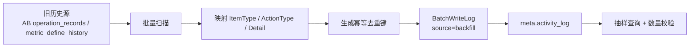

# 活动日志实现参考

> 本文档是 [plan.md](./plan.md) 的实现参考，包含完整示例、代码模板、场景目录、迁移方案和接入 SOP。设计方案请参见 plan.md。

## 1. Pipeline 完整示例

以下三个示例展示完整数据流：从业务投影 → WriteInput → ActivityService 构造 → 序列化落盘。

以下三个示例展示完整的数据流：从业务投影 → WriteInput → ActivityService 构造 → 序列化落盘。

---

#### 示例 A：更新账号手机号（Update + 脱敏）

**场景**：用户 "张三" 在个人设置中将手机号从 `13800138000` 改为 `13900139000`。

**Step ①-②: 投影原始值**

```go
oldProj = map[string]any{
    "name":  "张三",
    "phone": "13800138000",    // 原始值，不脱敏
}

newProj = map[string]any{
    "name":  "张三",
    "phone": "13900139000",    // 原始值，不脱敏
}
```

**Step ③: 调用 WriteLog**

```go
svc.WriteLog(ctx, activity.WriteInput{
    ItemType:      "account",
    ItemID:        1024,
    ItemName:      "张三",
    ActionType:    "update",
    PolicyKey:     "account.update_profile",
    OldProjection: oldProj,
    NewProjection: newProj,
    MaskRules: activity.MaskRules{
        "phone": func(v any) any {
            s := v.(string)
            return s[:3] + "****" + s[len(s)-4:]   // "138****8000"
        },
    },
})
```

**ActivityService 内部执行：**

ChangesBetween(oldProj, newProj) → `"name"` 未变化，`"phone"` 变化：
```json
[
  {"field": "phone", "action": "changed", "before": "13800138000", "after": "13900139000"}
]
```

ApplyMaskRules → `"phone"` 命中 `MaskRules`，脱敏后：
```json
[
  {"field": "phone", "action": "changed", "before": "138****8000", "after": "139****9000"}
]
```

序列化 → INSERT → `detail_payload`：
```json
{"changes":[{"field":"phone","action":"changed","before":"138****8000","after":"139****9000"}]}
```

> 脱敏后仍能看出号码确实变了（138→139），但看不到完整号码。变更事件不丢、隐私值已抹。

**Step ④: 处理结果**

PolicyKey `account.update_profile` → WritePolicy `required_core` → 主行已落，detail 失败时记 warning 不阻塞业务。

---

#### 示例 B：AB Experiment 发布（多字段变更 + extra）

**场景**：实验 "new_checkout" 从 RUNNING 发布为 RELEASED。伴随状态、流量、分桶等多个字段同时变更。

**Step ①-②: 投影原始值**

```go
oldProj = map[string]any{
    "status":      "RUNNING",
    "enabled":     true,
    "traffic":     30,
    "bucket":      "slot_7",
    "bucket_bits": 10,
}

newProj = map[string]any{
    "status":       "RELEASED",
    "enabled":      true,
    "traffic":      100,
    "release_plan": []map[string]any{
        {"step": 1, "traffic": 30, "duration_min": 60},
        {"step": 2, "traffic": 60, "duration_min": 60},
        {"step": 3, "traffic": 100},
    },
    "bucket":       "",
    "bucket_bits":  0,
}
```

**Step ③: 调用 WriteLog**

```go
svc.WriteLog(ctx, activity.WriteInput{
    ItemType:      "experiment",
    ItemID:        15,
    ItemName:      "new_checkout",
    ActionType:    "update",
    PolicyKey:     "ab.release",
    OldProjection: oldProj,
    NewProjection: newProj,
    Extra:         map[string]any{"transition": "running_to_released"},
    // 无敏感字段，MaskRules 为空
})
```

**ActivityService 内部执行：**

ChangesBetween(oldProj, newProj) → `"enabled"` 未变化，其余 4 个字段变更：
```json
[
  {"field": "status",       "action": "changed", "before": "RUNNING",   "after": "RELEASED"},
  {"field": "traffic",      "action": "changed", "before": 30,          "after": 100},
  {"field": "release_plan", "action": "created", "after": [{"step":1,"traffic":30,"duration_min":60},{"step":2,"traffic":60,"duration_min":60},{"step":3,"traffic":100}]},
  {"field": "bucket",       "action": "changed", "before": "slot_7",    "after": ""},
  {"field": "bucket_bits",  "action": "changed", "before": 10,          "after": 0}
]
```

ApplyMaskRules → MaskRules 为空，跳过。组装 Extra。

序列化 → INSERT → `detail_payload`：
```json
{
  "changes": [
    {"field": "status",       "action": "changed", "before": "RUNNING", "after": "RELEASED"},
    {"field": "traffic",      "action": "changed", "before": 30,        "after": 100},
    {"field": "release_plan", "action": "created", "after": [{"step":1,"traffic":30,"duration_min":60},{"step":2,"traffic":60,"duration_min":60},{"step":3,"traffic":100}]},
    {"field": "bucket",       "action": "changed", "before": "slot_7",  "after": ""},
    {"field": "bucket_bits",  "action": "changed", "before": 10,        "after": 0}
  ],
  "extra": {"transition": "running_to_released"}
}
```

> `release_plan` 是一个嵌套数组，ChangesBetween 不区分标量和嵌套，直接记录全量 before/after。受 64KB 预算约束。

**Step ④: 处理结果**

PolicyKey `ab.release` → WritePolicy `required_full` → 如果 `err != nil` 则返回 error 回滚事务。

---

#### 示例 C：批量删除 Chart（BatchWriteLog + Delete → 自动捕获快照）

**场景**：用户选中 3 张图表批量删除——折线图（ID=101，v3，属于 dashboard #5/#8）、柱状图（ID=102，v1）、饼图（ID=103，v5）。

**Step ①-②: 投影**（delete 场景只需 old 投影，投影 = 我关心的全部字段）

```go
// Chart #101 — DAU趋势，存在于 2 个 Dashboard 中
oldProj_101 = map[string]any{
    "name":          "DAU趋势",
    "type":          "line",
    "version":       3,
    "dashboard_ids": []int64{5, 8},
}

// Chart #102 — 新增用户
oldProj_102 = map[string]any{
    "name":          "新增用户",
    "type":          "bar",
    "version":       1,
    "dashboard_ids": []int64{},
}

// Chart #103 — 来源分布
oldProj_103 = map[string]any{
    "name":          "来源分布",
    "type":          "pie",
    "version":       5,
    "dashboard_ids": []int64{5},
}
```

**Step ③: 调用 BatchWriteLog**

```go
svc.BatchWriteLog(ctx, []activity.WriteInput{
    {ItemType: "chart", ItemID: 101, ItemName: "DAU趋势", ActionType: "delete",
     PolicyKey: "chart.delete", OldProjection: oldProj_101},
    {ItemType: "chart", ItemID: 102, ItemName: "新增用户", ActionType: "delete",
     PolicyKey: "chart.delete", OldProjection: oldProj_102},
    {ItemType: "chart", ItemID: 103, ItemName: "来源分布", ActionType: "delete",
     PolicyKey: "chart.delete", OldProjection: oldProj_103},
})
// 同批共享 correlation_id，任意一条失败 → 整体 error，业务事务回滚。
```

**ActivityService 内部执行：**

`ActionType == "delete"` → 不跑 ChangesBetween（没必要），直接将 oldProj 捕获为 snapshot。

序列化 → INSERT：
```json
// Row 1
{"snapshot":{"name":"DAU趋势","type":"line","version":3,"dashboard_ids":[5,8]}}
// Row 2
{"snapshot":{"name":"新增用户","type":"bar","version":1,"dashboard_ids":[]}}
// Row 3
{"snapshot":{"name":"来源分布","type":"pie","version":5,"dashboard_ids":[5]}}
```

> Delete 时 changes[] 无意义（对象已删、字段级 `{action:"deleted"}` 是噪音）。规则：`Create → changes(nil, newProj)`，`Update → changes(oldProj, newProj)`，`Delete → snapshot(oldProj)`，由 ActionType 自动推导，业务方只管投影。

**Step ④: 处理结果**

## 2. 代码模板

### 2.1 三种场景代码模板

三个模板的共同模式：业务方只做**投影 + 调用 Write**，ChangesBetween / ApplyMaskRules 由 ActivityService 内部完成。

#### 2.1.Create（无旧值，old=nil）

```go
func (s *MetricService) CreateMetric(ctx, req) (*Metric, error) {
    metric, err := s.dao.Create(req)
    if err != nil {
        return nil, err
    }

    newProj := metricProjection(metric)        // 投影（原始值），old=nil
    writeErr := s.activitySvc.WriteLog(ctx, activity.WriteInput{
        ItemType:      "metric",
        ItemID:        metric.ID,
        ItemName:      metric.Name,
        ActionType:    "create",
        PolicyKey:     PolicyMetricCreate,
        NewProjection: newProj,                 // ActivityService 内部 ChangesBetween(nil, newProj)
        MaskRules:     activity.MaskRules{...}, // 有敏感字段时声明
    })
    // WritePolicy 决定 writeErr 是否返回
    if writeErr != nil && policyRegistry[PolicyMetricCreate] == WritePolicyRequiredFull {
        return nil, writeErr
    }
    return metric, nil
}
```

#### 2.1.Update（old + new 双投影）

```go
func (s *MetricService) UpdateMetric(ctx, id, req) error {
    // ① 读旧值（复用业务本来就有的读）
    old := s.dao.Get(id)
    if old.OrgID != userOrg(ctx) {
        return ErrForbidden
    }

    oldProj := metricProjection(old)           // ② old 投影（原始值）

    if err := s.dao.Update(id, req); err != nil { // ③ 业务变更
        return err
    }

    cur := s.dao.Get(id)                       // ④ 读新值
    newProj := metricProjection(cur)           // ⑤ new 投影（原始值）

    err := s.activitySvc.WriteLog(ctx, activity.WriteInput{
        ItemType:      "metric",
        ItemID:        cur.ID,
        ItemName:      cur.Name,
        ActionType:    "update",
        PolicyKey:     PolicyMetricUpdate,
        OldProjection: oldProj,                // ActivityService 内部 ChangesBetween(oldProj, newProj)
        NewProjection: newProj,
    })
    if err != nil {
        // WritePolicy 决定是否回滚业务事务
        if policyRegistry[PolicyMetricUpdate] == WritePolicyRequiredFull {
            return err
        }
        slog.Warn("activity log best-effort failed", "err", err)
    }
    return nil
}
```

> **事务说明**：`dao.Get(①)` → `dao.Get(④)` 必须在同一个事务连接上执行，才能保证④读到的是③刚写入的值。调用方需要将事务连接透传到 dao 方法中（Wave 现有模式是用 `tx *gorm.DB` 或在 ctx 中携带事务）。

#### 2.1.Delete（删除前投影，new=nil）

```go
func (s *MetricService) DeleteMetric(ctx, id) error {
    old := s.dao.Get(id)              // 删除前读
    oldProj := metricProjection(old)  // 删除前投影（原始值）

    if err := s.dao.Delete(id); err != nil {
        return err
    }

    // new=nil → ActivityService 内部 ChangesBetween(oldProj, nil)
    // changes 全部为 {action: "deleted", before: 值}

    err := s.activitySvc.WriteLog(ctx, activity.WriteInput{
        ItemType:      "metric",
        ItemID:        old.ID,
        ItemName:      old.Name,
        ActionType:    "delete",
        PolicyKey:     PolicyMetricDelete,
        OldProjection: oldProj,
    })
    // ...
}
```


## 3. 项目内对象活动场景目录


以下所有操作写入 `meta.activity_log`。每条记录标注 `action_type`（基础动作），细语义通过 `detail.changes/extra` 表达。注意：表中的 `online/release/stop` 等列在"场景"列的只是业务语义说明，不是额外落库字段。

### 3.1 CHART

| 场景 | action_type | detail.changes[] 最小集合 | extra / 备注 |
|------|------------|---------------------------|--------------|
| 创建 | `create` | `name`, `type`, `query_type`, `api_request`, `config`, `version` | 含初始字段；`config` 需投影控制 |
| 更新 | `update` | 仅变更字段的 before/after | 若只有噪音字段变化则跳过 |
| 删除 | `delete` | 至少 `name` 快照 | `snapshot.version`, `snapshot.dashboard_ids`；读 DB 获取删除前快照 |
| 批量删除 | `delete` × N | 同上，每条一行 | `extra.batch_id`, `extra.batch_index`；`BatchWriteLog` 共享事务 |
| 复制 | `copy` | 可为空 | `extra.source_item_id`, `extra.source_item_name`, `extra.target_name` |

### 3.2 DASHBOARD

| 场景 | action_type | detail.changes[] 最小集合 | extra / 备注 |
|------|------------|---------------------------|--------------|
| 创建 | `create` | `name`, `description`, `version` | 若含初始 chart 则记 `chart_ids` |
| 更新（含 chart/layout） | `update` | `name`, `description`, `chart_ids`, `layout_overrides` 中有变更的字段 | `chart_ids` diff 需处理空集合、重复 ID |
| 仅更新 meta | `update` | `name` 或 `description` 的 before/after | `PatchDashboardMeta` |
| 仅更新 layout | `update` | `layout_overrides` 变更 | `SetDashboardChartLayouts` |
| 添加 Chart | `update` | `chart_ids` before/after | `extra.added_chart_ids`；记在 Dashboard 活动中 |
| 移除 Chart | `update` | `chart_ids` before/after | `extra.removed_chart_ids`；记在 Dashboard 活动中 |
| 删除 | `delete` | 至少 `name` 快照 | `snapshot.version`, `snapshot.chart_count` |
| 批量删除 | `delete` × N | 同上 | `extra.batch_id` |
| 复制 | `copy` | 可为空 | `extra.source_item_id`, `extra.copy_charts`；若 `copyCharts=true` 则每个 Chart 也产一条 |

### 3.3 COHORT

| 场景 | action_type | detail.changes[] 最小集合 | extra / 备注 |
|------|------------|---------------------------|--------------|
| 创建 | `create` | `name`, `description`, `rule_config`, `calc_mode`, `calc_time`, `cohort_version` | `extra.scheduler_job_id` |
| 更新（含规则） | `update` | 变更字段 before/after | 若调度参数变更则记 `extra.scheduler_job_updated` |
| 更新（仅调度） | `update` | `calc_mode`/`calc_time` before/after | `extra.scheduler_job_action: updated/created` |
| 删除 | `delete` | 至少 `name` 快照 | `snapshot.rule_summary`, `extra.scheduler_job_deleted`；读 DB 获取删除前快照 |
| 手动重算 | — | — | **不进入活动表**，是 create/update 内部副作用 |
| 定时重算 | — | — | **不进入活动表**，cron 调度回调，属系统运维日志 |

### 3.4 AB: EXPERIMENT / FEATURE_GATE / FEATURE_CONFIG

三者遵循相同模型，差异在变化字段列表和 extra。

| 场景 | action_type | detail.changes[] 最小集合 | extra / 备注 |
|------|------------|---------------------------|--------------|
| 创建 | `create` | `ffkey`, `name`, `status`, `enabled`, `traffic`, `version` | Experiment 额外 `extra.subject_id`, `extra.layer_id` |
| 更新配置 | `update` | 变更字段 before/after | 若 `details` 变更则仅投影摘要 |
| 状态变更：Debug/Online/Offline | `update` | `status`, `enabled` before/after | `extra.transition`；Online 触冲突解决时补 `extra.conflict_resolution` |
| 状态变更：Delete | `delete` | `status` before/after, 至少 `name` 快照 | `extra.buckets_released`, `extra.references_removed` |
| Release | `update` | `status`, `release_plan` before/after | `extra.transition = "release"`；`extra.release_scope` |
| 复制 | `copy` | 可为空 | `extra.source_item_id`, `extra.source_ffkey` |
| 内部下线（冲突解决） | `update` | `status`, `enabled` before/after | `source=internal`；`extra.transition`, `extra.reason: conflict_resolution`, `extra.conflict_ffkey` |
| 内部删除（冲突解决） | `delete` | `status` before/after, 至少 `name` 快照 | `source=internal`；同上 |

FEATURE_CONFIG 额外：
- **变体变更** → `update`，`changes[]` 含变体字段 before/after，`extra.change_kind = "variant_change"`，`extra.changed_variant_keys`

### 3.5 METRIC

| 场景 | action_type | detail.changes[] 最小集合 | extra / 备注 |
|------|------------|---------------------------|--------------|
| 创建 | `create` | `name`, `description`, `define`, `precision` | `define` 是核心字段 |
| 更新 | `update` | 变更字段 before/after | 若仅 `define` 变更则 `changes=[{field:"define",...}]` |
| 删除 | `delete` | 至少 `name` 快照 | `snapshot.define_summary` |

### 3.6 TRACKED_EVENT / VIRTUAL_EVENT / EVENT_PROPERTY / USER_PROPERTY / VIRTUAL_PROPERTY

所有元数据对象遵循统一模式，差异在 `changes[]` 字段列表：

| 场景 | action_type | detail.changes[] 最小集合 | extra / 备注 |
|------|------------|---------------------------|--------------|
| 创建 | `create` | `name`, `display_name`, `description`, 核心配置字段摘要 | 事件/属性各自字段列表不同 |
| 更新 | `update` | 变更字段 before/after | 含敏感值字段统一掩盖 |
| 删除 | `delete` | 至少 `name` 快照 | `snapshot.display_name`, `snapshot.category/data_type` 等 |

### 3.7 PIPELINE

| 场景 | action_type | detail.changes[] 最小集合 | extra / 备注 |
|------|------------|---------------------------|--------------|
| 创建 | `create` | `name`, `type`, `pipeline_type`, `data_type` | `extra.work`, `extra.data_source_id` |
| 更新 | `update` | 变更字段 before/after | |
| 删除 | `delete` | 至少 `name` 快照 | `snapshot.pipeline_type`, `snapshot.work`；软删除 |
| 停止 | `update` | `exec_status` before/after | `extra.change_kind = "stop"`；`extra.stop_reason` |

**不进入 `activity_log`**：
- Pipeline Process（系统级执行，已有 `exec_info` / `batch_export_run` 跟踪）
- Pipeline callback（AB target 状态同步，属基础设施层状态变更）

### 3.8 CAMPAIGN (MA)

Campaign 现有 `ma_operation_log` 记录状态变更。纳入统一活动模型后，新操作走 `meta.activity_log`，旧历史走迁移。

| 场景 | action_type | detail.changes[] 最小集合 | extra / 备注 |
|------|------------|---------------------------|--------------|
| 创建 | `create` | `name`, `channel`, `trigger_type`, `status` | `extra.audience_type`, `extra.goal_type` |
| 更新配置 | `update` | 变更字段 before/after | |
| 状态变更：Launch | `update` | `status` before/after | `extra.transition = "launch"` |
| 状态变更：Pause | `update` | `status` before/after | `extra.transition = "pause"` |
| 状态变更：Resume | `update` | `status` before/after | `extra.transition = "resume"` |
| 状态变更：Finish | `update` | `status` before/after | `extra.transition = "finish"` |
| 删除 | `delete` | 至少 `name` 快照 | `snapshot` 记录触发类型、渠道等关键配置 |

**不进入 `activity_log`**：
- MA Job 调度执行（cron 回调，属系统运维）
- Audience 重算（系统自动，非人工操作）

**历史迁移**：
- 源：`ma_operation_log`（campaign 状态变更历史）
- 映射：`create` → `create`，`update` → `update`，`launch/pause/resume/finish` → `update`（`extra.transition` 承载语义）
- 幂等去重键：`ma_operation_log` + `campaign_id` + `operation_type` + `operated_at`

### 3.9 明确不记录的操作

| 操作 | 原因 | 替代落点 |
|------|------|---------|
| `asset_behavior` 的 VIEW/MODIFY/DELIVER | 分析/热度用途，非活动语义 | 保持现有表 |
| Cohort 定时重算/清理 | 系统自动运维 | scheduler 日志 |
| AB target pipeline 状态同步 | 基础设施层变更 | V1 不做 |
| AB 调度报告任务创建/停止 | 已在 Experiment 状态变更的 extra 引用 | 不单独成行 |
| Asset 收藏（Add/Remove） | 轻量交互，排障价值低 | 保持现有表 |
| Asset 权限变更 | V1 先不做 | 后续可扩展 |
| 项目成员增删/角色变更 | global item 活动域 | `global.activity_log` |
| 组织成员管理 | global item 活动域 | `global.activity_log` |

---


以下操作写入 `global.activity_log`。

### 3.10 V1 item_type 与 action_type

| item_type | create | update | delete | 说明 |
|-----------|--------|--------|--------|------|
| `organization` | ✓ | ✓ | ✓ | 初始化、信息修改/配置变更、归档 |
| `org_member` | ✓ | ✓ | ✓ | 添加成员、级别/主管变更、移除；`create` vs `update` 通过先读已有状态判定 |
| `project` | ✓ | ✓ | ✓ | 创建、信息修改/配置变更、删除 |
| `project_member` | ✓ | ✓ | ✓ | 加入项目、角色变更、移出项目 |
| `account_api_token` | ✓ | ✓ | ✓ | 创建、更新 label/scope/expires_at/启用禁用、软删除；refresh 记两条（新 create + 旧 update） |

**V1 不做**：邀请创建/发送/撤回（接受邀请后生效操作写 `activity_log`）、预设角色变更（极低频）、组织级联操作子项（顶层 `delete ORGANIZATION` 已记录）。

### 3.11 Global item 接入要点

每个 global item 接入必须先回答 4 个问题：

| 问题 | 规则 |
|------|------|
| `item_type` 是什么？ | 用业务对象名，不用动作名（如 `project_member`，不是 `ADD_PROJECT_MEMBER`） |
| `item_id` 指向谁？ | 成员类用 `account_id`，组织类用 `org_id`，项目类用 `project_id`，token 类用 token id；复合身份放 `detail.extra` |
| 是否需要批量写？ | 批量用 `BatchWriteLog`，同批共享 `correlation_id` |
| 策略是什么？ | 用 `PolicyKey` 注册，不在调用处传策略 |

**操作人解析**：

| 场景 | 操作人来源 |
|------|-----------|
| Web 用户操作 | `pvctx.Aid(ctx)` / `pvctx.Aname(ctx)` |
| 注册时自动创建组织 | 注册用户本人 |
| Account API Token 管理 | token owner（系统初始化 token 继承 `accountID`） |
| 系统同步 / 回填 | 优先继承触发任务的账号 |

### 3.12 组织成员（4 项）

item_type = `"org_member"`，item_id = `account_id`。

| action_type | 接入位置 | 触发条件 | item_name | detail 最小形态 |
|------------|---------|---------|-----------|----------------|
| `create` | `Upsert` | 成员不存在 | `display_name` | `{"level":"...","role_ids":[...]}` |
| `update` | `BatchUpdateLevel` | level 实际变更 | `display_name` | `{"old_level":"...","new_level":"..."}` |
| `update` | `BatchReplaceSupervisor` | supervisor 集合变更 | `display_name` | `{"change_kind":"supervisor_added"}` 或 `"supervisor_removed"` |
| `delete` | `DeleteByOrgAndAccounts` | 成员被软删除 | `display_name` | `{}` |

**注意**：
- `Upsert` 先读已有状态，无变更不记
- `DeleteByOrgAndAccounts` 级联删除所有项目 membership，只记一条 `ORG_MEMBER delete`
- **Org member 与 Project member 不重复**：`create PROJECT_MEMBER` 是独立的权限授予操作

### 3.13 项目成员（3 项）

item_type = `"project_member"`，item_id = `account_id`。

| action_type | 接入位置 | 触发条件 | item_name | detail 最小形态 |
|------------|---------|---------|-----------|----------------|
| `create` | `BatchUpsert` | 成员在项目中不存在 | `display_name` | `{"roles":[...]}` |
| `update` | `BatchUpdateRoles` | 角色实际变更 | `display_name` | `{"old_roles":[...],"new_roles":[...]}` |
| `delete` | `BatchDeleteByProjectAndAccounts` | 成员被移出项目 | `display_name` | `{}` |

`UpdateAccountProjectAuths`（全量同步跨项目授权）：视作一条 `action_type=update, item_type=ORG_MEMBER`，detail 含变更摘要（涉及项目数、成员数）。

### 3.14 组织/项目生命周期（6 项）

| action_type | item_type | item_id | 接入位置 | item_name | detail 最小形态 |
|------------|-----------|---------|---------|-----------|----------------|
| `create` | `organization` | org_id | `Init` | org name | `{"creator_id":<id>}` |
| `update` | `organization` | org_id | 信息/配置变更入口 | org name | 按 diff 记录变更字段 |
| `delete` | `organization` | org_id | `Archive` | org name | `{"status_before":"active","status_after":"archived"}` |
| `create` | `project` | project_id | `Create` | project name | `{"org_id":<id>}` |
| `update` | `project` | project_id | 信息/配置变更入口 | project name | 按 diff 记录变更字段 |
| `delete` | `project` | project_id | `Archive` | project name | `{"org_id":<id>}` |

### 3.15 Account API Token（5 项）

item_type = `"account_api_token"`，item_id = token id。

接入点对应 controller → service → DAO 三层，由业务方按实际代码结构确定。

| action_type | 接入位置 | 触发条件 | item_name | detail 最小形态 |
|------------|---------|---------|-----------|----------------|
| `create` | `CreateTokenWithExpiry` / `CreateTokenNoQuotaWithExpiry` | 创建成功 | token label | `changes` 记录 `label/status/scopes/expires_at` 初始值 |
| `update` | `UpdateTokenWithExpiry` | label/scopes/expires_at 实际变更 | token label | 变更字段 before/after |
| `update` | `EnableToken` / `DisableToken` / `DisableByRawToken` | status 实际变更 | token label | `changes: [{"field":"status","before":"ACTIVE","after":"DISABLED"}]` |
| `update` | `RefreshToken` | 新 token 创建并禁旧 token | new token label | `extra.refresh_from_token_id`；与旧 token status update 共享 `correlation_id` |
| `delete` | `DeleteToken` | 软删除 | token label | `snapshot` 记录 `status/scopes/expires_at/token_hint` |

敏感字段规则：token 原文永不进入 detail；`token_hash` drop；`token_hint` 可记录但不可反推原 token。

---


## 4. 历史迁移


### 4.1 迁移原则

1. 一次性复制旧历史
2. 迁移后查询只读新活动表
3. 升级后新写入只写新活动表
4. 旧字段或旧表保留，不做双写

### 4.2 迁移源

| 历史源 | 迁移到新项目活动 | 原因 |
|--------|----------------|------|
| `ab_feature_flag.details.operation_records` | 是 | AB 唯一真实历史源，必须统一收口 |
| `meta.metric_define_history` | 是 | 明确历史债务，Metric 已纳入统一规范 |
| `meta.asset_behavior` | 否 | 只有 VIEW 有效，不具备可靠活动语义 |
| `global.op_operation_log` | 否 | 作用域不同，继续留在 OP 操作记录链路 |

### 4.3 映射规则

| 源操作 | → action_type |
|--------|-------------|
| AB `CREATE` | `create` |
| AB `UPDATE` / `DEBUG` / `ONLINE` / `OFFLINE` / `RELEASE` / `VARIANT_CHANGE` | `update` |
| AB `COPY` | `copy` |
| AB `DELETE` | `delete` |
| Metric history | `update`，`changes = [{field: "define", before, after}]` |

对历史 AB 记录缺少 before/after 的场景：
- 允许 `changes` 为空
- 必须保留 `name`、`source = "backfill"`、`extra.legacy_source`
- `operator_name` 尽量回填，查不到允许空字符串
- `occurred_at` 直接回填原始操作时间

**幂等去重键**：`legacy_source` + `item_type` + `item_id` + `legacy_action_type` + `operator_id` + `occurred_at`

### 4.4 Chart/Dashboard/Cohort/Event/Property

该类对象**当前没有可靠旧操作历史源**，不从 `asset_behavior` 或访问记录伪造历史。上线后从新表开始连续记账。

### 4.5 迁移数据流



迁移闭环要求：

- 回填必须走 activity 模块的 serializer，不允许脚本直接拼 `detail_payload` SQL。
- `occurred_at` 使用旧历史事件时间，`created_at` 使用回填入库时间。
- 每批回填记录 `legacy_source`，便于问题排查和回滚识别。
- 迁移完成后，AB / Metric 的历史查询入口只读新活动表；旧表/旧字段保留但不再作为在线查询源。
- 验证至少包含总量对账、重复执行幂等、抽样 detail 可读、按对象查询能串起旧历史四项。

### 4.6 具体迁移脚本示例

#### AB operation_records 提取

AB 历史存储在 `ab_feature_flag.details` 的 JSONB `operation_records` 数组中。每条记录的原始结构：

```json
{
  "action": "UPDATE",
  "name": "someone@example.com",
  "timestamp": 1680000000,
  "old_value": "...",
  "new_value": "..."
}
```

**SQL 提取**（分批扫描，避免全表锁）：

```sql
-- 每批 500 条
SELECT
    f.id              AS feature_flag_id,
    f.name            AS flag_name,
    f.type            AS flag_type,       -- 'gate' | 'config' | 'exp'
    jsonb_array_elements(f.details->'operation_records') AS record
FROM ab_feature_flag f
WHERE f.id > :last_id
  AND f.details->'operation_records' IS NOT NULL
  AND jsonb_array_length(f.details->'operation_records') > 0
ORDER BY f.id
LIMIT 500;
```

**Go 映射伪代码**：

```go
type ABOperationRecord struct {
    Action    string `json:"action"`
    Name      string `json:"name"`      // operator_name
    Timestamp int64  `json:"timestamp"` // occurred_at (unix)
    OldValue  string `json:"old_value"`
    NewValue  string `json:"new_value"`
}

func mapABRecordToActivity(flagID int64, flagName, flagType string, rec ABOperationRecord) (*activity.WriteInput, error) {
    actionType := mapABAction(rec.Action)

    var changes []activity.Change
    if rec.OldValue != "" || rec.NewValue != "" {
        changes, _ = activity.ChangesBetween(
            map[string]any{"value": rec.OldValue},
            map[string]any{"value": rec.NewValue},
        )
    }

    return &activity.WriteInput{
        ItemType:         itemTypeForABFlag(flagType),
        ItemID:           flagID,
        ItemName:         flagName,
        ActionType:       actionType,
        PolicyKey:        string(activity.PolicyActivityBackfill),
        PreBuiltChanges:  changes,                        // 迁移走快捷路径
        Extra:            map[string]any{
            "legacy_source":      "ab_feature_flag.details.operation_records",
            "legacy_flag_type":   flagType,
            "legacy_action_type": rec.Action,
        },
        OccurredAt:       time.Unix(rec.Timestamp, 0),
    }, nil
}

func mapABAction(action string) string {
    switch action {
    case "CREATE":         return "create"
    case "UPDATE", "DEBUG", "ONLINE", "OFFLINE",
         "RELEASE", "VARIANT_CHANGE": return "update"
    case "COPY":           return "copy"
    case "DELETE":         return "delete"
    default:               return "update" // fallback
    }
}

func itemTypeForABFlag(flagType string) string {
    switch flagType {
    case "gate":   return "feature_gate"
    case "config": return "feature_config"
    case "exp":    return "experiment"
    default:       return "experiment"
    }
}
```

#### Metric define_history 提取

```sql
SELECT
    mdh.id,
    mdh.metric_id,
    m.name            AS metric_name,
    mdh.old_define,
    mdh.new_define,
    mdh.operated_by   AS operator_id,
    mdh.created_at    AS occurred_at
FROM meta.metric_define_history mdh
JOIN meta.metric m ON m.id = mdh.metric_id
WHERE mdh.id > :last_id
ORDER BY mdh.id
LIMIT 500;
```

**Go 映射**：

```go
type MetricHistoryRow struct {
    ID           int64
    MetricID     int64
    MetricName   string
    OldDefine    string
    NewDefine    string
    OperatorID   int64
    OccurredAt   time.Time
}

func mapMetricHistoryToActivity(row MetricHistoryRow) *activity.WriteInput {
    changes, _ := activity.ChangesBetween(
        map[string]any{"define": row.OldDefine},
        map[string]any{"define": row.NewDefine},
    )

    return &activity.WriteInput{
        ItemType:        "metric",
        ItemID:          row.MetricID,
        ItemName:        row.MetricName,
        ActionType:      "update",
        PolicyKey:       string(activity.PolicyActivityBackfill),
        PreBuiltChanges: changes,
        Extra:           map[string]any{"legacy_source": "meta.metric_define_history"},
        OccurredAt:      row.OccurredAt,
    }
}
```

#### 批量回填与幂等控制

```go
func BackfillABHistory(ctx context.Context, batchSize int) (int, error) {
    var lastID int64
    total := 0
    for {
        rows, err := dao.ScanABOperationRecords(ctx, lastID, batchSize)
        if err != nil || len(rows) == 0 {
            break
        }
        lastID = rows[len(rows)-1].FeatureFlagID

        var inputs []activity.WriteInput
        for _, row := range rows {
            input := mapABRecordToActivity(row.FlagID, row.FlagName, row.FlagType, row.Record)
            inputs = append(inputs, *input)
        }

        // 使用 BatchWrite 走统一 SerializeDetail → DAO insert
        // 幂等性由 DB 层 unique index 或写入前按去重键去重保障
        err = activitySvc.BatchWriteLog(ctx, inputs)
        if err != nil {
            return total, fmt.Errorf("batch %d: %w", lastID, err)
        }
        total += len(rows)
    }
    return total, nil
}
```

#### 迁移验证

```sql
-- 总量对账
SELECT COUNT(*) FROM meta.activity_log WHERE source = 'backfill' AND detail_payload LIKE '%"legacy_source":"ab_feature_flag%';

-- 按对象抽样
SELECT * FROM meta.activity_log
WHERE item_type = 'FEATURE_GATE' AND item_id = 15
ORDER BY occurred_at DESC;

-- 幂等校验（重复执行去重键不应该增加记录）
SELECT item_type, item_id, action_type, operator_id, occurred_at, COUNT(*)
FROM meta.activity_log
WHERE source = 'backfill'
GROUP BY item_type, item_id, action_type, operator_id, occurred_at
HAVING COUNT(*) > 1;
```

#### 关闭旧查询入口

迁移完成后，在所有历史查询入口处切换数据源：

```diff
- list := dao.GetABOperationRecords(ctx, flagID)
+ list := activitySvc.ListByQuery(ctx, activity.Query{
+     ItemType: itemTypeForABFlag(flag.Type),
+     ItemID:   flag.ID,
+ })
```

---


## 5. 接入 SOP


### 5.1 接入 SOP

项目对象接入必须按以下步骤，不能只在某个 service 里临时拼一条 JSON：

| 步骤 | 要做什么 | 产物 |
|------|----------|------|
| 1 | 确认对象身份 | `ItemType`、`item_id`、`item_name` 规则 |
| 2 | 确认动作语义 | 基础 `action_type`；必要时走扩展 action_type 注册流程 |
| 3 | 注册接入场景 | `PolicyKey` |
| 4 | 构造 Detail | 手写 `*Detail` 或使用 `ChangesBetween` 生成 `changes` |
| 5 | 构造 Detail（投影 + 计算 Change 列表） | 固定 `ItemType/ActionType/PolicyKey`，调用方只传业务快照 |
| 6 | 接业务事务 | create 用创建后对象；update/delete 在修改前读旧快照；批量用 `BatchWrite*` |
| 7 | 补验证 | 成功写入、无变更不写、失败策略、查询返回 detail/total |

最小代码形态：

```go
// 项目 item — 传原始投影，ActivityService 做 diff
err = activitySvc.WriteLog(ctx, activity.WriteInput{
    ItemType:      activity.ItemTypeChart,
    ItemID:        chart.ID,
    ItemName:      chart.Name,
    ActionType:    activity.ActionTypeUpdate,
    PolicyKey:     string(activity.PolicyChartUpdate),
    OldProjection: oldProj,                            // 原始值，不脱敏
    NewProjection: newProj,                            // 原始值，不脱敏
    Extra:         map[string]any{"version": chart.Version},
})

// Global item — 手写 changes（无投影函数，少量字段）
err = activitySvc.WriteLog(ctx, activity.WriteInput{
    ItemType:   activity.ItemTypeOrgMember,
    ItemID:     accountID,
    ItemName:   member.DisplayName,
    ActionType: activity.ActionTypeCreate,
    PolicyKey:  string(activity.PolicyOrgMemberCreate),
    PreBuiltChanges: []activity.Change{                // 手写 changes
        {Field: "level", Action: activity.ChangeCreated, After: "member"},
        {Field: "role_ids", Action: activity.ChangeCreated, After: []int64{1, 2}},
    },
    Extra: map[string]any{"org_id": orgID},
})

// Global item — 有敏感字段，声明 MaskRules
err = activitySvc.WriteLog(ctx, activity.WriteInput{
    ItemType:      activity.ItemTypeAccountAPIToken,
    ItemID:        token.ID,
    ItemName:      token.Label,
    ActionType:    activity.ActionTypeUpdate,
    PolicyKey:     string(activity.PolicyAccountAPITokenUpdate),
    OldProjection: oldProj,
    NewProjection: newProj,
    MaskRules:     activity.MaskRules{
        "token_hash": activity.MaskValue("***"),
    },
})
```

### 5.2 主要接入点

| 对象域 | 主要接入方法 |
|--------|-------------|
| Chart | Create / Update / Delete / BatchDelete / Copy |
| Dashboard | Create / Update / PatchMeta / SetLayouts / Delete / BatchDelete / Copy / AddCharts / RemoveCharts |
| Cohort | Create / Update / Delete |
| AB | Create / Update / StatusRelease / StatusOnline / Stop / Copy |
| Metric | Create / Update / Delete |
| Event / Property | Create / Update / Delete |
| Pipeline | Create / Update / Delete / Stop |
| Campaign (MA) | Create / Update / Delete / Launch / Pause / Resume / Finish |
| Org member | Upsert / BatchUpdateLevel / BatchReplaceSupervisor / BatchDelete |
| Project member | BatchUpsert / BatchUpdateRoles / BatchDelete |
| Org lifecycle | Init / Archive / 配置变更 |
| Project lifecycle | Create / 配置变更 / Archive |
| Account API Token | Create / Update / Enable / Disable / Refresh / Delete |

### 5.3 不依赖的基础设施

以下基础设施不能作为活动覆盖的判断标准：

| 基础设施 | 问题 |
|----------|------|
| `AssetOperator` | 只注册了 Chart / Dashboard，接口仅含 CRUD；覆盖不到 Cohort / AB / copy / status_change |
| `asset_behavior` | 主要是 view 行为，modify/delete/add 基本死代码，不是可靠活动系统 |
| AB 自带历史页 | 只能看 AB，且数据嵌在 JSONB 里 |
| Metric history 表 | 只覆盖 define 变更 |
| Pipeline `exec_info` | 仅系统执行日志，不记录谁做了 CRUD |

### 5.4 开发者体验

V1 需提供：

| 文档 | 内容 | 形式 |
|------|------|------|
| ActivityService 接入指南 | 调用契约、必填字段、detail 构建规范、常见错误 | Markdown |
| 对象类型接入模板 | 每个 ItemType 的写入调用示例 | Go 示例代码 |
| WritePolicy 选择指南 | required_full/core/best_effort 适用场景、决策树 | Markdown |
| Detail helper 使用说明 | `ChangesBetween` 调用方式、稳定投影约定、敏感字段禁入规则 | Markdown + 注释 |

测试辅助工具：

| 工具 | 说明 |
|------|------|
| `activitytest.MockService` | 内存实现 ActivityService，不依赖 DB |
| `activitytest.AssertLogWritten` | 断言某条活动记录已被写入 |
| `activitytest.AssertChangesContains` | 断言 detail.changes 包含特定字段变更 |

MockService 行为约定：
- `WriteLog` 默认返回 nil，调用方可配置预期 error（测试写入失败）
- `BatchWriteLog` 默认追加到内存切片，调用方可读取断言
- 不提供与真实 DAO 一致的 mock（那是集成测试的职责）

### 5.5 Write-only Feature Flag

部署时增加 write-only feature flag 保护，异常时可快速关闭活动写入而不影响业务逻辑。

---


## 6. 开发者工具

### 6.1 测试辅助工具

V1 需提供：

| 文档 | 内容 | 形式 |
|------|------|------|
| ActivityService 接入指南 | 调用契约、必填字段、detail 构建规范、常见错误 | Markdown |
| 对象类型接入模板 | 每个 ItemType 的写入调用示例 | Go 示例代码 |
| WritePolicy 选择指南 | required_full/core/best_effort 适用场景、决策树 | Markdown |
| Detail helper 使用说明 | `ChangesBetween` 调用方式、稳定投影约定、敏感字段禁入规则 | Markdown + 注释 |

测试辅助工具：

| 工具 | 说明 |
|------|------|
| `activitytest.MockService` | 内存实现 ActivityService，不依赖 DB |
| `activitytest.AssertLogWritten` | 断言某条活动记录已被写入 |
| `activitytest.AssertChangesContains` | 断言 detail.changes 包含特定字段变更 |

MockService 行为约定：
- `WriteLog` 默认返回 nil，调用方可配置预期 error（测试写入失败）
- `BatchWriteLog` 默认追加到内存切片，调用方可读取断言
- 不提供与真实 DAO 一致的 mock（那是集成测试的职责）

