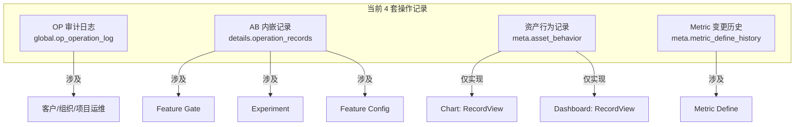
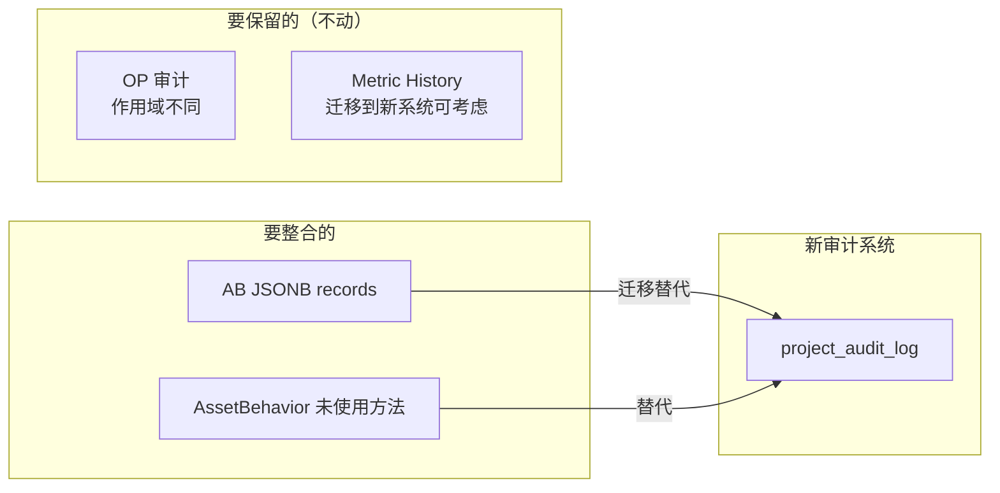
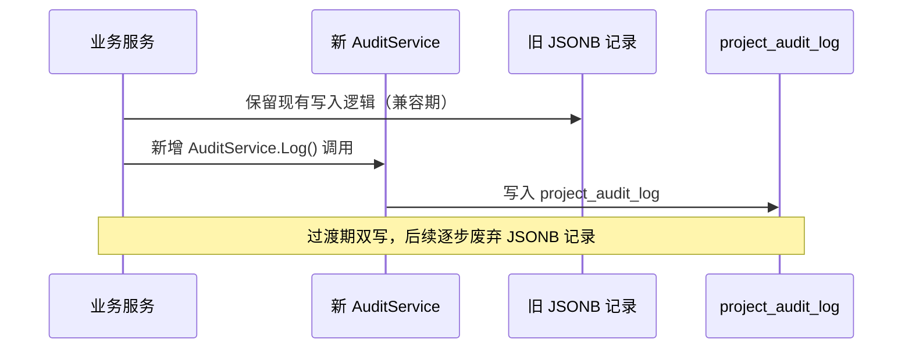

# 调研文档：Wave 项目操作记录历史债务与资产操作类型全景

**日期**: 2026-06-26
**范围**: `/Users/wenshiqin/wave-worktrees/add_audit_record`

---

## 一、历史债务全景

目前 Wave 项目存在 **4 套分散的操作记录机制**，各自为政，没有统一的基础设施。



---

### 1.1 OP 审计日志（global 模式）

**位置**: `apps/web/op/`
**表**: `global.op_operation_log`
**当前状态**: ✅ 完善，但与资产操作无关

| 维度 | 说明 |
|---|---|
| **写入方式** | 同步写入，`LogWithFallback` 容错模式 |
| **记录内容** | before_snapshot / after_snapshot JSON |
| **操作类型** | `create_invite`, `bind_customer`, `cancel_invitation`, `update_profile`, `save_contracts`, `update_org_config`, `update_project_init_quota`, `update_project_quota`, `expire_customer` |
| **目标类型** | `customer`, `organization`, `project` |
| **状态** | `success`, `failed`, `verify_failed` |
| **服务层** | `AuditService`（单例，`sync.Once`） |

**问题**: 虽然是成熟的审计基础设施，但作用域在 global schema，面向运维后台，**完全不覆盖项目内的资产操作**。

---

### 1.2 AB 模块内嵌操作记录（JSONB 列）

**位置**: `apps/web/service/ab/` + `apps/web/dto/ab/`
**存储**: `ab_feature_flag.details` JSONB 列中的 `operation_records` 数组
**当前状态**: ⚠️ 功能正常但实现方式有缺陷

```go
type FFOperationRecord struct {
    OperationType string    `json:"operation_type"`
    OperateBy     int64     `json:"operate_by"`
    OperateAt     time.Time `json:"operate_at"`
}
```

**覆盖实体**: Gate ✅ / Experiment ✅ / Config ✅ / Layer ❌ / Holdout ❌

**完整操作类型**:

| 操作类型 | Gate | Exp | Config | 写入场景 |
|---------|:----:|:---:|:------:|---------|
| CREATE | ✅ | ✅ | ✅ | 构造函数初始化时 |
| UPDATE | ✅ | ✅ | ✅ | ConstructUpdate* 转换器中 |
| COPY | ✅ | ✅ | ✅ | deriveCopy() 中重置全部历史 |
| DEBUG | ✅ | ✅ | ✅ | StatusUpdate: Draft→Debug |
| ONLINE | ✅ | ✅ | ✅ | StatusUpdate: Debug→Running |
| OFFLINE | ✅ | ✅ | ✅ | StatusUpdate: Running→Finished |
| RELEASE | ✅ | ✅ | ✅ | StatusRelease() |
| DELETE | ✅ | ✅ | ✅ | StatusUpdate→Deleted |
| VARIANT_CHANGE | ❌ | ❌ | ✅ | Config Update 中变体变更时 |

**问题**:
1. **不可查询** — 操作记录嵌在 JSONB 里，无法 `WHERE action_type = 'DELETE'` 跨资产查询
2. **无快照** — 只记录 who/when/what，不记录变更前后的状态
3. **数据膨胀** — 每次操作追加数组，`details` 列持续增长
4. **操作人未建模** — OperateBy 存 int64，查询时需要外部解析为名字

---

### 1.3 资产行为记录（meta 模式）

**位置**: `apps/web/service/asset/behavior.go`
**表**: `meta.asset_behavior`
**当前状态**: ⚠️ 大量方法未投入使用

```go
const (
    OperationTypeAdd     = "ADD"
    OperationTypeView    = "VIEW"
    OperationTypeModify  = "MODIFY"
    OperationTypeDelete  = "DELETE"
    OperationTypeDeliver = "DELIVER"
)
```

**各方法的实际调用情况**:

| 方法 | 调用者 | 实际情况 |
|------|--------|---------|
| `RecordView` | chart controller + dashboard controller | ✅ Chart 和 Dashboard 的查看时调用 |
| `RecordModify` | 无 | ❌ 定义了但无人调用 |
| `RecordDelete` | 无 | ❌ 定义了但无人调用 |
| `RecordAdd` | 无 | ❌ 定义了但无人调用 |
| `RecordDeliver` | 无 | ❌ 定义了但无人调用 |

**架构**: 每项目 goroutine + channel 批量写入（100 条或 5 秒），异常静默丢弃

**问题**:
1. **定位不明确** — 既不是审计（无快照、无容错），也不是分析（仅 RECENT_VIEWS）
2. **大部分方法死代码** — 5 个方法中 4 个无调用者
3. **写入不可靠** — 批量管道模式下异常静默丢弃，不适合审计场景
4. **无 before/after** — 即使有人调用 RecordModify，也不记录变更了什么

---

### 1.4 Metric 变更历史（meta 模式）

**位置**: `apps/web/dao/metadata/metric_define.go`
**表**: `meta.metric_define_history`
**当前状态**: ⚠️ 最小实现，仅记录口径变更

```go
type MetricDefineHistory struct {
    MetricID  int
    OldDefine *string
    NewDefine string
    UpdatedBy int
}
```

**调用点**: `apps/web/service/metadata/metric.go:215` — `UpdateMetric` 中仅当口径实际变更时

**问题**: 
1. **不可查询** — DAO 只提供了 `Create`，没有 `ListByMetricID` 方法
2. **范围局限** — 只记录 Metric Define，与其他资产完全无关
3. **无统一接入** — 自建的独立表，跟审计基础设施没关系

---

### 1.5 历史债务总结



---

## 二、各资产类型操作全景

### 2.1 资产类型总览

| 资产类型 | 常量 | AssetOperator | 行为追踪 | 自有操作记录 | 审计覆盖 |
|---------|------|:------------:|:--------:|:-----------:|:-------:|
| Chart | `AssetChart` | ✅ 已注册 | ✅ RecordView | ❌ | ❌ |
| Dashboard | `AssetDashboard` | ✅ 已注册 | ✅ RecordView | ❌ | ❌ |
| Cohort | `AssetCohort` | ❌ 未注册 | ❌ | ❌ | ❌ |
| Experiment | `AssetExperiment` | ❌ 未注册 | ❌ | ✅ JSONB 内嵌 | ❌ |
| Feature Gate | `AssetFeatureFlag` | ❌ 未注册 | ❌ | ✅ JSONB 内嵌 | ❌ |
| Feature Config | `AssetFeatureConfig` | ❌ 未注册 | ❌ | ✅ JSONB 内嵌 | ❌ |

---

### 2.2 AssetOperator 实现现状

**接口定义** (`apps/web/service/asset/operator.go`):

```go
type AssetOperator interface {
    CreateAsset(ctx context.Context, data interface{}) error
    UpdateAsset(ctx context.Context, data interface{}) error
    DeleteAsset(ctx context.Context, id int) error
    BatchDeleteAsset(ctx context.Context, ids []int) error
}
```

**注册点** (`apps/web/server.go:305`):

```go
func initAssetOperator() {
    asset.RegisterAssetOperator(def.AssetChart, chart.NewChartService())
    asset.RegisterAssetOperator(def.AssetDashboard, dashboard.NewDashboardService())
    // TODO: more operators (cohort, experiment, feature_flag, feature_config)
}
```

**问题**: 
1. 接口仅 4 个 CRUD 方法，**Copy/StatusUpdate 等不在其中**
2. Cohort 虽然有 `NewCohortService()` 引用但该函数**不存在**（struct 是私有的 `cohortService`），无法注册
3. AB 三类资产没有实现 AssetOperator，且它们的服务层结构不同（通过 AbService 分发）

---

### 2.3 CHART 操作清单

**服务**: `apps/web/service/chart/chart.go`
**DAO**: `apps/web/dao/analysis/chart.go` — `Chart` struct

| 操作 | 服务方法 | 控制器 | AssetOperator? | 是否要审计 |
|------|---------|--------|:-------------:|:---------:|
| 创建 | `Create` / `CreateChartWithDashboards` | `AddNewChart` | ✅ CreateAsset | ✅ |
| 更新 | `UpdateChart` | `UpdateChartDetail` | ✅ UpdateAsset | ✅ |
| 删除 | `Delete` | `DeleteChart` | ✅ DeleteAsset | ✅ |
| 批量删除 | `BatchDelete` | 批量路由 | ✅ BatchDeleteAsset | ✅ |
| 复制 | `CopyCharts` | `CopyCharts` | ❌ 接口未覆盖 | ✅ |

**快照字段**: `id`, `name`, `query_type`, `api_request`, `config`, `description`, `version`

**当前行为追踪**: `RecordView`（controller 层调用）

---

### 2.4 DASHBOARD 操作清单

**服务**: `apps/web/service/dashboard/dashboard.go`
**DAO**: `apps/web/dao/analysis/dashboard.go` — `Dashboard` struct

| 操作 | 服务方法 | 控制器 | AssetOperator? | 是否要审计 |
|------|---------|--------|:-------------:|:---------:|
| 创建 | `CreateDashboard` | `CreateNewDashboard` | ✅ CreateAsset | ✅ |
| 全量更新 | `UpdateDashboardWithChartsAndLayouts` | `UpdateDashboardDetail` | ✅ UpdateAsset | ✅ |
| 元信息更新 | `PatchDashboardMeta` | — | ❌ 未单独暴露 | ⚠️ 可通过 UpdateAsset 覆盖 |
| 布局更新 | `SetDashboardChartLayouts` | — | ❌ | ⚠️ 视为 update |
| 删除 | `DeleteDashboard` | `DeleteDashboard` | ✅ DeleteAsset | ✅ |
| 批量删除 | `BatchDeleteDashboard` | 批量路由 | ✅ BatchDeleteAsset | ✅ |
| 复制 | `CopyDashboard` | `CopyDashboard` | ❌ 接口未覆盖 | ✅ |
| 添加图表 | `AddChartsToDashboard` | `AddChartsToDashboard` | ❌ | ⚠️ 属于 dashboard update 范畴 |
| 移除图表 | `RemoveChartsFromDashboard` | `PostUbaDashboardsChartsDelete` | ❌ | ⚠️ 属于 dashboard update 范畴 |

**快照字段**: `id`, `name`, `description`, `version`

**当前行为追踪**: `RecordView`（controller 层调用）

---

### 2.5 COHORT 操作清单

**服务**: `apps/web/service/cohort/cohort_service.go` — `cohortService`（私有 struct）
**DAO**: `apps/web/dao/metadata/cohort.go` — `CohortDefine` struct

| 操作 | 服务方法 | 控制器 | AssetOperator? | 是否要审计 |
|------|---------|--------|:-------------:|:---------:|
| 创建 | `CreateRuleCohort` → `CreateCohort` | `CreateRuleCohort` | ❌ 未实现 | ✅ |
| 更新 | `UpdateRuleCohort` | `UpdateRuleCohort` | ❌ 未实现 | ✅ |
| 删除 | `DeleteCohort` | `DeleteCohort` | ❌ 未实现 | ✅ |

**副作用操作**（内部触发，非直接用户操作）:
- 创建/更新/删除计划任务
- 手动执行群体计算
- 刷新元数据目录

**快照字段**: `id`, `name`, `size`, `rule_config`, `description`, `calc_mode`, `calc_time`, `cohort_version`

**现状**: 完全无操作记录，无 AssetOperator，无行为追踪

---

### 2.6 EXPERIMENT / FEATURE_GATE / FEATURE_CONFIG 操作清单

这三类资产共享同一套架构：`AbService` 分发 → 各自 `ffXxxService` 实现

**DB 模型**: `apps/web/dao/ab/ab_feature_flag.go` — `AbFeatureFlag` struct（`typ` 字段区分类型）

#### EXPERIMENT 操作

| 操作 | 分发方法 | 服务方法 | 控制器 | AssetOperator? | 自有记录? |
|------|---------|---------|--------|:-------------:|:-------:|
| 创建 | `FFCreate` | `ffExpService.Create` | `PostAbCreate` | ❌ 未实现 | ✅ CREATE |
| 更新 | — | `ffExpService.Update` | `PostAbExpUpdate` | ❌ 未实现 | ✅ UPDATE |
| Status→DEBUG | `FFStatusUpdate` | `ffExpService.StatusUpdate` | `PostAbStatusUpdate` | ❌ | ✅ DEBUG |
| Status→ONLINE | `FFStatusUpdate` | `ffExpService.StatusUpdate` | `PostAbStatusUpdate` | ❌ | ✅ ONLINE |
| Status→OFFLINE | `FFStatusUpdate` | `ffExpService.StatusUpdate` | `PostAbStatusUpdate` | ❌ | ✅ OFFLINE |
| Status→DELETE | `FFStatusUpdate` | `ffExpService.StatusUpdate` | `PostAbStatusUpdate` | ❌ | ✅ DELETE |
| Release | `FFStatusRelease` | `ffExpService.StatusRelease` | `PostAbStatusRelease` | ❌ | ✅ RELEASE |
| 复制 | `FFCopy` | `ffExpService.Copy` | `PostAbExpCopy` | ❌ | ✅ COPY |

#### FEATURE_GATE 操作

| 操作 | 服务方法 | 控制器 | AssetOperator? | 自有记录? |
|------|---------|--------|:-------------:|:-------:|
| 创建 | `ffGateService.Create` | `PostAbCreate` | ❌ 未实现 | ✅ CREATE |
| 更新 | `ffGateService.Update` | `PostAbGateUpdate` | ❌ 未实现 | ✅ UPDATE |
| Status 变更 | `ffGateService.StatusUpdate` | `PostAbStatusUpdate` | ❌ | ✅ 对应类型 |
| Release | `ffGateService.StatusRelease` | `PostAbStatusRelease` | ❌ | ✅ RELEASE |
| 复制 | `ffGateService.Copy` | `PostAbGateCopy` | ❌ | ✅ COPY |

#### FEATURE_CONFIG 操作

| 操作 | 服务方法 | 控制器 | AssetOperator? | 自有记录? |
|------|---------|--------|:-------------:|:-------:|
| 创建 | `ffConfigService.Create` | `PostAbCreate` | ❌ 未实现 | ✅ CREATE |
| 更新 | `ffConfigService.Update` | `PostAbConfigUpdate` | ❌ | ✅ UPDATE + VARIANT_CHANGE |
| Status 变更 | `ffConfigService.StatusUpdate` | `PostAbStatusUpdate` | ❌ | ✅ 对应类型 |
| Release | `ffConfigService.StatusRelease` | `PostAbStatusRelease` | ❌ | ✅ RELEASE |
| 复制 | `ffConfigService.Copy` | `PostAbConfigCopy` | ❌ | ✅ COPY |

**AB 资产的核心快照字段**:
- 公共: `id`, `ffkey`, `name`, `typ`, `status`, `traffic`, `enabled`, `version`
- Experiment 特有: `subject_id`, `layer_id`, `bucket_bits`, `local_holdout_id`, `global_holdout_id`
- 配置详情: `details` JSONB（含变体、指标、规则、门控等全量配置）

---

### 2.7 所有需要审计的操作类型汇总

按操作性质归类：

| 操作类别 | 操作类型 | 涉及资产 |
|---------|---------|---------|
| **创建** | `create` | 全部 6 种 |
| **更新** | `update` | 全部 6 种 |
| **删除** | `delete` | 全部 6 种 |
| **批量删除** | `batch_delete` | Chart, Dashboard（通过 AssetOperator） |
| **复制** | `copy` | Chart, Dashboard, Experiment, FeatureGate, FeatureConfig |
| **配置变更** | `variant_change` | FeatureConfig（变体变更） |
| **状态变更** | `status_change` | Experiment, FeatureGate, FeatureConfig |
| **关联变更** | `relate` / `unrelate` | Dashboard（增删图表关联） |

**状态变更的细分**（AB 资产）：

| 状态变更 | 对应操作类型 |
|---------|------------|
| Draft → Debug | `status_change` |
| Debug → Running | `status_change` |
| Running → Finished | `status_change` |
| 任意 → Released | `status_change` |
| 任意 → Deleted | `delete` |

---

## 三、关键发现

### 3.1 AssetOperator 接口不完整

当前 `AssetOperator` 只有 4 个方法（CRUD），但实际需要审计的操作远不止这些：

- **Copy** 不在接口中，但 5/6 的资产类型支持复制
- **状态变更** 对 AB 资产是核心操作
- **子操作**（如 Dashboard 添加/移除图表）是多步骤操作中的子步骤

### 3.2 新审计系统不能依赖 AssetOperator 覆盖全部场景

对于 AB 资产，它们的操作是通过 `AbService.FFCreate/FFStatusUpdate/FFCopy` 等分发的，不是通过 `AssetOperator`。新审计系统需要：

1. 提供直接调用的 `AuditService.Log()` 公共入口
2. 逐步将 AssetOperator 实现接入 AB 资产
3. 非 CRUD 操作由各业务服务直接调用 AuditService

### 3.3 AB 内嵌记录的历史兼容策略

AB 模块现有 `operation_records` 内嵌在 JSONB 中，数据不删。
新系统上线后的双写策略：



查询端合并展示新旧数据，用户感知一致。

### 3.4 AssetBehavior 的定位问题

`asset_behavior` 中的 `RecordModify` / `RecordDelete` / `RecordAdd` 方法至今无人调用，属于**死代码**。

建议策略：
- **行为分析**（如 VIEW 次数、热门资产）继续用 `asset_behavior`
- **审计记录**（谁在什么时候修改了什么）走新的 `project_audit_log`
- `RecordModify` / `RecordDelete` / `RecordAdd` 不再使用，由新系统替代

---

## 四、附录：代码引用清单

### 关键文件路径

| 文件 | 说明 |
|------|------|
| `pkg/def/asset_type.go` | 6 种资产类型常量 |
| `apps/web/service/asset/operator.go` | AssetOperator 接口 + 注册器 |
| `apps/web/service/asset/asset.go` | AssetService 外观 |
| `apps/web/server.go` (L305) | `initAssetOperator()` 注册入口 |
| `apps/web/service/chart/chart.go` (L992) | Chart AssetOperator 实现 |
| `apps/web/service/dashboard/dashboard.go` (L1093) | Dashboard AssetOperator 实现 |
| `apps/web/op/service/audit.go` | OP AuditService 实现 |
| `apps/web/op/dto/audit.go` | AuditWriteInput / AuditLogItem |
| `apps/web/op/dto/customer.go` | 操作类型常量 |
| `apps/web/op/service/service_runtime.go` | OP 运行时组装 |
| `apps/web/dao/ab/ab_feature_flag.go` | AbFeatureFlag 模型（含 details JSONB） |
| `apps/web/dto/ab/ab_ff.go` (L609) | FFOperationRecord 结构体 |
| `apps/web/dto/ab/ab_ff.go` (L750) | 9 种 AB 操作类型常量 |
| `apps/web/service/ab/ab.go` (L220) | FFOperationRecordList 查询 |
| `apps/web/service/ab/ab_gate.go` | Gate 服务（Create/StatusUpdate/Release/Copy） |
| `apps/web/service/ab/ab_exp.go` | Experiment 服务 |
| `apps/web/service/ab/ab_config.go` | Config 服务 |
| `apps/web/service/ab/ab_common.go` | 公共 Offline/Delete 辅助函数 |
| `apps/web/converter/ab/common.go` | ConstructUpdate* + variant_change 判断 |
| `apps/web/controller/ab/ab.go` (L430) | GetAbOperationRecordById |
| `apps/web/service/asset/behavior.go` | AssetBehavior 批量写入 |
| `apps/web/dao/asset/behavior.go` | AssetBehavior DAO |
| `apps/web/dao/metadata/metric_define.go` | MetricDefineHistory |
| `apps/web/service/cohort/cohort_service.go` | Cohort 服务（私有 struct） |
| `fe/src/modules/ab/components/FFHistory.vue` | AB 操作记录前端组件 |

### SQL 定义

| 文件 | 对象 |
|------|------|
| `script/sql/pgsql/global.sql` (L322) | `op_operation_log` 表 |
| `script/sql/pgsql/meta.sql` (L539) | `metric_define_history` 表 |
| `script/sql/pgsql/meta.sql` (L649) | `asset_behavior` 表 |
| `script/migration/scripts/global_v20260602_operations_console.sql` | OP 全套迁移 |
