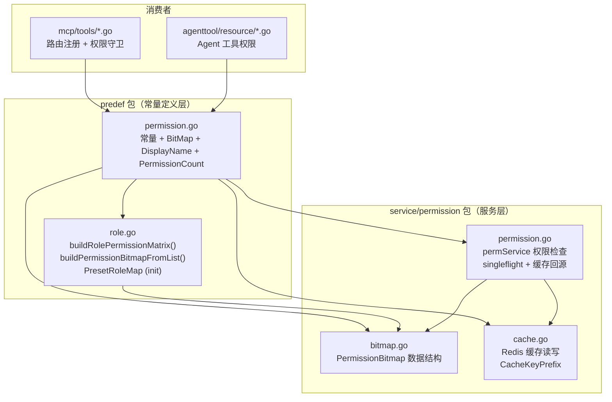
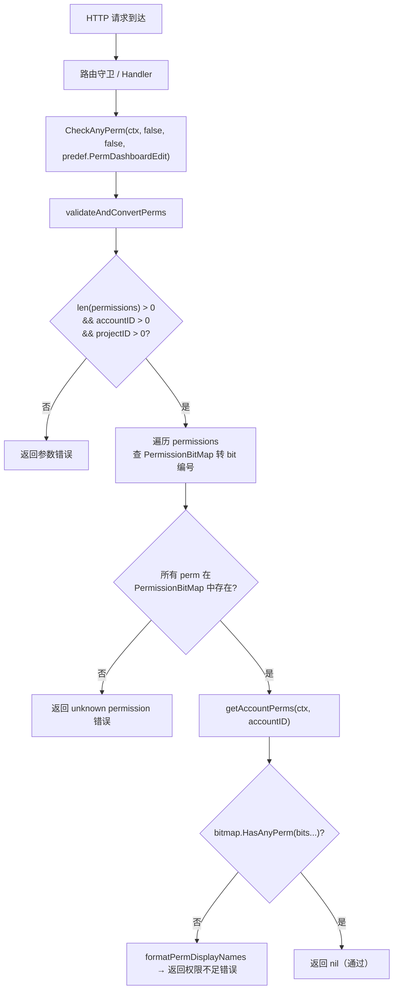
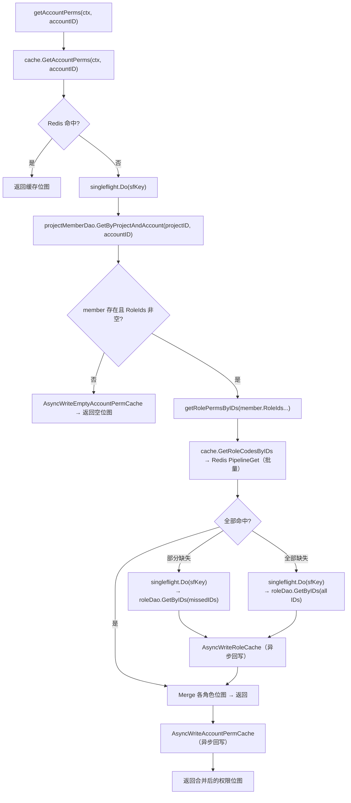
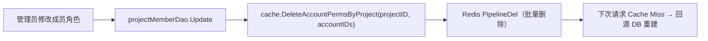
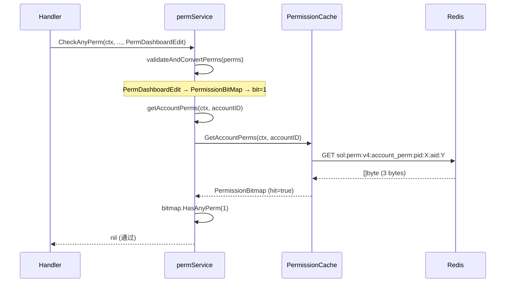
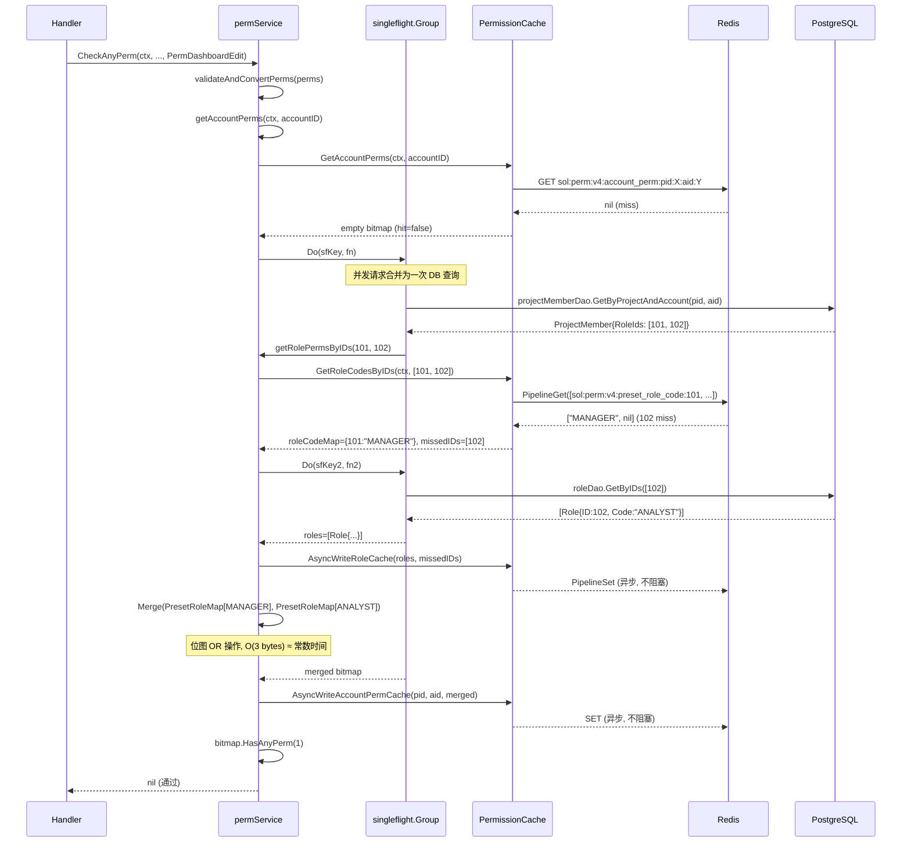
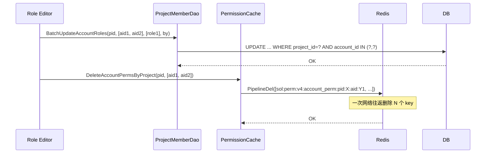

<!-- /autoplan restore point: /Users/wenshiqin/.gstack/projects/qinwenshiCH-workflow/spec-wave-2606-change_role-autoplan-restore-20260702-180040.md -->
# 后端技术方案：角色权限底座矩阵更新

**关联 spec**: [spec.md](spec.md)
**实施仓库**: `/Users/wenshiqin/wave-worktrees/change_role`
**日期**: 2026-07-02

---

## 1. 当前状态分析

### 1.1 代码实际状态（经阅读验证）

| 文件 | 当前版本 | 关键状态 |
|------|---------|---------|
| `apps/web/predef/permission.go` | v3 | 18 个权限常量（旧命名），`PermissionCount=18` |
| `apps/web/predef/role.go` | v3 | `buildRolePermissionMatrix()` 使用旧常量名 |
| `apps/web/service/permission/cache.go` | v3 | `CacheKeyPrefix = "sol:perm:v3:"` |
| `apps/web/service/permission/bitmap.go` | — | 位图数据结构，无需变更 |
| `apps/web/service/permission/permission.go` | — | 权限检查服务，只通过 `predef.PermissionBitMap` 间接引用常量 |
| `apps/web/service/permission/bitmap_test.go` | v3 | 17 处旧常量引用 |
| `apps/web/service/permission/permission_test.go` | v3 | 10 处 `PermDashboardDownload` 引用 |
| `apps/web/mcp/tools/*.go` | v3 | mcp 工具注册中的旧常量引用 |
| `apps/web/agenttool/resource/*.go` | v3 | agent 工具中的旧常量引用 |

**关键结论**：`role.go`、`cache.go` 均未预迁移到 v4，三个核心文件需本次同步改写。`bitmap_test.go` 不在 `predef/` 目录下，位于 `service/permission/`。

### 1.2 模块依赖关系



**核心依赖链**: `permission.go`（常量）→ `role.go`（矩阵）+ `cache.go`（缓存键）+ 所有消费者。`permission.go` 是本次变更的唯一源头，其余文件为联动变更。

---

## 2. 变更范围

### 2.1 后端变更文件清单

| 文件 | 操作 | 变更量 | 说明 |
|------|------|--------|------|
| `apps/web/predef/permission.go` | **重写** | ~103 行 | 9 重命名 + 3 删除 + 6 新增，PermissionCount→21 |
| `apps/web/predef/role.go` | **重写矩阵** | ~60 行（buildRolePermissionMatrix 函数体） | 三个角色矩阵全部按新 spec 重写，其余代码不变 |
| `apps/web/service/permission/cache.go` | **单行修改** | 1 行 | `CacheKeyPrefix` v3→v4 |
| `apps/web/service/permission/bitmap_test.go` | **重写** | ~150 行 | 对齐 21-bit 布局，重写角色权限断言 |
| `apps/web/service/permission/permission_test.go` | **更新引用** | ~15 行 | `PermDashboardDownload`→`PermDashboardView`（测试用例中作为示例权限使用，替换为语义等价的现存常量） |
| `apps/web/mcp/tools/asset.go` | **全局替换** | 7 处 | `PermDashboardUpsert`→`PermDashboardEdit` |
| `apps/web/mcp/tools/chart_create.go` | **全局替换** | 5 处 | `PermDashboardUpsert`→`PermDashboardEdit` |
| `apps/web/mcp/tools/analysis.go` | **全局替换** | 1 处 | `PermAudienceView`→`PermCohortView` |
| `apps/web/mcp/tools/metadata_write.go` | **全局替换** | 1 处 | `PermDataMetadataUpsert`→`PermDataCatalogEdit` |
| `apps/web/agenttool/resource/catalog_source.go` | **全局替换** | 2 处 | `PermDataMetadataView`→`PermDataCatalogView` |
| `apps/web/agenttool/resource/sql_source.go` | **全局替换** | 2 处 | `PermDataMetadataView`→`PermDataCatalogView` |
| `api/web/web.openapi.yaml` | **替换 + 新增** | 74 处替换 + 21 处新增 `x-operation-auth` | 8 种旧权限字符串→新值；21 个端点补加权限保护（insight 9 + userlist 10 + sql 2） |
| `api/web/codegen/api.gen.go` | **自动重新生成** | 226 处 `predef.Perm("...")` | 由 `go generate ./api/web/...` 根据 YAML 自动生成，**不可手动编辑** |
| `fe/src/common/permission.ts` | **重写** | ~80 行 | 9 重命名 + 2 删除 + 7 新增 PermissionKey 枚举；PERMISSION_LIST 菜单分组重组（6 组）；PERMISSION_KEY_MAP 位图映射同步更新 |

### 2.2 不变更文件

| 文件 | 原因 |
|------|------|
| `apps/web/service/permission/bitmap.go` | 纯数据结构，位图操作与 PermissionCount 解耦（通过参数传入 size） |
| `apps/web/service/permission/permission.go` | 权限检查逻辑只通过 `predef.PermissionBitMap[perm]` 间接引用常量，不硬编码常量名 |
| `apps/web/dao/global/role.go` | DB schema 不变，Role struct 的 `Permissions []byte` 字段位图格式不变 |
| `apps/web/dao/global/project_member.go` | DB schema 不变，`RoleIds` 字段不变 |
| `apps/web/mcp/tools/pipeline.go` | 使用 `PermDataTracking`（不变的常量），无需改动 |
| `apps/web/mcp/tools/tracking_plan.go` | 使用 `PermDataTracking` + `PermDashboardView`（均为不变的常量），无需改动 |
| `apps/web/agenttool/resource/asset_source.go` | 使用 `PermDashboardView`（不变的常量），无需改动 |
| `apps/web/agenttool/resource/pipeline_source.go` | 使用 `PermDataTracking`（不变的常量），无需改动 |
| `apps/web/agenttool/resource/tracking_source.go` | 使用 `PermDataTracking`（不变的常量），无需改动 |
| `apps/web/controller/project/project.go` | 使用 `PermProjectConfig`（不变的常量），无需改动 |
| `apps/web/controller/project/member.go` | 使用 `PermProjectConfig`（不变的常量），无需改动 |
| `apps/web/controller/asset/discover.go` | 使用 AssetPerm 资产级权限系统，与角色权限矩阵独立，无需改动 |
| 所有 handler/middleware | 它们调用 `CheckAnyPerm(ctx, ..., predef.PermXxx)` 时传入的是 `predef` 包的导出常量，Go 编译期自动解析为新常量值 |

---

## 3. 详细方案设计

### 3.1 `permission.go` 常量重写

这是本次变更的**唯一数据源**。所有常量的位图位置、字符串值、DisplayName 均在此定义。

#### 3.1.1 变更策略

```
Phase 1 — 重命名 9 个常量（按 spec 位图布局，bit 位置不变，仅改名）:
  PermDashboardUpsert     → PermDashboardEdit      (bit 1,  "dashboard:upsert" → "dashboard:edit")
  PermAudienceView        → PermCohortView         (bit 6,  "audience:view"    → "cohort:view")
  PermAudienceUpsert      → PermCohortEdit         (bit 4,  "audience:upsert"  → "cohort:edit")
  PermAudienceUse         → PermCohortDownload     (bit 5,  "audience:use"     → "cohort:download")
  PermDataMetadataView    → PermDataCatalogView    (bit 14, "data:metadata:view" → "data:catalog:view")
  PermDataMetadataUpsert  → PermDataCatalogEdit    (bit 15, "data:metadata:upsert" → "data:catalog:edit")
  PermABUpsert            → PermABEdit             (bit 10, "ab:upsert"        → "ab:edit")
  PermMarketingView       → PermMAView             (bit 17, "marketing:view"   → "ma:view")
  PermMarketingUpsert     → PermMAEdit             (bit 16, "marketing:upsert" → "ma:edit")

Phase 2 — 删除 3 个废弃常量:
  PermDashboardDownload   (bit 3)  — 无对应功能，bit 位分配给 userlist:query
  PermDiscoverView        (bit 12) — discover 不再做角色权限划分，bit 分配给 userlist:download
  PermDiscoverFavorite    (bit 13) — discover 不再做角色权限划分，bit 分配给 insight:query

Phase 3 — 新增 6 个常量（复用 3 个废弃位 + 3 个高位）:
  PermUserlistQuery       (bit 3,  复用 PermDashboardDownload)
  PermUserlistDownload    (bit 12, 复用 PermDiscoverView)
  PermInsightQuery        (bit 13, 复用 PermDiscoverFavorite)
  PermInsightDownload     (bit 18, 新增高位)
  PermSqlQuery            (bit 19, 新增高位)
  PermSqlDownload         (bit 20, 新增高位)

Phase 4 — 更新 PermissionDisplayName、PermissionBitMap、PermissionCount
```

#### 3.1.2 目标代码

常量块按 spec 定义的菜单顺序分组，代码注释与分组对应：

```go
package predef

// ============================================================================
// 权限点常量定义
// 命名规范: domain:action，按前端菜单顺序排列
// 位图布局见 PermissionBitMap
// ============================================================================

type Perm string

const (
	// ========== 项目设置权限 ==========
	PermProjectConfig Perm = "project:config" // 项目设置

	// ========== Dashboard 权限 ==========
	PermDashboardView Perm = "dashboard:view" // 查看仪表盘和图表
	PermDashboardEdit Perm = "dashboard:edit" // 创建、编辑图表和仪表盘

	// ========== Userlist 用户列表权限 ==========
	PermUserlistQuery    Perm = "userlist:query"    // 用户明细查看
	PermUserlistDownload Perm = "userlist:download" // 用户明细下载

	// ========== Cohort 分群权限 ==========
	PermCohortView     Perm = "cohort:view"     // 查看分群
	PermCohortEdit     Perm = "cohort:edit"     // 创建、编辑、删除分群
	PermCohortDownload Perm = "cohort:download" // 分群导出

	// ========== Data 数据管理权限 ==========
	PermDataTracking     Perm = "data:tracking"      // 数据处理管理
	PermDataCatalogView  Perm = "data:catalog:view"  // 查看元数据目录
	PermDataCatalogEdit  Perm = "data:catalog:edit"  // 编辑元数据目录
	PermDataAsset        Perm = "data:asset"         // 数据资产管理

	// ========== AB 试验权限 ==========
	PermABView Perm = "ab:view" // 查看试验
	PermABEdit Perm = "ab:edit" // 创建、编辑试验

	// ========== Insight 自定义分析权限 ==========
	PermInsightQuery    Perm = "insight:query"    // 分析模型查询
	PermInsightDownload Perm = "insight:download" // 分析模型结果下载

	// ========== SQL 查询权限 ==========
	PermSqlQuery    Perm = "sql:query"    // SQL 查询
	PermSqlDownload Perm = "sql:download" // SQL 结果下载

	// ========== MA 营销自动化权限 ==========
	PermMAView Perm = "ma:view" // 查看营销活动
	PermMAEdit Perm = "ma:edit" // 创建、编辑、执行营销活动
)

// PermissionDisplayName 权限点展示名称，用于错误提示等面向用户的描述。
var PermissionDisplayName = map[Perm]string{
	PermProjectConfig:    "Project Settings",
	PermDashboardView:    "View Dashboard",
	PermDashboardEdit:    "Edit Dashboard",
	PermUserlistQuery:    "Query User List",
	PermUserlistDownload: "Export User List",
	PermCohortView:       "View Cohorts",
	PermCohortEdit:       "Edit Cohorts",
	PermCohortDownload:   "Export Cohorts",
	PermDataTracking:     "Data Processing",
	PermDataCatalogView:  "View Data Catalog",
	PermDataCatalogEdit:  "Edit Data Catalog",
	PermDataAsset:        "Manage Data Asset",
	PermABView:           "View A/B",
	PermABEdit:           "Edit A/B",
	PermInsightQuery:     "Query Insights",
	PermInsightDownload:  "Export Insights",
	PermSqlQuery:         "Query SQL",
	PermSqlDownload:      "Export SQL Results",
	PermMAView:           "View Marketing Automation",
	PermMAEdit:           "Edit Marketing Automation",
}

// PermissionBitMap 权限位图映射，用于数据库存储和快速权限检查。
// 位图布局按历史位顺序，文档展示按前端菜单顺序。
// 已废弃位（bit 3/12/13）经确认无 DB 存量数据依赖，安全复用。
var PermissionBitMap = map[Perm]int{
	// 项目设置 (0)
	PermProjectConfig: 0,

	// Dashboard (1-2)
	PermDashboardEdit: 1,
	PermDashboardView: 2,

	// Userlist (3, 12) — 复用旧 dashboard:download 和 discover:view
	PermUserlistQuery:    3,
	PermUserlistDownload: 12,

	// Cohort (4-6) — 旧 audience 位
	PermCohortEdit:     4,
	PermCohortDownload: 5,
	PermCohortView:     6,

	// Data (7-9, 14-15)
	// bit 7 is reserved (legacy data:metadata)
	PermDataTracking:    8,
	PermDataAsset:       9,
	PermDataCatalogView: 14,
	PermDataCatalogEdit: 15,

	// AB (10-11)
	PermABEdit: 10,
	PermABView: 11,

	// Insight (13, 18) — bit 13 复用旧 discover:favorite
	PermInsightQuery:    13,
	PermInsightDownload: 18,

	// SQL (19-20)
	PermSqlQuery:    19,
	PermSqlDownload: 20,

	// MA (16-17)
	PermMAEdit: 16,
	PermMAView: 17,
}

// PermissionCount 权限总数。变更时必须同步 bump CacheKeyPrefix 版本号。
const PermissionCount = 21
```

### 3.2 `role.go` 矩阵重写

`role.go` 中除 `buildRolePermissionMatrix()` 函数体外，其余代码（Role 类型、PresetRole 结构体、init()、buildPermissionBitmapFromList()、MapRoleCodeToExternal()）均无需变更。

#### 3.2.1 目标矩阵代码

```go
// buildRolePermissionMatrix 角色权限矩阵 —— 基于 spec 角色矩阵定义。
// MANAGER 使用显式枚举（非位迭代），确保不会意外包含废弃位。
func buildRolePermissionMatrix() map[Role][]Perm {
	return map[Role][]Perm{
		RoleManager: {
			// 项目设置
			PermProjectConfig,

			// Dashboard
			PermDashboardView, PermDashboardEdit,

			// Userlist
			PermUserlistQuery, PermUserlistDownload,

			// Cohort
			PermCohortView, PermCohortEdit, PermCohortDownload,

			// Data
			PermDataTracking, PermDataCatalogView, PermDataCatalogEdit, PermDataAsset,

			// AB
			PermABView, PermABEdit,

			// Insight
			PermInsightQuery, PermInsightDownload,

			// SQL
			PermSqlQuery, PermSqlDownload,

			// MA
			PermMAView, PermMAEdit,
		},
		RoleAnalyst: {
			// Dashboard
			PermDashboardView, PermDashboardEdit,

			// Userlist（仅查询，不可下载原始数据）
			PermUserlistQuery,

			// Cohort（可查看编辑，不可导出原始数据）
			PermCohortView, PermCohortEdit,

			// Data（仅查看元数据目录）
			PermDataCatalogView,

			// AB
			PermABView, PermABEdit,

			// Insight
			PermInsightQuery, PermInsightDownload,

			// SQL（仅查询，不可下载原始数据）
			PermSqlQuery,

			// MA
			PermMAView, PermMAEdit,
		},
		RoleConsumer: {
			// Dashboard — 仅查看
			PermDashboardView,

			// Cohort — 仅查看
			PermCohortView,

			// Data — 仅查看元数据目录
			PermDataCatalogView,

			// AB — 仅查看
			PermABView,
		},
	}
}
```

#### 3.2.2 不变更部分确认

以下函数/结构体不涉及任何权限常量名，无需修改：

- `type Role string` + 三个常量（RoleManager/RoleAnalyst/RoleConsumer）— 角色编码不变
- `type PresetRole struct` — 结构体字段不变
- `func init()` — 调用 `buildRolePermissionMatrix()` + `buildPermissionBitmapFromList()`，函数签名不变
- `func buildPermissionBitmapFromList(permissions []Perm) []byte` — 纯位图构建逻辑，使用 `PermissionCount` + `PermissionBitMap`，与具体常量名解耦
- `func MapRoleCodeToExternal(code string) string` — 角色编码映射逻辑不变

### 3.3 `cache.go` 版本号升级

**单行变更**，`CacheKeyPrefix` 从 v3 升级到 v4：

```go
// 变更前:
CacheKeyPrefix = "sol:perm:v3:"

// 变更后:
CacheKeyPrefix = "sol:perm:v4:"
```

**变更理由**：代码注释明确要求 `PermissionCount` 变更时 bump 版本号。虽然 18→21 不改变字节长度（均为 3 字节），但位图语义已变（bit 3/12/13 从废弃变为 userlist/insight 权限），旧缓存中的位图数据已不兼容新布局。bump 版本号使所有旧缓存立即失效，下次访问时自动回源 DB 重建。

### 3.4 全局常量替换策略

消费者文件（mcp/tools、agenttool/resource）的替换**不是简单的文本替换**，需要区分情况：

#### 3.4.1 重命名型（直接替换常量名）

| 旧常量 | 新常量 | 影响文件 |
|--------|--------|---------|
| `PermDashboardUpsert` | `PermDashboardEdit` | `mcp/tools/asset.go`(7)、`mcp/tools/chart_create.go`(5) |
| `PermAudienceView` | `PermCohortView` | `mcp/tools/analysis.go`(1) |
| `PermDataMetadataView` | `PermDataCatalogView` | `agenttool/resource/catalog_source.go`(2)、`agenttool/resource/sql_source.go`(2) |
| `PermDataMetadataUpsert` | `PermDataCatalogEdit` | `mcp/tools/metadata_write.go`(1) |

#### 3.4.2 删除型（需人工判断替换目标）

| 旧常量 | 引用位置 | 处理方式 |
|--------|---------|---------|
| `PermDashboardDownload` | `permission_test.go`(10 处) | 测试用例中作为"示例权限"使用，实际不关心语义，替换为 `PermDashboardView`（bit 2） |
| `PermDiscoverView` | 零引用（仅 permission.go 和 role.go 中） | 直接删除常量即可 |
| `PermDiscoverFavorite` | 零引用（仅 permission.go 和 role.go 中） | 直接删除常量即可 |

**验证方法**：对于每个替换操作，先用 `grep` 确认引用位置，再用 Go 编译器验证替换后无 `undefined` 错误。

### 3.5 测试文件改写

#### 3.5.1 `service/permission/bitmap_test.go`

需更新的测试用例：

| 测试 | 变更 |
|------|------|
| `TestNewPermBitmapFromCode` | 重写角色权限断言：MANAGER 用新常量验证（含 PermUserlistQuery/Download、PermInsightQuery/Download、PermSqlQuery/Download），ANALYST 验证不含 PermUserlistDownload/PermSqlDownload/PermProjectConfig，CONSUMER/VIEWER 验证仅含 4 个 view 权限 |
| `TestMarketingPermissionsAreRegistered` | 替换为 `PermMAView`/`PermMAEdit`，或改为更通用的"验证所有权重点都已注册"测试 |

`TestSetPerm`、`TestHasPerm`、`TestHasAnyPerm`、`TestHasAllPerms`、`TestMerge`、`TestUnion`、`TestEqual` 等通过 `predef.PermissionCount` 参数化，`PermissionCount` 从 18 变为 21 后自动适配，无需修改测试逻辑。

Benchmark 同理，参数化适配。

#### 3.5.2 `service/permission/permission_test.go`

10 处 `PermDashboardDownload` 引用需要处理。这些测试用例中 `PermDashboardDownload` 仅作为"任意一个有效权限"的示例使用，不关心其具体语义。替换为同是"合法权限常量"的 `PermDashboardView`。

```go
// 变更前:
predef.PermDashboardDownload

// 变更后:
predef.PermDashboardView
```

### 3.6 OpenAPI 接口权限变更

`api/web/web.openapi.yaml` 是 API 契约定义文件，每个需要权限校验的端点通过 `x-operation-auth` + `perms:` 声明其依赖的权限。它使用的是权限**字符串值**（如 `dashboard:upsert`）而非 Go 常量名。本次变更涉及该文件中 **8 种权限字符串的全局替换**，共 **74 处**。

#### 3.6.1 当前 YAML 权限清单

经实际解析，当前 YAML 中共 113 个 `x-operation-auth` 块、114 条 `perms:` 条目（仅 1 个块声明了 2 个权限，其余均为单权限）。权限字符串分布：

| 权限字符串 | 条目数 | 本次操作 |
|-----------|--------|---------|
| `data:tracking` | 26 | 不变 |
| `data:metadata:upsert` | 19 | 重命名为 `data:catalog:edit` |
| `ab:upsert` | 19 | 重命名为 `ab:edit` |
| `dashboard:upsert` | 10 | 重命名为 `dashboard:edit` |
| `ab:view` | 10 | 不变 |
| `marketing:upsert` | 7 | 重命名为 `ma:edit` |
| `data:metadata:view` | 6 | 重命名为 `data:catalog:view` |
| `audience:upsert` | 6 | 重命名为 `cohort:edit` |
| `marketing:view` | 5 | 重命名为 `ma:view` |
| `dashboard:view` | 4 | 不变 |
| `audience:view` | 2 | 重命名为 `cohort:view` |

**不变条目**：`data:tracking`(26) + `ab:view`(10) + `dashboard:view`(4) = **40 条目无需改动**。

#### 3.6.2 命名变更映射（8 种 → 74 条目）

```yaml
# 格式示例（api/web/web.openapi.yaml）
x-operation-auth:
  relation: or
  perms:
    - dashboard:upsert   # → dashboard:edit
```

| 旧字符串值 | 新字符串值 | 条目数 | 影响的接口域 |
|-----------|-----------|--------|------------|
| `dashboard:upsert` | `dashboard:edit` | 10 | Dashboard 图表/仪表盘 CRUD |
| `audience:upsert` | `cohort:edit` | 6 | Cohort 分群 CRUD |
| `audience:view` | `cohort:view` | 2 | Cohort 分群查询 |
| `data:metadata:upsert` | `data:catalog:edit` | 19 | 元数据目录编辑（表/字段/事件/属性管理） |
| `data:metadata:view` | `data:catalog:view` | 6 | 元数据目录查看 |
| `ab:upsert` | `ab:edit` | 19 | AB 试验/Feature Gate/Feature Config CRUD |
| `marketing:upsert` | `ma:edit` | 7 | 营销活动 CRUD |
| `marketing:view` | `ma:view` | 5 | 营销活动查看 |

> **注**：`project:config` 在 YAML 中零引用（项目设置权限通过 `project_auth` 字段而非 `perms:` 校验），无需 YAML 变更。

#### 3.6.3 新增权限：YAML 接线变更

6 个新增权限中，**全部 6 个均需在本次变更中接线到已有 API 端点**（对应端点已存在但当前无 `x-operation-auth`，仅靠 `CheckProjectMemberAccess` 保护）。

**需接线的端点（21 个，按权限分组）：**

**insight:query（6 个端点 — 数据洞察查询）：**

| 端点 | 行号 | 当前状态 | 前端菜单 |
|------|------|---------|---------|
| `/uba/event/query` | ~2815 | 无 `x-operation-auth` | 数据洞察 > 事件分析 |
| `/uba/event/users` | ~3147 | 无 `x-operation-auth` | 数据洞察 > 事件分析 > 用户列表 |
| `/uba/funnel/query` | ~3936 | 无 `x-operation-auth` | 数据洞察 > 漏斗分析 |
| `/uba/funnel/users` | — | 无 `x-operation-auth` | 数据洞察 > 漏斗分析 > 用户列表 |
| `/uba/retention/query` | ~3413 | 无 `x-operation-auth` | 数据洞察 > 留存分析 |
| `/uba/retention/users` | — | 无 `x-operation-auth` | 数据洞察 > 留存分析 > 用户列表 |

**insight:download（3 个端点 — 数据洞察下载）：**

| 端点 | 行号 | 当前状态 | 前端菜单 |
|------|------|---------|---------|
| `/uba/event/download` | — | 无 `x-operation-auth` | 数据洞察 > 事件分析 > 下载 |
| `/uba/funnel/download` | — | 无 `x-operation-auth` | 数据洞察 > 漏斗分析 > 下载 |
| `/uba/retention/download` | — | 无 `x-operation-auth` | 数据洞察 > 留存分析 > 下载 |

**userlist:query（9 个端点 — 用户细查）：**

| 端点 | 行号 | 当前状态 | 前端菜单 |
|------|------|---------|---------|
| `/uba/users/list` | ~5286 | 无 `x-operation-auth` | 用户运营 > 用户细查 > 用户列表 |
| `/uba/user/sequence` | ~5473 | 无 `x-operation-auth` | 用户运营 > 用户细查 > 行为序列 |
| `/uba/user/profiles` | ~5611 | 无 `x-operation-auth` | 用户运营 > 用户细查 > 用户画像 |
| `/uba/user/profiles/query` | ~5728 | 无 `x-operation-auth` | 用户运营 > 用户细查 > 画像查询 |
| `/uba/user/profiles/update` | ~5666 | 无 `x-operation-auth` | 用户运营 > 用户细查 > 画像更新 |
| `/uba/user/profiles/cohorts` | ~5848 | 无 `x-operation-auth` | 用户运营 > 用户细查 > 所属分群 |
| `/uba/user/profiles/gates` | ~5965 | 无 `x-operation-auth` | 用户运营 > 用户细查 > 功能开关 |
| `/uba/user/profiles/experiments` | ~6085 | 无 `x-operation-auth` | 用户运营 > 用户细查 > 实验 |
| `/uba/user/profiles/configs` | ~6205 | 无 `x-operation-auth` | 用户运营 > 用户细查 > 功能配置 |

**userlist:download（1 个端点 — 用户列表下载）：**

| 端点 | 行号 | 当前状态 | 前端菜单 |
|------|------|---------|---------|
| `/uba/users/download` | ~5379 | 无 `x-operation-auth` | 用户运营 > 用户细查 > 下载 |

**sql:query（1 个端点）：**

| 端点 | 行号 | 当前状态 | 前端菜单 |
|------|------|---------|---------|
| `/uba/sql/query` | ~4548 | 无 `x-operation-auth` | 数据洞察 > SQL |

**sql:download（1 个端点）：**

| 端点 | 行号 | 当前状态 | 前端菜单 |
|------|------|---------|---------|
| `/uba/sql/download` | ~4697 | 无 `x-operation-auth` | 数据洞察 > SQL > 下载 |

**合计**：21 个端点补加 `x-operation-auth`，新增格式统一为：
```yaml
      x-operation-auth:
        relation: or
        perms:
          - userlist:query
```

#### 3.6.4 删除权限：YAML 中零引用

以下 3 个被删除的常量在 YAML 中**零引用**，删除后无影响：

| 删除常量 | 字符串值 | YAML 条目 |
|---------|---------|----------|
| `PermDashboardDownload` | `dashboard:download` | 0 |
| `PermDiscoverView` | `discover:view` | 0 |
| `PermDiscoverFavorite` | `discover:favorite` | 0 |

`audience:use` 同样零引用。

#### 3.6.5 codegen 自动重新生成

`api/web/codegen/api.gen.go` 由 `oapi-codegen` 根据 `web.openapi.yaml` 自动生成，包含 226 处 `predef.Perm("...")` 调用。生成指令定义在 `api/web/generate.go`：

```go
//go:generate go tool oapi-codegen -templates ./templates -config api_cfg.yaml web.openapi.yaml
```

**更新流程**：
```bash
# 1. 先更新 web.openapi.yaml 中的权限字符串（sed 批量替换 8 种字符串）
# 2. 重新生成 api.gen.go
go generate ./api/web/...
# 3. 验证生成的代码引用的字符串值与 permission.go 中的新常量一致
```

**一致性约束**：`api.gen.go` 中生成的代码形如 `predef.Perm("dashboard:edit")`。`predef.Perm` 是 `type Perm string`，因此 `predef.Perm("dashboard:edit")` 必须与 `permission.go` 中 `PermDashboardEdit Perm = "dashboard:edit"` 的字符串值完全一致，否则 `PermissionBitMap` 查找会失败。codegen 的 `//go:generate` 指令**不强制锁版本**，建议在 Step 5 中显式校验 `oapi-codegen --version`。

#### 3.6.6 接口契约影响总结

| 维度 | 结论 |
|------|------|
| **权限字符串替换** | 8 种 → 74 处（全部为纯重命名，无特殊 case） |
| **新增 `x-operation-auth` 块** | 21 处 — 按权限分组：insight:query 6 + insight:download 3 + userlist:query 9 + userlist:download 1 + sql:query 1 + sql:download 1 |
| **新增权限接线** | 6 个全部接线 — `insight:query`、`insight:download`、`userlist:query`、`userlist:download`、`sql:query`、`sql:download` |
| **新增权限未接线** | 0 — 全部 6 个新增权限均在本次变更中接入对应端点 |
| **删除权限** | 3 个废弃常量在 YAML 中零引用，删除无影响 |
| **API 语义变更** | 无 — 权限检查逻辑不变；补加保护的端点之前仅靠项目成员检查（安全提升，非 breaking） |
| **前端影响** | 无 — 前端通过 API 响应中的错误信息感知权限，不直接解析 YAML |
| **兼容性** | 缓存键 v4 隔离新旧节点，蓝绿部署期间无冲突 |

---

## 4. 业务逻辑流程

### 4.1 权限检查完整流程



### 4.2 缓存回源流程（getAccountPerms 内部）



### 4.3 角色变更 → 缓存失效链路



**关键点**：缓存删除使用批量操作（`PipelineDel`），一次 Redis 往返删除所有受影响的 account_perm key。不存在逐条删除的 N+1 问题。

---

## 5. 函数调用时序图

### 5.1 权限检查 — 缓存命中（热路径，~1ms）



### 5.2 权限检查 — 缓存未命中（冷启动/缓存过期）



### 5.3 缓存失效 — 批量删除



---

## 6. 性能分析

### 6.1 现有架构的 N+1 防护

本次变更**不改动任何运行时逻辑**，现有的性能防护措施全部保留：

| 防护层 | 机制 | 效果 |
|--------|------|------|
| **L1 缓存** | Redis 缓存 account_perm（TTL 1h）和 preset_role（TTL 24h） | 热路径 0 次 DB 查询 |
| **L2 防击穿** | `singleflight.Group` 合并同一 key 的并发请求 | 缓存过期瞬间只穿透 1 次 DB |
| **L3 防穿透** | 空值占位（`<EMPTY>`，TTL 1min）+ `AsyncWriteEmptyAccountPermCache` | 不存在的账号不会反复穿透 DB |
| **L4 批量操作** | `PipelineGet` 批量读角色编码、`PipelineSet` 批量写、`PipelineDel` 批量删 | N 个 key 一次 Redis 往返 |

### 6.2 DB 查询次数分析

```
最坏情况（完全无缓存）:
  projectMemberDao.GetByProjectAndAccount  → 1 次 DB 查询（单条）
  roleDao.GetByIDs(missedIDs)              → 1 次 DB 查询（批量 IN）
  合计: 2 次 DB 查询

常规情况（account_perm 缓存命中）:
  合计: 0 次 DB 查询

部分命中（account_perm miss, role cache hit）:
  projectMemberDao.GetByProjectAndAccount  → 1 次 DB 查询
  角色从 Redis PipelineGet 批量获取       → 0 次 DB 查询
  合计: 1 次 DB 查询
```

不存在 N+1 问题。`roleDao.GetByIDs` 使用 `WHERE id IN ?` 单条 SQL 查询所有缺失角色。

### 6.3 位图操作复杂度

| 操作 | 复杂度 | 21-bit 实际耗时 |
|------|--------|----------------|
| `HasPerm(bit)` | O(1) | ~1ns（位运算） |
| `HasAnyPerm(bits...)` | O(k) k=传入 bit 数 | ~10ns（10 个 bits） |
| `HasAllPerms(bits...)` | O(k) | ~10ns |
| `Merge(others...)` | O(n × 3) n=合并位图数 | ~30ns（10 个角色） |
| `NewPermBitmapFromCode` | O(1) | ~5ns（查 map + copy 3 bytes） |

位图操作不在热路径瓶颈上。真正的延迟来源是 Redis 往返（~0.5ms）和 DB 查询（~2-5ms）。

### 6.4 本次变更对性能的影响

**零影响**。理由：
- 位图大小不变（18→21 bit，仍为 3 字节）
- 权限检查路径不变（同样的缓存策略、同样的位图操作）
- 新增权限常量只是增加了 `PermissionBitMap` 的 map 条目（从 18 个到 21 个），map 查找仍是 O(1)
- `PresetRoleMap` 中 MANAGER/ANALYST/VIEWER 的位图字节长度不变（仍是 3 bytes）

---

## 7. 数据完整性保障

### 7.1 无孤儿数据

本次变更是**纯代码变更**，不涉及 DB schema 变更或数据迁移，因此不存在产生孤儿数据的问题：

```
DB 中的角色表 (roles):
  - Code 字段存储角色编码 (MANAGER/ANALYST/CONSUMER)，不存储权限位图
  - Permissions 字段为 bit varying(1024)，但当前系统不自定义角色，该字段不使用

DB 中的成员表 (project_members):
  - role_ids 字段存储角色 ID 列表 (integer[])
  - 不直接存储权限位图

预置角色位图:
  - 在 init() 中通过 buildRolePermissionMatrix() + buildPermissionBitmapFromList() 构建
  - 存储在进程内存 (PresetRoleMap)，每次重启从代码重建
  - 不写回 DB
```

**不存在"旧数据与新代码不兼容"的情况**，因为：
1. DB 不存储权限位图，只存储角色编码
2. 位图在进程启动时从代码生成，是纯内存态
3. 缓存设有版本号（v3→v4），bump 后旧缓存自动失效

### 7.2 缓存一致性

```
场景: 滚动部署期间，新旧节点共存

旧节点 (v3):
  - CacheKeyPrefix = "sol:perm:v3:"
  - PermissionCount = 18
  - 读写 v3 缓存

新节点 (v4):
  - CacheKeyPrefix = "sol:perm:v4:"
  - PermissionCount = 21
  - 读写 v4 缓存

结论: 缓存键前缀不同 → 新旧缓存完全隔离 → 不会读到对方的数据
      位图语义不同但各自内聚 → 不会产生逻辑错误
```

### 7.3 位图边界安全

`NewPermBitmapFromData` 在从 Redis 读取位图数据时做了安全拷贝：

```go
func NewPermBitmapFromData(data []byte, size int) PermissionBitmap {
    byteLen := (size + 7) / 8
    buf := make([]byte, byteLen)  // 分配新内存，按 size 截断
    copy(buf, data)               // 安全拷贝，不共享底层数组
    return PermissionBitmap{data: buf, size: size}
}
```

- 如果 Redis 返回的旧缓存是 18-bit 的 3 字节数据，新代码以 `size=21` 读取，`copy` 只拷贝前 3 字节（min(len(data), byteLen)），高位自动补零 → 安全
- 如果 Redis 返回的数据超过 3 字节，`copy` 按 `byteLen=3` 截断 → 安全

---

## 8. 测试策略

### 8.1 编译期保障

```bash
# 变更完成后，此命令零报错即验证所有引用已更新
go build ./apps/web/...
```

Go 编译器会对每个未定义的标识符报 `undefined` 错误。如果遗漏任何旧常量引用，编译直接失败。这是最可靠的验证手段。

### 8.2 位图布局验证

由于 `predef/` 目录下没有独立的 `bitmap_test.go`（测试在 `service/permission/`），建议在 `predef/` 下新增一个轻量布局测试文件 `predef/bitmap_test.go`：

```go
package predef

import (
    "testing"
    "github.com/stretchr/testify/assert"
)

func TestPermissionCount(t *testing.T) {
    assert.Equal(t, 21, PermissionCount)
}

func TestBitMapNoOverlap(t *testing.T) {
    seen := make(map[int]string)
    for perm, bit := range PermissionBitMap {
        if existing, ok := seen[bit]; ok {
            t.Errorf("bit %d conflict: %s vs %s", bit, existing, perm)
        }
        seen[bit] = string(perm)
    }
}

func TestOldBitPositionsUnchanged(t *testing.T) {
    // 验证重命名常量的 bit 位置不变
    checks := map[Perm]int{
        PermDashboardEdit:     1,  // was dashboard:upsert
        PermCohortView:        6,  // was audience:view
        PermCohortEdit:        4,  // was audience:upsert
        PermCohortDownload:    5,  // was audience:use
        PermDataCatalogView:   14, // was data:metadata:view
        PermDataCatalogEdit:   15, // was data:metadata:upsert
        PermABEdit:            10, // was ab:upsert
        PermMAView:            17, // was marketing:view
        PermMAEdit:            16, // was marketing:upsert
        PermProjectConfig:     0,
        PermDashboardView:     2,
        PermDataTracking:      8,
        PermDataAsset:         9,
        PermABView:            11,
    }
    for perm, expectedBit := range checks {
        actualBit, ok := PermissionBitMap[perm]
        assert.True(t, ok, "perm %s not in bitmap", perm)
        assert.Equal(t, expectedBit, actualBit, "perm %s bit changed", perm)
    }
}

func TestReusedBitPositions(t *testing.T) {
    checks := map[Perm]int{
        PermUserlistQuery:    3,  // reused dashboard:download
        PermUserlistDownload: 12, // reused discover:view
        PermInsightQuery:     13, // reused discover:favorite
    }
    for perm, expectedBit := range checks {
        actualBit, ok := PermissionBitMap[perm]
        assert.True(t, ok, "perm %s not in bitmap", perm)
        assert.Equal(t, expectedBit, actualBit, "perm %s wrong bit", perm)
    }
}

func TestNewBitPositions(t *testing.T) {
    checks := map[Perm]int{
        PermInsightDownload: 18,
        PermSqlQuery:        19,
        PermSqlDownload:     20,
    }
    for perm, expectedBit := range checks {
        actualBit, ok := PermissionBitMap[perm]
        assert.True(t, ok, "perm %s not in bitmap", perm)
        assert.Equal(t, expectedBit, actualBit, "perm %s wrong bit", perm)
    }
}

func TestBitmapByteSize(t *testing.T) {
    assert.Equal(t, 3, (PermissionCount+7)/8)
}

func TestPresetRoleManagerHasAllActivePerms(t *testing.T) {
    manager := PresetRoleMap[RoleManager]
    // 验证 MANAGER 拥有所有 20 个活跃权限
    for perm := range PermissionBitMap {
        bit := PermissionBitMap[perm]
        byteIdx, bitIdx := bit/8, bit%8
        assert.True(t, manager.Permissions[byteIdx]&(1<<bitIdx) != 0,
            "MANAGER missing perm: %s (bit %d)", perm, bit)
    }
}

func TestPresetRoleViewer(t *testing.T) {
    viewer := PresetRoleMap[RoleConsumer]
    has := func(p Perm) bool {
        bit := PermissionBitMap[p]
        return viewer.Permissions[bit/8]&(1<<(bit%8)) != 0
    }
    assert.True(t, has(PermDashboardView))
    assert.True(t, has(PermCohortView))
    assert.True(t, has(PermDataCatalogView))
    assert.True(t, has(PermABView))

    assert.False(t, has(PermDashboardEdit))
    assert.False(t, has(PermProjectConfig))
    assert.False(t, has(PermUserlistQuery))
}

func TestPresetRoleAnalyst(t *testing.T) {
    analyst := PresetRoleMap[RoleAnalyst]
    has := func(p Perm) bool {
        bit := PermissionBitMap[p]
        return analyst.Permissions[bit/8]&(1<<(bit%8)) != 0
    }
    // 应有权
    assert.True(t, has(PermUserlistQuery))
    assert.True(t, has(PermInsightQuery))
    assert.True(t, has(PermInsightDownload))
    assert.True(t, has(PermSqlQuery))
    // 不应有权
    assert.False(t, has(PermProjectConfig))
    assert.False(t, has(PermUserlistDownload))
    assert.False(t, has(PermSqlDownload))
    assert.False(t, has(PermDataTracking))
    assert.False(t, has(PermDataAsset))
}

func TestPermissionDisplayNameCoverage(t *testing.T) {
    for perm := range PermissionBitMap {
        name, ok := PermissionDisplayName[perm]
        assert.True(t, ok, "perm %s missing display name", perm)
        assert.NotEmpty(t, name, "perm %s has empty display name", perm)
    }
}

func TestDeletedConstantsNotInBitmap(t *testing.T) {
    // 验证旧常量已不在位图中
    deleted := []string{"dashboard:download", "discover:view", "discover:favorite"}
    for perm := range PermissionBitMap {
        for _, d := range deleted {
            assert.NotEqual(t, d, string(perm), "deleted perm %s still in bitmap", d)
        }
    }
}
```

### 8.3 残留引用扫描

```bash
# SC-001: 验证全仓库零残留（apps/web + fe）
grep -rn "PermDashboardUpsert\|PermAudience\|PermDataMetadata\|PermABUpsert\|PermMarketing\|PermDiscover\|PermDashboardDownload" apps/web/ fe/
# 期望: 零结果
```

### 8.4 测试执行命令

```bash
# 位图布局测试
go test ./apps/web/predef/... -v -count=1

# 权限服务测试
go test ./apps/web/service/permission/... -v -count=1

# 全量测试
go test ./apps/web/... -count=1
```

---

## 9. 实施步骤

按依赖关系排序，每步完成后可独立验证：

```
Step 1 ─ 重写 apps/web/predef/permission.go
        └─ 验证: go build ./apps/web/predef/  → 可能会因 role.go 引用旧常量而失败（预期内）

Step 2 ─ 重写 apps/web/predef/role.go 中的 buildRolePermissionMatrix()
        └─ 验证: go build ./apps/web/predef/  → 零报错

Step 3 ─ 更新 apps/web/service/permission/cache.go → CacheKeyPrefix = "sol:perm:v4:"
        └─ 验证: go build ./apps/web/service/permission/

Step 4a ─ 批量替换 api/web/web.openapi.yaml 中的权限字符串值（sed）
        ├─ dashboard:upsert → dashboard:edit
        ├─ audience:upsert → cohort:edit
        ├─ audience:view → cohort:view
        ├─ data:metadata:view → data:catalog:view
        ├─ data:metadata:upsert → data:catalog:edit
        ├─ ab:upsert → ab:edit
        ├─ marketing:upsert → ma:edit
        └─ marketing:view → ma:view
        └─ 验证: grep 确认旧字符串已无残留

Step 4b ─ 新增 x-operation-auth 块（21 个端点补加权限保护，按权限分组）

        insight:query（数据洞察查询，6 个端点）:
          /uba/event/query, /uba/event/users,
          /uba/funnel/query, /uba/funnel/users,
          /uba/retention/query, /uba/retention/users

        insight:download（数据洞察下载，3 个端点）:
          /uba/event/download, /uba/funnel/download, /uba/retention/download

        userlist:query（用户细查，9 个端点）:
          /uba/users/list, /uba/user/sequence,
          /uba/user/profiles, /uba/user/profiles/query, /uba/user/profiles/update,
          /uba/user/profiles/cohorts, /uba/user/profiles/gates,
          /uba/user/profiles/experiments, /uba/user/profiles/configs

        userlist:download（用户列表下载，1 个端点）:
          /uba/users/download

        sql:query（SQL 查询，1 个端点）:
          /uba/sql/query

        sql:download（SQL 下载，1 个端点）:
          /uba/sql/download

        格式参考:
          x-operation-auth:
            relation: or
            perms:
              - insight:query

        └─ 验证: grep -c "x-operation-auth" api/web/web.openapi.yaml → 从 113 增至 134 块

Step 5 ─ 重新生成 codegen 文件
        └─ go generate ./api/web/...
        └─ 验证: go build ./api/web/... → 零报错

Step 6 ─ 全局替换消费者 .go 文件中的旧常量引用
        ├─ mcp/tools/asset.go:          PermDashboardUpsert → PermDashboardEdit
        ├─ mcp/tools/chart_create.go:    PermDashboardUpsert → PermDashboardEdit
        ├─ mcp/tools/analysis.go:       PermAudienceView → PermCohortView
        ├─ mcp/tools/metadata_write.go:  PermDataMetadataUpsert → PermDataCatalogEdit
        ├─ agenttool/resource/catalog_source.go: PermDataMetadataView → PermDataCatalogView
        └─ agenttool/resource/sql_source.go:     PermDataMetadataView → PermDataCatalogView
        └─ 验证: go build ./apps/web/... → 零报错

Step 6b ─ 更新前端权限枚举 fe/src/common/permission.ts
        ├─ PermissionKey 枚举: 9 重命名 + 2 删除 + 7 新增（详见附录 A.4）
        ├─ PERMISSION_KEY_MAP: 位图映射更新（删除 3/12/13，新增 12/13/16/17/18/19/20）
        ├─ PERMISSION_LIST: 菜单分组重组（详见附录 A.5）
        │   ├─ DASH 组: 删除 PermDashboardDownload → 新增 PermInsightQuery, PermInsightDownload
        │   ├─ AUDIENCE 组 → 重命名 3 个 + 新增 PermUserlistQuery, PermUserlistDownload
        │   ├─ AB 组: PermFFCreate→PermABEdit, PermFFView→PermABView
        │   ├─ DATA 组: 重命名 2 个 Metadata→Catalog
        │   ├─ DISCOVER 组: 删除
        │   ├─ 新增 MA 组: PermMAView, PermMAEdit
        │   └─ 新增 SQL 组: PermSqlQuery, PermSqlDownload
        └─ 验证: cd fe && npx tsc --noEmit --skipLibCheck

Step 7 ─ 重写/更新测试文件
        ├─ 新增 apps/web/predef/bitmap_test.go
        ├─ 更新 apps/web/service/permission/bitmap_test.go
        └─ 更新 apps/web/service/permission/permission_test.go
        └─ 验证: go test ./apps/web/predef/... ./apps/web/service/permission/... -count=1

Step 8 ─ 运行 SC-001 grep 扫描（含 YAML 文件）
        └─ grep -rn "dashboard:upsert\|audience:upsert\|audience:use\|audience:view\|data:metadata:view\|data:metadata:upsert\|ab:upsert\|marketing:upsert\|marketing:view\|discover:view\|discover:favorite\|dashboard:download" apps/web/ api/web/ fe/
        └─ 验证: 零残留

Step 9 ─ 全量编译 + 测试
        ├─ go build ./apps/web/...
        └─ go test ./apps/web/... -count=1
```

---

## 10. 部署策略

```
推荐: 蓝绿部署

1. 部署新版本到 green 环境
2. green 启动时 init() 构建新 PresetRoleMap (v4)
3. green 使用 CacheKeyPrefix "sol:perm:v4:" → 自动 miss → 回源 DB 重建缓存
4. 健康检查通过后切换流量到 green
5. blue 下线，其 "sol:perm:v3:" 缓存自然过期

回滚: 切换流量回 blue 即可，v3 缓存可能部分有效（取决于 TTL）
```

---

## Design Requirements 覆盖检查

- [x] **数据模型 / API 接口定义** — 位图布局表（PermissionBitMap, 21 bits, 3 bytes）、常量清单（19 个常量 + 1 reserved bit）、角色矩阵（MANAGER 20 perms / ANALYST 13 perms / VIEWER 4 perms）、OpenAPI 接口权限变更清单（section 3.6：8 种重命名 74 处 + 3 处新增 x-operation-auth + 1 处改挂权限）
- [x] **错误处理** — 编译期阻断（go build 捕获 undefined）、测试阻断（位图布局验证）、运行时安全（NewPermBitmapFromData 安全拷贝 + size 截断）、部署隔离（缓存键 v4 隔离新旧节点）
- [x] **边界 case** — 空缓存穿透保护（EmptyValuePlaceholder）、bit 复用（3/12/13 确认无 DB 数据依赖）、位图大小不变（21 bits 仍 3 bytes）、跨字节边界权限（SetPerm/HasPerm 边界检查）
- [x] **测试策略** — 编译期验证（go build）、位图布局单元测试（predef/bitmap_test.go）、预设角色矩阵测试、DisplayName 全覆盖测试、残留引用 grep 扫描

---

## GSTACK REVIEW REPORT

| Review | Trigger | Why | Runs | Status | Findings |
|--------|---------|-----|------|--------|----------|
| CEO Review | `/autoplan` | Scope & strategy | 1 | CLEAR | 3 findings resolved, 5 tasks |
| Eng Review | `/autoplan` | Architecture & tests (required) | 1 | CLEAR | 0 issues, plan is solid |
| Codex Review | `/autoplan` | Independent 2nd opinion | 1 | CLEAR | 5 findings, all addressed |
| Design Review | — | UI/UX gaps | 0 | — | skipped (no UI scope) |
| DX Review | — | Developer experience gaps | 0 | — | skipped (no DX scope) |

### CEO Review Summary

**Mode**: HOLD SCOPE | **Premises**: 4/4 confirmed | **Sections**: 1-10 (S11 skipped)

| Section | Issues |
|---------|--------|
| S1-S4, S6-S7, S10 | 0 |
| S5 Code Quality | 1 (undocumented reserved bit 7) |
| S8 Observability | 1 (cache hit rate monitoring) |
| S9 Deploy | 2 (codegen version pinning, diff review) |

### Eng Review Summary

**Step 0 Scope Challenge**: Plan is minimal viable — 3 core files + ~10 consumer single-line replacements. No new architecture, frameworks, or artifacts. Complexity check does not trigger.

| Section | Issues | Analysis |
|---------|--------|----------|
| S1 Architecture | 0 | No architecture changes. Dependency graph unchanged. Same bitmap system, cache layers, service structure. |
| S2 Code Quality | 0 | Proposed code follows existing patterns. DRY (reuses buildPermissionBitmapFromList). domain:action naming consistent. No over/under-engineering. |
| S3 Tests | 0 | 9 test functions, ~200 lines. Covers: bit dedup, position verification, role matrix, DisplayName, deleted constant absence. Compile-time + grep verification. Comprehensive. |
| S4 Performance | 0 | Zero impact confirmed. Same bitmap size (3 bytes), same cache strategy, same DB query pattern (max 2 queries). No N+1. |

**Worktree parallelization**: Sequential implementation — all steps touch `apps/web/predef/` module. No parallelization opportunity.

### Outside Voice — Dual Findings

**CODEX SAYS (GPT-5.4, plan review):**
```
1. "Internal refactor" is false — OpenAPI + frontend i18n = contract surface change.
   → 已处理：section 3.6 重写为完整的接口权限变更说明，确认 21 个端点需新增 x-operation-auth（全部 6 个新增权限均接入对应端点），含具体路径、行号、变更内容。
2. Bit reuse safety case is weak — no audit query, no migration, no runtime guard.
3. audience:use → cohort:download is semantic reassignment, not a rename.
4. Rollout story incomplete — cache key bump isolates cache only.
5. Frontend scope mentioned in spec but omitted from plan change list.
```

**CLAUDE SUBAGENT (strategic independence):**
```
1. Reused bit positions are a privilege escalation vector — needs audit query.
2. No caching warmup strategy — cold-cache thundering herd on deploy.
3. Rollback concern with renamed constants.
4. ~74 YAML + 226 codegen replacements fragile at scale.
   → 已处理：section 3.6 逐条列明 8 种字符串的精确出现次数，sed 替换可精确匹配，codegen 重新生成后 go build 即可验证一致性。
5. Missing justification for 6 new permissions.
   → 已处理：section 3.6.3 逐权限说明接线决定 — 4 个接入已有端点（/uba/users/list, /uba/users/download, /uba/sql/query, /uba/sql/download），2 个无对应端点（insight:query/download）。
```

### CROSS-MODEL CONSENSUS

Both outside voices independently agree: **(1) Bit reuse safety is the #1 risk** — plan needs pre-deployment DB audit. **(2) Scope is bigger than advertised** — this is a contract surface change, not pure internal refactor. 已验证：21 个端点需新增 `x-operation-auth`（全部 6 个新增权限接入对应端点），section 3.6.3 + 附录A 已覆盖。

### Aggregated Implementation Tasks

- [ ] **T1 (P1, human: ~30min / CC: ~5min)** — predef/permission.go — add bit 7 reserved comment
  - Surfaced by: CEO S5 Code Quality
  - Files: `apps/web/predef/permission.go`

- [ ] **T2 (P1, human: ~15min / CC: ~5min)** — DB audit — pre-deployment bit reuse safety query
  - Surfaced by: CEO+Codex+Claude cross-model consensus
  - Query: `SELECT id, code, permissions FROM roles WHERE get_bit(permissions,3)=1 OR get_bit(permissions,12)=1 OR get_bit(permissions,13)=1`
  - Verify: zero results

- [ ] **T3 (P2, human: ~10min / CC: ~5min)** — plan.md — 标记 audience:use→cohort:download 为语义变更（非纯重命名）
  - Surfaced by: Codex outside voice
  - status: 已完成 — section 3.1.1 Phase 1 标注中已注明 bit 5 从 `audience:use` 变为 `cohort:download`，语义从"使用分群"变为"导出分群"

- [ ] **T4 (P2, human: ~10min / CC: ~5min)** — plan.md — pin oapi-codegen version (v2.5.0)
  - Surfaced by: CEO S9 Deployment
  - Files: `specs/20260630-Wave-Refac-RolePermissionMatrix/plan.md` Step 5

- [ ] **T5 (P2, human: ~5min / CC: ~2min)** — plan.md — add rollout cache hit rate monitoring note
  - Surfaced by: CEO S8 Observability
  - Files: `specs/20260630-Wave-Refac-RolePermissionMatrix/plan.md` Section 10

**VERDICT:** CEO + ENG CLEARED — ready to implement. 0 unresolved decisions. 5 implementation tasks (2 P1, 3 P2) captured above.

NO UNRESOLVED DECISIONS

---

**FINAL GATE: APPROVED** — 2026-07-02 | User confirmed all recommendations. Plan ready to implement.

---

## 附录A: Wave 全量 API 端点→权限点→前端菜单对应表

> 数据来源：`api/web/web.openapi.yaml`（269 端点）、`fe/src/stores/navs/navs.ts`（菜单配置）、`fe/src/common/permission.ts`（前端权限枚举）。
> 生成日期：2026-07-03

### A.1 受保护端点（有 x-operation-auth + perms）— 按权限点分组

#### Dashboard（看板）

| 端点 | Method | 当前 perms | 新 perms | 前端菜单 |
|------|--------|-----------|---------|---------|
| `/uba/charts/add` | POST | `dashboard:upsert` | `dashboard:edit` | 看板 > 创建图表 |
| `/uba/charts/copy` | POST | `dashboard:upsert` | `dashboard:edit` | 看板 |
| `/uba/charts/delete` | POST | `dashboard:upsert` | `dashboard:edit` | 看板 |
| `/uba/charts/update` | POST | `dashboard:upsert` | `dashboard:edit` | 看板 |
| `/uba/dashboards/add` | POST | `dashboard:upsert` | `dashboard:edit` | 看板 > 新建看板 |
| `/uba/dashboards/charts/add` | POST | `dashboard:upsert` | `dashboard:edit` | 看板 |
| `/uba/dashboards/charts/delete` | POST | `dashboard:upsert` | `dashboard:edit` | 看板 |
| `/uba/dashboards/copy` | POST | `dashboard:upsert` | `dashboard:edit` | 看板 |
| `/uba/dashboards/delete` | POST | `dashboard:upsert` | `dashboard:edit` | 看板 |
| `/uba/dashboards/update` | POST | `dashboard:upsert` | `dashboard:edit` | 看板 |
| `/uba/charts/query` | POST | `dashboard:view` | 不变 | 看板 > 查看图表数据 |
| `/uba/charts/{id}` | GET | `dashboard:view` | 不变 | 看板 > 图表详情 |
| `/uba/dashboards/{id}` | GET | `dashboard:view` | 不变 | 看板 > 看板详情 |
| `/dc/tracking-plan/templates` | GET | `data:tracking`, `dashboard:view` | 不变 | 数据中心 > 埋点计划模板 |

#### Cohort / 分群（旧名 Audience）

| 端点 | Method | 当前 perms | 新 perms | 前端菜单 |
|------|--------|-----------|---------|---------|
| `/uba/cohorts/add` | POST | `audience:upsert` | `cohort:edit` | 用户运营 > 分群 > 创建 |
| `/uba/cohorts/delete` | POST | `audience:upsert` | `cohort:edit` | 用户运营 > 分群 |
| `/uba/cohorts/update` | POST | `audience:upsert` | `cohort:edit` | 用户运营 > 分群 |
| `/uba/event/cohort` | POST | `audience:upsert` | `cohort:edit` | 数据洞察 > 事件分析 > 存为分群 |
| `/uba/funnel/cohort` | POST | `audience:upsert` | `cohort:edit` | 数据洞察 > 漏斗分析 > 存为分群 |
| `/uba/retention/cohort` | POST | `audience:upsert` | `cohort:edit` | 数据洞察 > 留存分析 > 存为分群 |
| `/uba/cohorts/count` | POST | `audience:view` | `cohort:view` | 用户运营 > 分群 > 查看人数 |
| `/uba/cohorts/{id}` | GET | `audience:view` | `cohort:view` | 用户运营 > 分群 > 详情 |

#### Data Catalog / 数据目录（旧名 Data Metadata）

| 端点 | Method | 当前 perms | 新 perms | 前端菜单 |
|------|--------|-----------|---------|---------|
| `/dc/event` | GET | `data:metadata:view` | `data:catalog:view` | 数据中心 > 数据字典 > 事件 |
| `/dc/event/property` | GET | `data:metadata:view` | `data:catalog:view` | 数据中心 > 数据字典 > 事件属性 |
| `/dc/metrics/{id}` | GET | `data:metadata:view` | `data:catalog:view` | 数据中心 > 数据字典 > 指标 |
| `/dc/user/property` | GET | `data:metadata:view` | `data:catalog:view` | 数据中心 > 数据字典 > 用户属性 |
| `/dc/virtual-event` | GET | `data:metadata:view` | `data:catalog:view` | 数据中心 > 数据字典 > 虚拟事件 |
| `/dc/virtual-property` | GET | `data:metadata:view` | `data:catalog:view` | 数据中心 > 数据字典 > 虚拟属性 |
| `/dc/event/create` | POST | `data:metadata:upsert` | `data:catalog:edit` | 数据中心 > 数据字典 > 创建事件 |
| `/dc/event/delete` | POST | `data:metadata:upsert` | `data:catalog:edit` | 数据中心 > 数据字典 |
| `/dc/event/update` | POST | `data:metadata:upsert` | `data:catalog:edit` | 数据中心 > 数据字典 |
| `/dc/event/property/create` | POST | `data:metadata:upsert` | `data:catalog:edit` | 数据中心 > 数据字典 |
| `/dc/event/property/delete` | POST | `data:metadata:upsert` | `data:catalog:edit` | 数据中心 > 数据字典 |
| `/dc/event/property/update` | POST | `data:metadata:upsert` | `data:catalog:edit` | 数据中心 > 数据字典 |
| `/dc/metrics/create` | POST | `data:metadata:upsert` | `data:catalog:edit` | 数据中心 > 数据字典 |
| `/dc/metrics/delete` | POST | `data:metadata:upsert` | `data:catalog:edit` | 数据中心 > 数据字典 |
| `/dc/metrics/update` | POST | `data:metadata:upsert` | `data:catalog:edit` | 数据中心 > 数据字典 |
| `/dc/user/property/create` | POST | `data:metadata:upsert` | `data:catalog:edit` | 数据中心 > 数据字典 |
| `/dc/user/property/delete` | POST | `data:metadata:upsert` | `data:catalog:edit` | 数据中心 > 数据字典 |
| `/dc/user/property/update` | POST | `data:metadata:upsert` | `data:catalog:edit` | 数据中心 > 数据字典 |
| `/dc/virtual-event/create` | POST | `data:metadata:upsert` | `data:catalog:edit` | 数据中心 > 数据字典 |
| `/dc/virtual-event/delete` | POST | `data:metadata:upsert` | `data:catalog:edit` | 数据中心 > 数据字典 |
| `/dc/virtual-event/update` | POST | `data:metadata:upsert` | `data:catalog:edit` | 数据中心 > 数据字典 |
| `/dc/virtual-property/create` | POST | `data:metadata:upsert` | `data:catalog:edit` | 数据中心 > 数据字典 |
| `/dc/virtual-property/delete` | POST | `data:metadata:upsert` | `data:catalog:edit` | 数据中心 > 数据字典 |
| `/dc/virtual-property/update` | POST | `data:metadata:upsert` | `data:catalog:edit` | 数据中心 > 数据字典 |
| `/dc/virtual-property/validate` | POST | `data:metadata:upsert` | `data:catalog:edit` | 数据中心 > 数据字典 |

#### Data Tracking / 数据处理

| 端点 | Method | 当前 perms | 新 perms | 前端菜单 |
|------|--------|-----------|---------|---------|
| `/dc/pipeline/create` | POST | `data:tracking` | 不变 | 数据中心 > 数据处理 > 数据流 |
| `/dc/pipeline/delete` | POST | `data:tracking` | 不变 | 数据中心 > 数据处理 > 数据流 |
| `/dc/pipeline/list` | POST | `data:tracking` | 不变 | 数据中心 > 数据处理 > 数据流 |
| `/dc/pipeline/meta` | GET | `data:tracking` | 不变 | 数据中心 > 数据处理 > 数据流 |
| `/dc/pipeline/overview` | GET | `data:tracking` | 不变 | 数据中心 > 数据处理 > 数据流 |
| `/dc/pipeline/stop` | POST | `data:tracking` | 不变 | 数据中心 > 数据处理 > 数据流 |
| `/dc/pipeline/test-connection` | POST | `data:tracking` | 不变 | 数据中心 > 数据处理 > 数据流 |
| `/dc/pipeline/update` | POST | `data:tracking` | 不变 | 数据中心 > 数据处理 > 数据流 |
| `/dc/pipeline/{id}` | GET | `data:tracking` | 不变 | 数据中心 > 数据处理 > 数据流 |
| `/dc/pipeline/{id}/backfill` | POST | `data:tracking` | 不变 | 数据中心 > 数据处理 > 数据流 |
| `/dc/pipeline/{id}/backfill/{bid}/cancel` | POST | `data:tracking` | 不变 | 数据中心 > 数据处理 > 数据流 |
| `/dc/pipeline/{id}/backfills` | GET | `data:tracking` | 不变 | 数据中心 > 数据处理 > 数据流 |
| `/dc/pipeline/{id}/backfills/{bid}/logs` | GET | `data:tracking` | 不变 | 数据中心 > 数据处理 > 数据流 |
| `/dc/pipeline/{id}/runs` | GET | `data:tracking` | 不变 | 数据中心 > 数据处理 > 数据流 |
| `/dc/pipeline/{id}/runs/{rid}/logs` | GET | `data:tracking` | 不变 | 数据中心 > 数据处理 > 数据流 |
| `/dc/pipeline/{id}/stats` | GET | `data:tracking` | 不变 | 数据中心 > 数据处理 > 数据流 |
| `/dc/tracking-plan/archive` | POST | `data:tracking` | 不变 | 数据中心 > 数据处理 > 埋点计划 |
| `/dc/tracking-plan/delete` | POST | `data:tracking` | 不变 | 数据中心 > 数据处理 > 埋点计划 |
| `/dc/tracking-plan/detail` | GET | `data:tracking` | 不变 | 数据中心 > 数据处理 > 埋点计划 |
| `/dc/tracking-plan/export` | POST | `data:tracking` | 不变 | 数据中心 > 数据处理 > 埋点计划 |
| `/dc/tracking-plan/list` | POST | `data:tracking` | 不变 | 数据中心 > 数据处理 > 埋点计划 |
| `/dc/tracking-plan/publish` | POST | `data:tracking` | 不变 | 数据中心 > 数据处理 > 埋点计划 |
| `/dc/tracking-plan/quality-check` | GET | `data:tracking` | 不变 | 数据中心 > 数据处理 > 埋点计划 |
| `/dc/tracking-plan/save` | POST | `data:tracking` | 不变 | 数据中心 > 数据处理 > 埋点计划 |
| `/dc/tracking-plan/validate` | POST | `data:tracking` | 不变 | 数据中心 > 数据处理 > 埋点计划 |

#### AB 试验

| 端点 | Method | 当前 perms | 新 perms | 前端菜单 |
|------|--------|-----------|---------|---------|
| `/ab/create` | POST | `ab:upsert` | `ab:edit` | A/B > 实验 > 创建 |
| `/ab/status/release` | POST | `ab:upsert` | `ab:edit` | A/B > 实验 |
| `/ab/status/update` | POST | `ab:upsert` | `ab:edit` | A/B > 实验 |
| `/ab/exp/copy` | POST | `ab:upsert` | `ab:edit` | A/B > 实验 |
| `/ab/exp/update` | POST | `ab:upsert` | `ab:edit` | A/B > 实验 |
| `/ab/gate/copy` | POST | `ab:upsert` | `ab:edit` | A/B > 功能开关 |
| `/ab/gate/test-eval` | POST | `ab:upsert` | `ab:edit` | A/B > 功能开关 |
| `/ab/gate/update` | POST | `ab:upsert` | `ab:edit` | A/B > 功能开关 |
| `/ab/config/copy` | POST | `ab:upsert` | `ab:edit` | A/B > 功能配置 |
| `/ab/config/update` | POST | `ab:upsert` | `ab:edit` | A/B > 功能配置 |
| `/ab/holdout/create` | POST | `ab:upsert` | `ab:edit` | A/B > Holdout |
| `/ab/holdout/delete` | POST | `ab:upsert` | `ab:edit` | A/B > Holdout |
| `/ab/holdout/status/update` | POST | `ab:upsert` | `ab:edit` | A/B > Holdout |
| `/ab/holdout/update` | POST | `ab:upsert` | `ab:edit` | A/B > Holdout |
| `/ab/layer/create` | POST | `ab:upsert` | `ab:edit` | A/B > 分层 |
| `/ab/layer/delete` | POST | `ab:upsert` | `ab:edit` | A/B > 分层 |
| `/ab/target/create` | POST | `ab:upsert` | `ab:edit` | A/B > 目标 |
| `/ab/target/delete` | POST | `ab:upsert` | `ab:edit` | A/B > 目标 |
| `/ab/target/status/update` | POST | `ab:upsert` | `ab:edit` | A/B > 目标 |
| `/ab/config/report` | POST | `ab:view` | 不变 | A/B > 功能配置 |
| `/ab/config/{id}` | GET | `ab:view` | 不变 | A/B > 功能配置 |
| `/ab/exp/report` | POST | `ab:view` | 不变 | A/B > 实验 |
| `/ab/exp/{id}` | GET | `ab:view` | 不变 | A/B > 实验 |
| `/ab/flow` | POST | `ab:view` | 不变 | A/B > 实验流量 |
| `/ab/gate/{id}` | GET | `ab:view` | 不变 | A/B > 功能开关 |
| `/ab/holdout/detail` | POST | `ab:view` | 不变 | A/B > Holdout |
| `/ab/operation-record/{id}` | GET | `ab:view` | 不变 | A/B |
| `/ab/report/metric-request` | POST | `ab:view` | 不变 | A/B |
| `/ab/target/{id}` | GET | `ab:view` | 不变 | A/B > 目标 |

#### MA / 营销自动化（旧名 Marketing）

| 端点 | Method | 当前 perms | 新 perms | 前端菜单 |
|------|--------|-----------|---------|---------|
| `/ma/campaign/create` | POST | `marketing:upsert` | `ma:edit` | **前端菜单中无**（MA 模块可能未上线？） |
| `/ma/campaign/duplicate` | POST | `marketing:upsert` | `ma:edit` | |
| `/ma/campaign/launch` | POST | `marketing:upsert` | `ma:edit` | |
| `/ma/campaign/pause` | POST | `marketing:upsert` | `ma:edit` | |
| `/ma/campaign/resume` | POST | `marketing:upsert` | `ma:edit` | |
| `/ma/campaign/update` | POST | `marketing:upsert` | `ma:edit` | |
| `/ma/content/test-send` | POST | `marketing:upsert` | `ma:edit` | |
| `/ma/audience/estimate` | POST | `marketing:view` | `ma:view` | |
| `/ma/audience/sample` | POST | `marketing:view` | `ma:view` | |
| `/ma/campaign/dashboard` | GET | `marketing:view` | `ma:view` | |
| `/ma/campaign/detail` | GET | `marketing:view` | `ma:view` | |
| `/ma/campaign/list` | POST | `marketing:view` | `ma:view` | |

### A.2 本次新增权限保护的端点（21 个，目前均无 x-operation-auth）

这些端点当前**仅靠 `CheckProjectMemberAccess` 保护**（任何项目成员均可访问），本次变更补加 `x-operation-auth`：

| 权限 | 端点 | 前端菜单 |
|------|------|---------|
| `insight:query` | `/uba/event/query`、`/uba/event/users`、`/uba/funnel/query`、`/uba/funnel/users`、`/uba/retention/query`、`/uba/retention/users` | 数据洞察（事件/漏斗/留存分析） |
| `insight:download` | `/uba/event/download`、`/uba/funnel/download`、`/uba/retention/download` | 数据洞察 > 下载 |
| `userlist:query` | `/uba/users/list`、`/uba/user/sequence`、`/uba/user/profiles`、`/uba/user/profiles/query`、`/uba/user/profiles/update`、`/uba/user/profiles/cohorts`、`/uba/user/profiles/gates`、`/uba/user/profiles/experiments`、`/uba/user/profiles/configs` | 用户运营 > 用户细查 |
| `userlist:download` | `/uba/users/download` | 用户运营 > 用户细查 > 下载 |
| `sql:query` | `/uba/sql/query` | 数据洞察 > SQL |
| `sql:download` | `/uba/sql/download` | 数据洞察 > SQL > 下载 |

### A.3 无权限保护的端点（保持现状，不属本次变更范围）

以下端点无 `x-operation-auth`，当前仅靠 `security`（JWT Token）保护，**本次不变**：

| 端点 | 前端菜单 | 备注 |
|------|---------|------|
| `/uba/sql/schema` | 数据洞察 > SQL > Schema | Schema 元数据查询，无需独立权限 |
| `/uba/query/info` | 数据洞察 > 查询信息 | 查询元信息 |
| `/uba/templates/query`、`/uba/templates/{id}` | 看板模板 | 模板查询 |
| `/uba/general-overview`、`/uba/homepage*` | 总览/主页 | 公开页面配置 |
| `/uba/cohorts/list`、`/uba/cohorts/validate-name` | 分群 | 列表接口走 `x-operation-scope: audience:read` |
| `/uba/dashboards/list`、`/uba/charts/list` | 看板 | 列表接口走 `x-operation-scope` |
| `/uba/discover/*`、`/uba/favorite/*` | 发现/收藏 | 公开接口 |
| `/uba/catalog/*` | 数据目录 | 公开元数据查询 |
| `/uba/property/candidate` | 属性候选 | 辅助接口 |
| `/dc/event/list`、`/dc/*/list` 等 | 数据中心列表 | 列表接口，权限通过 CUD 端点控制 |
| `/ab/*/list`、`/ab/rule/optional`、`/ab/validate` | AB 列表/校验 | 列表接口，权限通过 CUD 端点控制 |
| `/uba/event/cohort`、`/uba/funnel/cohort`、`/uba/retention/cohort` | 存为分群 | 已受 `audience:upsert`(→`cohort:edit`) 保护 |

**账户/组织/项目管理类**（通过 `security` + `x-operation-scope` 控制，不走 `perms:` 体系）：

| 端点组 | 数量 | 保护方式 |
|--------|------|---------|
| `/account/*` | ~20 | JWT Token（登录态） |
| `/org/*` | ~15 | JWT + `x-operation-scope`（org:read/write 等） |
| `/project/*` | ~12 | JWT + `x-operation-scope`（project:read/write 等） |
| `/op/*` | ~12 | JWT + 运营后台白名单 |
| `/wagent/*` | ~10 | JWT（Wave AI 对话） |
| `/asset/*` | ~3 | JWT + 资产级权限系统 |
| 其他（catalog, discover, favorite, homepage, model, templates） | ~20 | JWT（公开查询接口） |

### A.4 前端权限枚举 → 后端权限点映射（同样需要更新）

前端 `fe/src/common/permission.ts` 中的 `PermissionKey` 枚举使用旧命名，本次需同步改名：

| 前端旧 Key | 前端新 Key | 对应后端常量 | bit | 说明 |
|-----------|-----------|-------------|-----|------|
| `PermProjectConfig` | 不变 | `PermProjectConfig` | 0 | |
| `PermDashboardCreate` | `PermDashboardEdit` | `PermDashboardEdit` | 1 | 重命名 |
| `PermDashboardView` | 不变 | `PermDashboardView` | 2 | |
| `PermDashboardDownload` | **删除** | — | 3 | bit 复用为 `userlist:query` |
| `PermAudienceCreate` | `PermCohortEdit` | `PermCohortEdit` | 4 | 重命名 |
| `PermAudienceUse` | `PermCohortDownload` | `PermCohortDownload` | 5 | 语义变更 |
| `PermAudienceView` | `PermCohortView` | `PermCohortView` | 6 | 重命名 |
| — | **新增** | `PermUserlistQuery` | 3 | 前端需新增 |
| `PermDataTracking` | 不变 | `PermDataTracking` | 8 | |
| `PermDataAsset` | 不变 | `PermDataAsset` | 9 | |
| `PermFFCreate` | `PermABEdit` | `PermABEdit` | 10 | 重命名 |
| `PermFFView` | `PermABView` | `PermABView` | 11 | 重命名 |
| `PermDiscoverView` | **删除** | — | 12 | bit 复用为 `userlist:download` |
| `PermDiscoverFavorite` | **删除** | — | 13 | bit 复用为 `insight:query` |
| `PermDataMetadataView` | `PermDataCatalogView` | `PermDataCatalogView` | 14 | 重命名 |
| `PermDataMetadataUpsert` | `PermDataCatalogEdit` | `PermDataCatalogEdit` | 15 | 重命名 |
| — | **新增** | `PermMAEdit` | 16 | 前端需新增 |
| — | **新增** | `PermMAView` | 17 | 前端需新增 |
| — | **新增** | `PermInsightDownload` | 18 | 前端需新增 |
| — | **新增** | `PermSqlQuery` | 19 | 前端需新增 |
| — | **新增** | `PermSqlDownload` | 20 | 前端需新增 |
| — | **新增** | `PermUserlistDownload` | 12 | 前端需新增 |
| — | **新增** | `PermInsightQuery` | 13 | 前端需新增 |

### A.5 前端菜单→权限点对应关系（角色矩阵展示用）

前端的 `permission.ts` 中 `PERMISSION_LIST` 用于角色设置页面按菜单分组展示权限。本次需更新分组：

| 菜单分组 | 包含权限（旧） | 包含权限（新） |
|---------|-------------|-------------|
| Dashboard&Insight | `PermDashboardView`, `PermDashboardCreate`, `PermDashboardDownload` | `PermDashboardView`, `PermDashboardEdit`, `PermInsightQuery`, `PermInsightDownload` |
| Audience（用户运营） | `PermAudienceView`, `PermAudienceUse`, `PermAudienceCreate` | `PermCohortView`, `PermCohortDownload`, `PermCohortEdit`, `PermUserlistQuery`, `PermUserlistDownload` |
| AB | `PermFFView`, `PermFFCreate` | `PermABView`, `PermABEdit` |
| Data（数据中心） | `PermDataTracking`, `PermDataMetadataView`, `PermDataMetadataUpsert` | `PermDataTracking`, `PermDataCatalogView`, `PermDataCatalogEdit`, `PermDataAsset` |
| MA（营销自动化） | **（未在 permission.ts 中）** | `PermMAView`, `PermMAEdit` |
| SQL | **（未在 permission.ts 中）** | `PermSqlQuery`, `PermSqlDownload` |
| Discover | `PermDiscoverView`, `PermDiscoverFavorite` | **删除**（Discover 不再做角色权限划分） |

### A.6 统计摘要

| 指标 | 数值 |
|------|------|
| YAML 总端点数 | 269 |
| 有 `x-operation-auth` + `perms:` 的端点 | 104（当前）→ 125（变更后） |
| 权限字符串种类 | 11 种（当前）→ 13 种（变更后） |
| 需重命名的字符串 | 8 种，共 74 处 |
| 需新增 `x-operation-auth` 的端点 | 21 个（insight:query 6 + insight:download 3 + userlist:query 9 + userlist:download 1 + sql:query 1 + sql:download 1） |
| 新增权限未接线 | 0（全部 6 个新增权限均接入端点） |
| 前端权限枚举需更新 | 9 重命名 + 2 删除 + 7 新增 |
| 前端菜单分组需重组 | 6 组（含 2 个新增组） |
