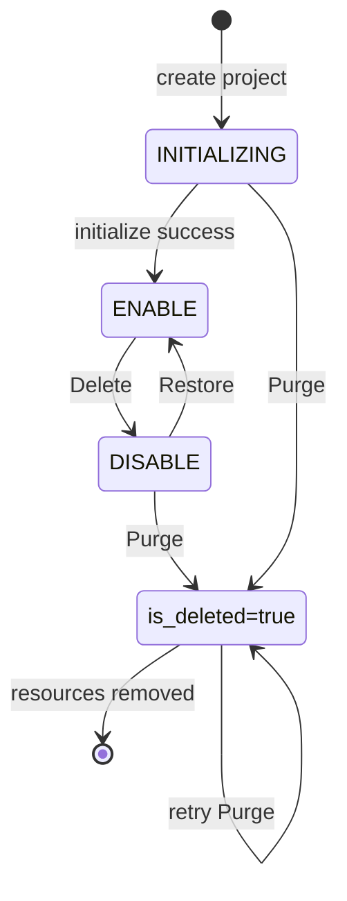

# Wave 组织与项目生命周期治理

> 状态：Draft  
> 创建日期：2026-07-16  
> 目标项目：`/Users/wenshiqin/wave-worktrees/delete_org_project`

## 1. 背景与目标

Wave 当前把可恢复的逻辑删除和不可恢复的物理清理混在同一条调用链中：项目 `Archive` 最终会删除 Doris Database、项目 PostgreSQL Schema 和 Kafka Topic，旧 Delete 还会修改成员和 PM 状态。与此同时，PM、Scheduler 和各组件没有形成完整、可验证的项目失效链路。

本 change 将生命周期收敛为三个动作：

| 动作 | 语义 |
| --- | --- |
| Delete | 轻量、可恢复的状态变更；拒绝新业务使用，不删除项目持久资源 |
| Restore | 恢复 Delete 对象，从当前时刻重新可用，不重建资源或补跑停用期间的业务 |
| Purge | 单独调用、同步、不可恢复的物理清理；代码可重入，失败后从头重试 |

项目不再有 Archive 概念。旧 Archive/Delete 中的资源清理能力只能由 Purge 使用。

## 2. 范围

### 2.1 本期范围

- 组织和项目的 Delete、Restore、Purge 后端能力。
- 删除租户侧 `/project/delete`、`/org/delete` API、Controller 和前端调用。
- 通过组织/项目状态、PM 可用项目目录和关键执行入口阻断新业务。
- 逐项梳理 Web、MCP、Internal API、Edge、ADTOL、ABOL、Connector、Scheduler、Dispatch、C1、MA、QE、LiveEvent、Wagent 等项目入口和本地状态。
- Purge 清理 Project Meta/Data PG、Doris、Kafka、Redis、Wave 管理的 OSS 数据及 Global PG 引用。
- OP 客户详情页“生命周期管理”Tab。
- 六类 OP 生命周期动作的原因、ID 确认和现有 OP 审计日志。

### 2.2 不在本期范围

- 租户侧生命周期入口。
- 自动级联或批量 Delete、Restore、Purge。
- 历史 DISABLE 的扫描、批处理、脚本、运行手册或自动迁移；历史数据由用户人工清理。
- 异步 Purge、执行表、步骤账本、后台任务或进度 UI。
- 新生命周期协调器、事件总线、动态插件、DSL、通用 adapter 或资源注册框架。
- Delete 返回前等待所有进程 ACK，或强制回滚已经发生的外部副作用。
- 为 Restore 建设流量回放、cron 补跑、TTL 冻结或 Kafka 无限保留能力。
- 延迟删除、定时 Purge、双人审批、legal hold。
- 清理客户外部系统中由客户拥有的数据副本。

## 3. 生命周期模型

### 3.1 状态定义

项目复用现有 `DISABLE`；组织新增 `status` 字段并使用相同的 `ENABLE/DISABLE` 语义。不新增 `DELETED`。

| 对象状态 | `status` | `is_deleted` | 可业务使用 | 可 Restore |
| --- | --- | --- | --- | --- |
| 正常 | `ENABLE` | `false` | 是 | 否 |
| 初始化中（仅项目） | `INITIALIZING` | `false` | 否 | 否 |
| Delete | `DISABLE` | `false` | 否 | 是 |
| Purge 墓碑 | 任意 | `true` | 否 | 否 |
| Purged | 主记录不存在 | — | 否 | 否 |

- Delete：`ENABLE,false -> DISABLE,false`。
- Restore：`DISABLE,false -> ENABLE,false`。
- Purge：首个破坏性步骤前设置 `is_deleted=true`，完成后物理删除主记录。
- `is_deleted=true` 只表示 Purge 已开始或旧流程遗留墓碑，不表示可恢复 Delete。
- `INITIALIZING` 项目允许直接 Purge，但不能 Delete 或 Restore。
- 不新增 `purge_started_at`、生命周期状态表或数据库 CHECK/trigger。

### 3.2 状态机



约束：

- Delete、Restore 幂等；重复调用仍修复 PM 状态。
- Purge 拒绝 `ENABLE,false`，接受 `DISABLE,false`、`INITIALIZING,false` 和 `is_deleted=true` 墓碑。
- Organization Delete 前，所有仍存在的项目必须已逐个 Delete；Organization Purge 前，所有项目必须已逐个 Purge。
- Organization Restore 不级联 Restore 项目；父组织非 `ENABLE` 时项目不能 Restore 或 Create。

### 3.3 历史 DISABLE 前置条件

旧 Delete 可能已经删除部分或全部项目资源，因此历史 `DISABLE` 不能直接视为可 Restore 数据。生命周期前端开放前，用户人工完成历史 DISABLE 清理并确认无遗留记录。本 change 不提供额外的批处理、迁移或清理工具。

切换完成后，`DISABLE,false` 只由新 Delete 产生，统一表示可 Restore 的逻辑删除。

## 4. 用户故事与验收场景

### US-1：Delete 项目（P0）

作为 OP，我希望轻量 Delete 项目，使其不再接受新业务，但保留全部持久资源。

验收场景：

1. `ENABLE,false` 项目 Delete 后为 `DISABLE,false`。
2. Delete 只修改 Global PG 状态和 PM 控制状态，不删除或改写 Project PG、Doris、Kafka、OSS、成员、配置、Scheduler Job、Instance、Task 或 lease。
3. Web、MCP、SDK、内部新工作入口和后台执行入口均拒绝该项目的新工作。
4. 已经开始的有限任务可以按现有超时结束；长期消费者在现有 Worker/lease heartbeat 上取消。
5. Delete 不等待全部远端节点 ACK；PM 重连快照对账负责纠正丢失通知。
6. 重复 Delete 成功，并再次确保 PM 已移除项目。

### US-2：Restore 项目（P0）

作为 OP，我希望轻量 Restore 一个由新 Delete 流程删除的项目。

验收场景：

1. 父组织为 `ENABLE,false` 且项目为 `DISABLE,false` 时可 Restore。
2. Restore 只修改 Global PG 状态并调用 PM `SetInfo`，不扫描、重建或重新初始化资源。
3. Restore 不等待旧运行状态收敛；重复 Restore 会重新发布 PM 信息。
4. 项目 ID、名称、Secret、配置、成员、Job 定义和持久数据不变。
5. Delete 期间被拒绝的请求、错过的 cron 和已过期临时状态不补偿。
6. `is_deleted=true` 项目不能 Restore。

### US-3：Purge 项目（P0）

作为 OP，我希望同步清理项目拥有的全部 Wave 资源。

验收场景：

1. `ENABLE,false` 项目不能 Purge；`DISABLE`、`INITIALIZING` 和既有 Purge 墓碑可以 Purge。
2. PM 仍包含项目或长期后台工作未停止时，Purge 返回冲突且不开始破坏性清理。
3. 首个破坏性步骤前设置 `is_deleted=true`，此后永久禁止 Restore。
4. 固定步骤按序执行；目标不存在视为成功，任一步失败则停止，重试从第一步开始。
5. Kafka、OSS 等最终一致资源在各自步骤内验证。
6. 外部资源清理完成后，Global PG 最终事务删除项目引用和主记录。
7. 已不存在项目的重复 Purge 返回 `already_absent=true`。
8. 主记录已硬删时，只有现有 OP 审计能证明同一 customer/project 曾成功 Purge 才返回 `already_absent=true`；否则返回 NotFound。

### US-4：Delete/Restore 组织（P0）

作为 OP，我希望在项目逐个 Delete 后 Delete 组织，并能独立 Restore 组织。

验收场景：

1. 只要存在非 `DISABLE,false` 项目，Organization Delete 就拒绝并返回阻塞项目 ID。
2. Delete 只把组织改为 `DISABLE,false`，不修改成员、角色、邀请、合同、套餐或项目数据。
3. Restore 只把组织改回 `ENABLE`，项目保持各自状态。
4. 组织为 `DISABLE` 时，其项目不能 Restore、Create 或接受业务访问。

### US-5：Purge 组织（P0）

作为 OP，我希望项目逐个 Purge 后再 Purge 组织。

验收场景：

1. 仍存在任何项目记录时拒绝 Organization Purge。
2. Purge 清理组织成员、角色、邀请、Token scope 和组织派生缓存，最后删除组织主记录。
3. OP 客户档案、合同历史、共享 Account 和审计日志保留；客户绑定维持 `expired`。
4. 失败后可以从第一步完整重试。

### US-6：OP 生命周期管理（P0）

作为 OP，我希望在客户详情页管理该客户组织和项目的生命周期。

验收场景：

1. Tab 顺序为：合同 → 配置 → 账单 → 生命周期管理 → 审计。
2. 页面只展示当前客户绑定组织及其项目，不提供全局列表、搜索、分页或批量操作。
3. 所有动作都要求输入非空原因和真实组织/项目 ID。
4. 组织套餐未过期时，在基础确认后再显示一次额外警告。
5. 六类动作的成功、校验失败和执行失败都写入现有 OP 审计日志。

## 5. 功能需求

### FR-1：入口与职责

- 生命周期规则保留在现有 `OrgService`、`ProjectService`；Controller 只做协议转换。
- 旧 Archive 和物理 Delete 入口移除；资源删除函数只能从 Purge 调用。
- OP Customer Ops 负责权限、客户归属、原因、ID 确认和审计，再调用现有 Service。
- PM 只承担可用项目目录和变更传播，不承担 Purge 编排。

### FR-2：PM 可靠性

- `ENABLE` 项目才存在于 PM membership/info。
- Project Delete 调用 `DeleteInfo`；Restore 调用 `SetInfo`。
- membership、info、Pub/Sub 关键写错误返回调用方。
- 调用节点同步更新本地 PM 状态，不等待自己的订阅回环。
- Pub/Sub 断线后自动重订阅，并根据 Redis membership/info 快照对账本地项目 map。
- 继续使用现有 `OnProjectDelete/OnProjectUpdate`，不新增 Restore/Purge 事件或远端 ACK。

### FR-3：Scheduler 与长期任务

- Delete/Restore 不修改 Scheduler Job、Instance、Task 或 lease 持久数据。
- Scheduler Master 在 notify/cron 创建 Instance 前检查 PM。
- Scheduler Worker 在领取 Job/Task 前检查 PM；长期任务在 lease heartbeat 发现项目不可用时取消。
- Connector、MA 的长期消费任务复用统一 Worker 门禁，不建设组件专属生命周期协调器。
- 已开始的短任务可以完成；Purge 必须等运行工作停止。
- Job 位于项目 Meta Schema，Purge 删除 Meta Schema 时一并清理，不逐 Job 删除。

### FR-4：入口和本地资源覆盖

| 组件/入口 | 代码现状 | Delete/Restore 最小要求 |
| --- | --- | --- |
| Web 普通 API | 项目大部分经过 PM；现有 `OrganizationFilter` 不检查状态 | 保留项目门禁；扩展现有 `OrganizationFilter`，组织列表和项目 Create 只接受组织 `ENABLE` |
| MCP | 绕过 Web `ProjectFilter` | 在统一项目授权函数检查 PM，再做成员和 Token Scope 校验 |
| Internal S2S API | 只解析 Project Header | start/create/materialize 等新工作入口检查 PM；finish/update/cleanup 回调继续允许 |
| Edge | 请求依赖 PM，Delete Hook 为空 | 驱逐 token 路由、pipeline version、internal secret 本地 map；Restore 由 update hook 重建 |
| ADTOL | 每次请求使用 PM Token 查项目 | 已覆盖，不增加 Hook |
| ABOL | 请求依赖 PM，现有 Hook 关闭 AB Core | 保留实现并补回归测试 |
| Connector HTTP | AppsFlyer 入口依赖 PM | 已覆盖；debug webhook 不操作项目 |
| Scheduler/Connector/MA Worker | Worker 不依赖 PM，任务可长期运行 | 统一在 Master/Worker 准入和 heartbeat 处理 |
| Dispatch/C1 | Delete Hook 只删 `counts`，现有 refresh 会跳过已删除项目但未标记 topology 变化 | 在现有 refresh 标记并移除 Redis task map 项，促使 TaskManager 关闭 Pipeline；额外驱逐 C1 metadata map |
| MA 本地运行态 | ConfigSync 已注册 Hook，但 cohort index、watcher、matcher、feedback queue/token cache 未统一驱逐 | 保留 Untrack；由 MA Runtime Hook 驱逐这些内存态，长期 consumer 由 Worker 取消 |
| QE Catalog | Delete Hook 为空 | Delete 驱逐项目 Catalog，Restore 懒加载 |
| LiveEvent | WebSocket 建连时只检查一次 | Delete 时关闭项目 Kafka consumer 和 WebSocket；Restore 后按新连接懒启动 |
| Wagent | HTTP 受 Web 保护，Redis Stream Worker 不检查 PM | claim/start 前检查；禁用时不 ACK 或丢弃可恢复任务 |
| Asset Behavior | 每项目持有后台 batcher | Delete 时关闭并移除 batcher；Restore 后懒创建 |
| Pipeline finalizer | 通过 PM 列表运行 | Delete 时自然跳过；Restore 后继续，无额外逻辑 |

没有项目级资源的组件不得增加空 Purge 方法。

### FR-5：持久资源所有权

| 资源 | Delete/Restore | Purge |
| --- | --- | --- |
| Global PG 项目/成员/配置 | 保留 | 最终事务清引用并删除主记录 |
| Meta/Data PG | 保留并继续 migration | Drop Schema |
| Doris | 保留 | Drop Database |
| Kafka Topic/消费组 | 保留 | 删除项目 Topic、Connector/MA 专属组和 LiveEvent 项目组，并验证不存在 |
| Redis 业务 Key | 自然保留或按既有 TTL 过期；只修改 PM 控制状态 | 清共享项目前缀、权限/QE/Project→Org、Token scope cache、Wagent quota/rate-limit 和全局队列项目成员 |
| MA 共享/独享 Redis、项目消费组 | Delete 只经 PM/Worker 停止新执行 | 由 MA 的窄内部接口同步清理 |
| Scheduler Job | 保留 | 随 Meta Schema 删除 |
| Scheduler Redis 通知/lease | 保留，Restore 后继续 | Scheduler 按 project ID 定向移除全局队列成员和项目 lease Key |
| OSS | 保留 | 删除 Wave 管理的 `load/backfill/events_cron/users_cron` 四个项目固定前缀 |
| 进程内 map/consumer/batcher | Delete Hook 或入口门禁收敛 | 进程本地状态不作为 Purge 步骤 |

### FR-6：同步可重入 Purge

- Project/Organization 使用普通静态步骤切片 `purgeStep{name, run}`。
- 不存在目标视为成功；其他错误立即停止并返回 `step`。
- 只有最终一致资源在自己的 `run` 内做必要验证，不增加通用 verify 接口。
- 除 MA 独享 Redis/消费组的单个内部接口外，不跨进程逐组件调用本地 Purge 方法。
- 主记录最后删除，失败时保留墓碑以支持重试。
- 使用请求 context 和现有依赖超时；客户端断开后不转后台继续执行。

### FR-7：数据库和历史兼容

- `organization` 新增 `status varchar(64) not null default 'ENABLE'`。
- `project` 不新增字段或状态常量，继续使用现有 `INITIALIZING/ENABLE/DISABLE`。
- 保留现有 `WHERE is_deleted=false` 部分唯一索引；Delete 后名称继续占用。
- 项目 migration 继续遍历所有 `is_deleted=false` 项目，所以长期 DISABLE 项目仍升级 Meta/Data Schema。
- 不增加全表唯一索引、CHECK、trigger 或推测性资源重建。
- 历史 DISABLE 由用户人工清理；代码和数据库 migration 不自动转换或恢复历史记录。

## 6. API 契约

### 6.1 删除租户接口

删除以下 OpenAPI operation、生成代码、Controller、租户前端调用和旧测试：

- `POST /project/delete`
- `POST /org/delete`

### 6.2 OP 接口

| 接口 | 请求字段 |
| --- | --- |
| `POST /op/customer/lifecycle/get` | `customer_id` |
| `POST /op/customer/lifecycle/project/delete` | `customer_id, project_id, confirm_value, reason` |
| `POST /op/customer/lifecycle/project/restore` | `customer_id, project_id, confirm_value, reason` |
| `POST /op/customer/lifecycle/project/purge` | `customer_id, project_id, confirm_value, reason` |
| `POST /op/customer/lifecycle/org/delete` | `customer_id, organization_id, confirm_value, reason` |
| `POST /op/customer/lifecycle/org/restore` | `customer_id, organization_id, confirm_value, reason` |
| `POST /op/customer/lifecycle/org/purge` | `customer_id, organization_id, confirm_value, reason` |

- `confirm_value` 必须等于目标 ID 的十进制字符串。
- `reason` trim 后必须非空。
- 服务端必须校验 customer → organization → project 归属。
- 重复 Purge 已不存在的目标返回 `purged=true,already_absent=true`。
- 复用现有 `code/msg/data/trace` 包络和通用错误；结构化 `data` 只增加必要的 `resource_id`、`blocked_ids`、`blocked_count`、`step`、`already_absent`。

### 6.3 生命周期详情

```text
CustomerLifecycleDetail {
  customer_id: int64
  organization?: LifecycleOrganization
  projects: LifecycleProject[]
}

LifecycleOrganization {
  id: int64
  name: string
  status: "ENABLE" | "DISABLE"
  is_deleted: bool
  restorable: bool
  updated_at: datetime
}

LifecycleProject {
  id: int64
  org_id: int64
  name: string
  status: "INITIALIZING" | "ENABLE" | "DISABLE"
  is_deleted: bool
  restorable: bool
  updated_at: datetime
}
```

套餐未过期的额外提醒复用客户详情已有截止时间，不增加确认状态字段。

## 7. 权限、审计与前端

- 生命周期详情和六类动作只接受现有 OP 白名单账号会话。
- 普通租户、Account API Token、Project Secret 和内部服务身份不得调用。
- 审计复用 `AuditService.LogWithFallback`，记录 operator、customer/org/project ID、reason、action、before/after、result 和失败 step。
- 审计快照不得包含 Secret、连接凭据或客户外部系统认证信息。
- 客户详情新增简单的生命周期 Tab：组织摘要、项目表和一个通用确认 Dialog。
- 基础 Dialog 输入原因和真实 ID；套餐未过期时再显示额外警告。
- 不输入名称、不显示倒计时、不做自动重试；Purge 网络错误后只刷新状态。
- [低保真原型](./assets/lifecycle-tab-prototype.svg)只用于页面层级参考。

## 8. 事务、错误与边界

- 生命周期操作使用现有 owner-safe Redis 锁，固定“组织锁 → 项目锁”顺序。
- 状态转换使用条件 UPDATE 和 `RowsAffected`，禁止无条件整行 `Save` 覆盖并发状态。
- Project Delete 先 `PM.DeleteInfo`，再条件更新 DB；DB 失败时保持 fail-closed，重复操作负责对账。
- Project Restore 先条件更新 DB，再 `PM.SetInfo`；PM 失败时项目仍不可运行，重复 Restore 重新发布。
- Purge 在首个破坏步骤前标记 `is_deleted=true`；跨存储不模拟分布式事务。
- 外部依赖失败时返回现有错误和稳定 `step`，不把 warning 当成功。
- 空客户绑定返回 `organization=null,projects=[]`。
- Organization Delete 对大量项目只返回有限 blocked IDs 和总数，不级联处理。
- 并发 Delete/Restore/Purge 由锁和条件 UPDATE 保证单一有效转换。
- Restore 不等待运行面收敛；Purge 在运行工作未停止时返回冲突。
- Purge 部分成功后只能重试 Purge，不能 Restore。

## 9. 长期 Delete 后的 Restore 保证

Restore 的保证是“Delete 不主动删除项目持久资源”，不是业务连续性或所有时间性数据的无损恢复。

### 9.1 保证保留

- 项目 ID、名称、Secret、配置、成员和权限关系。
- Meta/Data PG、Doris、Kafka Topic、OSS 数据和 Scheduler Job 定义。
- 项目名称占用关系。
- `is_deleted=false` 项目继续执行 Meta/Data migration，长期 Delete 后仍保持 Schema 版本。
- PM、本地 Catalog 和进程内 map 可通过 Restore 发布、Hook 或懒加载重建。

### 9.2 不保证补偿

| 场景 | Restore 后语义 |
| --- | --- |
| Delete 期间被拒绝的请求、埋点和内部新工作 | 不重放 |
| Delete 期间错过的 cron | 不补跑，从下一调度周期继续 |
| 超过 Kafka 消息或消费组 offset 保留期 | 过期数据无法恢复；具体时长取决于线上 broker 配置 |
| Redis/Wagent/MA 临时状态或 MA 内存 feedback queue | 缓存重建；已过期执行、临时状态和已驱逐 feedback 不恢复 |
| LiveEvent WebSocket | 断开期间的实时消息不补发 |
| 已经开始的有限任务 | 可以在 Delete 后完成 |
| 已发送到外部系统的请求 | 不回滚外部副作用 |
| 组织套餐在 Delete 期间到期 | Restore 按当前套餐状态判断，不冻结商业时间 |

如果未来需要流量重放、cron 补偿或 TTL 冻结，应作为独立需求设计，不进入本 change。

## 10. 测试策略

### 10.1 单元测试

- 项目/组织 `ENABLE ↔ DISABLE`、幂等、父子约束和条件更新。
- `INITIALIZING`、`is_deleted=true` 的 Restore/Purge 边界。
- PM Set/Delete 错误上抛、本地同步、重订阅和快照对账。
- Scheduler Master/Worker 准入和长期任务取消。
- Purge 步骤顺序、NotFound、失败即停、重跑和主记录最后删除。
- OP 权限、客户归属、ID、reason 和审计结果映射。

### 10.2 集成测试

- Delete/Restore 前后 Job、Meta/Data PG、Doris、Kafka、OSS、成员和配置不变。
- DISABLE 项目继续执行 Project migration。
- Web、MCP、Internal 新工作、Edge、ADTOL、ABOL、Connector、Scheduler、Dispatch/C1、MA、QE、LiveEvent、Wagent 和 Asset Behavior 逐项验证。
- Wagent 被拒绝的可恢复消息不被 ACK 或丢弃。
- Project/Organization Purge 资源矩阵和 Global 最终事务。

### 10.3 E2E

1. OP Delete 项目后，新 Web/SDK/MCP/Job 请求被拒绝；Restore 后新请求恢复。
2. 长期 consumer 停止，有限在途任务按约定完成。
3. Delete 前后持久资源一致；长期 DISABLE 项目仍能执行 migration。
4. Purge 中途失败后 Restore 被拒绝，手动重试 Purge 成功。
5. 组织必须先逐项目 Delete/Purge；Restore 不级联项目。
6. 非 OP、跨客户、ID/原因错误均被拒绝；套餐有效时出现额外警告。
7. 六类动作成功、校验失败和执行失败均产生脱敏审计日志。
8. 租户 OpenAPI、Controller 和前端入口均已移除。

## 11. 成功标准

- [ ] 项目和组织 Delete 都使用 `status=DISABLE,is_deleted=false`，不新增 `DELETED`。
- [ ] Delete/Restore 不删除、禁用、扫描或重建持久资源。
- [ ] `is_deleted=true` 只表示 Purge 墓碑。
- [ ] 历史 DISABLE 不由代码或 migration 自动处理，前端开放前由用户人工清理完成。
- [ ] Scheduler Job 不随 Delete 删除；Master/Worker 阻止新执行并终止长期任务。
- [ ] 所有已识别入口和组件均有门禁、真实本地清理或明确无需改动的结论及测试。
- [ ] 长期 Restore 明确保留项和不补偿项，不宣称绝对无损。
- [ ] Purge 同步、可重入，资源清理完成后才删除主记录。
- [ ] Organization Delete/Purge 逐项目执行，Restore 不级联。
- [ ] 只有 OP 能查询和执行动作；旧租户入口已删除。
- [ ] 生命周期 Tab 完成 ID/原因确认、套餐有效额外警告和审计记录。
