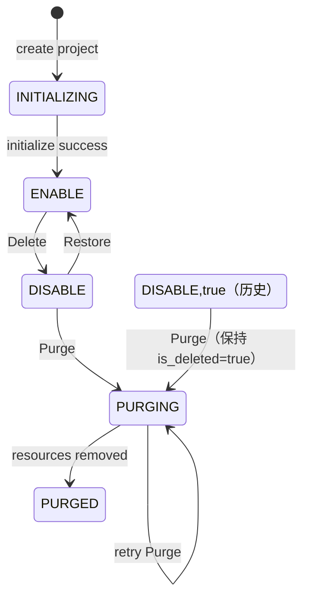

# Wave 组织与项目生命周期治理

> 状态：Draft  
> 创建日期：2026-07-16  
> 目标项目：`/Users/wenshiqin/wave-worktrees/delete_org_project`

## 1. 背景与目标

Wave 当前把可恢复的逻辑删除和不可恢复的物理清理混在同一条调用链中：项目 `Archive` 最终会删除 Doris Database、项目 PostgreSQL Schema 和 Kafka Topic，旧 Delete 还会修改成员和 PM 状态。与此同时，PM、Scheduler 和各组件没有形成完整、可验证的项目失效链路。

本 change 将生命周期收敛为三个动作：

| 动作 | 语义 |
| --- | --- |
| Delete | 轻量、可恢复的状态变更；拒绝新业务使用，不删除项目持久资源 |
| Restore | 恢复 Delete 对象，从当前时刻重新可用，不重建资源或补跑停用期间的业务 |
| Purge | 单独调用、同步、不可恢复的物理清理；代码可重入，失败后从头重试 |

项目不再有 Archive 概念。旧 Archive/Delete 中的资源清理能力只能由 Purge 使用。

## 2. 范围

### 2.1 本期范围

- 组织和项目的 Delete、Restore、Purge 后端能力。
- 删除租户侧 `/project/delete`、`/org/delete` API、Controller 和前端调用。
- 通过组织/项目状态、PM 可用项目目录和关键执行入口阻断新业务。
- 逐项梳理 `apps/web/edge/adtol/abol/connector/c1/ma/simulator` 及共享 PM、Scheduler、Dispatch 的项目入口、持久资源、运行资源和进程内状态；确认无项目资源的组件也要留下结论。
- Purge 清理 Project Meta/Data PG、Doris、Kafka、Redis、Wave 管理的 OSS 数据及 Global PG 引用。
- OP 客户详情页“生命周期管理”Tab。
- 六类 OP 生命周期动作的原因、ID 确认和现有 OP 审计日志。

### 2.2 不在本期范围

- 租户侧生命周期入口。
- 自动级联或批量 Delete、Restore、Purge。
- 历史 DISABLE 的扫描、批处理、脚本、运行手册或自动迁移；用户通过本期 OP Project Purge 逐个处理历史 `DISABLE,true` 项目。
- 异步 Purge、执行表、步骤账本、后台任务或进度 UI。
- 新生命周期协调器、事件总线、动态插件、DSL、通用 adapter 或资源注册框架。
- Delete 返回前等待所有进程 ACK，或强制回滚已经发生的外部副作用。
- 为 Restore 建设流量回放、cron 补跑、TTL 冻结或 Kafka 无限保留能力。
- 延迟删除、定时 Purge、双人审批、legal hold。
- 清理客户外部系统中由客户拥有的数据副本。

## 3. 生命周期模型

### 3.1 状态定义

项目复用现有 `DISABLE`；组织新增 `status` 字段。Project、Organization 统一增加 `PURGING/PURGED`，不新增 `DELETED`。

| 对象状态 | `status` | `is_deleted` | 可业务使用 | 可 Restore |
| --- | --- | --- | --- | --- |
| 正常 | `ENABLE` | `false` | 是 | 否 |
| 初始化中（仅项目） | `INITIALIZING` | `false` | 否 | 否 |
| Delete | `DISABLE` | `false` | 否 | 是 |
| Purge 进行中（新数据） | `PURGING` | `false` | 否 | 否 |
| 历史旧 Delete / 其 Purge 进行中 | `DISABLE/PURGING` | `true` | 否 | 否 |
| Purged 墓碑 | `PURGED` | `true` | 否 | 否 |
| 主记录不存在（物理删除属于本期范围外） | 主记录不存在 | — | 否 | 否 |

- Delete：`ENABLE,false -> DISABLE,false`。
- Restore：`DISABLE,false -> ENABLE,false`。
- 新数据 Purge：先条件写入 `PURGING,false`，清完全部业务资源和引用后在最终 Global PG 事务写 `PURGED,true`。
- 历史旧 Delete 产生的 `DISABLE,true` 可直接 Purge，转换为 `PURGING,true` 后清理，最终归一为 `PURGED,true`；不得把 `is_deleted` 改回 false。
- “`is_deleted` 只在最终事务修改”只约束新生命周期数据；`PURGED,true` 墓碑供 OP 直接查看。本 change 不设计主记录的后续物理删除。
- `INITIALIZING` 项目不能 Delete、Restore 或 Purge；初始化结束只允许条件转换 `INITIALIZING -> ENABLE`。失败初始化继续使用创建流程已有的回滚、修复或运维路径。
- 不新增 `purge_started_at`、生命周期状态表或数据库 CHECK/trigger。

### 3.2 状态机



约束：

- Delete、Restore 幂等；重复调用仍修复 PM 状态。
- Purge 只接受 `DISABLE/PURGING`；拒绝 `INITIALIZING/ENABLE`。历史 `DISABLE/PURGING,true` 保持 `is_deleted=true`，`PURGED,true` 重复调用直接返回已完成。
- Organization Delete 前，所有仍存在的项目必须已逐个 Delete；Organization Purge 前，所有项目必须已逐个 Purge。
- Organization Restore 不级联 Restore 项目；父组织非 `ENABLE` 时项目不能 Restore 或 Create。

### 3.3 历史 DISABLE 前置条件

旧 Delete 可能已经删除部分或全部项目资源，因此历史 `DISABLE,true` 不能直接视为可 Restore 数据。生命周期前端开放前，用户使用本期 OP Project Purge 逐个清理这些项目并确认无遗留记录；Purge 全程保持 `is_deleted=true`，最终写为 `PURGED,true`。本 change 不提供额外的扫描、批处理、迁移或清理工具。

切换完成后，`DISABLE,false` 只由新 Delete 产生，统一表示可 Restore 的逻辑删除。

## 4. 用户故事与验收场景

### US-1：Delete 项目（P0）

作为 OP，我希望轻量 Delete 项目，使其不再接受新业务，但保留全部持久资源。

验收场景：

1. `ENABLE,false` 项目 Delete 后为 `DISABLE,false`。
2. Delete Service 只修改 Global PG 状态和 PM 控制状态，不扫描、删除或改写 Project PG、Doris、Kafka、OSS、成员、配置、Scheduler Job、Instance、Task 或 lease；运行中 handler 后续释放自身 lease 属于正常 heartbeat 收敛。
3. Web、MCP、SDK、内部新工作入口和后台执行入口均拒绝该项目的新工作。
4. 所有运行中 Scheduler handler 在既有 heartbeat 发现 PM 不含项目后取消本地 context、释放 lease；不区分短任务和长期消费者。
5. Delete 不等待全部远端节点 ACK；PM 重连快照对账负责纠正丢失通知。
6. 重复 Delete 成功，并再次确保 PM 已移除项目。
7. Delete 不要求父 Organization 为 `ENABLE`；即使父组织已 `DISABLE`，仍允许把项目收缩到 `DISABLE`。父组织归属校验仍由 OP Customer Ops 完成。

### US-2：Restore 项目（P0）

作为 OP，我希望轻量 Restore 一个由新 Delete 流程删除的项目。

验收场景：

1. 父组织为 `ENABLE,false` 且项目为 `DISABLE,false` 时可 Restore。
2. Restore 只修改 Global PG 状态并调用 PM `SetInfo`，不扫描、重建或重新初始化资源。
3. Restore 不等待旧运行状态收敛；重复 Restore 会重新发布 PM 信息。
4. 项目 ID、名称、Secret、配置、成员、Job 定义和持久数据不变。
5. Delete 期间被拒绝的请求、错过的 cron 和已过期临时状态不补偿。
6. `PURGING`、`PURGED` 或历史 `is_deleted=true` 项目不能 Restore。

### US-3：Purge 项目（P0）

作为 OP，我希望同步清理项目拥有的全部 Wave 资源。

验收场景：

1. `INITIALIZING`、`ENABLE` 项目不能 Purge；`DISABLE` 和 `PURGING` 可以执行或重试，包括历史 `DISABLE/PURGING,is_deleted=true`。
2. 新数据写 `PURGING,false`，历史软删除数据写 `PURGING,true`；随后确保 PM 移除项目。
3. Service 使用显式顺序调用执行资源清理；目标资源不存在视为成功，任一步失败则停止，重试从第一步开始。
4. Purge 期间始终禁止 Restore；进入清理后保持原 `is_deleted`，直到新数据在最终事务由 false 改为 true。
5. Kafka、OSS 等最终一致资源在各自步骤内验证。
6. 外部资源清理完成后，Global PG 最终事务删除项目引用、清空配置并废弃认证 Secret，再把只含 OP 识别字段的主记录写为 `PURGED,true`。
7. `PURGED,true` 的重复 Purge 返回 `purged=true,status=PURGED`；主记录不存在时返回 NotFound，不查询审计表模拟 receipt，也不为范围外物理删除预设实现。

### US-4：Delete/Restore 组织（P0）

作为 OP，我希望在项目逐个 Delete 后 Delete 组织，并能独立 Restore 组织。

验收场景：

1. 只要存在非 `DISABLE,false` 项目，Organization Delete 就拒绝并返回阻塞项目 ID。
2. Delete 只把组织改为 `DISABLE,false`，不修改成员、角色、邀请、合同、套餐或项目数据。
3. Restore 只把组织改回 `ENABLE`，项目保持各自状态。
4. 组织为 `DISABLE` 时，其项目不能 Restore、Create 或接受业务访问。

### US-5：Purge 组织（P0）

作为 OP，我希望项目逐个 Purge 后再 Purge 组织。

验收场景：

1. 只有全部项目都已逐个进入 `PURGED,true` 才允许 Organization Purge；任一项目仍为其他状态时返回阻塞项目 ID。
2. Purge 先写 `PURGING,false`，清理组织成员、角色、邀请、Token scope 和组织派生缓存，最后把组织主记录写为 `PURGED,true`；项目 `PURGED` 墓碑继续保留供 OP 查看。
3. OP 客户档案、合同历史、共享 Account 和审计日志保留；客户绑定维持 `expired`。
4. 失败后可以从第一步完整重试。

### US-6：OP 生命周期管理（P0）

作为 OP，我希望在客户详情页管理该客户组织和项目的生命周期。

验收场景：

1. Tab 顺序为：合同 → 配置 → 账单 → 生命周期管理 → 审计。
2. 页面只展示当前客户绑定组织及其项目，不提供全局列表、搜索、分页或批量操作。
3. 所有动作都要求输入非空原因和真实组织/项目 ID。
4. 组织套餐未过期时，在基础确认后再显示一次额外警告。
5. 六类动作的成功、校验失败和执行失败都写入现有 OP 审计日志。

## 5. 功能需求

### FR-1：入口与职责

- 生命周期规则保留在现有 `OrgService`、`ProjectService`；Controller 只做协议转换。
- 旧 Archive 和物理 Delete 入口移除；资源删除函数只能从 Purge 调用。
- OP Customer Ops 负责权限、客户归属、原因、ID 确认和审计，再调用现有 Service。
- PM 是否存在 Project 是唯一运行开关；PM 不承担 Purge 编排。

### FR-2：PM 可靠性

- `ENABLE` 项目才存在于 PM 可用项目集合索引和项目运行时快照。
- Project Delete 调用 `DeleteInfo`；Restore 调用 `SetInfo`。
- 可用项目集合索引和项目运行时快照的写错误必须返回调用方；Pub/Sub 只负责通知，发布失败返回错误，但订阅者数量不作为成功判据。
- 调用节点同步更新本地 PM 状态，不等待自己的订阅回环。
- Pub/Sub 断线后自动重订阅，并根据 Redis 可用项目集合索引和项目运行时快照计算 added/updated/removed 差集；空快照必须清除本地幽灵项目，读取失败不得误清空。
- 继续使用现有 `OnProjectDelete/OnProjectUpdate` 作为 PM Delete/Update Hook，收敛进程内状态；Scheduler 不依赖新的停止事件、Restore/Purge 事件或远端 ACK。
- Restore 是 `ProjectService` 的业务方法；PM 不新增 `RestoreInfo/OnProjectRestore`。`SetInfo` 只表达项目当前可用，不调用项目资源初始化。

### FR-3：Scheduler 与长期任务

- Delete/Restore Service 不批量修改 Scheduler Job、Instance、Task 或 lease；运行中 handler 只在自身 heartbeat 路径释放 ownership/lease。
- Scheduler Master 在 notify/cron 创建 Instance 前检查 PM。
- Scheduler Worker 在领取 Job/Task 前检查 PM；所有运行中 handler 在既有 heartbeat 发现项目不可用时只取消本地 context、释放 lease。
- Job/Instance/Task 不写 `STOP/CANCELED`，不增加业务失败次数；Connector、MA 不自行订阅生命周期停止信号。
- Restore 后由现有 cron/repair 恢复，Delete 期间错过的 cron 不补跑；Purge 必须等运行工作停止。
- Job 位于项目 Meta Schema，Purge 删除 Meta Schema 时一并清理，不逐 Job 删除。

### FR-4：项目不可用必须覆盖所有工作入口

- 只有能从 PM 取得项目的新请求和新任务才能开始执行；Web、SDK、MCP、Internal S2S、Edge、ADTOL、ABOL、Scheduler 和 Dispatch 的项目入口都必须覆盖。
- `PM.DeleteInfo` 是项目不可用信号，不是同步分布式屏障：调用节点必须立即从本地 PM 驱逐项目，其他节点通过 Pub/Sub 和重连快照对账最终收敛；Delete 不等待远端 ACK，也不要求每个请求直查 Redis。
- 每个能启动项目工作的入口必须唯一映射到请求门禁、任务/队列领取门禁、运行中 heartbeat 或资源 owner Hook；不能只用“所在 app 已初始化 PM”或“资源已列入台账”证明覆盖完成。
- Delete 后，入口门禁拒绝新工作；运行中的工作通过 PM Delete Hook、Scheduler heartbeat 或 Dispatch 拓扑刷新收敛。
- Internal S2S 按语义区分：新工作命令拒绝，Delete 前已启动工作的只读查询和结果/进度回写允许收尾；进入 `PURGING/PURGED` 后拒绝全部项目级调用。Migration 是明确例外，`DISABLE,false` 继续升级，`PURGING/PURGED` 才停止。
- PM 在 app/进程内初始化，但接入和收敛按模块负责；app 初始化 PM 不等于内部所有模块自动受控。
- 有可绕过 PM 的进程内路由，或持有 consumer、goroutine、WebSocket、batcher 等运行资源的模块，必须由资源 owner 驱逐或停止。
- 没有项目运行资源的模块只复用入口门禁，不增加空 Hook、空 Purge 方法或组件专属停止协议。
- Restore 调用 `PM.SetInfo` 后，从当前时刻恢复新工作；模块通过 PM Update Hook、Scheduler/Dispatch 或懒加载恢复，不回放 Delete 期间的工作。
- 组件接入方式、资源和代码改动以 `04-detail.md` 第 4–5 章为唯一明细，不在 spec 重复资源台账。

### FR-5：生命周期动作与资源边界

项目资源按所有权分为三类。所有组件行为遵循统一规则：

| 资源类别 | 所有权 | Delete | Restore | Purge |
| --- | --- | --- | --- | --- |
| **持久资源** | 项目独占——Global PG 状态、PM 目录、PG Schema、Doris DB、Kafka Topic、OSS 前缀、Redis 业务数据 | 全部保留；状态写 `DISABLE`；`DeleteInfo` 移除 PM 目录；Redis 业务数据保留，按既有 TTL 自然过期 | 不检查、不重建；状态写回 `ENABLE`；`SetInfo` 写回 PM | 由 owner 物理删除并核验；Redis 定向清理；PM 确认不存在；保留 `PURGED` 墓碑 |
| **运行资源** | 进程内或项目级——内存 map、consumer goroutine、WebSocket、cache、Scheduler job、Redis lease/task map | PM Hook 主动收敛；进程内状态驱逐（仅可能继续工作或绕过 PM 的）；Redis 派生状态定向重写或释放 | 懒加载重建或重新领取，不主动重建 | owner 使用既有 ownership、heartbeat、task map、consumer group 或 drain 结果确认停止；无法确认时保持 `PURGING` |
| **共享资源** | 跨项目——全局 Kafka producer、全局 loader、客户外部数据 | 保留 | 保留 | 保留 |

具体的 PG、Doris、Kafka、Redis、OSS、Scheduler 以及各 `apps/*` 资源归属和动作，以 `04-detail.md` 为准。

### FR-6：同步可重入 Purge

- Project/Organization Service 直接按固定顺序调用现有资源清理函数，不建设步骤切片、协调器或注册表。
- 不存在资源视为成功；其他错误立即停止并返回稳定 `step`。
- 每个 owner 必须先用自己已有的运行状态完成有界停止，再删除和核验资源；不建设通用静默协议，也不能仅凭 PM 已移除就判断运行工作已经结束。
- 只有最终一致资源在自己的清理函数内做必要验证，不增加通用 verify 接口。
- 不跨进程逐组件调用本地 Purge 方法。
- 失败时保留当前 `PURGING,is_deleted` 组合以支持重试；新数据为 `PURGING,false`，历史软删除数据为 `PURGING,true`，全部成功后统一写 `PURGED,true`。
- 使用请求 context 和现有依赖超时；客户端断开后不转后台继续执行。

### FR-7：数据库和历史兼容

- `organization` 新增 `status varchar(64) not null default 'ENABLE'`：新环境同步修改 `script/sql/pgsql/global.sql`；存量 migration 先加 nullable 列，再把 `is_deleted=false/true` 分别回填为 `ENABLE/DISABLE`，最后设置 default 和 NOT NULL。
- `project` 不新增字段，增加 `PURGING/PURGED` 状态常量；`organization` 使用 `ENABLE/DISABLE/PURGING/PURGED`。
- 保留现有 `WHERE is_deleted=false` 部分唯一索引；Delete 后名称继续占用。
- migration runner 改用 `GetAllMigrationProjects`，只遍历 `INITIALIZING/ENABLE/DISABLE,is_deleted=false`；长期 DISABLE 继续升级，PURGING/PURGED 不升级。
- migration 与 Purge 的 Doris/PG 删除复用现有 owner-token Redis 锁做单项目短互斥；取得锁后重查生命周期，DDL 受 statement timeout 约束，不新增锁包或续租器。
- 不增加全表唯一索引、CHECK、trigger 或推测性资源重建。
- 历史 `DISABLE,true` 由用户通过 OP Project Purge 逐个处理；代码和数据库 migration 不自动转换或恢复历史记录。

## 6. API 契约

### 6.1 删除租户接口

删除以下 OpenAPI operation、生成代码、Controller、租户前端调用和旧测试：

- `POST /project/delete`
- `POST /org/delete`

### 6.2 OP 接口

| 接口 | 请求字段 |
| --- | --- |
| `POST /op/customer/lifecycle/get` | `customer_id` |
| `POST /op/customer/lifecycle/project/delete` | `customer_id, project_id, confirm_value, reason` |
| `POST /op/customer/lifecycle/project/restore` | `customer_id, project_id, confirm_value, reason` |
| `POST /op/customer/lifecycle/project/purge` | `customer_id, project_id, confirm_value, reason` |
| `POST /op/customer/lifecycle/org/delete` | `customer_id, organization_id, confirm_value, reason` |
| `POST /op/customer/lifecycle/org/restore` | `customer_id, organization_id, confirm_value, reason` |
| `POST /op/customer/lifecycle/org/purge` | `customer_id, organization_id, confirm_value, reason` |

- `confirm_value` 必须等于目标 ID 的十进制字符串。
- `reason` trim 后必须非空。
- 服务端必须校验 customer → organization → project 归属。
- 重复 Purge `PURGED,true` 目标返回 `purged=true,status=PURGED`；墓碑不存在返回 NotFound。
- 复用现有 `code/msg/data/trace` 包络和通用错误；结构化 `data` 只增加必要的 `resource_id`、`status`、`purged`、`blocked_ids`、`blocked_count` 和 `step`。

### 6.3 生命周期详情

```text
CustomerLifecycleDetail {
  customer_id: int64
  organization?: LifecycleOrganization
  projects: LifecycleProject[]
}

LifecycleOrganization {
  id: int64
  name: string
  status: "ENABLE" | "DISABLE" | "PURGING" | "PURGED"
  is_deleted: bool
  restorable: bool
  updated_at: datetime
}

LifecycleProject {
  id: int64
  org_id: int64
  name: string
  status: "INITIALIZING" | "ENABLE" | "DISABLE" | "PURGING" | "PURGED"
  is_deleted: bool
  restorable: bool
  updated_at: datetime
}
```

套餐未过期的额外提醒复用客户详情已有截止时间，不增加确认状态字段。

## 7. 权限、审计与前端

- 生命周期详情和六类动作只接受现有 OP 白名单账号会话。
- 普通租户、Account API Token、Project Secret 和内部服务身份不得调用。
- 审计复用 `AuditService.LogWithFallback`，记录 operator、customer/org/project ID、reason、action、before/after、result 和失败 step。
- 审计快照不得包含 Secret、连接凭据或客户外部系统认证信息。
- 客户详情新增简单的生命周期 Tab：组织摘要、项目表和一个通用确认 Dialog。
- 基础 Dialog 输入原因和真实 ID；套餐未过期时再显示额外警告。
- 不输入名称、不显示倒计时、不做自动重试；Purge 网络错误后只刷新状态。
- [低保真原型](./assets/lifecycle-tab-prototype.svg)只用于页面层级参考。

## 8. 事务、错误与边界

- 既有 owner-safe Redis 锁只保护 Create 与生命周期状态切换的短竞争；确实同时获取组织/项目锁时固定“组织锁 → 项目锁”，Project Delete 只获取项目锁。重 Purge 不依赖长 TTL 锁保证正确性，也不增加续租器。
- 状态转换使用条件 UPDATE 和 `RowsAffected`，禁止无条件整行 `Save` 覆盖并发状态。
- Project Delete 先 `PM.DeleteInfo`，再条件更新 DB；DB 失败时保持 fail-closed，重复操作负责对账。
- Project Restore 先条件更新 DB，再 `PM.SetInfo`；PM 失败时项目仍不可运行，重复 Restore 重新发布。
- Purge 先写 `PURGING` 并保持原 `is_deleted`；只有全部清理成功才在最终事务写 `PURGED,true`，跨存储不模拟分布式事务。
- 外部依赖失败时返回现有错误和稳定 `step`，不把 warning 当成功。
- 空客户绑定返回 `organization=null,projects=[]`。
- Organization Delete 对大量项目只返回有限 blocked IDs 和总数，不级联处理。
- 并发 Delete/Restore/Purge 由锁和条件 UPDATE 保证单一有效转换。
- Restore 不等待运行面收敛；Purge 依赖 Delete 阶段的收敛结果。
- Purge 部分成功后只能重试 Purge，不能 Restore。

## 9. 长期 Delete 后的 Restore 保证

Restore 的保证是“Delete 不主动删除项目持久资源”，不是业务连续性或所有时间性数据的无损恢复。

### 9.1 保证保留

- 项目 ID、名称、Secret、配置、成员和权限关系。
- Meta/Data PG、Doris、Kafka Topic、OSS 数据和 Scheduler Job 定义。
- 项目名称占用关系。
- `is_deleted=false` 项目继续执行 Meta PG/Doris migration，长期 Delete 后仍保持对应存储版本；当前 migration framework 没有 Data PG 类型。
- PM、本地 Catalog 和进程内 map 可通过 Restore 发布、Hook 或懒加载重建。

### 9.2 不保证补偿

| 场景 | Restore 后语义 |
| --- | --- |
| Delete 期间被拒绝的请求、埋点和内部新工作 | 不重放 |
| Delete 期间错过的 cron | 不补跑，从下一调度周期继续 |
| 超过 Kafka 消息或消费组 offset 保留期 | 过期数据无法恢复；具体时长取决于线上 broker 配置 |
| Redis/Wagent/MA 临时状态或 MA 内存 feedback queue | 缓存重建；已过期执行、临时状态和已驱逐 feedback 不恢复 |
| LiveEvent WebSocket | 断开期间的实时消息不补发 |
| 已经开始的 Scheduler handler | heartbeat 发现 PM 不含项目后取消本地 context；取消前已发生的外部副作用不回滚 |
| 已发送到外部系统的请求 | 不回滚外部副作用 |
| 组织套餐在 Delete 期间到期 | Restore 按当前套餐状态判断，不冻结商业时间 |

如果未来需要流量重放、cron 补偿或 TTL 冻结，应作为独立需求设计，不进入本 change。

## 10. 测试策略

### 10.1 单元测试

- 项目/组织 `ENABLE ↔ DISABLE`、幂等、父子约束和条件更新。
- `INITIALIZING` 拒绝全部生命周期动作且初始化只能转 `ENABLE`；覆盖 `PURGING/PURGED` 与历史 `DISABLE,true -> PURGING,true -> PURGED,true` 边界。
- PM Set/Delete 错误上抛、本地同步、重订阅和快照对账。
- Scheduler Master/Worker 准入、heartbeat 本地取消、持久任务状态不变和 Restore repair。
- Purge 顺序、NotFound、失败即停、`PURGING` 重跑和最终 `PURGED,true`。
- OP 权限、客户归属、ID、reason 和审计结果映射。

### 10.2 集成测试

- Delete/Restore 前后 Job、Meta/Data PG、Doris、Kafka、OSS、成员和配置不变。
- DISABLE 项目继续执行 Project migration。
- Web、MCP、Internal 新工作、Edge、ADTOL、ABOL、Connector、Scheduler、Dispatch/C1、MA、QE、LiveEvent、Wagent 和 Asset Behavior 逐项验证。
- Wagent 被拒绝的可恢复消息不被 ACK 或丢弃。
- Project/Organization Purge 资源矩阵和 Global 最终事务。
- 八个 `apps/*` 顶级目录及共享 PM/Scheduler/Dispatch 的覆盖清单逐项有测试或“无项目资源、无需改动”的代码证据。

### 10.3 E2E

1. OP Delete 项目后，新 Web/SDK/MCP/Job 请求被拒绝；Restore 后新请求恢复。
2. 所有运行中 Scheduler handler 在 heartbeat 后停止，Job/Instance/Task 持久状态不被标记为 CANCELED。
3. Delete 前后持久资源一致；长期 DISABLE 项目仍能执行 migration。
4. Purge 中途失败后 Restore 被拒绝，手动重试 Purge 成功。
5. 组织必须先逐项目 Delete/Purge；Restore 不级联项目。
6. 非 OP、跨客户、ID/原因错误均被拒绝；套餐有效时出现额外警告。
7. 六类动作成功、校验失败和执行失败均产生脱敏审计日志。
8. 租户 OpenAPI、Controller 和前端入口均已移除。

## 11. 成功标准

- [ ] 项目和组织 Delete 都使用 `status=DISABLE,is_deleted=false`，不新增 `DELETED`。
- [ ] Delete/Restore 不删除、禁用、扫描或重建持久资源。
- [ ] 新数据 Purge 使用 `PURGING,false`，历史 `DISABLE,true` 使用 `PURGING,true`；全部成功后统一写 `PURGED,true`。
- [ ] 历史 `DISABLE,true` 不由 migration 自动处理，前端开放前由用户逐个调用 Purge 清理完成。
- [ ] Scheduler Job 不随 Delete 删除；PM 是唯一运行开关，Master/Worker 阻止新执行，heartbeat 取消所有运行中 handler 且不改持久任务状态。
- [ ] 所有 `apps/*` 顶级组件和共享项目基础设施均有项目入口、持久/运行/内存资源、生命周期行为、owner 与测试结论；无资源组件也明确记录。
- [ ] 长期 Restore 明确保留项和不补偿项，不宣称绝对无损。
- [ ] Purge 同步、可重入，资源清理完成后主记录进入可查询的 `PURGED,true`；墓碑的后续物理删除不在本期设计范围。
- [ ] Organization Delete/Purge 逐项目执行，Restore 不级联。
- [ ] 只有 OP 能查询和执行动作；旧租户入口已删除。
- [ ] 生命周期 Tab 完成 ID/原因确认、套餐有效额外警告和审计记录。
