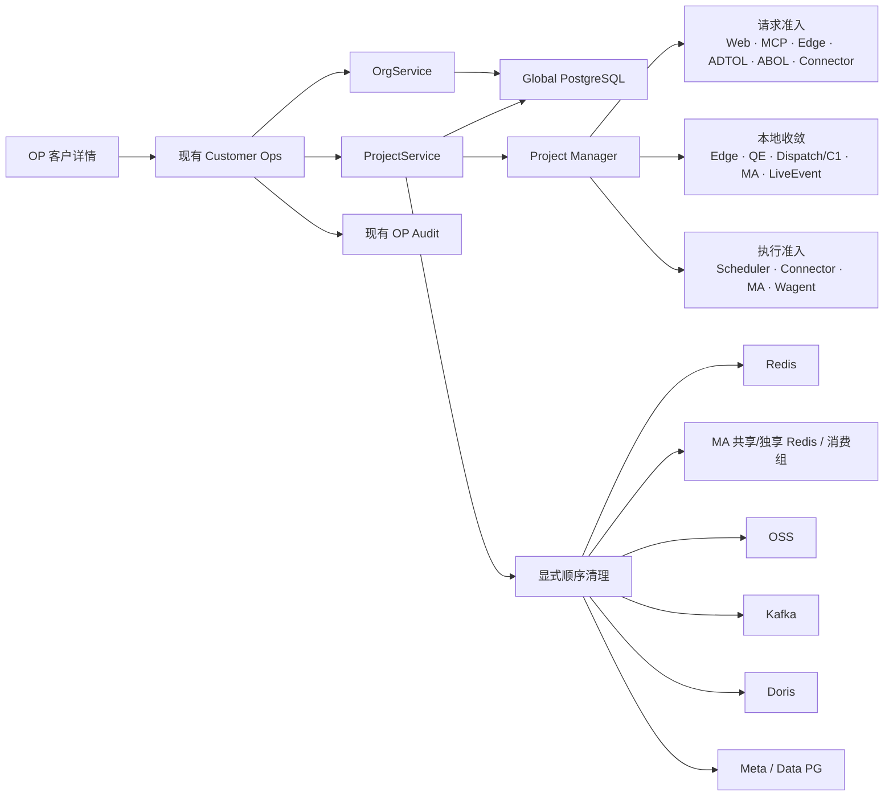
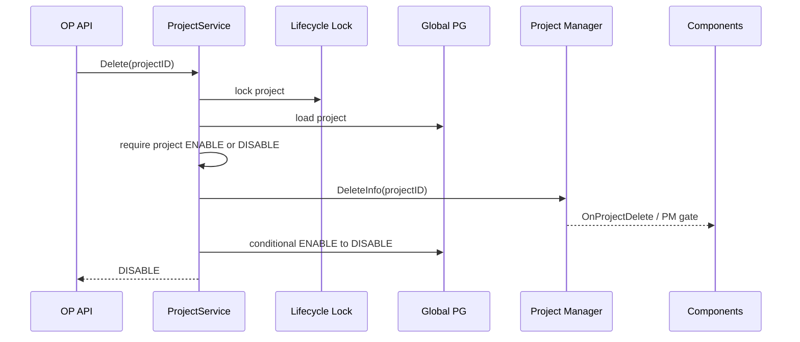
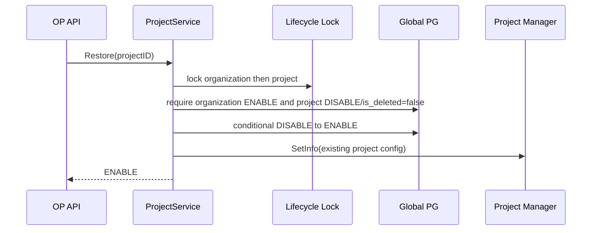
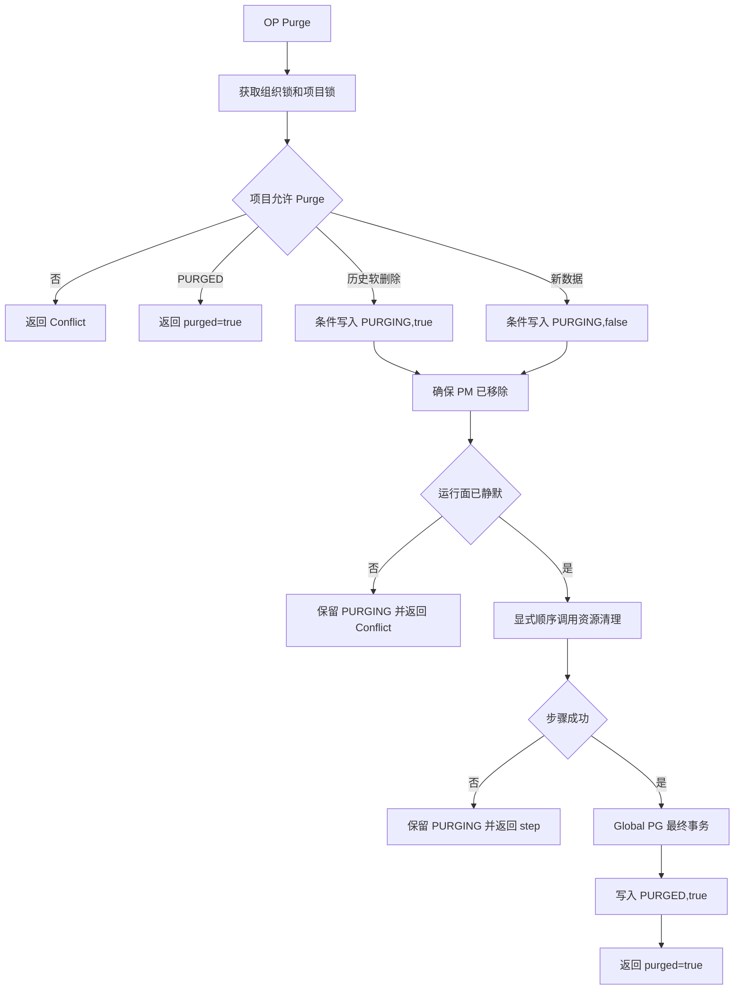
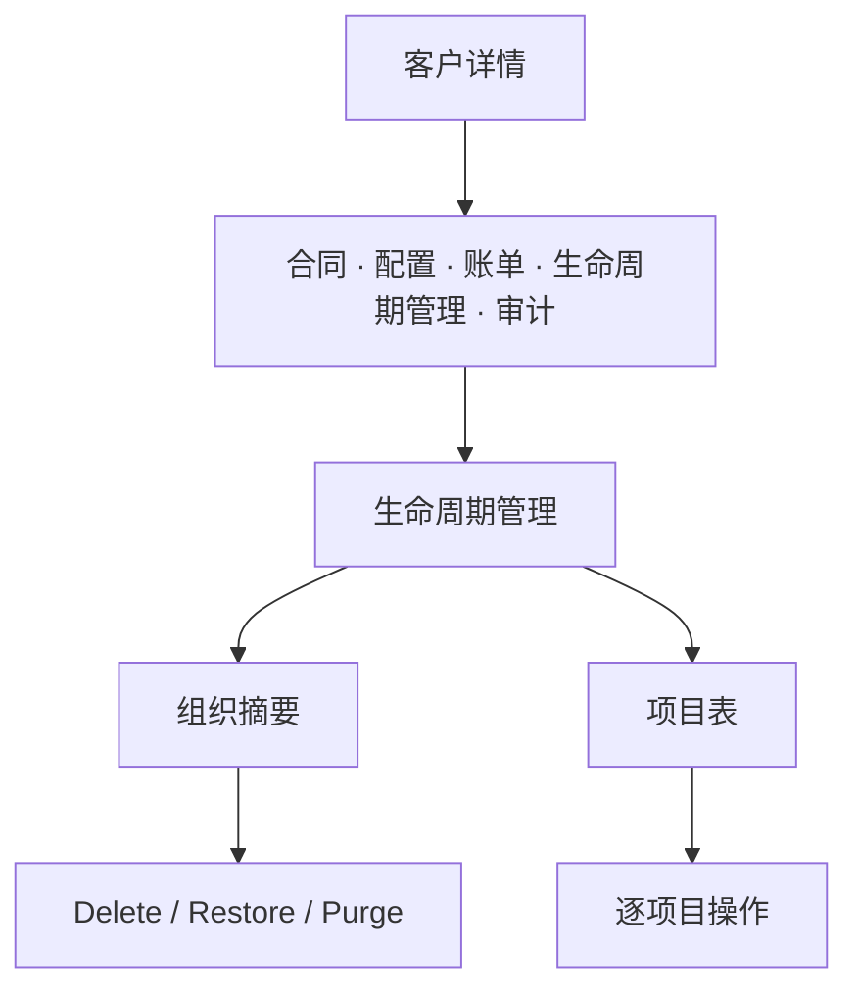

# Wave 组织与项目生命周期治理：概要设计

> 状态：待评审（详细设计已生成）  
> 依据：[01-spec.md](./01-spec.md) 与 [02-decisions.md](./02-decisions.md)

## 1. 背景与目标

当前项目 `Archive` 会进入旧 Delete，依次修改状态、删除一个 Scheduler Job、删除 Doris/PG/Kafka、软删除成员和项目，并移除 PM 信息。它既不是可恢复 Delete，也不是覆盖完整资源的 Purge。

本方案完成三件事：

- Delete：`ENABLE -> DISABLE`，从业务入口和后台执行面拒绝新工作，不碰持久资源。
- Restore：`DISABLE -> ENABLE` 并重新发布 PM，从当前时刻恢复。
- Purge：同步清理全部 Wave 管理资源，失败后可从头重试。

目标是功能完整但不建设生命周期平台：复用现有 OrgService、ProjectService、PM、Scheduler 和资源 client，只补真实旁路与本地资源。

## 2. 现状与约束

### 2.1 代码事实

| 事实 | 影响 |
| --- | --- |
| `project.status` 已有 `INITIALIZING/ENABLE/DISABLE` | 复用 `DISABLE` 表示可 Restore Delete，只增加 Purge 所需的 `PURGING/PURGED` |
| 旧 Delete 会删除 Doris、Meta/Data PG、Kafka、成员和一个 Job | 旧资源删除能力全部收口到 Purge |
| 名称唯一索引只排除 `is_deleted=true` | Delete 保持 `is_deleted=false`，自然保留名称 |
| migration 使用 `GetAllNotDeletedProjects` | 改为单用途查询：DISABLE 继续升级，PURGING/PURGED 排除 |
| PM 被多数请求入口、Token 解析和后台枚举使用 | PM 可作为主要可用目录，但不能假定所有组件都直接依赖 PM |
| PM 部分写错误只记日志，订阅关闭后会退出 | 需要错误上抛、本地同步、重订阅和快照对账 |
| Scheduler 已加载 cron/notify 和 Worker 不会统一重查 PM | 需要在 Master/Worker 中心入口补门禁 |
| MCP、Internal S2S、LiveEvent、Wagent 存在 PM 旁路 | 必须分别在现有统一入口补最小检查 |
| Edge、QE、C1 metadata、Asset Behavior 存在项目进程内状态 | 只补实际清退，不增加统一资源接口 |
| OP 已有权限、确认和审计能力 | 直接复用，不新建权限或审计体系 |

### 2.2 设计约束

- 生命周期只允许 OP 操作，旧租户 Delete 接口删除并在混部期间保持阻断。
- 组织必须逐项目 Delete/Purge，不自动级联。
- Delete/Restore 不能删除、Stop、扫描或重建持久资源。
- Purge 同步、可重入，不建执行表、步骤账本或后台任务。
- 历史 `DISABLE,true` 由用户逐个调用本期 Purge 清理；不交付批处理、扫描页或专用迁移工具。
- 不增加 deny Key、`purge_started_at`、全表索引切换、生命周期 CHECK/trigger、专属错误码或通用协调器。

## 3. 顶层方案

### 3.1 状态模型

```text
Project:
  INITIALIZING / ENABLE / DISABLE / PURGING / PURGED

Organization:
  ENABLE / DISABLE / PURGING / PURGED

is_deleted=false:
  ENABLE / DISABLE / INITIALIZING / PURGING；主记录继续占用名称

is_deleted=true:
  PURGED 墓碑、历史 DISABLE，以及历史数据 Purge 中的 PURGING
```

| 转换 | Global PG | PM | 持久资源 |
| --- | --- | --- | --- |
| Project Delete | `ENABLE -> DISABLE` | `DeleteInfo` | 不变 |
| Project Restore | `DISABLE -> ENABLE` | `SetInfo` | 不变 |
| Project Purge（新数据） | `DISABLE/INITIALIZING,false -> PURGING,false -> PURGED,true` | 确保已移除 | 显式顺序清理 |
| Project Purge（历史） | `DISABLE,true -> PURGING,true -> PURGED,true` | 确保已移除 | 同一套显式顺序清理 |
| Organization Delete | `ENABLE -> DISABLE` | 项目已逐个移除 | 不变 |
| Organization Restore | `DISABLE -> ENABLE` | 不级联项目 | 不变 |
| Organization Purge | `DISABLE -> PURGING,false -> PURGED,true` | 无 | 显式顺序清理 |

`INITIALIZING` 项目和历史 `DISABLE,true` 项目可直接 Purge。`ENABLE` 项目不能 Purge；`PURGING/PURGED` 和历史 `is_deleted=true` 记录不能 Restore。用户在上线前通过同一 OP Project Purge 逐个处理历史软删除项目；本 change 不设计主记录的后续物理删除。

### 3.2 组件关系



PM 是否存在 Project 是请求和任务的唯一运行开关，不是生命周期编排器。Purge 不通过 PM 逐组件调用清理，也不新增停止事件。

## 4. 核心流程

### 4.1 Project Delete



要点：

1. 对已 `DISABLE` 项目的重复 Delete 仍调用 `DeleteInfo`，用于修复部分失败。
2. PM 先失效是 fail-closed：DB 更新失败时项目可能暂时不可用，但不会继续接收新流量。
3. 不调用资源删除函数、JobDelete/JobStop、成员删除、权限缓存扫描或业务 Redis 清理。
4. Delete 成功表示 DB/PM 权威状态已提交，不表示所有远端进程已经 ACK。
5. 所有运行中 Scheduler handler 在 Worker heartbeat 发现 PM 不含项目后取消本地 context、释放 lease；不修改任务持久状态。
6. 不检查父 Organization status；Delete 是单向收缩操作，父组织已 `DISABLE` 时仍允许执行。Restore/Create 才要求父组织 `ENABLE,false`。

### 4.2 Project Restore



要点：

- Restore 不等待 Job/lease 或远端 Hook 收敛，不检查 Meta/Data PG、Doris、Kafka、OSS。
- 不创建 Job、不重新初始化项目、不补 migration。
- PM 写失败时返回依赖错误；重复 Restore 即使 DB 已为 `ENABLE` 也重新执行 `SetInfo`。
- 历史 `DISABLE,true` 必须在功能开放前逐个 Purge；Restore 始终拒绝 `is_deleted=true`。

### 4.3 Project Purge



允许 Purge：

- `DISABLE,false`。
- `INITIALIZING,false`。
- `PURGING,false`，用于重试。
- 历史 `DISABLE,true` 和 `PURGING,true`，保持 `is_deleted=true` 执行或重试。
- `PURGED,true`，直接返回已完成。

运行面静默只检查已有的可观测状态，例如 Scheduler Instance/Task/lease、Dispatch 项目任务数和 Wagent 运行执行；不为 PM Delete Hook 建远端 ACK。少量仍在收敛的进程内状态如果与资源删除竞争，由现有依赖错误和幂等 Purge 重试兜底。

最小步骤顺序：

| 顺序 | step | 内容 |
| --- | --- | --- |
| 1 | `project_redis` | Scheduler 定向清全局通知/lease；Wagent 定向清 Stream、quota/rate-limit；清权限、资产权限、QE lock、Project→Org cache 和共享 `p:<pid>:` 前缀；不删除生命周期锁 |
| 2 | `project_ma` | 通过一个窄的 MA 内部接口删除共享/独享 Redis 项目 Key 和项目消费组 |
| 3 | `project_oss` | 删除 Wave 管理的 `load/backfill/events_cron/users_cron` 四个项目固定前缀并验证 |
| 4 | `project_kafka` | 删除 Connector 专属组、`live-event-<pid>-*` 组和项目 Topic 并验证；MA 组已由前一步处理 |
| 5 | `project_doris` | Drop 项目 Database |
| 6 | `project_pgdata` | Drop Data Schema |
| 7 | `project_meta` | Drop Meta Schema，Scheduler Job 随 Schema 删除 |
| 8 | `project_global` | 最终事务清引用和配置/凭据，写 project `PURGED,true` 最小墓碑 |

ProjectService 直接按表中顺序调用已有或窄化后的资源函数，在返回错误上附稳定 step；不建设步骤切片、注册表或通用 verify 接口。不存在资源视为成功，最终一致资源只在自己的清理函数内验证。

### 4.4 Organization 生命周期

- Delete：组织锁内重查项目；存在任何非 `DISABLE,false` 项目时拒绝；条件更新组织为 `DISABLE`。
- Restore：`DISABLE,false -> ENABLE`，不级联项目。
- Purge：要求组织为 `DISABLE,false` 且所有子项目均为 `PURGED,true`；写 `PURGING,false`，清组织派生关系，最后写组织 `PURGED,true`，项目墓碑继续保留。
- OP Customer Profile、合同历史、共享 Account 和审计日志保留；客户绑定维持 `expired`。

## 5. PM 与执行面

### 5.1 PM 最小修复

`pkg/pm/project_manager.go` 保留现有接口，只补可靠性：

1. `SetInfo/DeleteInfo` 的 membership、info、publish 关键错误返回调用方。
2. Redis 写成功后立即更新调用节点本地 map，不等待订阅回环。
3. 订阅通道关闭后重订阅。
4. 重订阅后根据 Redis membership/info 快照对账本地 map，补发本地 set/delete Hook。
5. Hook panic 继续隔离；不增加远端 ACK、Restore/Purge 事件或生命周期版本号。

### 5.2 组件入口与资源原则

组件入口、资源和生命周期动作的逐项清单统一放在 [04-detail.md](./04-detail.md) 第 4 章；本 plan 只保留原则：所有新工作入口依赖 PM，真实进程内状态复用现有 PM Delete/Update Hook，Scheduler handler 统一由 Master/Worker 门禁和 heartbeat 收敛，无项目资源的组件不增加空接口。

### 5.3 Scheduler 语义

Delete 不调用：

- `DeleteUsageMeteringDailySchedulerJob`
- `JobDelete`
- `JobStop`
- 逐项目修改 Job Instance、Task 或 lease

新的保证：

- 已加载 cron 和 Redis notify 在创建 Instance 前重查 PM。
- Worker 领取 Instance/Task 前重查 PM。
- PM 是否存在 Project 是唯一运行开关，不新增停止信号或逐任务命令。
- 所有运行中 handler 在现有 heartbeat 发现项目不可用时只取消本地 context、释放 lease；Job/Instance/Task 不写 STOP/CANCELED，也不增加业务失败次数。
- Restore 不等待这些状态收敛；Purge 必须确认全部运行工作停止。
- Delete 期间错过的 cron 不补跑，Restore 后从下一个周期继续。

## 6. 数据模型与 DAO

### 6.1 Schema

| 表 | 变更 |
| --- | --- |
| `organization` | 新增 `status varchar(64) not null default 'ENABLE'` |
| `project` | 不新增字段，复用 `DISABLE` 并增加 `PURGING/PURGED` 常量 |
| 名称索引 | 保持现有 `WHERE is_deleted=false` 部分唯一索引 |

业务表只增加组织 status 并同步 bootstrap SQL。migration 不写 token，不注册额外服务身份，不添加 CHECK、trigger、全表索引或项目数据回填。

### 6.2 查询语义

| 查询用途 | 条件 |
| --- | --- |
| 普通组织业务 | `organization.status=ENABLE AND is_deleted=false` |
| 普通项目入口/列表 | `project.status=ENABLE AND is_deleted=false`，并要求父组织 `ENABLE` 或 PM 存在 |
| 项目创建重名 | 所有 `is_deleted=false`，使 DISABLE 名称继续占用 |
| OP Lifecycle | 包含 ENABLE、DISABLE、INITIALIZING、PURGING、PURGED |
| Project migration | `INITIALIZING/ENABLE/DISABLE,is_deleted=false` |
| Purge | 显式 WithDeleted，支持历史 `DISABLE/PURGING,true`、新 `PURGING,false` 和 `PURGED,true` 查询 |

重点审查现有 `GetByID`、`ListByOrg`、`GetByOrgAndName`、`GetAllEnableProjects`；migration 单用途方法改为 `GetAllMigrationProjects`，不把所有 DAO 机械改成同一个条件。

### 6.3 条件更新

- Project Delete：`WHERE id=? AND status=ENABLE AND is_deleted=false`。
- Project Restore：`WHERE id=? AND status=DISABLE AND is_deleted=false`。
- Project Purge marker：新数据 `DISABLE/INITIALIZING,false -> PURGING,false`；历史数据 `DISABLE,true -> PURGING,true`；两种 `PURGING` 均允许重试，`PURGED,true` 直接返回已完成。
- Organization Delete/Restore 使用同样的 ENABLE/DISABLE 条件更新。
- 项目普通根更新必须带 `status=ENABLE AND is_deleted=false`，不得用无条件 `Save` 恢复旧状态。
- Organization Create、Project Create、Project Restore 和 Organization lifecycle 在需要组织状态时使用相同锁顺序；Project Delete 只获取项目锁，不为不需要的父组织约束扩大锁范围。

## 7. API、权限与审计

### 7.1 API

删除租户接口：

- `POST /project/delete`
- `POST /org/delete`

新增 OP 接口：

- `POST /op/customer/lifecycle/get`
- `POST /op/customer/lifecycle/project/{delete,restore,purge}`
- `POST /op/customer/lifecycle/org/{delete,restore,purge}`

六类动作统一传 `customer_id`、目标 ID、`confirm_value` 和 `reason`。`confirm_value` 必须等于目标 ID；服务端校验 customer → organization → project 归属。

错误复用现有 BadParam/PermissionDenied/Conflict/InternalError。结构化 data 只保留：

```text
resource_id, status, purged, blocked_ids, blocked_count, step
```

### 7.2 权限和审计

- 现有 Customer Ops 复用 OP `CheckAccess`。
- 生命周期详情和动作拒绝租户会话、Account API Token、Project Secret 和内部服务身份。
- 六类动作均校验非空 reason 和 ID confirm。
- 复用 `AuditService.LogWithFallback`，记录 success、verify_failed、failed。
- before/after 只保存生命周期字段；Purge 失败记录稳定 step，不记录 Secret 或凭据。

## 8. OP 前端

- 生命周期 Tab 位于账单和审计之间，不新增路由或导航。
- 进入 Tab 后按 customer ID 懒加载组织摘要和项目表。
- 只展示项目、状态、阻塞原因、更新时间和操作；不做搜索、分页、批量、统计卡或时间线。



确认交互：

1. 通用 Dialog 展示影响，输入 reason 和真实目标 ID。
2. 组织套餐未过期时，再显示一次额外警告。
3. 成功后刷新 Tab；失败展示阻塞项目或 Purge step。
4. Purge 网络错误不自动重发，只刷新后由 OP 决定是否重试。

[低保真原型](./assets/lifecycle-tab-prototype.svg)只确认页面层级。

## 9. Restore 的长期边界

### 9.1 保留的持久状态

- Global PG 项目、成员、配置和名称占用。
- Meta/Data PG、Doris、Kafka Topic、OSS 和 Scheduler Job。
- 项目迁移持续执行，Schema 版本不会因为 DISABLE 落后。
- PM 和进程内缓存可通过发布、Hook 或懒加载恢复。

### 9.2 不补偿的时间性状态

| 类型 | Restore 后行为 |
| --- | --- |
| 被拒绝的请求、埋点、内部新工作 | 不重放 |
| 错过的 cron | 不补跑，从下个周期继续 |
| 超过 Kafka retention 或 offset retention 的数据 | 无法恢复，时长依线上 broker 配置 |
| Redis/Wagent/MA 临时状态和 MA 内存 feedback queue | 过期或驱逐后不恢复，必要时用户重试 |
| LiveEvent | 断开期间不回放 |
| 已开始的 Scheduler handler | heartbeat 后取消本地 context；取消前已经发生的外部副作用不回滚 |
| 外部系统副作用 | 不回滚 |
| 组织套餐变化 | 按 Restore 时的当前状态判断 |

因此对外只承诺“Delete 不主动删除持久资源”，不使用“任意时长绝对无损”的表述。

## 10. 错误与一致性

| 场景 | 结果 | 处理 |
| --- | --- | --- |
| PM Delete 成功、DB 更新失败 | DB 仍 ENABLE，但运行面 fail-closed | 返回错误，重复 Delete/Restore 对账 |
| DB Restore 成功、PM SetInfo 失败 | DB ENABLE，PM 暂不承认 | 返回错误，重复 Restore 重发 PM |
| PM Pub/Sub 丢消息 | 远端进程内状态暂时陈旧 | 重订阅后的快照对账纠正 |
| Delete 后 handler 尚未退出 | heartbeat 收敛窗口 | 不阻塞 Restore；Purge 等全部运行工作停止 |
| Purge step 失败 | 当前 `PURGING,is_deleted` 组合保留 | 修复依赖后从第一步重试 |
| Purge 目标为 `PURGED,true` | 已完成 | 返回当前状态，不查审计 receipt |
| Purge 墓碑不存在 | NotFound | 不推测历史归属 |
| 组织仍有阻塞项目 | 状态不变 | 返回有限 blocked IDs 和总数 |

跨 PG、Doris、Kafka、Redis、OSS 不模拟分布式事务；依靠资源函数幂等、`PURGING` 重试和最终 `PURGED,true` 恢复执行。

## 11. 影响范围

| 模块 | 主要改动 | 风险 |
| --- | --- | --- |
| Project/Organization Service | 重写 Delete，新增 Restore/Purge，旧资源删除只供 Purge | 高 |
| Global DAO/Schema | organization status、条件更新、Lifecycle/WithDeleted 查询 | 高 |
| PM | 写错误、本地同步、重订阅、快照对账 | 高 |
| Scheduler | Master/Worker PM 门禁、heartbeat 本地取消与持久任务状态保留 | 高 |
| MCP/Internal API | 统一授权门禁和新工作/回调边界 | 高 |
| Edge/C1/MA/QE/LiveEvent/Wagent/Asset | 补真实本地清理或执行入口，不建统一接口 | 中 |
| PG/Doris/Kafka/Redis/OSS client | 复用清理能力，补幂等和必要验证 | 高 |
| MA 内部接口/配置 | 只暴露项目 Purge，清 MA 独享 Redis 与消费组 | 中 |
| OP Customer Ops/OpenAPI | 客户范围接口、权限、ID/reason、审计 | 中 |
| OP CustomerDetail 前端 | 生命周期 Tab、API、类型、确认和测试 | 中 |
| migration/bootstrap SQL | organization status | 低 |

文件、函数、SQL 和生成命令的精确范围放入后续 `04-detail.md`，不在 plan 重复展开。

## 12. Rollout 与兼容

1. 在网关永久阻断旧租户 `/project/delete`、`/org/delete`，防止旧实例继续物理清理。
2. 部署 Global migration、MA 内部 Purge endpoint、全部后端门禁/Hook/OP API，并向 Web/MA 注入同一个 `MA_PROJECT_PURGE_TOKEN`；暂不开放生命周期前端。
3. 用户通过本期 OP Purge 逐个清理历史 `DISABLE,true`，并确认不存在需要保留的旧记录；不建设批处理或历史清理专用入口。
4. 人工确认完成后部署或开放 OP 生命周期 Tab；此后 `DISABLE,false` 只由新 Delete 产生。
5. 回滚时旧租户路由仍保持阻断，避免恢复旧物理 Delete。

兼容原则：

- 新旧后端混部期间不开放前端动作。
- 不回填项目状态，不改名称索引和 Secret 约束。
- DISABLE 项目继续执行现有 Project migration。
- Purge 只增加一个必要兼容分支：历史 `DISABLE,true` 保持 true 清理；不增加运行时 cutover flag 或其他双状态体系。

## 13. 测试与验证

### 13.1 单元测试

- Project/Organization ENABLE/DISABLE/PURGING/PURGED 转换、幂等和父子约束。
- 条件 UPDATE 和并发生命周期操作。
- INITIALIZING、PURGING、PURGED 和 NotFound 边界。
- PM 错误、本地同步、重订阅和快照对账。
- Scheduler Master/Worker 门禁、heartbeat 本地取消和持久任务状态不变。
- Purge 调用顺序、失败即停、PURGING 重跑和最终 PURGED 墓碑。
- OP 权限、归属、ID/reason 和审计映射。

### 13.2 集成测试

- Delete/Restore 前后 Meta/Data PG、Doris、Kafka、OSS、Job、成员和配置不变。
- DISABLE 项目继续执行 migration。
- PM 多实例传播与断线恢复。
- Web、MCP、Internal API、Edge、ADTOL、ABOL、Connector、Scheduler、Dispatch/C1、MA、QE、LiveEvent、Wagent、Asset Behavior 逐项生命周期测试。
- Project/Organization Purge 资源矩阵和 Global 最终事务。

### 13.3 E2E

- 客户详情 Delete → 新请求/新任务拒绝 → Restore → 新工作恢复。
- 所有运行中 Scheduler handler 在 heartbeat 后停止且不写 CANCELED，Restore 不等待收敛。
- Project Purge 中途失败 → Restore 拒绝 → 手动重试成功。
- Organization 逐项目 Delete/Purge，Restore 不级联。
- 非 OP、跨客户、ID/reason 错误和套餐有效额外确认。
- 六类动作成功、校验失败、执行失败都有脱敏审计。
- 租户接口、Controller 和前端调用均已移除。

## 14. 主要风险与取舍

| 风险 | 应对 |
| --- | --- |
| 入口绕过 PM | 逐项覆盖已发现的 MCP、Internal、LiveEvent、Wagent 和 Scheduler 旁路 |
| PM 通知丢失 | 关键写报错、本地同步、重订阅和快照对账 |
| 运行中 handler 继续消费 | PM 是唯一运行开关，Scheduler heartbeat 中心取消本地 context，不逐组件发停止信号 |
| 历史 `DISABLE,true` 被误 Restore | Restore 条件明确要求 `DISABLE,false`；前端开放前由用户通过 OP Project Purge 逐个清理，不增加扫描、批处理或第二套 Restore 语义 |
| 长期 Delete 被误认为绝对无损 | 明确保留项与不补偿项，不建设重放和 TTL 冻结 |
| Purge 漏资源 | 固定 owner 清单、资源级测试、显式幂等调用和最终 PURGED 墓碑 |
| 改动扩散成框架 | 规则留在现有 Service，真实进程内状态用现有 PM Delete/Update Hook 或函数处理 |

## 15. 下一步

详细设计已生成于 [04-detail.md](./04-detail.md)，包含具体文件、函数、SQL、OpenAPI、前端组件、清理 owner 和测试命令。下一步先评审 detail；确认后再生成 tasks 并进入开发。

## Quality Gates

- [x] 数据模型和 API 字段明确。
- [x] Delete/Restore/Purge 主流程、错误和并发边界明确。
- [x] 所有已发现的 PM 旁路和本地项目资源有明确处置。
- [x] 长期 Restore 的保留项与不补偿项明确。
- [x] 单元、集成、组件和 E2E 测试策略明确。
- [x] Rollout 明确历史 `DISABLE,true` 由用户通过 OP Project Purge 逐个处理。
- [x] simplify 已删除多余状态、清理工具、协调器、执行表和补偿系统。
