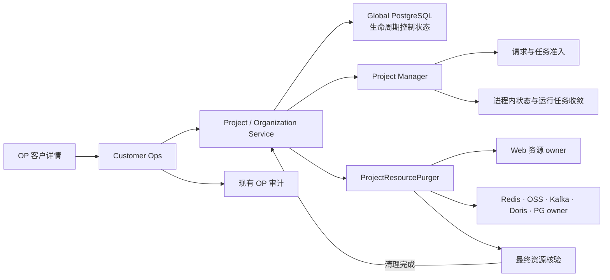
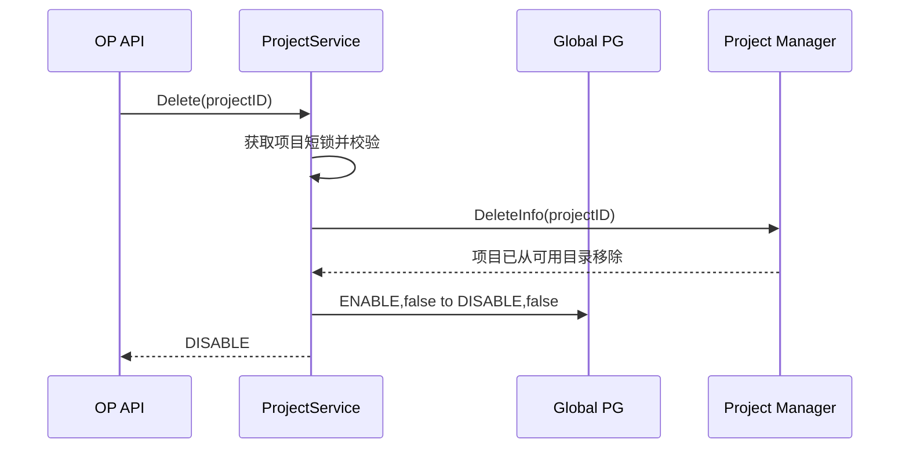
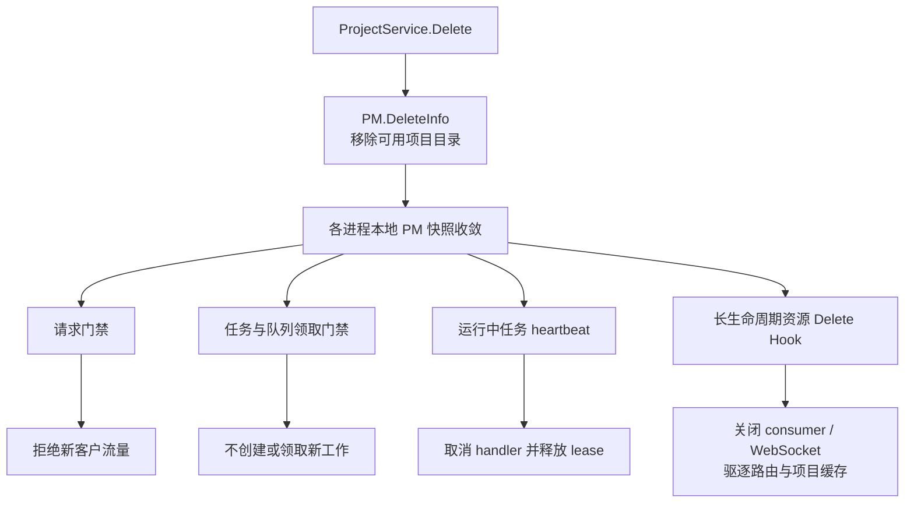
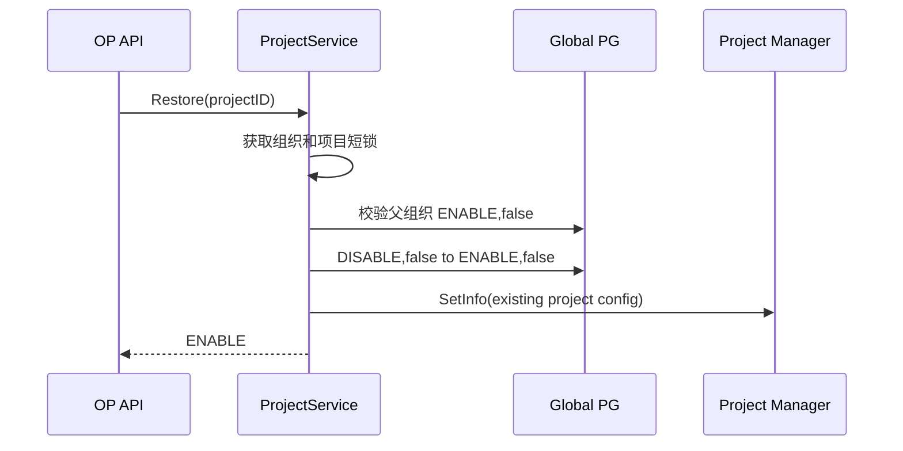
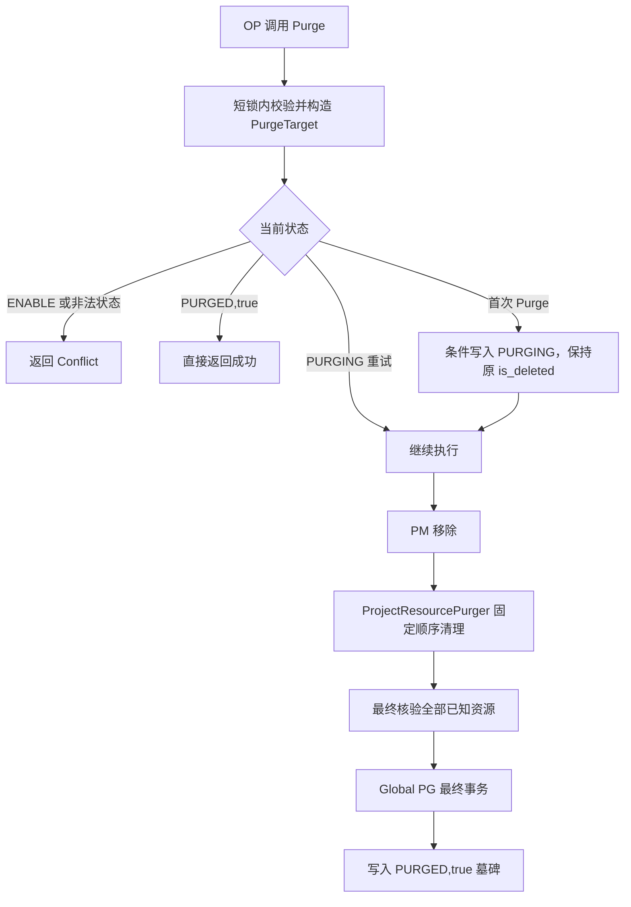
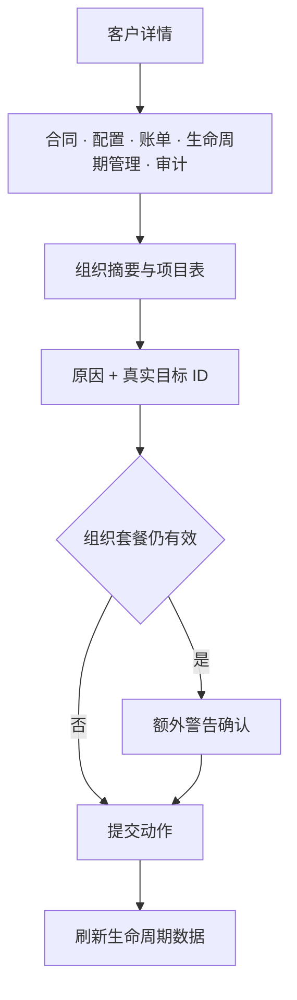

# Wave 组织与项目生命周期治理：概要设计

> 状态：待评审 · 依据：[01-spec.md](./01-spec.md)、[02-decisions.md](./02-decisions.md) · 实现细节：[04-detail.md](./04-detail.md)

## 1. 方案结论

当前旧 Delete 同时修改状态并删除 Scheduler Job、Doris、PG、Kafka 和成员，既不可可靠 Restore，也没有覆盖所有项目资源。本方案把生命周期拆成三个边界明确的动作：

| 动作 | 语义 | 持久资源 |
| --- | --- | --- |
| Delete | 将项目或组织置为不可用 | 不删除 |
| Restore | 从当前时刻恢复可用 | 不扫描、不重建 |
| Purge | 同步、不可恢复地清理 Wave 管理资源 | 按固定顺序删除并核验 |

核心分工：

- `ProjectService`：状态、权限、短锁和生命周期规则；提供业务语义明确的 `Delete/Restore/Purge`。
- `ProjectManager`：可用项目目录；Delete 用 `DeleteInfo`，Restore 复用 `SetInfo`，不新增 Restore/Purge 事件，也不编排 Purge。
- `ProjectResourcePurger`：Web 内的具体同步编排器，固定顺序调用资源 owner。
- 资源 owner：真正删除自己管理的数据，并确认资源已不存在。

`ProjectResourcePurger` 不是通用框架：不定义动态 owner 接口，不做注册中心、步骤 DSL、执行表、后台任务或分布式事务。

## 2. 生命周期模型

### 2.1 状态

```text
Project:
  INITIALIZING / ENABLE / DISABLE / PURGING / PURGED

Organization:
  ENABLE / DISABLE / PURGING / PURGED
```

| 转换 | Global PG | PM | 数据资源 |
| --- | --- | --- | --- |
| Project Delete | `ENABLE,false -> DISABLE,false` | `DeleteInfo` | 不变 |
| Project Restore | `DISABLE,false -> ENABLE,false` | `SetInfo` | 不变 |
| Project Purge（新数据） | `DISABLE,false -> PURGING,false -> PURGED,true` | 保持不存在 | 删除 |
| Project Purge（历史数据） | `DISABLE,true -> PURGING,true -> PURGED,true` | 保持不存在 | 删除 |
| Organization Delete | `ENABLE,false -> DISABLE,false` | 无级联动作 | 不变 |
| Organization Restore | `DISABLE,false -> ENABLE,false` | 不级联项目 | 不变 |
| Organization Purge | `DISABLE,false -> PURGING,false -> PURGED,true` | 无 | 删除组织引用 |

边界规则：

- `ENABLE` 项目不能 Purge，必须先 Delete。
- `INITIALIZING` 项目拒绝 Delete/Restore/Purge，初始化结束只允许条件转换为 `ENABLE`。
- 历史 `DISABLE,true` 可以 Purge，但不能 Restore。
- `PURGING` 只允许继续 Purge；`PURGED,true` 是可查询的最小墓碑。
- Project Delete 不要求父 Organization 为 `ENABLE`；Project Restore/Create 才要求父组织 `ENABLE,false`。
- Organization Delete/Purge 必须由 OP 先逐个处理项目，不自动级联。

### 2.2 三种动作的保证

| 动作 | 保证 | 明确不保证 |
| --- | --- | --- |
| Delete | 不主动删除项目持久资源；本地 PM 收敛后，新请求、新任务停止进入，运行中工作逐步停止 | 瞬时全局屏障、远端进程立即 ACK、错过流量/cron 可补偿 |
| Restore | DB 和 PM 恢复后，新工作可以重新进入 | 回放被拒请求、补跑 cron、恢复过期 Redis/Kafka 临时状态 |
| Purge | 已知 Wave 项目资源被 owner 删除并核验，失败可从头重试 | 跨存储原子回滚、客户外部目标数据删除 |

因此 Restore 是”从当前时刻恢复”，不是”任意时长绝对无损”。

### 2.3 资源分类与生命周期行为规则

项目资源按**所有权和生命周期敏感度**分为三类，所有组件的资源行为遵循统一规则：

| 类别 | 所有权 | 典型资源 | Delete | Restore | Purge |
| --- | --- | --- | --- | --- | --- |
| **持久资源** | 项目独占 | PG Schema、Doris DB、Kafka Topic、OSS Prefix | 保留 | 保留（不检查、不重建） | 删除 |
| **运行资源** | 进程内或项目级运行时 | 内存 map、consumer goroutine、WebSocket、cache、Redis key、Scheduler job | PM Hook 主动收敛 | 懒加载重建或重新领取 | 随上两类清理 |
| **共享资源** | 跨项目 | 全局 Kafka producer、全局 loader、ETL 系统外部目标 | 不处理 | 不处理 | 不处理（项目不拥有） |

**持久资源原则**：Delete/Restore 是可逆操作，持久数据必须保留；只有 Purge（不可逆）才能物理删除。因此 PG Schema、Doris DB、Kafka Topic、OSS 前缀在 Delete/Restore 阶段全部”不动”——不是实现没做，是设计就不该动。

**运行资源原则**：项目 Delete 后进程不重启，内存状态和运行中连接必须通过 PM Hook 主动收敛。但 Restore 不主动重建——组件在收到新请求时通过正常业务路径懒加载恢复，减少 PM 负担和 Restore 失败的反向影响。

**共享资源原则**：如果一个资源在多个项目间共用（如 Edge 的 Kafka producer），它不能因为单个项目的生命周期而关闭。这类资源不纳入任何生命周期操作。

这三条规则覆盖 detail.md 中所有资源台账的每一行行为。读者先理解规则，再看表格时就自然知道”为什么这行是保留、那行是删除”。例外情况（如 Purge 中 Scheduler job 等运行资源先于持久资源清理）在 Purge 固定顺序中单独说明。

## 3. 顶层职责



| 角色 | 负责 | 不负责 |
| --- | --- | --- |
| Project/Organization Service | 状态机、父子约束、短锁、Purge 入口和最终 Global 事务 | 逐资源实现、长事务锁 |
| Project Manager | 维护可用项目集合索引和项目运行时快照，驱动本地 Hook 与断线后对账 | Purge RPC、远端 ACK、资源清理 |
| ProjectResourcePurger | 按目标快照固定顺序清理并完成最终资源核验 | 动态发现资源、生命周期状态提交 |
| 资源 owner | 删除、幂等、确认不存在、防止重建 | 改写生命周期状态 |
| OP Customer Ops | OP 权限、客户归属、确认、原因、审计 | 资源编排 |

所有组件的项目资源事实与生命周期行为，以 [04-detail.md](./04-detail.md) 第 4 章为唯一全景；本 plan 不重复展开。

## 4. 核心流程

### 4.1 Project Delete



- 已为 `DISABLE,false` 时仍重发 `PM.DeleteInfo`，修复上次部分失败。
- PM 先失效，DB 更新失败时 fail-closed；调用方可重复 Delete。
- 不删除或 Stop Scheduler Job，不扫描 Redis，不改成员、Schema、Topic、OSS 或 Doris。
- PM 中没有项目后，Master 不生成、Worker 不领取，运行中的 Scheduler handler 在 heartbeat 后取消本地 context 并释放 lease，不写业务失败状态。
- 只有确实持有项目进程内状态或运行资源的模块通过 PM Delete Hook 做最小收敛；ProjectService 不逐组件调用，不要求无资源模块实现空 Hook。
- 业务 Redis 全部保留；只有 PM 控制 Key，以及会继续驱动执行的 task map、lease 等派生运行状态可以定向重写、释放或自然过期。

#### 流量停止模型

资源台账回答“项目拥有什么”，流量停止模型回答“谁还能启动工作”。`PM.DeleteInfo` 只发布项目不可用状态；所有项目工作入口必须落在以下四种收敛机制之一：



| 入口类别 | 目标行为 |
| --- | --- |
| 普通 Web、MCP、Edge、ADTOL、ABOL、Connector HTTP | 每次请求从本地 PM 判断项目是否可用；OP 生命周期入口是明确例外 |
| Internal S2S | 新工作命令拒绝；Delete 前已启动工作的只读查询和结果/进度回写继续收尾 |
| Scheduler、Dispatch、Wagent | 生成或领取前检查 PM；运行中工作通过 heartbeat、topology 或 owner context 收敛 |
| LiveEvent、Catalog、Asset batcher、组件本地 consumer/cache | owner 只关闭或驱逐自己持有的目标项目资源 |

Migration 不是客户流量：`DISABLE,false` 项目仍执行 Meta/Doris migration，`PURGING/PURGED` 才停止。完整入口、当前缺口和代码改动以 detail 的流量入口矩阵为准。

### 4.2 Project Restore



- 已为 `ENABLE,false` 时仍重发 `PM.SetInfo`，修复 DB 成功但 PM 发布失败。
- `Restore` 只新增在 `ProjectService`；PM 不新增 `RestoreInfo/OnProjectRestore`，`SetInfo` 只表达项目当前可用。
- 不等待 Scheduler 或各进程 Hook 收敛，不逐项检查项目资源。
- 不重新初始化、不补 migration、不补 Delete 期间错过的 cron。
- PM Update Hook、Scheduler/Dispatch 或懒加载根据当前快照恢复运行状态；新启动组件不需要知道项目曾经发生 Restore。

### 4.3 Project Purge

Purge 分为“建立持久栅栏、停止写入、删除资源、最终核验、提交墓碑”五个阶段：



`PurgeTarget` 是调用开始时根据仍存在的 Global 项目记录构造的只读内存快照，至少包含项目/组织 ID、Topic 和消费组规则、OSS 前缀、Doris Database、Meta/Data Schema 等确定性标识；不落库、不充当进度。

资源执行顺序：

| 顺序 | 稳定 step | owner 职责 |
| --- | --- | --- |
| 0 | `project_pm` | 确认 PM 不含项目 |
| 1 | `project_dispatch` | 发布并核验不含目标项目的权威 task map |
| 2 | `project_wagent` | 确认 execution ownership 已释放，再定向清 Stream/PEL/DLQ 和项目 Key |
| 3 | `project_redis` | 确认 Scheduler ownership 已释放，再清 Scheduler 与 Web Redis 状态 |
| 4 | `project_oss` | 清四类 Wave 管理前缀并确认空 |
| 5 | `project_kafka` | 确认项目 Topic 无 active assignment，再清 Topic/专属消费组并核验 |
| 6 | `project_doris` | 取得 migration mutex并重查 `PURGING`，再 Drop 项目 Database |
| 7 | `project_data_pg` | 取得 migration mutex并重查 `PURGING`，再 Drop Data Schema |
| 8 | `project_meta_pg` | Asset 有界 drain 后 Drop Meta Schema，项目 Job 随 Schema 删除 |
| 9 | `final_global` | 最终核验后在短事务中清引用和敏感字段，提交 `PURGED,true` |

每步不存在资源即成功；任一步失败都保留当前 `PURGING,is_deleted` 组合并返回稳定 step。下一次调用重新构造快照，从第 0 步执行。已完成步骤必须幂等，不做反向补偿。

### 4.4 Organization 生命周期

- Delete：组织锁内重查子项目；只有全部为 `DISABLE,false` 才执行 `ENABLE -> DISABLE`。
- Restore：`DISABLE,false -> ENABLE,false`，不 Restore 项目。
- Purge：要求全部子项目均为 `PURGED,true`，再写 `PURGING` 后执行，最终提交 `PURGED,true`。

Organization 不拥有 PG Schema、Doris Database、Kafka Topic、OSS prefix 等项目级基础设施资源，Purge 只清理组织引用：

| 顺序 | step | 操作 |
| --- | --- | --- |
| 0 | `org_precondition` | 全部子项目 `PURGED,true` |
| 1 | `final_global` | 清邀请、组织成员、role、token scope 中的组织 ID 引用 |
| 2 | `op_customer_expired` | 调用 `ExpireCustomerByOrgID` 保持客户绑定 `expired` |

Customer Profile、合同、共享 Account、审计和子项目墓碑继续保留。

## 5. 分布式可靠性

### 5.1 PM 是准入开关，不是清理总线

PM 保留现有 `SetInfo/DeleteInfo` 和 Hook 模型。Redis 中的 `sys:{pm}:projects` 是“可用项目集合索引”，`sys:{pm}:info:<pid>` 是“项目运行时快照”，不再统称为含义模糊的 `membership/info`。只补四项可靠性：

1. 可用项目集合索引和项目运行时快照的写错误返回调用方；Pub/Sub 发布失败返回错误，但订阅者数量不作为成功判据。
2. Redis 写成功后立即更新调用节点本地状态。
3. Pub/Sub 关闭后重订阅。
4. 重订阅后计算 added/updated/removed 差集；空快照清除本地幽灵项目，读取失败不清空。

PM 接入按三个层次判断：

| 层次 | 责任 |
| --- | --- |
| app/进程 | 初始化一个 PM 实例并持有当前可用项目快照 |
| 模块 | 显式查询 PM、注册 PM Hook，或通过 Scheduler/Dispatch 间接受控 |
| 资源 owner | 只停止或驱逐自己拥有的项目运行资源和必要进程内状态 |

app 初始化 PM 不代表内部所有模块自动受控。Delete 不建设 ProjectService 到各组件的 RPC fan-out；不增加 Restore/Purge 事件、逐组件 ACK、generation、Stop 信号或逐任务命令。

`DeleteInfo` 也不是同步全局屏障：调用节点在 Redis 写成功后立即驱逐本地快照，其他节点通过 Pub/Sub 和断线后的快照对账最终收敛。为了证明覆盖，每个能启动项目工作的位置必须属于“请求门禁、任务/队列领取门禁、运行 heartbeat、资源 owner Hook”之一；只初始化 PM、只持有 `projectID` 或只出现在资源台账中都不算完成接入。

### 5.2 资源不能在清理后复活

Purge 不能仅凭 PM 已移除就判断运行工作停止。删除底层资源前，各 owner 使用现有信号做有界核验：

- Scheduler/Wagent 查询已有 heartbeat 或 ownership；
- Dispatch/C1、LiveEvent 查询 task map 或 Kafka group member/assignment；
- Asset 等缓冲 writer 完成已有 drain/flush；
- 任一查询失败、超时或仍有活动 owner 时保持 `PURGING`。

关键约束：

- C1 Kafka producer 关闭自动建 Topic；正式创建入口只有项目初始化流程。现有自动创建只是写入路径的兜底，可能按 broker 默认配置创建 Topic，并可能在 Purge 后被残余写入重新创建。
- 关闭后，`ENABLE` 项目缺少预期 Topic 时，C1 写入进入现有错误日志和重试路径，直到 Topic 修复或 context 取消；不允许静默重建，本 change 不调整 producer 重试和告警体系。
- Kafka 删除后轮询 broker，直到 Topic 和项目消费组不存在。
- Scheduler 在生成、领取和 heartbeat 三处检查 PM。
- 项目级 PG Schema、Doris Database 和固定 Topic 只能由受生命周期状态保护的初始化路径创建。
- Redis、Wagent、OSS 数据只在对应 owner 的上述核验成功后清理。
- Dispatch task map 在项目从 topology 消失时必须重写，TaskManager 订阅断开后重连并重新加载。

这些是现有入口上的防复活修正，不引入通用 fencing 系统。

### 5.3 同步、超时与并发

- 使用请求 context 和依赖既有/有界 timeout；客户端断开后不转后台。
- 客户端超时表示结果未知，前端只刷新状态，不自动重发。
- 短锁只保护读取、校验和条件状态转换，不覆盖跨存储清理。
- 两个 `PURGING` 请求可能并发；依靠相同快照规则、幂等 owner 和最终条件更新收敛，不建长锁或执行表。
- 最终 Global PG 事务提交前必须重新确认仍为 `PURGING`；若已 `PURGED,true`，按成功处理。

## 6. 数据与兼容

### 6.1 Schema 和查询

| 对象 | 方案 |
| --- | --- |
| `organization` | `global.sql` 新建表直接包含 `status VARCHAR(64) NOT NULL DEFAULT 'ENABLE'`；存量 global migration 按旧 `is_deleted` 回填后再设置 NOT NULL |
| `project` | 不新增字段，只增加 `PURGING/PURGED` Go 常量 |
| 名称索引 | 保留现有 `WHERE is_deleted=false` 部分唯一索引 |
| 生命周期约束 | 不新增 CHECK、trigger 或全表状态索引 |

查询语义：

- 普通业务只读取 `ENABLE,false`；项目同时以 PM 为准入依据。
- OP Lifecycle 使用 WithDeleted 查询全部生命周期状态。
- migration 使用单用途查询，只取 `INITIALIZING/ENABLE/DISABLE,is_deleted=false`；Delete 项目继续升级，Purge 中项目停止迁移。
- migration 与 Purge 的 Doris/PG 删除复用现有 owner-token Redis 锁做单项目短互斥；锁内重查生命周期，DDL 使用 statement timeout，不新增续租器。
- 普通项目更新使用显式字段和 `status=ENABLE,is_deleted=false` 条件，禁止整行 Save 覆盖生命周期。
- Purge 最终事务清理成员/邀请/token scope 等 Global 引用，清空配置和可认证凭据，保留 OP 识别所需最小墓碑。

### 6.2 兼容历史数据

- 不回填 Project，不改名称索引。
- Organization 存量数据按 `is_deleted=false -> ENABLE`、`is_deleted=true -> DISABLE` 初始化；migration 可重入，不覆盖已有 `DISABLE/PURGING/PURGED`。
- 历史 `DISABLE,true` 保持 `is_deleted=true` 进入 `PURGING,true`，最终归一为 `PURGED,true`。
- 历史数据由用户使用同一 OP Project Purge 逐个处理；不增加扫描、批处理或迁移工具。
- 主记录后续物理删除不在本期范围。

## 7. API、权限、审计与前端

### 7.1 OP API

删除租户接口：

- `POST /project/delete`
- `POST /org/delete`

新增客户范围接口：

- `POST /op/customer/lifecycle/get`
- `POST /op/customer/lifecycle/project/{delete,restore,purge}`
- `POST /op/customer/lifecycle/org/{delete,restore,purge}`

动作字段统一为：

```text
customer_id
project_id 或 organization_id
confirm_value
reason
```

`confirm_value` 必须等于真实目标 ID，`reason` 去空白后非空。服务端校验 OP 白名单账号、customer → organization → project 归属。错误复用现有 BadParam、PermissionDenied、Conflict 和 InternalError；结构化 data 只返回目标、阻塞项和稳定 Purge step。

### 7.2 审计

六类动作复用 `AuditService.LogWithFallback`：

- action：project/organization 的 delete、restore、purge。
- result：`success`、`verify_failed`、`failed`。
- snapshot：目标 ID、动作原因、前后 `status/is_deleted` 和失败 step。

不记录 Secret、配置、Token；审计不充当 Purge receipt。

### 7.3 OP 前端

生命周期管理位于客户详情“账单”之后、“审计”之前：



不做全局列表、搜索、分页、批量、统计卡、倒计时或自动重试；视觉和交互对齐现有 CustomerDetail。

[低保真原型](./assets/lifecycle-tab-prototype.svg)只确认页面层级和信息布局，不作为额外交互范围。

## 8. 错误与一致性

| 场景 | 结果 | 恢复方式 |
| --- | --- | --- |
| PM Delete 成功、DB Delete 失败 | 项目暂时 fail-closed | 重复 Delete/Restore 对账 |
| DB Restore 成功、PM SetInfo 失败 | DB 为 ENABLE，运行面仍不可用 | 重复 Restore 重发 PM |
| PM Pub/Sub 丢失 | 远端本地 map 暂时陈旧 | 重订阅快照对账 |
| Purge 步骤失败 | 保留 `PURGING`，返回失败 step | 重试 Purge 从第一步开始 |
| Purge owner 或最终核验失败 | 保留 `PURGING` 和稳定 step | 修复依赖后从头重试 |
| Purge 请求超时/取消 | 已删除资源不回滚 | 刷新状态后人工重试 |
| 目标已 `PURGED,true` | 成功返回当前墓碑 | 不重跑 |
| 墓碑不存在 | NotFound | 不查审计猜测历史结果 |
| Organization 有未 Purged 子项目 | 状态不变并返回阻塞项 | OP 逐项目处理 |

跨 Redis、MA、Kafka、OSS、Doris、Data/Meta PG 不模拟分布式事务。正确性来自 `PURGING` 持久栅栏、writer 防复活、资源 owner 幂等和最终核验。

## 9. 影响范围

| 模块 | 主要改动 | 风险 |
| --- | --- | --- |
| Project/Organization Service | 生命周期状态和规则、具体 Purger 入口 | 高 |
| Global DAO/Schema | organization status、条件更新、墓碑与引用清理 | 高 |
| PM/Scheduler/Dispatch | 运行门禁、取消、订阅与 topology 收敛 | 高 |
| Web/MCP/Internal/Wagent | 入口门禁和 Web-owned 资源清理 | 高 |
| Edge/C1/QE/LiveEvent/Asset | 真实项目内存状态驱逐 | 中 |
| Redis/OSS/Kafka/Doris/PG owner | 幂等删除、资源不存在核验、防隐式重建 | 高 |
| OP Backend/OpenAPI/FE | 客户范围接口、审计和生命周期 Tab | 中 |
| migration/bootstrap SQL | organization status | 低 |

精确文件、函数和组件动作只在 [04-detail.md](./04-detail.md) 第 5 章说明。

## 10. 上线与回滚

上线顺序：

1. 永久阻断旧租户 Delete route；混部期间不开放 OP 生命周期前端。
2. 按项目初始化配置检查并补齐全部 `ENABLE` 项目的预期 Kafka Topic，再关闭 C1 自动建 Topic。
3. 执行 organization status migration。
4. 部署 PM、Scheduler、组件门禁/Hook、Project/Organization Service 和 OP API。
5. 用户通过 OP 逐个 Purge 历史 `DISABLE,true`。
6. 确认后部署或开放客户详情生命周期 Tab。

回滚边界：

- 保留新增 organization status 列，不执行 DROP。
- 旧租户 Delete route 始终保持阻断。
- 已进入 `PURGING/PURGED` 后不能回滚到不识别新状态的版本；暂停 OP 入口，恢复新版继续处理。

## 11. 测试策略

### 11.1 单元与包级

- Project/Organization 状态转换、父子约束、历史数据与条件更新。
- Delete/Restore 幂等和 PM 部分失败对账。
- ProjectResourcePurger 固定顺序、失败即停、完整重跑、最终核验和墓碑事务。
- PM 本地同步、订阅重连和快照对账。
- 流量入口矩阵逐项验证：普通 Web、MCP、Internal S2S、Edge/ADTOL/ABOL/Connector、Scheduler、Dispatch/C1、Wagent 和 LiveEvent 均在目标检查点拒绝或收敛；Migration 例外单独验证。
- C1 在 Topic 存在时正常写入；Topic 缺失时进入现有错误日志/重试并且不自动创建；Purge 后残余写入不能复活 Topic。
- Scheduler 生成/领取/heartbeat 三层门禁和 11 个生产 JobType 覆盖。
- OP 权限、客户归属、确认、原因、审计和前端确认流程。

### 11.2 集成与 E2E

1. 建立覆盖第 4 章资源全景的项目 fixture。
2. Delete 前后逐项确认持久资源未减少，新工作全部拒绝。
3. Restore 后确认新工作恢复，Delete 期间流量和 cron 不补偿。
4. 对每个 Purge step 注入失败，确认保留 `PURGING`、从头重试成功且无资源复活。
5. 多 Web/PM/MA 实例下验证断线重连、共享资源清理和无 Pod fan-out。
6. 验证 Project 逐个处理后 Organization 才能 Delete/Purge。
7. 验证六类动作的成功、校验失败和执行失败审计。

真实 Redis、Kafka、PG、Doris、OSS 和 MA 的删除测试只在隔离集成环境执行。

## 12. 取舍与非目标

本方案接受：

- Delete/Restore 最终依赖 PM 传播和本地收敛，不等待全局 ACK。
- Purge 是同步重操作，调用方可能遇到超时后的未知结果。
- Restore 不补偿时间性损失。

本方案明确拒绝：

- 生命周期平台、通用 coordinator、owner registry、adapter/plugin、状态 DSL。
- Purge 执行表、receipt、后台任务、自动重试、dry-run 或批量工具。
- 长 TTL 锁、远端 ACK、generation fencing、跨存储事务或反向补偿。
- Delete 时删除/Stop Job、清 Redis、扫描资源。
- Restore 时扫描、重建、补 migration、补 cron 或重放流量。
- OP 全局资源列表、复杂交互或第二套审计系统。

## 13. 下一步

先评审 [04-detail.md](./04-detail.md) 中逐组件实现范围和跨组件契约；确认后再生成 tasks，进入开发。

## Quality Gates

- [x] 数据模型和 API 字段明确。
- [x] Delete/Restore/Purge 的职责、主流程、错误和并发边界明确。
- [x] PM、ProjectResourcePurger、资源 owner 和 MA 的边界明确。
- [x] 资源台账与流量入口/运行收敛分层描述，且现有资源台账内容未删减。
- [x] Purge 防复活、最终核验和可重入保证明确。
- [x] Restore 的保留与时间性损失边界明确。
- [x] 单元、集成、分布式和 E2E 测试策略明确。
- [x] 未引入执行平台、通用清理框架或过度补偿。
