# Wave 组织与项目生命周期治理：详细设计

| 元数据 | 内容 |
| --- | --- |
| 目录 | `20260716-Wave-Refac-OrganizationProjectLifecycle` |
| 创建日期 | 2026-07-17 |
| 状态 | 待评审 |
| 关联规格 | [01-spec.md](./01-spec.md) |
| 关联方案 | [03-plan.md](./03-plan.md) |

## 1. 设计边界

本详细设计只回答“具体在哪里改、组件如何交互、怎样证明清理完成”。生命周期语义和顶层取舍以 plan 为准。

- Delete/Restore 只修改 Global PG 状态和 PM 可用目录；不删除 Scheduler Job、Schema、Topic、OSS、成员或业务 Redis。
- Purge 是 OP 单次同步调用；失败保留 `PURGING`，下一次从头重跑。
- `ProjectService` 负责状态、短锁和规则；具体的 `ProjectResourcePurger` 固定顺序调用资源 owner。
- 资源 owner 负责删除与“不存在”核验；PM 只负责可用性和运行收敛，不编排 Purge。
- 不新增执行表、步骤账本、后台任务、动态注册、通用 owner/verify 接口或跨存储事务。
- 历史 `DISABLE,true` 复用同一 Project Purge；不提供扫描、批处理或 migration。
- 第 4 章保持“资源台账 → 生命周期变化图 → 适配结论”的既有风格，修正职责平面、资源形态、入口和运行过程混用的问题；第 5 章起只描述实现，不重复介绍资源。

## 2. 阅读路径

| 评审问题 | 阅读位置 |
| --- | --- |
| Wave 到底有哪些项目资源，Delete/Restore/Purge 如何影响它们 | 第 4 章 |
| 每个 `apps/*` 和共享包具体改哪些文件、函数 | 第 5 章 |
| 状态 SQL、`PurgeTarget`、MA HTTP、OP API 的精确契约 | 第 6 章 |
| Delete/Restore/Purge 如何执行 | 第 7 章 |
| 分布式运行面怎样停止、怎样防止资源复活 | 第 8 章 |
| Purge 固定顺序、owner 和最终核验 | 第 9 章 |
| OP 权限、审计、前端 | 第 10–11 章 |
| 失败、测试、上线和 simplify 约束 | 第 12–15 章 |

阅读时统一使用“入口门禁、运行收敛、资源 owner、最终核验”四个术语，不再用“协调器”“通知清理”“组件自行处理”等模糊说法。

## 3. 实现总览

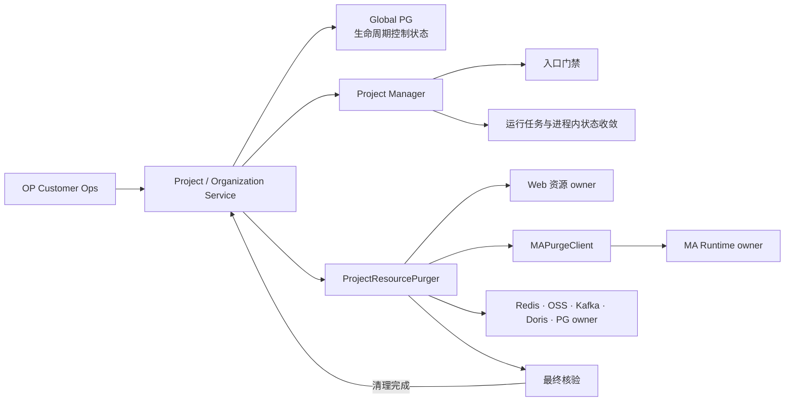

`ProjectResourcePurger` 是 Web 内一个具体结构体，不是抽象平台。Web 只编排 MA，不访问 MA 独享 Redis；MA 通过一个内部 HTTP endpoint 清理并核验自己的持久资源。

## 4. 项目资源全景与组件职责

本章只回答三件事：项目资源在哪里、资源保存或承载什么、生命周期动作如何改变它们。精确文件改动见第 5 章，Purge 顺序和幂等条件见第 9 章。

### 4.1 职责平面与资源形态

职责平面描述资源在生命周期中的作用，不代表物理存储类型：

| 职责平面 | 组成 | 生命周期职责 |
| --- | --- | --- |
| 生命周期控制状态 | Global PG、Project/Organization Service、OP | 持久化组织、项目和生命周期权威状态并校验动作 |
| 可用性平面 | PM 可用项目集合索引、项目运行时快照和进程内 project/token/config map | 决定组件能否取得项目及其运行配置 |
| 运行平面 | Scheduler、Dispatch、consumer、goroutine、WebSocket、cache | 停止新工作并收敛运行中工作 |
| 项目业务数据 | Meta/Data PG、Doris、Kafka、Redis、OSS | Delete/Restore 保留，Purge 由清理 owner 执行 |

Global PG 物理上属于持久化数据层；这里把它放在“生命周期控制状态”，是因为它保存权威状态，而不是因为它不存数据。下文同时使用另一条独立的资源形态分类：

| 资源形态 | 含义 |
| --- | --- |
| 持久资源 | 进程退出后仍存在的项目业务或控制数据，例如 PG、Doris、Kafka、业务 Redis、OSS |
| 运行资源 | 正在执行或用于协调执行的 consumer、lease、Redis 运行状态、WebSocket、goroutine |
| 进程内状态 | 可从权威数据或请求重新加载的 map、cache、matcher、metadata |
| 入口门禁 | 不保存项目数据，只决定请求或新工作是否允许进入 |

下文固定使用“持久资源、运行资源、进程内状态、入口门禁、清理 owner、PM Delete Hook、PM Update Hook”，不混用近义名称。

### 4.2 Wave 项目全链路

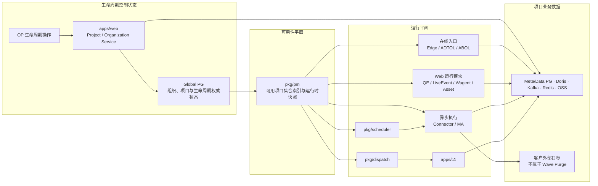

箭头表示项目配置、准入或数据关系，不表示 Purge RPC。Purge 由 `ProjectService` 调用清理 owner；只有 MA 独享资源需要一个内部 endpoint。

### 4.3 生命周期影响矩阵

| 动作 | 生命周期控制状态 | 可用性平面 | 运行平面 | 项目业务数据 |
| --- | --- | --- | --- | --- |
| Delete | `ENABLE,false → DISABLE,false` | `PM.DeleteInfo` | 入口门禁拒绝新工作，PM Delete Hook 驱逐进程内状态，Scheduler heartbeat 取消 handler | 不删除、不扫描、不改写 |
| Restore | `DISABLE,false → ENABLE,false` | `PM.SetInfo` | PM Update Hook 更新进程内状态，重新调度或下一请求懒加载 | 不检查、不重建，时间性损失不补偿 |
| Purge | 新数据 `PURGING,false`；历史数据 `PURGING,true`；完成后 `PURGED,true` | 确保 PM 中无项目 | 确认 Scheduler、Dispatch、Wagent 静默 | 各清理 owner 同步执行，最后写 Global PG 墓碑 |

Project Delete 不检查父 Organization 状态；Project Restore/Create 才要求父组织 `ENABLE,false`。

### 4.4 评审索引

| 职责分组 | 组件 | 评审重点 | 明细 |
| --- | --- | --- | --- |
| 生命周期控制与项目存储入口 | `apps/web` | 权威状态、入口门禁、存储根、运行资源、进程内状态、清理 owner 编排 | 4.5 |
| 在线入口 | `apps/edge`、`apps/adtol`、`apps/abol` | PM 项目来源、运行资源、进程内状态 | 4.6 |
| 数据与异步执行 | `apps/c1`、`apps/connector`、`apps/ma` | Scheduler/Dispatch 收敛、数据资源、客户目标副本边界 | 4.7 |
| 独立工具 | `apps/simulator` | 是否拥有 Wave 项目资源、是否需要生产改动 | 4.8 |
| 共享运行骨架 | `pkg/pm`、`pkg/scheduler`、`pkg/dispatch`、存储 client | 项目可用性、统一停止机制、清理 owner | 4.9–4.10 |

本章每个组件都按同一顺序阅读：先看“资源清单”确认资源类型、内容和作用，再看“资源生命周期变化图”确认 Delete、Restore、Purge 的变化，最后看“适配结论”确认本期代码需要改什么。表格一行只描述一个资源；入口或运行过程单独命名，不伪装成持久资源。

生命周期图统一使用以下图例：状态只有 `ENABLE`、`DISABLE`、`PURGED`；实线表示 Delete 或 Purge，虚线表示 Restore 的回退路径（不表示异步）；箭头标签统一使用“动作：资源结果”，资源未发生变化时明确写“`不变`”；同一状态内不绘制资源之间的使用箭头，资源内容和作用只在资源清单表中说明。

### 4.5 生命周期控制与项目存储入口：`apps/web`

#### 4.5.1 Project/Organization/OP 资源台账

| 资源 | 类型 | 来源/创建 | 内容与作用 | Delete | Restore | Purge |
| --- | --- | --- | --- | --- | --- | --- |
| Global PG project/org 主记录 | 持久资源 | Project/Organization Service | 保存 ID、归属、配置、`status/is_deleted` 等权威控制状态，供生命周期和归属查询 | 写 `DISABLE` | 写 `ENABLE` | 最终事务写 `PURGED,true` |
| Project member、邀请引用 | 持久资源 | 创建成员或邀请时写入 | 保存项目成员关系和未完成邀请，供权限与归属校验 | 保留 | 保留 | Global 清理 owner 移除目标引用 |
| PM 可用项目集合索引 `sys:{pm}:projects` | 运行资源 | Project Service 调用 `PM.SetInfo/DeleteInfo` | 保存当前可用的 project ID 集合，供组件枚举项目和判断项目是否存在 | 移除 project ID | 写回 project ID | 确保不含 project ID |
| PM 项目运行时快照 `sys:{pm}:info:<pid>` | 运行资源 | Project Service 调用 `PM.SetInfo/DeleteInfo` | 保存 Secret、状态、Schema/Database/Topic、配额和运行配置，供 Token 解析与组件初始化本地状态 | 删除快照 | 写回现有快照 | 确保快照不存在 |

`PM.SetInfo/DeleteInfo` 还会向 `sys:{pm}:info_change` 发布变更；该共享运行资源由 `pkg/pm` 管理，见 4.9.1。

**资源生命周期变化图**

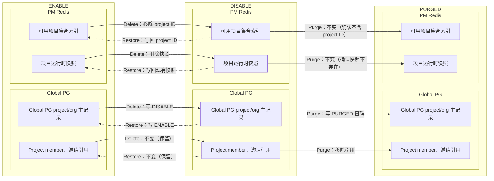

**适配结论**

- Global PG 是生命周期控制状态的持久化存储，不等同于项目业务数据。
- Delete/Restore 通过 `PM.DeleteInfo/SetInfo` 同时更新可用项目集合索引和项目运行时快照。
- Purge 最后移除成员/邀请引用，并保留 Global PG 的 `PURGED` 墓碑。

#### 4.5.2 普通 Web API、MCP、Internal S2S 入口与在途请求边界

| 入口或过程 | 类型 | 识别或写入内容 | 作用 | Delete | Restore | Purge |
| --- | --- | --- | --- | --- | --- | --- |
| `ProjectFilter`、`OrganizationFilter` | 入口门禁 | 从普通 HTTP 请求解析组织、项目和身份 | 在业务 Service 前拒绝不可用组织或项目 | 拒绝新请求 | 恢复后放行 | 拒绝 |
| `authorizeProjectContext` | 入口门禁 | 从 MCP 请求解析 project ID、scope 和账号 | 统一完成 MCP tool 的项目授权 | PM 不含项目时拒绝 | 恢复后重新授权 | 拒绝 |
| Internal S2S 新工作命令 | 入口门禁 | `/pipeline/run/start`、`/pipeline/load-file/create`、`/ma/materialize-fanout` 等写入新的 Run、Load File 或 fanout batch | 创建或启动新的项目工作 | PM 不含项目时拒绝 | 恢复后放行 | 拒绝 |
| Internal S2S 在途查询 | 运行过程 | Pipeline metadata、latest-success、load-file offset/list、backfill detail/running 等读取既有执行上下文 | 让 Delete 前已启动的 worker 完成判断和收尾 | 允许只读查询 | 正常读取 | 进入 `PURGING` 后拒绝 |
| Internal S2S 结果/进度回写 | 运行过程 | `/pipeline/update`、`/pipeline/run/finish`、`/pipeline/run/update`、load-file/backfill update/advance/complete 更新状态、日志和统计 | 收敛 Delete 前已启动的执行，不启动新执行 | 允许回写既有执行 | 正常回写 | 进入 `PURGING` 后拒绝 |

这里不存在通用 `cleanup` 回调。Internal S2S 的读写对象是 4.5.3.1 中的 Pipeline 持久资源，请求本身不是需要 Purge 的项目资源。

**入口与在途请求变化图**

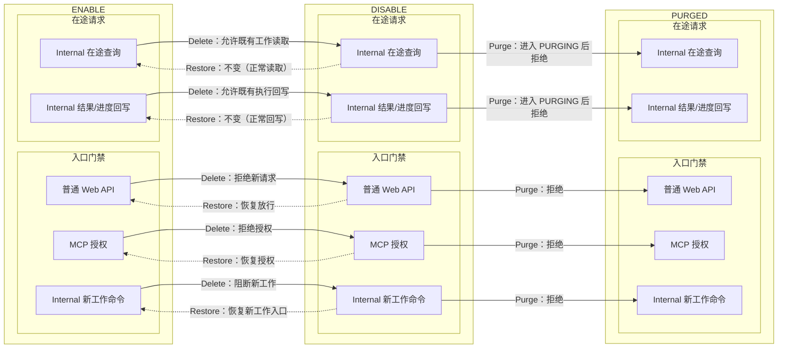

**适配结论**

- 普通业务、MCP 和 Internal 新工作命令以 PM 是否含项目作为入口门禁。
- Delete 后允许只读查询和对既有记录的结果/进度回写；它们校验项目仍是 `ENABLE/DISABLE,is_deleted=false`，不能创建新的 Run、Load File 或 fanout，也不新增“是否为旧 worker”的跟踪状态。
- Purge 写入 `PURGING` 后立即拒绝全部项目请求，再确认运行面静默并删除底层资源。

#### 4.5.3 项目存储根资源台账

| 资源 | 类型 | 来源/创建 | 内容与作用 | Delete | Restore | Purge |
| --- | --- | --- | --- | --- | --- | --- |
| Meta PG `schema_<pid>` | 持久资源 | Project 初始化创建，Web/Connector/MA/Wagent 持续写入 | 保存项目元数据和业务控制数据，包括事件/属性定义、Scheduler、AB、Dashboard、Metric、Cohort、Asset、Pipeline、Wagent、MA 等表 | 保留 | 不检查、不重建 | 最后由 PG owner `DROP SCHEMA IF EXISTS CASCADE` |
| Data PG `schema_<pid>` | 持久资源 | Project 初始化创建，数据处理链路写入 | 保存 `id_relation` 和 `raw_users`，用于身份关系和用户属性处理 | 保留 | 不检查、不重建 | PG owner `DROP SCHEMA IF EXISTS CASCADE` |
| Doris 项目 Database | 持久资源 | Project 初始化创建，采集、查询和计算链路写入 | 保存事件、用户、分群、统计、查询和 MA fanout 等分析数据 | 保留 | 不检查、不重建 | Doris owner `DROP DATABASE IF EXISTS` |
| Kafka 项目 Topic 集合 | 持久资源 | Project 初始化显式创建 | 保存 `raw_event/event/other/error` 四类项目数据流，供 Edge、Connector、C1、LiveEvent 消费或写入 | 保留 | 不检查、不重建 | Kafka owner 删除 Topic 和项目消费组并确认不存在 |
| Wave OSS 项目前缀集合 | 持久资源 | Connector load/backfill/cron 写入 | 保存 `load/<pid>/`、`backfill/<pid>/`、`events_cron/<pid>/`、`users_cron/<pid>/` 下的项目文件 | 保留 | 不检查、不重建 | OSS owner 删除四类前缀并确认空 |

Kafka Topic 的正式创建入口是 Project 初始化。C1 producer 现有自动创建只是写入兜底，本期关闭；否则 Purge 后的残余写入可能重新创建 Topic，并且使用 broker 默认配置而不是项目初始化配置。

**资源生命周期变化图**

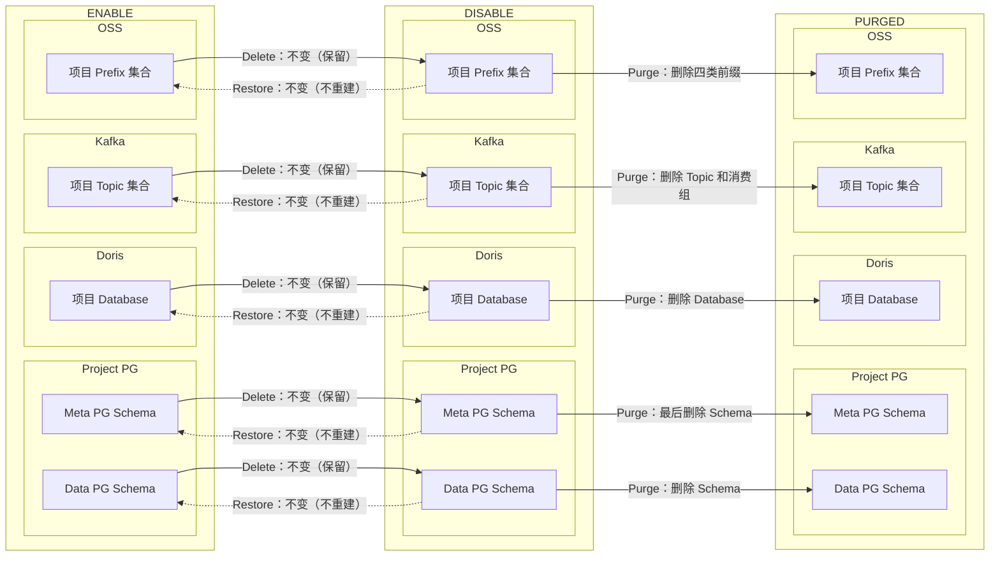

**适配结论**

- Web Project 初始化负责创建项目存储根，但不代表 Web 独占其中的业务资源。
- Delete/Restore 对五类存储根都不做扫描、删除或重建。
- Purge 在 writer 静默后按第 9 章顺序删除；Meta PG Schema 最后删除，保证前置清理仍可读取项目元数据。

##### 4.5.3.1 Pipeline 业务资源

| 资源 | 类型 | 来源/创建 | 内容与作用 | Delete | Restore | Purge |
| --- | --- | --- | --- | --- | --- | --- |
| Meta PG pipeline/daily-stat | 持久资源 | Pipeline 配置和运行时写入 | 保存 Pipeline 配置、运行信息和每日统计，供 Connector 构造执行计划和展示结果 | 保留，拒绝新工作 | 继续读取 | 随 Meta PG Schema 删除 |
| Meta PG run/backfill/load-file | 持久资源 | Pipeline Run、Backfill 和文件处理写入 | 保存执行窗口、状态、日志、文件 offset 和处理结果，供 worker 运行与收尾 | 保留，允许既有执行回写 | cron/repair 继续 | 随 Meta PG Schema 删除 |
| Scheduler Job/Instance/Task | 持久资源 | Job 注册和调度 | 保存 Pipeline 的调度定义、执行实例和任务状态，供 Scheduler Master/Worker 生成和领取工作 | 保留，不生成或领取 | 下一次 cron/repair 恢复 | 随 Meta PG Schema 删除 |

**资源生命周期变化图**

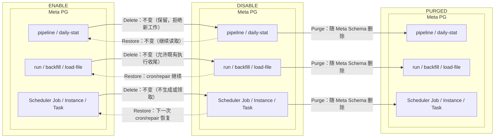

**适配结论**

- Pipeline 是项目业务功能，资源位于 Meta PG，并由 Connector/Scheduler 等运行链路使用。
- Delete 保留全部 Pipeline 持久状态，只阻止创建和领取新工作；Delete 前的执行可以完成状态回写。
- Purge 不逐表删除 Pipeline 数据，由 Meta PG Schema 的最终 Drop 统一清理。

##### 4.5.3.2 Project migration 运行边界

| 过程或资源 | 类型 | 执行对象 | 内容与作用 | Delete | Restore | Purge |
| --- | --- | --- | --- | --- | --- | --- |
| Global migration | 运行过程 | Global PG | 执行一次全局结构或数据升级 | 与项目 Delete 无关 | 与项目 Restore 无关 | 与单项目 Purge 无关 |
| Meta migration | 运行过程 | 每个项目的 Meta PG Schema | 升级项目元数据和业务表，使存量项目兼容当前代码 | `DISABLE,false` 继续执行 | 无需补跑，已持续升级 | `PURGING/PURGED` 不再执行 |
| Doris migration | 运行过程 | 每个项目的 Doris Database | 升级项目分析表和存量分析数据 | `DISABLE,false` 继续执行 | 无需补跑，已持续升级 | `PURGING/PURGED` 不再执行 |
| Global PG `migration_history` | 持久资源 | 全局 migration runner | 保存 migration 版本、目标 DB 类型和执行结果，用于幂等跳过；不是项目独占资源 | 保留 | 保留 | 保留 |

当前 migration 的 `DBType` 只有 `global/meta/doris`，没有 Data PG 类型。Pipeline 与 migration 没有直接业务关系；只有某个 migration 需要升级 Pipeline 表时，才会修改 4.5.3.1 中的 Meta PG 结构。

**运行边界变化图**

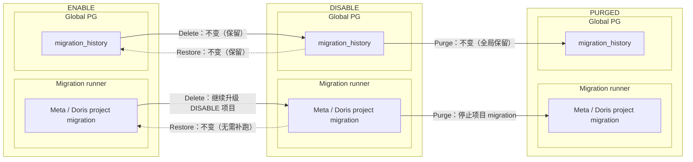

**适配结论**

- migration runner 改用单用途项目查询，只遍历 `INITIALIZING/ENABLE/DISABLE,is_deleted=false`。
- Delete 项目继续接受 Meta/Doris 升级，避免长期 Delete 后 Restore 到旧结构。
- Purge 中项目不再迁移，避免 migration 与 Schema/Database 删除并发。

#### 4.5.4 QE Catalog 资源台账

| 资源 | 类型 | 来源/创建 | 内容与作用 | Delete | Restore | Purge |
| --- | --- | --- | --- | --- | --- | --- |
| `catalogs[projectID]` | 进程内状态 | QE 查询或 PM Update Hook | 事件、属性、Cohort、Metric 查询 | Delete Hook 驱逐 | 查询时懒加载 | 随进程状态清除 |
| 事件/属性/Cohort/Metric MetaCache | 进程内状态 | QE Catalog 加载 | QE Catalog 响应 | Delete Hook 驱逐 | 查询时懒加载 | Meta Schema 删除来源数据 |
| refresh lock Key | 运行资源 | QE refresh 任务创建 | 防止重复 refresh | 保留 | 继续使用 | `project_redis` 删除；不存在即成功 |

**资源生命周期变化图**

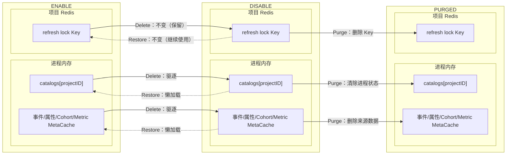

**适配结论**

- Delete 只驱逐项目 Catalog，禁止新的 refresh 和查询加载。
- Restore 不重建全量缓存，由下一次查询懒加载。
- Purge 删除 refresh lock，并由 Meta 清理 owner 删除来源数据。

#### 4.5.5 LiveEvent 资源台账

| 资源 | 类型 | 来源/创建 | 内容与作用 | Delete | Restore | Purge |
| --- | --- | --- | --- | --- | --- | --- |
| 项目 WebSocket | 运行资源 | LiveEvent 连接建立 | 实时事件推送 | Delete Hook 关闭 | 新连接懒启动 | 无连接可清理 |
| Kafka consumer | 运行资源 | WebSocket 建立时创建 | 消费项目事件 | Delete Hook 关闭 | 新连接重建 | 由连接关闭收敛 |
| `live-event-<pid>-<timestamp>-*` group | 持久资源 | 每次项目连接创建 | Kafka broker group metadata | 保留残留 metadata | 不主动重建 | `project_kafka` 按前缀删除 |

**资源生命周期变化图**

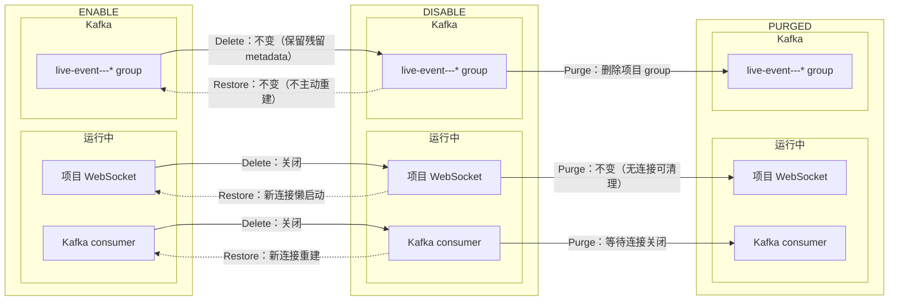

**适配结论**

- Delete 关闭项目 WebSocket 和 consumer，但保留 Kafka group metadata。
- Restore 不主动创建连接，下一次请求建立新连接。
- Purge 由 Kafka owner 按项目 group 前缀幂等删除。

#### 4.5.6 Asset Behavior 资源台账

| 资源 | 类型 | 来源/创建 | 内容与作用 | Delete | Restore | Purge |
| --- | --- | --- | --- | --- | --- | --- |
| 项目 batcher/goroutine | 运行资源 | 首次行为请求创建 | 行为事件批处理 | Delete Hook drain、flush、Close | 下一次请求懒创建 | 进程内状态随服务释放 |
| 行为数据 | 持久资源 | batcher 写入项目存储 | PG/Doris 查询 | 保留 | 继续使用 | PG/Doris 清理 owner 处理 |

**资源生命周期变化图**

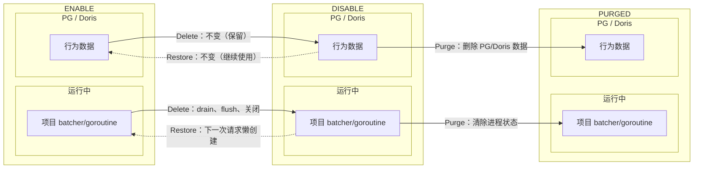

**适配结论**

- Delete 先 drain、flush，再关闭项目 batcher，不删除行为数据。
- Restore 由下一次行为请求懒创建 batcher。
- Purge 只由 PG/Doris 清理 owner 删除行为数据。

#### 4.5.7 Wagent 资源台账

| 资源 | 类型 | 来源/创建 | 内容与作用 | Delete | Restore | Purge |
| --- | --- | --- | --- | --- | --- | --- |
| `wagent_conversation/message` | 持久资源 | Wagent 执行写入 | Conversation、Message 查询 | 保留 | 继续使用 | Meta Schema Drop 清理 |
| execution/compaction Stream、DLQ、pending | 持久资源 | 执行入队或失败写入 | claim/start、重试和恢复 | 禁止 claim/start，不 ACK/XDEL | 恢复后重新领取 | Wagent owner 定向删除目标项目 entry |
| execution/lease/event/active-lock Key | 运行资源 | 执行和 heartbeat 创建 | 执行互斥、租约、事件 | 保留或自然过期 | 继续使用 | Wagent owner 定向删除 |
| quota/rate-limit Key | 运行资源 | 配额和限流请求创建 | 执行配额和限流 | 保留或自然过期 | 继续使用 | Wagent owner 定向删除 |
| executor `running` map | 进程内状态 | 执行启动时写入 | 运行中 execution 管理 | heartbeat 取消并移除 | 新执行重新创建 | 随进程状态清除 |
| MCP tool TTL cache | 进程内状态 | MCP tool list 查询创建 | 工具列表缓存 | 保留或 TTL 过期 | 新请求恢复 | 不单独清理 |

**资源生命周期变化图**

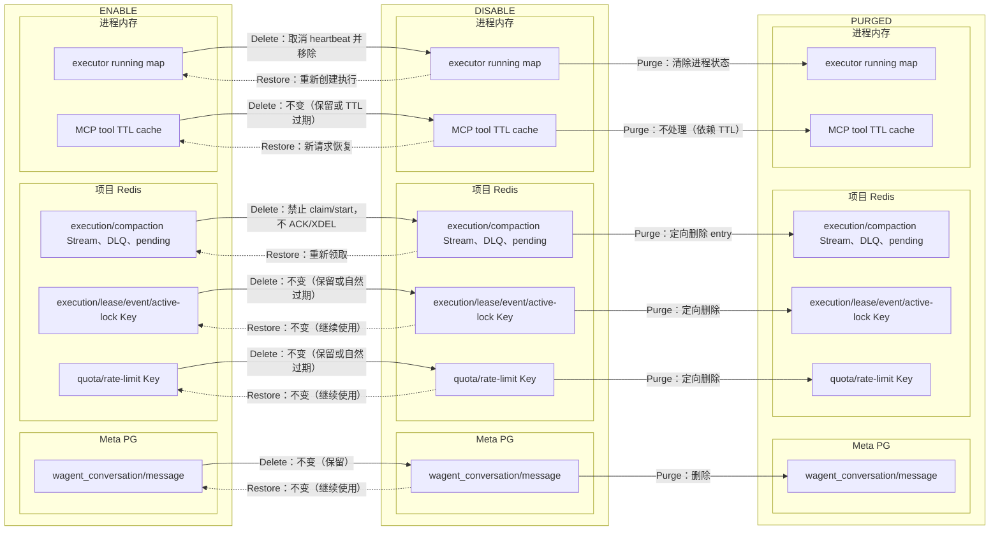

**适配结论**

- Delete 禁止新的 `claim/start`，运行中的 execution 由 heartbeat 发现 PM 缺失后收敛。
- Restore 不恢复旧执行，后续任务重新 claim；已完成数据继续保留。
- Purge 定向删除 Stream、lease、event、quota 等项目资源。

#### 4.5.8 Web MA 控制面资源台账

| 资源 | 类型 | 来源/创建 | 内容与作用 | Delete | Restore | Purge |
| --- | --- | --- | --- | --- | --- | --- |
| campaign/audience/config | 持久资源 | MA 配置创建 | launch、materialize、ConfigSync | 入口门禁拒绝新工作 | 继续读取 | Meta Schema Drop 清理 |
| MA Time/Event Trigger Job | 持久资源 | Scheduler 注册 | 时间触发和事件触发 | Job 保留但不运行 | 下一次调度或对账恢复 | Meta Schema Drop 清理 |

**资源生命周期变化图**

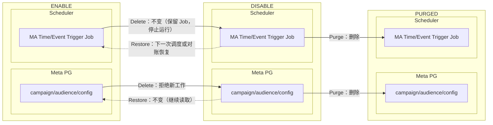

**适配结论**

- Web MA 只负责入口门禁，不新增独立运行时注册表。
- Delete 保留 Scheduler Job，但不再生成新的 launch/materialize 工作。
- Purge 通过现有 MA 内部 endpoint 清理 MA 独享资源。

#### 4.5.9 权限与 Token cache 资源台账

| 资源 | 类型 | 来源/创建 | 内容与作用 | Delete | Restore | Purge |
| --- | --- | --- | --- | --- | --- | --- |
| `sol:perm:*`、asset permission cache | 运行资源 | 权限查询或刷新创建 | 普通 API、资产访问 | 保留，入口门禁拒绝项目 | 原关系继续可用 | `project_redis` 删除 |
| Project→Org cache | 运行资源 | 组织/项目查询创建 | 归属校验和准入 | 保留或自然过期 | 继续使用 | `project_redis` 删除 |
| Account API Token scope cache | 运行资源 | Token scope 查询创建 | API Token 授权 | 保留，scope 源不变 | 继续使用 | 事务提交前后驱逐 |
| Token scope / invite source | 持久资源 | Global PG 写入 | Token 授权和邀请 | 保留 | 继续使用 | Global 最终事务移除引用 |

**资源生命周期变化图**

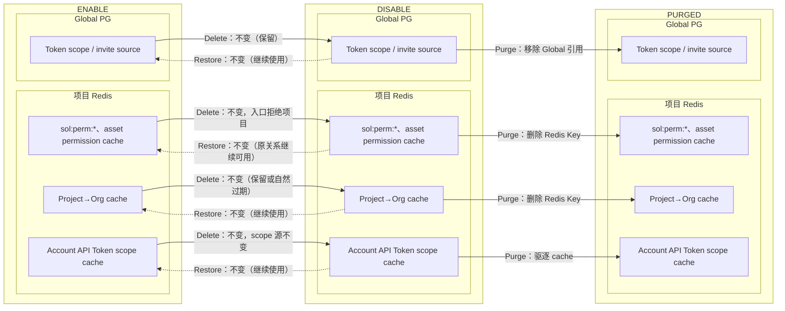

**适配结论**

- Delete 不修改成员、scope 或 token source，只由入口门禁拒绝项目。
- Restore 复用原有 source 和 cache，不新增权限模型。
- Purge 在事务完成前后驱逐 cache，并移除项目相关 source 引用。

带 project label 的 metrics/log/trace 属于可观测历史，按 retention 保留，不增加 Purge 删除接口。

### 4.6 在线入口：`edge`、`adtol`、`abol`

#### 4.6.1 `apps/edge` 资源台账

| 资源 | 类型 | 来源/创建 | 内容与作用 | Delete | Restore | Purge |
| --- | --- | --- | --- | --- | --- | --- |
| Raw/Event/Error Topic | 持久资源 | Project 初始化显式创建 | 保存采集入口接收的原始事件、处理后事件和错误事件，供后续 Connector/C1 消费 | 保留 | 不重建 | Kafka 清理 owner 删除；不存在即成功 |
| 全局 producer | 运行资源 | Edge 服务启动 | ingest 写入 Topic | 已进入 producer 的有限消息允许完成 | 继续使用 | 不按项目删除 |
| `token2id` | 进程内状态 | PM Update Hook 创建 | Token → project ID | Delete Hook 驱逐 | Update Hook 重建 | 随进程状态清除 |
| `pipelineVersion` | 进程内状态 | PM Update Hook 创建 | ingest 读取版本 | Delete Hook 驱逐 | Update Hook 重建 | 随进程状态清除 |
| `internalSecrets` | 进程内状态 | PM Update Hook 创建 | 内部请求鉴权 | Delete Hook 驱逐 | Update Hook 重建 | 随进程状态清除 |

**资源生命周期变化图**

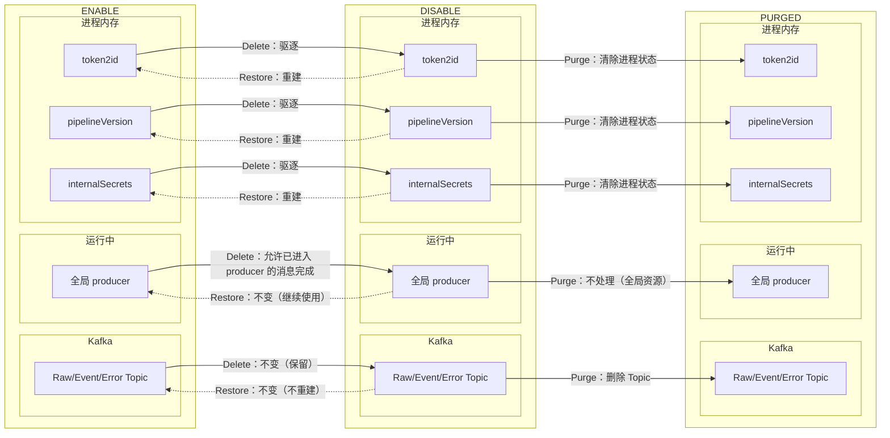

**适配结论**

- Delete 只驱逐项目进程内 map；全局 producer 不按项目停止。
- Restore 通过 PM Update Hook 重建 map，Topic 不重建。
- Purge 由 Kafka owner 删除 Topic；已进入 producer 的有限消息允许完成。

#### 4.6.2 `apps/adtol` 资源清单与结论

| 资源或入口 | 类型 | 来源/创建 | 内容与作用 | Delete | Restore | Purge |
| --- | --- | --- | --- | --- | --- | --- |
| `PM.Token2ProjectID` | 入口门禁 | 每次 HTTP 请求 | Token → project ID | PM 缺失时拒绝 | PM 恢复后放行 | 无资源清理 |
| 项目持久资源 | 持久资源 | 无 | ADTOL 不拥有 | 无变化 | 无变化 | 无 |
| 项目运行资源 | 运行资源 | 无 | ADTOL 不拥有 | 无变化 | 无变化 | 无 |
| 项目进程内状态 | 进程内状态 | 无 | ADTOL 不拥有 | 无变化 | 无变化 | 无 |

**资源生命周期变化图**

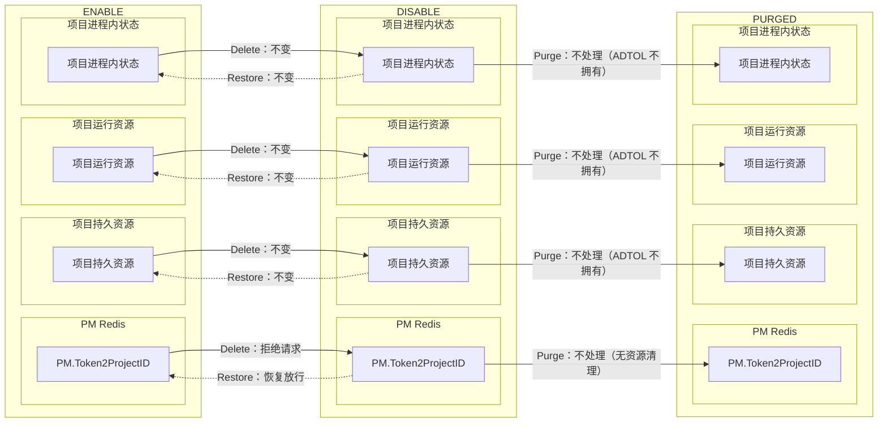

**适配结论**

- ADTOL 不拥有项目持久资源、运行资源或进程内状态。
- 只需继续依赖 PM 入口门禁；Delete 后拒绝请求，Restore 后自动放行。
- 不新增 ADTOL 专用 Purge 接口。

#### 4.6.3 `apps/abol` 资源台账

| 资源 | 类型 | 来源/创建 | 内容与作用 | Delete | Restore | Purge |
| --- | --- | --- | --- | --- | --- | --- |
| Meta AB 配置 | 持久资源 | AB 配置写入 | ABOL → AB API | 保留 | 继续读取 | Meta 清理 owner 处理 |
| 项目 Redis target cache | 运行资源 | AB 配置读取或刷新 | ABCore target lookup | 保留 | 继续使用 | Redis 清理 owner 删除 |
| metadata loop | 运行资源 | PM Update Hook 创建 | metadata 同步 | PM Delete Hook 停止 | PM Update Hook 重建 | 随运行资源清除 |
| `abCore[projectID]` | 进程内状态 | PM Update Hook 创建 | ABOL project core lookup | PM Delete Hook 删除 | PM Update Hook 重建 | 随进程状态清除 |

**资源生命周期变化图**

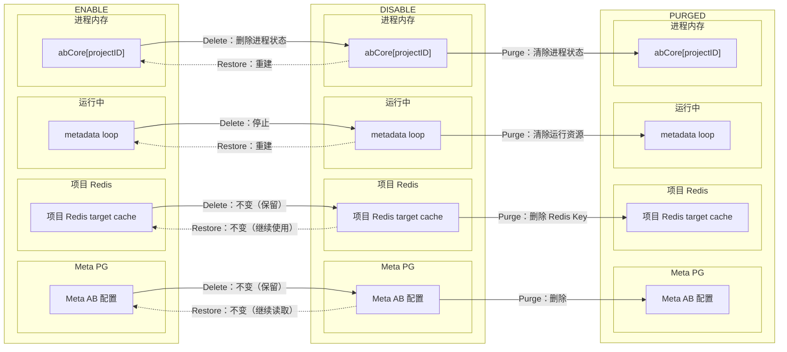

**适配结论**

- Delete 通过 PM Delete Hook 停止 metadata loop，并删除 `abCore[projectID]`。
- Restore 通过 PM Update Hook 重建 core 和 loop，原有配置继续使用。
- Purge 由 Meta/Redis owner 清理持久资源。

### 4.7 数据处理与异步执行：`c1`、`connector`、`ma`

#### 4.7.1 `apps/c1` 资源台账

| 资源 | 类型 | 来源/创建 | 内容与作用 | Delete | Restore | Purge |
| --- | --- | --- | --- | --- | --- | --- |
| Meta/Data PG | 持久资源 | Project 初始化和 Pipeline 写入 | Pipeline/IDM 数据读写 | 保留 | 继续使用 | PG 清理 owner 处理 |
| Doris Database | 持久资源 | Project 初始化 | Pipeline 查询和写入 | 保留 | 继续使用 | Doris 清理 owner 处理 |
| 项目 Kafka Topic | 持久资源 | Project 初始化显式创建；C1 现有 writer 可自动补建 | 保存原始与处理后的项目事件，供 C1 extractor 和 Pipeline 读写 | 保留 | 不重建 | Kafka 清理 owner 删除；C1 禁止自动补建 |
| C1 extractor group | 持久资源（跨项目共享） | C1 服务启动 | 跨项目事件抽取 | 保留 | 继续使用 | 不删除共享 group |
| Redis task map | 持久资源 | Dispatch 拓扑刷新 | 项目任务分配 | 重写目标项目 map | 根据 PM quota 重建 | task count 为 0 后保留其他项目 |
| Tasker | 运行资源 | Dispatch 分配项目任务 | 执行项目任务 | 关闭 | 重新分配 | 静默后不再运行 |
| consumer/loader | 运行资源 | C1 运行时创建 | 消费和加载数据 | 取消或自然收敛 | 懒加载 | 不删除全局 loader |
| metadata store、topology/counts | 进程内状态 | Project 拓扑和元数据加载 | C1 查找和拓扑刷新 | PM Delete Hook 驱逐 | 懒加载或重新分配 | 随进程状态清除 |
| DDL mutex | 进程内状态（跨项目共享） | DDL 操作创建 | 防止同项目并发 DDL | 不主动替换 | 继续使用 | 不跨进程删除 |

**资源生命周期变化图**

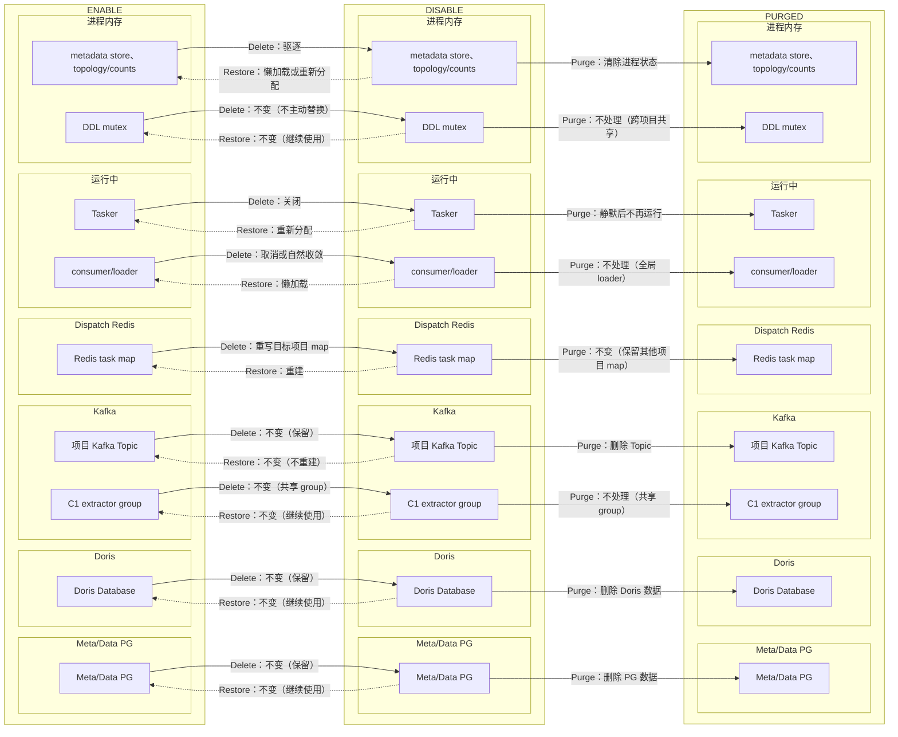

**适配结论**

- Delete 重写项目 task map，关闭目标 Tasker，并驱逐 metadata store。
- Restore 重新分配 quota，按需懒加载 metadata；共享 extractor group 不停止。
- Purge 先确认 task count 为零，再由 PG/Doris/Kafka owner 清理。

#### 4.7.2 `apps/connector` 资源台账

| 资源 | 类型 | 来源/创建 | 内容与作用 | Delete | Restore | Purge |
| --- | --- | --- | --- | --- | --- | --- |
| Meta pipeline/run/backfill | 持久资源 | Connector 创建任务 | Pipeline、Backfill | 保留 | cron/repair 重新领取 | Meta Schema Drop 清理 |
| Scheduler Instance/Task/lease | 持久资源 | Scheduler 调度 | Handler ownership | 保留，heartbeat 释放运行 lease | 恢复后重新领取 | Scheduler owner 删除 notify/lease |
| 派生 Topic 和消费组 | 持久资源 | Pipeline 运行或 Connector 初始化 | Kafka runner/consumer | 保留 | 从 offset 继续 | Kafka 清理 owner 删除 |
| OSS `load/backfill/events_cron/users_cron/<pid>/` | 持久资源 | Load/backfill/cron 写入 | 文件交换和导入 | 保留 | 继续使用 | OSS 清理 owner 清理四类前缀 |
| Kafka runner/consumer | 运行资源 | Handler 启动 | Nearline 和批处理执行 | PM gate/heartbeat 取消 | cron/repair 重启 | 静默后不再运行 |
| 批导临时对象 | 进程内状态 | 批导 handler 创建 | 批量处理上下文 | handler 取消后释放 | 新任务重新创建 | 随进程状态清除 |
| 客户目标副本 | 范围外资源 | Connector 向客户系统写入 | 客户外部消费链路 | 不回收 | 不回收 | Purge 不删除 |

**资源生命周期变化图**

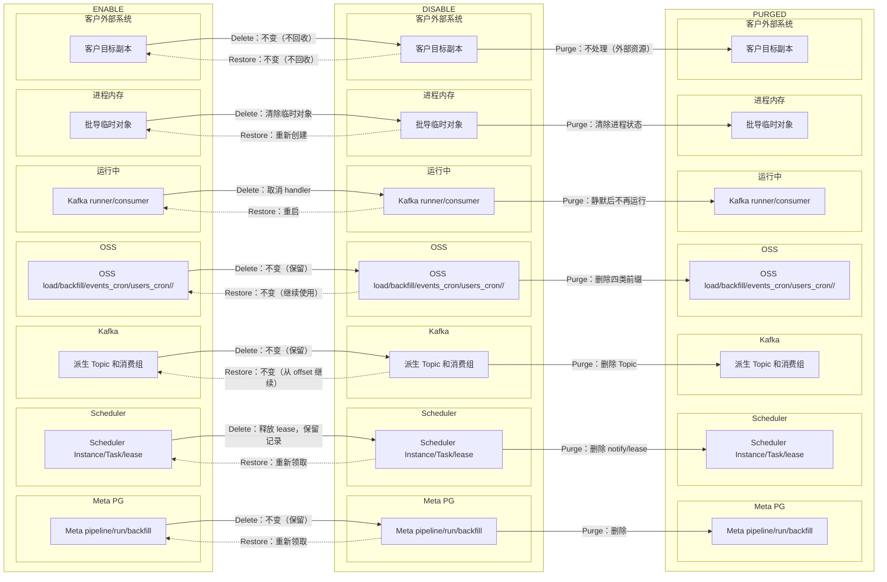

**适配结论**

- Delete 通过 PM gate 和 heartbeat 取消 handler，不删除 Wave 数据。
- Restore 依赖 cron/repair 重新领取任务，已有 offset 和数据继续使用。
- Purge 只清理 Wave 自有资源，客户目标副本明确不回收。

#### 4.7.3 `apps/ma` 资源台账

| 资源 | 类型 | 来源/创建 | 内容与作用 | Delete | Restore | Purge |
| --- | --- | --- | --- | --- | --- | --- |
| Meta campaign/audience/config | 持久资源 | MA 配置创建 | ConfigSync、launch、materialize | 入口门禁拒绝新工作 | 继续读取 | Meta Schema Drop 清理 |
| 共享/独享 Redis project Key | 持久资源 | ConfigSync、consumer、fanout 写入 | config、cohort、delay、delivery、idempotency | 保留 | 继续使用 | MA endpoint 清理两个 Redis |
| 项目 group `{groupPrefix}.<pid>` | 持久资源 | MA consumer 创建 | 项目事件消费 | 保留 | 不主动重建 | MA endpoint 删除 group |
| Scheduler handler | 运行资源 | MA Job 调度 | time-fire、event-trigger | heartbeat 取消 | 下一次 cron/repair 恢复 | 静默后不再运行 |
| event consumer、watcher、sweeper、materializer | 运行资源 | ConfigSync/Scheduler 创建 | 行为匹配和 fanout | PM Delete Hook 驱逐或取消 | 重新 track 或懒加载 | MA endpoint 清理项目资源 |
| config/cohort/matcher/feedback cache | 进程内状态 | 项目 track 或事件加载 | 匹配、反馈和配置读取 | PM Delete Hook 驱逐 | 懒加载 | 随进程状态清除 |

**资源生命周期变化图**

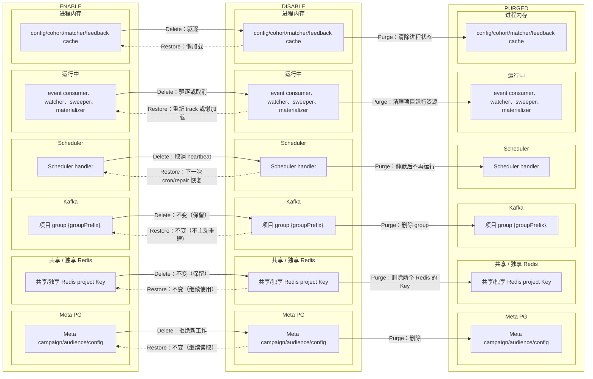

**适配结论**

- Delete 取消项目 track、handler 和项目 cache，但保留 Redis 数据。
- Restore 由 ConfigSync 重新 track，运行资源和 cache 按需恢复。
- Purge 通过 MA 内部 endpoint 清理项目 Redis、group 和运行残留。

### 4.8 独立工具：`apps/simulator`

| 项目来源 | Wave 项目资源 | Delete / Restore / Purge | 结论 |
| --- | --- | --- | --- |
| 本地 YAML/JSON 中的 endpoint/token | 无 PM、无持久资源、无运行资源、无进程内状态、无生产 Scheduler handler | Delete/Restore/Purge 均不修改操作侧文件；已失效 endpoint/token 的请求由入口门禁拒绝 | 无生产代码改动 |

该组件没有项目资源，因此不绘制生命周期变化图；表格结论即为完整适配结论。

### 4.9 共享运行骨架

#### 4.9.1 `pkg/pm` 资源台账

| 资源 | 类型 | 来源/创建 | 内容与作用 | Delete | Restore | Purge |
| --- | --- | --- | --- | --- | --- | --- |
| 可用项目集合索引 `sys:{pm}:projects` | 运行资源 | `SetInfo/DeleteInfo` 写 Redis Hash | 保存当前可用的 project ID 集合，供组件枚举项目和判断项目是否存在 | 删除 project ID | 写回 project ID | 确认不含 project ID，不编排其他清理 |
| 项目运行时快照 `sys:{pm}:info:<pid>` | 运行资源 | `SetInfo/DeleteInfo` 写 Redis String | 保存 `pm.Info` JSON，包括 Secret、状态、Schema/Database/Topic、配额和配置 | 删除项目快照 | 写回项目快照 | 确认快照不存在，不编排其他清理 |
| 变更频道 `sys:{pm}:info_change` | 运行资源 | `SetInfo/DeleteInfo` 发布 | 传播 project ID、set/delete 动作，使各组件更新本地状态 | 发布 delete；断线后重订阅 | 发布 set；断线后重订阅 | 不发布 Purge 事件 |
| project/token/config map | 进程内状态 | PM 可用项目集合索引和运行时快照加载 | 缓存项目、Token 与配置，供组件本地查找和入口门禁 | Delete Hook 驱逐 | Update Hook 重建 | 随进程状态清除 |
| 快照对账 | 运行资源 | PM 重订阅或定时检查 | 重新读取可用项目集合索引和运行时快照，修正丢消息和陈旧本地状态 | 保留对账能力 | 继续对账 | 不承担资源清理 |

**资源生命周期变化图**

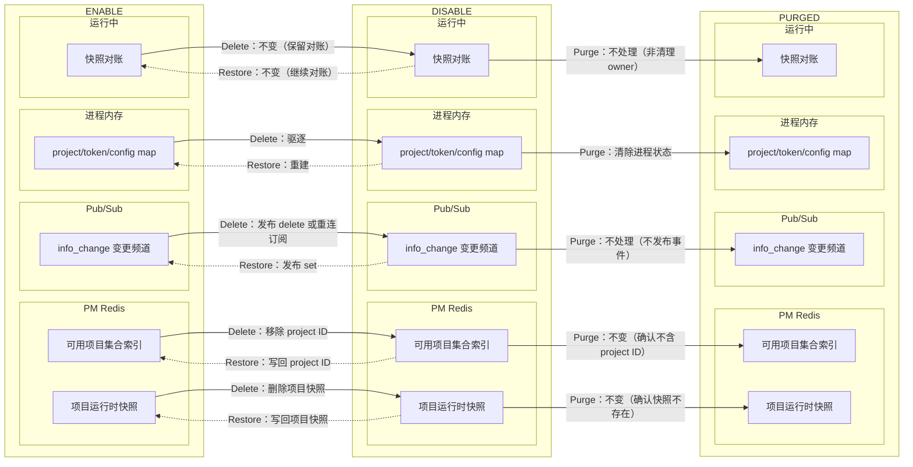

**适配结论**

- PM 的“目录”由可用项目集合索引和项目运行时快照共同组成；Delete 同时移除两者，Restore 通过 `SetInfo` 写回两者。
- Delete/Restore 传播依赖现有 Pub/Sub 和快照对账，不新增第二套通知机制。
- Purge 只确认 PM 中无项目，不由 PM 编排各资源清理。

#### 4.9.2 `pkg/scheduler` 资源台账

| 资源 | 类型 | 来源/创建 | 内容与作用 | Delete | Restore | Purge |
| --- | --- | --- | --- | --- | --- | --- |
| Meta PG Job/Instance/Task | 持久资源 | Job 注册和调度 | Master、Worker、handler | 保留，不改业务状态 | cron/repair 恢复 | Meta Schema Drop 清理 |
| Redis notify/delayed | 持久资源 | Master/Worker notify | 生成和领取工作 | 不 ACK 为成功 | 恢复后 repair | Scheduler owner 按项目过滤删除 |
| heartbeat/lease Key | 运行资源 | Instance/Task handler | ownership 和租约 | heartbeat 发现 PM 缺失后释放 | 新 handler 重新获取 | Scheduler owner 定向删除 |
| Master cron | 运行资源 | Scheduler 启动 | Job tick 和 notify | 每 tick 检查 PM，跳过新工作 | 下一 tick 恢复 | 不按项目停止全局 cron |
| Worker handler/context | 运行资源 | Worker claim 成功 | Instance/Task 执行 | heartbeat 取消本地 context | 后续 repair 重新领取 | 静默后不再运行 |

**资源生命周期变化图**

```mermaid
flowchart LR
    subgraph enable["ENABLE"]
        subgraph e_meta["Meta PG"]
            EJob["Meta PG Job/Instance/Task"]
        end
        subgraph e_redis["Scheduler Redis"]
            ENotify["Redis notify/delayed"]
        end
        subgraph e_runtime["Scheduler 运行中"]
            ELease["heartbeat/lease Key"]
            EMaster["Master cron"]
            EWorker["Worker handler/context"]
        end
    end

    subgraph disable["DISABLE"]
        subgraph d_meta["Meta PG"]
            DJob["Meta PG Job/Instance/Task"]
        end
        subgraph d_redis["Scheduler Redis"]
            DNotify["Redis notify/delayed"]
        end
        subgraph d_runtime["Scheduler 运行中"]
            DLease["heartbeat/lease Key"]
            DMaster["Master cron"]
            DWorker["Worker handler/context"]
        end
    end

    subgraph purged["PURGED"]
        subgraph p_meta["Meta PG"]
            PJob["Meta PG Job/Instance/Task"]
        end
        subgraph p_redis["Scheduler Redis"]
            PNotify["Redis notify/delayed"]
        end
        subgraph p_runtime["Scheduler 运行中"]
            PLease["heartbeat/lease Key"]
            PMaster["Master cron"]
            PWorker["Worker handler/context"]
        end
    end

    EJob -->|Delete：不变（保留，不改业务状态）| DJob
    ENotify -->|Delete：不 ACK 为成功| DNotify
    ELease -->|Delete：释放 lease| DLease
    EMaster -->|Delete：跳过新工作| DMaster
    EWorker -->|Delete：取消 context| DWorker
    DJob -.->|Restore：不变（cron/repair 恢复）| EJob
    DNotify -.->|Restore：repair 恢复| ENotify
    DLease -.->|Restore：重新获取 lease| ELease
    DMaster -.->|Restore：下一 tick 恢复| EMaster
    DWorker -.->|Restore：repair 重新领取| EWorker
    DJob -->|Purge：删除| PJob
    DNotify -->|Purge：按项目删除 notify| PNotify
    DLease -->|Purge：定向删除 lease| PLease
    DMaster -->|Purge：不处理（全局 cron）| PMaster
    DWorker -->|Purge：静默后不再运行| PWorker
```

**适配结论**

- 所有 JobType 共用 PM gate；Delete 后 Master/Worker 不生成或领取新工作。
- 运行中的 handler 只通过 heartbeat 取消 context 并释放 lease，不增加停止信号。
- Restore 依赖 cron/repair；Purge 定向清理 notify/lease，不停止全局 cron。

#### 4.9.3 `pkg/dispatch` 资源台账

| 资源 | 类型 | 来源/创建 | 内容与作用 | Delete | Restore | Purge |
| --- | --- | --- | --- | --- | --- | --- |
| Redis service/project task map | 持久资源 | Dispatch topology 刷新 | 项目任务分配 | 重写目标项目 map | 根据 PM quota 重建 | 只确认目标项目为 0，不删其他项目 |
| Pub/Sub | 运行资源 | Dispatch 订阅建立 | 拓扑和任务变更 | 保留共享订阅 | 继续使用 | 不删除全局 channel |
| TaskManager | 运行资源 | Dispatch 启动 | C1 Tasker 管理 | 关闭目标项目 Tasker | 重新分配后启动 | task count 为 0 后静默 |
| counts/topology | 进程内状态 | topology 刷新 | 项目任务数和拓扑 | removed project 触发刷新 | 重新分配时更新 | 随进程状态清除 |

**资源生命周期变化图**

```mermaid
flowchart LR
    subgraph enable["ENABLE"]
        subgraph e_redis["Dispatch Redis"]
            EMap["Redis service/project task map"]
        end
        subgraph e_pubsub["Pub/Sub"]
            EPub["Pub/Sub"]
        end
        subgraph e_runtime["运行中"]
            ETask["TaskManager"]
        end
        subgraph e_memory["进程内存"]
            ETopo["counts/topology"]
        end
    end

    subgraph disable["DISABLE"]
        subgraph d_redis["Dispatch Redis"]
            DMap["Redis service/project task map"]
        end
        subgraph d_pubsub["Pub/Sub"]
            DPub["Pub/Sub"]
        end
        subgraph d_runtime["运行中"]
            DTask["TaskManager"]
        end
        subgraph d_memory["进程内存"]
            DTopo["counts/topology"]
        end
    end

    subgraph purged["PURGED"]
        subgraph p_redis["Dispatch Redis"]
            PMap["Redis service/project task map"]
        end
        subgraph p_pubsub["Pub/Sub"]
            PPub["Pub/Sub"]
        end
        subgraph p_runtime["运行中"]
            PTask["TaskManager"]
        end
        subgraph p_memory["进程内存"]
            PTopo["counts/topology"]
        end
    end

    EMap -->|Delete：重写目标项目 map| DMap
    EPub -->|Delete：不变（保留共享订阅）| DPub
    ETask -->|Delete：关闭目标项目 Tasker| DTask
    ETopo -->|Delete：刷新并移除项目| DTopo
    DMap -.->|Restore：按 PM quota 重建| EMap
    DPub -.->|Restore：不变（继续使用）| EPub
    DTask -.->|Restore：重新分配后启动| ETask
    DTopo -.->|Restore：重新分配时更新| ETopo
    DMap -->|Purge：不变（确认目标项目为 0）| PMap
    DPub -->|Purge：不处理（全局 channel）| PPub
    DTask -->|Purge：task count 为 0 后静默| PTask
    DTopo -->|Purge：清除进程状态| PTopo
```

**适配结论**

- Delete 只刷新项目 task map 并关闭目标 Tasker，不影响共享 Pub/Sub。
- Restore 按 PM quota 重新分配任务；Purge 前必须确认目标项目 task count 为零。
- Dispatch 不负责删除 PG、Doris、Kafka 等数据资源。

#### 4.9.4 存储 client 资源台账

| client | 资源或能力 | 类型 | Delete | Restore | Purge |
| --- | --- | --- | --- | --- | --- |
| `pkg/dal/redisx` | 窄 prefix delete 和 Key 解析 | 清理能力 | 不调用清理 | 不调用清理 | 只复用已有原语，owner 负责解析 |
| `pkg/dal/kafkax` | Topic/group admin | 清理能力 | 不删 Topic/group | 不重建 Topic/group | TopicList/DeleteTopics，固定前缀 group 幂等删除 |
| `pkg/dal/dorisx` | Project Database drop | 清理能力 | 不 Drop | 不检查、不重建 | `DROP DATABASE IF EXISTS` |
| `pkg/dal/pgsqlx` | Project Schema drop | 清理能力 | 不 Drop | 不检查、不重建 | `DROP SCHEMA IF EXISTS CASCADE` |

存储 client 只提供已有的幂等清理原语，不拥有项目生命周期状态，因此不单独绘制状态图。

### 4.10 Scheduler Handler 覆盖

11 个生产 JobType 统一使用 Scheduler PM 门禁和 heartbeat，不复制组件级停止逻辑：

| 进程 | JobType | Instance/Task Handler | 处理的项目资源 |
| --- | --- | --- | --- |
| Web | `cohort` | Instance | Cohort 计算，读写项目 Meta/Data/Doris |
| Web | `cohort-clean` | Instance | 清理孤立 Cohort 数据 |
| Web | `ab-report` | Instance | AB 报表计算 |
| Web | `asset-metrics` | Instance | 资产指标刷新 |
| Web | `asset-ref-wal` | Instance | 资产引用 WAL 处理 |
| Web | `events-view` | Instance | 事件 View 刷新 |
| Web | `event-stat` | Instance | 事件统计 |
| Web | `usage-metering` | Instance | 项目用量统计 |
| Connector | `pipeline` | Instance + Task | Pipeline cron/backfill，以及 nearline Kafka 长期 runner |
| MA | `ma-time-fire` | Instance + Task | 时间触发 fire 和 fanout shard |
| MA | `ma-event-trigger` | Instance + Task | 每项目持续行为消费 |

注册证据：`apps/web/server.go`、`apps/connector/api/server.go`、`apps/ma/server/server.go`；常量：`pkg/scheduler/scheduler.go`。新增 JobType 时同步更新此表和统一门禁测试。

### 4.11 边界与完整性结论

| 对象 | 生命周期处理 |
| --- | --- |
| 客户 S3/TOS/ByteHouse 等外部目标副本 | 不归 Wave 所有，Purge 不删除 |
| project-labeled metrics、日志、trace | 按 retention 保留，不继续驱动工作 |
| C1 extractor consumer group、全局 producer/client/loader | 跨项目共享，不按项目删除 |
| `pkg/dal/dorisx.ddlLocks[projectID]` | 进程内 mutex，不是业务数据；不跨进程删除，随进程释放 |
| simulator endpoint/token 文件 | 操作侧输入，不由服务端生命周期修改 |

| 完整性检查 | 通过条件 |
| --- | --- |
| `apps/* → 资源` | `web/edge/adtol/abol/c1/connector/ma/simulator` 全部覆盖；每个组件均说明项目入口、持久资源、运行资源、进程内状态和动作结论 |
| `资源 → 清理 owner` | 第 9 章每项资源只有一个清理 owner；跨项目共享项和范围外项明确不删除 |
| 方案克制 | 不增加运行时 registry、插件、组件级 Purge RPC 或第二套停止信号 |

## 5. 逐组件实现范围

本章只写代码改动。资源现状和生命周期变化不在这里重述，统一回看第 4 章。

> 第 4 章中的“ProjectService 调用清理 owner”描述领域调用入口；代码路径具体为 `ProjectService -> ProjectResourcePurger -> owner`。第 4.11 节“不增加组件级 Purge RPC”指不为每个组件建设通用 RPC；MA 因私有 Redis 保留第 4 章已明确的单个内部 endpoint。

### 5.1 `apps/web`：控制面与 Purge 编排

| 文件 | 责任 | 具体改动 |
| --- | --- | --- |
| `apps/web/dao/global/project.go` | Project 权威状态 | 增加 `PURGING/PURGED`、WithDeleted 生命周期查询、条件状态更新、migration 单用途查询 |
| `apps/web/dao/global/organization.go` | Organization 权威状态 | 增加 `status` 字段映射、四态常量、WithDeleted 查询和条件状态更新 |
| `apps/web/dao/global/project_member.go` | 项目成员引用 | 增加按 project ID 硬删除，限最终 Global 事务使用 |
| `apps/web/dao/global/member_invite.go` | 邀请引用 | Project Purge 移除项目 ID/权限；Organization Purge 删除本组织邀请 |
| `apps/web/dao/global/account_api_token.go` | Token scope 引用 | 从有效 token scope 移除目标 project/org ID，不删除共享 Account/token |
| `apps/web/service/project/delete.go` | 轻量生命周期 | 删除 `Archive` 和旧重 Delete；实现轻量 `Delete/Restore` |
| `apps/web/service/project/purge.go` | Purge 状态入口 | 实现 `ProjectService.Purge`、`PurgeTarget` 构造、`PURGING` 转换和最终结果映射 |
| `apps/web/service/project/resource_purger.go` | 具体同步编排 | 新增具体 `ProjectResourcePurger`，按第 9 章固定顺序直接调用 owner |
| `apps/web/service/project/ma_purge.go` | MA client | 使用 `net/http` 调用 MA 内部 endpoint；非 204 映射为 `project_ma` |
| `apps/web/service/project/project.go` | Service 装配与普通更新 | 注入具体 Purger；普通更新改为显式字段和 `ENABLE,false` 条件，禁止整行 `Save` 覆盖生命周期 |
| `apps/web/service/project/create.go` | 初始化互斥 | 初始化与 lifecycle 使用同一项目锁；创建要求父组织 `ENABLE,false` |
| `apps/web/service/organization/organization.go` | 组织生命周期 | 删除 `Archive`；实现 `Delete/Restore/Purge` 和逐项目约束 |
| `apps/web/service/account/apitoken/service.go` | Token cache | 让现有 cache 删除返回错误；Global 事务前严格驱逐、提交后 best-effort 重复驱逐 |

`ProjectService.Purge` 与 `ProjectResourcePurger` 的边界固定为：

1. Service 在短锁内读取记录、校验状态、构造 `PurgeTarget`，并条件写入 `PURGING`。
2. Service 释放锁后调用具体 Purger。
3. Purger 只接受完整 target，不重新决定生命周期规则。
4. Purger 的资源步骤全部成功并通过最终核验后返回 Service。
5. Service 调用 Global DAO 的短事务提交墓碑，再返回 `PurgeResult`；失败不改回原状态。

不要为 `ProjectResourcePurger` 定义单实现接口，也不要把步骤改成 `[]Step`、registry 或配置文件。测试直接构造该结构体并注入现有 client/fake。

### 5.2 `apps/web`：入口门禁与本地资源 owner

| 模块/文件 | Delete/Restore 适配 | Purge 实现 |
| --- | --- | --- |
| `pkg/ginx/middleware/project.go` | 保留 PM 门禁，删除旧租户 lifecycle 白名单 | 无资源清理 |
| `pkg/ginx/middleware/organization.go` | 普通组织请求统一要求 `ENABLE,false`；OP/创建/邀请按既有边界放行 | 无资源清理 |
| `apps/web/mcp/tools/context.go` | `authorizeProjectContext` 在成员/scope 校验前检查 PM | 无资源清理 |
| `apps/web/service/pipeline/internal_metadata.go` | 新工作调用 `requireInternalProjectEnabled`；finish/update 回调保留 | 无资源清理 |
| `apps/web/ma/service/*` | 新工作入口检查 PM，执行结果回写保留 | 无资源清理 |
| `apps/web/qe/catalog/catalog.go` | Delete Hook 删除项目 Catalog；Restore 懒加载 | 清两类 QE refresh lock |
| `apps/web/service/liveevent/liveevent.go` | Delete Hook 关闭项目 consumer/WebSocket 并移出 map；Restore 新连接懒启动 | Kafka owner 删除残留临时 group |
| `apps/web/service/asset/behavior.go` | `CloseProject` drain/flush 后移出 batcher map；Restore 懒创建 | 无额外持久 owner |
| `apps/web/service/permission/cache.go` | Delete/Restore 不清 | 按权限固定 namespace 清目标 project key |
| `apps/web/service/asset/permission/cache.go` | Delete/Restore 不清 | 按资产权限固定 namespace 清目标 project key |
| `apps/web/wagent/service/runtime/*` | claim/start 前检查 PM；Delete 消息不 ACK、不 XDEL | `PurgeProject` 清项目 Stream/DLQ、`p:<pid>:*` |
| `apps/web/wagent/service/tokenquota/service.go` | Delete 后停止新执行 | `PurgeProject` 清 `wagent:quota:{pid:*}` |
| `apps/web/wagent/service/ratelimit/ratelimit.go` | Delete 后停止新执行 | 解析固定 namespace，只清目标 project execution key |

Web 本地 Hook 只处理真实进程内状态；MCP tool list 这类不能自行执行工作的 TTL cache 不增加 Hook。

### 5.3 其他 `apps/*`

| 组件 | 文件 | 必须实现 | 明确不做 |
| --- | --- | --- | --- |
| `apps/edge` | `service.go` | Delete Hook 驱逐 `token2id/pipelineVersion/internalSecrets`；验证现有 producer 默认不自动建 Topic | 不实现 Purge owner；不为已有默认行为增加配置层 |
| `apps/adtol` | `api/router.go` | 保留每请求 PM Token 查询，补 Delete/Restore 回归测试 | 不增加空 Hook |
| `apps/abol` | `service/abol.go` | 验证现有 Delete Hook 停止并移除 ABCore，Restore 可重建 | 不改持久资源 |
| `apps/connector` | `service/pipeline.go` 及 Scheduler 装配 | 长期 runner 复用 Scheduler heartbeat 取消；客户外部目标明确排除 | 不增加无资源的项目 map/Hook |
| `apps/c1` | `metadata/metadata.go`、`main.go`、`loader/kafka_loader.go` | `DeleteProjectStores` 驱逐四组 metadata；注册 PM Delete Hook；设置 `AllowAutoTopicCreation=false`，Topic 缺失时进入现有错误日志和重试路径 | 不删除全局 extractor group；不顺便调整重试和告警体系 |
| `apps/ma` | 见 5.4 | PM Hook 驱逐本地状态；内部 endpoint 清 MA 持久资源 | Web 不访问 MA Redis；不逐 Pod fan-out |
| `apps/simulator` | `main.go`、`scheduler.go` | 保持现状并在评审中确认没有生产项目资源 | 不增加生命周期代码或测试桩 |

`apps/connector` 的 JobType 和 `apps/ma` 的两个 JobType 不自行订阅生命周期消息；它们与 Web 的八个 JobType 一样，由共享 Scheduler Master/Worker 门禁覆盖。

### 5.4 `apps/ma`：私有资源 owner

| 文件 | 具体改动 |
| --- | --- |
| `apps/ma/service/configsync/sync.go` | 保留 `Untrack`，纳入统一本地 Delete Hook |
| `apps/ma/service/cohortindex/index.go`、`watcher.go` | 新增幂等 `DeleteProject`，删除 entry 并取消 watcher |
| `apps/ma/service/eventconsumer/coordinator.go` | 新增 `DeleteProject` 驱逐项目 matcher |
| `apps/ma/service/dispatch/feedback.go` | 新增 `DeleteProject` 丢弃项目内存 queue 并驱逐 token cache |
| `apps/ma/server/server.go` | Runtime 统一注册 PM Delete Hook；新增 `Runtime.PurgeProject(ctx, projectID)` |
| `cmd/ma/main.go` | 在现有 8112 `ServeMux` 注册 `POST /internal/v1/project/purge` |
| `pkg/config/app_cfg.go` | 增加 `MaBaseUrl` 和环境变量 Secret 字段 |
| `configs/web/web.*.yml` | 只配置 `sw_ma_base_url`；Secret 由部署环境注入 |

`Runtime.PurgeProject` 的顺序：

1. 对当前 MA 进程再次执行幂等本地驱逐。
2. 删除共享 Redis 中 `ma:{p:<pid>}:*`。
3. 删除 MA 独享 Redis 中同一项目前缀。
4. 删除 MA 项目消费组。
5. 重新查询两个 Redis 和 Kafka；全部不存在才返回成功。

一个 MA Pod 无法直接清其他 Pod 的内存，因此 endpoint 不把“所有 Pod 内存为空”作为 204 条件。所有 Pod 的运行停止由 PM Hook 和 Scheduler heartbeat 保证；endpoint 只负责共享持久资源。

### 5.5 共享基础设施

| 包/文件 | 具体改动 |
| --- | --- |
| `pkg/pm/project_manager.go` | 可用项目集合索引、项目运行时快照和变更发布的关键 Redis 错误上抛；写后本地同步、订阅断开重连和双快照对账 |
| `pkg/scheduler/master.go` | refresh cron 和生成 Instance 前检查 PM |
| `pkg/scheduler/worker.go` | 领取 Instance/Task 和 heartbeat 时检查 PM；缺失时取消 context、释放 lease |
| `pkg/scheduler/purge.go` | 新增 `PurgeProjectRedisState`，定向移除目标项目 notify/delayed member 和 heartbeat/lease key |
| `pkg/dispatch/node.go`、`manager.go` | removed project 标记 `changedProject` 并重写 task map；订阅关闭后重连并重新加载 |
| `pkg/dal/kafkax/admin.go` | 消费组 list/delete；`DeleteTopics` 后轮询 broker 直到不存在 |
| `pkg/dal/redisx/redis.go` | 只有多处真实复用时增加窄 `DeleteByPrefix`；不扩张通用列表/Stream API |
| 现有 OSS client | 项目前缀删除后再次 list，非空即失败 |
| 现有 Doris/PG client | 使用 `DROP ... IF EXISTS`；owner 查询系统表确认 Database/Schema 不存在 |

`pkg/scheduler/purge.go` 只能解析并移除目标 project ID 的全局 List/ZSet member，不能删除共享 key 或其他项目 member。Meta Schema 仍在最后阶段删除，Job/Instance/Task 随 Schema 一起消失。

### 5.6 OP 后端、OpenAPI、前端与 SQL

| 范围 | 文件 | 改动 |
| --- | --- | --- |
| OP DTO/Service | `apps/web/op/dto/lifecycle.go`、`service/customer_*_ops.go`、`customer_profile.go` | 详情聚合、六个动作、归属/确认/reason/audit |
| OP Controller/Converter | `apps/web/op/controller/lifecycle.go`、`converter/lifecycle.go` | 七个薄 endpoint，不放状态规则 |
| 租户 Controller | `apps/web/controller/project/project.go`、`organization/organization.go` | 删除旧 Delete Controller 和转发 |
| OpenAPI | `api/web/web.openapi.yaml` | 删除两个租户 operation，增加七个 OP operation 和 schema |
| 生成代码 | `api/web/codegen/*` | 由 `go generate ./api/web` 生成，不手改 |
| 前端 | `LifecycleTab.vue`、`LifecycleConfirmDialog.vue`、`CustomerDetail.vue` | 生命周期 Tab、通用确认框和 Tab 顺序 |
| 前端数据层 | `useCustomerDetail.ts`、`services.ts`、`types.ts`、`copy.ts` | 懒加载、七个请求、类型、文案 |
| Bootstrap SQL | `script/sql/pgsql/global.sql` | organization 增加 status |
| Migration | `script/migration/scripts/global_v20260717_organization_project_lifecycle.sql` | 只增加 organization status，不回填、不改索引 |

## 6. 数据与接口契约

### 6.1 Schema 与条件更新

```sql
ALTER TABLE organization
    ADD COLUMN IF NOT EXISTS status VARCHAR(64) NOT NULL DEFAULT 'ENABLE';

COMMENT ON COLUMN organization.status
    IS '组织状态：ENABLE/DISABLE/PURGING/PURGED';
```

| 操作 | SQL 条件 |
| --- | --- |
| Project Delete | `id=? AND status='ENABLE' AND is_deleted=false` |
| Project Restore | `id=? AND status='DISABLE' AND is_deleted=false` |
| Project Purge 新数据 | `id=? AND status IN ('DISABLE','INITIALIZING') AND is_deleted=false` |
| Project Purge 历史数据 | `id=? AND status='DISABLE' AND is_deleted=true` |
| Project Purge 重试 | `id=? AND status='PURGING'`，保持原 `is_deleted` |
| Organization Delete/Restore | 相应 `ENABLE/DISABLE AND is_deleted=false` |
| Organization Purge | `status='DISABLE' AND is_deleted=false`；`PURGING` 可重试 |

DAO 最小新增：

```go
func (d *ProjectDao) UpdateStatusIf(
    ctx context.Context,
    projectID int64,
    from []string,
    to string,
    updatedBy int64,
) (bool, error)

func (d *ProjectDao) GetByIDWithDeleted(ctx context.Context, projectID int64) (*Project, error)
func (d *ProjectDao) ListLifecycleByOrg(ctx context.Context, orgID int64) ([]Project, error)
func (d *ProjectDao) GetAllMigrationProjects(ctx context.Context) ([]Project, error)

func (d *OrganizationDao) UpdateStatusIf(
    ctx context.Context,
    orgID int64,
    from []string,
    to string,
    updatedBy int64,
) (bool, error)

func (d *OrganizationDao) GetByIDWithDeleted(ctx context.Context, orgID int64) (*Organization, error)
```

不新增索引、CHECK 或 trigger。`UpdateProjectAndCacheTransaction` 只更新允许字段，并带 `status=ENABLE AND is_deleted=false AND version=?`；生命周期操作后，旧请求不能把状态覆盖回去。

### 6.2 Purge 内部类型

```go
type PurgeTarget struct {
    ProjectID          int64
    OrganizationID     int64
    KafkaTopics        []string
    KafkaGroupPrefixes []string
    OSSPrefixes        []string
    DorisDatabase      string
    DataSchema         string
    MetaSchema         string
}

type PurgeResult struct {
    ResourceID int64
    Status     string
    Purged     bool
}

type PurgeStepError struct {
    Step string
    Err  error
}
```

`PurgeTarget` 的值只来自 Global 项目记录和固定命名规则，在写 `PURGING` 的同一个短锁阶段构造。它只在本次调用内传递；重试重新构造，不持久化。

`PurgeStepError` 只为日志、审计和 OP 错误 data 提供稳定 step；不包含步骤状态、重试计数或补偿信息。

### 6.3 MA 内部 HTTP

```text
POST /internal/v1/project/purge
Authorization: Bearer <MA_PROJECT_PURGE_TOKEN>
X-Internal-Service: web
Project: <positive int64>
Body: none
```

| 状态码 | 语义 |
| --- | --- |
| `204` | MA 持久资源已不存在；重复调用仍返回 204 |
| `400` | Project header 缺失或不是正整数 |
| `401` | Secret 不匹配或 caller 不是 `web` |
| `503` | MA Runtime 未启用或尚未完成装配 |
| `500` | Redis/Kafka 删除或核验失败 |

实现约束：

- Secret 使用 `subtle.ConstantTimeCompare`，来自 `MA_PROJECT_PURGE_TOKEN`，不写 YAML。
- Web 使用请求 context 和有界 timeout，不做 HTTP client 自动重试。
- Web 将所有非 204 响应映射为 `project_ma`，保留 `PURGING`。
- MA 不为该 endpoint 初始化 Global DB、Gin 或 Web 的 internal auth registry。

### 6.4 OP OpenAPI

```yaml
CustomerLifecycleProjectActionRequest:
  type: object
  required: [customer_id, project_id, confirm_value, reason]
  properties:
    customer_id: { type: integer, format: int64, minimum: 1 }
    project_id: { type: integer, format: int64, minimum: 1 }
    confirm_value: { type: string, minLength: 1, maxLength: 32 }
    reason: { type: string, minLength: 1, maxLength: 1000 }

CustomerLifecycleOrgActionRequest:
  type: object
  required: [customer_id, organization_id, confirm_value, reason]
  properties:
    customer_id: { type: integer, format: int64, minimum: 1 }
    organization_id: { type: integer, format: int64, minimum: 1 }
    confirm_value: { type: string, minLength: 1, maxLength: 32 }
    reason: { type: string, minLength: 1, maxLength: 1000 }
```

动作成功只返回 `resource_id/status/purged`。Conflict/依赖失败的结构化 data 只允许 `resource_id`、最多 20 个 `blocked_ids`、`blocked_count` 和 `step`；不返回 receipt 或 `already_absent`。

## 7. 生命周期实现

### 7.1 锁与状态边界

- 复用现有 owner-safe 组织锁/项目锁。
- 锁只覆盖读取、校验、target 构造和条件状态切换。
- Project Create/初始化与 lifecycle 使用同一项目锁，保证 `INITIALIZING` Purge 不与初始化资源创建并发。
- Organization lifecycle、Project Create/Restore 统一按 organization → project 顺序；Project Delete 只取项目锁。
- 不新增长 TTL、续租器或等待队列。两个 `PURGING` 重试允许并发执行幂等清理。

### 7.2 Project Delete

```go
func (s *ProjectService) Delete(ctx context.Context, projectID int64) error
```

1. 项目锁内 WithDeleted 读取目标。
2. `INITIALIZING/PURGING/PURGED/is_deleted=true` 返回 Conflict；不检查父组织状态。
3. 已 `DISABLE,false` 时仍调用 `PM.DeleteInfo` 后成功。
4. `ENABLE,false` 时先 `PM.DeleteInfo`，再条件更新为 `DISABLE`。
5. 不调用任何资源 owner。

### 7.3 Project Restore

```go
func (s *ProjectService) Restore(ctx context.Context, projectID int64) error
```

1. 组织锁和项目锁内要求父组织 `ENABLE,false`。
2. 项目必须为 `DISABLE,false`；历史软删除、`INITIALIZING/PURGING/PURGED` 拒绝。
3. 条件更新为 `ENABLE`，再用已有配置调用 `PM.SetInfo`。
4. 已 `ENABLE,false` 时不更新 DB，但仍重发 `SetInfo`。

不等待 Hook 或 Scheduler 收敛，不检查/重建资源。

### 7.4 Project Purge

```go
func (s *ProjectService) Purge(
    ctx context.Context,
    projectID int64,
) (PurgeResult, error)

func (p *ProjectResourcePurger) Purge(
    ctx context.Context,
    target PurgeTarget,
) error
```

Service 入口：

1. `ENABLE` 返回 Conflict。
2. `DISABLE/INITIALIZING,false` 条件写入 `PURGING,false`。
3. 历史 `DISABLE,true` 条件写入 `PURGING,true`。
4. `PURGING` 直接进入重试；`PURGED,true` 直接返回成功。
5. 主记录不存在返回 NotFound，不查审计表模拟 receipt。

Purger 执行：

1. 从 PM 移除并确认缺失。
2. 检查运行静默/防重建条件。
3. 按第 9 章固定顺序调用 owner；错误立即包装当前 step 返回。
4. 对全部已知资源做最终核验。
5. 成功返回 Service，由 Service 调用 Global DAO 的短事务写墓碑。

Global 最终事务：

1. 硬删 `project_member`。
2. 从 `member_invite.project_ids` 和 `invite_conf.project_auth` 移除 project ID。
3. 从有效 `account_api_token.scopes.project_ids` 移除 project ID；`all_projects=true` 不改。
4. 清空 `description/conf`、`sign`，把 `secret` 改为唯一且不可认证的 `purged:<projectID>`。
5. 保留 `id/org_id/name/created_at/created_by`，写 `status=PURGED,is_deleted=true`。

事务前严格驱逐受影响 token cache；提交后重复 best-effort 驱逐，以缩小并发回填窗口。

### 7.5 Organization

```go
func (s *OrgService) Delete(ctx context.Context, orgID int64) ([]int64, int64, error)
func (s *OrgService) Restore(ctx context.Context, orgID int64) error
func (s *OrgService) Purge(ctx context.Context, orgID int64) (PurgeResult, error)
```

- Delete：全部 `is_deleted=false` 子项目必须为 `DISABLE`；阻塞 ID 最多返回 20 个和总数。
- Restore：`DISABLE,false -> ENABLE,false`，不 Restore 项目。
- Purge：全部子项目必须为 `PURGED,true`；`PURGING` 可重跑，`PURGED,true` 直接成功。
- 最终事务清邀请、组织成员、role、token scope，保留 Account、Customer Profile、合同、审计和子项目墓碑。
- 成功后调用既有 `ExpireCustomerByOrgID`，客户绑定保持 `expired`。

## 8. 运行收敛与防复活

### 8.1 PM 对账算法

`SetInfo` 按“项目运行时快照 → 可用项目集合索引 → 本地状态 → 变更发布”执行。`DeleteInfo` 先从可用项目集合索引移除 project ID，再删除调用节点本地状态，并尽量删除项目运行时快照、发布事件；返回首个关键错误。

- `onSetInfo` 比较完整持久 payload，相同则不重复 Hook。
- `onDeleteInfo` 在本地已不存在时不重复 Hook。
- `autoSubscribe` 在 channel 关闭后固定等待 1 秒再订阅。
- 每次订阅成功后加载 Redis 可用项目集合索引和项目运行时快照：新增/变化执行 set，本地多余执行 delete。
- 快照读取失败时保留当前本地状态，不能把空结果当成“全部删除”。

### 8.2 Scheduler

| 层次 | 检查位置 | PM 不含项目时 |
| --- | --- | --- |
| Master | `doOnJobNotify`、`wrappedJobCron.Run` | 不生成 Instance |
| Worker 领取 | `onJobInstanceNotify`、`onJobTaskNotify` | 不抢占 |
| 运行 heartbeat | 既有 Instance/Task heartbeat | 取消 handler context，释放 ownership/lease |

取消不把 Job/Instance/Task 写为 `STOP/CANCELED/FAILED`，不增加业务失败次数，也不立即重新 notify。Delete 期间现有 Pending/Retrying 和通知数据保留；Restore 后由现有 cron/repair 继续。

`PurgeProjectRedisState` 只在 Purge 调用：

1. 删除项目 heartbeat/lease ZSet。
2. 分页解析全局 notify/delayed List/ZSet，只移除目标 project member。
3. 扫描现有 JobGroup 的 notify/delayed key，按同一 parser 过滤。
4. 完整一轮无目标项才成功。

### 8.3 Writer 防复活矩阵

| 资源 | 清理前条件 | 防复活改动 |
| --- | --- | --- |
| Scheduler Redis/Meta | PM 已移除，运行 heartbeat 已收敛 | Master/Worker 三层 PM 门禁 |
| Dispatch/C1 | topology 中无项目，Tasker 数为 0 | removed project 强制重写 task map；订阅重连 reload |
| Kafka Topic | C1/Edge/Connector writer 已停止 | producer `AllowAutoTopicCreation=false`；只有初始化可建 Topic |
| MA Redis/group | MA Scheduler handler 被取消，新入口被 PM 拒绝 | MA endpoint 删除后自检 |
| Wagent Redis/Stream | 无 Running execution，claim/start 被 PM 拒绝 | Delete 消息不 claim，Purge 再定向清理 |
| OSS 前缀 | Connector runner 已停止 | 只在 runner 静默后删除并复查 |
| Doris/PG 容器 | 初始化与 lifecycle 互斥，普通入口不可创建 | 只有初始化路径创建，且要求允许状态 |

不增加 generation fencing。若 owner 无法证明“writer 已停止或不能重建”，`project_quiescence` 失败并保留 `PURGING`。

### 8.4 入口边界

| 入口 | Delete 后 |
| --- | --- |
| 普通 Web/SDK/Edge/ADTOL/ABOL | PM 或 OrganizationFilter 拒绝 |
| MCP | `authorizeProjectContext` 在 scope 前拒绝 |
| Internal S2S 新工作命令：run/start、load-file/create、materialize-fanout | `requireInternalProjectEnabled` 拒绝 |
| Internal S2S 在途查询：metadata/list/detail/running/latest-success | 允许只读访问既有执行上下文；不跟踪调用是否来自旧 worker |
| Internal S2S 结果/进度回写：pipeline/run/load-file/backfill update/finish/advance/complete | 允许更新既有执行状态、日志和统计，但不得创建新执行 |
| Wagent | claim/start 拒绝，队列消息保留 |
| LiveEvent | Delete Hook 关闭连接；Restore 后新连接重建 |

`InternalProjectContext` 继续只解析 Header，因为同组存在无项目 admin endpoint；不在 middleware 全局阻断所有内部请求。进入 `PURGING` 后立即拒绝全部项目级 Internal S2S 请求，运行面静默后才删除底层资源。

## 9. Purge 资源所有权矩阵

第 4 章回答“有哪些资源”；本章只回答“按什么顺序调用、怎样判定完成”。

| 顺序/step | owner 调用 | 成功条件 |
| --- | --- | --- |
| 0 `project_pm` | `PM.DeleteInfo` | 可用项目集合索引不含 project ID、项目运行时快照不存在、本节点查询无项目 |
| 1 `project_quiescence` | Web 聚合现有运行查询 | Scheduler/Dispatch/Wagent 无运行 writer，或该资源已被入口门禁 |
| 2 `project_redis` | Scheduler、Wagent、Web cache owner | 目标 List/ZSet member、Stream entry、精确 key 和固定前缀均不存在 |
| 3 `project_ma` | `MAPurgeClient -> MA Runtime` | MA 两个 Redis 无项目前缀，项目 group 不存在 |
| 4 `project_oss` | OSS owner | 四个 Wave 项目前缀均为空 |
| 5 `project_kafka` | Kafka owner | 固定/派生 Topic、Connector/LiveEvent group 不存在；C1 全局 group 保留 |
| 6 `project_doris` | Doris owner | 项目 Database 不存在 |
| 7 `project_pgdata` | Data PG owner | 项目 Schema 不存在 |
| 8 `project_meta` | Meta PG owner | 项目 Schema 不存在 |
| 9 `project_verify` | Purger 显式调用 owner 检查 | 下列最终清单全部通过 |
| 10 `project_global` | ProjectService + Global DAO | 引用已清、敏感字段已清、墓碑为 `PURGED,true` |

最终核验固定覆盖：

1. PM 不含项目。
2. Scheduler/Wagent Redis 无目标项目项。
3. MA endpoint 再次返回 204。
4. OSS 四个项目前缀为空。
5. Kafka 项目 Topic 和专属 group 不存在。
6. Doris Database、Data Schema、Meta Schema 不存在。
7. Purge 过程中没有重新出现新的运行 writer。

核验直接调用 owner 的查询或再次调用幂等清理方法，不定义 `ResourceVerifier`、不遍历 registry。任一核验失败返回 `project_verify`，不进入 Global 事务。

## 10. OP 权限与审计

每个动作固定执行：

1. 现有 OP `CheckAccess` 校验白名单账号会话。
2. customer 存在且绑定目标 organization；project 属于该 organization。
3. `strings.TrimSpace(reason)` 非空，`confirm_value` 等于十进制目标 ID。
4. 捕获只含 `id/status/is_deleted` 的 before snapshot。
5. 调用 Org/Project Service。
6. 通过 `AuditService.LogWithFallback` 记录结果。

| 动作 | audit action |
| --- | --- |
| Project Delete/Restore/Purge | `project_delete/project_restore/project_purge` |
| Organization Delete/Restore/Purge | `organization_delete/organization_restore/organization_purge` |

结果使用 `success/verify_failed/failed`。Purge 失败记录稳定 step；snapshot 不记录 Secret、Conf、Token 或连接凭据。审计是操作记录，不参与 Purge 幂等判断。

## 11. 前端实现

`CustomerDetail.vue` Tab 顺序：合同、配置、账单、生命周期管理、审计。生命周期数据首次进入时按 `customer_id` 懒加载。

```mermaid
flowchart TD
    Enter["进入生命周期 Tab"] --> Fetch["获取组织摘要和项目列表"]
    Fetch --> Action["选择单个目标动作"]
    Action --> Input["输入 reason 和真实目标 ID"]
    Input --> Contract{"组织套餐仍有效"}
    Contract -->|"是"| Extra["额外 warning"]
    Contract -->|"否"| Submit["提交"]
    Extra --> Submit
    Submit --> Refresh["刷新 lifecycle 数据"]
```

- 一个通用 Dialog 处理六类动作。
- Delete/Restore/Purge 按当前状态显示或禁用，并显示简短阻塞原因。
- Purge 和 Organization Delete 使用危险动作样式；整体对齐现有 Element Plus。
- 网络超时视为结果未知：不自动重发，结束 submitting 后刷新。
- 套餐有效额外 warning 使用 CustomerDetail 已有合同数据，只是 UI 防误触；服务端仍以 OP 权限、归属、ID 和 reason 为准。
- 不做全局页面、搜索、分页、批量、统计、时间线或倒计时。

## 12. 错误、事务与并发

| 场景 | 返回 | 状态 |
| --- | --- | --- |
| 非 OP、跨客户、ID/reason 非法 | PermissionDenied/BadParam | 不调用 lifecycle；记 `verify_failed` |
| 短锁占用 | Conflict | 状态不变 |
| PM Delete 成功、DB Delete 失败 | 依赖错误 | fail-closed；重复动作对账 |
| DB Restore 成功、PM Restore 失败 | 依赖错误 | DB ENABLE、PM 不可用；重复 Restore |
| Purge writer 未静默 | Conflict + `project_quiescence` | 保留 `PURGING` |
| 任一 owner 失败 | 原错误 + 稳定 step | 保留 `PURGING`，后续从头重跑 |
| 最终核验失败 | 依赖错误 + `project_verify` | 保留 `PURGING` |
| 请求 context 取消 | 原错误 + 当前 step | 不转后台、不回滚已删资源 |
| `PURGED,true` | success | 返回当前墓碑 |
| 主记录不存在 | NotFound | 不查询审计 receipt |
| Organization 有非 `PURGED,true` 子项目 | Conflict + blocked IDs/count | 组织状态不变 |

Global 状态切换是条件 UPDATE；Project/Organization 最终清理各使用一个短 Global PG 事务。Redis、MA HTTP、Kafka、OSS、Doris、Data/Meta PG 全部在事务外。

并发 `PURGING` 调用只允许重复幂等删除。ProjectService 的最终 Global 事务使用条件更新；一个调用先提交 `PURGED,true` 后，另一个将其视为已完成。任何 owner 若不能满足幂等，不得接入 Purge。

## 13. 测试与验证

### 13.1 单元/包级

| 范围 | 必测行为 |
| --- | --- |
| Project Service | Delete/Restore 幂等、父组织边界、INITIALIZING/历史数据 Purge、PURGED 快速返回 |
| ProjectResourcePurger | 固定顺序、失败即停、完整重跑、target 不变、最终核验；只有返回成功后 Service 才执行 Global 事务 |
| Organization Service | 逐项目约束、Restore 不级联、墓碑保留 |
| PM | 写错误、本地同步、重复 Hook 去重、订阅重连、快照失败不误删 |
| Scheduler | Master/Worker/heartbeat 三层门禁、释放 lease、不改业务状态、11 个 JobType 装配 |
| Dispatch/C1 | removed project 重写 map、订阅重连、Tasker 关闭、metadata 驱逐、Topic 不自动创建 |
| C1 Kafka writer | 预期 Topic 存在时正常写入；Topic 缺失时进入现有错误日志和重试路径，直到修复或 context 取消，且不得自动创建 |
| MA | Secret/caller/header、两个 Redis、消费组、204 自检、重复调用、多副本语义 |
| Web 旁路 | MCP/Internal/OrganizationFilter、QE/LiveEvent/Asset/Wagent 行为 |
| 存储 owner | Redis 定向过滤、OSS 空前缀、Kafka 删除轮询、PG/Doris 不存在判定 |
| OP/FE | 权限、归属、确认、reason、六类审计、Tab/警告/超时刷新 |

### 13.2 集成/E2E

1. 建立包含第 4 章全部项目资源的 fixture。
2. Delete 前后逐项比较持久资源未减少；所有新工作入口被拒绝。
3. 执行 migration，确认 `DISABLE,false` 项目继续升级。
4. Restore 后新工作恢复；错过请求、cron、LiveEvent 不补偿。
5. 在每个 Purge step 分别注入失败，确认状态保留、后续步骤未执行、重跑成功。
6. 清理完成后尝试触发旧 producer/notify，确认 Topic、Redis、Schema 不复活。
7. 删除一个隔离环境 `ENABLE` 项目的预期 Topic，确认 C1 进入现有错误日志/重试且不会按 broker 默认配置自动补建；再用项目初始化配置修复。
8. 多 PM/MA 实例下验证订阅断开重连和共享资源删除。
9. Project 逐个 Delete/Purge 后才允许 Organization Delete/Purge。
10. 六类动作的成功、校验失败和执行失败都有脱敏审计。

开发阶段验证命令：

```bash
go generate ./api/web
make check_api
go test ./apps/web/service/project ./apps/web/service/organization ./pkg/pm ./pkg/scheduler
go test ./apps/edge/... ./apps/adtol/... ./apps/abol/... ./apps/connector/...
go test ./apps/c1/... ./apps/ma/... ./apps/simulator/...
go test ./apps/web/qe/catalog ./apps/web/service/liveevent ./apps/web/service/asset
go test ./apps/web/wagent/... ./apps/web/op/...
cd fe && yarn test && yarn type-check && yarn build
```

真实 Redis/Kafka/PG/Doris/OSS/MA 删除矩阵只在隔离集成环境运行。

## 14. 上线、回滚与观测

### 14.1 上线顺序

1. 永久阻断旧租户 `/project/delete`、`/org/delete`；不开放 OP 前端。
2. 按 Project 初始化的分区和 retention 配置检查并补齐全部 `ENABLE` 项目的四类预期 Kafka Topic。
3. 执行 organization status migration；先部署所有 MA Pod 的 endpoint、Secret 和 Service 地址。
4. 部署 PM、Scheduler、Dispatch/C1、防 auto-create、各组件 Hook/门禁。
5. 部署 Project/Organization Service、Purger 和 OP API。
6. 用户逐个 Purge 历史 `DISABLE,true`。
7. 最后部署或开放生命周期 Tab。

MA endpoint 未全量时，旧 Pod 的 404/非 204 必须使 Web 停在 `PURGING`，不能降级跳过。

### 14.2 回滚

- 保留 organization status 列，不 DROP。
- 旧租户 Delete route 不恢复。
- 尚未 Purge 的 Delete 项目可由新版 Restore。
- 已进入 `PURGING/PURGED` 后不得回滚到不识别新状态的版本；先关闭 OP 入口，恢复新版继续。

### 14.3 最小观测

- OP audit：按六类 action/result/step 查询。
- PM：Redis write、subscribe reconnect、snapshot reconcile。
- Scheduler：`project_disabled` skip/cancel。
- Purger：project ID、step、耗时、脱敏错误。
- MA endpoint：caller、project ID、结果、耗时。

不新增指标平台；日志不得输出 Conf、Secret、token 或连接凭据。

## 15. `/simplify` 约束

实现时不得重新引入：

- `DELETED`、`purge_started_at`、deny key、Purge receipt 或执行表。
- 通用 lifecycle coordinator、owner/adapter registry、动态步骤、状态 DSL、工厂。
- PM Purge/Stop 事件、远端 ACK、generation fencing、逐任务控制命令。
- Delete 时删/Stop Job、清 Redis、扫描资源或改成员。
- Restore 时资源扫描、重建、补 migration、补 cron、重放或 TTL 冻结。
- 历史数据扫描/批处理/管理页。
- OP 全局列表、复杂交互或第二套审计。

允许的新 seam 只有：

- 现有 Service 的生命周期方法；
- 一个具体 `ProjectResourcePurger`；
- owner 内必要的窄清理/核验函数；
- Web 到 MA 的单个内部 Purge endpoint。

## Quality Gates

- [x] 第 4 章资源全景保持不变。
- [x] 每个 `apps/*` 和共享基础设施的文件/函数改动明确。
- [x] 数据模型、条件 SQL、Purge 内部类型和 API 字段明确。
- [x] Web–MA 交互、多副本语义和鉴权明确。
- [x] Purge owner、顺序、幂等、防复活和最终核验明确。
- [x] 权限、审计、错误、并发、测试、上线和回滚明确。
- [x] 未引入通用清理框架、执行平台或过度补偿。
