# Wave 组织与项目生命周期治理：详细设计（面向评审）

> 本文档是 [04-detail.md](../04-detail.md) 的面向评审版本。内容与源文档一致，但按组件组织、一处讲完。
>
> **前提**：你已阅读 [01-spec.md](../01-spec.md) 和 [03-plan.md](../03-plan.md)，熟悉 Delete/Restore/Purge 语义和顶层架构。

---

## 1. 全局图景

### 1.1 全局流量路径

项目流量通过以下路径进入各组件。PM 门禁位于每个同步入口处；异步入口由 Scheduler/Dispatch 门禁和 Hook 控制。

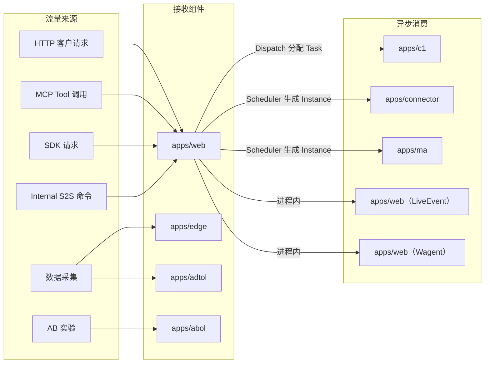
```mermaid
flowchart LR
    subgraph Entry["流量来源"]
        Http["HTTP 客户请求"]
        Mcp["MCP Tool 调用"]
        Sdk["SDK 请求"]
        Internal["Internal S2S 命令"]
        Collect["数据采集"]
        AB["AB 实验"]
    end

    subgraph Apps["接收组件"]
        Web["apps/web"]
        Edge["apps/edge"]
        Adtol["apps/adtol"]
        Abol["apps/abol"]
    end

    subgraph Async["异步消费"]
        C1["apps/c1"]
        Connector["apps/connector"]
        MA["apps/ma"]
        LiveEvent["apps/web（LiveEvent）"]
        Wagent["apps/web（Wagent）"]
    end

    Http --> Web
    Mcp --> Web
    Sdk --> Web
    Internal --> Web
    Collect --> Edge
    Collect --> Adtol
    AB --> Abol

    Web -->|Scheduler 生成 Instance| Connector
    Web -->|Scheduler 生成 Instance| MA
    Web -->|Dispatch 分配 Task| C1
    Web -->|进程内| LiveEvent
    Web -->|进程内| Wagent
```

**说明**

- **同步入口**（HTTP/MCP/SDK/Internal → apps/web）：经过 `ProjectFilter`/`authorizeProjectContext` PM 门禁，每请求检查项目是否可用。
- **数据入口**（Edge/ADTOL）：经过 `Token2ProjectID` PM 门禁，路由到目标项目后写入 Kafka。
- **实验入口**（ABOL）：经过 Router PM 门禁后，由 Abol core 处理。
- **异步消费**（Connector/MA）：由 Scheduler Master 生成 Instance，Worker 领取时检查 PM。
- **进程内消费**（C1、LiveEvent、Wagent）：由 Dispatch topology、PM Hook 或 heartbeat 控制。

### 1.2 PM Hook 传播

OP 发起 Delete/Restore 后，ProjectService 通过 PM 向持有项目运行资源的模块广播通知，Restore 额外更新 Global PG 状态：

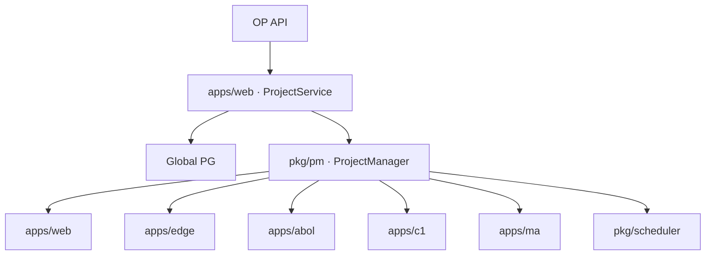
```mermaid
flowchart TD
    OP["OP API"] --> PS["apps/web · ProjectService"]
    PS --> PG["Global PG"]
    PS --> PM["pkg/pm · ProjectManager"]

    PM --> Web["apps/web"]
    PM --> Edge["apps/edge"]
    PM --> Abol["apps/abol"]
    PM --> C1["apps/c1"]
    PM --> MA["apps/ma"]
    PM --> Sched["pkg/scheduler"]
```

各模块收到 Hook 后的具体动作在对应组件章节中展开。未出现在图中的组件（ADTOL、Simulator）不持有项目运行资源，不需要 Hook。

同一进程内 Hook 同步触发，跨进程 Hook 通过 PM Pub/Sub + 快照对账传播。不等待远端 ACK。

### 1.3 Purge：同步清理流程

Purge 与 Delete/Restore 不同，它是一个同步、按固定顺序执行的清理过程：

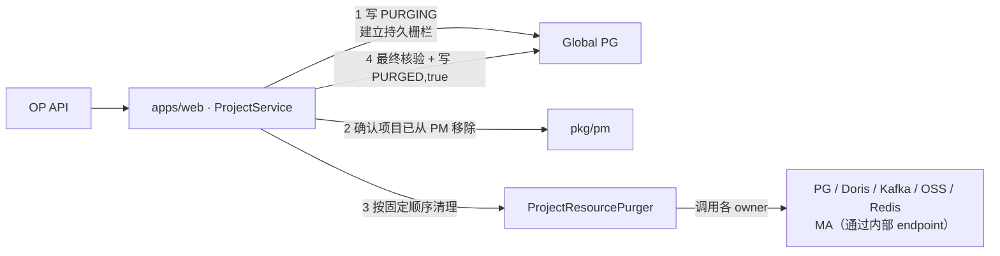
```mermaid
flowchart LR
    OP["OP API"] --> PS["apps/web · ProjectService"]
    PS -->|"1 写 PURGING<br/>建立持久栅栏"| PG["Global PG"]
    PS -->|"2 确认项目已从 PM 移除"| PM["pkg/pm"]
    PS -->|"3 按固定顺序清理"| Purger["ProjectResourcePurger"]
    Purger -->|"调用各 owner"| Owners["PG / Doris / Kafka / OSS / Redis<br/>MA（通过内部 endpoint）"]
    PS -->|"4 最终核验 + 写 PURGED,true"| PG
```

完整 11 步顺序见[第 11 章](#11-purge-固定顺序与资源-owner)。Purge 过程中 `PURGING` 状态禁止 Restore，失败后只能从头重试 Purge。

### 1.4 四层收敛机制

| # | 机制 | 覆盖范围 | 延迟 |
| --- | --- | --- | --- |
| 1 | 请求门禁 | 每请求查 PM：Edge、ADTOL、ABOL、Web API、MCP、Internal S2S | 毫秒级 |
| 2 | 任务门禁 | Scheduler Master 生成 Instance 前查 PM、Worker 领取时查 PM | 秒级 |
| 3 | PM Delete Hook | 持有项目级运行资源的模块：QE、LiveEvent、Asset、Wagent、Edge TrackService、Abol core、C1、Dispatch、MA、Connector | 毫秒级（同进程）、秒级（跨进程） |
| 4 | heartbeat 取消 | 运行中 Scheduler handler 在定期 heartbeat 中发现项目不存在 → 取消 context、释放 lease | 秒~分钟级 |

### 1.5 组件索引

| 组件 | 角色 | 章节 |
| --- | --- | --- |
| `apps/web` | 控制面发起者 + Web 业务 + QE/LiveEvent/Wagent/Asset 运行模块 | [第 2 章](#2-appsweb) |
| `apps/edge` | 数据采集入口 | [第 3 章](#3-appsedge) |
| `apps/adtol` | 数据回传入口 | [第 4 章](#4-appstadtol) |
| `apps/abol` | AB 实验判定 | [第 5 章](#5-appsabol) |
| `apps/c1` + `pkg/dispatch` | 数据落盘消费 | [第 6 章](#6-appsc1--pkgdispatch) |
| `apps/connector` | 外部数据管道 | [第 7 章](#7-appsconnector) |
| `apps/ma` | 营销自动化 | [第 8 章](#8-appsma) |
| `apps/simulator` | 模拟/测试，无生产资源 | [第 9 章](#9-appssimulator) |
| 共享基础设施 | PM、Scheduler、Dispatch、存储 client | [第 10 章](#10-共享基础设施) |

---

## 2. apps/web

`apps/web` 是生命周期操作的发起者，也是模块最多的 app。按职能分为四组：

- **项目主体**：生命周期操作（2.1.1）、项目存储资源（2.1.2）
- **请求入口与门禁**：Web API、MCP、Internal S2S（2.2）
- **运行子模块**：QE Catalog（2.3.1）、LiveEvent（2.3.2）、Wagent（2.3.3）
- **共享缓存**：权限、Token cache（2.4）

### 2.1 项目主体

项目主体涵盖项目本身的生命周期操作和它拥有的存储资源。ProjectService 是生命周期动作的入口，PM + Global PG 承载状态；项目存储资源在创建时自动预配，Purge 时统一清理。

#### 2.1.1 生命周期操作

**定位**

ProjectService 是生命周期动作的入口和执行者。OP API → Customer Ops → ProjectService → PM + Global PG。它不持有项目级运行资源，所有副作用通过 PM 传播。

**流量入口与任务**

- **OP API 命令**（Delete/Restore/Purge）→ ProjectService 接收 → 操作 Global PG 四态 + PM 可用集合和运行时快照
- ProjectService 本身不接收项目数据请求，不涉及门禁


**资源台账**

| 存储位置 | 资源 | 类型 | 内容与作用 | 代码文件 | 搜索关键词 |
| --- | --- | --- | --- | --- | --- |
| Global PG | project/org 主记录 | 持久资源 | 记录项目的归属组织、配置和生命周期状态，作为生命周期动作的权威判定源 | `dao/global/project.go`、`dao/global/organization.go` | ProjectDao / OrganizationDao |
| PM Redis | 可用项目集合索引 `sys:{pm}:projects` | 运行资源 | 维护可用项目集合供各组件门禁枚举，决定请求能否进入项目 | `pkg/pm/project_manager.go` | KeySysPMProjects |
| PM Redis | 项目运行时快照 `sys:{pm}:info:<pid>` | 运行资源 | 存储项目运行时配置快照，供组件在无项目存储访问时获取必要信息 | `pkg/pm/project_manager.go` | KeySysPMInfoPrefix |

**生命周期变化图**
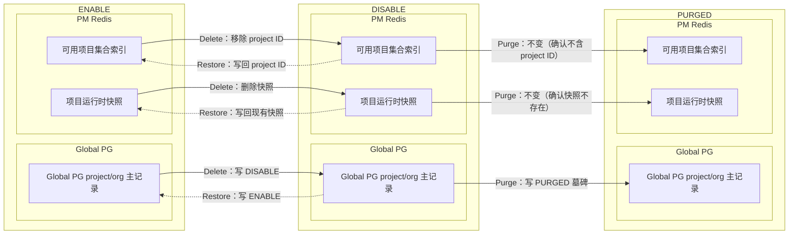
```mermaid
flowchart LR
    subgraph enable["ENABLE"]
        subgraph e_pg["Global PG"]
            EGlobal["Global PG project/org 主记录"]
        end
        subgraph e_pm["PM Redis"]
            EIndex["可用项目集合索引"]
            EInfo["项目运行时快照"]
        end
    end
    subgraph disable["DISABLE"]
        subgraph d_pg["Global PG"]
            DGlobal["Global PG project/org 主记录"]
        end
        subgraph d_pm["PM Redis"]
            DIndex["可用项目集合索引"]
            DInfo["项目运行时快照"]
        end
    end
    subgraph purged["PURGED"]
        subgraph p_pg["Global PG"]
            PGlobal["Global PG project/org 主记录"]
        end
        subgraph p_pm["PM Redis"]
            PIndex["可用项目集合索引"]
            PInfo["项目运行时快照"]
        end
    end
    EGlobal -->|Delete：写 DISABLE| DGlobal
    EIndex -->|Delete：移除 project ID| DIndex
    EInfo -->|Delete：删除快照| DInfo
    DGlobal -.->|Restore：写 ENABLE| EGlobal
    DIndex -.->|Restore：写回 project ID| EIndex
    DInfo -.->|Restore：写回现有快照| EInfo
    DGlobal -->|Purge：写 PURGED 墓碑| PGlobal
    DIndex -->|Purge：不变（确认不含 project ID）| PIndex
    DInfo -->|Purge：不变（确认快照不存在）| PInfo
```

#### Delete 阶段

| 文件 | 改动 |
| --- | --- |
| `service/project/delete.go` | 实现 Delete：写 `DISABLE`、清理 PM 快照、拒绝新工作入口 |
| `service/project/create.go` | 创建要求父组织 `ENABLE,false`，防止已删除组织下新建项目 |
| `service/organization/organization.go` | 组织 Delete：状态转换 + 逐项目约束（子项目全部可删才执行） |
| `dao/global/project.go` | 新增 `UpdateStatusIf`、条件状态更新（`ENABLE`→`DISABLE`） |
| `dao/global/organization.go` | 增加 `status` 字段映射、四态常量 |

#### Restore 阶段

| 文件 | 改动 |
| --- | --- |
| `service/project/delete.go` | 实现 Restore：写 `ENABLE`、用已有配置调 `PM.SetInfo` 写回快照 |
| `service/organization/organization.go` | 组织 Restore：恢复 `ENABLE`，不级联子项目 |

#### Purge 阶段

| 文件 | 改动 |
| --- | --- |
| `service/project/purge.go` | 实现 Purge 主流程：`PurgeTarget` 构造、`PURGING` 转换和最终结果映射 |
| `service/project/resource_purger.go` **新增** | `ProjectResourcePurger`，按固定顺序调用各资源 owner |
| `service/project/ma_purge.go` **新增** | 用 `net/http` 调 MA 内部 endpoint |
| `service/project/project.go` | 注入 Purger；禁止整行 `Save` 覆盖生命周期状态 |
| `service/organization/organization.go` | 组织 Purge：`PURGING`/`PURGED` + 逐项目约束 |
| `dao/global/project.go` | `PURGING`/`PURGED` 状态、`GetByIDWithDeleted`、`ListLifecycleByOrg` |
| `dao/global/organization.go` | `PURGING`/`PURGED` 状态支持 |
| `dao/global/project_member.go` | 增加按 project ID 硬删除成员引用 |

#### 2.1.2 项目存储资源

**定位**

项目中立的持久资源层。由 Project 初始化时自动创建，Web/Connector/MA/Wagent 各组件持续写入和读取。

**流量入口与任务**

项目存储不是入口——它不接收外部请求，不被门禁控制。写入和读取来自各组件的内部业务逻辑（Pipeline 写入 Kafka / Doris、Scheduler 读写 Meta PG 等）。Purge 必须以正确顺序清理这些资源。

**资源台账**

| 存储位置 | 资源 | 类型 | 内容与作用 | 代码文件 | 搜索关键词 |
| --- | --- | --- | --- | --- | --- |
| Project PG | Meta `schema_<pid>` | 持久资源 | 存储事件元数据、调度信息、实验配置和 Pipeline 状态，支撑项目全部业务功能 | `pkg/dal/pgsqlx/` | schema_<pid> |
| Project PG | Data `schema_<pid>` | 持久资源 | 存储身份关系映射，支撑跨系统用户关联和去重 | `pkg/dal/pgsqlx/` | schema_<pid> |
| Doris | 项目 Database | 持久资源 | 提供项目级 OLAP 存储，支撑事件分析、用户分群和营销自动化大规模数据计算 | `pkg/dal/dorisx/` | DorisDatabase |
| Kafka | 项目 Topic + 消费组 | 持久资源 | 提供项目数据事件流通道和消费组管理，支撑数据采集、处理、落盘的全链路异步传输 | `pkg/dal/kafkax/` | KafkaTopic |
| OSS | 项目前缀 | 持久资源 | 提供项目级对象存储隔离空间，支撑数据导入导出、离线计算和定时任务的文件交换 | `pkg/dal/ossx/` | OSSPrefix |
| Global PG | member、邀请引用 | 持久资源 | 管理项目成员和待处理邀请，不属于生命周期状态，Delete 期间保留以保证 Restore 后成员关系完整 | `dao/global/project_member.go`、`dao/global/member_invite.go` | ProjectMemberDao / MemberInviteDao |

**PM 接入：** 无。项目存储是持久数据层，不受 PM 门禁控制。

**生命周期变化图**

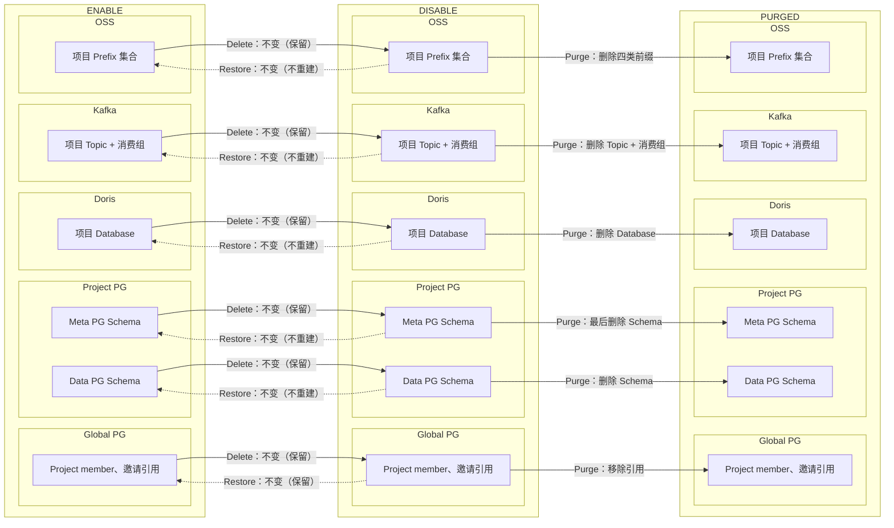
```mermaid
flowchart LR
    subgraph enable["ENABLE"]
        subgraph e_member["Global PG"]
            EMember["Project member、邀请引用"]
        end
        subgraph e_pg["Project PG"]
            EMeta["Meta PG Schema"]
            EData["Data PG Schema"]
        end
        subgraph e_doris["Doris"]
            EDoris["项目 Database"]
        end
        subgraph e_kafka["Kafka"]
            EKafka["项目 Topic + 消费组"]
        end
        subgraph e_oss["OSS"]
            EOSS["项目 Prefix 集合"]
        end
    end

    subgraph disable["DISABLE"]
        subgraph d_member["Global PG"]
            DMember["Project member、邀请引用"]
        end
        subgraph d_pg["Project PG"]
            DMeta["Meta PG Schema"]
            DData["Data PG Schema"]
        end
        subgraph d_doris["Doris"]
            DDoris["项目 Database"]
        end
        subgraph d_kafka["Kafka"]
            DKafka["项目 Topic + 消费组"]
        end
        subgraph d_oss["OSS"]
            DOSS["项目 Prefix 集合"]
        end
    end

    subgraph purged["PURGED"]
        subgraph p_member["Global PG"]
            PMember["Project member、邀请引用"]
        end
        subgraph p_pg["Project PG"]
            PMeta["Meta PG Schema"]
            PData["Data PG Schema"]
        end
        subgraph p_doris["Doris"]
            PDoris["项目 Database"]
        end
        subgraph p_kafka["Kafka"]
            PKafka["项目 Topic + 消费组"]
        end
        subgraph p_oss["OSS"]
            POSS["项目 Prefix 集合"]
        end
    end

    EMember -->|Delete：不变（保留）| DMember
    EMeta -->|Delete：不变（保留）| DMeta
    EData -->|Delete：不变（保留）| DData
    EDoris -->|Delete：不变（保留）| DDoris
    EKafka -->|Delete：不变（保留）| DKafka
    EOSS -->|Delete：不变（保留）| DOSS
    DMember -.->|Restore：不变（保留）| EMember
    DMeta -.->|Restore：不变（不重建）| EMeta
    DData -.->|Restore：不变（不重建）| EData
    DDoris -.->|Restore：不变（不重建）| EDoris
    DKafka -.->|Restore：不变（不重建）| EKafka
    DOSS -.->|Restore：不变（不重建）| EOSS
    DMember -->|Purge：移除引用| PMember
    DMeta -->|Purge：最后删除 Schema| PMeta
    DData -->|Purge：删除 Schema| PData
    DDoris -->|Purge：删除 Database| PDoris
    DKafka -->|Purge：删除 Topic + 消费组| PKafka
    DOSS -->|Purge：删除四类前缀| POSS
```


**代码改动（仅 Purge owner）**

| 清理 owner | 文件 | 具体改动 |
| --- | --- | --- |
| PG owner | 各 DAO | `DROP SCHEMA IF EXISTS <schema> CASCADE` |
| Doris owner | Doris client | `DROP DATABASE IF EXISTS <db>` |
| Kafka owner | Kafka admin | 删除 Topic + 按前缀删除 consumer group |
| OSS owner | OSS client | 删除四类 `load/backfill/events_cron/users_cron/<pid>/` 前缀 |
| Member owner | `dao/global/project_member.go` | 按 project ID 硬删除成员和邀请引用 |

> **Pipeline 业务资源**（run/backfill/load-file、Scheduler Job/Instance/Task）保存在 Meta PG 中，Delete 只拒绝新工作允许既有执行收尾，不删除数据。Purge 随 Meta Schema 删除一并清理。入口门禁说明见 [2.2 请求入口与门禁](#22-请求入口与门禁) Internal S2S 表格。

### 2.2 请求入口与门禁

**定位**

普通 Web API、MCP、Internal S2S 是请求的入口。它们不保存项目数据，只决定请求是否允许进入。

**流量入口与任务**

| 入口 | 流量来源 | 当前门禁 | Delete 行为 | Restore 行为 |
| --- | --- | --- | --- | --- |
| 普通 Web API | 客户 HTTP | `ProjectFilter` 每请求查 PM | 拒绝不可用项目 | 恢复放行 |
| MCP | MCP tool | `authorizeProjectContext` 当前只校验成员关系和 Token scope，未查 PM | 需补充 PM 门禁 | 恢复后重新授权 |
| Internal S2S 新工作 | 内部创建/启动命令 | `InternalProjectContext` 只解析 Project Header | 新工作拒绝；在途查询和结果回写允许收尾 | 恢复新工作入口 |
| Internal S2S 在途 | 既有 Pipeline/MA 执行 | 无专门门禁 | 允许只读查询和回写 | 继续正常读取 |

**流量变化图**

请求进入 Web 后按项目状态分支，展示不同路径：

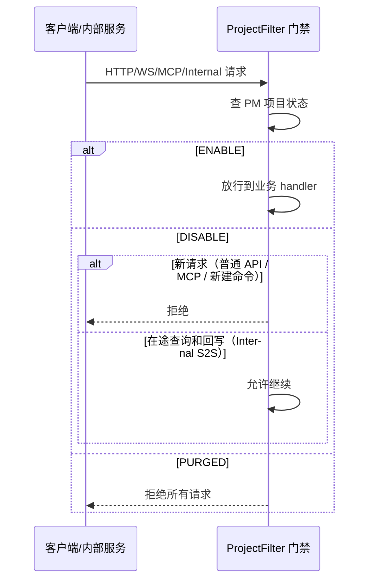
```mermaid
sequenceDiagram
    participant C as 客户端/内部服务
    participant G as ProjectFilter 门禁

    C->>G: HTTP/WS/MCP/Internal 请求
    G->>G: 查 PM 项目状态

    alt ENABLE
        G->>G: 放行到业务 handler
    else DISABLE
        alt 新请求（普通 API / MCP / 新建命令）
            G-->>C: 拒绝
        else 在途查询和回写（Internal S2S）
            G->>G: 允许继续
        end
    else PURGED
        G-->>C: 拒绝所有请求
    end
```

**代码改动**

| 文件 | 改动 |
| --- | --- |
| `pkg/ginx/middleware/project.go` | 审核全部路由；保留普通 API 的 PM 门禁，删除旧租户 lifecycle 入口；OP 生命周期明确绕过 |
| `pkg/ginx/middleware/organization.go` | 普通组织请求要求 `ENABLE,false` |
| `apps/web/mcp/tools/context.go` | `authorizeProjectContext` 在成员/scope 校验前检查 PM |
| `pkg/internalauth/middleware.go` | 继续只解析 Header，不增加全局 PM 拦截 |
| `service/pipeline/internal_metadata.go` | 新工作调 `requireInternalProjectEnabled`；在途查询/回写在 PM 缺失时读 Global 生命周期，只允许 `DISABLE,false` |
| `apps/web/ma/service/*` | materialize 等新工作入口检查 PM；结果回写同理 |

### 2.3 运行子模块

#### 2.3.1 QE Catalog

**定位**

QE Catalog 是项目的元数据查询层，提供事件/属性/Cohort/Metric 等元数据目录服务。它在 Web 进程内维护 `catalogs[projectID]` 映射和 MetaCache。

**流量入口与任务**

QE Catalog 接收两类流量：
- **Web API 查询**（经过 ProjectFilter 门禁）→ 读取 `catalogs[projectID]` 和 MetaCache 返回元数据
- **后台 refresh loop**（每 30min 定时）→ 持有 Redis refresh lock，更新 MetaCache

注意：MetaCache 是进程本地映射，项目 Delete 后不会自动过期，refresh loop 也不会停止。这是需要核心处理的问题。

**资源台账**

| 存储位置 | 资源 | 类型 | 内容与作用 | 代码文件 | 搜索关键词 |
| --- | --- | --- | --- | --- | --- |
| 进程内存 | `catalogs[projectID]` | 进程内状态 | 提供项目元数据目录查询，支撑前端展示事件/属性/Cohort/Metric 列表 | `apps/web/qe/catalog/catalog.go` | catalogs |
| 进程内存 | MetaCache | 进程内状态 | 加速元数据目录查询响应，减少对 PG 的直接读取频率 | `apps/web/qe/catalog/catalog.go` | MetaCache |
| 项目 Redis | refresh lock Key | 运行资源 | 防止多副本同时刷新元数据缓存，保证数据一致性 | `apps/web/qe/catalog/notifier.go` | KeySysCatalogRefreshLock |

**生命周期变化图**

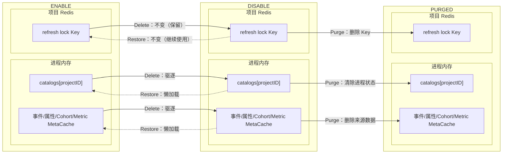
```mermaid
flowchart LR
    subgraph enable["ENABLE"]
        subgraph e_memory["进程内存"]
            ECat["catalogs[projectID]"]
            EMeta["事件/属性/Cohort/Metric MetaCache"]
        end
        subgraph e_redis["项目 Redis"]
            ELock["refresh lock Key"]
        end
    end

    subgraph disable["DISABLE"]
        subgraph d_memory["进程内存"]
            DCat["catalogs[projectID]"]
            DMeta["事件/属性/Cohort/Metric MetaCache"]
        end
        subgraph d_redis["项目 Redis"]
            DLock["refresh lock Key"]
        end
    end

    subgraph purged["PURGED"]
        subgraph p_memory["进程内存"]
            PCat["catalogs[projectID]"]
            PMeta["事件/属性/Cohort/Metric MetaCache"]
        end
        subgraph p_redis["项目 Redis"]
            PLock["refresh lock Key"]
        end
    end

    ECat -->|Delete：驱逐| DCat
    EMeta -->|Delete：驱逐| DMeta
    ELock -->|Delete：不变（保留）| DLock
    DCat -.->|Restore：懒加载| ECat
    DMeta -.->|Restore：懒加载| EMeta
    DLock -.->|Restore：不变（继续使用）| ELock
    DCat -->|Purge：清除进程状态| PCat
    DMeta -->|Purge：删除来源数据| PMeta
    DLock -->|Purge：删除 Key| PLock
```

**流量变化图（PM Hook 接入后行为）**

> 当前代码 `OnProjectDelete` 为空，refresh loop 不会自动跳过已删除项目。下图展示接入 PM Hook 后的预期行为：Delete 时驱逐 → DISABLE 下遍历不到 → 跳过。

QE Catalog 无外部请求入口。refresh loop 按 `catalogs` map 中已知项目逐个刷新：

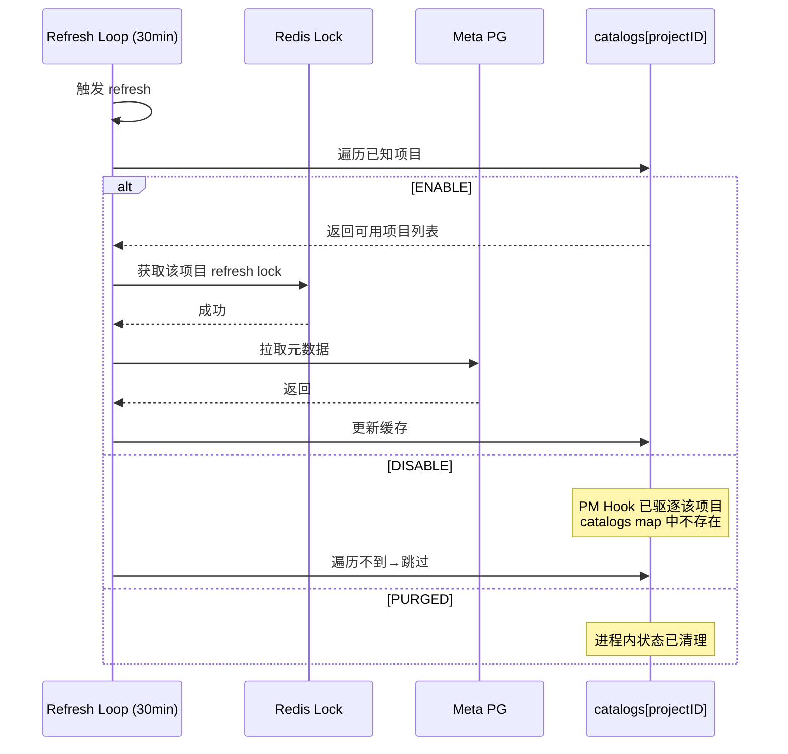
```mermaid
sequenceDiagram
    participant T as Refresh Loop (30min)
    participant L as Redis Lock
    participant P as Meta PG
    participant C as catalogs[projectID]

    T->>T: 触发 refresh
    T->>C: 遍历已知项目

    alt ENABLE
        C-->>T: 返回可用项目列表
        T->>L: 获取该项目 refresh lock
        L-->>T: 成功
        T->>P: 拉取元数据
        P-->>T: 返回
        T->>C: 更新缓存
    else DISABLE
        Note over C: PM Hook 已驱逐该项目<br/>catalogs map 中不存在
        T->>C: 遍历不到→跳过
    else PURGED
        Note over C: 进程内状态已清理
    end
```

**PM 接入现状与代码改动**

#### Delete 阶段

| 文件 | 改动 |
| --- | --- |
| `web/qe/catalog/catalog.go` | `OnProjectDelete`：从 `catalogs` map 驱逐目标项目；MetaCache 同步驱逐 |

#### Restore 阶段

| 文件 | 改动 |
| --- | --- |
| `web/qe/catalog/catalog.go` | 不主动操作——查询时通过 `Record` 懒加载重建 |

#### Purge 阶段

| 文件 | 改动 |
| --- | --- |
| `web/qe/catalog/notifier.go` | 清两类 QE refresh lock Key（不存在则跳过） |


#### 2.3.2 LiveEvent

**定位**

LiveEvent 实时推送项目事件到客户端。客户端建连后在 Web 进程内持有 WebSocket 连接和对应的 Kafka consumer。连接建立时查 PM，但已有连接不会自动关闭。

**流量入口与任务**

LiveEvent 接收两类流量：
- **WebSocket 建连**（客户端请求）→ `RegisterClient` 检查 PM，成功后创建 WebSocket 连接和对应 Kafka consumer
- **Kafka 消费**（后台持续）→ consumer 从项目 Topic 拉取事件推送 WebSocket

**当前问题**：建连后不再复查 PM，项目 Delete 后已有连接继续推送，consumer 不关闭。

**资源台账**

| 存储位置 | 资源 | 类型 | 内容与作用 | 代码文件 | 搜索关键词 |
| --- | --- | --- | --- | --- | --- |
| 进程内 | WebSocket | 运行资源 | 维持与客户端的实时连接，向客户端推送项目事件的实时更新 | `apps/web/service/liveevent/liveevent.go` | wsClients |
| 进程内 | Kafka consumer | 运行资源 | 从项目 Kafka Topic 消费事件，驱动 WebSocket 推送的内容生产 | `apps/web/service/liveevent/liveevent.go` | consumers |
| Kafka | `live-event-<pid>-*` group | 持久资源 | 记录项目级消费组偏移量，保证事件推送的可恢复和 Exactly-Once 语义 | `apps/web/service/liveevent/liveevent.go` | live-event-<pid> |

**生命周期变化图**

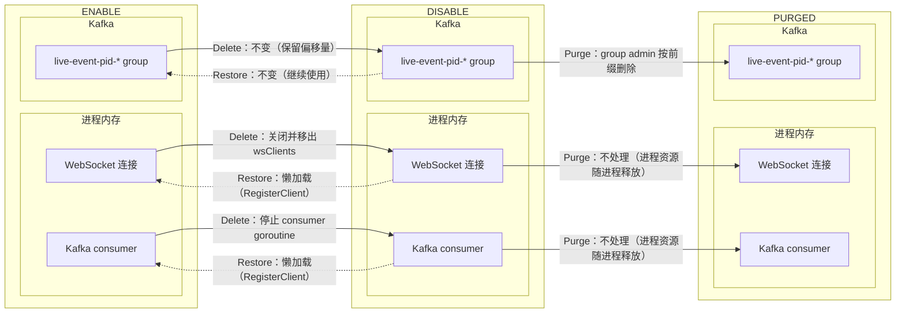
```mermaid
flowchart LR
    subgraph enable["ENABLE"]
        subgraph e_mem["进程内存"]
            EWS["WebSocket 连接"]
            EConsumer["Kafka consumer"]
        end
        subgraph e_kafka["Kafka"]
            EGroup["live-event-pid-* group"]
        end
    end

    subgraph disable["DISABLE"]
        subgraph d_mem["进程内存"]
            DWS["WebSocket 连接"]
            DConsumer["Kafka consumer"]
        end
        subgraph d_kafka["Kafka"]
            DGroup["live-event-pid-* group"]
        end
    end

    subgraph purged["PURGED"]
        subgraph p_mem["进程内存"]
            PWS["WebSocket 连接"]
            PConsumer["Kafka consumer"]
        end
        subgraph p_kafka["Kafka"]
            PGroup["live-event-pid-* group"]
        end
    end

    EWS -->|Delete：关闭并移出 wsClients| DWS
    EConsumer -->|Delete：停止 consumer goroutine| DConsumer
    EGroup -->|Delete：不变（保留偏移量）| DGroup
    DWS -.->|Restore：懒加载（RegisterClient）| EWS
    DConsumer -.->|Restore：懒加载（RegisterClient）| EConsumer
    DGroup -.->|Restore：不变（继续使用）| EGroup
    DWS -->|Purge：不处理（进程资源随进程释放）| PWS
    DConsumer -->|Purge：不处理（进程资源随进程释放）| PConsumer
    DGroup -->|Purge：group admin 按前缀删除| PGroup
```

**PM 接入现状与代码改动**

#### Delete 阶段

| 文件 | 改动 |
| --- | --- |
| `web/service/liveevent/liveevent.go` | 注册 PM Hook，新增 `CloseProject(projectID)` |
| `web/service/liveevent/liveevent.go` | `consumers[projectID].cancel()` 停止 consumer goroutine |
| `web/service/liveevent/liveevent.go` | `wsClients.Range()` 筛选目标项目客户端，关闭 WebSocket 并移出 map |

#### Restore 阶段

| 文件 | 改动 |
| --- | --- |
| `web/service/liveevent/liveevent.go` | 不处理——新连接通过 `RegisterClient` 建连时懒加载 |

#### Purge 阶段

| 文件 | 改动 |
| --- | --- |
| `web/service/liveevent/liveevent.go` | Kafka owner 按 group 前缀 `live-event-<pid>-*` 删除残留 consumer group |

#### 2.3.3 Wagent

**定位**

Wagent 是 Web 进程内的 AI 执行引擎。它管理 execution/compaction 的入队、领取和执行，同时在进程内存中维护 executor `running` map。后台 worker（claim、start、heartbeat）当前不查询 PM。

**流量入口与任务**

Wagent 接收三类流量：
- **HTTP API**（CompileConversation、StartMLCompaction）→ 间接受 ProjectFilter 控制，操作 `wagent_conversation/message` 持久层和执行 Queue
- **后台 claim worker**→ 不查 PM，从 Queue 领取 execution 到进程内 executor `running` map
- **后台 heartbeat**→ 不查 PM，续期执行 lease 和 active-lock

注意：claim/heartbeat 不查 PM，Delete 后仍可能领取新 execution。

**资源台账**

| 存储位置 | 资源 | 类型 | 内容与作用 | 代码文件 | 搜索关键词 |
| --- | --- | --- | --- | --- | --- |
| Meta PG | `wagent_conversation/message` | 持久资源 | 持久化 AI 对话和消息记录，支撑用户查看和恢复历史会话 | `apps/web/wagent/service/conversation.go` | wagent_conversation/message |
| 项目 Redis | execution/compaction Queue (Redis LIST)、DLQ、pending | 持久资源 | 管理 AI execution 的排队、调度和失败重试，保证任务不丢失 | `apps/web/wagent/service/runtime/execution.go` | execution/compaction Queue |
| 项目 Redis | lease/event/active-lock Key | 运行资源 | 协调多副本间的 execution 执行互斥，防止重复处理 | `apps/web/wagent/service/runtime/events.go` | lease/event/active-lock Key |
| 项目 Redis | quota/rate-limit Key | 运行资源 | 限制项目 AI 调用的速率和资源消耗，保护系统不被单个项目过度使用 | `apps/web/wagent/service/tokenquota/service.go`、`apps/web/wagent/service/ratelimit/ratelimit.go` | quota/rate-limit Key |
| 进程内存 | executor `running` map | 进程内状态 | 跟踪当前进程内正在执行的 AI 任务，支持取消和状态查询 | `apps/web/wagent/service/runtime/local_executor.go` | running |

**生命周期变化图**

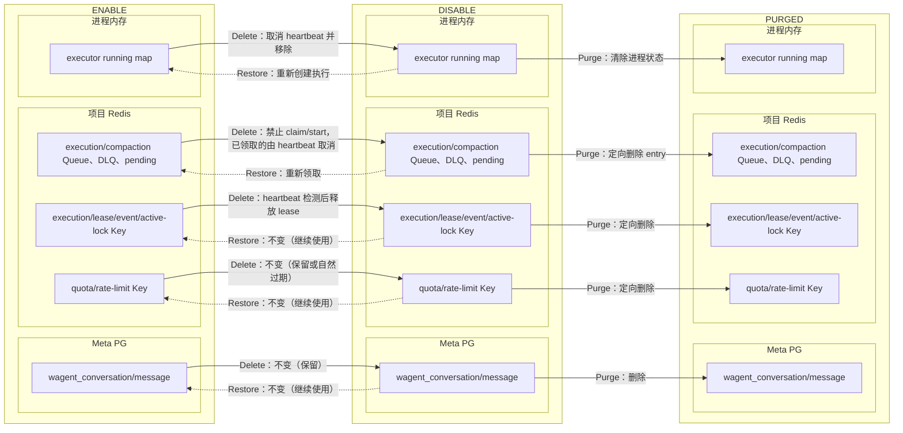
```mermaid
flowchart LR
    subgraph enable["ENABLE"]
        subgraph e_meta["Meta PG"]
            EMsg["wagent_conversation/message"]
        end
        subgraph e_redis["项目 Redis"]
            EQueue["execution/compaction Queue、DLQ、pending"]
            ELease["execution/lease/event/active-lock Key"]
            EQuota["quota/rate-limit Key"]
        end
        subgraph e_memory["进程内存"]
            ERunning["executor running map"]
        end
    end

    subgraph disable["DISABLE"]
        subgraph d_meta["Meta PG"]
            DMsg["wagent_conversation/message"]
        end
        subgraph d_redis["项目 Redis"]
            DQueue["execution/compaction Queue、DLQ、pending"]
            DLease["execution/lease/event/active-lock Key"]
            DQuota["quota/rate-limit Key"]
        end
        subgraph d_memory["进程内存"]
            DRunning["executor running map"]
        end
    end

    subgraph purged["PURGED"]
        subgraph p_meta["Meta PG"]
            PMsg["wagent_conversation/message"]
        end
        subgraph p_redis["项目 Redis"]
            PQueue["execution/compaction Queue、DLQ、pending"]
            PLease["execution/lease/event/active-lock Key"]
            PQuota["quota/rate-limit Key"]
        end
        subgraph p_memory["进程内存"]
            PRunning["executor running map"]
        end
    end

    EMsg -->|Delete：不变（保留）| DMsg
    EQueue -->|Delete：禁止 claim/start，已领取的由 heartbeat 取消| DQueue
    ELease -->|Delete：heartbeat 检测后释放 lease| DLease
    EQuota -->|Delete：不变（保留或自然过期）| DQuota
    ERunning -->|Delete：取消 heartbeat 并移除| DRunning
    DMsg -.->|Restore：不变（继续使用）| EMsg
    DQueue -.->|Restore：重新领取| EQueue
    DLease -.->|Restore：不变（继续使用）| ELease
    DQuota -.->|Restore：不变（继续使用）| EQuota
    DRunning -.->|Restore：重新创建执行| ERunning
    DMsg -->|Purge：删除| PMsg
    DQueue -->|Purge：定向删除 entry| PQueue
    DLease -->|Purge：定向删除| PLease
    DQuota -->|Purge：定向删除| PQuota
    DRunning -->|Purge：清除进程状态| PRunning
```

**流量变化图（PM Hook 及 PM 门禁接入后行为）**

> 当前代码 claim/heartbeat 不查 PM。下图展示接入 PM Hook 和 PM 检查后的预期行为：claim 前查 PM → 不存在的项目跳过不领取；heartbeat 查 PM → 不存在时 cancel context 释放 lease。

Wagent 无外部请求流量，后台 claim/heartbeat 是内部驱动。HTTP API（CompileConversation 等）经 ProjectFilter 门禁，已在 [2.2 流量变化图](#22-请求入口与门禁) 覆盖：

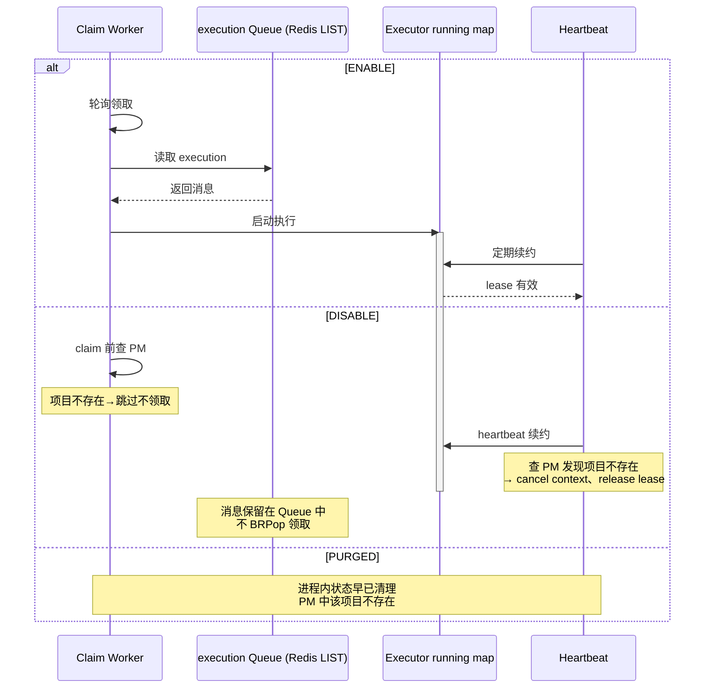
```mermaid
sequenceDiagram
    participant W as Claim Worker
    participant S as execution Queue (Redis LIST)
    participant E as Executor running map
    participant H as Heartbeat

    alt ENABLE
        W->>W: 轮询领取
        W->>S: 读取 execution
        S-->>W: 返回消息
        W->>E: 启动执行
        activate E
        H->>E: 定期续约
        E-->>H: lease 有效
    else DISABLE
        W->>W: claim 前查 PM
        Note over W: 项目不存在→跳过不领取
        H->>E: heartbeat 续约
        Note over H: 查 PM 发现项目不存在<br/>→ cancel context、release lease
        deactivate E
        Note over S: 消息保留在 Queue 中<br/>不 BRPop 领取
    else PURGED
        Note over W,H: 进程内状态早已清理<br/>PM 中该项目不存在
    end
```

**PM 接入现状与代码改动**

#### Delete 阶段

| 文件 | 改动 |
| --- | --- |
| `web/wagent/service/runtime/execution.go` | claim/start 前检查 PM，项目不存在时跳过（不 BRPop） |
| `web/wagent/service/runtime/events.go` | heartbeat 查 PM，不含项目时 cancel context、release lease |

#### Restore 阶段

| 文件 | 改动 |
| --- | --- |
| `web/wagent/service/runtime/execution.go` | 重新 BRPop 领取 Queue 消息 |

#### Purge 阶段

| 文件 | 改动 |
| --- | --- |
| `web/wagent/service/runtime/` | 清项目 Queue/DLQ + `p:<pid>:*` |
| `web/wagent/service/tokenquota/` | 清 quota/rate-limit Key |
| `web/wagent/service/ratelimit/` | 清 quota/rate-limit Key |


### 2.4 共享缓存

**定位**

项目权限、资产权限、Project→Org 和 Account API Token scope 的被动 TTL cache。不驱动执行，只加速查询。

**流量入口与任务**

这些 cache 由普通 API 请求触发填充，受 ProjectFilter 间接控制。项目 Delete 后 cache 保留但不会有新查询写入——请求已在门禁拒绝。

**代码改动**

| 文件 | 改动 |
| --- | --- |
| `service/permission/cache.go` | Delete/Restore 不清除；Purge 按固定 namespace 清目标 project key |
| `service/asset/permission/cache.go` | 同上 |
| `service/account/apitoken/service.go` | 让现有 cache 删除返回错误；Global 事务前严格驱逐、提交后 best-effort 重复驱逐 |

> 不新增 PM Hook——TTL cache 不会自行驱动新工作，不需要主动收敛。

---

## 3. apps/edge

### 定位

Edge 是数据采集入口。

### 流量入口与任务

**现状流程：** 收到 HTTP 请求后解析 Token，查 PM `Token2ProjectID` 路由到目标项目。进程内维护 `token2id`、`pipelineVersion`、`internalSecrets` 三个内存映射加速后续请求。

**现状问题：** `OnProjectDelete` 已注册但为空——项目 Delete 后三个缓存不驱逐。虽然 PM 门禁已拦住新请求，但已删除项目的路由信息仍残留在 Edge 进程内存中，不能彻底释放。

### 资源台账

| 存储位置 | 资源 | 类型 | 内容与作用 | 代码文件 | 搜索关键词 |
| --- | --- | --- | --- | --- | --- |
| 进程内存 | `token2id`、`pipelineVersion`、`internalSecrets` | 进程内状态 | 加速数据采集请求的 Token 解析、Pipeline 路由和 Secret 校验，降低请求延迟 | `apps/edge/service.go` | token2id |
| Kafka | producer | 持久资源 | 将采集到的数据写入 Kafka，实现数据从入口到处理系统的异步传输 | `apps/edge/service.go` | KafkaProducer |

### 生命周期变化图

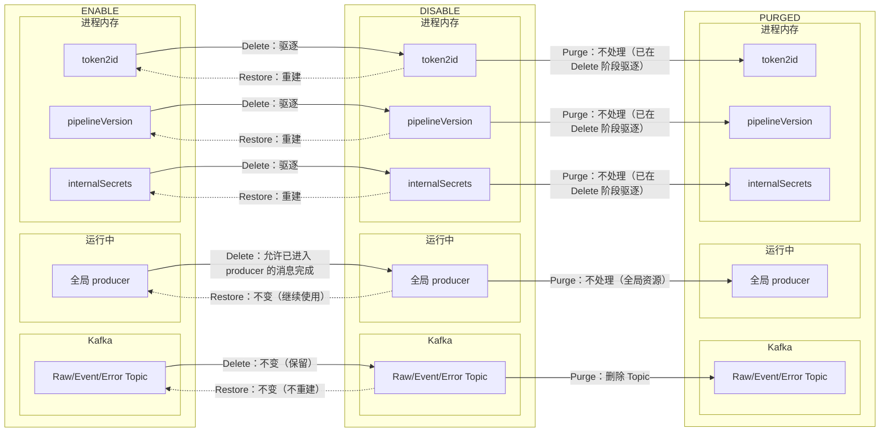
```mermaid
flowchart LR
    subgraph enable["ENABLE"]
        subgraph e_kafka["Kafka"]
            ETopic["Raw/Event/Error Topic"]
        end
        subgraph e_runtime["运行中"]
            EProducer["全局 producer"]
        end
        subgraph e_memory["进程内存"]
            EToken["token2id"]
            EPipeline["pipelineVersion"]
            ESecrets["internalSecrets"]
        end
    end

    subgraph disable["DISABLE"]
        subgraph d_kafka["Kafka"]
            DTopic["Raw/Event/Error Topic"]
        end
        subgraph d_runtime["运行中"]
            DProducer["全局 producer"]
        end
        subgraph d_memory["进程内存"]
            DToken["token2id"]
            DPipeline["pipelineVersion"]
            DSecrets["internalSecrets"]
        end
    end

    subgraph purged["PURGED"]
        subgraph p_kafka["Kafka"]
            PTopic["Raw/Event/Error Topic"]
        end
        subgraph p_runtime["运行中"]
            PProducer["全局 producer"]
        end
        subgraph p_memory["进程内存"]
            PToken["token2id"]
            PPipeline["pipelineVersion"]
            PSecrets["internalSecrets"]
        end
    end

    ETopic -->|Delete：不变（保留）| DTopic
    EProducer -->|Delete：允许已进入 producer 的消息完成| DProducer
    EToken -->|Delete：驱逐| DToken
    EPipeline -->|Delete：驱逐| DPipeline
    ESecrets -->|Delete：驱逐| DSecrets
    DTopic -.->|Restore：不变（不重建）| ETopic
    DProducer -.->|Restore：不变（继续使用）| EProducer
    DToken -.->|Restore：重建| EToken
    DPipeline -.->|Restore：重建| EPipeline
    DSecrets -.->|Restore：重建| ESecrets
    DTopic -->|Purge：删除 Topic| PTopic
    DProducer -->|Purge：不处理（全局资源）| PProducer
    DToken -->|Purge：不处理（已在 Delete 阶段驱逐）| PToken
    DPipeline -->|Purge：不处理（已在 Delete 阶段驱逐）| PPipeline
    DSecrets -->|Purge：不处理（已在 Delete 阶段驱逐）| PSecrets
```

### 流量变化图

请求进入后按项目状态分支，展示不同路径和资源交互：

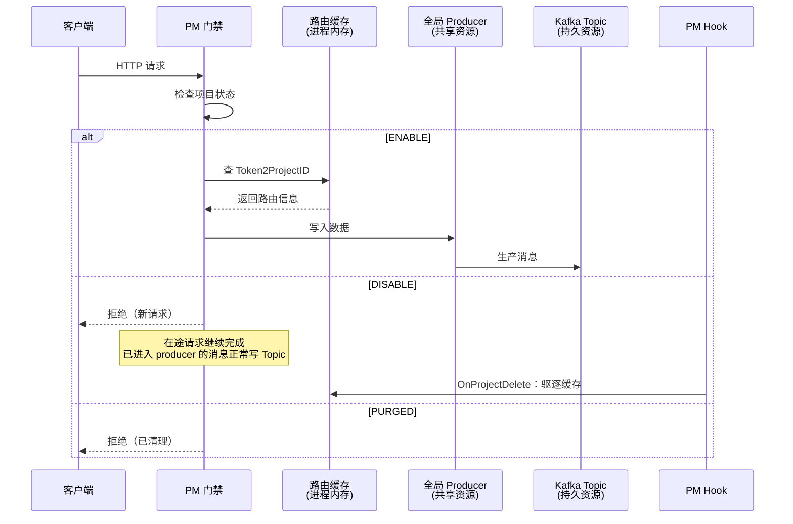
```mermaid
sequenceDiagram
    participant C as 客户端
    participant G as PM 门禁
    participant R as 路由缓存<br/>(进程内存)
    participant P as 全局 Producer<br/>(共享资源)
    participant T as Kafka Topic<br/>(持久资源)
    participant H as PM Hook

    C->>G: HTTP 请求
    G->>G: 检查项目状态

    alt ENABLE
        G->>R: 查 Token2ProjectID
        R-->>G: 返回路由信息
        G->>P: 写入数据
        P->>T: 生产消息
    else DISABLE
        G-->>C: 拒绝（新请求）
        Note over G: 在途请求继续完成<br/>已进入 producer 的消息正常写 Topic
        H->>R: OnProjectDelete：驱逐缓存
    else PURGED
        G-->>C: 拒绝（已清理）
    end
```

### PM 接入现状与代码改动

#### Delete 阶段

| 文件 | 改动 |
| --- | --- |
| `edge/service.go` | 补全 `OnProjectDelete`：从 `token2id`、`pipelineVersion`、`internalSecrets` map 驱逐目标项目条目 |

#### Restore 阶段

| 文件 | 改动 |
| --- | --- |
| `edge/service.go` | `OnProjectUpdate` 重建路由缓存 |

#### Purge 阶段

| 文件 | 改动 |
| --- | --- |
| `edge/service.go` | 不处理（Kafka producer 跨项目共享，不归属项目生命周期） |


---


## 4. apps/adtol

### 定位

ADTOL 是数据回传入口。

### 流量入口与任务

收到 HTTP 请求后经 Router 查询 PM Token，将数据写入 Kafka。无项目级内存映射或运行资源。

### 资源台账

ADTOL 不拥有项目持久资源、运行资源或进程内状态。只需继续依赖 PM 入口门禁。

### 生命周期变化图

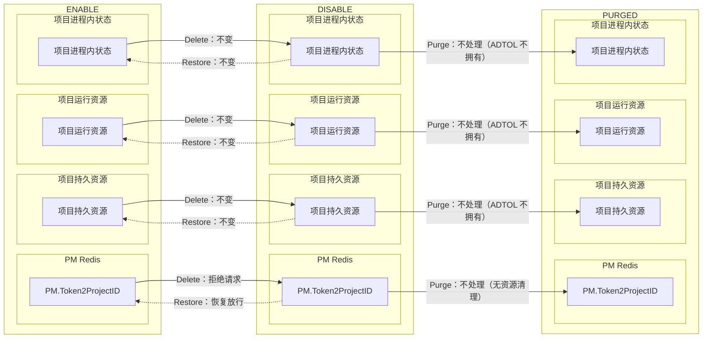
```mermaid
flowchart LR
    subgraph enable["ENABLE"]
        subgraph e_pm["PM Redis"]
            EToken["PM.Token2ProjectID"]
        end
        subgraph e_persistent["项目持久资源"]
            EPersistent["项目持久资源"]
        end
        subgraph e_runtime["项目运行资源"]
            ERuntime["项目运行资源"]
        end
        subgraph e_memory["项目进程内状态"]
            EMemory["项目进程内状态"]
        end
    end

    subgraph disable["DISABLE"]
        subgraph d_pm["PM Redis"]
            DToken["PM.Token2ProjectID"]
        end
        subgraph d_persistent["项目持久资源"]
            DPersistent["项目持久资源"]
        end
        subgraph d_runtime["项目运行资源"]
            DRuntime["项目运行资源"]
        end
        subgraph d_memory["项目进程内状态"]
            DMemory["项目进程内状态"]
        end
    end

    subgraph purged["PURGED"]
        subgraph p_pm["PM Redis"]
            PToken["PM.Token2ProjectID"]
        end
        subgraph p_persistent["项目持久资源"]
            PPersistent["项目持久资源"]
        end
        subgraph p_runtime["项目运行资源"]
            PRuntime["项目运行资源"]
        end
        subgraph p_memory["项目进程内状态"]
            PMemory["项目进程内状态"]
        end
    end

    EToken -->|Delete：拒绝请求| DToken
    EPersistent -->|Delete：不变| DPersistent
    ERuntime -->|Delete：不变| DRuntime
    EMemory -->|Delete：不变| DMemory
    DToken -.->|Restore：恢复放行| EToken
    DPersistent -.->|Restore：不变| EPersistent
    DRuntime -.->|Restore：不变| ERuntime
    DMemory -.->|Restore：不变| EMemory
    DToken -->|Purge：不处理（无资源清理）| PToken
    DPersistent -->|Purge：不处理（ADTOL 不拥有）| PPersistent
    DRuntime -->|Purge：不处理（ADTOL 不拥有）| PRuntime
    DMemory -->|Purge：不处理（ADTOL 不拥有）| PMemory
```

### 流量变化图

请求经 Router 查 PM Token 后按项目状态分支：

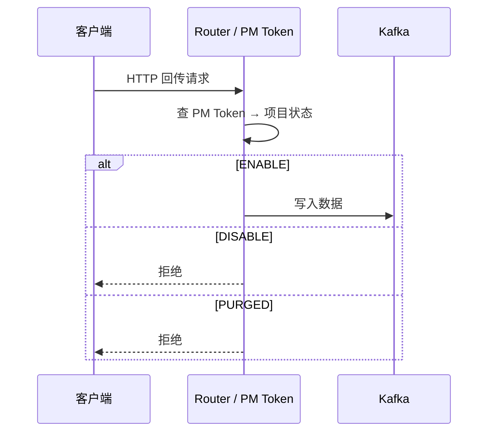
```mermaid
sequenceDiagram
    participant C as 客户端
    participant R as Router / PM Token
    participant K as Kafka

    C->>R: HTTP 回传请求
    R->>R: 查 PM Token → 项目状态

    alt ENABLE
        R->>K: 写入数据
    else DISABLE
        R-->>C: 拒绝
    else PURGED
        R-->>C: 拒绝
    end
```

### PM 接入现状与代码改动

#### Delete 阶段

| 文件 | 改动 |
| --- | --- |
| — | 无项目级资源，无需接入 |

#### Restore 阶段

| 文件 | 改动 |
| --- | --- |
| — | 无项目级资源，无需处理 |

#### Purge 阶段

| 文件 | 改动 |
| --- | --- |
| — | 无项目级资源，无需清理 |


---


## 5. apps/abol

### 定位

ABOL 是 AB 实验判定入口。

### 流量入口与任务

Router 每请求查 PM，Abol core 维护 `abCore[projectID]` 进程内查找表和 metadata loop。已注册 PM `ProjectInfoHooker` 且实现有效。

### 资源台账

| 存储位置 | 资源 | 类型 | 内容与作用 | 代码文件 | 搜索关键词 |
| --- | --- | --- | --- | --- | --- |
| Meta PG | AB 配置 | 持久资源 | 存储项目的 AB 实验定义和参数配置，支撑实验判定和流量分配 | `apps/abol/service/internal_meta_loader.go` | ABConfig |
| 项目 Redis | target cache | 运行资源 | 缓存 AB 实验目标查找结果，加速实验判定决策 | `apps/abol/service/abol.go` | targetCache |
| 进程内 | `abCore[projectID]` | 进程内状态 | 提供进程内 AB 实验核心查找，快速定位项目级实验配置 | `apps/abol/service/abol.go` | abCore |
| 进程内 | metadata loop | 运行资源 | 定期同步项目 AB 实验元数据，保证实验配置始终最新 | `apps/abol/service/internal_meta_loader.go` | core.Start |

### 生命周期变化图

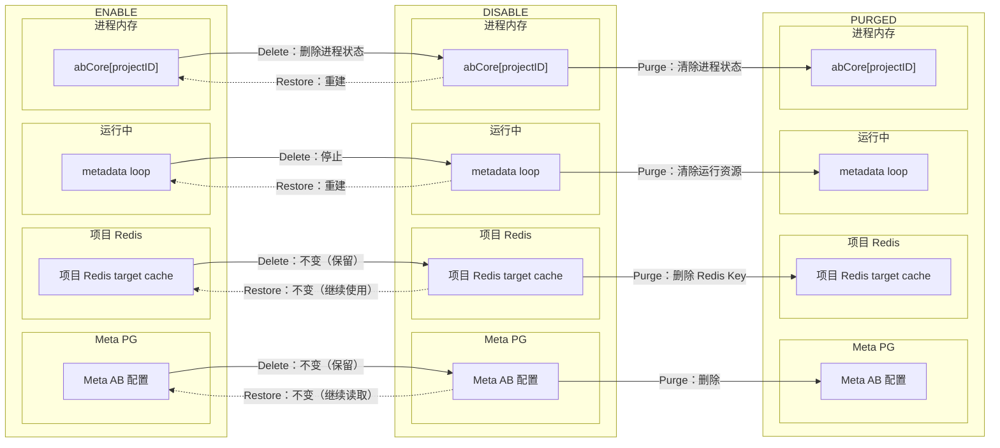
```mermaid
flowchart LR
    subgraph enable["ENABLE"]
        subgraph e_meta["Meta PG"]
            EConfig["Meta AB 配置"]
        end
        subgraph e_redis["项目 Redis"]
            ETarget["项目 Redis target cache"]
        end
        subgraph e_runtime["运行中"]
            ELoop["metadata loop"]
        end
        subgraph e_memory["进程内存"]
            ECore["abCore[projectID]"]
        end
    end

    subgraph disable["DISABLE"]
        subgraph d_meta["Meta PG"]
            DConfig["Meta AB 配置"]
        end
        subgraph d_redis["项目 Redis"]
            DTarget["项目 Redis target cache"]
        end
        subgraph d_runtime["运行中"]
            DLoop["metadata loop"]
        end
        subgraph d_memory["进程内存"]
            DCore["abCore[projectID]"]
        end
    end

    subgraph purged["PURGED"]
        subgraph p_meta["Meta PG"]
            PConfig["Meta AB 配置"]
        end
        subgraph p_redis["项目 Redis"]
            PTarget["项目 Redis target cache"]
        end
        subgraph p_runtime["运行中"]
            PLoop["metadata loop"]
        end
        subgraph p_memory["进程内存"]
            PCore["abCore[projectID]"]
        end
    end

    EConfig -->|Delete：不变（保留）| DConfig
    ETarget -->|Delete：不变（保留）| DTarget
    ELoop -->|Delete：停止| DLoop
    ECore -->|Delete：删除进程状态| DCore
    DConfig -.->|Restore：不变（继续读取）| EConfig
    DTarget -.->|Restore：不变（继续使用）| ETarget
    DLoop -.->|Restore：重建| ELoop
    DCore -.->|Restore：重建| ECore
    DConfig -->|Purge：删除| PConfig
    DTarget -->|Purge：删除 Redis Key| PTarget
    DLoop -->|Purge：清除运行资源| PLoop
    DCore -->|Purge：清除进程状态| PCore
```

### PM 接入现状与代码改动

#### Delete 阶段

| 文件 | 改动 |
| --- | --- |
| `abol/service/abol.go` | 保持现有 `OnProjectDelete`：停止 metadata loop、删除 `abCore[projectID]`；补回归测试 |

#### Restore 阶段

| 文件 | 改动 |
| --- | --- |
| `abol/service/abol.go` | 保持现有 `OnProjectUpdate`：重建 abCore、恢复 metadata loop；补回归测试 |

#### Purge 阶段

| 文件 | 改动 |
| --- | --- |
| `service/project/resource_purger.go` | Purger 步骤：删 Meta PG 中该项目的 AB 配置（如 AB 配置存于项目自身 schema 则 PG owner 步骤已覆盖）+ 删共享 Redis target cache Key |


---
## 6. apps/c1 + pkg/dispatch

### 定位

C1 是数据落盘消费者。

### 流量入口与任务

**现状流程：** 数据路径——Kafka Topic → C1 consumer/extractor → Processor → KafkaLoader（写入 K2 Topic）→ 下游消费 → Doris。控制路径——Dispatch Node 维护 topology，按 topology 分配 task map 到 consumer，TaskManager 管理 per-project ITasker。

**现状问题：**

- `OnProjectDelete` 只删 Redis counts，未触发 topology 重写——已删除项目的 ITasker 持续运行
- C1 metadata/quota 进程内映射无 owner Hook——项目 Delete 后仍存
- **Topic 防复活缺失：** Kafka producer 当前允许自动建 Topic，旧 Archive 删 Topic 后 producer 可能在下次写入时自动重建——等于删了又回来

### 资源台账

| 存储位置 | 资源 | 类型 | 内容与作用 | 代码文件 | 搜索关键词 |
| --- | --- | --- | --- | --- | --- |
| Redis（Dispatch） | task map `sys:{dispatch}:task:*` | 运行资源 | 记录项目在 Dispatch 中的任务分配状态，支撑 C1 消费者的数据落盘调度 | `pkg/dispatch/rdb.go` | KeySysDispatchTaskPrefix |
| 进程内存 | C1 metadata/quota 映射 | 进程内状态 | 缓存项目元数据和配额信息，加速 C1 消费过程中的元数据查询 | `apps/c1/metadata/metadata.go` | GetEventPropDefineStore |
| 进程内存 | Dispatch per-project ITasker | 运行资源 | 管理每个项目的 task 生命周期，保证数据落盘按项目隔离和有序执行 | `pkg/dispatch/dispatcher.go` | ITasker |
| Kafka | consumer/loader | 运行资源 | 从 Kafka 消费项目数据，经 Processor 处理后由 KafkaLoader 写入 K2 Topic | `apps/c1/` | KafkaConsumer / K2Message |
| Kafka | C1 extractor group | 持久资源 | 记录项目消费位点，支撑断点续传和 Exactly-Once 语义 | `apps/c1/` | c1-extractor- |
| 进程内存 | DDL mutex | 进程内状态 | 协调多副本间的 DDL 互斥，防止 Doris Schema 并发冲突 | `pkg/dal/dorisx/ddl.go` | GetDDLLock |

### 生命周期变化图

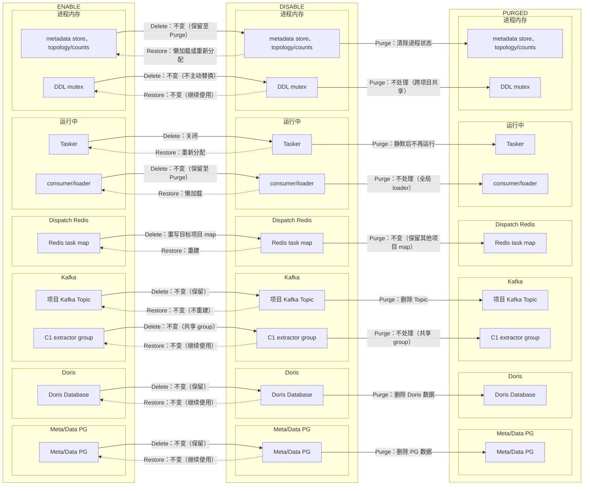
```mermaid
flowchart LR
    subgraph enable["ENABLE"]
        subgraph e_pg["Meta/Data PG"]
            EPG["Meta/Data PG"]
        end
        subgraph e_doris["Doris"]
            EDoris["Doris Database"]
        end
        subgraph e_kafka["Kafka"]
            ETopic["项目 Kafka Topic"]
            EGroup["C1 extractor group"]
        end
        subgraph e_redis["Dispatch Redis"]
            EMap["Redis task map"]
        end
        subgraph e_runtime["运行中"]
            ETasker["Tasker"]
            ELoader["consumer/loader"]
        end
        subgraph e_memory["进程内存"]
            EMeta["metadata store、topology/counts"]
            EMutex["DDL mutex"]
        end
    end

    subgraph disable["DISABLE"]
        subgraph d_pg["Meta/Data PG"]
            DPG["Meta/Data PG"]
        end
        subgraph d_doris["Doris"]
            DDoris["Doris Database"]
        end
        subgraph d_kafka["Kafka"]
            DTopic["项目 Kafka Topic"]
            DGroup["C1 extractor group"]
        end
        subgraph d_redis["Dispatch Redis"]
            DMap["Redis task map"]
        end
        subgraph d_runtime["运行中"]
            DTasker["Tasker"]
            DLoader["consumer/loader"]
        end
        subgraph d_memory["进程内存"]
            DMeta["metadata store、topology/counts"]
            DMutex["DDL mutex"]
        end
    end

    subgraph purged["PURGED"]
        subgraph p_pg["Meta/Data PG"]
            PPG["Meta/Data PG"]
        end
        subgraph p_doris["Doris"]
            PDoris["Doris Database"]
        end
        subgraph p_kafka["Kafka"]
            PTopic["项目 Kafka Topic"]
            PGroup["C1 extractor group"]
        end
        subgraph p_redis["Dispatch Redis"]
            PMap["Redis task map"]
        end
        subgraph p_runtime["运行中"]
            PTasker["Tasker"]
            PLoader["consumer/loader"]
        end
        subgraph p_memory["进程内存"]
            PMeta["metadata store、topology/counts"]
            PMutex["DDL mutex"]
        end
    end

    EPG -->|Delete：不变（保留）| DPG
    EDoris -->|Delete：不变（保留）| DDoris
    ETopic -->|Delete：不变（保留）| DTopic
    EGroup -->|Delete：不变（共享 group）| DGroup
    EMap -->|Delete：重写目标项目 map| DMap
    ETasker -->|Delete：关闭| DTasker
    ELoader -->|Delete：不变（保留至 Purge）| DLoader
    EMeta -->|Delete：不变（保留至 Purge）| DMeta
    EMutex -->|Delete：不变（不主动替换）| DMutex
    DPG -.->|Restore：不变（继续使用）| EPG
    DDoris -.->|Restore：不变（继续使用）| EDoris
    DTopic -.->|Restore：不变（不重建）| ETopic
    DGroup -.->|Restore：不变（继续使用）| EGroup
    DMap -.->|Restore：重建| EMap
    DTasker -.->|Restore：重新分配| ETasker
    DLoader -.->|Restore：懒加载| ELoader
    DMeta -.->|Restore：懒加载或重新分配| EMeta
    DMutex -.->|Restore：不变（继续使用）| EMutex
    DPG -->|Purge：删除 PG 数据| PPG
    DDoris -->|Purge：删除 Doris 数据| PDoris
    DTopic -->|Purge：删除 Topic| PTopic
    DGroup -->|Purge：不处理（共享 group）| PGroup
    DMap -->|Purge：不变（保留其他项目 map）| PMap
    DTasker -->|Purge：静默后不再运行| PTasker
    DLoader -->|Purge：不处理（全局 loader）| PLoader
    DMeta -->|Purge：清除进程状态| PMeta
    DMutex -->|Purge：不处理（跨项目共享）| PMutex
```

### 流量变化图

数据按项目状态分支，展示不同路径和 PM Hook 操作：

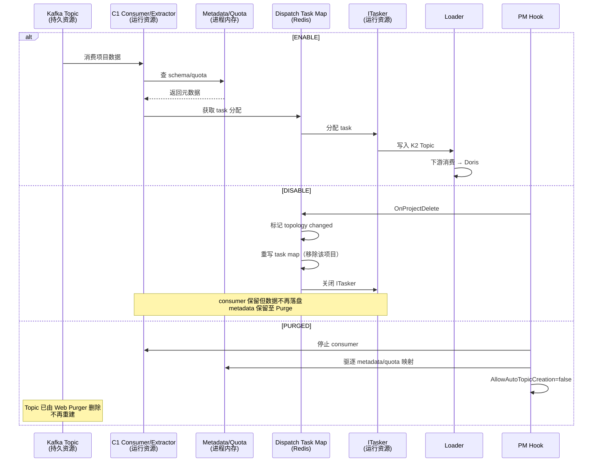
```mermaid
sequenceDiagram
    participant T as Kafka Topic<br/>(持久资源)
    participant C as C1 Consumer/Extractor<br/>(运行资源)
    participant M as Metadata/Quota<br/>(进程内存)
    participant D as Dispatch Task Map<br/>(Redis)
    participant I as ITasker<br/>(运行资源)
    participant L as Loader
    participant H as PM Hook

    alt ENABLE
        T->>C: 消费项目数据
        C->>M: 查 schema/quota
        M-->>C: 返回元数据
        C->>D: 获取 task 分配
        D->>I: 分配 task
        I->>L: 写入 K2 Topic
        L->>L: 下游消费 → Doris
    else DISABLE
        H->>D: OnProjectDelete
        D->>D: 标记 topology changed
        D->>D: 重写 task map（移除该项目）
        D->>I: 关闭 ITasker
        Note over C,I: consumer 保留但数据不再落盘<br/>metadata 保留至 Purge
    else PURGED
        H->>C: 停止 consumer
        H->>M: 驱逐 metadata/quota 映射
        H->>H: AllowAutoTopicCreation=false
        Note over T: Topic 已由 Web Purger 删除<br/>不再重建
    end
```

### PM 接入现状与代码改动

#### Delete 阶段

| 文件 | 改动 |
| --- | --- |
| `pkg/dispatch/rdb.go` | 补全 `OnProjectDelete`：标记 topology changed + 重写 task map + 关闭 ITasker |
| `c1/metadata/metadata.go` | 新增 `OnProjectDelete`：驱逐 metadata/quota 映射，停止 consumer/loader |

#### Restore 阶段

| 文件 | 改动 |
| --- | --- |
| `pkg/dispatch/dispatcher.go` | topology 重建恢复 ITasker |

#### Purge 阶段

| 文件 | 改动 |
| --- | --- |
| `service/project/resource_purger.go` | Purger 步骤：Kafka admin 删项目 C1 消费组 |

> **前置修复：** `apps/c1/loader/kafka_loader.go` 将 `AllowAutoTopicCreation` 改为 `false`（当前为 `true`），防止 Purge 删除 Topic 后 producer 自动重建。此项非 Purge 阶段操作，是启动配置变更，需优先部署。


---
## 7. apps/connector

### 定位

Connector 处理外部数据管道（AppsFlyer 等回传）。

### 流量入口与任务

HTTP Router 每请求查 PM；Pipeline runtime（handler、Kafka runner/consumer、批导上下文）由 Scheduler Worker 间接控制。

已注册 PM Hook 但 `OnProjectDelete` 为空。实际运行工作由 Scheduler 持有，不需要第二套停止逻辑。

### 资源台账

| 存储位置 | 资源 | 类型 | 内容与作用 | 代码文件 | 搜索关键词 |
| --- | --- | --- | --- | --- | --- |
| Meta PG | Pipeline 配置和运行记录 | 持久资源 | 存储数据管道的配置定义和执行状态，支撑外部数据回传的调度和执行 | `apps/connector/service/pipeline.go` | Pipeline |
| 客户外部 | 目标系统 | 持久资源 | 客户拥有的外部数据目标，Connector 仅转发数据、不管理其生命周期 | - | target |
| Kafka | runner/consumer | 运行资源 | 消费派生 Topic 数据，驱动数据管道处理和执行 | `apps/connector/service/` | KafkaConsumer |
| 进程内存 | 批导临时对象 | 进程内状态 | 存储批量导入过程中的临时上下文和中间状态 | `apps/connector/service/` | batch |

### 生命周期变化图

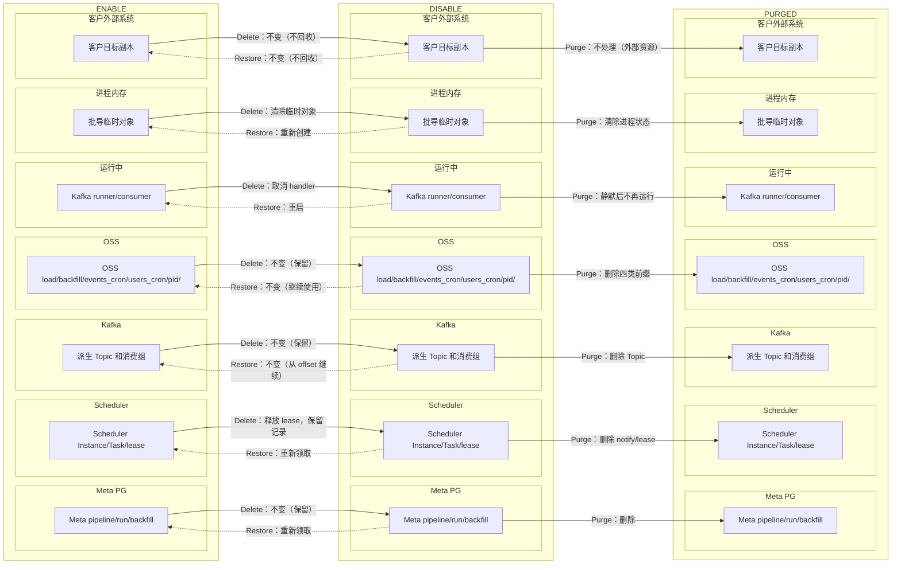
```mermaid
flowchart LR
    subgraph enable["ENABLE"]
        subgraph e_meta["Meta PG"]
            EMeta["Meta pipeline/run/backfill"]
        end
        subgraph e_scheduler["Scheduler"]
            EJob["Scheduler Instance/Task/lease"]
        end
        subgraph e_kafka["Kafka"]
            ETopic["派生 Topic 和消费组"]
        end
        subgraph e_oss["OSS"]
            EOS["OSS load/backfill/events_cron/users_cron/pid/"]
        end
        subgraph e_runtime["运行中"]
            ERunner["Kafka runner/consumer"]
        end
        subgraph e_memory["进程内存"]
            ETemp["批导临时对象"]
        end
        subgraph e_customer["客户外部系统"]
            ECustomer["客户目标副本"]
        end
    end

    subgraph disable["DISABLE"]
        subgraph d_meta["Meta PG"]
            DMeta["Meta pipeline/run/backfill"]
        end
        subgraph d_scheduler["Scheduler"]
            DJob["Scheduler Instance/Task/lease"]
        end
        subgraph d_kafka["Kafka"]
            DTopic["派生 Topic 和消费组"]
        end
        subgraph d_oss["OSS"]
            DOS["OSS load/backfill/events_cron/users_cron/pid/"]
        end
        subgraph d_runtime["运行中"]
            DRunner["Kafka runner/consumer"]
        end
        subgraph d_memory["进程内存"]
            DTemp["批导临时对象"]
        end
        subgraph d_customer["客户外部系统"]
            DCustomer["客户目标副本"]
        end
    end

    subgraph purged["PURGED"]
        subgraph p_meta["Meta PG"]
            PMeta["Meta pipeline/run/backfill"]
        end
        subgraph p_scheduler["Scheduler"]
            PJob["Scheduler Instance/Task/lease"]
        end
        subgraph p_kafka["Kafka"]
            PTopic["派生 Topic 和消费组"]
        end
        subgraph p_oss["OSS"]
            POS["OSS load/backfill/events_cron/users_cron/pid/"]
        end
        subgraph p_runtime["运行中"]
            PRunner["Kafka runner/consumer"]
        end
        subgraph p_memory["进程内存"]
            PTemp["批导临时对象"]
        end
        subgraph p_customer["客户外部系统"]
            PCustomer["客户目标副本"]
        end
    end

    EMeta -->|Delete：不变（保留）| DMeta
    EJob -->|Delete：释放 lease，保留记录| DJob
    ETopic -->|Delete：不变（保留）| DTopic
    EOS -->|Delete：不变（保留）| DOS
    ERunner -->|Delete：取消 handler| DRunner
    ETemp -->|Delete：清除临时对象| DTemp
    ECustomer -->|Delete：不变（不回收）| DCustomer
    DMeta -.->|Restore：重新领取| EMeta
    DJob -.->|Restore：重新领取| EJob
    DTopic -.->|Restore：不变（从 offset 继续）| ETopic
    DOS -.->|Restore：不变（继续使用）| EOS
    DRunner -.->|Restore：重启| ERunner
    DTemp -.->|Restore：重新创建| ETemp
    DCustomer -.->|Restore：不变（不回收）| ECustomer
    DMeta -->|Purge：删除| PMeta
    DJob -->|Purge：删除 notify/lease| PJob
    DTopic -->|Purge：删除 Topic| PTopic
    DOS -->|Purge：删除四类前缀| POS
    DRunner -->|Purge：静默后不再运行| PRunner
    DTemp -->|Purge：清除进程状态| PTemp
    DCustomer -->|Purge：不处理（外部资源）| PCustomer
```

### 流量变化图

请求经 Router 查 PM 后按项目状态分支，实际运行由 Scheduler 间接控制：

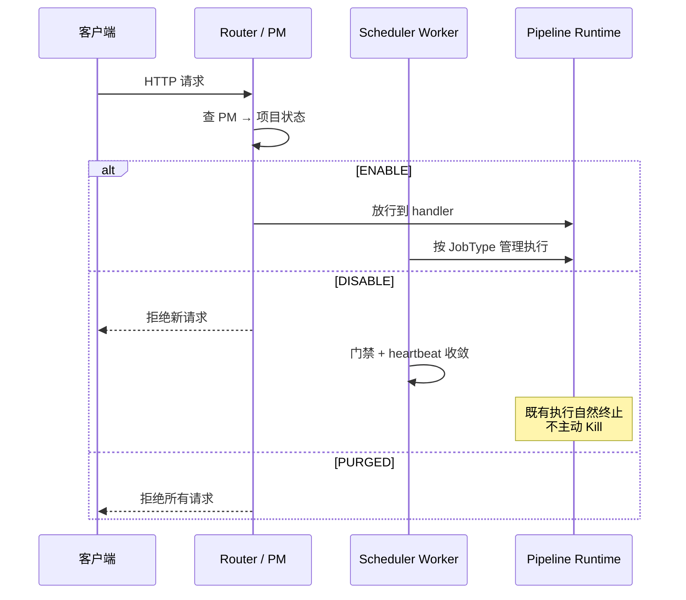
```mermaid
sequenceDiagram
    participant C as 客户端
    participant R as Router / PM
    participant S as Scheduler Worker
    participant P as Pipeline Runtime

    C->>R: HTTP 请求
    R->>R: 查 PM → 项目状态

    alt ENABLE
        R->>P: 放行到 handler
        S->>P: 按 JobType 管理执行
    else DISABLE
        R-->>C: 拒绝新请求
        S->>S: 门禁 + heartbeat 收敛
        Note over P: 既有执行自然终止<br/>不主动 Kill
    else PURGED
        R-->>C: 拒绝所有请求
    end
```

### PM 接入现状与代码改动

#### Delete 阶段

| 文件 | 改动 |
| --- | --- |
| — | 不补全 Hook——实际运行由 Scheduler 间接控制，Scheduler 门禁和 heartbeat 统一收敛 |

#### Restore 阶段

| 文件 | 改动 |
| --- | --- |
| — | Scheduler 处理，不增加第二套逻辑 |

#### Purge 阶段

| 文件 | 改动 |
| --- | --- |
| `connector/service/pipeline.go` | 确认不清理客户外部目标 |


---
## 8. apps/ma

### 定位

MA 是营销自动化引擎。

### 流量入口与任务

ConfigSync 管理 view/tracking/subscription，Runtime 持有 consumer、watcher、matcher、feedback/config/cohort cache 等项目级资源。

**MA 的独特性**：MA 使用 Web 无法访问的独享 Redis 存储项目运行时状态。Purge 不能由 Web 的 `ProjectResourcePurger` 直接清理，需要通过 MA 内部 HTTP endpoint 调用。

### 资源台账

| 存储位置 | 资源 | 类型 | 内容与作用 | 代码文件 | 搜索关键词 |
| --- | --- | --- | --- | --- | --- |
| Meta PG | campaign/audience/config 表 | 持久资源 | 存储营销活动的受众定义、触达配置和元数据，支撑 MA 执行引擎决策 | `apps/ma/service/` | campaign/audience/config |
| 进程内存 | ConfigSync view/tracking/subscription | 进程内状态 | 跟踪 MA 项目配置变更和同步状态，保证多副本间配置一致 | `apps/ma/service/configsync/sync.go` | ConfigSync |
| 进程内存 | Runtime feedback/config/cohort cache | 进程内状态 | 缓存营销自动化运行时的反馈/配置/分群数据，加速事件处理和触达决策 | `apps/ma/service/eventconsumer/consumer.go` | Runtime cache |
| 进程内存 | Runtime consumer/watcher/sweeper/materializer | 运行资源 | 消费项目事件、监听配置变化、匹配受众条件、清除过期数据，驱动营销触达的执行引擎 | `apps/ma/service/eventconsumer/consumer.go` | Runtime consumer |
| MA 独享 Redis | `ma:{p:<pid>}:*` | 持久资源 | 存储 MA 项目独享的运行状态数据（延迟队列、幂等/合并键、限速、续传位点），支撑营销自动化的独立执行 | `apps/ma/service/eventconsumer/` | ma:{p:<pid>}:* |
| 共享 Redis | `ma:{p:<pid>}:*` | 持久资源 | 存储 MA 项目在多副本间共享的运行数据（pub/sub、activation epoch），支撑跨实例协调 | `apps/ma/service/eventconsumer/` | ma:{p:<pid>}:* |
| Kafka | MA 消费组 | 持久资源 | 记录 MA 项目事件消费的偏移量，保证营销触达的可靠性和顺序执行 | `apps/ma/service/eventconsumer/` | ma-consumer-group |
| Scheduler | Instance/Task/lease | 运行资源 | 调度 MA 的定时 Campaign 执行和周期任务，由 Scheduler Worker 管理生命周期（见 [9.2](#92-pkgschduler)） | `pkg/scheduler/worker.go` | Scheduler handler |

### 生命周期变化图

```mermaid
flowchart LR
    subgraph enable["ENABLE"]
        subgraph e_meta["Meta PG"]
            EConfig["Meta campaign/audience/config"]
        end
        subgraph e_redis["共享 / 独享 Redis"]
            EKey["共享/独享 Redis project Key"]
        end
        subgraph e_kafka["Kafka"]
            EGroup["项目 group groupPrefix.pid"]
        end
        subgraph e_scheduler["Scheduler"]
            EJob["Scheduler handler"]
        end
        subgraph e_runtime["运行中"]
            ERun["event consumer、watcher、sweeper、materializer"]
        end
        subgraph e_memory["进程内存"]
            EConfigSync["ConfigSync view/tracking/subscription"]
            ECache["config/cohort/matcher/feedback cache"]
        end
    end

    subgraph disable["DISABLE"]
        subgraph d_meta["Meta PG"]
            DConfig["Meta campaign/audience/config"]
        end
        subgraph d_redis["共享 / 独享 Redis"]
            DKey["共享/独享 Redis project Key"]
        end
        subgraph d_kafka["Kafka"]
            DGroup["项目 group groupPrefix.pid"]
        end
        subgraph d_scheduler["Scheduler"]
            DJob["Scheduler handler"]
        end
        subgraph d_runtime["运行中"]
            DRun["event consumer、watcher、sweeper、materializer"]
        end
        subgraph d_memory["进程内存"]
            DConfigSync["ConfigSync view/tracking/subscription"]
            DCache["config/cohort/matcher/feedback cache"]
        end
    end

    subgraph purged["PURGED"]
        subgraph p_meta["Meta PG"]
            PConfig["Meta campaign/audience/config"]
        end
        subgraph p_redis["共享 / 独享 Redis"]
            PKey["共享/独享 Redis project Key"]
        end
        subgraph p_kafka["Kafka"]
            PGroup["项目 group groupPrefix.pid"]
        end
        subgraph p_scheduler["Scheduler"]
            PJob["Scheduler handler"]
        end
        subgraph p_runtime["运行中"]
            PRun["event consumer、watcher、sweeper、materializer"]
        end
        subgraph p_memory["进程内存"]
            PConfigSync["ConfigSync view/tracking/subscription"]
            PCache["config/cohort/matcher/feedback cache"]
        end
    end

    EConfigSync -->|Delete：纳入统一 Delete Hook| DConfigSync
    EConfig -->|Delete：拒绝新工作| DConfig
    EKey -->|Delete：不变（保留）| DKey
    EGroup -->|Delete：不变（保留）| DGroup
    EJob -->|Delete：取消 heartbeat| DJob
    ERun -->|Delete：驱逐或取消| DRun
    ECache -->|Delete：驱逐| DCache
    DConfig -.->|Restore：不变（继续读取）| EConfig
    DKey -.->|Restore：不变（继续使用）| EKey
    DGroup -.->|Restore：不变（不主动重建）| EGroup
    DJob -.->|Restore：下一次 cron/repair 恢复| EJob
    DConfigSync -.->|Restore：SetInfo 重建 subscription| EConfigSync
    DRun -.->|Restore：重新 track 或懒加载| ERun
    DCache -.->|Restore：懒加载| ECache
    DConfig -->|Purge：删除| PConfig
    DConfigSync -->|Purge：清除进程内存| PConfigSync
    DKey -->|Purge：删除两个 Redis 的 Key| PKey
    DGroup -->|Purge：删除 group| PGroup
    DJob -->|Purge：静默后不再运行| PJob
    DRun -->|Purge：清理项目运行资源| PRun
    DCache -->|Purge：清除进程状态| PCache
```

### 流量变化图

MA 无外部请求入口，内部两条执行路径 + ConfigSync 控制面同步：

```mermaid
sequenceDiagram
    participant S as Scheduler Worker
    participant C as ConfigSync
    participant K as Kafka K2 Topic
    participant E as EventConsumer
    participant D as DispatchPipeline
    participant T as TimeTrigger / Fanout

    alt ENABLE
        C->>C: 轮询 Web 内部 API
        activate C
        Note over C: 拉取 Running Campaign 配置
        S->>E: CONTINUOUS Job 领取
        activate E
        E->>K: 消费项目事件
        K-->>E: 事件数据
        E->>E: 匹配触发条件
        E->>D: 命中→执行触达
        S->>T: Job.Once fire 领取
        activate T
        T->>T: fanout 物化受众
        T->>D: 分批触达
        deactivate T
    else DISABLE
        C->>C: 仍可轮询
        Note over C: 保持 Track 以便 Restore
        S->>E: 停止 consumer
        deactivate E
        C->>C: 收到 PM Delete Hook
        Note over C: ConfigSync OnProjectDelete → Untrack<br/>移除 tracking/subscription
        Note over D: 既有触达收尾后停止
    else PURGED
        Note over C,D: 独享 Redis Key 已清理
    end
```

### PM 接入现状与代码改动

#### Delete 阶段

| 文件 | 改动 |
| --- | --- |
| `ma/service/configsync/sync.go` | ConfigSync 纳入统一 Delete Hook |
| `ma/service/eventconsumer/consumer.go` | Runtime 统一注册 PM Delete Hook |

#### Restore 阶段

| 文件 | 改动 |
| --- | --- |
| `ma/service/configsync/sync.go` | ConfigSync `SetInfo` 重建 tracking/subscription |

#### Purge 阶段

| 文件 | 改动 |
| --- | --- |
| `ma/service/purge.go` **新增** | 内部 endpoint `POST /internal/v1/project/purge`：清独享 Redis `ma:{p:<pid>}:*` + 共享 Redis `ma:{p:<pid>}:*` + 消费组 |


**MA Runtime Purge 顺序**（endpoint 内部）：
1. 对当前进程执行幂等本地驱逐（再次确认 Hook 已执行）
2. 删除共享 Redis `ma:{p:<pid>}:*`
3. 删除 MA 独享 Redis `ma:{p:<pid>}:*`
4. 删除 MA 项目消费组
5. 重新查询两个 Redis 和 Kafka；全部不存在才返回成功

---
## 9. apps/simulator

### 定位

Simulator 是模拟/测试工具，不初始化 PM、不注册生产 Scheduler handler、不持有 Wave 项目资源。在生产生命周期中无角色。

### PM 接入现状与代码改动

#### Delete 阶段

| 文件 | 改动 |
| --- | --- |
| — | Simulator 不初始化 PM，不持有项目资源，无需改动 |

#### Restore 阶段

| 文件 | 改动 |
| --- | --- |
| — | 无生产资源，无需处理 |

#### Purge 阶段

| 文件 | 改动 |
| --- | --- |
| — | 无生产资源，无需处理 |


---

## 10. 共享基础设施

### 10.1 pkg/pm：可用项目目录与 Hook 管理

PM 是所有组件接入生命周期的核心。它维护可用项目目录，并在项目状态变化时通知已注册的 Hook。

**资源台账**

| 存储位置 | 资源 | 类型 | 内容与作用 | 代码文件 | 搜索关键词 |
| --- | --- | --- | --- | --- | --- |
| Redis | 可用项目集合索引 `sys:{pm}:projects` | 运行资源 | 维护可用项目集合，作为所有组件门禁决策的唯一数据源 | `pkg/pm/project_manager.go` | KeySysPMProjects |
| Redis | 项目运行时快照 `sys:{pm}:info:<pid>` | 运行资源 | 存储项目运行时必要信息，供无项目 DB 访问的组件获取连接参数和状态 | `pkg/pm/project_manager.go` | KeySysPMInfoPrefix |
| Redis | `sys:{pm}:info_change` Pub/Sub | 运行资源 | 广播项目状态变更事件，驱动各组件同步更新本地快照 | `pkg/pm/project_manager.go` | sys:{pm}:info_change |
| 进程内存 | Manager `projects` map | 进程内状态 | 缓存 PM 本地的项目索引，加速组件门禁查询避免每次查 Redis | `pkg/pm/project_manager.go` | projects |

**代码改动**

| 文件 | 改动 |
| --- | --- |
| `pkg/pm/project_manager.go` | 关键 Redis 错误上抛；写后本地同步；订阅断开重连后双快照对账 |
| - | 保留 `SetInfo/DeleteInfo`，不新增 Restore 事件或方法 |

### 10.2 pkg/scheduler：分布式任务调度

Scheduler Master 负责 cron/notify 和 Instance 生命周期。Worker 负责任务领取和执行 heartbeat。

**代码改动**

| 文件 | 改动 |
| --- | --- |
| `pkg/scheduler/master.go` | refresh cron 和生成 Instance 前检查 PM |
| `pkg/scheduler/worker.go` | 领取 Instance/Task 和 heartbeat 时检查 PM；缺失时取消 context、释放 lease |
| `pkg/scheduler/purge.go` **新增** | `PurgeProjectRedisState`：定向移除目标项目 notify/delayed member 和 heartbeat/lease key |

> 不修改 Job/Instance/Task 持久状态。Master 只不生成，Worker 只释放 lease。

### 10.3 pkg/dispatch：任务拓扑分配

Dispatch Node 通过 PM Hook 接收项目变化，通过 `refreshTopo` 重写 task map。当前 `OnProjectDelete` 只删除 Redis counts，未可靠触发 topology 重写。

**代码改动**

| 文件 | 改动 |
| --- | --- |
| `pkg/dispatch/node.go` | 修正 `OnProjectDelete`：标记 topology changed + 重写 task map 并关闭 ITasker |
| `pkg/dispatch/task.go` | 验证 `OnProjectDelete` 后 project task map 和 counts 已清除 |

### 10.4 存储 client

| 包 | Purge 职责 | 说明 |
| --- | --- | --- |
| `dal/pgsqlx` | Meta/Data Schema `DROP SCHEMA IF EXISTS CASCADE` | 由 PG owner 在 Purge 步骤中执行 |
| `dal/dorisx` | `DROP DATABASE IF EXISTS` | Doris 清理 |
| `dal/kafkax` | 删除 Topic + 按前缀删除 consumer group | C1 producer 关闭自动建 Topic |
| `dal/redisx` | 按项目前缀 `p:<pid>:*` 定向删除 | 不新增通用 prefix delete 接口 |

---

## 11. Purge 固定顺序与资源 owner

### Purge 顺序

Purge 是同步、可重入的。`ProjectResourcePurger` 按固定顺序调用各资源 owner。任一步失败停止，重试从第一步开始。

| 顺序 | step | owner | 清理内容 |
| --- | --- | --- | --- |
| 1 | `project_pm` | PM | 确认项目已从 PM 移除 |
| 2 | `project_dispatch` | Dispatch | 清理 Redis task map |
| 3 | `project_ma` | MA client | 调用 MA 内部 endpoint 清理独享/共享 Redis + 消费组 |
| 4 | `project_wagent` | Wagent | 清理 Queue/DLQ、`p:<pid>:*`、quota/rate-limit |
| 5 | `project_redis` | Redis owner | 按项目前缀清理权限缓存、QE lock 等 |
| 6 | `project_oss` | OSS owner | 删除 `load/backfill/events_cron/users_cron/<pid>/` |
| 7 | `project_kafka` | Kafka owner | 删除 Topic + consumer group |
| 8 | `project_doris` | Doris owner | `DROP DATABASE IF EXISTS` |
| 9 | `project_data_pg` | PG owner | `DROP SCHEMA <data_schema> CASCADE` |
| 10 | `project_meta_pg` | PG owner | `DROP SCHEMA <meta_schema> CASCADE` |
| 11 | `final_global` | ProjectService | 最终核验 → Global PG 事务写 `PURGED,true` |

### 关键规则

- 资源不存在视为成功（幂等）。
- Kafka、OSS 等最终一致资源在步骤内做必要验证。
- Meta Schema 在最后删除，保证前置清理仍可读取项目元数据。
- 最终事务前做一次显式最终核验。

---

## 12. 契约

### 12.1 Schema 与条件更新

```sql
ALTER TABLE organization
    ADD COLUMN IF NOT EXISTS status VARCHAR(64) NOT NULL DEFAULT 'ENABLE';

COMMENT ON COLUMN organization.status
    IS '组织状态：ENABLE/DISABLE/PURGING/PURGED';
```

| 操作 | SQL 条件 |
| --- | --- |
| Project Delete | `id=? AND status='ENABLE' AND is_deleted=false` |
| Project Restore | `id=? AND status='DISABLE' AND is_deleted=false` |
| Project Purge 新数据 | `id=? AND status IN ('DISABLE','INITIALIZING') AND is_deleted=false` |
| Project Purge 历史数据 | `id=? AND status='DISABLE' AND is_deleted=true` |
| Project Purge 重试 | `id=? AND status='PURGING'`，保持原 `is_deleted` |
| Organization Delete/Restore | 相应 `ENABLE/DISABLE AND is_deleted=false` |
| Organization Purge | `status='DISABLE' AND is_deleted=false`；`PURGING` 可重试 |

DAO 新增方法（`dao/global/project.go` + `dao/global/organization.go`）：
`UpdateStatusIf`、`GetByIDWithDeleted`、`ListLifecycleByOrg`、`GetAllMigrationProjects`。

### 12.2 Purge 内部类型

```go
type PurgeTarget struct {
    ProjectID          int64
    OrganizationID     int64
    KafkaTopics        []string
    KafkaGroupPrefixes []string
    OSSPrefixes        []string
    DorisDatabase      string
    DataSchema         string
    MetaSchema         string
}

type PurgeResult struct {
    ResourceID int64
    Status     string
    Purged     bool
}

type PurgeStepError struct {
    Step string
    Err  error
}
```

`PurgeTarget` 在写 `PURGING` 的同一短锁阶段构造，仅本次调用内传递，不持久化。

### 12.3 MA 内部 endpoint

```text
POST /internal/v1/project/purge
Authorization: Bearer <MA_PROJECT_PURGE_TOKEN>
X-Internal-Service: web
Project: <positive int64>
```

| 响应码 | 语义 |
| --- | --- |
| 204 | 幂等成功 |
| 400 | Project header 缺失或无效 |
| 401 | Secret 不匹配 |
| 503 | MA Runtime 未就绪 |
| 500 | 清理或核验失败 |

Web 将非 204 映射为 `project_ma` 步骤错误。

### 12.4 OP API 请求

```yaml
CustomerLifecycleProjectActionRequest:
  required: [customer_id, project_id, confirm_value, reason]
  properties:
    customer_id: { type: integer, format: int64, minimum: 1 }
    project_id: { type: integer, format: int64, minimum: 1 }
    confirm_value: { type: string, minLength: 1, maxLength: 32 }
    reason: { type: string, minLength: 1, maxLength: 1000 }
```

动作成功返回 `resource_id/status/purged`。失败返回结构化 data：`resource_id`、至多 20 个 `blocked_ids`、`blocked_count`、`step`。

## 13. 错误处理与测试策略

### 13.1 错误与事务

| 场景 | 结果 |
| --- | --- |
| 非 OP、跨客户、参数非法 | PermissionDenied/BadParam，记 `verify_failed` |
| 短锁占用 | Conflict，状态不变 |
| PM/DB 部分成功 | fail-closed，重复动作对账 |
| Purge step 中资源不存在 | 视为成功（幂等），继续下一步 |
| 任一 owner 失败 | 保留 `PURGING`，从头重跑 |
| 最终核验失败 | 保留 `PURGING` |
| `PURGED,true` | 返回当前墓碑 |
| 墓碑不存在 | NotFound，不查审计猜测历史结果 |

所有 Global 状态切换是条件 UPDATE。Redis/MA/Kafka/OSS/Doris/PG 删除全在事务外。

### 13.2 单元测试覆盖

| 范围 | 必测行为 |
| --- | --- |
| Project Service | Delete/Restore 幂等、组织边界、`PURGED` 快速返回 |
| ProjectResourcePurger | 固定顺序、失败即停、重跑幂等、target 不变、最终核验 |
| Organization Service | 逐项目约束、Restore 不级联 |
| PM | 写错误、本地同步、重复 Hook 去重、订阅重连 |
| Scheduler | Master/Worker/heartbeat 三层门禁、11 个 JobType |
| Dispatch/C1 | 重写 map、Tasker 关闭、metadata 驱逐、auto-create 关闭 |
| MA endpoint | Secret/caller 校验、两个 Redis、消费组、多副本 |
| Web 旁路 | MCP/Internal/QE/LiveEvent/Asset/Wagent 行为 |
| 存储 owner | Redis 定向、OSS 空前缀、Kafka 删除轮询 |

### 13.3 集成验证

1. 建立包含全部项目资源的 fixture
2. Delete 前后逐项比较持久资源未减少，新工作被拒绝
3. 执行 migration，确认 `DISABLE,false` 项目继续升级
4. Restore 后新工作恢复，错过的不补偿
5. 每个 Purge step 分别注入失败，确认重跑幂等且 `PURGING` 状态禁止 Restore
6. 清理后触发旧 producer/notify，确认不复活
7. 多 PM/MA 实例验证订阅重连
8. 六类动作全部有脱敏审计

```bash
go test ./apps/web/service/project ./apps/web/service/organization ./pkg/pm ./pkg/scheduler
go test ./apps/edge/... ./apps/adtol/... ./apps/abol/... ./apps/connector/...
go test ./apps/c1/... ./apps/ma/... ./apps/simulator/...
go test ./apps/web/qe/catalog ./apps/web/service/liveevent ./apps/web/service/asset
go test ./apps/web/wagent/... ./apps/web/op/...
```