# Wave 组织与项目生命周期治理：详细设计

| 元数据 | 内容 |
| --- | --- |
| 目录 | `20260716-Wave-Refac-OrganizationProjectLifecycle` |
| 创建日期 | 2026-07-17 |
| 状态 | 待评审 |
| 关联规格 | [01-spec.md](./01-spec.md) |
| 关联方案 | [03-plan.md](./03-plan.md) |

## 1. 设计边界

本详细设计把已确认的生命周期语义落到 Wave 的文件、函数和数据资源。核心边界不变：

- Delete/Restore 只改 Global PG 状态和 PM 可用目录，不删除 Scheduler Job、Schema、Topic、OSS、成员或业务 Redis。
- Purge 是 OP 单次同步调用，按固定顺序显式调用现有资源清理函数；不建执行表、步骤账本、后台任务或资源注册中心。
- Project 使用 `INITIALIZING/ENABLE/DISABLE/PURGING/PURGED`，Organization 使用 `ENABLE/DISABLE/PURGING/PURGED`；`PURGED,true` 只保留不可用的生命周期墓碑。
- 历史旧 Delete 产生的 `DISABLE,true` 由用户逐个调用本期 Purge；代码只保留 `PURGING,true` 这一条必要兼容路径，不提供 migration、批处理或扫描页。
- PM 是否存在项目是唯一运行开关；PM 不承担 Purge 编排，也不新增停止事件、ACK 或按任务控制命令。

## 2. 代码现实校验与修正

| Plan 假设 | 代码核对 | 详细设计结论 |
| --- | --- | --- |
| Project 已有可复用状态 | `apps/web/dao/global/project.go` 已有 `INITIALIZING/ENABLE/DISABLE` | 继续复用 `DISABLE` 表示 Delete，新增 `PURGING/PURGED` 表示同步清理中/已清理 |
| 当前 Delete 很重 | `apps/web/service/project/delete.go` 会删 Job、Doris、Meta/Data PG、Kafka、成员和 PM | `Archive`/旧 `Delete` 拆为轻量 Delete、Restore、Purge；旧物理 helper 仅供 Purge |
| Organization 可直接复用状态 | `organization` 当前没有 `status` | 只新增一个 `status` 字段，历史行默认 `ENABLE`；Go 常量支持四态 |
| PM 能传播可用性 | `SetInfo/DeleteInfo` 存在，但部分写只告警、调用节点不立即更新、订阅关闭后退出 | 修正可靠性，不增加新事件或 ACK |
| 所有后台执行都依赖 PM | Scheduler live cron/Worker、MCP、Internal S2S、LiveEvent、Wagent 有旁路 | 在现有统一入口补检查，不引入通用生命周期中间件 |
| Dispatch Delete 已能关闭项目 | `Node.OnProjectDelete` 只删 `counts`；`refreshTopo` 跳过 Redis 残留项目却不设置 `changedProject` | 在现有 refresh 标记这类项目，下一轮重写 task map 并触发 TaskManager 关闭 |
| Web 能直接清全部 Redis | MA 使用独享 Redis，Web 没有其连接配置 | MA 增加一个窄的内部 Purge endpoint；这是完整清理所需的唯一新增跨进程调用 |
| Kafka Topic 名可以硬编码 | PM `Conf` 已持有固定 Topic，Connector/MA 还有项目消费组和派生 Topic | 固定 Topic 从持久配置读取，派生资源从 broker 按含 project ID 的固定前缀筛选；C1 全局消费组不得删除 |

MA 独享 Redis 是代码核对后补出的实现边界：增加 `project_ma` 步骤和 `sw_ma_base_url`，但不改变产品 API、PM 职责或同步 Purge 语义。

## 3. 实现总览

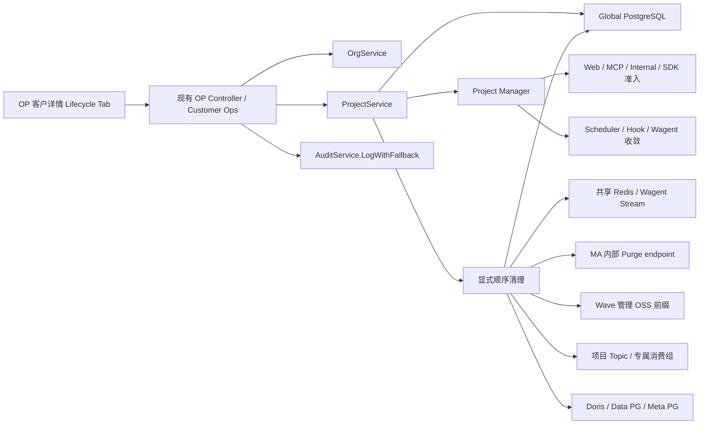

只有两类新 seam：Project/Organization 现有 Service 的生命周期方法，以及 MA 的内部项目清理 endpoint。其余改动都落在已有统一入口或已有 PM Delete/Update Hook。

## 4. 项目资源全景与组件职责

本章只回答三件事：项目资源在哪里、生命周期动作如何改变它们、哪个组件负责处理。精确文件改动见第 5 章，Purge 顺序和幂等条件见第 9 章。

### 4.1 四个平面

| 平面 | 组成 | 生命周期职责 |
| --- | --- | --- |
| 控制平面 | Global PG、Project/Organization Service、OP | 保存权威状态并校验动作 |
| 可用性平面 | PM membership/info 和进程内 project/token/config map | 决定组件能否取得项目 |
| 运行平面 | Scheduler、Dispatch、consumer、goroutine、WebSocket、cache | 停止新工作并收敛运行中工作 |
| 数据平面 | Meta/Data PG、Doris、Kafka、Redis、OSS | Delete/Restore 保留，Purge 由清理 owner 执行 |

下文固定使用“持久资源、运行资源、进程内状态、入口门禁、清理 owner、PM Delete Hook、PM Update Hook”，不混用近义名称。

### 4.2 Wave 项目全链路

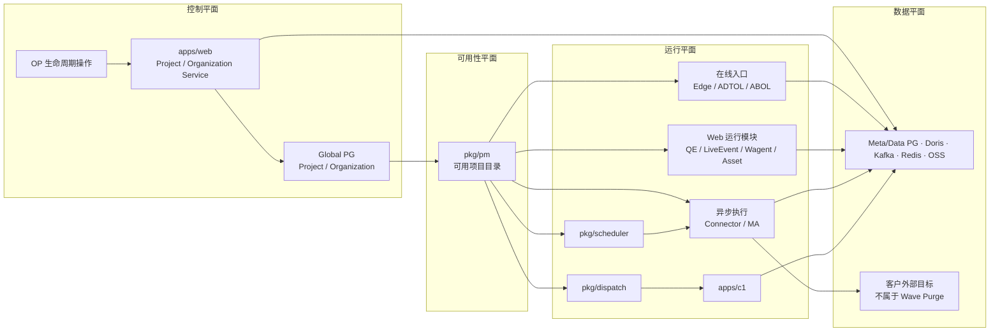

箭头表示项目配置、准入或数据关系，不表示 Purge RPC。Purge 由 `ProjectService` 调用清理 owner；只有 MA 独享资源需要一个内部 endpoint。

### 4.3 生命周期影响矩阵

| 动作 | 控制平面 | 可用性平面 | 运行平面 | 数据平面 |
| --- | --- | --- | --- | --- |
| Delete | `ENABLE,false → DISABLE,false` | `PM.DeleteInfo` | 入口门禁拒绝新工作，PM Delete Hook 驱逐进程内状态，Scheduler heartbeat 取消 handler | 不删除、不扫描、不改写 |
| Restore | `DISABLE,false → ENABLE,false` | `PM.SetInfo` | PM Update Hook 更新进程内状态，重新调度或下一请求懒加载 | 不检查、不重建，时间性损失不补偿 |
| Purge | 新数据 `PURGING,false`；历史数据 `PURGING,true`；完成后 `PURGED,true` | 确保 PM 中无项目 | 确认 Scheduler、Dispatch、Wagent 静默 | 各清理 owner 同步执行，最后写 Global PG 墓碑 |

Project Delete 不检查父 Organization 状态；Project Restore/Create 才要求父组织 `ENABLE,false`。

### 4.4 评审索引

| 职责分组 | 组件 | 评审重点 | 明细 |
| --- | --- | --- | --- |
| 控制面 | `apps/web` | 权威状态、入口门禁、运行资源、进程内状态、清理 owner 编排 | 4.5 |
| 在线入口 | `apps/edge`、`apps/adtol`、`apps/abol` | PM 项目来源、运行资源、进程内状态 | 4.6 |
| 数据与异步执行 | `apps/c1`、`apps/connector`、`apps/ma` | Scheduler/Dispatch 收敛、数据资源、客户目标副本边界 | 4.7 |
| 独立工具 | `apps/simulator` | 是否拥有 Wave 项目资源、是否需要生产改动 | 4.8 |
| 共享运行骨架 | `pkg/pm`、`pkg/scheduler`、`pkg/dispatch`、存储 client | 项目可用性、统一停止机制、清理 owner | 4.9–4.10 |

本章每个组件都按同一顺序阅读：先看“资源清单”确认资源类型和现状，再看“资源生命周期变化图”确认 Delete、Restore、Purge 的变化，最后看“适配结论”确认本期代码需要改什么。表格列出完整资源，图只画资源状态变化，不再单独维护抽象的资源关系图。

生命周期图统一使用以下图例：状态只有 `ENABLE`、`DISABLE`、`PURGED`；实线表示 Delete 或 Purge，虚线表示 Restore 的回退路径（不表示异步）；箭头标签统一使用“动作：资源结果”，资源未发生变化时明确写“`不变`”；同一状态内不绘制资源之间的使用箭头，资源使用链路只在资源清单表中说明。

### 4.5 控制面：`apps/web`

#### 4.5.1 Project/Organization/OP 资源台账

| 资源 | 类型 | 来源/创建 | 使用链路 | Delete | Restore | Purge |
| --- | --- | --- | --- | --- | --- | --- |
| Global PG project/org 主记录 | 持久资源 | Project/Organization Service | 状态、归属、生命周期查询 | 写 `DISABLE` | 写 `ENABLE` | 最终事务写 `PURGED,true` |
| Project member、邀请引用 | 持久资源 | 创建成员或邀请时写入 | 成员权限和组织归属校验 | 保留 | 保留 | Global 清理 owner 移除目标引用 |
| PM membership/info | 持久资源 | Project Service 发布项目 | 入口门禁和组件配置读取 | `PM.DeleteInfo` | `PM.SetInfo` | 确保 PM 中无项目 |

**资源生命周期变化图**

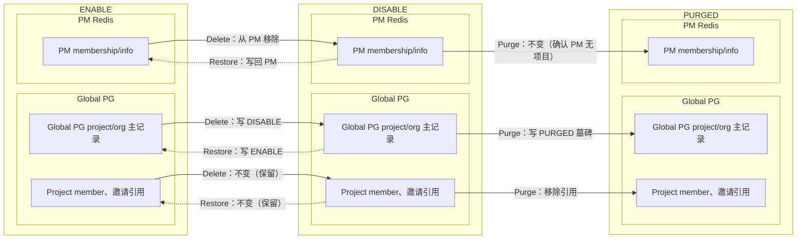

**适配结论**

- Delete 只更新 Global PG 状态，并通过 `PM.DeleteInfo` 让项目从准入目录消失。
- Restore 恢复 Global PG 和 PM info，不重建项目数据。
- Purge 最后移除成员/邀请引用，并保留 Global PG 的 `PURGED` 墓碑。

#### 4.5.2 普通 Web API、MCP、Internal S2S 资源台账

| 入口 | 类型 | 来源/创建 | 使用链路 | Delete | Restore | Purge |
| --- | --- | --- | --- | --- | --- | --- |
| `ProjectFilter`、`OrganizationFilter` | 入口门禁 | HTTP 请求解析组织/项目 ID | 普通 Web API | 拒绝不可用项目/组织 | 恢复后放行 | 无独立清理 |
| `authorizeProjectContext` | 入口门禁 | MCP 请求解析 project ID | MCP tool 授权 | 检查 PM 和 scope | 恢复后重新授权 | 无独立清理 |
| Internal S2S project header | 入口门禁 | 内部请求 Header | Pipeline、AB、MA 新工作 | 阻断 start/create/materialize | 恢复新工作入口 | 无独立清理 |
| finish/update/cleanup 回调 | 运行资源 | Delete 前已发出的请求 | 写回执行结果或清理状态 | 允许回写，不创建新工作 | 继续使用 | 由底层资源 owner 处理 |

**资源生命周期变化图**

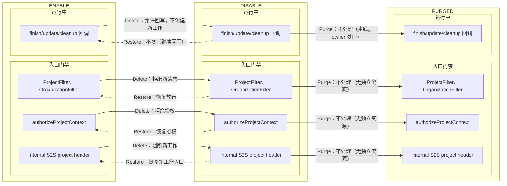

**适配结论**

- 所有新请求统一先查 PM；PM 中没有项目时直接拒绝。
- Delete 不主动删除业务回调需要的上下文，只禁止创建新工作。
- Restore 只恢复 PM 准入，不新增入口专用资源。

#### 4.5.3 Pipeline 与 migration 资源台账

| 资源 | 类型 | 来源/创建 | 使用链路 | Delete | Restore | Purge |
| --- | --- | --- | --- | --- | --- | --- |
| Meta PG pipeline/run/backfill/load-file | 持久资源 | Pipeline 创建和运行 | Pipeline、Backfill、Load-file | 保留，不创建新工作 | cron/repair 继续 | Meta Schema 最后 Drop |
| Scheduler Job/Instance/Task | 持久资源 | Job 注册和调度 | Scheduler Master/Worker | 保留，入口不生成/领取 | 下一次 cron/repair 恢复 | Meta Schema Drop 一并清理 |
| Data PG Schema | 持久资源 | Project 初始化 | Pipeline 数据读写 | 保留 | 不重建 | PG 清理 owner `DROP SCHEMA IF EXISTS` |
| Doris Database | 持久资源 | Project 初始化 | Pipeline 查询和写入 | 保留 | 不重建 | Doris 清理 owner `DROP DATABASE IF EXISTS` |
| 项目 Kafka Topic | 持久资源 | Project 初始化或首次写入 | Edge、Connector、C1、LiveEvent | 保留 | 不重建 | Kafka 清理 owner 删除 |
| Wave OSS 项目前缀 | 持久资源 | Load/backfill/cron 写入 | Connector 文件交换 | 保留 | 不重建 | OSS 清理 owner 清理四类前缀 |
| Project migration | 运行资源 | migration runner 扫描项目状态 | Schema 升级 | `DISABLE,false` 继续迁移 | 继续迁移 | `PURGING` 不再迁移 |

**资源生命周期变化图**

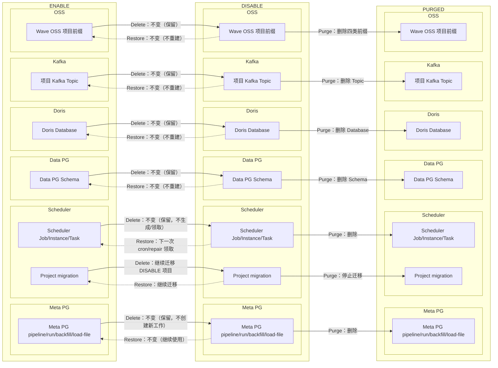

**适配结论**

- Delete 只关闭项目入口，不删除 Pipeline、Topic、Schema 或 OSS 数据。
- Scheduler 通过 PM 门禁和 heartbeat 收敛，不增加组件级停止信号。
- Restore 依赖下一次 cron/repair 重新领取；Purge 才按资源 owner 清理。

#### 4.5.4 QE Catalog 资源台账

| 资源 | 类型 | 来源/创建 | 使用链路 | Delete | Restore | Purge |
| --- | --- | --- | --- | --- | --- | --- |
| `catalogs[projectID]` | 进程内状态 | QE 查询或 PM Update Hook | 事件、属性、Cohort、Metric 查询 | Delete Hook 驱逐 | 查询时懒加载 | 随进程状态清除 |
| 事件/属性/Cohort/Metric MetaCache | 进程内状态 | QE Catalog 加载 | QE Catalog 响应 | Delete Hook 驱逐 | 查询时懒加载 | Meta Schema 删除来源数据 |
| refresh lock Key | 运行资源 | QE refresh 任务创建 | 防止重复 refresh | 保留 | 继续使用 | `project_redis` 删除；不存在即成功 |

**资源生命周期变化图**

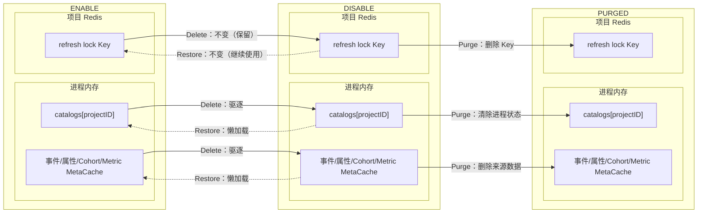

**适配结论**

- Delete 只驱逐项目 Catalog，禁止新的 refresh 和查询加载。
- Restore 不重建全量缓存，由下一次查询懒加载。
- Purge 删除 refresh lock，并由 Meta 清理 owner 删除来源数据。

#### 4.5.5 LiveEvent 资源台账

| 资源 | 类型 | 来源/创建 | 使用链路 | Delete | Restore | Purge |
| --- | --- | --- | --- | --- | --- | --- |
| 项目 WebSocket | 运行资源 | LiveEvent 连接建立 | 实时事件推送 | Delete Hook 关闭 | 新连接懒启动 | 无连接可清理 |
| Kafka consumer | 运行资源 | WebSocket 建立时创建 | 消费项目事件 | Delete Hook 关闭 | 新连接重建 | 由连接关闭收敛 |
| `live-event-<pid>-<timestamp>-*` group | 持久资源 | 每次项目连接创建 | Kafka broker group metadata | 保留残留 metadata | 不主动重建 | `project_kafka` 按前缀删除 |

**资源生命周期变化图**

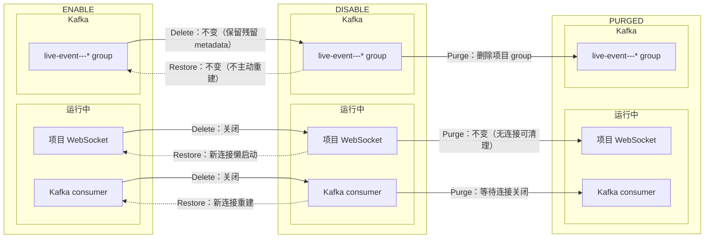

**适配结论**

- Delete 关闭项目 WebSocket 和 consumer，但保留 Kafka group metadata。
- Restore 不主动创建连接，下一次请求建立新连接。
- Purge 由 Kafka owner 按项目 group 前缀幂等删除。

#### 4.5.6 Asset Behavior 资源台账

| 资源 | 类型 | 来源/创建 | 使用链路 | Delete | Restore | Purge |
| --- | --- | --- | --- | --- | --- | --- |
| 项目 batcher/goroutine | 运行资源 | 首次行为请求创建 | 行为事件批处理 | Delete Hook drain、flush、Close | 下一次请求懒创建 | 进程内状态随服务释放 |
| 行为数据 | 持久资源 | batcher 写入项目存储 | PG/Doris 查询 | 保留 | 继续使用 | PG/Doris 清理 owner 处理 |

**资源生命周期变化图**

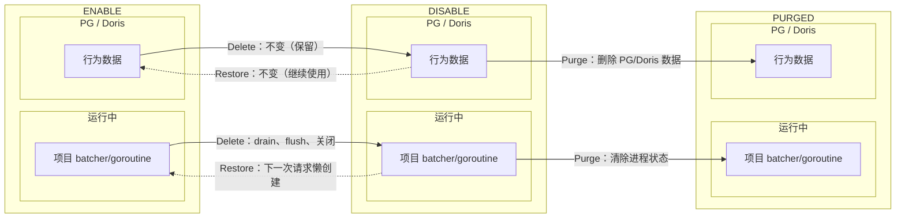

**适配结论**

- Delete 先 drain、flush，再关闭项目 batcher，不删除行为数据。
- Restore 由下一次行为请求懒创建 batcher。
- Purge 只由 PG/Doris 清理 owner 删除行为数据。

#### 4.5.7 Wagent 资源台账

| 资源 | 类型 | 来源/创建 | 使用链路 | Delete | Restore | Purge |
| --- | --- | --- | --- | --- | --- | --- |
| `wagent_conversation/message` | 持久资源 | Wagent 执行写入 | Conversation、Message 查询 | 保留 | 继续使用 | Meta Schema Drop 清理 |
| execution/compaction Stream、DLQ、pending | 持久资源 | 执行入队或失败写入 | claim/start、重试和恢复 | 禁止 claim/start，不 ACK/XDEL | 恢复后重新领取 | Wagent owner 定向删除目标项目 entry |
| execution/lease/event/active-lock Key | 运行资源 | 执行和 heartbeat 创建 | 执行互斥、租约、事件 | 保留或自然过期 | 继续使用 | Wagent owner 定向删除 |
| quota/rate-limit Key | 运行资源 | 配额和限流请求创建 | 执行配额和限流 | 保留或自然过期 | 继续使用 | Wagent owner 定向删除 |
| executor `running` map | 进程内状态 | 执行启动时写入 | 运行中 execution 管理 | heartbeat 取消并移除 | 新执行重新创建 | 随进程状态清除 |
| MCP tool TTL cache | 进程内状态 | MCP tool list 查询创建 | 工具列表缓存 | 保留或 TTL 过期 | 新请求恢复 | 不单独清理 |

**资源生命周期变化图**

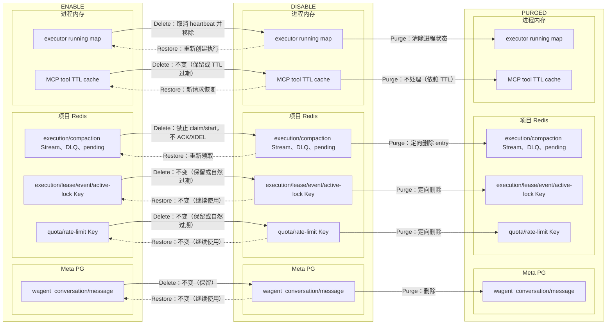

**适配结论**

- Delete 禁止新的 `claim/start`，运行中的 execution 由 heartbeat 发现 PM 缺失后收敛。
- Restore 不恢复旧执行，后续任务重新 claim；已完成数据继续保留。
- Purge 定向删除 Stream、lease、event、quota 等项目资源。

#### 4.5.8 Web MA 控制面资源台账

| 资源 | 类型 | 来源/创建 | 使用链路 | Delete | Restore | Purge |
| --- | --- | --- | --- | --- | --- | --- |
| campaign/audience/config | 持久资源 | MA 配置创建 | launch、materialize、ConfigSync | 入口门禁拒绝新工作 | 继续读取 | Meta Schema Drop 清理 |
| MA Time/Event Trigger Job | 持久资源 | Scheduler 注册 | 时间触发和事件触发 | Job 保留但不运行 | 下一次调度或对账恢复 | Meta Schema Drop 清理 |

**资源生命周期变化图**

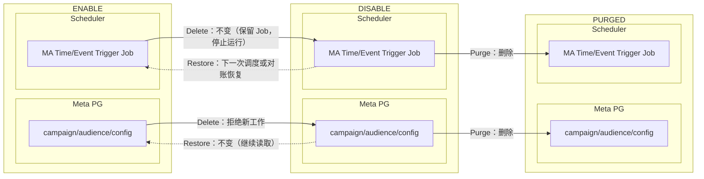

**适配结论**

- Web MA 只负责入口门禁，不新增独立运行时注册表。
- Delete 保留 Scheduler Job，但不再生成新的 launch/materialize 工作。
- Purge 通过现有 MA 内部 endpoint 清理 MA 独享资源。

#### 4.5.9 权限与 Token cache 资源台账

| 资源 | 类型 | 来源/创建 | 使用链路 | Delete | Restore | Purge |
| --- | --- | --- | --- | --- | --- | --- |
| `sol:perm:*`、asset permission cache | 运行资源 | 权限查询或刷新创建 | 普通 API、资产访问 | 保留，入口门禁拒绝项目 | 原关系继续可用 | `project_redis` 删除 |
| Project→Org cache | 运行资源 | 组织/项目查询创建 | 归属校验和准入 | 保留或自然过期 | 继续使用 | `project_redis` 删除 |
| Account API Token scope cache | 运行资源 | Token scope 查询创建 | API Token 授权 | 保留，scope 源不变 | 继续使用 | 事务提交前后驱逐 |
| Token scope / invite source | 持久资源 | Global PG 写入 | Token 授权和邀请 | 保留 | 继续使用 | Global 最终事务移除引用 |

**资源生命周期变化图**

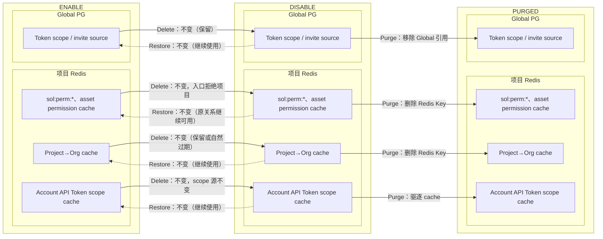

**适配结论**

- Delete 不修改成员、scope 或 token source，只由入口门禁拒绝项目。
- Restore 复用原有 source 和 cache，不新增权限模型。
- Purge 在事务完成前后驱逐 cache，并移除项目相关 source 引用。

带 project label 的 metrics/log/trace 属于可观测历史，按 retention 保留，不增加 Purge 删除接口。

### 4.6 在线入口：`edge`、`adtol`、`abol`

#### 4.6.1 `apps/edge` 资源台账

| 资源 | 类型 | 来源/创建 | 使用链路 | Delete | Restore | Purge |
| --- | --- | --- | --- | --- | --- | --- |
| Raw/Event/Error Topic | 持久资源 | 项目初始化或首次写入 | ingest → producer → Kafka | 保留 | 不重建 | Kafka 清理 owner 删除；不存在即成功 |
| 全局 producer | 运行资源 | Edge 服务启动 | ingest 写入 Topic | 已进入 producer 的有限消息允许完成 | 继续使用 | 不按项目删除 |
| `token2id` | 进程内状态 | PM Update Hook 创建 | Token → project ID | Delete Hook 驱逐 | Update Hook 重建 | 随进程状态清除 |
| `pipelineVersion` | 进程内状态 | PM Update Hook 创建 | ingest 读取版本 | Delete Hook 驱逐 | Update Hook 重建 | 随进程状态清除 |
| `internalSecrets` | 进程内状态 | PM Update Hook 创建 | 内部请求鉴权 | Delete Hook 驱逐 | Update Hook 重建 | 随进程状态清除 |

**资源生命周期变化图**

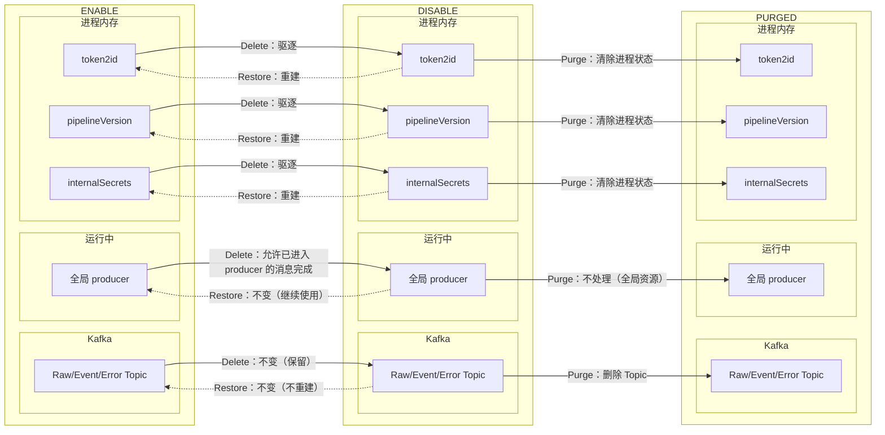

**适配结论**

- Delete 只驱逐项目进程内 map；全局 producer 不按项目停止。
- Restore 通过 PM Update Hook 重建 map，Topic 不重建。
- Purge 由 Kafka owner 删除 Topic；已进入 producer 的有限消息允许完成。

#### 4.6.2 `apps/adtol` 资源清单与结论

| 资源或入口 | 类型 | 来源/创建 | 使用链路 | Delete | Restore | Purge |
| --- | --- | --- | --- | --- | --- | --- |
| `PM.Token2ProjectID` | 入口门禁 | 每次 HTTP 请求 | Token → project ID | PM 缺失时拒绝 | PM 恢复后放行 | 无资源清理 |
| 项目持久资源 | 持久资源 | 无 | ADTOL 不拥有 | 无变化 | 无变化 | 无 |
| 项目运行资源 | 运行资源 | 无 | ADTOL 不拥有 | 无变化 | 无变化 | 无 |
| 项目进程内状态 | 进程内状态 | 无 | ADTOL 不拥有 | 无变化 | 无变化 | 无 |

**资源生命周期变化图**

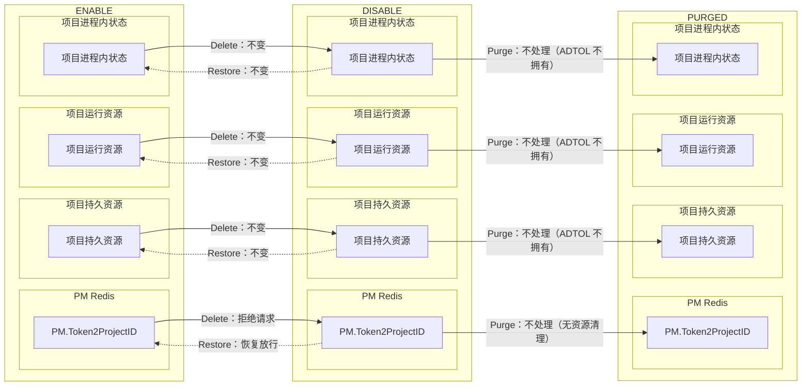

**适配结论**

- ADTOL 不拥有项目持久资源、运行资源或进程内状态。
- 只需继续依赖 PM 入口门禁；Delete 后拒绝请求，Restore 后自动放行。
- 不新增 ADTOL 专用 Purge 接口。

#### 4.6.3 `apps/abol` 资源台账

| 资源 | 类型 | 来源/创建 | 使用链路 | Delete | Restore | Purge |
| --- | --- | --- | --- | --- | --- | --- |
| Meta AB 配置 | 持久资源 | AB 配置写入 | ABOL → AB API | 保留 | 继续读取 | Meta 清理 owner 处理 |
| 项目 Redis target cache | 运行资源 | AB 配置读取或刷新 | ABCore target lookup | 保留 | 继续使用 | Redis 清理 owner 删除 |
| metadata loop | 运行资源 | PM Update Hook 创建 | metadata 同步 | PM Delete Hook 停止 | PM Update Hook 重建 | 随运行资源清除 |
| `abCore[projectID]` | 进程内状态 | PM Update Hook 创建 | ABOL project core lookup | PM Delete Hook 删除 | PM Update Hook 重建 | 随进程状态清除 |

**资源生命周期变化图**

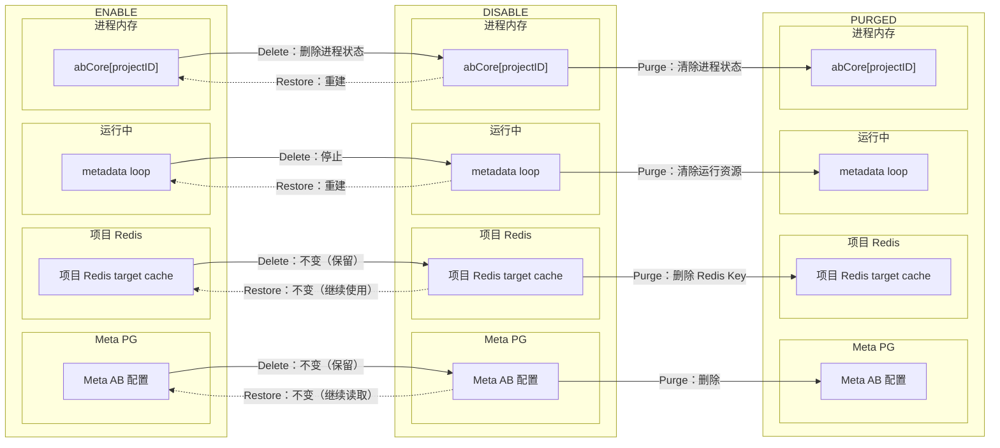

**适配结论**

- Delete 通过 PM Delete Hook 停止 metadata loop，并删除 `abCore[projectID]`。
- Restore 通过 PM Update Hook 重建 core 和 loop，原有配置继续使用。
- Purge 由 Meta/Redis owner 清理持久资源。

### 4.7 数据处理与异步执行：`c1`、`connector`、`ma`

#### 4.7.1 `apps/c1` 资源台账

| 资源 | 类型 | 来源/创建 | 使用链路 | Delete | Restore | Purge |
| --- | --- | --- | --- | --- | --- | --- |
| Meta/Data PG | 持久资源 | Project 初始化和 Pipeline 写入 | Pipeline/IDM 数据读写 | 保留 | 继续使用 | PG 清理 owner 处理 |
| Doris Database | 持久资源 | Project 初始化 | Pipeline 查询和写入 | 保留 | 继续使用 | Doris 清理 owner 处理 |
| 项目 Kafka Topic | 持久资源 | Project 初始化或首次写入 | C1 extractor、Pipeline | 保留 | 不重建 | Kafka 清理 owner 删除 |
| C1 extractor group | 持久资源（跨项目共享） | C1 服务启动 | 跨项目事件抽取 | 保留 | 继续使用 | 不删除共享 group |
| Redis task map | 持久资源 | Dispatch 拓扑刷新 | 项目任务分配 | 重写目标项目 map | 根据 PM quota 重建 | task count 为 0 后保留其他项目 |
| Tasker | 运行资源 | Dispatch 分配项目任务 | 执行项目任务 | 关闭 | 重新分配 | 静默后不再运行 |
| consumer/loader | 运行资源 | C1 运行时创建 | 消费和加载数据 | 取消或自然收敛 | 懒加载 | 不删除全局 loader |
| metadata store、topology/counts | 进程内状态 | Project 拓扑和元数据加载 | C1 查找和拓扑刷新 | PM Delete Hook 驱逐 | 懒加载或重新分配 | 随进程状态清除 |
| DDL mutex | 进程内状态（跨项目共享） | DDL 操作创建 | 防止同项目并发 DDL | 不主动替换 | 继续使用 | 不跨进程删除 |

**资源生命周期变化图**

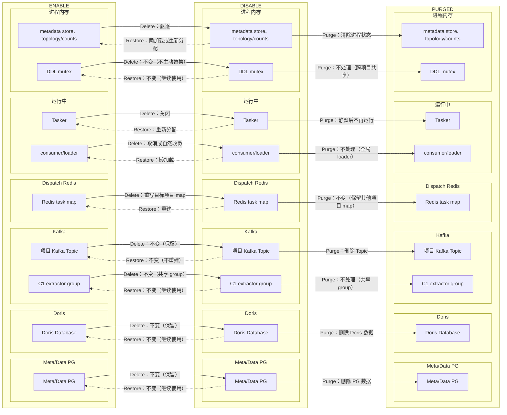

**适配结论**

- Delete 重写项目 task map，关闭目标 Tasker，并驱逐 metadata store。
- Restore 重新分配 quota，按需懒加载 metadata；共享 extractor group 不停止。
- Purge 先确认 task count 为零，再由 PG/Doris/Kafka owner 清理。

#### 4.7.2 `apps/connector` 资源台账

| 资源 | 类型 | 来源/创建 | 使用链路 | Delete | Restore | Purge |
| --- | --- | --- | --- | --- | --- | --- |
| Meta pipeline/run/backfill | 持久资源 | Connector 创建任务 | Pipeline、Backfill | 保留 | cron/repair 重新领取 | Meta Schema Drop 清理 |
| Scheduler Instance/Task/lease | 持久资源 | Scheduler 调度 | Handler ownership | 保留，heartbeat 释放运行 lease | 恢复后重新领取 | Scheduler owner 删除 notify/lease |
| 派生 Topic 和消费组 | 持久资源 | Pipeline 运行或 Connector 初始化 | Kafka runner/consumer | 保留 | 从 offset 继续 | Kafka 清理 owner 删除 |
| OSS `load/backfill/events_cron/users_cron/<pid>/` | 持久资源 | Load/backfill/cron 写入 | 文件交换和导入 | 保留 | 继续使用 | OSS 清理 owner 清理四类前缀 |
| Kafka runner/consumer | 运行资源 | Handler 启动 | Nearline 和批处理执行 | PM gate/heartbeat 取消 | cron/repair 重启 | 静默后不再运行 |
| 批导临时对象 | 进程内状态 | 批导 handler 创建 | 批量处理上下文 | handler 取消后释放 | 新任务重新创建 | 随进程状态清除 |
| 客户目标副本 | 范围外资源 | Connector 向客户系统写入 | 客户外部消费链路 | 不回收 | 不回收 | Purge 不删除 |

**资源生命周期变化图**

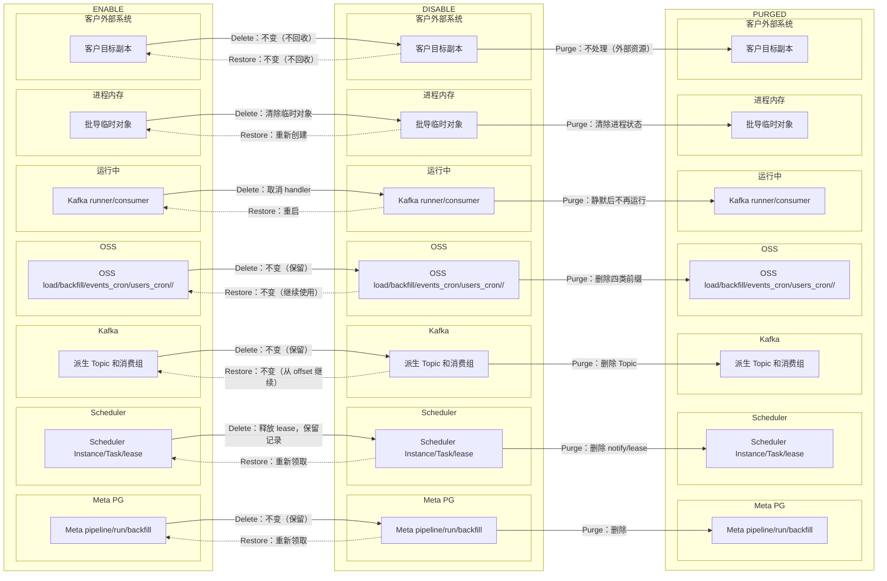

**适配结论**

- Delete 通过 PM gate 和 heartbeat 取消 handler，不删除 Wave 数据。
- Restore 依赖 cron/repair 重新领取任务，已有 offset 和数据继续使用。
- Purge 只清理 Wave 自有资源，客户目标副本明确不回收。

#### 4.7.3 `apps/ma` 资源台账

| 资源 | 类型 | 来源/创建 | 使用链路 | Delete | Restore | Purge |
| --- | --- | --- | --- | --- | --- | --- |
| Meta campaign/audience/config | 持久资源 | MA 配置创建 | ConfigSync、launch、materialize | 入口门禁拒绝新工作 | 继续读取 | Meta Schema Drop 清理 |
| 共享/独享 Redis project Key | 持久资源 | ConfigSync、consumer、fanout 写入 | config、cohort、delay、delivery、idempotency | 保留 | 继续使用 | MA endpoint 清理两个 Redis |
| 项目 group `{groupPrefix}.<pid>` | 持久资源 | MA consumer 创建 | 项目事件消费 | 保留 | 不主动重建 | MA endpoint 删除 group |
| Scheduler handler | 运行资源 | MA Job 调度 | time-fire、event-trigger | heartbeat 取消 | 下一次 cron/repair 恢复 | 静默后不再运行 |
| event consumer、watcher、sweeper、materializer | 运行资源 | ConfigSync/Scheduler 创建 | 行为匹配和 fanout | PM Delete Hook 驱逐或取消 | 重新 track 或懒加载 | MA endpoint 清理项目资源 |
| config/cohort/matcher/feedback cache | 进程内状态 | 项目 track 或事件加载 | 匹配、反馈和配置读取 | PM Delete Hook 驱逐 | 懒加载 | 随进程状态清除 |

**资源生命周期变化图**

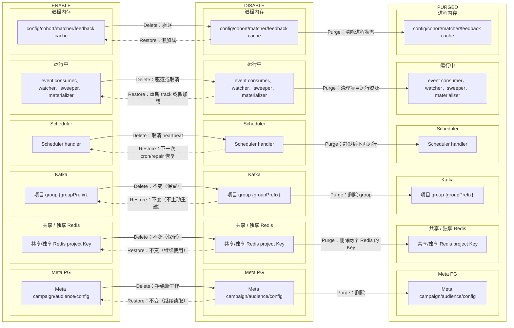

**适配结论**

- Delete 取消项目 track、handler 和项目 cache，但保留 Redis 数据。
- Restore 由 ConfigSync 重新 track，运行资源和 cache 按需恢复。
- Purge 通过 MA 内部 endpoint 清理项目 Redis、group 和运行残留。

### 4.8 独立工具：`apps/simulator`

| 项目来源 | Wave 项目资源 | Delete / Restore / Purge | 结论 |
| --- | --- | --- | --- |
| 本地 YAML/JSON 中的 endpoint/token | 无 PM、无持久资源、无运行资源、无进程内状态、无生产 Scheduler handler | Delete/Restore/Purge 均不修改操作侧文件；已失效 endpoint/token 的请求由入口门禁拒绝 | 无生产代码改动 |

该组件没有项目资源，因此不绘制生命周期变化图；表格结论即为完整适配结论。

### 4.9 共享运行骨架

#### 4.9.1 `pkg/pm` 资源台账

| 资源 | 类型 | 来源/创建 | 使用链路 | Delete | Restore | Purge |
| --- | --- | --- | --- | --- | --- | --- |
| Redis membership/info | 持久资源 | `SetInfo` / `DeleteInfo` | 组件项目目录和准入 | 删除项目 membership/info | 写回项目 info/membership | 确保不存在，不编排其他清理 |
| Pub/Sub | 运行资源 | PM 订阅建立 | Delete/Restore 传播 | 删除事件或订阅重连 | 发布 SetInfo | 不做 Purge 事件 |
| project/token/config map | 进程内状态 | PM info/membership 加载 | 组件本地项目查找 | Delete Hook 驱逐 | Update Hook 重建 | 随进程状态清除 |
| 快照对账 | 运行资源 | PM 重订阅或定时检查 | 修正丢消息和陈旧状态 | 保留对账能力 | 继续对账 | 不承担资源清理 |

**资源生命周期变化图**

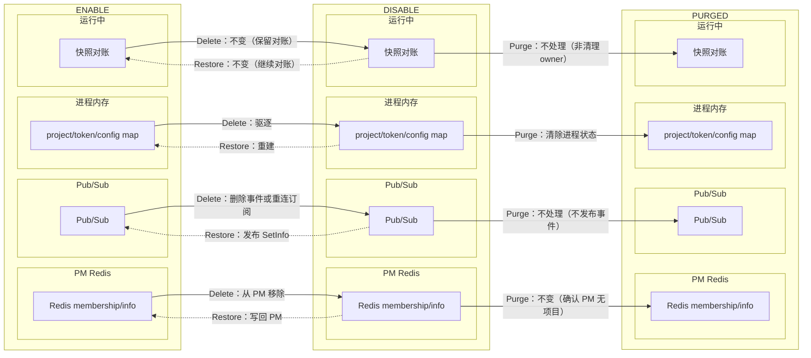

**适配结论**

- PM 是全链路唯一项目目录；Delete 删除 membership/info，Restore 发布 SetInfo。
- Delete/Restore 传播依赖现有 Pub/Sub 和快照对账，不新增第二套通知机制。
- Purge 只确认 PM 中无项目，不由 PM 编排各资源清理。

#### 4.9.2 `pkg/scheduler` 资源台账

| 资源 | 类型 | 来源/创建 | 使用链路 | Delete | Restore | Purge |
| --- | --- | --- | --- | --- | --- | --- |
| Meta PG Job/Instance/Task | 持久资源 | Job 注册和调度 | Master、Worker、handler | 保留，不改业务状态 | cron/repair 恢复 | Meta Schema Drop 清理 |
| Redis notify/delayed | 持久资源 | Master/Worker notify | 生成和领取工作 | 不 ACK 为成功 | 恢复后 repair | Scheduler owner 按项目过滤删除 |
| heartbeat/lease Key | 运行资源 | Instance/Task handler | ownership 和租约 | heartbeat 发现 PM 缺失后释放 | 新 handler 重新获取 | Scheduler owner 定向删除 |
| Master cron | 运行资源 | Scheduler 启动 | Job tick 和 notify | 每 tick 检查 PM，跳过新工作 | 下一 tick 恢复 | 不按项目停止全局 cron |
| Worker handler/context | 运行资源 | Worker claim 成功 | Instance/Task 执行 | heartbeat 取消本地 context | 后续 repair 重新领取 | 静默后不再运行 |

**资源生命周期变化图**

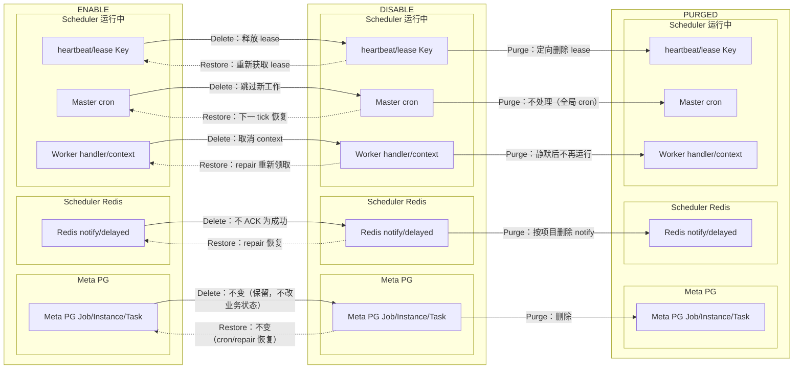

**适配结论**

- 所有 JobType 共用 PM gate；Delete 后 Master/Worker 不生成或领取新工作。
- 运行中的 handler 只通过 heartbeat 取消 context 并释放 lease，不增加停止信号。
- Restore 依赖 cron/repair；Purge 定向清理 notify/lease，不停止全局 cron。

#### 4.9.3 `pkg/dispatch` 资源台账

| 资源 | 类型 | 来源/创建 | 使用链路 | Delete | Restore | Purge |
| --- | --- | --- | --- | --- | --- | --- |
| Redis service/project task map | 持久资源 | Dispatch topology 刷新 | 项目任务分配 | 重写目标项目 map | 根据 PM quota 重建 | 只确认目标项目为 0，不删其他项目 |
| Pub/Sub | 运行资源 | Dispatch 订阅建立 | 拓扑和任务变更 | 保留共享订阅 | 继续使用 | 不删除全局 channel |
| TaskManager | 运行资源 | Dispatch 启动 | C1 Tasker 管理 | 关闭目标项目 Tasker | 重新分配后启动 | task count 为 0 后静默 |
| counts/topology | 进程内状态 | topology 刷新 | 项目任务数和拓扑 | removed project 触发刷新 | 重新分配时更新 | 随进程状态清除 |

**资源生命周期变化图**

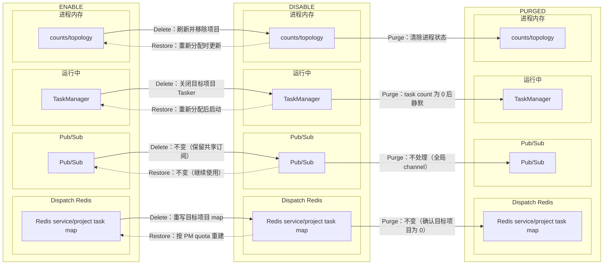

**适配结论**

- Delete 只刷新项目 task map 并关闭目标 Tasker，不影响共享 Pub/Sub。
- Restore 按 PM quota 重新分配任务；Purge 前必须确认目标项目 task count 为零。
- Dispatch 不负责删除 PG、Doris、Kafka 等数据资源。

#### 4.9.4 存储 client 资源台账

| client | 资源或能力 | 类型 | Delete | Restore | Purge |
| --- | --- | --- | --- | --- | --- |
| `pkg/dal/redisx` | 窄 prefix delete 和 Key 解析 | 清理能力 | 不调用清理 | 不调用清理 | 只复用已有原语，owner 负责解析 |
| `pkg/dal/kafkax` | Topic/group admin | 清理能力 | 不删 Topic/group | 不重建 Topic/group | TopicList/DeleteTopics，固定前缀 group 幂等删除 |
| `pkg/dal/dorisx` | Project Database drop | 清理能力 | 不 Drop | 不检查、不重建 | `DROP DATABASE IF EXISTS` |
| `pkg/dal/pgsqlx` | Project Schema drop | 清理能力 | 不 Drop | 不检查、不重建 | `DROP SCHEMA IF EXISTS CASCADE` |

存储 client 只提供已有的幂等清理原语，不拥有项目生命周期状态，因此不单独绘制状态图。

### 4.10 Scheduler Handler 覆盖

11 个生产 JobType 统一使用 Scheduler PM 门禁和 heartbeat，不复制组件级停止逻辑：

| 进程 | JobType | Instance/Task Handler | 处理的项目资源 |
| --- | --- | --- | --- |
| Web | `cohort` | Instance | Cohort 计算，读写项目 Meta/Data/Doris |
| Web | `cohort-clean` | Instance | 清理孤立 Cohort 数据 |
| Web | `ab-report` | Instance | AB 报表计算 |
| Web | `asset-metrics` | Instance | 资产指标刷新 |
| Web | `asset-ref-wal` | Instance | 资产引用 WAL 处理 |
| Web | `events-view` | Instance | 事件 View 刷新 |
| Web | `event-stat` | Instance | 事件统计 |
| Web | `usage-metering` | Instance | 项目用量统计 |
| Connector | `pipeline` | Instance + Task | Pipeline cron/backfill，以及 nearline Kafka 长期 runner |
| MA | `ma-time-fire` | Instance + Task | 时间触发 fire 和 fanout shard |
| MA | `ma-event-trigger` | Instance + Task | 每项目持续行为消费 |

注册证据：`apps/web/server.go`、`apps/connector/api/server.go`、`apps/ma/server/server.go`；常量：`pkg/scheduler/scheduler.go`。新增 JobType 时同步更新此表和统一门禁测试。

### 4.11 边界与完整性结论

| 对象 | 生命周期处理 |
| --- | --- |
| 客户 S3/TOS/ByteHouse 等外部目标副本 | 不归 Wave 所有，Purge 不删除 |
| project-labeled metrics、日志、trace | 按 retention 保留，不继续驱动工作 |
| C1 extractor consumer group、全局 producer/client/loader | 跨项目共享，不按项目删除 |
| `pkg/dal/dorisx.ddlLocks[projectID]` | 进程内 mutex，不是业务数据；不跨进程删除，随进程释放 |
| simulator endpoint/token 文件 | 操作侧输入，不由服务端生命周期修改 |

| 完整性检查 | 通过条件 |
| --- | --- |
| `apps/* → 资源` | `web/edge/adtol/abol/c1/connector/ma/simulator` 全部覆盖；每个组件均说明项目入口、持久资源、运行资源、进程内状态和动作结论 |
| `资源 → 清理 owner` | 第 9 章每项资源只有一个清理 owner；跨项目共享项和范围外项明确不删除 |
| 方案克制 | 不增加运行时 registry、插件、组件级 Purge RPC 或第二套停止信号 |

## 5. 文件与函数级改动范围

### 5.1 状态、DAO、Service 与迁移

| 文件 | 函数/结构 | 改动 |
| --- | --- | --- |
| `apps/web/dao/global/project.go` | `ProjectDao` | 新增 `PURGING/PURGED` 常量、保持 `is_deleted` 的条件状态更新、生命周期列表/计数、`GetByIDWithDeleted`；migration 查询显式只取 `INITIALIZING/ENABLE/DISABLE,false` |
| `apps/web/dao/global/organization.go` | `Organization`、`OrganizationDao` | 新增 `Status`、`ENABLE/DISABLE/PURGING/PURGED` 常量、`GetByIDWithDeleted` 和条件状态更新；最终保留组织墓碑，不硬删主记录 |
| `apps/web/dao/global/project_member.go` | `ProjectMemberDao` | 新增按 project ID 硬删除，供最终 Global 事务使用 |
| `apps/web/dao/global/member_invite.go` | `MemberInviteDao` | Project Purge 从 `project_ids` 和 `invite_conf.project_auth` 移除项目；Organization Purge 硬删本组织邀请 |
| `apps/web/dao/global/account_api_token.go` | `AccountAPITokenDao` | 批量读取/更新仍有效 token 的 `scopes`，移除被 Purge 的 project/org ID；不删除共享 Account/token |
| `apps/web/service/project/delete.go` | `Archive`、全局 `Delete`、资源 helper | 删除 `Archive` 和旧全局 `Delete`；实现 `ProjectService.Delete/Restore/Purge`；Purge 用直线式代码显式顺序调用幂等 helper |
| `apps/web/service/project/project.go` | `ProjectService`、`UpdateProjectAndCacheTransaction` | 注入 PM/Redis/资源依赖；普通配置更新改为显式字段和 `status=ENABLE,is_deleted=false` 条件，禁止整行 `Save` 覆盖生命周期 |
| `apps/web/service/project/create.go` | `initProject`、`InitProjectResources`、组织读取 | 与 lifecycle 使用相同项目锁；创建和初始化要求父组织 `ENABLE,false`，Project Delete 不复用该父组织约束 |
| `apps/web/service/organization/organization.go` | `Archive`、`getOrgOrFail` | 移除 `Archive`，新增 `Delete/Restore/Purge`；普通业务 helper 拒绝非 `ENABLE`，生命周期 helper可读墓碑 |
| `script/sql/pgsql/global.sql` | `organization` DDL | 增加 `status VARCHAR(64) NOT NULL DEFAULT 'ENABLE'`；更新 project/organization 状态注释 |
| `script/migration/scripts/global_v20260717_organization_project_lifecycle.sql` | 新迁移 | 只增加 organization status；不写 token、不注册服务身份、不回填 project、不改索引 |

### 5.2 PM、Scheduler 和准入面

| 文件 | 函数/结构 | 改动 |
| --- | --- | --- |
| `pkg/pm/project_manager.go` | `SetInfo`、`DeleteInfo`、`onSetInfo`、`onDeleteInfo`、`autoSubscribe`、`rdbLoadAllProjects` | 关键 Redis 错误上抛；写后立即更新本地；相同状态不重复触发 Hook；订阅断开重连并全量对账 |
| `pkg/scheduler/master.go` | `doOnJobNotify`、`wrappedJobCron.Run` | 创建/刷新 cron 和生成 Instance 前检查 `pmManager.GetInfo`；项目不可用时跳过，不删除 Job |
| `pkg/scheduler/worker.go` | `WorkerDependencies`、`onJobInstanceNotify`、`onJobTaskNotify`、`leaseJobInstance`、`leaseJobTask` | 注入现有 `pm.IManager`；领取和既有 heartbeat 检查项目；项目不在 PM 时本地取消 context、释放 ownership/lease，不改业务状态 |
| `pkg/scheduler/purge.go` | 新增 `PurgeProjectRedisState(ctx, rdb, projectID)`：只移除目标项目的全局 notify/delayed member 和项目 heartbeat/lease Key；不删除 Job |
| `pkg/ginx/middleware/project.go` | `ProjectFilter`/白名单 | 保留 PM 门禁；移除已删除租户 lifecycle route 的白名单分支 |
| `pkg/ginx/middleware/organization.go` | `OrganizationFilter`/路由取 ID | 保留现有 Account API Token 解析；普通会话访问组织资源时统一要求组织 `ENABLE,false`，OP、创建和邀请 token 流程按边界放行 |
| `apps/web/mcp/tools/context.go` | `authorizeProjectContext` | 解析 project ID 后、成员和 scope 校验前检查 PM；复用 `ErrProjectUnauthorized` |
| `apps/web/service/pipeline/internal_metadata.go` | `requireInternalProject` 及各内部方法 | 增加 `requireInternalProjectEnabled`，仅新工作入口调用；finalize/update 回调保持可用 |
| `apps/web/ma/service/*` | Internal MA 读/写方法 | 新工作入口检查 PM；已有执行回写不额外阻断 |

### 5.3 组件进程内状态与旁路

| 文件 | 当前问题 | 最小改动 |
| --- | --- | --- |
| `apps/edge/service.go` | `OnProjectDelete` 为空 | 在现有锁下删除 `token2id`、`pipelineVersion`、`internalSecrets` 的项目项 |
| `apps/adtol/api/router.go` | 每次请求已由 PM Token 查项目 | 不改生产逻辑，只加 Delete/Restore 回归测试 |
| `apps/abol/service/abol.go` | 已在 Delete Hook 停止并移除 AB Core | 不改生产逻辑，只补幂等和 Restore 测试 |
| `apps/connector/service/pipeline.go` | Hook 为空，但没有独立项目 map | 不增加假清理；长期 runner 由 Scheduler Worker 收敛 |
| `pkg/dispatch/node.go`、`pkg/dispatch/manager.go` | Hook 删除计数后，若没有其他 topology 变化，Redis task map 可能不重写 | `refreshTopo` 发现 active task map 中项目已不在 `counts` 时设置 `changedProject[p]=true`；沿用现有重写和 Pub/Sub，让 TaskManager 关闭，不加新 wake channel |
| `apps/c1/metadata/metadata.go`、`apps/c1/main.go` | 四个项目 metadata map 未驱逐 | 增加 `DeleteProjectStores(projectID)`；注册一个只做驱逐的 PM Delete Hook |
| `apps/ma/service/configsync/sync.go` | 已有 Delete Hook | 保留 `Untrack`；不在这里承担其他 MA 资源编排 |
| `apps/ma/service/cohortindex/index.go`、`watcher.go` | cohort entry/watcher 可在项目停止后残留 | 增加幂等 `DeleteProject`，删除项目 entry 并取消项目 watcher |
| `apps/ma/service/eventconsumer/coordinator.go` | `matchers` 按项目缓存 | 增加幂等 `DeleteProject` 驱逐 matcher |
| `apps/ma/service/dispatch/feedback.go` | 项目 feedback queue/token cache 可继续发送 | 增加幂等 `DeleteProject`，丢弃项目内存队列并驱逐 token cache |
| `apps/ma/server/server.go` | Runtime 装配上述运行资源和进程内状态 | Runtime 注册 PM Delete Hook；Delete 驱逐 cohort/watcher/matcher/feedback，Purge endpoint 复用同一幂等清理 |
| `apps/web/qe/catalog/catalog.go` | `catalogPMHook.OnProjectDelete` 为空 | 在 `catalogsMu` 下删除项目 Catalog；Restore 后懒加载 |
| `apps/web/service/liveevent/liveevent.go` | 只在连接建立时检查 PM | 实现 PM Delete Hook；Delete 关闭项目 consumer 和 WebSocket，移除 map；Restore 由新连接懒启动 |
| `apps/web/wagent/service/runtime/execution.go`、`local_executor.go`、`compaction.go` | Stream consumer 可绕过 Web PM 门禁 | `Service` 注入项目可用检查；claim/start 前拒绝，禁用消息不 ACK、不 XDEL |
| `apps/web/wagent/service/runtime/queue.go` | 项目数据分散在项目前缀 Key 和全局 Stream | 新增项目运行状态检查和同步 `PurgeProject`，定向删除该项目 Stream/DLQ 条目 |
| `apps/web/wagent/service/tokenquota/service.go`、`ratelimit/ratelimit.go` | quota Key 使用 `wagent:quota:{pid:week}`，execution rate-limit Key 的 project ID 位于中段 | 各增加幂等 `PurgeProject`；按固定 namespace SCAN 后解析 project ID，只删除目标项目，provider 全局限流不删 |
| `apps/web/wagent/service/tool/mcp_client.go` | tool list 是含 project ID 的进程内 TTL cache，不能自行执行工作 | 不增加 Delete Hook；Wagent claim/start 和 MCP 授权门禁已阻断使用，沿用原 TTL 淘汰 |
| `apps/web/service/permission/cache.go`、`asset/permission/cache.go` | 项目/资产权限 Key 使用各自 `sol:*` namespace，不都带通用 `p:<pid>:` | Purge 按固定 literal prefix 删除目标项目 Key；Delete/Restore 不清缓存 |
| `apps/web/qe/catalog/notifier.go` | 两类项目 refresh lock 位于 `sys:view...`/`sys:catalog...` | Purge 删除目标项目两个精确 lock Key；Delete 只驱逐内存 Catalog |
| `apps/web/service/asset/behavior.go` | 每项目 batcher 可长期存活 | 增加幂等 `CloseProject` 并注册现有单例为 PM Delete Hook；关闭前沿用现有 drain+flush，随后移出 map，Restore 懒创建 |

### 5.4 Purge 资源 client 与 MA 内部接口

| 文件 | 改动 |
| --- | --- |
| `pkg/dal/redisx/redis.go` | 只在多处确实复用时增加窄的 `DeleteByPrefix`（必要时内部封装 SCAN）；不把 `LRange/LRem/XRangeN` 扩进全局接口 |
| `pkg/dal/redisx/mock_redis.go` | 仅为实际新增的窄方法补 mock；Scheduler/Wagent owner 直接复用各自现有 Redis 原语 |
| `pkg/dal/kafkax/admin.go` | 复用现有 `TopicList/DeleteTopics`；只增加 `ListConsumerGroups` 和幂等 `DeleteConsumerGroups`。不存在视为成功，其他 broker 错误上抛；Project Purge 只按含 project ID 的固定前缀筛选 |
| `apps/web/service/project/ma_purge.go` | 用现有 `net/http` 和请求 context 调用 MA endpoint；认证 token 来自 Web 配置，响应非成功即返回 `project_ma` 依赖错误 |
| `apps/web/service/account/apitoken/service.go` | 让现有 `DeleteTokensCache` 返回 Redis error；Purge 在 Global 事务前严格驱逐相关 token cache，提交后再 best-effort 重复一次以缩小并发回填窗口 |
| `apps/ma/server/server.go` | `Runtime.PurgeProject(ctx, projectID)`：先复用本地驱逐，再从共享和独享 Redis 删除 `ma:{p:<id>}:*`，并删除 `{groupPrefix}.{id}` consumer group；运行静默由 Web Purge 前置检查保证 |
| `cmd/ma/main.go` | 在现有 health/metrics `ServeMux` 注册 `POST /internal/v1/project/purge`，常量时间校验专用 Secret、调用方 `web` 和正整数 Project header；不为此引入 Gin 或 Global DB |
| `pkg/config/app_cfg.go` | 增加 `MaBaseUrl`（`sw_ma_base_url`，默认 `http://127.0.0.1:8112`）和共享的 `MAProjectPurgeToken`（`yaml:"-" env:"MA_PROJECT_PURGE_TOKEN"`）；WebConf/MaConf 已内嵌 AppConf，直接复用，不重复声明 |
| `configs/web/web.*.yml` | 只配置 `sw_ma_base_url`；token 通过部署 Secret 注入 |

这里不让 Web 读取 MA 独享 Redis 密码，也不把 MA 清理塞进 PM Delete Hook。内部 endpoint 只有一个项目级 Purge 动作，并且只由 Web lifecycle service 调用。

### 5.5 OP 后端、OpenAPI 与前端

| 文件 | 改动 |
| --- | --- |
| `apps/web/op/dto/lifecycle.go` | 新增 lifecycle detail、action request/result DTO |
| `apps/web/op/dto/customer.go` | 增加六个 audit action 常量；复用既有 target/result 常量 |
| `apps/web/op/service/service_runtime.go` | 扩展现有 provider 接口以调用 Org/Project lifecycle；不新增 lifecycle service |
| `apps/web/op/service/customer_profile.go` | 增加 customer-scoped lifecycle detail 聚合 |
| `apps/web/op/service/customer_project_ops.go` | 增加 Project Delete/Restore/Purge；归属、确认、reason、审计在这里完成 |
| `apps/web/op/service/customer_org_ops.go` | 增加 Organization Delete/Restore/Purge；复用现有审计 builder |
| `apps/web/op/controller/lifecycle.go` | 新增七个薄 Controller，参数转换后调用现有 Customer Ops |
| `apps/web/op/converter/lifecycle.go` | DAO/Service 结果转 API DTO，不承载状态规则 |
| `api/web/web.openapi.yaml` | 删除两个租户 operation，增加七个 OP operation 和精确 schema |
| `api/web/codegen/api.gen.go`、`api/web/codegen/client/client.gen.go` | 由 `go generate ./api/web` 重新生成，不手改 |
| `apps/web/controller/project/project.go`、`organization/organization.go` | 删除租户 `DeleteProject/DeleteOrg` Controller |
| `apps/web/controller/controller.go` | 删除旧转发、增加 OP lifecycle 转发；与生成接口保持一致 |
| `fe/src/modules/op/components/LifecycleTab.vue` | 组织摘要、项目表、行级动作；不做搜索、分页、批量和统计卡 |
| `fe/src/modules/op/components/LifecycleConfirmDialog.vue` | 复用一个 Dialog 输入 reason 和目标 ID；套餐有效时由外层再弹一次 warning |
| `fe/src/modules/op/views/CustomerDetail.vue` | 在 billing 后、audit 前增加 `lifecycle` Tab |
| `fe/src/modules/op/composables/useCustomerDetail.ts` | 首次进入 Tab 懒加载；动作成功或网络未知时只刷新 lifecycle 数据 |
| `fe/src/modules/op/services.ts`、`types.ts`、`copy.ts` | 七个请求、精确 TS 类型和中文文案 |

## 6. 数据模型与条件更新

### 6.1 Migration

```sql
ALTER TABLE organization
    ADD COLUMN IF NOT EXISTS status VARCHAR(64) NOT NULL DEFAULT 'ENABLE';

COMMENT ON COLUMN organization.status IS '组织状态：ENABLE/DISABLE/PURGING/PURGED';
```

| 表 | 字段 | 类型/约束 | 兼容性 |
| --- | --- | --- | --- |
| `organization` | `status` | `VARCHAR(64) NOT NULL DEFAULT 'ENABLE'` | 旧代码忽略该列；旧 INSERT 自动取默认值 |
| `project` | 无 schema 变更 | 继续使用现有 `status`、`is_deleted`，在 Go 中增加 `PURGING/PURGED` 常量 | 无数据回填、无索引调整 |

不新增索引：组织生命周期详情按主键/客户绑定读取，普通列表已有 `is_deleted` 条件；给低基数字段加索引没有当前查询收益。现有名称部分唯一索引不变，Delete 后名称仍被占用。

### 6.2 DAO 方法

```go
// project.go
func (d *ProjectDao) UpdateStatusIf(
    ctx context.Context, projectID int64, from []string, to string, updatedBy int64,
) (changed bool, err error)
func (d *ProjectDao) ListLifecycleByOrg(ctx context.Context, orgID int64) ([]Project, error)
func (d *ProjectDao) CountNotPurgedByOrg(ctx context.Context, orgID int64) (int64, error)

// organization.go
func (d *OrganizationDao) UpdateStatusIf(
    ctx context.Context, orgID int64, from []string, to string, updatedBy int64,
) (changed bool, err error)
func (d *OrganizationDao) GetByIDWithDeleted(ctx context.Context, orgID int64) (*Organization, error)
```

条件必须写进 SQL：

- Project Delete：`id=? AND status='ENABLE' AND is_deleted=false`。
- Project Restore：`id=? AND status='DISABLE' AND is_deleted=false`。
- Project 首次 Purge：`id=? AND status IN ('DISABLE','INITIALIZING') AND is_deleted=false`，更新为 `PURGING,false`。
- 历史 Project Purge：`id=? AND status='DISABLE' AND is_deleted=true`，只把 status 更新为 `PURGING`，保持 `is_deleted=true`；不得恢复名称索引占用。
- Project Purge 重试：`status='PURGING'` 时保持原 `is_deleted` 直接重跑；`PURGED,true` 直接返回当前状态。
- Organization Delete/Restore 同样使用 `ENABLE/DISABLE` 条件。
- Organization 首次 Purge：`status='DISABLE' AND is_deleted=false`，更新为 `PURGING,false`；`PURGING` 可重跑，`PURGED,true` 直接成功。

Migration 查询显式限定 `status IN ('INITIALIZING','ENABLE','DISABLE') AND is_deleted=false`，因此同步清理中的项目和已完成墓碑都不会收到后续迁移。

`UpdateProjectAndCacheTransaction` 不再 `Save(metaInfo)`，只更新 `conf/sign/version/updated_by`，并带 `status=ENABLE AND is_deleted=false AND version=?`。这样旧请求不能在生命周期操作后把整行状态覆盖回去。

## 7. 生命周期 Service

### 7.1 锁与正确性

- 复用现有组织/项目 owner-safe 锁，只包围读取校验和条件状态切换；不持有跨 Redis、MA、Kafka、OSS、Doris、PG 的长事务锁。
- Project Create/初始化与 lifecycle 状态切换使用同一项目锁；Organization lifecycle、Project Create/Restore 使用同一组织锁，挡住 Create/Restore 与组织 Delete/Purge 的短竞争。Project Delete 不读取父组织状态，只获取项目锁。
- 锁 TTL 沿用现值，不新增 30 分钟锁或续租器。`PURGING` 条件更新是持久栅栏，资源 helper 幂等是重试保障。
- 获取不到锁返回现有 Conflict，不轮询、不排队。两个 `PURGING` 重试偶尔并发时允许重复执行幂等删除，不为此增加执行表或分布式编排。

### 7.2 Project Delete

```go
func (s *ProjectService) Delete(ctx context.Context, projectID int64) error
```

1. 只锁定项目，使用 `GetByIDWithDeleted` 重读；OP Customer Ops 已负责 customer → organization → project 归属校验。
2. `PURGING/PURGED/is_deleted=true` 或 `INITIALIZING` 返回 Conflict；不检查父 Organization status。
3. 项目已 `DISABLE` 时仍调用 `PM.DeleteInfo`，用于修复上次部分失败，然后成功返回。
4. 项目为 `ENABLE` 时先 `PM.DeleteInfo`，再条件更新为 `DISABLE`。
5. 不调用任何 `delete*Resources`、JobDelete/JobStop、成员/邀请/token 变更。

PM 先失效保证 fail-closed。若 PM 成功而 DB 失败，接口返回失败；下一次 Delete 会重试。审计记录实际 DB before/after 和失败原因。

### 7.3 Project Restore

```go
func (s *ProjectService) Restore(ctx context.Context, projectID int64) error
```

1. 锁内要求父组织 `ENABLE,false`，项目 `DISABLE,false`；`INITIALIZING/PURGING/PURGED` 和历史 `is_deleted=true` 数据拒绝。
2. 条件更新 `DISABLE -> ENABLE`。
3. 从项目现有 `conf/secret/version` 构造 `pm.Info`，调用 `PM.SetInfo`。
4. 若项目已 `ENABLE,false`，不再更新 DB，但仍重发 `SetInfo` 后成功，修复上次 PM 失败。

不等待 Scheduler、Hook 或远端进程 ACK；不检查或重建任何项目资源。

### 7.4 Project Purge

```go
type PurgeResult struct {
    ResourceID int64
    Status     string
    Purged     bool
}

func (s *ProjectService) Purge(ctx context.Context, projectID int64) (PurgeResult, error)
```

首次调用在短锁内处理两条入口：新 `DISABLE/INITIALIZING,false` 更新为 `PURGING,false`；历史 `DISABLE,true` 更新为 `PURGING,true`。任一 `PURGING` 直接进入重跑；`ENABLE` 拒绝；`PURGED,true` 返回 `purged=true,status=PURGED`。主记录不存在时返回 NotFound，不查询审计日志模拟 receipt。

写入 `PURGING` 后释放短锁，再按下表用直线式代码显式调用。每步失败立即返回稳定 `step`，状态保留当前 `PURGING,is_deleted` 组合，下一次从第 0 步完整重跑：

| 顺序 | 稳定 step | 实现与成功条件 |
| --- | --- | --- |
| 0 | `project_pm` | 调用 `PM.DeleteInfo` 并确认 PM 不再返回项目；`INITIALIZING` 项目本来不在 PM 也视为成功 |
| 1 | `project_quiescence` | 确认 Scheduler 无 Running Instance/Task/有效 lease、Dispatch 任务数为 0、Wagent 无 Running execution；不满足返回 Conflict，但保留 `PURGING` |
| 2 | `project_redis` | 先调用 `scheduler.PurgeProjectRedisState` 清全局 notify/delayed member 和项目 lease；Wagent owner 定向清 execution/compaction Stream/DLQ、quota/rate-limit Key；删除权限、资产、QE 和 Project→Org cache，最后删共享 Redis `p:<id>:*` |
| 3 | `project_ma` | 同步调用 MA 内部 endpoint，从共享/独享 Redis 清 `ma:{p:<id>}:*` 并删除 `{groupPrefix}.{id}`；不存在视为成功 |
| 4 | `project_oss` | 对 `load/<id>/`、`backfill/<id>/`、`events_cron/<id>/`、`users_cron/<id>/` 逐个调用 `DeleteByPrefix` 并复查为空；客户自有存储不删除 |
| 5 | `project_kafka` | 删除持久配置中的固定项目 Topic；从 broker 按 `event2webhook_<pid>_`、`event2kafka_<pid>_` 和项目消费组前缀筛选派生资源并删除；不删 C1 全局 group |
| 6 | `project_doris` | `DROP DATABASE IF EXISTS` 项目 Database |
| 7 | `project_pgdata` | `DROP SCHEMA IF EXISTS ... CASCADE` |
| 8 | `project_meta` | `DROP SCHEMA IF EXISTS ... CASCADE`；Scheduler Job/Instance/Task 随 Schema 清除 |
| 9 | `project_global` | 单个 Global PG 事务清引用、清敏感字段并写 project `PURGED,true` 墓碑 |

固定 Topic 和连接信息从仍存在的 `PURGING` Global project 读取，不依赖 `is_deleted`；pipeline 派生 Topic/消费组直接从 broker 按含 project ID 的固定前缀筛选。这样历史软删除项目和前一轮已 Drop Meta Schema 的重试都不依赖进程内步骤快照。只有持久字段缺失时才回退现有 `df_<pid>_*` 命名。

`project_global` 在事务前先按预先收集的 `account_id/token_hash` 严格删除相关 Account API Token cache；失败则保留 `PURGING` 并停止。随后单个事务只做本库操作：

1. 硬删 `project_member`。
2. 从本组织有效 `member_invite.project_ids` 和 `invite_conf.project_auth` 移除 project ID；空数组保留为空，不删邀请。
3. 从有效 `account_api_token.scopes.project_ids` 移除 project ID；`all_projects=true` 不改。
4. 将项目的 `description/conf` 清空、`sign` 归零，`secret` 替换为不可认证且唯一的 `purged:<projectID>` 墓碑值；保留 `id/org_id/name/created_at/created_by` 供 OP 识别和审计关联。
5. 最后写 `status=PURGED,is_deleted=true,updated_by/updated_at`。

事务提交后 best-effort 再删一次相同 token cache，并清仍残留的 PM info。第二次缓存失败只记录 warning：源 scope 已删除，PM 和普通 DAO 仍拒绝 `PURGED,true` 目标，缓存至多按现有 TTL 自然过期；不把已完成 Purge 伪装成回滚。

### 7.5 Organization 生命周期

```go
func (s *OrgService) Delete(ctx context.Context, orgID int64) (blockedIDs []int64, blockedCount int64, err error)
func (s *OrgService) Restore(ctx context.Context, orgID int64) error
func (s *OrgService) Purge(ctx context.Context, orgID int64) (PurgeResult, error)
```

- Delete：组织锁内读取所有 `is_deleted=false` 项目；只有全部为 `DISABLE` 才允许 `ENABLE -> DISABLE`。阻塞 ID 最多返回 20 个，同时返回总数；不自动 Delete 项目。
- Restore：`DISABLE,false -> ENABLE,false`；不 Restore 项目、不发布项目 PM。
- Purge：组织必须为 `DISABLE,false`，且所有子项目均为 `PURGED,true`；短锁内条件更新为 `PURGING,false`。`PURGING` 重跑，`PURGED,true` 直接返回当前状态。
- Organization 在最终 Global 事务前严格删除待删 role 和待改 token 的 cache；随后事务硬删 `member_invite`、`organization_member`、`role`，从 token scopes 移除 org ID，最后把 organization 写为 `PURGED,true`。保留 Account、OP customer profile、合同、审计以及子项目 `PURGED` 墓碑。提交后 best-effort 再删相同 cache，处理并发回填窗口。
- Purge 成功后调用既有 `ExpireCustomerByOrgID`，使客户绑定保持 `expired`；客户历史仍可审计。

普通业务 DAO 查询（`GetByID/GetByIDs/GetByName/ListAllActive`）统一过滤 `status=ENABLE AND is_deleted=false`。Lifecycle、Purge 重试和系统初始化显式使用 `GetByIDWithDeleted`；不通过全局 GORM scope 或新 repository 抽象隐式改写查询。

### 7.6 MA 内部 Purge 契约

```text
POST /internal/v1/project/purge
Authorization: Bearer <MA_PROJECT_PURGE_TOKEN>
X-Internal-Service: web
Project: <positive int64>
Body: none
```

- `204`：MA 项目 Key 和消费组均已不存在；重复调用仍返回 204。
- `400`：Project header 缺失或不是正整数。
- `401`：Secret 缺失/不匹配，或调用方不是 `web`。
- `500`：Redis/Kafka 删除失败；Web 停在 `project_ma`，项目保持当前 `PURGING,is_deleted` 组合。
- Secret 使用 `subtle.ConstantTimeCompare`；handler 使用请求 context，不转后台、不记录 token；Web client 不自动重试，由整个 Project Purge 重跑。

## 8. PM 与运行面收敛

### 8.1 PM 写入和对账

`SetInfo` 按 `info -> membership -> local -> publish` 执行。`DeleteInfo` 在成功删除 membership 后立即删除本节点进程内状态，并且无论 info 删除是否失败都尝试 publish；最后返回首个错误。这样调用节点先 fail-closed，远端也尽量及时收敛。任何 Redis 持久写失败均返回错误，调用方通过重复动作修复传播。

为避免调用节点随后收到自己的 Pub/Sub 再触发 Hook：

- `onSetInfo` 比较完整持久 payload；相同则不触发 Hook。
- `onDeleteInfo` 在本地不存在时不触发 Hook。
- `autoSubscribe` 外层循环在 channel 关闭后等待固定 1 秒再订阅；不引入 backoff 库。
- 每次订阅成功后调用 `rdbLoadAllProjects`，对快照内新增/变化项目执行 set，对本地多余项目执行 delete。

如果快照读取失败，保留当前进程内状态并继续重试；不把空快照误认为全部删除。

### 8.2 Scheduler

`WorkerDependencies` 直接增加 `ProjectManager pm.IManager`，生产默认 `pm.DefaultManager()`，测试注入 fake；不增加单实现 `ProjectStateProvider`。

- Master：`doOnJobNotify` 入口和 `wrappedJobCron.Run` 在生成 Instance 前检查 PM。已有 cron entry 可以保留；Delete 时每次 tick 只跳过，Restore 后下一 tick 恢复。
- Worker：`onJobInstanceNotify` 在查/抢 DB 前检查，`onJobTaskNotify` 在 `AcquireTask` 前检查。
- Heartbeat：所有运行中的 Scheduler handler 都复用既有 Instance/Task heartbeat 检查 PM；发现项目不存在时本地取消 handler context，并释放 ownership/lease。取消路径不把 Job/Instance/Task 写为 `STOP/CANCELED/FAILED`，不递增业务失败重试次数，也不立即重新 notify。
- 禁用期间 Redis notify 不 ACK 为成功；Meta PG Pending/Retrying 状态保留，Restore 后依赖现有 master repair/re-notify。
- Delete 不直接改 Job/Instance/Task；Purge 只在确认长期执行静默后由 Drop Meta Schema 清除。

`PurgeProjectRedisState` 只用于 Purge：

1. 删除 `jobinstances:<pid>` heartbeat ZSet 和 `jobtasks:<pid>` lease ZSet。
2. 分页读取全局 job notify List、job delayed ZSet，按现有 parser 只移除目标 project ID 的 value/member。
3. Scheduler owner 用现有 Redis 原语扫描各 JobGroup 的 instance notify/delayed 和 task notify Key，再分页解析并移除目标项目项。
4. 删除导致列表位移时从当前 offset 继续；完整一轮没有目标项才结束。PM 已移除且 Worker 已静默，因此不会持续产生新项。

不删除 Scheduler 全局 Key、其他项目 member 或 Job 定义，也不建设通用队列过滤器。

该默认依赖覆盖 Web、Connector 和 MA 三处生产 Worker 装配，无需逐服务再写门禁。

### 8.3 Internal S2S 精确边界

以下入口要求 `PM.GetInfo(pid) != nil`，拒绝 Delete 项目产生新工作或向执行面提供新配置：

- `GET /internal/v1/ab/configs`
- `POST /internal/v1/pipeline/process`
- `GET /internal/v1/pipeline/detail`
- `GET /internal/v1/pipeline/enabled-count/list`
- `GET /internal/v1/pipeline/export-property/list`
- `GET /internal/v1/pipeline/run/latest-success`
- `POST /internal/v1/pipeline/run/start`
- `GET /internal/v1/pipeline/load-file/offset/list`
- `GET /internal/v1/pipeline/load-file/ready-list`
- `POST /internal/v1/pipeline/load-file/create`
- `GET /internal/v1/pipeline/backfill/detail`
- `GET /internal/v1/pipeline/backfill/running`
- `GET /internal/v1/ma/running-campaigns`
- `POST /internal/v1/ma/materialize-fanout`

以下纯状态回调继续允许，因为请求可能在 PM 删除前已经发出；它们不创建新工作。Scheduler 因 PM 缺失而取消 handler 时，仍不通过这些接口伪造完成、停止或失败状态：

- `POST /internal/v1/pipeline/update`
- `POST /internal/v1/pipeline/run/finish`
- `POST /internal/v1/pipeline/run/update`
- `POST /internal/v1/pipeline/load-file/update`
- `POST /internal/v1/pipeline/backfill/update`
- `POST /internal/v1/pipeline/backfill/window/advance`
- `POST /internal/v1/pipeline/backfill/window/complete`

`InternalProjectContext` 仍只负责解析 Header，因为同组还包含不带项目的 admin endpoint；不要在 middleware 中全局阻断。

### 8.4 Organization HTTP 准入

复用现有 `OrganizationFilter`，不在每个 Controller 重复状态判断。普通会话按当前路由的既有参数位置提取组织 ID，并通过普通 Organization DAO 查询确认 `ENABLE,false`：

- Path：`GET /org/{id}`。
- Query：`GET /org/config`、`GET /org/billing`。
- Body：`POST /org/info/update`，成员 list/update/delete/supervisor replace、邀请 list/create，以及 `POST /org/role/list`。
- `GET /org/list` 没有单一组织 ID，由 DAO 直接过滤非 `ENABLE` 组织。
- `POST /org/create` 直接放行；邀请 info/accept 先按 token 解析组织，再由普通 Organization 查询拒绝 `DISABLE`。
- `/op/*` 不经过生命周期拦截，OP lifecycle Service 使用 WithDeleted 查询，保证仍能管理已 Delete 组织。
- Account API Token 保留现有组织 ID 注入和格式校验，只补同一状态检查；不改变其 scope 语义。

无法解析必需 organization ID、组织不存在或为 `DISABLE` 时，沿用现有无权限/不存在错误，不增加生命周期专属错误码。

## 9. Purge 资源所有权矩阵

| 资源 | Delete/Restore | 清理 owner | 幂等判定 |
| --- | --- | --- | --- |
| Global project/org 主记录 | 状态变更 | Project/Org Service | 最终为 `PURGED,true`；主记录不存在时 lifecycle API 返回 NotFound，后续物理删除不在本期设计范围 |
| 成员、邀请、role、token scopes | 不变 | Global 最终事务 | DELETE/数组移除影响 0 行成功 |
| PM membership/info/local map | Delete 移除、Restore 重建 | PM | absent/相同 payload 成功 |
| 共享 Redis `p:<pid>:*` | 不变或自然 TTL | redisx | 二次 SCAN 无匹配 |
| Scheduler 全局通知/项目 lease | Delete 保留 | scheduler | 解析 List/ZSet member 只删目标 pid；项目 heartbeat/lease Key 不存在 |
| Wagent 全局 Stream/DLQ | Delete 不 ACK 项目消息 | Wagent Runtime | 分页 XRANGE，XACK+XDEL 目标项目条目；重跑 0 条成功 |
| Wagent quota/rate-limit | Delete 保留或按 TTL 过期 | Wagent Runtime | quota 固定前缀及解析后匹配 pid 的 execution rate-limit Key 均不存在；provider 全局 Key 不删 |
| 权限/资产权限/QE/Project→Org cache | Delete 保留或驱逐内存 | Project Purge | 固定项目前缀与精确 Key 不存在 |
| Account API Token scope cache | Delete 不改 scope | Project/Org Purge | 事务前严格驱逐、提交后重复驱逐；源 scope/目标不存在保证旧缓存不可继续访问目标 |
| MA 共享/独享 Redis | Delete 只停止新执行 | MA Runtime | 两个 Redis 均无 `ma:{p:<pid>}:*` |
| OSS 四个 Wave 项目前缀 | 不变 | ossx global storage | `load/backfill/events_cron/users_cron` 的 `<pid>/` 均为空；外部客户 bucket 不在范围 |
| Kafka 项目 Topic | 不变 | Project Purge | Topic 不存在成功 |
| Connector 项目消费组 | 不变 | Project Purge | group 不存在成功 |
| LiveEvent 项目消费组 | Delete 关闭当前 consumer | Project Purge | broker 中无 `live-event-<pid>-` 前缀 group |
| MA 项目消费组 | 不变 | MA Runtime | group 不存在成功 |
| C1 extractor group | 不变 | 不删除 | 全局共享，删除会影响其他项目 |
| Doris 项目 Database | 不变 | dorisx | `DROP DATABASE IF EXISTS` |
| Data PG Schema | 不变 | pgsqlx | `DROP SCHEMA IF EXISTS CASCADE` |
| Meta PG Schema/Job | 不变 | metadb | `DROP SCHEMA IF EXISTS CASCADE` |
| Edge/C1/QE/LiveEvent/Asset 内存 | Delete Hook 驱逐 | 各现有进程 | map absent/Close 幂等 |

MA endpoint 或任何基础设施失败时停止在当前 step，保留当前 `PURGING,is_deleted` 组合；不继续删下游 Schema，也不尝试逆向恢复已删资源。

## 10. OP API、权限和审计

### 10.1 OpenAPI schema

```yaml
CustomerLifecycleGetRequest:
  type: object
  required: [customer_id]
  properties:
    customer_id: { type: integer, format: int64, minimum: 1 }

CustomerLifecycleProjectActionRequest:
  type: object
  required: [customer_id, project_id, confirm_value, reason]
  properties:
    customer_id: { type: integer, format: int64, minimum: 1 }
    project_id: { type: integer, format: int64, minimum: 1 }
    confirm_value: { type: string, minLength: 1, maxLength: 32 }
    reason: { type: string, minLength: 1, maxLength: 1000 }

CustomerLifecycleOrgActionRequest:
  type: object
  required: [customer_id, organization_id, confirm_value, reason]
  properties:
    customer_id: { type: integer, format: int64, minimum: 1 }
    organization_id: { type: integer, format: int64, minimum: 1 }
    confirm_value: { type: string, minLength: 1, maxLength: 32 }
    reason: { type: string, minLength: 1, maxLength: 1000 }
```

详情 response 精确复用 spec 的 `CustomerLifecycleDetail/LifecycleOrganization/LifecycleProject`。动作 success data：

```text
LifecycleActionResult {
  resource_id: int64
  status: "INITIALIZING" | "ENABLE" | "DISABLE" | "PURGING" | "PURGED"
  purged: bool
}
```

Conflict/依赖失败继续使用通用包络，data 只允许：`resource_id`、最多 20 个 `blocked_ids`、`blocked_count` 和稳定 `step`。不新增生命周期错误码族。

### 10.2 权限、归属和审计顺序

每个动作固定执行：

1. 现有 OP `CheckAccess` 校验白名单账号会话。
2. customer 存在且绑定目标 organization；project 必须属于该 organization。
3. `strings.TrimSpace(reason)` 非空，`confirm_value == strconv.FormatInt(targetID,10)`。
4. 捕获只含 `id/status/is_deleted` 的 before snapshot。
5. 调用 Org/Project Service。
6. 用 `AuditService.LogWithFallback` 记录 `success`、`verify_failed` 或 `failed`。

`PURGED` 墓碑继续保存 `project.id/org_id/name/status`，因此 OP 仍可直接验证归属并显示状态；主记录不存在时统一返回 NotFound，不反查审计表恢复接口语义，也不为范围外物理删除增加代码。审计日志只记录动作，不充当 Purge receipt。

新增 action：`project_delete`、`project_restore`、`project_purge`、`organization_delete`、`organization_restore`、`organization_purge`。snapshot 不包含 Secret、Conf、Token 或连接凭据；Purge 成功 snapshot 明确记录 `status=PURGED,is_deleted=true`。

## 11. 前端实现

`CustomerDetail.vue` 的用户可见 Tab 顺序改为：合同、配置、账单、生命周期管理、审计（操作记录）。生命周期 Tab 始终在客户详情内；无绑定组织时展示空状态，不跳转其他页面。

```mermaid
flowchart TD
    Enter["进入生命周期 Tab"] --> Loaded{"本次已加载"}
    Loaded -->|否| Fetch["按 customer_id 获取详情"]
    Loaded -->|是| Show["展示组织摘要和项目表"]
    Fetch --> Show
    Show --> Action["点击 Delete / Restore / Purge"]
    Action --> Form["输入 reason 和真实目标 ID"]
    Form --> Contract{"组织套餐仍有效"}
    Contract -->|是| Extra["额外 warning 确认"]
    Contract -->|否| Submit["提交动作"]
    Extra --> Submit
    Submit --> Refresh["只刷新 lifecycle 数据"]
```

- 通用 Dialog 只保留目标、影响说明、reason、ID 输入和确认按钮。
- Project/Organization Purge 使用危险按钮样式；Delete/Restore 对齐现有 Element Plus 风格。
- organization 行在仍有阻塞项目时禁用动作并显示简短原因；不显示“剩余秒数”。
- 网络超时视为结果未知：不自动重发 Purge，关闭 submitting 后刷新详情。
- 套餐有效额外确认使用客户详情已加载的 `latestContract.end_at`，只做 UI 防误触；服务端仍以权限、ID、reason 为安全边界。

## 12. 错误、事务和并发

| 场景 | 返回 | 状态/补偿 |
| --- | --- | --- |
| 非 OP、跨客户、ID/reason 不合法 | PermissionDenied/BadParam | 不调用 lifecycle；写 verify_failed 审计 |
| 生命周期锁占用 | Conflict | 状态不变，人工重试 |
| PM Delete 成功、DB Delete 失败 | Internal/Dependency error | 运行面 fail-closed；重复 Delete 对账 |
| DB Restore 成功、PM Restore 失败 | Dependency error | DB ENABLE 但 PM 不可用；重复 Restore 重发 |
| PM publish 失败 | Dependency error | 本节点已更新；远端由重连快照纠正，调用者可重试 |
| Purge 写 marker 后仍有运行 handler | Conflict + `project_quiescence` | 保留当前 `PURGING,is_deleted` 组合，等待 PM heartbeat 取消后重试 |
| Purge 任一步失败 | error + 稳定 step | 保留当前 `PURGING,is_deleted` 组合，从 PM 移除开始完整重跑 |
| Purge 请求 context 取消 | 原错误 + 当前 step | 不转后台；已完成资源不回滚 |
| Purge 目标为 `PURGED,true` | success | 返回当前 `PURGED` 状态，不重跑资源清理 |
| Purge 墓碑不存在 | NotFound | 不查询审计表、不推测历史归属 |
| Organization 存在非 `PURGED,true` 子项目 | Conflict + blocked IDs/count | 不改变组织状态 |

Global PG 的状态切换各是单条条件 UPDATE。Project/Organization 最终清理各使用一个短 Global PG 事务；Redis、MA HTTP、Kafka、OSS、Doris、Data/Meta PG 调用都在该事务之外。

## 13. 测试与验证

### 13.1 单元/包级测试

| 范围 | 主要用例 |
| --- | --- |
| `apps/web/service/project` | Delete/Restore 幂等；父组织 `DISABLE` 时 Delete 仍成功、Restore/Create 拒绝；`INITIALIZING` 与历史 `DISABLE,true` Purge、两种 `PURGING` 重试、`PURGED` 快速返回、步骤失败即停、最终事务清敏感字段并写墓碑、普通配置更新不覆盖状态 |
| `apps/web/service/organization` | 全项目 DISABLE 才能 Delete、Restore 不级联、非 PURGED 子项目阻塞 Purge、组织/项目墓碑保留、Global 引用清理 |
| `pkg/ginx/middleware/organization` | 普通会话、Account API Token 的各类 ID 来源；DISABLE 拒绝；create、invite token 和 OP 边界 |
| `pkg/pm` | 三个 Redis 写点错误、调用节点立即生效、重复事件不重复 Hook、订阅关闭重连、空/失败快照不误删 |
| `pkg/scheduler` | Master live cron、Instance/Task 领取、heartbeat 取消、ownership/lease 释放、持久 Job/Instance/Task 状态不改、Restore 后 repair；对 Web 8、Connector 1、MA 2 共 11 个生产 JobType 做注册清单 smoke，证明统一门禁覆盖全部 handler |
| `apps/web` 旁路与运行模块 | MCP/Internal 新工作拒绝但 finish/update 可回写；QE/LiveEvent/Asset Delete Hook 驱逐和 Restore 懒加载；Wagent 禁用消息不 claim/ACK/XDEL，Purge 只删目标项目 Stream、quota/rate-limit 和 `p:<pid>:` Key |
| `apps/edge` | Delete 驱逐三个项目 map，晚到 producer 不自动重建 Topic，Restore 由 PM update 重建 |
| `apps/adtol` | PM Token lookup 在 Delete 后拒绝、Restore 后恢复；证明无项目 map、goroutine、Scheduler handler 和持久资源，不新增空 Hook |
| `apps/abol` | 现有 Delete Hook 停止并删除 ABCore 的幂等性，Restore 重建 metadata loop；Purge 由共享 Redis/Meta owner 覆盖 |
| `apps/connector` | Pipeline Instance/Task/长期 runner 被 Scheduler heartbeat 取消且不改持久状态；Restore 从后续 cron/repair 继续；客户目标副本不进入 Purge 断言 |
| `apps/c1` + `pkg/dispatch` | removed project 会重写 task map 并关闭 Tasker，四组 metadata map 被驱逐；Restore 重新分配/懒加载，Purge 静默检查为 0 |
| `apps/ma` | Delete 驱逐 cohort/watcher/matcher/feedback，Scheduler handler 走统一取消；专用 Secret auth、共享/独享 Redis 与消费组删除、重复 Purge 成功 |
| `apps/simulator` | 保持现有测试通过；评审以 `main.go/scheduler.go` 的装配和依赖代码证明其未初始化 PM、未注册生产 Scheduler handler、未拥有 Wave 项目存储，不新增生命周期测试或生产改动 |
| OP service/controller | OP 权限、customer 归属、confirm/reason、六种 audit result、PURGED 直接展示与墓碑不存在 NotFound |
| FE | Tab 顺序、懒加载、确认校验、套餐 warning、网络未知只刷新 |

### 13.2 集成/E2E

1. 建立包含成员、邀请、token scope/cache、权限/QE cache、Job、Redis、Wagent、MA、OSS、Kafka、Doris、Meta/Data PG 的项目 fixture。
2. Delete 前后逐项比对持久资源未减少；所有入口的新工作被拒绝。
3. 执行 project migration，确认 `DISABLE,false` 仍升级。
4. Restore 后普通 Web/MCP/SDK 和下一次 Scheduler tick 恢复；不补 Delete 期间的请求/cron。
5. 每个 Purge 调用点分别用新数据与历史 `DISABLE,true` 注入一次失败，确认当前 `PURGING,is_deleted` 组合保留、后续调用未执行、完整重跑成功且最终为 `PURGED,true`。
6. 多 PM 实例断开 Pub/Sub 后重连，确认本地 map 与 Redis membership/info 一致。
7. Organization 逐项目 Delete/Purge 后才可 Purge；组织和项目 `PURGED` 墓碑、customer profile、合同和审计仍可查询。

开发阶段建议验证命令：

```bash
go generate ./api/web
make check_api
go test ./apps/web/service/project ./apps/web/service/organization ./pkg/pm ./pkg/scheduler
go test ./apps/edge/... ./apps/adtol/... ./apps/abol/... ./apps/connector/api ./apps/connector/service
go test ./apps/c1/... ./apps/ma/... ./apps/simulator/... ./apps/web/qe/catalog
go test ./apps/web/service/liveevent ./apps/web/service/asset ./apps/web/wagent/service/runtime ./apps/web/op/...
cd fe && yarn test && yarn type-check && yarn build
```

涉及真实 Redis/Kafka/PG/Doris/OSS/MA 的资源矩阵必须在隔离集成环境运行，不能用生产 project ID 做演练。

## 14. 上线、回滚和观测

### 14.1 上线顺序

1. 永久阻断旧租户 `/project/delete`、`/org/delete`；混部期间不开放 OP lifecycle 前端。
2. 执行 organization status migration；给 Web 和 MA 注入同一个 `MA_PROJECT_PURGE_TOKEN`，部署 MA endpoint。
3. 部署 PM、Scheduler、各组件门禁/Hook、Project/Organization Service 和 OP API。
4. 用户通过 OP Project Purge 逐个处理历史 `DISABLE,true` 并确认完成；代码不扫描、不批处理、不自动迁移。
5. 单独部署前端 Tab，开始让 OP 使用新 Delete/Restore/Purge。

不增加长期 feature flag。两阶段发布本身就是 cutover：历史清理完成前不发布前端入口。

### 14.2 回滚

- organization status 列向旧代码兼容，应用回滚时保留该列，不执行 DROP。
- 旧租户 Delete route 继续阻断，不能因回滚恢复旧物理 Delete。
- 已完成 Delete 可由新版 OP Restore；`PURGING/PURGED` 项目不可 Restore，只能继续用新版 Purge 收尾或查看状态。
- 已开始 Purge 后不得回滚到不认识 `PURGING/PURGED` 的版本；先暂停 OP 入口，恢复新版后继续 Purge。

### 14.3 最小观测

复用现有日志和监控，不新增指标平台：

- OP audit 按六个 action/result 查询成功率和失败 step。
- PM 记录 Redis write、subscribe reconnect、snapshot reconcile 数量。
- Scheduler 记录 `project_disabled` skip/cancel 数量。
- Purge 每一步记录 project ID、step、耗时和脱敏错误；不打印 Conf/Secret/token。
- MA internal endpoint 记录调用方 service、project ID、结果和耗时。

## 15. `/simplify` 约束

实现时不得重新引入以下内容：

- `DELETED`、`purge_started_at`、deny Key、生命周期执行表或 receipt；保留已确认的 `PURGING/PURGED` 两个状态。
- 通用 lifecycle coordinator、资源 plugin/adapter registry、状态 DSL、工厂或动态步骤配置。
- PM Restore/Purge/Stop 事件、远端 ACK、generation fencing 或每任务控制命令。
- Delete 时删除/Stop Scheduler Job、清 Redis、扫描资源或改成员关系。
- Restore 时资源扫描、重建、补 migration、补 cron、流量重放或 TTL 冻结。
- 历史 DISABLE 扫描/批处理/迁移/管理页。
- OP 全局组织/项目列表、搜索、分页、批量操作、统计卡或时间线。

允许的新增 seam 只有已有 Service 的生命周期方法、确实复用的窄 Redis prefix delete 原语和 MA 单个内部 endpoint。Purge 顺序直接写在 Service 中，不增加 `purgeStep`、registry 或 coordinator。

## Quality Gates

- [x] 数据模型、状态条件、API 请求/响应字段精确。
- [x] Global PG 事务与跨存储调用边界明确。
- [x] Web、MCP、Internal、Scheduler、各本地 Hook、Wagent 和 MA 旁路均有文件级处置。
- [x] 清理 owner、顺序、幂等判定和全局引用清理明确。
- [x] Delete/Restore 长期数据保留与时间性损失边界未被扩大。
- [x] 权限、归属、二/三次确认和六类审计明确。
- [x] 单元、集成、E2E、发布、回滚和观测明确。
- [x] 未引入历史清理工具、生命周期平台或逐资源 Restore。
