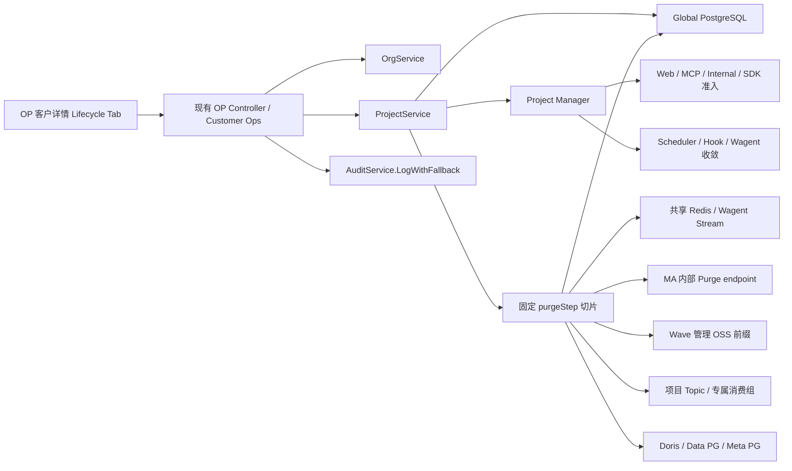
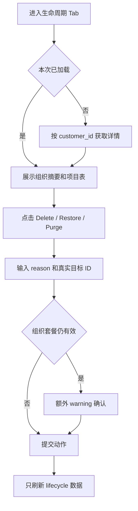

# Wave 组织与项目生命周期治理：详细设计

| 元数据 | 内容 |
| --- | --- |
| 目录 | `20260716-Wave-Refac-OrganizationProjectLifecycle` |
| 创建日期 | 2026-07-17 |
| 状态 | 待评审 |
| 关联规格 | [01-spec.md](./01-spec.md) |
| 关联方案 | [03-plan.md](./03-plan.md) |

## 1. 设计边界

本详细设计把已确认的生命周期语义落到 Wave 的文件、函数和数据资源。核心边界不变：

- Delete/Restore 只改 Global PG 状态和 PM 可用目录，不删除 Scheduler Job、Schema、Topic、OSS、成员或业务 Redis。
- Purge 是 OP 单次同步调用，按固定步骤完整重跑；不建执行表、步骤账本、后台任务或资源注册中心。
- 组织和项目都使用 `ENABLE/DISABLE`；项目继续保留 `INITIALIZING`，不新增 `DELETED`。
- 历史 `DISABLE` 由用户人工清理，代码不提供迁移、批处理、扫描页或历史状态兼容分支。
- PM 是项目可用目录和 Delete/Restore 通知通道，不承担 Purge 编排。

## 2. 代码现实校验与修正

| Plan 假设 | 代码核对 | 详细设计结论 |
| --- | --- | --- |
| Project 已有可复用状态 | `apps/web/dao/global/project.go` 已有 `INITIALIZING/ENABLE/DISABLE` | 不改项目状态集合 |
| 当前 Delete 很重 | `apps/web/service/project/delete.go` 会删 Job、Doris、Meta/Data PG、Kafka、成员和 PM | `Archive`/旧 `Delete` 拆为轻量 Delete、Restore、Purge；旧物理 helper 仅供 Purge |
| Organization 可直接复用状态 | `organization` 当前没有 `status` | 只新增一个 `status` 字段，历史行默认 `ENABLE` |
| PM 能传播可用性 | `SetInfo/DeleteInfo` 存在，但部分写只告警、调用节点不立即更新、订阅关闭后退出 | 修正可靠性，不增加新事件或 ACK |
| 所有后台执行都依赖 PM | Scheduler live cron/Worker、MCP、Internal S2S、LiveEvent、Wagent 有旁路 | 在现有统一入口补检查，不引入通用生命周期中间件 |
| Dispatch Delete 已能关闭项目 | `Node.OnProjectDelete` 只删 `counts`；`refreshTopo` 跳过 Redis 残留项目却不设置 `changedProject` | 在现有 refresh 标记这类项目，下一轮重写 task map 并触发 TaskManager 关闭 |
| Web 能直接清全部 Redis | MA 使用独享 Redis，Web 没有其连接配置 | MA 增加一个窄的内部 Purge endpoint；这是完整清理所需的唯一新增跨进程调用 |
| Kafka Topic 名可以硬编码 | PM `Conf` 已持有 Topic，Connector/MA 还有项目消费组 | Purge 从持久配置和 pipeline 记录收集名称；C1 全局消费组不得删除 |

MA 独享 Redis 是代码核对后补出的实现边界：增加 `project_ma` 步骤和 `sw_ma_base_url`，但不改变产品 API、PM 职责或同步 Purge 语义。

## 3. 实现总览



只有两类新 seam：Project/Organization 现有 Service 的生命周期方法，以及 MA 的内部项目清理 endpoint。其余改动都落在已有统一入口或已有 PM Hook。

## 4. 文件与函数级改动范围

### 4.1 状态、DAO、Service 与迁移

| 文件 | 函数/结构 | 改动 |
| --- | --- | --- |
| `apps/web/dao/global/project.go` | `ProjectDao` | 保留现有状态常量；新增 `UpdateStatusIf`、`MarkPurging`、生命周期列表/计数；`GetByIDWithDeleted` 供 Purge 重试 |
| `apps/web/dao/global/organization.go` | `Organization`、`OrganizationDao` | 新增 `Status`、`ENABLE/DISABLE` 常量、`GetByIDWithDeleted`、条件状态更新、Purge marker、硬删除 |
| `apps/web/dao/global/project_member.go` | `ProjectMemberDao` | 新增按 project ID 硬删除，供最终 Global 事务使用 |
| `apps/web/dao/global/member_invite.go` | `MemberInviteDao` | Project Purge 从 `project_ids` 和 `invite_conf.project_auth` 移除项目；Organization Purge 硬删本组织邀请 |
| `apps/web/dao/global/account_api_token.go` | `AccountAPITokenDao` | 批量读取/更新仍有效 token 的 `scopes`，移除被 Purge 的 project/org ID；不删除共享 Account/token |
| `apps/web/service/project/delete.go` | `Archive`、全局 `Delete`、资源 helper | 删除 `Archive` 和旧全局 `Delete`；实现 `ProjectService.Delete/Restore/Purge`；物理 helper 改为幂等 Purge step |
| `apps/web/service/project/project.go` | `ProjectService`、`UpdateProjectAndCacheTransaction` | 注入 PM/Redis/资源依赖；普通配置更新改为显式字段和 `status=ENABLE,is_deleted=false` 条件，禁止整行 `Save` 覆盖生命周期 |
| `apps/web/service/project/create.go` | `initProject`、`InitProjectResources`、组织读取 | 与 Purge 使用相同项目锁；创建和初始化要求父组织 `ENABLE,false` |
| `apps/web/service/organization/organization.go` | `Archive`、`getOrgOrFail` | 移除 `Archive`，新增 `Delete/Restore/Purge`；普通业务 helper 拒绝非 `ENABLE`，生命周期 helper 可读墓碑 |
| `script/sql/pgsql/global.sql` | `organization` DDL | 增加 `status VARCHAR(64) NOT NULL DEFAULT 'ENABLE'`；修正 project status 注释为实际三态 |
| `script/migration/scripts/global_v20260717_organization_project_lifecycle.sql` | 新迁移 | 只增加 organization status；不写 token、不注册服务身份、不回填 project、不改索引 |

### 4.2 PM、Scheduler 和准入面

| 文件 | 函数/结构 | 改动 |
| --- | --- | --- |
| `pkg/pm/project_manager.go` | `SetInfo`、`DeleteInfo`、`onSetInfo`、`onDeleteInfo`、`autoSubscribe`、`rdbLoadAllProjects` | 关键 Redis 错误上抛；写后立即更新本地；相同状态不重复触发 Hook；订阅断开重连并全量对账 |
| `pkg/scheduler/master.go` | `doOnJobNotify`、`wrappedJobCron.Run` | 创建/刷新 cron 和生成 Instance 前检查 `pmManager.GetInfo`；项目不可用时跳过，不删除 Job |
| `pkg/scheduler/worker.go` | `WorkerDependencies`、`onJobInstanceNotify`、`onJobTaskNotify`、`leaseJobInstance`、`leaseJobTask` | 注入现有 `pm.IManager`；领取和 heartbeat 检查项目；禁用时释放长期执行且不制造紧凑重试 |
| `pkg/scheduler/purge.go` | 新增 `PurgeProjectRedisState(ctx, rdb, projectID)`：只移除目标项目的全局 notify/delayed member 和项目 heartbeat/lease Key；不删除 Job |
| `pkg/ginx/middleware/project.go` | `ProjectFilter`/白名单 | 保留 PM 门禁；移除已删除租户 lifecycle route 的白名单分支 |
| `pkg/ginx/middleware/organization.go` | `OrganizationFilter`/路由取 ID | 保留现有 Account API Token 解析；普通会话访问组织资源时统一要求组织 `ENABLE,false`，OP、创建和邀请 token 流程按边界放行 |
| `apps/web/mcp/tools/context.go` | `authorizeProjectContext` | 解析 project ID 后、成员和 scope 校验前检查 PM；复用 `ErrProjectUnauthorized` |
| `apps/web/service/pipeline/internal_metadata.go` | `requireInternalProject` 及各内部方法 | 增加 `requireInternalProjectEnabled`，仅新工作入口调用；finalize/update 回调保持可用 |
| `apps/web/ma/service/*` | Internal MA 读/写方法 | 新工作入口检查 PM；已有执行回写不额外阻断 |

### 4.3 组件本地状态与旁路

| 文件 | 当前问题 | 最小改动 |
| --- | --- | --- |
| `apps/edge/service.go` | `OnProjectDelete` 为空 | 在现有锁下删除 `token2id`、`pipelineVersion`、`internalSecrets` 的项目项 |
| `apps/adtol/api/router.go` | 每次请求已由 PM Token 查项目 | 不改生产逻辑，只加 Delete/Restore 回归测试 |
| `apps/abol/service/abol.go` | 已在 Delete Hook 停止并移除 AB Core | 不改生产逻辑，只补幂等和 Restore 测试 |
| `apps/connector/service/pipeline.go` | Hook 为空，但没有独立项目 map | 不增加假清理；长期 runner 由 Scheduler Worker 收敛 |
| `pkg/dispatch/node.go`、`pkg/dispatch/manager.go` | Hook 删除计数后，若没有其他 topology 变化，Redis task map 可能不重写 | `refreshTopo` 发现 active task map 中项目已不在 `counts` 时设置 `changedProject[p]=true`；沿用现有重写和 Pub/Sub，让 TaskManager 关闭，不加新 wake channel |
| `apps/c1/metadata/metadata.go`、`apps/c1/main.go` | 四个项目 metadata map 未驱逐 | 增加 `DeleteProjectStores(projectID)`；注册一个只做驱逐的 PM Hook |
| `apps/ma/service/configsync/sync.go` | 已有 Delete Hook | 保留 `Untrack`；不在这里承担其他 MA 资源编排 |
| `apps/ma/service/cohortindex/index.go`、`watcher.go` | cohort entry/watcher 可在项目停止后残留 | 增加幂等 `DeleteProject`，删除项目 entry 并取消项目 watcher |
| `apps/ma/service/eventconsumer/coordinator.go` | `matchers` 按项目缓存 | 增加幂等 `DeleteProject` 驱逐 matcher |
| `apps/ma/service/dispatch/feedback.go` | 项目 feedback queue/token cache 可继续发送 | 增加幂等 `DeleteProject`，丢弃项目内存队列并驱逐 token cache |
| `apps/ma/server/server.go` | Runtime 装配上述本地资源 | Runtime 注册 PM Hook；Delete 驱逐 cohort/watcher/matcher/feedback，Purge endpoint 复用同一幂等清理 |
| `apps/web/qe/catalog/catalog.go` | `catalogPMHook.OnProjectDelete` 为空 | 在 `catalogsMu` 下删除项目 Catalog；Restore 后懒加载 |
| `apps/web/service/liveevent/liveevent.go` | 只在连接建立时检查 PM | 实现 PM Hook；Delete 关闭项目 consumer 和 WebSocket，移除 map；Restore 由新连接懒启动 |
| `apps/web/wagent/service/runtime/execution.go`、`local_executor.go`、`compaction.go` | Stream consumer 可绕过 Web PM 门禁 | `Service` 注入项目可用检查；claim/start 前拒绝，禁用消息不 ACK、不 XDEL |
| `apps/web/wagent/service/runtime/queue.go` | 项目数据分散在项目前缀 Key 和全局 Stream | 新增项目运行状态检查和同步 `PurgeProject`，定向删除该项目 Stream/DLQ 条目 |
| `apps/web/wagent/service/tokenquota/service.go`、`ratelimit/ratelimit.go` | quota Key 使用 `wagent:quota:{pid:week}`，execution rate-limit Key 的 project ID 位于中段 | 各增加幂等 `PurgeProject`；按固定 namespace SCAN 后解析 project ID，只删除目标项目，provider 全局限流不删 |
| `apps/web/wagent/service/tool/mcp_client.go` | tool list 是含 project ID 的进程内 TTL cache，不能自行执行工作 | 不增加 Delete Hook；Wagent claim/start 和 MCP 授权门禁已阻断使用，沿用原 TTL 淘汰 |
| `apps/web/service/permission/cache.go`、`asset/permission/cache.go` | 项目/资产权限 Key 使用各自 `sol:*` namespace，不都带通用 `p:<pid>:` | Purge 按固定 literal prefix 删除目标项目 Key；Delete/Restore 不清缓存 |
| `apps/web/qe/catalog/notifier.go` | 两类项目 refresh lock 位于 `sys:view...`/`sys:catalog...` | Purge 删除目标项目两个精确 lock Key；Delete 只驱逐内存 Catalog |
| `apps/web/service/asset/behavior.go` | 每项目 batcher 可长期存活 | 增加幂等 `CloseProject` 并注册现有单例为 PM Hook；关闭前沿用现有 drain+flush，随后移出 map，Restore 懒创建 |

### 4.4 Purge 资源 client 与 MA 内部接口

| 文件 | 改动 |
| --- | --- |
| `pkg/dal/redisx/redis.go` | 增加 `KeysByPrefix`、`DeleteByPrefix`、`LRange/LRem`、`XRangeN`：Standalone/Cluster 分节点 SCAN，Delete 分批执行并二次确认；prefix 不接受通配表达式；其余方法直接薄封装 go-redis |
| `pkg/dal/redisx/mock_redis.go` | 补上述方法的 mock，供 Purge/MA/Wagent 测试 |
| `pkg/dal/kafkax/admin.go` | 增加 `ListConsumerGroups` 和幂等 `DeleteConsumerGroups`；不存在视为成功，其他 broker 错误上抛；Project Purge 只按已知精确名称/前缀筛选 |
| `apps/web/service/project/ma_purge.go` | 用现有 `net/http` 和请求 context 调用 MA endpoint；认证 token 来自 Web 配置，响应非成功即返回 `project_ma` 依赖错误 |
| `apps/web/service/account/apitoken/service.go` | 让现有 `DeleteTokensCache` 返回 Redis error；Purge 在 Global 事务前严格驱逐相关 token cache，提交后再 best-effort 重复一次以缩小并发回填窗口 |
| `apps/ma/server/server.go` | `Runtime.PurgeProject(ctx, projectID)`：先复用本地驱逐，再从共享和独享 Redis 删除 `ma:{p:<id>}:*`，并删除 `{groupPrefix}.{id}` consumer group；运行静默由 Web Purge 前置检查保证 |
| `cmd/ma/main.go` | 在现有 health/metrics `ServeMux` 注册 `POST /internal/v1/project/purge`，常量时间校验专用 Secret、调用方 `web` 和正整数 Project header；不为此引入 Gin 或 Global DB |
| `pkg/config/app_cfg.go` | 增加 `MaBaseUrl`（`sw_ma_base_url`，默认 `http://127.0.0.1:8112`）和共享的 `MAProjectPurgeToken`（`yaml:"-" env:"MA_PROJECT_PURGE_TOKEN"`）；WebConf/MaConf 已内嵌 AppConf，直接复用，不重复声明 |
| `configs/web/web.*.yml` | 只配置 `sw_ma_base_url`；token 通过部署 Secret 注入 |

这里不让 Web 读取 MA 独享 Redis 密码，也不把 MA 清理塞进 PM Hook。内部 endpoint 只有一个项目级 Purge 动作，并且只由 Web lifecycle service 调用。

### 4.5 OP 后端、OpenAPI 与前端

| 文件 | 改动 |
| --- | --- |
| `apps/web/op/dto/lifecycle.go` | 新增 lifecycle detail、action request/result DTO |
| `apps/web/op/dto/customer.go` | 增加六个 audit action 常量；复用既有 target/result 常量 |
| `apps/web/op/service/service_runtime.go` | 扩展现有 provider 接口以调用 Org/Project lifecycle；不新增 lifecycle service |
| `apps/web/op/service/customer_profile.go` | 增加 customer-scoped lifecycle detail 聚合 |
| `apps/web/op/service/customer_project_ops.go` | 增加 Project Delete/Restore/Purge；归属、确认、reason、审计在这里完成 |
| `apps/web/op/service/customer_org_ops.go` | 增加 Organization Delete/Restore/Purge；复用现有审计 builder |
| `apps/web/op/controller/lifecycle.go` | 新增七个薄 Controller，参数转换后调用现有 Customer Ops |
| `apps/web/op/converter/lifecycle.go` | DAO/Service 结果转 API DTO，不承载状态规则 |
| `api/web/web.openapi.yaml` | 删除两个租户 operation，增加七个 OP operation 和精确 schema |
| `api/web/codegen/api.gen.go`、`api/web/codegen/client/client.gen.go` | 由 `go generate ./api/web` 重新生成，不手改 |
| `apps/web/controller/project/project.go`、`organization/organization.go` | 删除租户 `DeleteProject/DeleteOrg` Controller |
| `apps/web/controller/controller.go` | 删除旧转发、增加 OP lifecycle 转发；与生成接口保持一致 |
| `fe/src/modules/op/components/LifecycleTab.vue` | 组织摘要、项目表、行级动作；不做搜索、分页、批量和统计卡 |
| `fe/src/modules/op/components/LifecycleConfirmDialog.vue` | 复用一个 Dialog 输入 reason 和目标 ID；套餐有效时由外层再弹一次 warning |
| `fe/src/modules/op/views/CustomerDetail.vue` | 在 billing 后、audit 前增加 `lifecycle` Tab |
| `fe/src/modules/op/composables/useCustomerDetail.ts` | 首次进入 Tab 懒加载；动作成功或网络未知时只刷新 lifecycle 数据 |
| `fe/src/modules/op/services.ts`、`types.ts`、`copy.ts` | 七个请求、精确 TS 类型和中文文案 |

## 5. 数据模型与条件更新

### 5.1 Migration

```sql
ALTER TABLE organization
    ADD COLUMN IF NOT EXISTS status VARCHAR(64) NOT NULL DEFAULT 'ENABLE';

COMMENT ON COLUMN organization.status IS '组织状态：ENABLE/DISABLE';
```

| 表 | 字段 | 类型/约束 | 兼容性 |
| --- | --- | --- | --- |
| `organization` | `status` | `VARCHAR(64) NOT NULL DEFAULT 'ENABLE'` | 旧代码忽略该列；旧 INSERT 自动取默认值 |
| `project` | 无变更 | 继续使用现有 `status`、`is_deleted` | 无数据回填 |

不新增索引：组织生命周期详情按主键/客户绑定读取，普通列表已有 `is_deleted` 条件；给低基数字段加索引没有当前查询收益。现有名称部分唯一索引不变，Delete 后名称仍被占用。

### 5.2 DAO 方法

```go
// project.go
func (d *ProjectDao) UpdateStatusIf(
    ctx context.Context, projectID int64, from, to string, updatedBy int64,
) (changed bool, err error)
func (d *ProjectDao) MarkPurging(
    ctx context.Context, projectID int64, updatedBy int64,
) (changed bool, err error)
func (d *ProjectDao) ListLifecycleByOrg(ctx context.Context, orgID int64) ([]Project, error)
func (d *ProjectDao) CountAllRowsByOrg(ctx context.Context, orgID int64) (int64, error)

// organization.go
func (d *OrganizationDao) UpdateStatusIf(
    ctx context.Context, orgID int64, from, to string, updatedBy int64,
) (changed bool, err error)
func (d *OrganizationDao) MarkPurging(
    ctx context.Context, orgID int64, updatedBy int64,
) (changed bool, err error)
func (d *OrganizationDao) GetByIDWithDeleted(ctx context.Context, orgID int64) (*Organization, error)
func (d *OrganizationDao) DeleteRecord(ctx context.Context, orgID int64) error
```

条件必须写进 SQL：

- Project Delete：`id=? AND status='ENABLE' AND is_deleted=false`。
- Project Restore：`id=? AND status='DISABLE' AND is_deleted=false`。
- Project 首次 Purge：`id=? AND status IN ('DISABLE','INITIALIZING') AND is_deleted=false`。
- Project Purge 重试：`id=? AND is_deleted=true`，不再次改变状态。
- Organization Delete/Restore 同样使用 `ENABLE/DISABLE` 条件。
- Organization Purge marker：`status='DISABLE' AND is_deleted=false`；墓碑允许重试。

`UpdateProjectAndCacheTransaction` 不再 `Save(metaInfo)`，只更新 `conf/sign/version/updated_by`，并带 `status=ENABLE AND is_deleted=false AND version=?`。这样旧请求不能在生命周期操作后把整行状态覆盖回去。

## 6. 生命周期 Service

### 6.1 锁与正确性

- Redis Key：`sys:lifecycle:org:<orgID>`、`sys:lifecycle:project:<projectID>`。
- owner 使用请求内随机值，固定按“组织锁 → 项目锁”获取，使用现有 owner-safe `AcquireLock/ReleaseLock`。
- TTL 固定 30 分钟；锁过期不作为正确性保障，条件 UPDATE、Purge 墓碑和幂等资源删除才是最终保障。
- Project Create/初始化与 Project lifecycle 使用相同项目锁；Organization lifecycle 与 Project Create 使用相同组织锁。
- 获取不到锁返回现有 Conflict，不轮询、不排队、不建锁续租器。

### 6.2 Project Delete

```go
func (s *ProjectService) Delete(ctx context.Context, projectID int64) error
```

1. 锁定组织和项目，使用 `GetByIDWithDeleted` 重读。
2. `is_deleted=true` 或 `INITIALIZING` 返回 Conflict；父组织必须 `ENABLE,false`。
3. 项目已 `DISABLE` 时仍调用 `PM.DeleteInfo`，用于修复上次部分失败，然后成功返回。
4. 项目为 `ENABLE` 时先 `PM.DeleteInfo`，再条件更新为 `DISABLE`。
5. 不调用任何 `delete*Resources`、JobDelete/JobStop、成员/邀请/token 变更。

PM 先失效保证 fail-closed。若 PM 成功而 DB 失败，接口返回失败；下一次 Delete 会重试。审计记录实际 DB before/after 和失败原因。

### 6.3 Project Restore

```go
func (s *ProjectService) Restore(ctx context.Context, projectID int64) error
```

1. 锁内要求父组织 `ENABLE,false`，项目 `DISABLE,false`；墓碑和 `INITIALIZING` 拒绝。
2. 条件更新 `DISABLE -> ENABLE`。
3. 从项目现有 `conf/secret/version` 构造 `pm.Info`，调用 `PM.SetInfo`。
4. 若项目已 `ENABLE,false`，不再更新 DB，但仍重发 `SetInfo` 后成功，修复上次 PM 失败。

不等待 Scheduler、Hook 或远端进程 ACK；不检查或重建任何项目资源。

### 6.4 Project Purge

```go
type PurgeResult struct {
    ResourceID    int64
    Step          string
    Purged        bool
    AlreadyAbsent bool
}

func (s *ProjectService) Purge(ctx context.Context, projectID int64) (PurgeResult, error)
```

首次和重试都执行完整切片：

```go
type purgeStep struct {
    name string
    run  func(context.Context, *dao.Project) error
}
```

| 顺序 | 稳定 step | 实现与成功条件 |
| --- | --- | --- |
| 0 | `project_quiescence` | 确保 PM 不含项目；Scheduler 无 Running Instance/Task/有效 lease，Dispatch 任务数为 0，Wagent 无 Running execution；不满足返回 Conflict，不写墓碑 |
| 1 | `project_marker` | 条件设置 `is_deleted=true`；重试墓碑直接通过 |
| 2 | `project_redis` | 先调用 `scheduler.PurgeProjectRedisState` 清全局 notify/delayed member 和项目 lease；Wagent 定向清 execution/compaction Stream/DLQ、`wagent:quota:{<id>:` 和解析后匹配项目的 execution rate-limit Key；删除 `sol:perm:v5:account_perm:pid:<id>:`、两类 `sol:asset:perm:v1:` 项目前缀、QE 两个精确 lock、`sol:project_org:project:<id>`，最后删共享 Redis `p:<id>:*`；生命周期锁不匹配这些前缀 |
| 3 | `project_ma` | 同步调用 MA 内部 endpoint，从共享/独享 Redis 清 `ma:{p:<id>}:*` 并删除 `{groupPrefix}.{id}`；不存在视为成功 |
| 4 | `project_oss` | 对 `load/<id>/`、`backfill/<id>/`、`events_cron/<id>/`、`users_cron/<id>/` 逐个调用 `DeleteByPrefix` 并复查为空；客户自有 S3/TOS/ByteHouse 路径不属于 Wave 管理，不删除 |
| 5 | `project_kafka` | 删除 PM Conf 中四类项目 Topic；删除 Meta pipeline 派生的 `event2webhook_<pid>_<pipelineID>`、`event2kafka_<pid>_<pipelineID>`；列举并删除 `live-event-<pid>-` 前缀组；MA 组由 `project_ma` 删除；不删 C1 全局 group |
| 6 | `project_doris` | `DROP DATABASE IF EXISTS` 项目 Database |
| 7 | `project_pgdata` | `DROP SCHEMA IF EXISTS ... CASCADE` |
| 8 | `project_meta` | `DROP SCHEMA IF EXISTS ... CASCADE`；Scheduler Job/Instance/Task 随 Schema 清除 |
| 9 | `project_global` | 单个 Global PG 事务清引用并硬删 project 主记录 |

Topic、Connector group 和项目信息必须在 Meta/Global 删除前收集到内存。Topic 优先使用持久 `Project.Conf`，只有字段缺失时回退现有 `df_<pid>_*` 命名。

`project_global` 在事务前先按预先收集的 `account_id/token_hash` 严格删除相关 Account API Token cache；失败则保留项目墓碑并停止。随后单个事务只做本库操作：

1. 硬删 `project_member`。
2. 从本组织有效 `member_invite.project_ids` 和 `invite_conf.project_auth` 移除 project ID；空数组保留为空，不删邀请。
3. 从有效 `account_api_token.scopes.project_ids` 移除 project ID；`all_projects=true` 不改。
4. 硬删 project 主记录。

事务提交后 best-effort 再删一次相同 token cache，并清仍残留的 PM info。第二次缓存失败只记录 warning：源 scope 和项目主记录已经删除，PM/普通 DAO 仍拒绝目标，缓存至多按现有 TTL 自然过期；不把已完成的物理 Purge 伪装成回滚。重复 Purge 以主记录不存在返回 `already_absent=true`。

### 6.5 Organization 生命周期

```go
func (s *OrgService) Delete(ctx context.Context, orgID int64) (blockedIDs []int64, blockedCount int64, err error)
func (s *OrgService) Restore(ctx context.Context, orgID int64) error
func (s *OrgService) Purge(ctx context.Context, orgID int64) (PurgeResult, error)
```

- Delete：组织锁内读取所有 `is_deleted=false` 项目；只有全部为 `DISABLE` 才允许 `ENABLE -> DISABLE`。阻塞 ID 最多返回 20 个，同时返回总数；不自动 Delete 项目。
- Restore：`DISABLE,false -> ENABLE,false`；不 Restore 项目、不发布项目 PM。
- Purge：组织必须 `DISABLE`，并且 `CountAllRowsByOrg=0`，包括 project 墓碑；然后标记组织墓碑。
- Organization 在最终 Global 事务前严格删除待删 role 和待改 token 的 cache；随后事务硬删 `member_invite`、`organization_member`、`role` 和 organization，并从 token scopes 移除 org ID；保留 Account、OP customer profile、合同和审计。提交后 best-effort 再删相同 cache，处理并发回填窗口。
- Purge 成功后调用既有 `ExpireCustomerByOrgID`，使客户绑定保持 `expired`；客户历史仍可审计。

普通业务 DAO 查询（`GetByID/GetByIDs/GetByName/ListAllActive`）统一过滤 `status=ENABLE AND is_deleted=false`。Lifecycle、Purge 重试和系统初始化显式使用 `GetByIDWithDeleted`；不通过全局 GORM scope 或新 repository 抽象隐式改写查询。

### 6.6 MA 内部 Purge 契约

```text
POST /internal/v1/project/purge
Authorization: Bearer <MA_PROJECT_PURGE_TOKEN>
X-Internal-Service: web
Project: <positive int64>
Body: none
```

- `204`：MA 项目 Key 和消费组均已不存在；重复调用仍返回 204。
- `400`：Project header 缺失或不是正整数。
- `401`：Secret 缺失/不匹配，或调用方不是 `web`。
- `500`：Redis/Kafka 删除失败；Web 停在 `project_ma`，保留项目墓碑。
- Secret 使用 `subtle.ConstantTimeCompare`；handler 使用请求 context，不转后台、不记录 token；Web client 不自动重试，由整个 Project Purge 重跑。

## 7. PM 与运行面收敛

### 7.1 PM 写入和对账

`SetInfo` 按 `info -> membership -> local -> publish` 执行。`DeleteInfo` 在成功删除 membership 后立即删除本地状态，并且无论 info 删除是否失败都尝试 publish；最后返回首个错误。这样调用节点先 fail-closed，远端也尽量及时收敛。任何 Redis 持久写失败均返回错误，调用方通过重复动作修复传播。

为避免调用节点随后收到自己的 Pub/Sub 再触发 Hook：

- `onSetInfo` 比较完整持久 payload；相同则不触发 Hook。
- `onDeleteInfo` 在本地不存在时不触发 Hook。
- `autoSubscribe` 外层循环在 channel 关闭后等待固定 1 秒再订阅；不引入 backoff 库。
- 每次订阅成功后调用 `rdbLoadAllProjects`，对快照内新增/变化项目执行 set，对本地多余项目执行 delete。

如果快照读取失败，保留当前本地状态并继续重试；不把空快照误认为全部删除。

### 7.2 Scheduler

`WorkerDependencies` 直接增加 `ProjectManager pm.IManager`，生产默认 `pm.DefaultManager()`，测试注入 fake；不增加单实现 `ProjectStateProvider`。

- Master：`doOnJobNotify` 入口和 `wrappedJobCron.Run` 在生成 Instance 前检查 PM。已有 cron entry 可以保留；Delete 时每次 tick 只跳过，Restore 后下一 tick 恢复。
- Worker：`onJobInstanceNotify` 在查/抢 DB 前检查，`onJobTaskNotify` 在 `AcquireTask` 前检查。
- Heartbeat：`leaseJobInstance`、`leaseJobTask` 发现项目不存在时取消 handler，释放 ownership，不递增业务失败重试次数，也不立即重新 notify。
- 禁用期间 Redis notify 不 ACK 为成功；Meta PG Pending/Retrying 状态保留，Restore 后依赖现有 master repair/re-notify。
- Delete 不直接改 Job/Instance/Task；Purge 只在确认长期执行静默后由 Drop Meta Schema 清除。

`PurgeProjectRedisState` 只用于 Purge：

1. 删除 `jobinstances:<pid>` heartbeat ZSet 和 `jobtasks:<pid>` lease ZSet。
2. 分页读取全局 job notify List、job delayed ZSet，按现有 parser 只移除目标 project ID 的 value/member。
3. 用 `KeysByPrefix` 找出各 JobGroup 的 instance notify/delayed 和 task notify Key，再分页解析并移除目标项目项。
4. 删除导致列表位移时从当前 offset 继续；完整一轮没有目标项才结束。PM 已移除且 Worker 已静默，因此不会持续产生新项。

不删除 Scheduler 全局 Key、其他项目 member 或 Job 定义，也不建设通用队列过滤器。

该默认依赖覆盖 Web、Connector 和 MA 三处生产 Worker 装配，无需逐服务再写门禁。

### 7.3 Internal S2S 精确边界

以下入口要求 `PM.GetInfo(pid) != nil`，拒绝 Delete 项目产生新工作或向执行面提供新配置：

- `GET /internal/v1/ab/configs`
- `POST /internal/v1/pipeline/process`
- `GET /internal/v1/pipeline/detail`
- `GET /internal/v1/pipeline/enabled-count/list`
- `GET /internal/v1/pipeline/export-property/list`
- `GET /internal/v1/pipeline/run/latest-success`
- `POST /internal/v1/pipeline/run/start`
- `GET /internal/v1/pipeline/load-file/offset/list`
- `GET /internal/v1/pipeline/load-file/ready-list`
- `POST /internal/v1/pipeline/load-file/create`
- `GET /internal/v1/pipeline/backfill/detail`
- `GET /internal/v1/pipeline/backfill/running`
- `GET /internal/v1/ma/running-campaigns`
- `POST /internal/v1/ma/materialize-fanout`

以下回调继续允许，以便 Delete 前已经开始的有限工作落最终状态：

- `POST /internal/v1/pipeline/update`
- `POST /internal/v1/pipeline/run/finish`
- `POST /internal/v1/pipeline/run/update`
- `POST /internal/v1/pipeline/load-file/update`
- `POST /internal/v1/pipeline/backfill/update`
- `POST /internal/v1/pipeline/backfill/window/advance`
- `POST /internal/v1/pipeline/backfill/window/complete`

`InternalProjectContext` 仍只负责解析 Header，因为同组还包含不带项目的 admin endpoint；不要在 middleware 中全局阻断。

### 7.4 Organization HTTP 准入

复用现有 `OrganizationFilter`，不在每个 Controller 重复状态判断。普通会话按当前路由的既有参数位置提取组织 ID，并通过普通 Organization DAO 查询确认 `ENABLE,false`：

- Path：`GET /org/{id}`。
- Query：`GET /org/config`、`GET /org/billing`。
- Body：`POST /org/info/update`，成员 list/update/delete/supervisor replace、邀请 list/create，以及 `POST /org/role/list`。
- `GET /org/list` 没有单一组织 ID，由 DAO 直接过滤非 `ENABLE` 组织。
- `POST /org/create` 直接放行；邀请 info/accept 先按 token 解析组织，再由普通 Organization 查询拒绝 `DISABLE`。
- `/op/*` 不经过生命周期拦截，OP lifecycle Service 使用 WithDeleted 查询，保证仍能管理已 Delete 组织。
- Account API Token 保留现有组织 ID 注入和格式校验，只补同一状态检查；不改变其 scope 语义。

无法解析必需 organization ID、组织不存在或为 `DISABLE` 时，沿用现有无权限/不存在错误，不增加生命周期专属错误码。

## 8. Purge 资源所有权矩阵

| 资源 | Delete/Restore | Purge owner | 幂等判定 |
| --- | --- | --- | --- |
| Global project/org 主记录 | 状态变更 | Project/Org Service | 不存在成功 |
| 成员、邀请、role、token scopes | 不变 | Global 最终事务 | DELETE/数组移除影响 0 行成功 |
| PM membership/info/local map | Delete 移除、Restore 重建 | PM | absent/相同 payload 成功 |
| 共享 Redis `p:<pid>:*` | 不变或自然 TTL | redisx | 二次 SCAN 无匹配 |
| Scheduler 全局通知/项目 lease | Delete 保留 | scheduler | 解析 List/ZSet member 只删目标 pid；项目 heartbeat/lease Key 不存在 |
| Wagent 全局 Stream/DLQ | Delete 不 ACK 项目消息 | Wagent Runtime | 分页 XRANGE，XACK+XDEL 目标项目条目；重跑 0 条成功 |
| Wagent quota/rate-limit | Delete 保留或按 TTL 过期 | Wagent Runtime | quota 固定前缀及解析后匹配 pid 的 execution rate-limit Key 均不存在；provider 全局 Key 不删 |
| 权限/资产权限/QE/Project→Org cache | Delete 保留或驱逐内存 | Project Purge | 固定项目前缀与精确 Key 不存在 |
| Account API Token scope cache | Delete 不改 scope | Project/Org Purge | 事务前严格驱逐、提交后重复驱逐；源 scope/目标不存在保证旧缓存不可继续访问目标 |
| MA 共享/独享 Redis | Delete 只停止新执行 | MA Runtime | 两个 Redis 均无 `ma:{p:<pid>}:*` |
| OSS 四个 Wave 项目前缀 | 不变 | ossx global storage | `load/backfill/events_cron/users_cron` 的 `<pid>/` 均为空；外部客户 bucket 不在范围 |
| Kafka 项目 Topic | 不变 | Project Purge | Topic 不存在成功 |
| Connector 项目消费组 | 不变 | Project Purge | group 不存在成功 |
| LiveEvent 项目消费组 | Delete 关闭当前 consumer | Project Purge | broker 中无 `live-event-<pid>-` 前缀 group |
| MA 项目消费组 | 不变 | MA Runtime | group 不存在成功 |
| C1 extractor group | 不变 | 不删除 | 全局共享，删除会影响其他项目 |
| Doris 项目 Database | 不变 | dorisx | `DROP DATABASE IF EXISTS` |
| Data PG Schema | 不变 | pgsqlx | `DROP SCHEMA IF EXISTS CASCADE` |
| Meta PG Schema/Job | 不变 | metadb | `DROP SCHEMA IF EXISTS CASCADE` |
| Edge/C1/QE/LiveEvent/Asset 内存 | Delete Hook 驱逐 | 各现有进程 | map absent/Close 幂等 |

MA endpoint 或任何基础设施失败时停止在当前 step，保留 project 墓碑；不继续删下游 Schema，也不尝试逆向恢复已删资源。

## 9. OP API、权限和审计

### 9.1 OpenAPI schema

```yaml
CustomerLifecycleGetRequest:
  type: object
  required: [customer_id]
  properties:
    customer_id: { type: integer, format: int64, minimum: 1 }

CustomerLifecycleProjectActionRequest:
  type: object
  required: [customer_id, project_id, confirm_value, reason]
  properties:
    customer_id: { type: integer, format: int64, minimum: 1 }
    project_id: { type: integer, format: int64, minimum: 1 }
    confirm_value: { type: string, minLength: 1, maxLength: 32 }
    reason: { type: string, minLength: 1, maxLength: 1000 }

CustomerLifecycleOrgActionRequest:
  type: object
  required: [customer_id, organization_id, confirm_value, reason]
  properties:
    customer_id: { type: integer, format: int64, minimum: 1 }
    organization_id: { type: integer, format: int64, minimum: 1 }
    confirm_value: { type: string, minLength: 1, maxLength: 32 }
    reason: { type: string, minLength: 1, maxLength: 1000 }
```

详情 response 精确复用 spec 的 `CustomerLifecycleDetail/LifecycleOrganization/LifecycleProject`。动作 success data：

```text
LifecycleActionResult {
  resource_id: int64
  status?: "ENABLE" | "DISABLE"
  purged: bool
  already_absent: bool
}
```

Conflict/依赖失败继续使用通用包络，data 只允许：`resource_id`、最多 20 个 `blocked_ids`、`blocked_count`、稳定 `step`、`already_absent`。不新增生命周期错误码族。

### 9.2 权限、归属和审计顺序

每个动作固定执行：

1. 现有 OP `CheckAccess` 校验白名单账号会话。
2. customer 存在且绑定目标 organization；project 必须属于该 organization。
3. `strings.TrimSpace(reason)` 非空，`confirm_value == strconv.FormatInt(targetID,10)`。
4. 捕获只含 `id/status/is_deleted` 的 before snapshot。
5. 调用 Org/Project Service。
6. 用 `AuditService.LogWithFallback` 记录 `success`、`verify_failed` 或 `failed`。

项目主记录已被成功硬删时，OP 层无法再从 project 表验证历史归属。此时只在现有 `op_operation_log` 中存在同一 `customer_id + project_id + project_purge + success` 记录时返回 `already_absent=true`；否则返回 NotFound。该查询复用审计表，不增加 Purge receipt 或新表。

新增 action：`project_delete`、`project_restore`、`project_purge`、`organization_delete`、`organization_restore`、`organization_purge`。Purge 主记录已删除后仍使用步骤 4 捕获的 ID/customer/org 写审计；snapshot 不包含 Secret、Conf、Token 或连接凭据。

## 10. 前端实现

`CustomerDetail.vue` 的用户可见 Tab 顺序改为：合同、配置、账单、生命周期管理、审计（操作记录）。生命周期 Tab 始终在客户详情内；无绑定组织时展示空状态，不跳转其他页面。



- 通用 Dialog 只保留目标、影响说明、reason、ID 输入和确认按钮。
- Project/Organization Purge 使用危险按钮样式；Delete/Restore 对齐现有 Element Plus 风格。
- organization 行在仍有阻塞项目时禁用动作并显示简短原因；不显示“剩余秒数”。
- 网络超时视为结果未知：不自动重发 Purge，关闭 submitting 后刷新详情。
- 套餐有效额外确认使用客户详情已加载的 `latestContract.end_at`，只做 UI 防误触；服务端仍以权限、ID、reason 为安全边界。

## 11. 错误、事务和并发

| 场景 | 返回 | 状态/补偿 |
| --- | --- | --- |
| 非 OP、跨客户、ID/reason 不合法 | PermissionDenied/BadParam | 不调用 lifecycle；写 verify_failed 审计 |
| 生命周期锁占用 | Conflict | 状态不变，人工重试 |
| PM Delete 成功、DB Delete 失败 | Internal/Dependency error | 运行面 fail-closed；重复 Delete 对账 |
| DB Restore 成功、PM Restore 失败 | Dependency error | DB ENABLE 但 PM 不可用；重复 Restore 重发 |
| PM publish 失败 | Dependency error | 本节点已更新；远端由重连快照纠正，调用者可重试 |
| Purge 前有长期执行 | Conflict + `project_quiescence` | 不写墓碑，等待后重试 |
| Purge 任一步失败 | error + 稳定 step | 墓碑保留，从第一步重跑 |
| Purge 请求 context 取消 | 原错误 + 当前 step | 不转后台；已完成资源不回滚 |
| Purge 目标主记录不存在 | success 或 NotFound | 有同 customer/target 成功审计才返回 `already_absent=true`，否则拒绝 |
| Organization 仍有项目行 | Conflict + blocked IDs/count | 不改变组织状态 |

Global PG 的状态切换各是单条条件 UPDATE。Project/Organization 最终清理各使用一个短 Global PG 事务；Redis、MA HTTP、Kafka、OSS、Doris、Data/Meta PG 调用都在该事务之外。

## 12. 测试与验证

### 12.1 单元/包级测试

| 范围 | 主要用例 |
| --- | --- |
| `apps/web/service/project` | Delete/Restore 幂等、父组织约束、INITIALIZING Purge、墓碑重试、步骤失败即停、主记录最后删、普通配置更新不覆盖状态 |
| `apps/web/service/organization` | 全项目 DISABLE 才能 Delete、Restore 不级联、任意 project 行阻塞 Purge、Global 引用清理 |
| `pkg/ginx/middleware/organization` | 普通会话、Account API Token 的各类 ID 来源；DISABLE 拒绝；create、invite token 和 OP 边界 |
| `pkg/pm` | 三个 Redis 写点错误、调用节点立即生效、重复事件不重复 Hook、订阅关闭重连、空/失败快照不误删 |
| `pkg/scheduler` | Master live cron、Instance/Task 领取、heartbeat 取消、Restore 后 repair；Job 定义始终保留 |
| `apps/web/mcp/tools`、Internal service | Delete 项目拒绝新工作，finish/update 仍成功 |
| Edge/ABOL/Dispatch/C1/QE/LiveEvent/Asset | Delete Hook 驱逐、Dispatch 残留 topology 修复和重复 Delete 幂等；Restore 懒加载/重建；Purge 清 LiveEvent 项目消费组 |
| Wagent | disabled 消息不 claim、不 ACK、不 XDEL；Restore 后继续；Purge 只删目标项目 Stream、quota/rate-limit 和 `p:<pid>:` Key |
| MA | Delete 驱逐 cohort/watcher/matcher/feedback、专用 Secret auth、共享/独享 Redis与消费组删除、重复 Purge 成功 |
| OP service/controller | OP 权限、customer 归属、confirm/reason、六种 audit result、已不存在目标有/无历史审计 |
| FE | Tab 顺序、懒加载、确认校验、套餐 warning、网络未知只刷新 |

### 12.2 集成/E2E

1. 建立包含成员、邀请、token scope/cache、权限/QE cache、Job、Redis、Wagent、MA、OSS、Kafka、Doris、Meta/Data PG 的项目 fixture。
2. Delete 前后逐项比对持久资源未减少；所有入口的新工作被拒绝。
3. 执行 project migration，确认 `DISABLE,false` 仍升级。
4. Restore 后普通 Web/MCP/SDK 和下一次 Scheduler tick 恢复；不补 Delete 期间的请求/cron。
5. 每个 Purge step 注入一次失败，确认墓碑保留、后续 step 未执行、完整重跑成功。
6. 多 PM 实例断开 Pub/Sub 后重连，确认本地 map 与 Redis membership/info 一致。
7. Organization 逐项目 Delete/Purge 后才可 Purge，customer profile/合同/审计仍存在。

开发阶段建议验证命令：

```bash
go generate ./api/web
make check_api
go test ./apps/web/service/project ./apps/web/service/organization ./pkg/pm ./pkg/scheduler
go test ./apps/edge ./apps/abol/service ./apps/c1/... ./apps/ma/... ./apps/web/qe/catalog
go test ./apps/web/service/liveevent ./apps/web/service/asset ./apps/web/wagent/service/runtime ./apps/web/op/...
cd fe && yarn test && yarn type-check && yarn build
```

涉及真实 Redis/Kafka/PG/Doris/OSS/MA 的资源矩阵必须在隔离集成环境运行，不能用生产 project ID 做演练。

## 13. 上线、回滚和观测

### 13.1 上线顺序

1. 永久阻断旧租户 `/project/delete`、`/org/delete`；混部期间不开放 OP lifecycle 前端。
2. 执行 organization status migration；给 Web 和 MA 注入同一个 `MA_PROJECT_PURGE_TOKEN`，部署 MA endpoint。
3. 部署 PM、Scheduler、各组件门禁/Hook、Project/Organization Service 和 OP API。
4. 用户人工清理历史 `DISABLE`，并明确确认清理完成；不由代码猜测。
5. 单独部署前端 Tab，开始让 OP 使用新 Delete/Restore/Purge。

不增加长期 feature flag。两阶段发布本身就是 cutover：历史清理完成前不发布前端入口。

### 13.2 回滚

- organization status 列向旧代码兼容，应用回滚时保留该列，不执行 DROP。
- 旧租户 Delete route 继续阻断，不能因回滚恢复旧物理 Delete。
- 已完成 Delete 可由新版 OP Restore；已写 Purge 墓碑或已删除资源的项目不可 Restore，只能继续用新版 Purge 收尾。
- 已开始 Purge 后不得回滚到不认识墓碑的新旧混合版本；先暂停 OP 入口，恢复新版后继续 Purge。

### 13.3 最小观测

复用现有日志和监控，不新增指标平台：

- OP audit 按六个 action/result 查询成功率和失败 step。
- PM 记录 Redis write、subscribe reconnect、snapshot reconcile 数量。
- Scheduler 记录 `project_disabled` skip/cancel 数量。
- Purge 每一步记录 project ID、step、耗时和脱敏错误；不打印 Conf/Secret/token。
- MA internal endpoint 记录调用方 service、project ID、结果和耗时。

## 14. `/simplify` 约束

实现时不得重新引入以下内容：

- `DELETED`、`purge_started_at`、deny Key、生命周期执行表或 receipt。
- 通用 lifecycle coordinator、资源 plugin/adapter registry、状态 DSL、工厂或动态步骤配置。
- PM Restore/Purge 事件、远端 ACK、generation fencing 或每组件专属控制 API。
- Delete 时删除/Stop Scheduler Job、清 Redis、扫描资源或改成员关系。
- Restore 时资源扫描、重建、补 migration、补 cron、流量重放或 TTL 冻结。
- 历史 DISABLE 扫描/批处理/迁移/管理页。
- OP 全局组织/项目列表、搜索、分页、批量操作、统计卡或时间线。

允许的新增抽象只有已有 Service 的生命周期方法、固定 `purgeStep` 小结构、Redis prefix delete 原语和 MA 单个内部 endpoint；它们分别对应无法绕开的领域规则、幂等顺序和独享资源边界。

## Quality Gates

- [x] 数据模型、状态条件、API 请求/响应字段精确。
- [x] Global PG 事务与跨存储调用边界明确。
- [x] Web、MCP、Internal、Scheduler、各本地 Hook、Wagent 和 MA 旁路均有文件级处置。
- [x] Purge owner、顺序、幂等判定和全局引用清理明确。
- [x] Delete/Restore 长期数据保留与时间性损失边界未被扩大。
- [x] 权限、归属、二/三次确认和六类审计明确。
- [x] 单元、集成、E2E、发布、回滚和观测明确。
- [x] 未引入历史清理工具、生命周期平台或逐资源 Restore。
