# Wave 组织与项目生命周期治理：详细设计（面向评审）

> 本文档是 [04-detail.md](../04-detail.md) 的面向评审版本。内容与源文档一致，但按组件组织、一处讲完。
>
> **前提**：你已阅读 [01-spec.md](../01-spec.md) 和 [03-plan.md](../03-plan.md)，熟悉 Delete/Restore/Purge 语义和顶层架构。

---

## 1. 全局图景

### 1.1 全局流量路径

项目流量通过以下路径进入各组件。PM 门禁位于每个同步入口处；异步入口由 Scheduler/Dispatch 门禁和 Hook 控制。

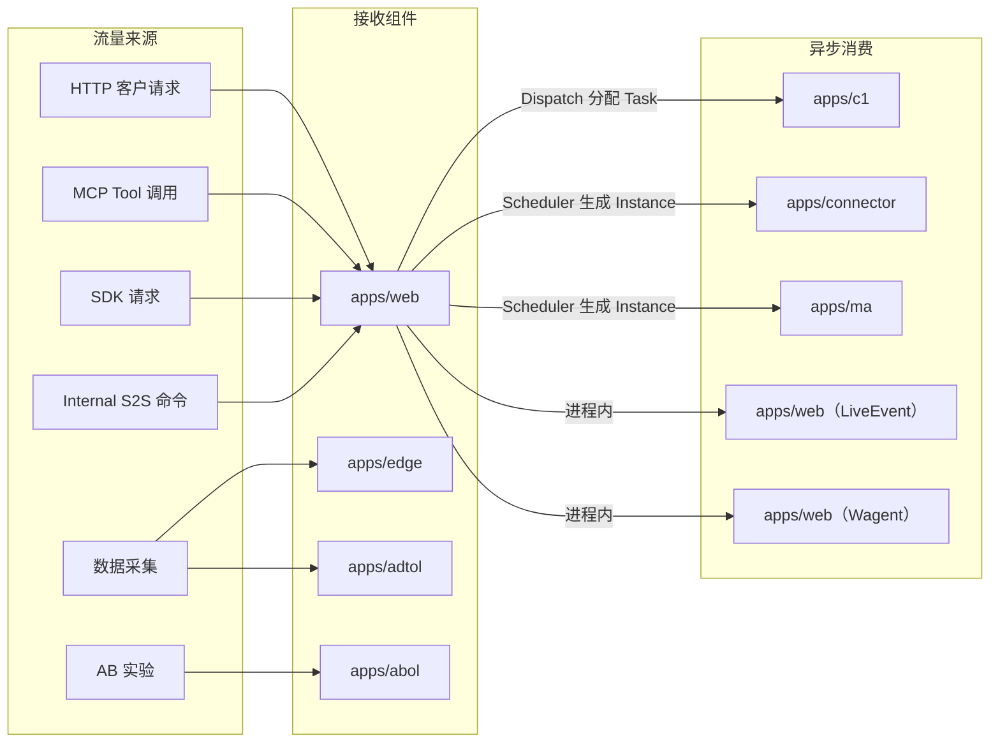
```mermaid
flowchart LR
    subgraph Entry["流量来源"]
        Http["HTTP 客户请求"]
        Mcp["MCP Tool 调用"]
        Sdk["SDK 请求"]
        Internal["Internal S2S 命令"]
        Collect["数据采集"]
        AB["AB 实验"]
    end

    subgraph Apps["接收组件"]
        Web["apps/web"]
        Edge["apps/edge"]
        Adtol["apps/adtol"]
        Abol["apps/abol"]
    end

    subgraph Async["异步消费"]
        C1["apps/c1"]
        Connector["apps/connector"]
        MA["apps/ma"]
        LiveEvent["apps/web（LiveEvent）"]
        Wagent["apps/web（Wagent）"]
    end

    Http --> Web
    Mcp --> Web
    Sdk --> Web
    Internal --> Web
    Collect --> Edge
    Collect --> Adtol
    AB --> Abol

    Web -->|Scheduler 生成 Instance| Connector
    Web -->|Scheduler 生成 Instance| MA
    Web -->|Dispatch 分配 Task| C1
    Web -->|进程内| LiveEvent
    Web -->|进程内| Wagent
```

**说明**

- **同步入口**（HTTP/MCP/SDK/Internal → apps/web）：经过 `ProjectFilter`/`authorizeProjectContext` PM 门禁，每请求检查项目是否可用。
- **数据入口**（Edge/ADTOL）：经过 `Token2ProjectID` PM 门禁，路由到目标项目后写入 Kafka。
- **实验入口**（ABOL）：经过 Router PM 门禁后，由 Abol core 处理。
- **异步消费**（Connector/MA）：由 Scheduler Master 生成 Instance，Worker 领取时检查 PM。
- **进程内消费**（C1、LiveEvent、Wagent）：由 Dispatch topology、PM Hook 或 heartbeat 控制。

### 1.2 PM Hook 传播

OP 发起 Delete/Restore 后，ProjectService 通过 PM 向持有项目运行资源的模块广播通知，Restore 额外更新 Global PG 状态：

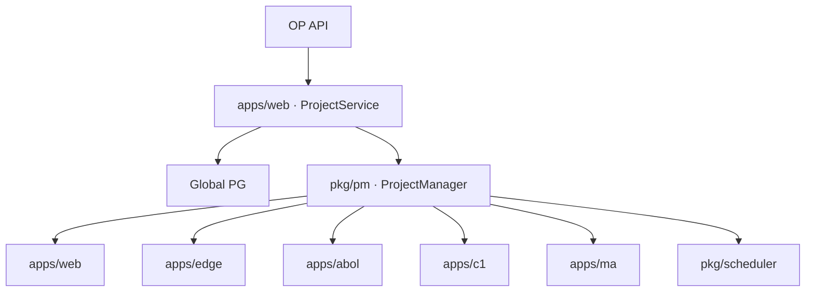
```mermaid
flowchart TD
    OP["OP API"] --> PS["apps/web · ProjectService"]
    PS --> PG["Global PG"]
    PS --> PM["pkg/pm · ProjectManager"]

    PM --> Web["apps/web"]
    PM --> Edge["apps/edge"]
    PM --> Abol["apps/abol"]
    PM --> C1["apps/c1"]
    PM --> MA["apps/ma"]
    PM --> Sched["pkg/scheduler"]
```

各模块收到 Hook 后的具体动作在对应组件章节中展开。未出现在图中的组件（ADTOL、Simulator）不持有项目运行资源，不需要 Hook。

同一进程内 Hook 同步触发，跨进程 Hook 通过 PM Pub/Sub + 快照对账传播。不等待远端 ACK。

### 1.3 Purge：同步清理流程

Purge 与 Delete/Restore 不同，它是一个同步、按固定顺序执行的清理过程：

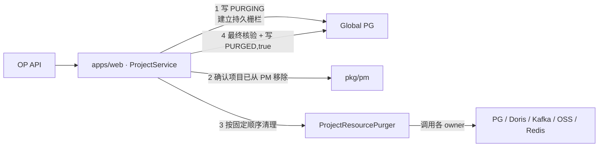
```mermaid
flowchart LR
    OP["OP API"] --> PS["apps/web · ProjectService"]
    PS -->|"1 写 PURGING<br/>建立持久栅栏"| PG["Global PG"]
    PS -->|"2 确认项目已从 PM 移除"| PM["pkg/pm"]
    PS -->|"3 按固定顺序清理"| Purger["ProjectResourcePurger"]
    Purger -->|"调用各 owner"| Owners["PG / Doris / Kafka / OSS / Redis"]
    PS -->|"4 最终核验 + 写 PURGED,true"| PG
```

完整 11 步顺序见[第 11 章](#11-purge-固定顺序与资源-owner)。Purge 过程中 `PURGING` 状态禁止 Restore，失败后只能从头重试 Purge。

### 1.4 四层收敛机制

| # | 机制 | 覆盖范围 | 延迟 |
| --- | --- | --- | --- |
| 1 | 请求门禁 | 每请求查 PM：Edge、ADTOL、ABOL、Web API、MCP、Internal S2S | 毫秒级 |
| 2 | 任务门禁 | Scheduler Master 生成 Instance 前查 PM、Worker 领取时查 PM | 秒级 |
| 3 | PM Delete Hook | 持有项目级运行资源的模块：QE、LiveEvent、Asset、Wagent、Edge TrackService、Abol core、C1、Dispatch、MA、Connector | 毫秒级（同进程）、秒级（跨进程） |
| 4 | heartbeat 取消 | 运行中 Scheduler handler 在定期 heartbeat 中发现项目不存在 → 取消 context、释放 lease | 秒~分钟级 |

### 1.5 组件索引

| 组件 | 角色 | 章节 |
| --- | --- | --- |
| `apps/web` | 控制面发起者 + Web 业务 + QE/LiveEvent/Wagent/Asset 运行模块 | [第 2 章](#2-appsweb) |
| `apps/edge` | 数据采集入口 | [第 3 章](#3-appsedge) |
| `apps/adtol` | 数据回传入口 | [第 4 章](#4-appstadtol) |
| `apps/abol` | AB 实验判定 | [第 5 章](#5-appsabol) |
| `apps/c1` + `pkg/dispatch` | 数据落盘消费 | [第 6 章](#6-appsc1--pkgdispatch) |
| `apps/connector` | 外部数据管道 | [第 7 章](#7-appsconnector) |
| `apps/ma` | 营销自动化 | [第 8 章](#8-appsma) |
| `apps/simulator` | 模拟/测试，无生产资源 | [第 9 章](#9-appssimulator) |
| 共享基础设施 | PM、Scheduler、Dispatch、存储 client | [第 10 章](#10-共享基础设施) |

---

## 2. apps/web

`apps/web` 是生命周期操作的发起者，也是模块最多的 app。按职能分为四组：

- **项目主体**：生命周期操作（2.1.1）、项目存储资源（2.1.2）
- **请求入口与门禁**：Web API、MCP、Internal S2S（2.2）
- **运行子模块**：QE Catalog（2.3.1）、LiveEvent（2.3.2）、Wagent（2.3.3）
- **共享缓存**：权限、Token cache（2.4）

### 2.1 项目主体

项目主体涵盖项目本身的生命周期操作和它拥有的存储资源。ProjectService 是生命周期动作的入口，PM + Global PG 承载状态；项目存储资源在创建时自动预配，Purge 时统一清理。

#### 2.1.1 生命周期操作

**定位**

ProjectService 是生命周期动作的入口和执行者。OP API → Customer Ops → ProjectService → PM + Global PG。它不持有项目级运行资源，所有副作用通过 PM 传播。

**流量入口与任务**

- **OP API 命令**（Delete/Restore/Purge）→ ProjectService 接收 → 操作 Global PG 四态 + PM 可用集合和运行时快照
- ProjectService 本身不接收项目数据请求，不涉及门禁


**资源台账**

| 存储位置 | 资源 | 类型 | 内容与作用 | 代码文件 | 搜索关键词 |
| --- | --- | --- | --- | --- | --- |
| Global PG | project/org 主记录 | 持久资源 | 记录项目的归属组织、配置和生命周期状态，作为生命周期动作的权威判定源 | `apps/web/dao/global/project.go`、`apps/web/dao/global/organization.go` | ProjectDao / OrganizationDao |
| PM Redis | 可用项目集合索引 `sys:{pm}:projects` | 运行资源 | 维护可用项目集合供各组件门禁枚举，决定请求能否进入项目 | `pkg/pm/project_manager.go` | KeySysPMProjects |
| PM Redis | 项目运行时快照 `sys:{pm}:info:<pid>` | 运行资源 | 存储项目运行时配置快照，供组件在无项目存储访问时获取必要信息 | `pkg/pm/project_manager.go` | KeySysPMInfoPrefix |

**生命周期变化图**
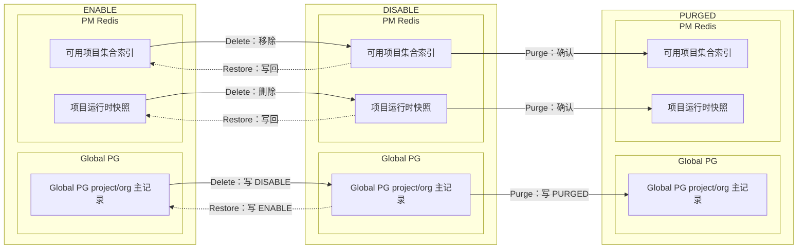
```mermaid
flowchart LR
    subgraph enable["ENABLE"]
        subgraph e_pg["Global PG"]
            EGlobal["Global PG project/org 主记录"]
        end
        subgraph e_pm["PM Redis"]
            EIndex["可用项目集合索引"]
            EInfo["项目运行时快照"]
        end
    end
    subgraph disable["DISABLE"]
        subgraph d_pg["Global PG"]
            DGlobal["Global PG project/org 主记录"]
        end
        subgraph d_pm["PM Redis"]
            DIndex["可用项目集合索引"]
            DInfo["项目运行时快照"]
        end
    end
    subgraph purged["PURGED"]
        subgraph p_pg["Global PG"]
            PGlobal["Global PG project/org 主记录"]
        end
        subgraph p_pm["PM Redis"]
            PIndex["可用项目集合索引"]
            PInfo["项目运行时快照"]
        end
    end
    EGlobal -->|Delete：写 DISABLE| DGlobal
    EIndex -->|Delete：移除| DIndex
    EInfo -->|Delete：删除| DInfo
    DGlobal -.->|Restore：写 ENABLE| EGlobal
    DIndex -.->|Restore：写回| EIndex
    DInfo -.->|Restore：写回| EInfo
    DGlobal -->|Purge：写 PURGED| PGlobal
    DIndex -->|Purge：确认| PIndex
    DInfo -->|Purge：确认| PInfo
```

#### Delete 阶段

> **原则：** Delete 只做两件事：(1) Global PG 写 `DISABLE` + PM 踢出可用集合，从门禁阻断新流量和新任务；(2) 各组件停持续运行的 goroutine（consumer、heartbeat、loop 等），避免空耗 CPU/IO。进程内存映射（cache、路由表等）和 TTL 资源（lease、限速 key、幂等 key 等）不强制清理——门禁已拦住，留到 Purge 或自然过期即可。

| 文件 | 改动 |
| --- | --- |
| `service/project/delete.go` | 实现 Delete：写 `DISABLE`、清理 PM 快照、拒绝新工作入口 |
| `service/project/create.go` | 创建要求父组织 `ENABLE,false`，防止已删除组织下新建项目 |
| `service/organization/organization.go` | 组织 Delete：状态转换 + 逐项目约束（子项目全部可删才执行） |
| `dao/global/project.go` | 增加命名条件转换并检查 RowsAffected；`INITIALIZING` 只允许初始化完成时转 `ENABLE`，生命周期动作不得接管该状态 |
| `dao/global/organization.go` | 增加 `status` 字段映射、四态常量；普查已有 `is_deleted` 查询，生产路径加 `status IN ('ENABLE')` 条件 |

#### Restore 阶段

| 文件 | 改动 |
| --- | --- |
| `service/project/delete.go` | 实现 Restore：写 `ENABLE`、用已有配置调 `PM.SetInfo` 写回快照 |
| `service/organization/organization.go` | 组织 Restore：恢复 `ENABLE`，不级联子项目 |

#### Purge 阶段

| 文件 | 改动 |
| --- | --- |
| `service/project/purge.go` | 实现 Purge 主流程：`PurgeTarget` 构造、`PURGING` 转换和最终结果映射 |
| `service/project/resource_purger.go` **新增** | `ProjectResourcePurger`，按固定顺序调用各资源 owner |
| `service/project/project.go` | 注入 Purger；禁止整行 `Save` 覆盖生命周期状态 |
| `service/organization/organization.go` | 组织 Purge：`PURGING`/`PURGED` + 逐项目约束 |
| `dao/global/project.go` | `PURGING`/`PURGED` 状态、`GetByIDWithDeleted`、`ListLifecycleByOrg` |
| `dao/global/organization.go` | `PURGING`/`PURGED` 状态支持 |
| `dao/global/project_member.go` | 增加按 project ID 硬删除成员引用 |

#### 2.1.2 项目存储资源

**定位**

项目中立的持久资源层。由 Project 初始化时自动创建，Web/Connector/MA/Wagent 各组件持续写入和读取。

**流量入口与任务**

项目存储不是入口——它不接收外部请求，不被门禁控制。写入和读取来自各组件的内部业务逻辑（Pipeline 写入 Kafka / Doris、Scheduler 读写 Meta PG 等）。Purge 必须以正确顺序清理这些资源。

**资源台账**

| 存储位置 | 资源 | 类型 | 内容与作用 | 代码文件 | 搜索关键词 |
| --- | --- | --- | --- | --- | --- |
| Project PG | Meta `schema_<pid>` | 持久资源 | 存储事件元数据、调度信息、实验配置和 Pipeline 状态，支撑项目全部业务功能 | `pkg/dal/pgsqlx/` | schema_<pid> |
| Project PG | Data `schema_<pid>` | 持久资源 | 存储身份关系映射，支撑跨系统用户关联和去重 | `pkg/dal/pgsqlx/` | schema_<pid> |
| Doris | 项目 Database | 持久资源 | 提供项目级 OLAP 存储，支撑事件分析、用户分群和营销自动化大规模数据计算 | `pkg/dal/dorisx/` | DropDatabase / Database(projectID) |
| Kafka | 项目 Topic + 消费组 | 持久资源 | 提供项目数据事件流通道和消费组管理，支撑数据采集、处理、落盘的全链路异步传输 | `pkg/dal/kafkax/` | CreateTopic / DeleteTopics |
| OSS | 项目前缀 | 持久资源 | 提供项目级对象存储隔离空间，支撑数据导入导出、离线计算和定时任务的文件交换 | `pkg/dal/ossx/` | DeleteByPrefix |
| Global PG | member、邀请引用 | 持久资源 | 管理项目成员和待处理邀请，不属于生命周期状态，Delete 期间保留以保证 Restore 后成员关系完整 | `apps/web/dao/global/project_member.go`、`apps/web/dao/global/member_invite.go` | ProjectMemberDao / MemberInviteDao |

**PM 接入：** 无。项目存储是持久数据层，不受 PM 门禁控制。

**生命周期变化图**

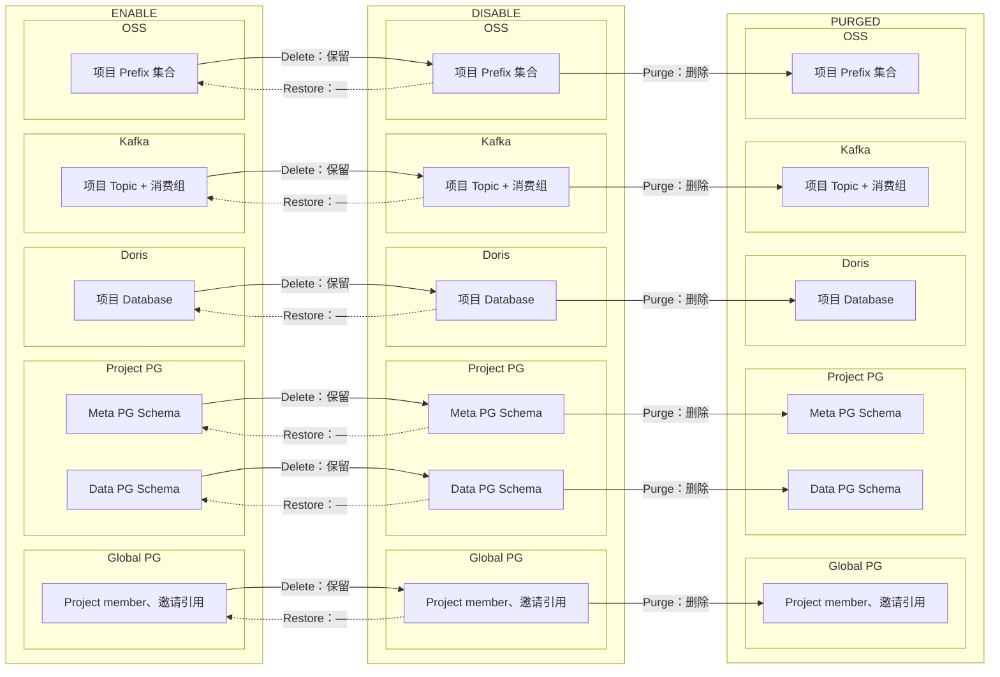
```mermaid
flowchart LR
    subgraph enable["ENABLE"]
        subgraph e_member["Global PG"]
            EMember["Project member、邀请引用"]
        end
        subgraph e_pg["Project PG"]
            EMeta["Meta PG Schema"]
            EData["Data PG Schema"]
        end
        subgraph e_doris["Doris"]
            EDoris["项目 Database"]
        end
        subgraph e_kafka["Kafka"]
            EKafka["项目 Topic + 消费组"]
        end
        subgraph e_oss["OSS"]
            EOSS["项目 Prefix 集合"]
        end
    end

    subgraph disable["DISABLE"]
        subgraph d_member["Global PG"]
            DMember["Project member、邀请引用"]
        end
        subgraph d_pg["Project PG"]
            DMeta["Meta PG Schema"]
            DData["Data PG Schema"]
        end
        subgraph d_doris["Doris"]
            DDoris["项目 Database"]
        end
        subgraph d_kafka["Kafka"]
            DKafka["项目 Topic + 消费组"]
        end
        subgraph d_oss["OSS"]
            DOSS["项目 Prefix 集合"]
        end
    end

    subgraph purged["PURGED"]
        subgraph p_member["Global PG"]
            PMember["Project member、邀请引用"]
        end
        subgraph p_pg["Project PG"]
            PMeta["Meta PG Schema"]
            PData["Data PG Schema"]
        end
        subgraph p_doris["Doris"]
            PDoris["项目 Database"]
        end
        subgraph p_kafka["Kafka"]
            PKafka["项目 Topic + 消费组"]
        end
        subgraph p_oss["OSS"]
            POSS["项目 Prefix 集合"]
        end
    end

    EMember -->|Delete：保留| DMember
    EMeta -->|Delete：保留| DMeta
    EData -->|Delete：保留| DData
    EDoris -->|Delete：保留| DDoris
    EKafka -->|Delete：保留| DKafka
    EOSS -->|Delete：保留| DOSS
    DMember -.->|Restore：—| EMember
    DMeta -.->|Restore：—| EMeta
    DData -.->|Restore：—| EData
    DDoris -.->|Restore：—| EDoris
    DKafka -.->|Restore：—| EKafka
    DOSS -.->|Restore：—| EOSS
    DMember -->|Purge：删除| PMember
    DMeta -->|Purge：删除| PMeta
    DData -->|Purge：删除| PData
    DDoris -->|Purge：删除| PDoris
    DKafka -->|Purge：删除| PKafka
    DOSS -->|Purge：删除| POSS
```


**代码改动（仅 Purge owner）**

| 清理 owner | 文件 | 具体改动 |
| --- | --- | --- |
| PG owner | 各 DAO | `DROP SCHEMA IF EXISTS <schema> CASCADE` |
| Doris owner | Doris client | `DROP DATABASE IF EXISTS <db>` |
| Kafka owner | Kafka admin | 删除 Topic + 按前缀删除 consumer group |
| OSS owner | OSS client | 删除四类 `load/backfill/events_cron/users_cron/<pid>/` 前缀 |
| Member owner | `dao/global/project_member.go` | 按 project ID 硬删除成员和邀请引用 |

> **Pipeline 业务资源**（run/backfill/load-file、Scheduler Job/Instance/Task）保存在 Meta PG 中，Delete 只拒绝新工作允许既有执行收尾，不删除数据。Purge 随 Meta Schema 删除一并清理。入口门禁说明见 [2.2 请求入口与门禁](#22-请求入口与门禁) Internal S2S 表格。

### 2.2 请求入口与门禁

**定位**

普通 Web API、MCP、Internal S2S 是请求的入口。它们不保存项目数据，只决定请求是否允许进入。

**流量入口与任务**

| 入口 | 流量来源 | 当前门禁 | Delete 行为 | Restore 行为 |
| --- | --- | --- | --- | --- |
| 普通 Web API | 客户 HTTP | `ProjectFilter` 每请求查 PM | 拒绝不可用项目 | 恢复放行 |
| MCP | MCP tool | `authorizeProjectContext` 当前只校验成员关系和 Token scope，未查 PM | 需补充 PM 门禁 | 恢复后重新授权 |
| Internal S2S 新工作 | 内部创建/启动命令 | `InternalProjectContext` 只解析 Project Header | 新工作拒绝；在途查询和结果回写允许收尾 | 恢复新工作入口 |
| Internal S2S 在途 | 既有 Pipeline/MA 执行 | 无专门门禁 | 允许只读查询和回写 | 继续正常读取 |

**流量变化图**

请求进入 Web 后按项目状态分支，展示不同路径：

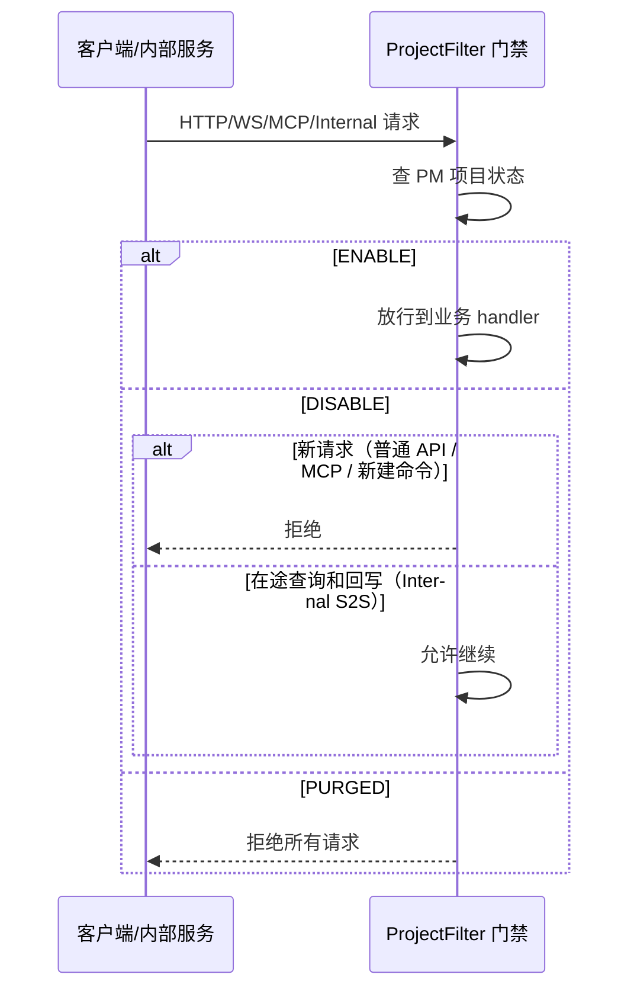
```mermaid
sequenceDiagram
    participant C as 客户端/内部服务
    participant G as ProjectFilter 门禁

    C->>G: HTTP/WS/MCP/Internal 请求
    G->>G: 查 PM 项目状态

    alt ENABLE
        G->>G: 放行到业务 handler
    else DISABLE
        alt 新请求（普通 API / MCP / 新建命令）
            G-->>C: 拒绝
        else 在途查询和回写（Internal S2S）
            G->>G: 允许继续
        end
    else PURGED
        G-->>C: 拒绝所有请求
    end
```

**代码改动**

| 文件 | 改动 |
| --- | --- |
| `pkg/ginx/middleware/project.go` | 审核全部路由；保留普通 API 的 PM 门禁，删除旧租户 lifecycle 入口；OP 生命周期明确绕过 |
| `pkg/ginx/middleware/organization.go` | 普通组织请求要求 `ENABLE,false` |
| `apps/web/mcp/tools/context.go` | `authorizeProjectContext` 在成员/scope 校验前检查 PM |
| `pkg/internalauth/middleware.go` | 继续只解析 Header，不增加全局 PM 拦截 |
| `service/pipeline/internal_metadata.go` | 新工作调 `requireInternalProjectEnabled`；在途查询/回写在 PM 缺失时读 Global 生命周期，只允许 `DISABLE,false` |
| `apps/web/ma/service/*` | materialize 等新工作入口检查 PM；结果回写同理 |

### 2.3 运行子模块

#### 2.3.1 QE Catalog

**定位**

QE Catalog 是项目的元数据查询层，提供事件/属性/Cohort/Metric 等元数据目录服务。它在 Web 进程内维护 `catalogs[projectID]` 映射和 MetaCache。

**流量入口与任务**

QE Catalog 接收两类流量：
- **Web API 查询**（经过 ProjectFilter 门禁）→ 读取 `catalogs[projectID]` 和 MetaCache 返回元数据
- **后台 refresh loop**（每 30min 定时）→ 持有 Redis refresh lock，更新 MetaCache

注意：MetaCache 是进程本地映射，项目 Delete 后不会自动过期，refresh loop 也不会停止。这是需要核心处理的问题。

**资源台账**

| 存储位置 | 资源 | 类型 | 内容与作用 | 代码文件 | 搜索关键词 |
| --- | --- | --- | --- | --- | --- |
| 进程内存 | `catalogs[projectID]` | 进程内状态 | 提供项目元数据目录查询，支撑前端展示事件/属性/Cohort/Metric 列表 | `apps/web/qe/catalog/catalog.go` | catalogs |
| 进程内存 | MetaCache | 进程内状态 | 加速元数据目录查询响应，减少对 PG 的直接读取频率 | `apps/web/qe/catalog/catalog.go` | MetaCache |
| 项目 Redis | refresh lock Key | 运行资源（TTL 30-60s） | 防止多副本同时刷新元数据缓存，保证数据一致性 | `apps/web/qe/catalog/notifier.go` | KeySysCatalogRefreshLock |

**生命周期变化图**

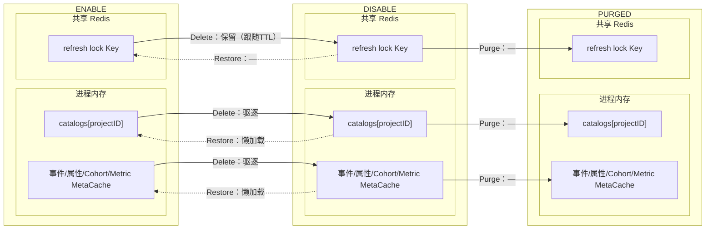
```mermaid
flowchart LR
    subgraph enable["ENABLE"]
        subgraph e_memory["进程内存"]
            ECat["catalogs[projectID]"]
            EMeta["事件/属性/Cohort/Metric MetaCache"]
        end
        subgraph e_redis["共享 Redis"]
            ELock["refresh lock Key"]
        end
    end

    subgraph disable["DISABLE"]
        subgraph d_memory["进程内存"]
            DCat["catalogs[projectID]"]
            DMeta["事件/属性/Cohort/Metric MetaCache"]
        end
        subgraph d_redis["共享 Redis"]
            DLock["refresh lock Key"]
        end
    end

    subgraph purged["PURGED"]
        subgraph p_memory["进程内存"]
            PCat["catalogs[projectID]"]
            PMeta["事件/属性/Cohort/Metric MetaCache"]
        end
        subgraph p_redis["共享 Redis"]
            PLock["refresh lock Key"]
        end
    end

    ECat -->|Delete：驱逐| DCat
    EMeta -->|Delete：驱逐| DMeta
    ELock -->|Delete：保留（跟随TTL）| DLock
    DCat -.->|Restore：懒加载| ECat
    DMeta -.->|Restore：懒加载| EMeta
    DLock -.->|Restore：—| ELock
    DCat -->|Purge：—| PCat
    DMeta -->|Purge：—| PMeta
    DLock -->|Purge：—| PLock
```

**流量变化图（PM Hook 接入后行为）**

> 当前代码 `OnProjectDelete` 为空，refresh loop 不会自动跳过已删除项目。下图展示接入 PM Hook 后的预期行为：Delete 时驱逐 → DISABLE 下遍历不到 → 跳过。

QE Catalog 无外部请求入口。refresh loop 按 `catalogs` map 中已知项目逐个刷新：

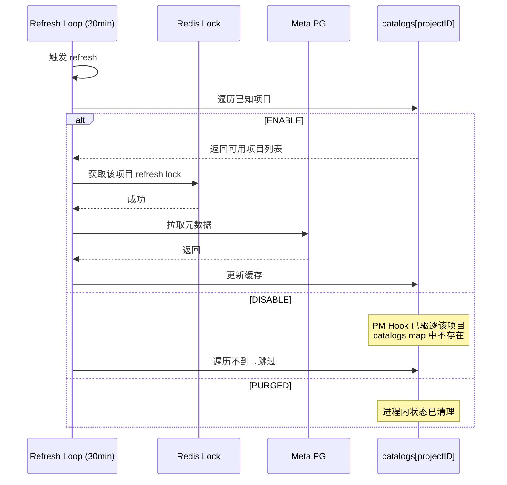
```mermaid
sequenceDiagram
    participant T as Refresh Loop (30min)
    participant L as Redis Lock
    participant P as Meta PG
    participant C as catalogs[projectID]

    T->>T: 触发 refresh
    T->>C: 遍历已知项目

    alt ENABLE
        C-->>T: 返回可用项目列表
        T->>L: 获取该项目 refresh lock
        L-->>T: 成功
        T->>P: 拉取元数据
        P-->>T: 返回
        T->>C: 更新缓存
    else DISABLE
        Note over C: PM Hook 已驱逐该项目<br/>catalogs map 中不存在
        T->>C: 遍历不到→跳过
    else PURGED
        Note over C: 进程内状态已清理
    end
```

**PM 接入现状与代码改动**

#### Delete 阶段

| 文件 | 改动 |
| --- | --- |
| `web/qe/catalog/catalog.go` | `OnProjectDelete`：`delete(catalogs, projectID)` 驱逐目标项目；`ProjectMetaCatalog` 及内部 MetaCache 随之不可达 → GC 回收 |

> QE Catalog 的 refresh loop 是全局单 goroutine（每 30min 遍历 `catalogs` map），逐出后自动跳过已删项目，无需单独停止 goroutine。

#### Restore 阶段

| 文件 | 改动 |
| --- | --- |
| `web/qe/catalog/catalog.go` | 不主动操作——查询时通过 `Record` 懒加载重建 |

#### Purge 阶段

| 文件 | 改动 |
| --- | --- |
| `web/qe/catalog/notifier.go` | 不处理——refresh lock 自带 TTL 30-60s，Purge 时已自然过期 |


#### 2.3.2 LiveEvent

**定位**

LiveEvent 实时推送项目事件到客户端。客户端建连后在 Web 进程内持有 WebSocket 连接和对应的 Kafka consumer。连接建立时查 PM，但已有连接不会自动关闭。

**流量入口与任务**

LiveEvent 接收两类流量：
- **WebSocket 建连**（客户端请求）→ `RegisterClient` 检查 PM，成功后创建 WebSocket 连接和对应 Kafka consumer
- **Kafka 消费**（后台持续）→ consumer 从项目 Topic 拉取事件推送 WebSocket

**当前问题**：建连后不再复查 PM，项目 Delete 后已有连接继续推送，consumer 不关闭。

**资源台账**

| 存储位置 | 资源 | 类型 | 内容与作用 | 代码文件 | 搜索关键词 |
| --- | --- | --- | --- | --- | --- |
| 进程内 | WebSocket | 运行资源 | 维持与客户端的实时连接，向客户端推送项目事件的实时更新 | `apps/web/service/liveevent/liveevent.go` | wsClients |
| 进程内 | Kafka consumer | 运行资源 | 从项目 Kafka Topic 消费事件，驱动 WebSocket 推送的内容生产 | `apps/web/service/liveevent/liveevent.go` | consumers |
| Kafka | `live-event-<pid>-*` group | 持久资源 | 记录项目级消费组偏移量，保证事件推送的可恢复和 Exactly-Once 语义；Purge 后无 consumer 连接，残留 group 无影响，不主动删除 | `apps/web/service/liveevent/liveevent.go` | live-event-<pid> |

**生命周期变化图**

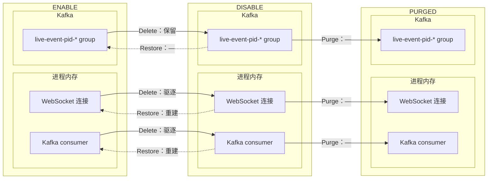
```mermaid
flowchart LR
    subgraph enable["ENABLE"]
        subgraph e_mem["进程内存"]
            EWS["WebSocket 连接"]
            EConsumer["Kafka consumer"]
        end
        subgraph e_kafka["Kafka"]
            EGroup["live-event-pid-* group"]
        end
    end

    subgraph disable["DISABLE"]
        subgraph d_mem["进程内存"]
            DWS["WebSocket 连接"]
            DConsumer["Kafka consumer"]
        end
        subgraph d_kafka["Kafka"]
            DGroup["live-event-pid-* group"]
        end
    end

    subgraph purged["PURGED"]
        subgraph p_mem["进程内存"]
            PWS["WebSocket 连接"]
            PConsumer["Kafka consumer"]
        end
        subgraph p_kafka["Kafka"]
            PGroup["live-event-pid-* group"]
        end
    end

    EWS -->|Delete：驱逐| DWS
    EConsumer -->|Delete：驱逐| DConsumer
    EGroup -->|Delete：保留| DGroup
    DWS -.->|Restore：重建| EWS
    DConsumer -.->|Restore：重建| EConsumer
    DGroup -.->|Restore：—| EGroup
    DWS -->|Purge：—| PWS
    DConsumer -->|Purge：—| PConsumer
    DGroup -->|Purge：—| PGroup
```

**流量变化图**

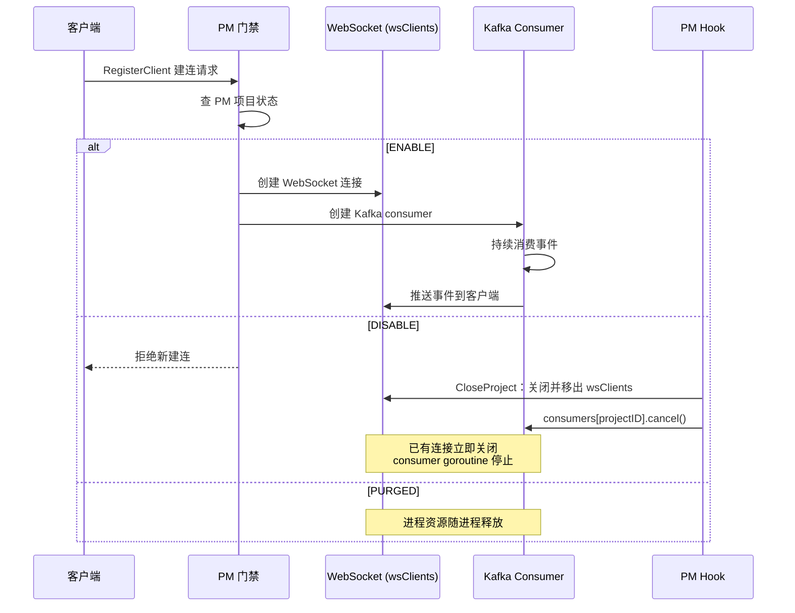
```mermaid
sequenceDiagram
    participant C as 客户端
    participant G as PM 门禁
    participant W as WebSocket (wsClients)
    participant K as Kafka Consumer
    participant H as PM Hook

    C->>G: RegisterClient 建连请求
    G->>G: 查 PM 项目状态

    alt ENABLE
        G->>W: 创建 WebSocket 连接
        G->>K: 创建 Kafka consumer
        K->>K: 持续消费事件
        K->>W: 推送事件到客户端
    else DISABLE
        G-->>C: 拒绝新建连
        H->>W: CloseProject：关闭并移出 wsClients
        H->>K: consumers[projectID].cancel()
        Note over W,K: 已有连接立即关闭<br/>consumer goroutine 停止
    else PURGED
        Note over W,K: 进程资源随进程释放
    end
```

**PM 接入现状与代码改动**

#### Delete 阶段

| 文件 | 改动 |
| --- | --- |
| `web/service/liveevent/liveevent.go` | 注册 PM Hook，新增 `CloseProject(projectID)` |
| `web/service/liveevent/liveevent.go` | `consumers[projectID].cancel()` 停止 consumer goroutine |
| `web/service/liveevent/liveevent.go` | `wsClients.Range()` 筛选目标项目客户端，关闭 WebSocket 并移出 map |

#### Restore 阶段

| 文件 | 改动 |
| --- | --- |
| `web/service/liveevent/liveevent.go` | 不处理——新连接通过 `RegisterClient` 建连时懒加载 |

#### Purge 阶段

| 文件 | 改动 |
| --- | --- |
| `web/service/liveevent/liveevent.go` | 再次幂等 `CloseProject`；`live-event-<pid>-*` group 无主动清理，无 consumer 时残留 group 无影响 |

#### 2.3.3 Wagent

**定位**

Wagent 是 Web 进程内的 AI 执行引擎。它管理 execution 的入队、领取和执行，同时在进程内存中维护 executor `running` map。后台 worker（claim、start、heartbeat）当前不查询 PM。

**流量入口与任务**

Wagent 接收三类流量：
- **HTTP API**（CompileConversation、StartMLCompaction）→ 间接受 ProjectFilter 控制，操作 `wagent_conversation/message` 持久层和执行 Queue
- **后台 claim worker**→ 不查 PM，从 Queue 领取 execution 到进程内 executor `running` map
- **后台 heartbeat**→ 不查 PM，续期执行 lease 和 active-lock

注意：claim/heartbeat 不查 PM，Delete 后仍可能领取新 execution。

**资源台账**

| 存储位置 | 资源 | 类型 | 内容与作用 | 代码文件 | 搜索关键词 |
| --- | --- | --- | --- | --- | --- |
| Meta PG | wagent_conversation、message | 持久资源 | 持久化 AI 对话和消息记录，支撑用户查看和恢复历史会话 | `apps/web/wagent/dao/conversation.go` | wagent_conversation / Message |
| 共享 Redis | execution 队列 | 可恢复队列 | 全局 List `wagent:execution:queue` 存 `projectID:executionID` 格式成员，由 `BRPop` 领取；项目状态只能出队解码后检查 | `apps/web/wagent/service/runtime/queue.go` | LPush / BRPop |
| 共享 Redis | execution 协调 Key | 运行资源 | `p:<pid>:` 前缀 key 组，覆盖 execution 数据、claim 锁、cancel 标记、active_lock/active_execution。写入时指定 TTL 30min，心跳续约；Delete 停止续约后到期自动过期 | `apps/web/wagent/service/runtime/` | executionKey / activeLockKey |
| 共享 Redis | quota Key | 运行资源 | `{pid:week}` 哈希标签 key，限制项目 AI 的周配额消耗。Lua 脚本写入时指定 TTL（当前周剩余+7天宽限期），Delete 后无新写入自动过期 | `apps/web/wagent/service/tokenquota/service.go` | quotaKeyTag |
| 共享 Redis | rate-limit Key | 运行资源 | 限制项目 AI 调用速率。自增时指定 TTL 1-4min，到期自动过期，不依赖 Delete/Purge 清理 | `apps/web/wagent/service/ratelimit/ratelimit.go` | rate-limit Key |
| 进程内存 | executor `running` map | 进程内状态 | 跟踪当前进程内正在执行的 AI 任务，支持取消和状态查询 | `apps/web/wagent/service/runtime/local_executor.go` | running |

**生命周期变化图**

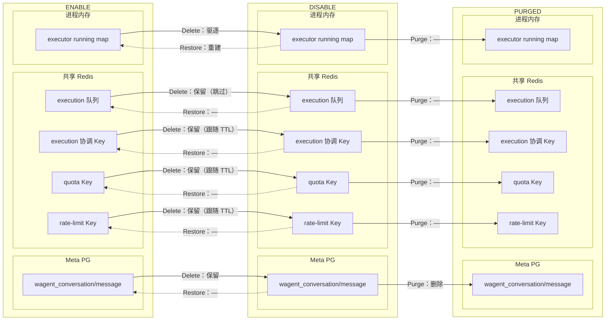
```mermaid
flowchart LR
    subgraph enable["ENABLE"]
        subgraph e_meta["Meta PG"]
            EMsg["wagent_conversation/message"]
        end
        subgraph e_redis["共享 Redis"]
            EQueue["execution 队列"]
            ELease["execution 协调 Key"]
            EQuota["quota Key"]
            ERateLimit["rate-limit Key"]
        end
        subgraph e_memory["进程内存"]
            ERunning["executor running map"]
        end
    end

    subgraph disable["DISABLE"]
        subgraph d_meta["Meta PG"]
            DMsg["wagent_conversation/message"]
        end
        subgraph d_redis["共享 Redis"]
            DQueue["execution 队列"]
            DLease["execution 协调 Key"]
            DQuota["quota Key"]
            DRateLimit["rate-limit Key"]
        end
        subgraph d_memory["进程内存"]
            DRunning["executor running map"]
        end
    end

    subgraph purged["PURGED"]
        subgraph p_meta["Meta PG"]
            PMsg["wagent_conversation/message"]
        end
        subgraph p_redis["共享 Redis"]
            PQueue["execution 队列"]
            PLease["execution 协调 Key"]
            PQuota["quota Key"]
            PRateLimit["rate-limit Key"]
        end
        subgraph p_memory["进程内存"]
            PRunning["executor running map"]
        end
    end

    EMsg -->|Delete：保留| DMsg
    EQueue -->|Delete：保留（跳过）| DQueue
    ELease -->|Delete：保留（跟随 TTL）| DLease
    EQuota -->|Delete：保留（跟随 TTL）| DQuota
    ERateLimit -->|Delete：保留（跟随 TTL）| DRateLimit
    ERunning -->|Delete：驱逐| DRunning
    DMsg -.->|Restore：—| EMsg
    DQueue -.->|Restore：—| EQueue
    DLease -.->|Restore：—| ELease
    DQuota -.->|Restore：—| EQuota
    DRateLimit -.->|Restore：—| ERateLimit
    DRunning -.->|Restore：重建| ERunning
    DMsg -->|Purge：删除| PMsg
    DQueue -->|Purge：—| PQueue
    DLease -->|Purge：—| PLease
    DQuota -->|Purge：—| PQuota
    DRateLimit -->|Purge：—| PRateLimit
    DRunning -->|Purge：—| PRunning
```

**流量变化图（PM Hook 及 PM 门禁接入后行为）**

> 当前代码 claim/heartbeat 不查 PM。项目 ID 编码在 List entry `projectID:executionID` 内，`BRPop` 出队后解码，查 PM 无此项目则丢弃。

Wagent 无外部请求流量，后台 claim/heartbeat 是内部驱动。HTTP API 经 ProjectFilter 门禁，已在 [2.2 流量变化图](#22-请求入口与门禁) 覆盖：

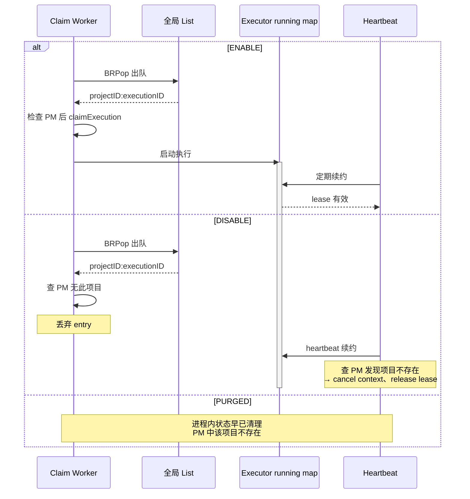
```mermaid
sequenceDiagram
    participant W as Claim Worker
    participant Q as 全局 List
    participant E as Executor running map
    participant H as Heartbeat

    alt ENABLE
        W->>Q: BRPop 出队
        Q-->>W: projectID:executionID
        W->>W: 检查 PM 后 claimExecution
        W->>E: 启动执行
        activate E
        H->>E: 定期续约
        E-->>H: lease 有效
    else DISABLE
        W->>Q: BRPop 出队
        Q-->>W: projectID:executionID
        W->>W: 查 PM 无此项目
        Note over W: 丢弃 entry
        H->>E: heartbeat 续约
        Note over H: 查 PM 发现项目不存在<br/>→ cancel context、release lease
        deactivate E
    else PURGED
        Note over W,H: 进程内状态早已清理<br/>PM 中该项目不存在
    end
```

**PM 接入现状与代码改动**

#### Delete 阶段

| 文件 | 改动 |
| --- | --- |
| `web/wagent/service/runtime/local_executor.go` | `queueLoop` 中 `BRPop` 出队后解码 projectID，查 PM 无此项目则丢弃 entry |
| `web/wagent/service/runtime/` | heartbeat 查 PM；不含项目时 cancel context，ownership 在 handler/cleanup 返回后释放 |

#### Restore 阶段

| 文件 | 改动 |
| --- | --- |
| `web/wagent/service/runtime/` | 无需操作。PM 恢复后新 execution 正常入队列 |

#### Purge 阶段

| 文件 | 改动 |
| --- | --- |
| `web/wagent/service/runtime/` | 先用现有 execution ownership/pending heartbeat 确认 handler 已退出；项目级 key（含 `p:<pid>:` 前缀）已有 TTL 30min，Delete 停止续约后到期自动过期，不主动清理；全局 List + Sorted Set 因跨项目混合无法按 project_id 清理，— |
| `web/wagent/service/tokenquota/` | quota Key 已有 TTL（本周剩余+7天宽限期），Delete 不再有新 execution 创建写入后到期自动过期，不主动清理 |
| `web/wagent/service/ratelimit/` | rate-limit Key 全局共享且自身 TTL 较短（1-4min），不主动清理 |

#### 2.3.4 Asset Behavior

| 文件 | 必要改动 |
| --- | --- |
| `web/service/asset/behavior.go` | 为 `Record`、batcher 创建和 `CloseProject(projectID)` 增加同一项目准入边界；Delete 先拒绝新记录并摘除 batcher，再在既有 timeout 内 drain buffer、等待在途 flush；Restore 只解除禁用状态 |
| `service/project/resource_purger.go` | `project_meta_pg` 删除 Meta Schema 前同步调用 `CloseProject`；drain/flush 失败或超时则保持 `PURGING` |


### 2.4 共享缓存

**定位**

项目权限、资产权限、Project→Org 和 Account API Token scope 的被动 TTL cache。不驱动执行，只加速查询。

**流量入口与任务**

这些 cache 由普通 API 请求触发填充，受 ProjectFilter 间接控制。项目 Delete 后 cache 保留但不会有新查询写入——请求已在门禁拒绝。

**代码改动**

| 文件 | 改动 |
| --- | --- |
| `service/permission/cache.go` | Delete/Restore 不清除；Purge 按固定 namespace 清目标 project key |
| `service/asset/permission/cache.go` | 同上 |
| `service/account/apitoken/service.go` | 让现有 cache 删除返回错误；Global 事务前严格驱逐、提交后 best-effort 重复驱逐 |

> 不新增 PM Hook——TTL cache 不会自行驱动新工作，不需要主动收敛。

---

## 3. apps/edge

### 定位

Edge 是数据采集入口。

### 流量入口与任务

**现状流程：** 收到 HTTP 请求后先过 PM 门禁（`Token2ProjectID` 检查项目状态），通过后再用进程内 `token2id`、`pipelineVersion`、`internalSecrets` 三个内存映射加速路由和写入。

**现状问题：** `OnProjectDelete` 已注册但为空——项目 Delete 后三个缓存不驱逐进程内已删除项目的路由信息。PM 门禁在前所以不阻拦新流量，但残留在进程内存中不能彻底释放。

### 资源台账

| 存储位置 | 资源 | 类型 | 内容与作用 | 代码文件 | 搜索关键词 |
| --- | --- | --- | --- | --- | --- |
| 进程内存 | `token2id`、`pipelineVersion`、`internalSecrets` | 进程内状态 | 加速数据采集请求的 Token 解析、Pipeline 路由和 Secret 校验，降低请求延迟 | `apps/edge/service.go` | token2id |

### 生命周期变化图

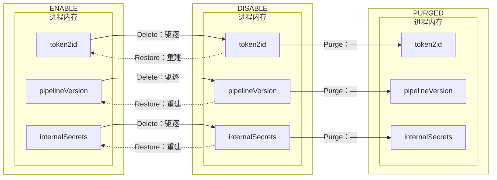
```mermaid
flowchart LR
    subgraph enable["ENABLE"]
        subgraph e_memory["进程内存"]
            EToken["token2id"]
            EPipeline["pipelineVersion"]
            ESecrets["internalSecrets"]
        end
    end

    subgraph disable["DISABLE"]
        subgraph d_memory["进程内存"]
            DToken["token2id"]
            DPipeline["pipelineVersion"]
            DSecrets["internalSecrets"]
        end
    end

    subgraph purged["PURGED"]
        subgraph p_memory["进程内存"]
            PToken["token2id"]
            PPipeline["pipelineVersion"]
            PSecrets["internalSecrets"]
        end
    end

    EToken -->|Delete：驱逐| DToken
    EPipeline -->|Delete：驱逐| DPipeline
    ESecrets -->|Delete：驱逐| DSecrets
    DToken -.->|Restore：重建| EToken
    DPipeline -.->|Restore：重建| EPipeline
    DSecrets -.->|Restore：重建| ESecrets
    DToken -->|Purge：—| PToken
    DPipeline -->|Purge：—| PPipeline
    DSecrets -->|Purge：—| PSecrets
```

### 流量变化图

请求进入后按项目状态分支，展示不同路径和资源交互：

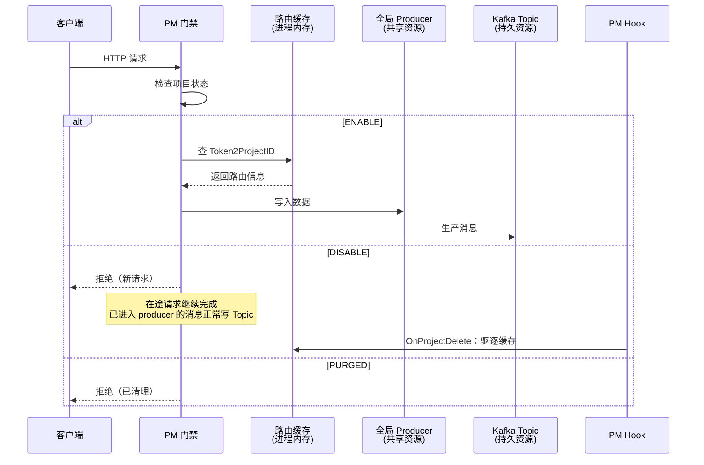
```mermaid
sequenceDiagram
    participant C as 客户端
    participant G as PM 门禁
    participant R as 路由缓存<br/>(进程内存)
    participant P as 全局 Producer<br/>(共享资源)
    participant T as Kafka Topic<br/>(持久资源)
    participant H as PM Hook

    C->>G: HTTP 请求
    G->>G: 检查项目状态

    alt ENABLE
        G->>R: 查 Token2ProjectID
        R-->>G: 返回路由信息
        G->>P: 写入数据
        P->>T: 生产消息
    else DISABLE
        G-->>C: 拒绝（新请求）
        Note over G: 在途请求继续完成<br/>已进入 producer 的消息正常写 Topic
        H->>R: OnProjectDelete：驱逐缓存
    else PURGED
        G-->>C: 拒绝（已清理）
    end
```

### PM 接入现状与代码改动

#### Delete 阶段

| 文件 | 改动 |
| --- | --- |
| `edge/service.go` | 补全 `OnProjectDelete`：从 `token2id`、`pipelineVersion`、`internalSecrets` map 驱逐目标项目条目 |

> Edge 无每项目后台 goroutine（所有请求由 PM 门禁直接拦截），但三个 map 在 Edge 进程内，Purge 无法触及；Delete 不驱逐则内存泄漏。逐出是防泄漏目的，不影响门禁正确性。

#### Restore 阶段

| 文件 | 改动 |
| --- | --- |
| `edge/service.go` | `OnProjectUpdate` 重建路由缓存 |

#### Purge 阶段

| 文件 | 改动 |
| --- | --- |
| `edge/service.go` | 不处理（Kafka producer 跨项目共享，不归属项目生命周期） |


---


## 4. apps/adtol

### 定位

ADTOL 是数据回传入口。

### 流量入口与任务

收到 HTTP 请求后经 Router 查询 PM Token，将数据写入 Kafka。无项目级内存映射或运行资源。

### 资源台账

ADTOL 不拥有项目持久资源、运行资源或进程内状态。只需继续依赖 PM 入口门禁。

### 生命周期变化图

ADTOL 不拥有项目持久资源、运行资源或进程内状态，其全部生命周期行为仅依赖 PM 门禁（见流量变化图），无自有资源经历生命周期转换。

### 流量变化图

请求经 Router 查 PM Token 后按项目状态分支：

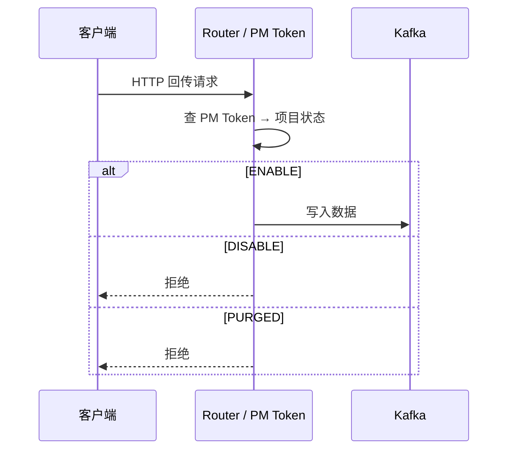
```mermaid
sequenceDiagram
    participant C as 客户端
    participant R as Router / PM Token
    participant K as Kafka

    C->>R: HTTP 回传请求
    R->>R: 查 PM Token → 项目状态

    alt ENABLE
        R->>K: 写入数据
    else DISABLE
        R-->>C: 拒绝
    else PURGED
        R-->>C: 拒绝
    end
```

### PM 接入现状与代码改动

#### Delete 阶段

| 文件 | 改动 |
| --- | --- |
| — | 无项目级资源，无需接入 |

#### Restore 阶段

| 文件 | 改动 |
| --- | --- |
| — | 无项目级资源，无需处理 |

#### Purge 阶段

| 文件 | 改动 |
| --- | --- |
| — | 无项目级资源，无需清理 |


---


## 5. apps/abol

### 定位

ABOL 是 AB 实验判定入口。

### 流量入口与任务

Router 每请求查 PM，Abol core 维护 `abCore[projectID]` 进程内查找表和 metadata loop。已注册 PM `ProjectInfoHooker` 且实现有效。

### 资源台账

| 存储位置 | 资源 | 类型 | 内容与作用 | 代码文件 | 搜索关键词 |
| --- | --- | --- | --- | --- | --- |
| 项目 Redis（Abol 专用 KV 集群） | target cache | 运行资源（TTL 30 天） | 缓存 AB 实验目标查找结果，加速实验判定决策 | `apps/abol/service/abol.go` | tarCache |
| 进程内 | `abCore[projectID]` | 进程内状态 | 提供进程内 AB 实验核心查找，快速定位项目级实验配置 | `apps/abol/service/abol.go` | abCore |
| 进程内 | metadata loop | 运行资源 | 定期同步项目 AB 实验元数据，保证实验配置始终最新 | `apps/abol/service/abol.go` | core.Start |

### 生命周期变化图

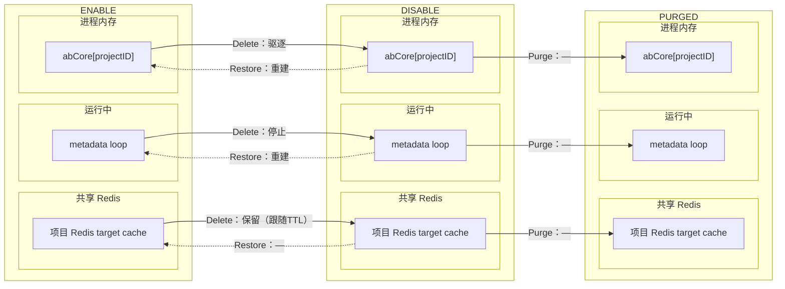
```mermaid
flowchart LR
    subgraph enable["ENABLE"]
        subgraph e_redis["共享 Redis"]
            ETarget["项目 Redis target cache"]
        end
        subgraph e_runtime["运行中"]
            ELoop["metadata loop"]
        end
        subgraph e_memory["进程内存"]
            ECore["abCore[projectID]"]
        end
    end

    subgraph disable["DISABLE"]
        subgraph d_redis["共享 Redis"]
            DTarget["项目 Redis target cache"]
        end
        subgraph d_runtime["运行中"]
            DLoop["metadata loop"]
        end
        subgraph d_memory["进程内存"]
            DCore["abCore[projectID]"]
        end
    end

    subgraph purged["PURGED"]
        subgraph p_redis["共享 Redis"]
            PTarget["项目 Redis target cache"]
        end
        subgraph p_runtime["运行中"]
            PLoop["metadata loop"]
        end
        subgraph p_memory["进程内存"]
            PCore["abCore[projectID]"]
        end
    end

    ETarget -->|Delete：保留（跟随TTL）| DTarget
    ELoop -->|Delete：停止| DLoop
    ECore -->|Delete：驱逐| DCore
    DTarget -.->|Restore：—| ETarget
    DLoop -.->|Restore：重建| ELoop
    DCore -.->|Restore：重建| ECore
    DTarget -->|Purge：—| PTarget
    DLoop -->|Purge：—| PLoop
    DCore -->|Purge：—| PCore
```

### PM 接入现状与代码改动

#### Delete 阶段

| 文件 | 改动 |
| --- | --- |
| `abol/service/abol.go` | 保持现有 `OnProjectDelete`：停止 metadata loop（停 goroutine）；新增 `abCore[projectID]` 驱逐（防内存泄漏） |

#### Restore 阶段

| 文件 | 改动 |
| --- | --- |
| `abol/service/abol.go` | 保持现有 `OnProjectUpdate`：重建 abCore、恢复 metadata loop；补回归测试 |

#### Purge 阶段

| 文件 | 改动 |
| --- | --- |
| — | target cache 在 Abol 专用 KV 集群且自带 TTL 30 天，Purge 不做处理 |


---
## 6. apps/c1 + pkg/dispatch

### 定位

C1 是数据落盘消费者。

### 流量入口与任务

**现状流程：** 数据路径——Kafka Topic → C1 consumer/extractor → Processor → KafkaLoader（写入 K2 Topic）→ 下游消费 → Doris。控制路径——Dispatch Node 维护 topology，按 topology 分配 task map 到 consumer，TaskManager 管理 per-project ITasker。

**现状问题：**

- `OnProjectDelete` 只删 Redis counts，未触发 topology 重写——已删除项目的 ITasker 持续运行
- C1 metadata/quota 进程内映射无 owner Hook——项目 Delete 后仍存
- **Topic 防复活缺失：** Kafka producer 当前允许自动建 Topic，旧 Archive 删 Topic 后 producer 可能在下次写入时自动重建——等于删了又回来

### 资源台账

| 存储位置 | 资源 | 类型 | 内容与作用 | 代码文件 | 搜索关键词 |
| --- | --- | --- | --- | --- | --- |
| Redis（Dispatch） | task map `sys:{dispatch}:task:{service}:{host}` | 运行资源 | 全局 key，JSON `map[projectID]taskCount` 记录每个 host 上各项目的任务分配数，支撑 C1 消费者的数据落盘调度 | `pkg/dispatch/rdb.go` | KeySysDispatchTaskPrefix |
| 进程内存 | C1 metadata/quota 映射 | 进程内状态 | 缓存项目元数据和配额信息，加速 C1 消费过程中的元数据查询 | `apps/c1/metadata/metadata.go` | GetEventPropDefineStore |
| 进程内存 | Dispatch Node counts | 运行资源 | leader 节点维护的 per-project 期望 task 配置，`OnProjectDelete` 从 map 删除 | `pkg/dispatch/node.go` | pn.counts |
| 进程内存 | Dispatch per-project ITasker | 运行资源 | 管理每个项目的 task 生命周期，保证数据落盘按项目隔离和有序执行 | `pkg/dispatch/dispatcher.go` | ITasker |
| Kafka | consumer | 运行资源 | 每个 Tasker 创建一个 Extractor 从 Kafka 消费项目数据，通过全局共享 KafkaLoader 写入 K2 Topic | `apps/c1/extractor/extractor.go`、`apps/c1/main.go` | Extractor / KafkaLoader |
| 进程内存 | DDL mutex | 进程内状态 | 按 projectID 索引的进程内锁，防止同一进程内并发 DDL 导致 Doris Schema 冲突 | `pkg/dal/dorisx/ddl.go` | GetDDLLock |

### 生命周期变化图

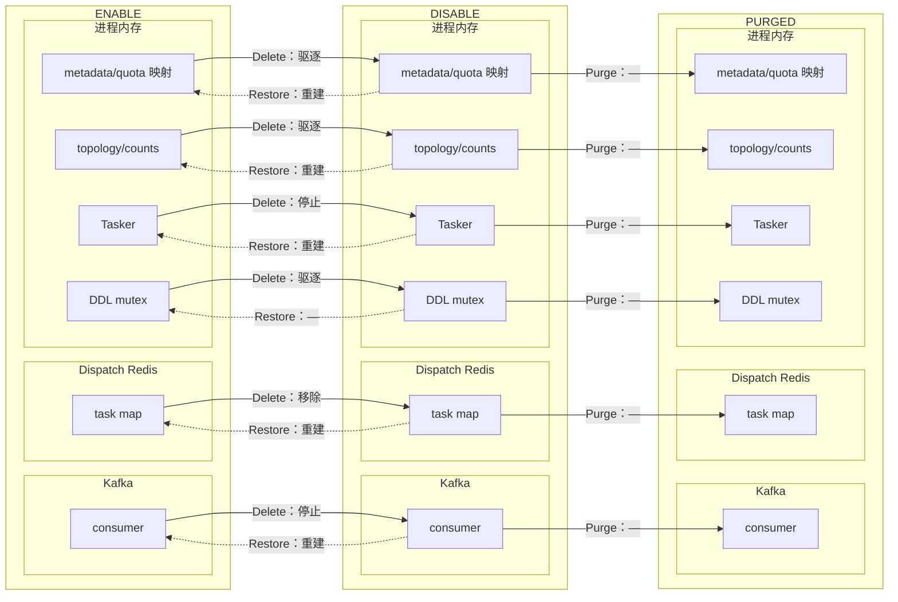
```mermaid
flowchart LR
    subgraph enable["ENABLE"]
        subgraph e_kafka["Kafka"]
            ELoader["consumer"]
        end
        subgraph e_redis["Dispatch Redis"]
            EMap["task map"]
        end
        subgraph e_memory["进程内存"]
            EMeta["metadata/quota 映射"]
            ECounts["topology/counts"]
            ETasker["Tasker"]
            EMutex["DDL mutex"]
        end
    end

    subgraph disable["DISABLE"]
        subgraph d_kafka["Kafka"]
            DLoader["consumer"]
        end
        subgraph d_redis["Dispatch Redis"]
            DMap["task map"]
        end
        subgraph d_memory["进程内存"]
            DMeta["metadata/quota 映射"]
            DCounts["topology/counts"]
            DTasker["Tasker"]
            DMutex["DDL mutex"]
        end
    end

    subgraph purged["PURGED"]
        subgraph p_kafka["Kafka"]
            PLoader["consumer"]
        end
        subgraph p_redis["Dispatch Redis"]
            PMap["task map"]
        end
        subgraph p_memory["进程内存"]
            PMeta["metadata/quota 映射"]
            PCounts["topology/counts"]
            PTasker["Tasker"]
            PMutex["DDL mutex"]
        end
    end

    EMap -->|Delete：移除| DMap
    ETasker -->|Delete：停止| DTasker
    ELoader -->|Delete：停止| DLoader
    EMeta -->|Delete：驱逐| DMeta
    ECounts -->|Delete：驱逐| DCounts
    EMutex -->|Delete：驱逐| DMutex
    DMap -.->|Restore：重建| EMap
    DTasker -.->|Restore：重建| ETasker
    DLoader -.->|Restore：重建| ELoader
    DMeta -.->|Restore：重建| EMeta
    DCounts -.->|Restore：重建| ECounts
    DMutex -.->|Restore：—| EMutex
    DMap -->|Purge：—| PMap
    DTasker -->|Purge：—| PTasker
    DLoader -->|Purge：—| PLoader
    DMeta -->|Purge：—| PMeta
    DCounts -->|Purge：—| PCounts
    DMutex -->|Purge：—| PMutex
```

### 流量变化图

数据按项目状态分支，展示不同路径和 PM Hook 操作：

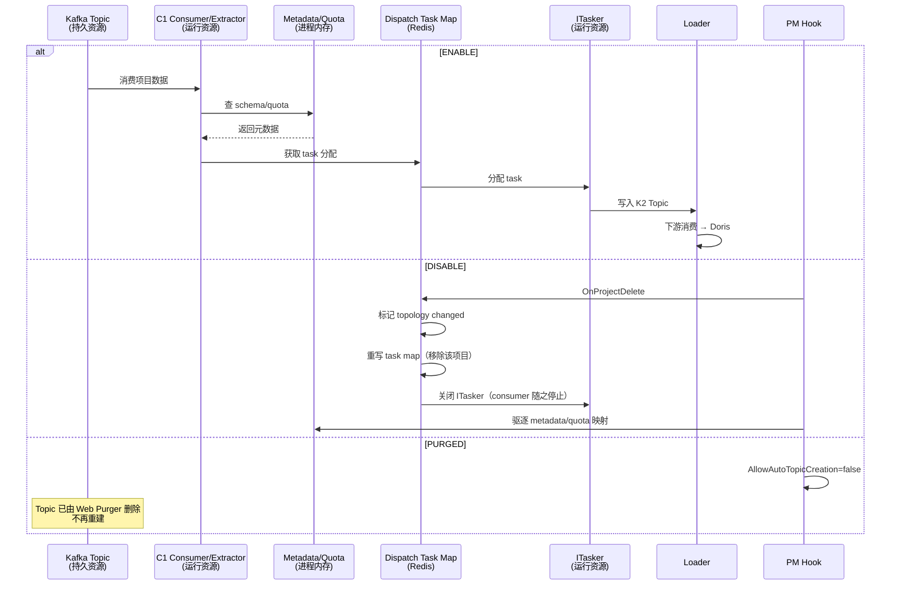
```mermaid
sequenceDiagram
    participant T as Kafka Topic<br/>(持久资源)
    participant C as C1 Consumer/Extractor<br/>(运行资源)
    participant M as Metadata/Quota<br/>(进程内存)
    participant D as Dispatch Task Map<br/>(Redis)
    participant I as ITasker<br/>(运行资源)
    participant L as Loader
    participant H as PM Hook

    alt ENABLE
        T->>C: 消费项目数据
        C->>M: 查 schema/quota
        M-->>C: 返回元数据
        C->>D: 获取 task 分配
        D->>I: 分配 task
        I->>L: 写入 K2 Topic
        L->>L: 下游消费 → Doris
    else DISABLE
        H->>D: OnProjectDelete
        D->>D: 标记 topology changed
        D->>D: 重写 task map（移除该项目）
        D->>I: 关闭 ITasker（consumer 随之停止）
        H->>M: 驱逐 metadata/quota 映射
    else PURGED
        H->>H: AllowAutoTopicCreation=false
        Note over T: Topic 已由 Web Purger 删除<br/>不再重建
    end
```

### PM 接入现状与代码改动

#### Delete 阶段

| 文件 | 改动 |
| --- | --- |
| `pkg/dispatch/node.go`、`rdb.go` | `OnProjectDelete` 标记 topology changed，并为全部 active host 写完整权威 task map；仅承载目标项目的 host 也必须写空 `{}` |
| `pkg/dispatch/manager.go` | Pub/Sub 断线后重连并全量 `load()`；权威 map 不含项目时关闭对应 ITasker/Pipeline |
| `c1/metadata/metadata.go`、`pkg/dal/dorisx/ddl.go` | `OnProjectDelete` 新增 metadata/quota 映射和 DDL mutex 驱逐（防内存泄漏）；consumer/Pipeline 由 Dispatch owner 停止，全局 loader 不按项目关闭 |

#### Restore 阶段

| 文件 | 改动 |
| --- | --- |
| `pkg/dispatch/dispatcher.go` | topology 重建恢复 ITasker |
| `c1/metadata/metadata.go` | `OnProjectUpdate` 重建 metadata/quota 映射 |

#### Purge 阶段

| 文件 | 改动 |
| --- | --- |
| `service/project/resource_purger.go` | `project_dispatch` 核验全部 active host task map 不含目标项目 |

> **前置修复：** `apps/c1/loader/kafka_loader.go` 将 `AllowAutoTopicCreation` 改为 `false`（当前为 `true`），防止 Purge 删除 Topic 后 producer 自动重建。此项非 Purge 阶段操作，是启动配置变更，需优先部署。


---
## 7. apps/connector

### 定位

Connector 处理外部数据管道（AppsFlyer 等回传）。

### 流量入口与任务

HTTP Router 每请求查 PM；Pipeline runtime（handler、Kafka runner/consumer、批导上下文）由 Scheduler Worker 间接控制。

已注册 PM Hook 但 `OnProjectDelete` 为空。实际运行工作由 Scheduler 持有，不需要第二套停止逻辑。

### 资源台账

Connector 无自有 per-project 资源——Pipeline 单例无 `map[projectID]` 结构，stream consumer 由 Scheduler task 管理（task 结束自动关闭），批导 OSS 临时文件 run 完即清理。PM Hook 为空存根，生命周期由 Scheduler 统一管理。

详见 [Scheduler 生命周期管理](#TODO)。

### 流量变化图

请求经 Router 查 PM 后按项目状态分支，实际运行由 Scheduler 间接控制：

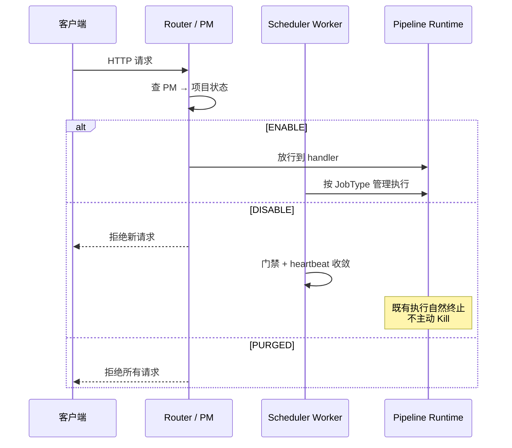
```mermaid
sequenceDiagram
    participant C as 客户端
    participant R as Router / PM
    participant S as Scheduler Worker
    participant P as Pipeline Runtime

    C->>R: HTTP 请求
    R->>R: 查 PM → 项目状态

    alt ENABLE
        R->>P: 放行到 handler
        S->>P: 按 JobType 管理执行
    else DISABLE
        R-->>C: 拒绝新请求
        S->>S: 门禁 + heartbeat 收敛
        Note over P: 既有执行自然终止<br/>不主动 Kill
    else PURGED
        R-->>C: 拒绝所有请求
    end
```

### PM 接入现状与代码改动

#### Delete 阶段

Connector 已注册 `OnProjectDelete` 但为空存根——无需改动。Kafka runner/consumer 由 Scheduler task lease 生命周期管理，task 到期自动关闭；批导 OSS 临时文件 run 完即清理。

#### Restore 阶段

由 Scheduler 统一处理，Connector 无自有 per-project 状态需重建。

#### Purge 阶段

Pipeline 配置、Kafka Topic、OSS 临时目录由 Web Purger 统一清理。


---
## 8. apps/ma

### 定位

MA 是营销自动化引擎。

### 流量入口与任务

ConfigSync 管理 view/tracking/subscription，Runtime 持有 consumer、watcher、matcher、feedback/config/cohort cache 等项目级资源。

**MA 的独特性**：MA 拥有 Web 无法访问的独享 Redis 集群，但 Redis key 自带 TTL 自动过期，Purge 无需主动清理。Kafka 消费组在无 offset 提交后由 `offsets.retention.minutes` 控制自动删除。

### 资源台账

| 存储位置 | 资源 | 类型 | 内容与作用 | 代码文件 | 搜索关键词 |
| --- | --- | --- | --- | --- | --- |
| 进程内存 | ConfigSync Manager、view/tracking/subscription | 进程内状态 | 跟踪 MA 项目配置变更和同步状态，保证多副本间配置一致 | `apps/ma/service/configsync/sync.go` | Manager |
| 进程内存 | eventconsumer Service、config/cohort cache | 进程内状态 | 缓存营销自动化运行时的反馈/配置/分群数据，加速事件处理和触达决策 | `apps/ma/service/eventconsumer/coordinator.go` | Service |
| 进程内存 | consumer/watcher/sweeper/materializer | 运行资源 | 消费项目事件、监听配置变化、匹配受众条件、清除过期数据，驱动营销触达的执行引擎 | `apps/ma/service/eventconsumer/coordinator.go` | consumeLoop |
| MA 独享 Redis | `ma:{p:<pid>}:*` | 持久资源 | 存储 MA 项目独享的运行状态数据：延迟队列（TTL dueAt+7d）、幂等/合并键（TTL 72h）、限速（TTL 3s）、续传位点等，支撑营销自动化的独立执行 | `apps/ma/service/delayqueue/`、`apps/ma/service/dispatch/stores.go` | ma:{p: |
| 共享 Redis | `ma:{p:<pid>}:*`（epoch、fanout rate-limit） | 持久资源 | 存储 MA 项目在多副本间共享的运行数据：pub/sub flip 通知、activation epoch（TTL 跟随 epoch 周期）等，支撑跨实例协调 | `apps/ma/service/eventconsumer/coordinator.go`、`apps/ma/service/fanout/ratelimit.go` | ma:{p: |
| Kafka | MA 消费组 `{GroupPrefix}.{pid}` | 运行资源 | 记录 MA 项目事件消费的偏移量，保证营销触达的可靠性和顺序执行。无 active member 后 `offsets.retention.minutes`（默认 7 天）自动回收，无需主动清理 | `apps/ma/service/eventconsumer/coordinator.go` | GroupPrefix / group(pid) |

### 生命周期变化图

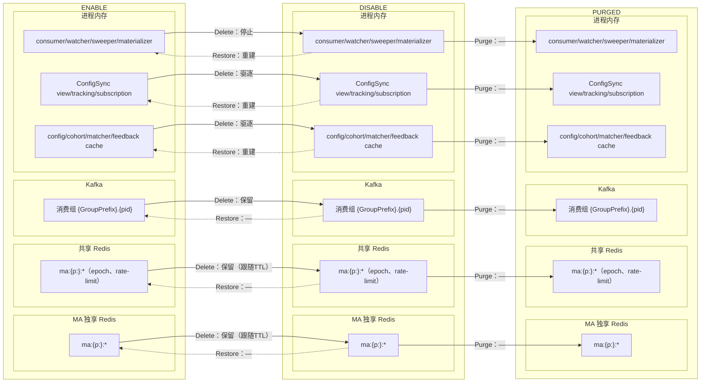
```mermaid
flowchart LR
    subgraph enable["ENABLE"]
        subgraph e_exredis["MA 独享 Redis"]
            EExKey["ma:{p:<pid>}:*"]
        end
        subgraph e_shredis["共享 Redis"]
            EShKey["ma:{p:<pid>}:*（epoch、rate-limit）"]
        end
        subgraph e_kafka["Kafka"]
            EGroup["消费组 {GroupPrefix}.{pid}"]
        end
        subgraph e_memory["进程内存"]
            ERun["consumer/watcher/sweeper/materializer"]
            EConfigSync["ConfigSync view/tracking/subscription"]
            ECache["config/cohort/matcher/feedback cache"]
        end
    end

    subgraph disable["DISABLE"]
        subgraph d_exredis["MA 独享 Redis"]
            DExKey["ma:{p:<pid>}:*"]
        end
        subgraph d_shredis["共享 Redis"]
            DShKey["ma:{p:<pid>}:*（epoch、rate-limit）"]
        end
        subgraph d_kafka["Kafka"]
            DGroup["消费组 {GroupPrefix}.{pid}"]
        end
        subgraph d_memory["进程内存"]
            DRun["consumer/watcher/sweeper/materializer"]
            DConfigSync["ConfigSync view/tracking/subscription"]
            DCache["config/cohort/matcher/feedback cache"]
        end
    end

    subgraph purged["PURGED"]
        subgraph p_exredis["MA 独享 Redis"]
            PExKey["ma:{p:<pid>}:*"]
        end
        subgraph p_shredis["共享 Redis"]
            PShKey["ma:{p:<pid>}:*（epoch、rate-limit）"]
        end
        subgraph p_kafka["Kafka"]
            PGroup["消费组 {GroupPrefix}.{pid}"]
        end
        subgraph p_memory["进程内存"]
            PRun["consumer/watcher/sweeper/materializer"]
            PConfigSync["ConfigSync view/tracking/subscription"]
            PCache["config/cohort/matcher/feedback cache"]
        end
    end

    EExKey -->|Delete：保留（跟随TTL）| DExKey
    EShKey -->|Delete：保留（跟随TTL）| DShKey
    EGroup -->|Delete：保留| DGroup
    ERun -->|Delete：停止| DRun
    ECache -->|Delete：驱逐| DCache
    EConfigSync -->|Delete：驱逐| DConfigSync
    DExKey -.->|Restore：—| EExKey
    DShKey -.->|Restore：—| EShKey
    DGroup -.->|Restore：—| EGroup
    DConfigSync -.->|Restore：重建| EConfigSync
    DRun -.->|Restore：重建| ERun
    DCache -.->|Restore：重建| ECache
    DExKey -->|Purge：—| PExKey
    DShKey -->|Purge：—| PShKey
    DGroup -->|Purge：—| PGroup
    DConfigSync -->|Purge：—| PConfigSync
    DRun -->|Purge：—| PRun
    DCache -->|Purge：—| PCache
```

### 流量变化图

MA 无外部请求入口，内部两条执行路径 + ConfigSync 控制面同步：

```mermaid
sequenceDiagram
    participant S as Scheduler Worker
    participant C as ConfigSync
    participant K as Kafka K2 Topic
    participant E as EventConsumer
    participant Q as DelayQueue
    participant D as DispatchPipeline
    participant T as TimeTrigger / Fanout

    alt ENABLE
        C->>C: 轮询 Web 内部 API + Redis Pub/Sub
        activate C
        Note over C: 拉取 Running Campaign 配置<br/>build 倒排索引
        S->>E: CONTINUOUS Job 领取
        activate E
        Note over E: PlanTasks: 检查 activation epoch<br/>epoch 变化→重置偏移量到 latest
        E->>K: 消费 df_{pid}_event
        K-->>E: 事件数据
        E->>E: 匹配触发/取消规则
        alt delay > 0
            E->>Q: 入延迟队列
            activate Q
            Note over Q: Sweeper 秒级扫描<br/>到期→HandleDue
            Q->>D: DispatchPipeline
            deactivate Q
        else delay = 0
            E->>D: 立即触达
        end
        S->>T: Job.Once fire 领取
        activate T
        T->>T: 物化受众到 Doris Fanout Batch<br/>分 shard 逐批 dispatch
        T->>D: DispatchPipeline
        deactivate T
    else DISABLE
        C->>C: PM Delete Hook → OnProjectDelete
        activate C
        Note over C: ConfigSync Untrack(pid)<br/>停止轮询和 Pub/Sub<br/>移除 view/tracking/subscription
        deactivate C
        S->>E: 停止 CONTINUOUS Job
        deactivate E
        Note over T: 不再 chain 下一 fire
        Note over Q: Sweeper 随 coordinator 退出
        Note over D: 既有触达收尾后停止
    else PURGED
        Note over C,D: Redis Key TTL 自动过期<br/>消费组 offset.retention 后自动删除
    end
```

### PM 接入现状与代码改动

#### Delete 阶段

| 文件 | 改动 |
| --- | --- |
| `ma/service/configsync/sync.go` | `Untrack(pid)` 停止 per-project ConfigSync flip watcher goroutine；全局 poll loop 遍历 `TrackedProjects` 时自动跳过 |
| `ma/service/eventconsumer/coordinator.go` | 注册 PM Delete Hook：Scheduler CONTINUOUS job 因 PM 门禁不再 PlanTasks → coordinator 和其启动的 sweeper goroutine 自动终止；CohortIndex flip watcher 同步停止 |

> MA 独占/共享 Redis key 不主动清理——幂等 key（TTL 72h）、限速 key（TTL 3s）、延迟队列详情（TTL 7d）等自带过期。Scheduler handler lease 无 heartbeat 续约后自然释放。全局 daemon（lifecycle 扫描、cohortindex poll loop）不受影响。

#### Restore 阶段

| 文件 | 改动 |
| --- | --- |
| `ma/service/configsync/sync.go` | ConfigSync `SetInfo` 重建 tracking/subscription |

#### Purge 阶段

| 文件 | 改动 |
| --- | --- |
| — | MA 独享/共享 Redis key 自带 TTL 自动过期；Kafka 消费组无 offset 提交后 `offsets.retention.minutes` 后自动删除。无需主动清理 |

---
## 9. apps/simulator

### 定位

Simulator 是模拟/测试工具，不初始化 PM、不注册生产 Scheduler handler、不持有 Wave 项目资源。在生产生命周期中无角色。

### PM 接入现状与代码改动

#### Delete 阶段

| 文件 | 改动 |
| --- | --- |
| — | Simulator 不初始化 PM，不持有项目资源，无需改动 |

#### Restore 阶段

| 文件 | 改动 |
| --- | --- |
| — | 无生产资源，无需处理 |

#### Purge 阶段

| 文件 | 改动 |
| --- | --- |
| — | 无生产资源，无需处理 |


---

## 10. 共享基础设施

### 10.1 pkg/pm：可用项目目录与 Hook 管理

PM 是所有组件接入生命周期的核心。它维护可用项目目录，并在项目状态变化时通知已注册的 Hook。

**资源台账**

| 存储位置 | 资源 | 类型 | 内容与作用 | 代码文件 | 搜索关键词 |
| --- | --- | --- | --- | --- | --- |
| Redis | 可用项目集合索引 `sys:{pm}:projects` | 运行资源 | 维护可用项目集合，作为所有组件门禁决策的唯一数据源 | `pkg/pm/project_manager.go` | KeySysPMProjects |
| Redis | 项目运行时快照 `sys:{pm}:info:<pid>` | 运行资源 | 存储项目运行时必要信息，供无项目 DB 访问的组件获取连接参数和状态 | `pkg/pm/project_manager.go` | KeySysPMInfoPrefix |
| Redis | `sys:{pm}:info_change` Pub/Sub | 运行资源 | 广播项目状态变更事件，驱动各组件同步更新本地快照 | `pkg/pm/project_manager.go`、`pkg/dal/redisx/redis.go` | KeySysPMInfoChange |
| 进程内存 | Manager `projects` map | 进程内状态 | 缓存 PM 本地的项目索引，加速组件门禁查询避免每次查 Redis | `pkg/pm/project_manager.go` | projects |

**代码改动**

| 文件 | 改动 |
| --- | --- |
| `pkg/pm/project_manager.go` | 可用项目集合索引/项目运行时快照写错误上抛；写后本地同步；Pub/Sub 仅作通知；`autoSubscribe` 断线后重连并新增差集对账，必须处理 removed 和空快照，读取失败不得清空本地 map |
| - | 保留 `SetInfo/DeleteInfo`，不新增 Restore 事件或方法 |

### 10.2 pkg/scheduler：分布式任务调度

Scheduler Master 负责 cron/notify 和 Instance 生命周期。Worker 负责任务领取和执行 heartbeat。

**代码改动**

| 文件 | 改动 |
| --- | --- |
| `pkg/scheduler/master.go` | refresh cron 和生成 Instance 前检查 PM |
| `pkg/scheduler/worker.go` | 领取 Instance/Task 和 heartbeat 时检查 PM；缺失时取消 context、释放 lease |
| `pkg/scheduler/purge.go` **新增** | `PurgeProjectRedisState`：先查询现有 Instance heartbeat/Task ownership；仍活动、查询失败或超时时返回错误，确认为空后再定向移除目标项目 notify/delayed member 和运行 Key |

> 不修改 Job/Instance/Task 持久状态。Master 只不生成，Worker 只释放 lease。

### 10.3 pkg/dispatch：任务拓扑分配

Dispatch Node 通过 PM Hook 接收项目变化，通过 `refreshTopo` 重写 task map。当前 `OnProjectDelete` 只删除 Redis counts，未可靠触发 topology 重写。

**代码改动**

| 文件 | 改动 |
| --- | --- |
| `pkg/dispatch/node.go` | 修正 `OnProjectDelete`：标记 topology changed + 重写 task map 并关闭 ITasker |
| `pkg/dispatch/task.go` | 验证 `OnProjectDelete` 后 project task map 和 counts 已清除 |

### 10.4 存储 client

| 包 | Purge 职责 | 说明 |
| --- | --- | --- |
| `dal/pgsqlx` | Meta/Data Schema `DROP SCHEMA IF EXISTS CASCADE` | 由 PG owner 在 Purge 步骤中执行 |
| `dal/dorisx` | `DROP DATABASE IF EXISTS` | Doris 清理 |
| `dal/kafkax` | 删除 Topic + 按前缀删除 consumer group | C1 producer 关闭自动建 Topic |
| `dal/redisx` | 按项目前缀 `p:<pid>:*` 定向删除 | 不新增通用 prefix delete 接口 |

---

## 11. Purge 固定顺序与资源 owner

### Purge 顺序

Purge 是同步、可重入的。`ProjectResourcePurger` 按固定顺序调用各资源 owner。任一步失败停止，重试从第一步开始。

| 顺序 | step | owner | 清理内容 |
| --- | --- | --- | --- |
| 0 | `project_pm` | PM | 确认项目已从 PM 移除 |
| 1 | `project_dispatch` | Dispatch | 发布并核验所有 active host 的权威 task map 不含目标项目 |
| 2 | `project_ma` | MA client | 确认配置的项目消费组无 active member，再清独享/共享 Redis 和 exact group |
| 3 | `project_wagent` | Wagent | 确认 execution ownership 已释放，再清所有含 `p:<pid>:` 前缀的项目级 key；全局 List queue + Sorted Set inflight 因跨项目混合无法按 project_id 清理，跳过 |
| 4 | `project_redis` | Redis owner | 确认 Scheduler ownership 已释放，再清 Scheduler 与 Web Redis 状态 |
| 5 | `project_oss` | OSS owner | 删除并核验 `load/backfill/events_cron/users_cron/<pid>/` |
| 6 | `project_kafka` | Kafka owner | 确认项目 Topic 无 active assignment，再删除 Topic 和 MA 项目消费组；LiveEvent `live-event-<pid>-*` 通配 group 不主动删除（无 consumer 时残留 group 无影响） |
| 7 | `project_doris` | Doris owner | 取得 migration mutex、重查 `PURGING` 后 `DROP DATABASE IF EXISTS` |
| 8 | `project_data_pg` | PG owner | 取得 migration mutex、重查 `PURGING` 后 `DROP SCHEMA <data_schema> CASCADE` |
| 9 | `project_meta_pg` | PG/Asset owner | Asset 有界 drain 后 `DROP SCHEMA <meta_schema> CASCADE` |
| 10 | `final_global` | ProjectService | 最终核验 → Global PG 事务写 `PURGED,true` |

### 关键规则

- 资源不存在视为成功（幂等）。
- PM 缺失只阻止新工作，不证明旧工作已结束；owner 的 ownership、heartbeat、task map、group member/assignment 或 drain 查询失败、超时、仍活动时立即停止并保持 `PURGING`。
- Kafka、OSS 等最终一致资源在步骤内做必要验证。
- Meta Schema 在最后删除，保证前置清理仍可读取项目元数据。
- 最终事务前做一次显式最终核验。

---

## 12. 契约

### 12.1 Schema 与条件更新

新环境同步修改 `script/sql/pgsql/global.sql`：

```sql
-- organization 表
status VARCHAR(64) NOT NULL DEFAULT 'ENABLE',

-- project.status 的现有列不变，只把注释中的状态集合更新为：
-- INITIALIZING / ENABLE / DISABLE / PURGING / PURGED
```

存量环境新增 `script/migration/scripts/global_v20260724_organization_lifecycle.sql`。SQL migration 由现有 loader 自动注册，并在 Global PG 事务中执行：

```sql
ALTER TABLE organization
    ADD COLUMN IF NOT EXISTS status VARCHAR(64);

UPDATE organization
SET status = CASE
    WHEN is_deleted = true THEN 'DISABLE'
    ELSE 'ENABLE'
END
WHERE status IS NULL;

ALTER TABLE organization
    ALTER COLUMN status SET DEFAULT 'ENABLE',
    ALTER COLUMN status SET NOT NULL;

COMMENT ON COLUMN organization.status
    IS '组织状态：ENABLE/DISABLE/PURGING/PURGED';
```

同步更新 `apps/web/dao/global/organization.go`：`Organization` 增加 `Status string`（`gorm:"column:status;type:varchar(64);default:'ENABLE'"`），新增 `ENABLE/DISABLE/PURGING/PURGED` 常量。migration 不新增 CHECK、trigger 或索引，也不覆盖已经存在的非空 lifecycle 状态。

| 操作 | SQL 条件 |
| --- | --- |
| Project Delete | `id=? AND status='ENABLE' AND is_deleted=false` |
| Project Restore | `id=? AND status='DISABLE' AND is_deleted=false` |
| Project Purge 新数据 | `id=? AND status='DISABLE' AND is_deleted=false` |
| Project Purge 历史数据 | `id=? AND status='DISABLE' AND is_deleted=true` |
| Project Purge 重试 | `id=? AND status='PURGING'`，保持原 `is_deleted` |
| Organization Delete/Restore | 相应 `ENABLE/DISABLE AND is_deleted=false` |
| Organization Purge | `status='DISABLE' AND is_deleted=false`；`PURGING` 可重试 |

DAO 新增方法（`dao/global/project.go` + `dao/global/organization.go`）：
`MarkProjectEnabledIfInitializing`、`MarkProjectDisabledIfEnabled`、`MarkProjectEnabledIfDisabled`、`MarkProjectPurgingIfDisabled`、`MarkProjectPurgingLegacyIfDisabled`、`MarkProjectPurgedIfPurging` 及对应 Organization 方法；查询使用 `GetByIDWithDeleted`、`ListLifecycleByOrg`、`GetAllMigrationProjects`。

Migration runner 和 `project_doris/project_data_pg/project_meta_pg` 复用现有 `redisx.AcquireLock/ReleaseLock` 做单项目短互斥。取得锁后必须重查 lifecycle；DDL statement timeout 必须短于锁 TTL。锁不续租，不新增锁包，拿不到锁或锁内发现 `PURGING` 时 migration 跳过该项目。

### 12.2 Purge 内部类型

```go
type PurgeTarget struct {
    ProjectID          int64
    OrganizationID     int64
    KafkaTopics        []string
    KafkaGroupPrefixes []string
    OSSPrefixes        []string
    DorisDatabase      string
    DataSchema         string
    MetaSchema         string
}

type PurgeResult struct {
    ResourceID int64
    Status     string
    Purged     bool
}

type PurgeStepError struct {
    Step string
    Err  error
}
```

`PurgeTarget` 在写 `PURGING` 的同一短锁阶段构造，仅本次调用内传递，不持久化。

### 12.3 MA 内部 endpoint

```text
POST /internal/v1/project/purge
Authorization: Bearer <MA_PROJECT_PURGE_TOKEN>
X-Internal-Service: web
Project: <positive int64>
```

| 响应码 | 语义 |
| --- | --- |
| 204 | 幂等成功 |
| 400 | Project header 缺失或无效 |
| 401 | Secret 不匹配 |
| 503 | MA Runtime 未就绪 |
| 500 | 清理或核验失败 |

Web 将非 204 映射为 `project_ma` 步骤错误。

### 12.4 OP API 请求

```yaml
CustomerLifecycleProjectActionRequest:
  required: [customer_id, project_id, confirm_value, reason]
  properties:
    customer_id: { type: integer, format: int64, minimum: 1 }
    project_id: { type: integer, format: int64, minimum: 1 }
    confirm_value: { type: string, minLength: 1, maxLength: 32 }
    reason: { type: string, minLength: 1, maxLength: 1000 }
```

动作成功返回 `resource_id/status/purged`。失败返回结构化 data：`resource_id`、至多 20 个 `blocked_ids`、`blocked_count`、`step`。

## 13. 错误处理与测试策略

### 13.1 错误与事务

| 场景 | 结果 |
| --- | --- |
| 非 OP、跨客户、参数非法 | PermissionDenied/BadParam，记 `verify_failed` |
| 短锁占用 | Conflict，状态不变 |
| PM/DB 部分成功 | fail-closed，重复动作对账 |
| owner 的 ownership/group/drain 查询失败、超时或仍活动 | 保留 `PURGING`，返回当前稳定 step，不删除后续资源 |
| migration mutex 占用或 DDL timeout | 保留 `PURGING`，返回 Doris/PG step |
| Purge step 中资源不存在 | 视为成功（幂等），继续下一步 |
| 任一 owner 失败 | 保留 `PURGING`，从头重跑 |
| 最终核验失败 | 保留 `PURGING` |
| `PURGED,true` | 返回当前墓碑 |
| 墓碑不存在 | NotFound，不查审计猜测历史结果 |

所有 Global 状态切换是条件 UPDATE。Redis/MA/Kafka/OSS/Doris/PG 删除全在事务外。

### 13.2 单元测试覆盖

| 范围 | 必测行为 |
| --- | --- |
| Project Service | Delete/Restore 幂等、`INITIALIZING` 拒绝生命周期动作且只允许初始化转 `ENABLE`、组织边界、`PURGED` 快速返回 |
| ProjectResourcePurger | 固定顺序、owner 停止依据、失败即停、重跑幂等、target 不变、最终核验 |
| Organization Service | 逐项目约束、Restore 不级联 |
| Organization status SQL | bootstrap 默认值；存量 active/deleted 分别回填 `ENABLE/DISABLE`；重复执行不覆盖非空状态 |
| PM | 状态写错误、本地同步、Pub/Sub 非持久通知、订阅重连、removed/空快照对账 |
| Scheduler | Master/Worker/heartbeat 三层门禁、11 个 JobType |
| Dispatch/C1 | 重写 map、Tasker 关闭、metadata 驱逐、auto-create 关闭 |
| MA endpoint | Secret/caller 校验、两个 Redis、消费组、多副本 |
| Web 旁路 | MCP/Internal/QE、LiveEvent active group、Asset drain、Wagent 队列 + inflight 行为 |
| Migration mutex | 同项目 migration/Purge 互斥、锁内状态重查、DDL timeout |
| 存储 owner | Redis 定向、OSS 空前缀、Kafka 删除轮询 |

### 13.3 集成验证

1. 建立包含全部项目资源的 fixture
2. Delete 前后逐项比较持久资源未减少，新工作被拒绝
3. 初始化暂停在任一资源创建阶段时，Delete/Restore/Purge 均拒绝，最终只能条件写 `ENABLE`
4. 执行 migration，确认 `DISABLE,false` 项目继续升级；并发 Purge 由同一项目 mutex 串行，锁内重查阻止陈旧快照继续 DDL
5. Restore 后新工作恢复，错过的不补偿
6. 分别保持 Scheduler/Wagent ownership、Dispatch/C1 assignment、MA/LiveEvent group 或 Asset flush 活动，确认 Purge 停在对应 step
7. 每个 Purge step 分别注入失败，确认重跑幂等且 `PURGING` 状态禁止 Restore
8. 清理后触发旧 producer/notify，确认不复活
9. 多 PM/MA 实例验证订阅重连和空快照删除本地幽灵项目
10. 六类动作全部有脱敏审计
11. 分别从空库 bootstrap 和包含 `is_deleted=false/true` Organization 的旧库执行 schema 初始化，验证 status 为 `ENABLE/DISABLE`、NOT NULL/default 生效且 migration 重跑不改已有状态

```bash
go test ./apps/web/service/project ./apps/web/service/organization ./pkg/pm ./pkg/scheduler
go test ./apps/edge/... ./apps/adtol/... ./apps/abol/... ./apps/connector/...
go test ./apps/c1/... ./apps/ma/... ./apps/simulator/...
go test ./apps/web/qe/catalog ./apps/web/service/liveevent ./apps/web/service/asset
go test ./apps/web/wagent/... ./apps/web/op/...
```
