# Wave 组织与项目生命周期治理：详细设计（面向评审）

> 本文档是 [04-detail.md](../04-detail.md) 的面向评审版本。内容与源文档一致，但按组件组织、一处讲完。
>
> **前提**：你已阅读 [01-spec.md](../01-spec.md) 和 [03-plan.md](../03-plan.md)，熟悉 Delete/Restore/Purge 语义和顶层架构。

---

## 1. 全局图景

### 1.1 全局流量路径

项目流量通过以下路径进入各组件。PM 门禁位于每个同步入口处；异步入口由 Scheduler/Dispatch 门禁和 Hook 控制。

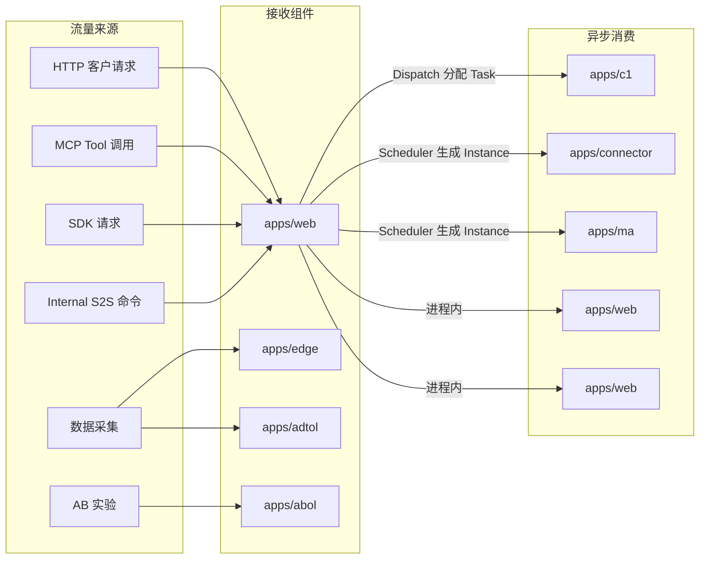

**说明**

- **同步入口**（HTTP/MCP/SDK/Internal → apps/web）：经过 `ProjectFilter`/`authorizeProjectContext` PM 门禁，每请求检查项目是否可用。
- **数据入口**（Edge/ADTOL）：经过 `Token2ProjectID` PM 门禁，路由到目标项目后写入 Kafka。
- **实验入口**（ABOL）：经过 Router PM 门禁后，由 Abol core 处理。
- **异步消费**（Connector/MA）：由 Scheduler Master 生成 Instance，Worker 领取时检查 PM。
- **进程内消费**（C1、LiveEvent、Wagent）：由 Dispatch topology、PM Hook 或 heartbeat 控制。

### 1.2 Delete：PM Hook 传播

OP 发起 Delete 后，ProjectService 通过 PM 向持有项目运行资源的模块广播通知：

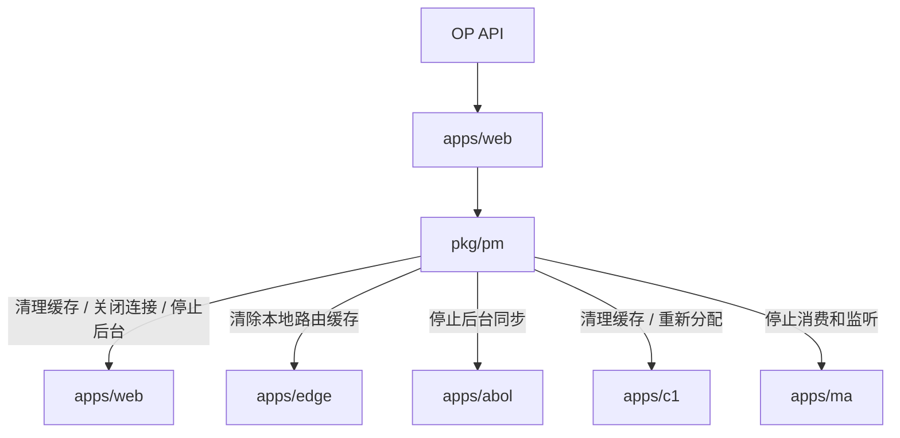

各模块收到 Hook 后的具体动作在对应组件章节中展开。未出现在图中的组件（ADTOL、Simulator）不持有项目运行资源，不需要 Hook。

同一进程内 Hook 同步触发，跨进程 Hook 通过 PM Pub/Sub + 快照对账传播。不等待远端 ACK。

### 1.3 Restore：PM Update Hook 传播

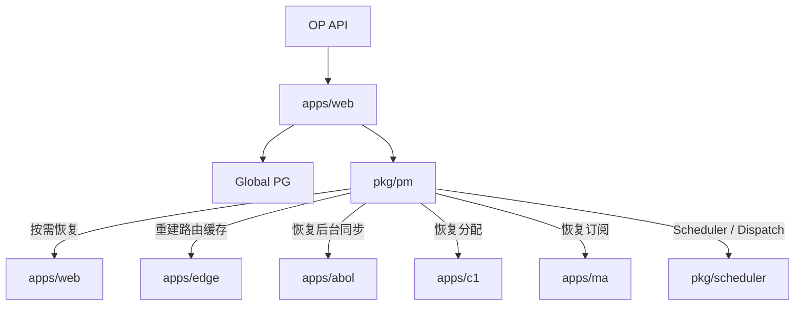

### 1.4 Purge：同步清理流程

Purge 与 Delete/Restore 不同，它是一个同步、按固定顺序执行的清理过程：

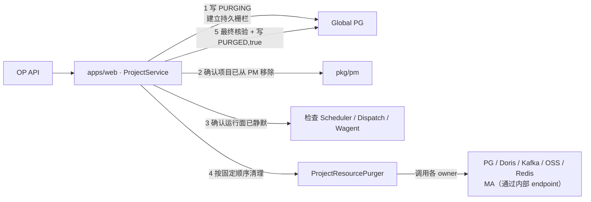

完整 12 步顺序见[第 11 章](#11-purge-固定顺序与资源-owner)。Purge 过程中 `PURGING` 状态禁止 Restore，失败后只能从头重试 Purge。

### 1.5 四层收敛机制

| # | 机制 | 覆盖范围 | 延迟 |
| --- | --- | --- | --- |
| 1 | 请求门禁 | 每请求查 PM：Edge、ADTOL、ABOL、Web API、MCP、Internal S2S | 毫秒级 |
| 2 | 任务门禁 | Scheduler Master 生成 Instance 前查 PM、Worker 领取时查 PM | 秒级 |
| 3 | PM Delete Hook | 持有项目级运行资源的模块：QE、LiveEvent、Asset、Wagent、Edge TrackService、Abol core、C1、Dispatch、MA、Connector | 毫秒级（同进程）、秒级（跨进程） |
| 4 | heartbeat 取消 | 运行中 Scheduler handler 在定期 heartbeat 中发现项目不存在 → 取消 context、释放 lease | 秒~分钟级 |

### 1.6 组件索引

| 组件 | 角色 | 章节 |
| --- | --- | --- |
| `apps/web` | 控制面发起者 + Web 业务 + QE/LiveEvent/Wagent/Asset 运行模块 | [第 2 章](#2-appsweb) |
| `apps/edge` | 数据采集入口 | [第 3 章](#3-appsedge) |
| `apps/adtol` | 数据回传入口 | [第 4 章](#4-appstadtol) |
| `apps/abol` | AB 实验判定 | [第 5 章](#5-appsabol) |
| `apps/c1` + `pkg/dispatch` | 数据落盘消费 | [第 6 章](#6-appsc1--pkgdispatch) |
| `apps/connector` | 外部数据管道 | [第 7 章](#7-appsconnector) |
| `apps/ma` | 营销自动化 | [第 8 章](#8-appsma) |
| `apps/simulator` | 模拟/测试，无生产资源 | [第 9 章](#9-appssimulator) |
| 共享基础设施 | PM、Scheduler、Dispatch、存储 client | [第 10 章](#10-共享基础设施) |

---

## 2. apps/web

`apps/web` 是生命周期控制面的发起者，也是模块最多的 app。按职能分为五组：

- **控制面**：ProjectService（2.1）
- **项目存储根**：Meta/Data PG、Doris、Kafka、OSS（2.2）
- **入口门禁**：普通 Web API、MCP、Internal S2S（2.3）
- **运行子模块**：QE Catalog、LiveEvent、Wagent（2.4–2.6）
- **共享缓存**：权限、Token cache（2.7）

### 2.1 ProjectService：生命周期控制面

**定位**

ProjectService 是生命周期动作的入口和执行者。OP API → Customer Ops → ProjectService → PM + Global PG。它不持有项目级运行资源，所有副作用通过 PM 传播。

**流量入口与任务**

- **OP API 命令**（Delete/Restore/Purge）→ ProjectService 接收 → 操作 Global PG 四态 + PM 可用集合和运行时快照
- 控制面本身不接收项目数据请求，不涉及门禁


**资源台账**

| 存储位置 | 资源 | 类型 | 内容与作用 | Delete | Restore | Purge | 代码文件 | 搜索关键词 |
| --- | --- | --- | --- | --- | --- | --- | --- | --- |
| Global PG | project/org 主记录 | 持久资源 | ID、归属、配置、`status/is_deleted` 权威状态 | 写 `DISABLE` | 写 `ENABLE` | 写 `PURGED,true` | `dao/global/project.go`、`dao/global/organization.go` | ProjectDao / OrganizationDao |
| Global PG | member、邀请引用 | 持久资源 | 成员关系和未完成邀请 | 保留 | 保留 | 最终事务移除 | `dao/global/project_member.go`、`dao/global/member_invite.go` | ProjectMemberDao / MemberInviteDao |
| PM Redis | 可用项目集合索引 `sys:{pm}:projects` | 运行资源 | 可用 project ID 集合，供组件枚举 | 移除 project ID | 写回 project ID | 确认不含 | `pkg/pm/project_manager.go` | KeySysPMProjects |
| PM Redis | 项目运行时快照 `sys:{pm}:info:<pid>` | 运行资源 | Secret、状态、Schema/Database/Topic、配额 | 删除快照 | 写回现有快照 | 确认不存在 | `pkg/pm/project_manager.go` | KeySysPMInfoPrefix |

**生命周期变化图**
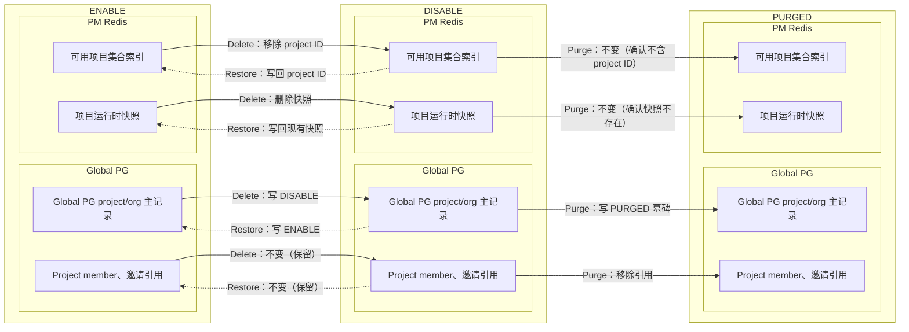

**代码改动**

| 文件 | 改动 |
| --- | --- |
| `service/project/delete.go` | 删除旧 Archive 和重 Delete；实现 `Delete/Restore`；Restore 用已有配置调 `PM.SetInfo` |
| `service/project/purge.go` | 实现 `Purge`、`PurgeTarget` 构造、`PURGING` 转换和最终结果映射 |
| `service/project/resource_purger.go` **新增** | `ProjectResourcePurger`，第 9 章固定顺序调用各 owner |
| `service/project/ma_purge.go` **新增** | 用 `net/http` 调 MA 内部 endpoint |
| `service/project/project.go` | 注入 Purger；禁止整行 `Save` 覆盖生命周期 |
| `service/project/create.go` | 创建要求父组织 `ENABLE,false` |
| `service/organization/organization.go` | 组织 `Delete/Restore/Purge` + 逐项目约束 |
| `dao/global/project.go` | 增加 `PURGING/PURGED`、条件状态更新 |
| `dao/global/organization.go` | 增加 `status` 字段映射、四态常量 |
| `dao/global/project_member.go` | 增加按 project ID 硬删除 |

### 2.2 项目存储根

**定位**

项目中立的持久资源层。由 Project 初始化时自动创建，Web/Connector/MA/Wagent 各组件持续写入和读取。

**流量入口与任务**

存储根不是入口——它不接收外部请求，不被门禁控制。写入和读取来自各组件的内部业务逻辑（Pipeline 写入 Kafka / Doris、Scheduler 读写 Meta PG 等）。Purge 必须以正确顺序清理这些资源。

**资源台账**

| 存储位置 | 资源 | 类型 | 内容与作用 | Delete | Restore | Purge | 代码文件 | 搜索关键词 |
| --- | --- | --- | --- | --- | --- | --- | --- | --- |
| Project PG | Meta `schema_<pid>` | 持久资源 | 事件/属性、Scheduler、AB、Dashboard、Pipeline 等表 | 保留 | 不检查、不重建 | `DROP SCHEMA CASCADE` | `pkg/dal/pgsqlx/` | schema_<pid> |
| Project PG | Data `schema_<pid>` | 持久资源 | `id_relation`、`raw_users` 身份关系 | 保留 | 不检查、不重建 | `DROP SCHEMA CASCADE` | `pkg/dal/pgsqlx/` | schema_<pid> |
| Doris | 项目 Database | 持久资源 | 事件、用户、分群、统计、MA fanout | 保留 | 不检查、不重建 | `DROP DATABASE IF EXISTS` | `pkg/dal/dorisx/` | DorisDatabase |
| Kafka | 项目 Topic 集合 | 持久资源 | `raw_event/event/other/error` 四类数据流 | 保留 | 不检查、不重建 | 删除 Topic + consumer group | `pkg/dal/kafkax/` | KafkaTopic |
| OSS | 项目前缀 | 持久资源 | `load/backfill/events_cron/users_cron/<pid>/` | 保留 | 不检查、不重建 | 删除四类前缀并确认空 | `pkg/dal/ossx/` | OSSPrefix |

**PM 接入：** 无。存储根是持久数据层，不受 PM 门禁控制。

**生命周期变化图**

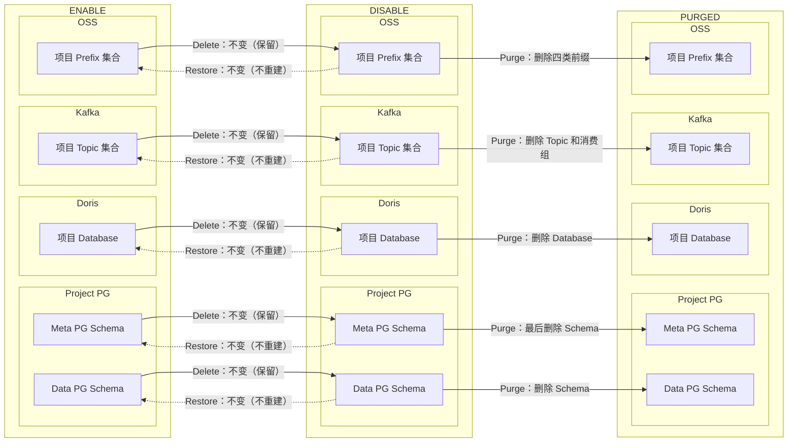


**代码改动（仅 Purge owner）**

| 清理 owner | 文件 | 具体改动 |
| --- | --- | --- |
| PG owner | 各 DAO | `DROP SCHEMA IF EXISTS <schema> CASCADE` |
| Doris owner | Doris client | `DROP DATABASE IF EXISTS <db>` |
| Kafka owner | Kafka admin | 删除 Topic + 按前缀删除 consumer group |
| OSS owner | OSS client | 删除四类 `load/backfill/events_cron/users_cron/<pid>/` 前缀 |

> **Pipeline 业务资源**（run/backfill/load-file、Scheduler Job/Instance/Task）保存在 Meta PG 中，Delete 只拒绝新工作允许既有执行收尾，不删除数据。Purge 随 Meta Schema 删除一并清理。入口门禁说明见 [2.3 入口门禁与在途请求](#23-入口门禁与在途请求) Internal S2S 表格。

### 2.3 入口门禁与在途请求

**定位**

普通 Web API、MCP、Internal S2S 是请求的入口。它们不保存项目数据，只决定请求是否允许进入。

**流量入口与任务**

| 入口 | 流量来源 | 当前门禁 | Delete 行为 | Restore 行为 |
| --- | --- | --- | --- | --- |
| 普通 Web API | 客户 HTTP | `ProjectFilter` 每请求查 PM | 拒绝不可用项目 | 恢复放行 |
| MCP | MCP tool | `authorizeProjectContext` 当前只校验成员关系和 Token scope，未查 PM | 需补充 PM 门禁 | 恢复后重新授权 |
| Internal S2S 新工作 | 内部创建/启动命令 | `InternalProjectContext` 只解析 Project Header | 新工作拒绝；在途查询和结果回写允许收尾 | 恢复新工作入口 |
| Internal S2S 在途 | 既有 Pipeline/MA 执行 | 无专门门禁 | 允许只读查询和回写 | 继续正常读取 |

**入口门禁变化图**

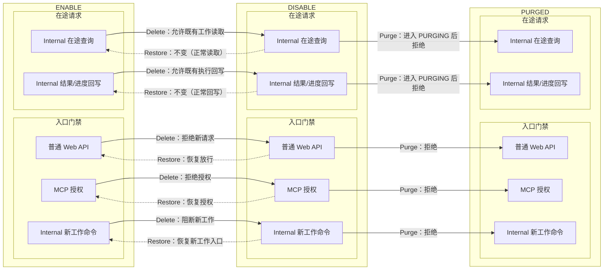

**代码改动**

| 文件 | 改动 |
| --- | --- |
| `pkg/ginx/middleware/project.go` | 审核全部路由；保留普通 API 的 PM 门禁，删除旧租户 lifecycle 入口；OP 生命周期明确绕过 |
| `pkg/ginx/middleware/organization.go` | 普通组织请求要求 `ENABLE,false` |
| `apps/web/mcp/tools/context.go` | `authorizeProjectContext` 在成员/scope 校验前检查 PM |
| `pkg/internalauth/middleware.go` | 继续只解析 Header，不增加全局 PM 拦截 |
| `service/pipeline/internal_metadata.go` | 新工作调 `requireInternalProjectEnabled`；在途查询/回写在 PM 缺失时读 Global 生命周期，只允许 `DISABLE,false` |
| `apps/web/ma/service/*` | materialize 等新工作入口检查 PM；结果回写同理 |

### 2.4 QE Catalog

**定位**

QE Catalog 是项目的元数据查询层，提供事件/属性/Cohort/Metric 等元数据目录服务。它在 Web 进程内维护 `catalogs[projectID]` 映射和 MetaCache。

**流量入口与任务**

QE Catalog 接收两类流量：
- **Web API 查询**（经过 ProjectFilter 门禁）→ 读取 `catalogs[projectID]` 和 MetaCache 返回元数据
- **后台 refresh loop**（每 30min 定时）→ 持有 Redis refresh lock，更新 MetaCache

注意：MetaCache 是进程本地映射，项目 Delete 后不会自动过期，refresh loop 也不会停止。这是需要核心处理的问题。

**资源台账**

| 存储位置 | 资源 | 类型 | 内容与作用 | Delete | Restore | Purge | 代码文件 | 搜索关键词 |
| --- | --- | --- | --- | --- | --- | --- | --- | --- |
| 进程内存 | `catalogs[projectID]` | 进程内状态 | 事件、属性、Cohort、Metric 查询 | Hook 驱逐 | 懒加载 | 清除 | `apps/web/qe/catalog/catalog.go` | catalogs |
| 进程内存 | MetaCache | 进程内状态 | QE Catalog 响应缓存 | Hook 驱逐 | 懒加载 | Meta Schema 删除 | `apps/web/qe/catalog/catalog.go` | MetaCache |
| 项目 Redis | refresh lock Key | 运行资源 | 防止重复 refresh | 保留 | 继续使用 | `project_redis` 删除 | `apps/web/qe/catalog/notifier.go` | KeySysCatalogRefreshLock |

**生命周期变化图**

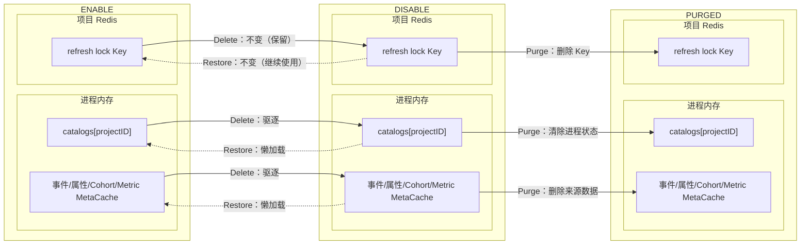

**PM 接入现状与代码改动**

**PM 接入状态**：已注册 `ProjectInfoHooker`（`web/qe/catalog/catalog.go` 搜索 `OnProjectDelete`）

| 阶段 | 现状 | 本期内容 | 代码文件 | 搜索关键词 |
| --- | --- | --- | --- | --- |
| Delete | `OnProjectDelete` 为空 | 从 `catalogs` map 驱逐目标项目；MetaCache 同步驱逐 | `web/qe/catalog/catalog.go` | `OnProjectDelete` |
| Restore | 无 Restore 处理 | 不主动写 `SetInfo`——查询时通过 `Record` 懒加载重建 | `web/qe/catalog/catalog.go` | `catalogs[` |
| Purge | 无 Purge 处理 | 清两类 QE refresh lock Key（不存在则跳过） | `web/qe/catalog/notifier.go` | `refresh_lock` |


### 2.5 LiveEvent

**定位**

LiveEvent 实时推送项目事件到客户端。客户端建连后在 Web 进程内持有 WebSocket 连接和对应的 Kafka consumer。连接建立时查 PM，但已有连接不会自动关闭。

**流量入口与任务**

LiveEvent 接收两类流量：
- **WebSocket 建连**（客户端请求）→ `RegisterClient` 检查 PM，成功后创建 WebSocket 连接和对应 Kafka consumer
- **Kafka 消费**（后台持续）→ consumer 从项目 Topic 拉取事件推送 WebSocket

**当前问题**：建连后不再复查 PM，项目 Delete 后已有连接继续推送，consumer 不关闭。

**资源台账**

| 存储位置 | 资源 | 类型 | 内容与作用 | Delete | Restore | Purge | 代码文件 | 搜索关键词 |
| --- | --- | --- | --- | --- | --- | --- | --- | --- |
| 进程内 | WebSocket | 运行资源 | 实时事件推送 | Hook 关闭 | 新连接懒启动 | 已无连接 | `apps/web/service/liveevent/liveevent.go` | wsClients |
| 进程内 | Kafka consumer | 运行资源 | 消费项目事件 | Hook 关闭 | 新连接重建 | 等待关闭 | `apps/web/service/liveevent/liveevent.go` | consumers |
| Kafka | `live-event-<pid>-*` group | 持久资源 | broker group metadata | 保留 | 不主动重建 | 按前缀删除 | `apps/web/service/liveevent/liveevent.go` | live-event-<pid> |

**PM 接入现状与代码改动**

**PM 接入状态**：未注册 PM Hook（`web/service/liveevent/liveevent.go` 搜索 `RegisterClient` / `ensureConsumer`）

| 阶段 | 现状 | 本期内容 | 代码文件 | 搜索关键词 |
| --- | --- | --- | --- | --- |
| Delete | 无 PM Hook | 新增 `CloseProject(projectID)`：`consumers[projectID].cancel()` 停止 consumer goroutine；`wsClients.Range()` 筛选 `filter.ProjectID == projectID` 的客户端关闭 WebSocket + Delete | `web/service/liveevent/liveevent.go` | `consumers[projectID]` / `wsClients` |
| Restore | 无 Restore 处理 | 不主动处理（新连接通过 `RegisterClient` 懒启动） | `web/service/liveevent/liveevent.go` | `RegisterClient` |
| Purge | 无 Purge 处理 | Kafka owner 按 group 前缀 `live-event-<pid>-*` 删除残留 consumer group | `web/service/liveevent/liveevent.go` | `live-event-` |

### 2.6 Wagent

**定位**

Wagent 是 Web 进程内的 AI 执行引擎。它管理 execution/compaction 的入队、领取和执行，同时在进程内存中维护 executor `running` map。后台 worker（claim、start、heartbeat）当前不查询 PM。

**流量入口与任务**

Wagent 接收三类流量：
- **HTTP API**（CompileConversation、StartMLCompaction）→ 间接受 ProjectFilter 控制，操作 `wagent_conversation/message` 持久层和执行 Stream
- **后台 claim worker**→ 不查 PM，从 Queue 领取 execution 到进程内 executor `running` map
- **后台 heartbeat**→ 不查 PM，续期执行 lease 和 active-lock

注意：claim/heartbeat 不查 PM，Delete 后仍可能领取新 execution。

**资源台账**

| 存储位置 | 资源 | 类型 | 内容与作用 | Delete | Restore | Purge | 代码文件 | 搜索关键词 |
| --- | --- | --- | --- | --- | --- | --- | --- | --- |
| Meta PG | `wagent_conversation/message` | 持久资源 | Conversation、Message 查询 | 保留 | 继续使用 | Meta Schema Drop | `apps/web/wagent/service/conversation.go` | wagent_conversation/message |
| 项目 Redis | execution/compaction Stream、DLQ、pending | 持久资源 | 入队或失败重试 | 禁止 claim/start，不 ACK | 恢复后重新领取 | 定向删除 entry | `apps/web/wagent/service/runtime/execution.go` | execution/compaction Stream |
| 项目 Redis | lease/event/active-lock Key | 运行资源 | 互斥、租约、事件 | 保留或自然过期 | 继续使用 | 定向删除 | `apps/web/wagent/service/runtime/events.go` | lease/event/active-lock Key |
| 项目 Redis | quota/rate-limit Key | 运行资源 | 配额和限流 | 保留或自然过期 | 继续使用 | 定向删除 | `apps/web/wagent/service/tokenquota/service.go`、`apps/web/wagent/service/ratelimit/ratelimit.go` | quota/rate-limit Key |
| 进程内存 | executor `running` map | 进程内状态 | 运行中 execution 管理 | heartbeat 取消 | 新执行创建 | 清除 | `apps/web/wagent/service/runtime/local_executor.go` | running |
| 进程内存 | MCP tool TTL cache | 进程内状态 | 工具列表缓存 | 保留或 TTL | 新请求恢复 | 不单独清理 | `apps/web/wagent/service/` | toolCache |

**生命周期变化图**

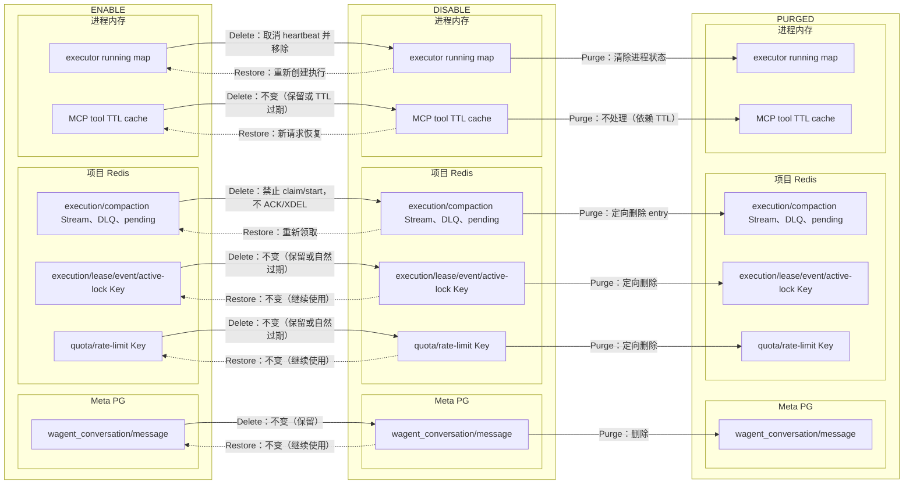

**PM 接入现状与代码改动**

**PM 接入状态**：未注册 PM Hook。后台 worker（claim/heartbeat）不查询 PM（`web/wagent/service/` 搜索 `claim` / `heartbeat`）

| 阶段 | 现状 | 本期内容 | 代码文件 | 搜索关键词 |
| --- | --- | --- | --- | --- |
| Delete | claim/heartbeat 不查 PM | claim/start 前检查 PM，不存在的项目不领取；heartbeat 查 PM，不含项目时取消 context、释放 lease；消息不 ACK、不 XDEL（保留在 Stream 中） | `web/wagent/service/runtime/` | `claim` / `heartbeat` |
| Restore | 无 Restore 处理 | 重新领取 Stream 消息 | `web/wagent/service/runtime/` | `claim` |
| Purge | 无 Purge 处理 | 清项目 Stream/DLQ、`p:<pid>:*`、quota/rate-limit Key | `web/wagent/service/runtime/`、`web/wagent/service/tokenquota`、`web/wagent/service/ratelimit` | `purge` |


### 2.7 权限与 Token cache

**定位**

项目权限、资产权限、Project→Org 和 Account API Token scope 的被动 TTL cache。不驱动执行，只加速查询。

**流量入口与任务**

这些 cache 由普通 API 请求触发填充，受 ProjectFilter 间接控制。项目 Delete 后 cache 保留但不会有新查询写入——请求已在门禁拒绝。

**代码改动**

| 文件 | 改动 |
| --- | --- |
| `service/permission/cache.go` | Delete/Restore 不清除；Purge 按固定 namespace 清目标 project key |
| `service/asset/permission/cache.go` | 同上 |
| `service/account/apitoken/service.go` | 让现有 cache 删除返回错误；Global 事务前严格驱逐、提交后 best-effort 重复驱逐 |

> 不新增 PM Hook——TTL cache 不会自行驱动新工作，不需要主动收敛。

---

## 3. apps/edge

### 定位

Edge 是数据采集入口。

### 流量入口与任务

收到 HTTP 请求后解析 Token，查 PM `Token2ProjectID` 路由到目标项目。进程内维护 `token2id`、`pipelineVersion`、`internalSecrets` 等内存映射加速后续请求。

### 资源台账

| 存储位置 | 资源 | 类型 | 内容与作用 | Delete | Restore | Purge | 代码文件 | 搜索关键词 |
| --- | --- | --- | --- | --- | --- | --- | --- | --- |
| 进程内存 | `token2id`、`pipelineVersion`、`internalSecrets` | 进程内状态 | Token 路由、Pipeline 版本、Secret 查询 | Hook 驱逐 | Hook 写回 | 不处理 | `apps/edge/service.go` | token2id |
| Kafka | producer | 持久资源 | 采集数据写入 | 保留 | 不变 | 不处理（Edge 不拥有 Kafka Topic） | `apps/edge/service.go` | KafkaProducer |

### 生命周期变化图

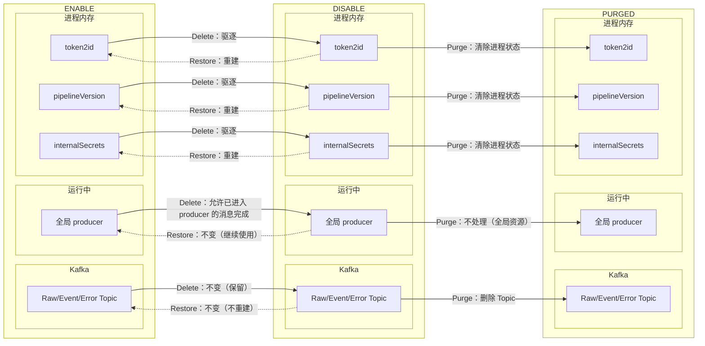

### PM 接入现状与代码改动

**PM 接入状态**：已注册 `ProjectInfoHooker`（`edge/service.go` 搜索 `OnProjectDelete`）

| 阶段 | 现状 | 本期内容 | 代码文件 | 搜索关键词 |
| --- | --- | --- | --- | --- |
| Delete | `OnProjectDelete` 为空 | 从 `token2id`、`pipelineVersion`、`internalSecrets` map 驱逐目标项目条目 | `edge/service.go` | `OnProjectDelete` |
| Restore | 无 Restore 处理 | `OnProjectUpdate` 重建路由缓存 | `edge/service.go` | `OnProjectUpdate` |
| Purge | 无 Purge 处理 | 不处理（Kafka producer 跨项目共享） | `edge/service.go` | `producer` |


---


## 4. apps/adtol

### 定位

ADTOL 是数据回传入口。

### 流量入口与任务

收到 HTTP 请求后经 Router 查询 PM Token，将数据写入 Kafka。无项目级内存映射或运行资源。

### 资源台账

ADTOL 不拥有项目持久资源、运行资源或进程内状态。只需继续依赖 PM 入口门禁。

### 生命周期变化图

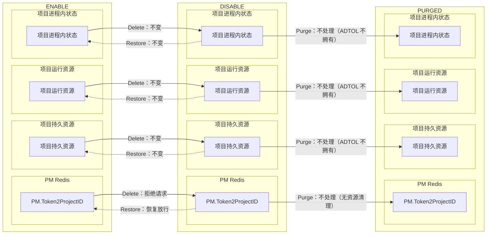

### PM 接入现状与代码改动

**PM 接入状态**：未注册 PM Hook。无项目级内存映射或运行资源（`adtol/` 搜索 `Token2ProjectID`）

| 阶段 | 现状 | 本期内容 | 代码文件 | 搜索关键词 |
| --- | --- | --- | --- | --- |
| Delete | 无项目级资源 | 不需要 Hook | — | — |
| Restore | 无项目级资源 | 不需要处理 | — | — |
| Purge | 无项目级资源 | 不需要处理 | — | — |


---


## 5. apps/abol

### 定位

ABOL 是 AB 实验判定入口。

### 流量入口与任务

Router 每请求查 PM，Abol core 维护 `abCore[projectID]` 进程内查找表和 metadata loop。已注册 PM `ProjectInfoHooker` 且实现有效。

### 资源台账

| 存储位置 | 资源 | 类型 | 内容与作用 | Delete | Restore | Purge | 代码文件 | 搜索关键词 |
| --- | --- | --- | --- | --- | --- | --- | --- | --- |
| Meta PG | AB 配置 | 持久资源 | AB 实验配置 | 保留 | 继续读取 | Meta 清理 | `apps/abol/service/internal_meta_loader.go` | ABConfig |
| 项目 Redis | target cache | 运行资源 | AB Core target lookup | 保留 | 继续使用 | Redis 清理 | `apps/abol/service/abol.go` | targetCache |
| 进程内 | `abCore[projectID]` | 进程内状态 | ABOL project core lookup | Hook 删除 | Hook 重建 | 清除 | `apps/abol/service/abol.go` | abCore |
| 进程内 | metadata loop | 运行资源 | metadata 同步 | Hook 停止 | Hook 重建 | 停止 | `apps/abol/service/internal_meta_loader.go` | metadataLoop |

### 生命周期变化图

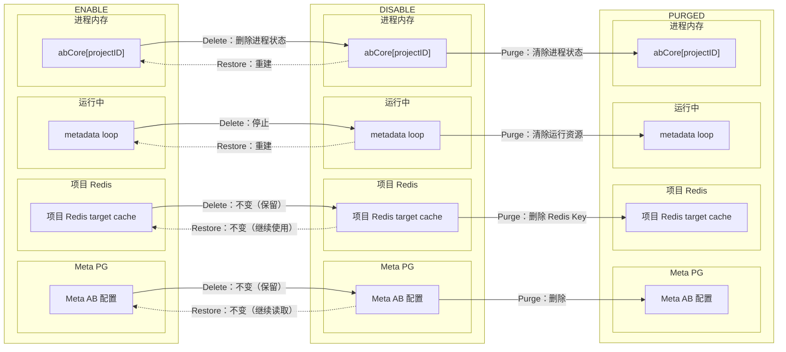

### PM 接入现状与代码改动

**PM 接入状态**：已注册 `ProjectInfoHooker`，`OnProjectDelete` 有效；`OnProjectUpdate` 重建（`abol/service/` 搜索 `OnProjectDelete`）

| 阶段 | 现状 | 本期内容 | 代码文件 | 搜索关键词 |
| --- | --- | --- | --- | --- |
| Delete | `OnProjectDelete` 停止 metadata loop、删除 `abCore[projectID]` | 保持现有实现，补回归测试 | `abol/service/abol.go` | `OnProjectDelete` |
| Restore | `OnProjectUpdate` 重建 abCore、恢复 metadata loop | 保持现有实现，补回归测试 | `abol/service/abol.go` | `OnProjectUpdate` |
| Purge | 无 Purge 处理 | 删除 AB 配置、Redis target cache | `abol/service/abol.go` | `purge` |


---
## 6. apps/c1 + pkg/dispatch

### 定位

C1 是数据落盘消费者。

### 流量入口与任务

从 Kafka 消费项目数据写入 Doris。`pkg/dispatch` 是任务分配控制面：Dispatch Node 按 topology 分配 task 给 consumer，TaskManager 管理 per-project ITasker。

Dispatch Node 已注册 PM `ProjectInfoHooker`，但 `OnProjectDelete` 只删除 Redis counts，未触发 topology 重写。C1 Metadata 维护 `metadata[projectID]` 和 `quota[projectID]` 进程内映射，目前没有完整 owner Hook。

### 资源台账

| 存储位置 | 资源 | 类型 | 内容与作用 | Delete | Restore | Purge | 代码文件 | 搜索关键词 |
| --- | --- | --- | --- | --- | --- | --- | --- | --- |
| Redis（Dispatch） | task map `sys:{dispatch}:task:*` | 运行资源 | 项目 task 计数 | Hook 删除 + topo 重写 | 重建 | 删除 | `pkg/dispatch/rdb.go` | KeySysDispatchTaskPrefix |
| 进程内存 | C1 metadata/quota 映射 | 进程内状态 | 项目 Metadata 和 Quota 查询 | Hook 驱逐 | 查询重建 | 驱逐 | `apps/c1/metadata/metadata.go` | GetEventPropDefineStore |
| 进程内存 | Dispatch per-project ITasker | 运行资源 | 项目 task 管理 | topo 重写后关闭 | topo 重建 | 关闭 | `pkg/dispatch/dispatcher.go` | ITasker |
| Kafka | consumer/loader | 运行资源 | 项目数据消费 | topo 重写后停止 | topo 重建 | 停止 | `apps/c1/` | KafkaConsumer |

### 生命周期变化图

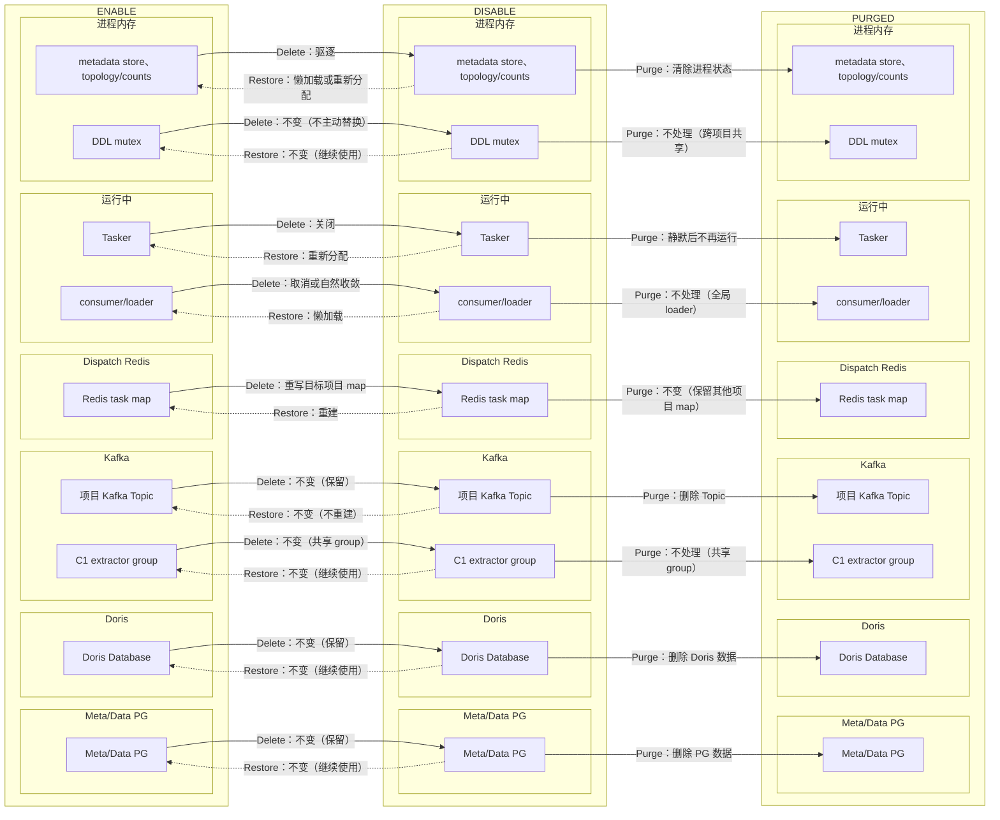

### PM 接入现状与代码改动

**PM 接入状态**：Dispatch Node 已注册 `ProjectInfoHooker`；C1 Metadata 无完整 Hook（`pkg/dispatch/rdb.go` 搜索 `OnProjectDelete`；`c1/metadata/metadata.go` 搜索 `metadata[projectID]`）

| 阶段 | 现状 | 本期内容 | 代码文件 | 搜索关键词 |
| --- | --- | --- | --- | --- |
| Delete | Dispatch `OnProjectDelete` 只删 counts | 标记 topology changed + 重写 task map + 关闭 ITasker | `pkg/dispatch/rdb.go` | `OnProjectDelete` / `ITasker` |
| Restore | 无 Restore 处理 | topology 重建恢复 ITasker | `pkg/dispatch/dispatcher.go` | `ITasker` |
| Purge | 无 Purge 处理 | C1 metadata/quota 映射驱逐、consumer 停止；设置 `AllowAutoTopicCreation=false` | `c1/metadata/metadata.go` | `metadata[projectID]` |


---
## 7. apps/connector

### 定位

Connector 处理外部数据管道（AppsFlyer 等回传）。

### 流量入口与任务

HTTP Router 每请求查 PM；Pipeline runtime（handler、Kafka runner/consumer、批导上下文）由 Scheduler Worker 间接控制。

已注册 PM Hook 但 `OnProjectDelete` 为空。实际运行工作由 Scheduler 持有，不需要第二套停止逻辑。

### 资源台账

| 存储位置 | 资源 | 类型 | 内容与作用 | Delete | Restore | Purge | 代码文件 | 搜索关键词 |
| --- | --- | --- | --- | --- | --- | --- | --- | --- |
| Meta PG | Pipeline 配置和运行记录 | 持久资源 | Pipeline 定义、执行日志 | 保留，拒绝新工作 | 继续读取 | 随 Meta Schema | `apps/connector/service/pipeline.go` | Pipeline |
| 客户外部 | 目标系统 | 持久资源 | 客户自有系统 | 保留 | 保留 | 不处理 | — | target |

### 生命周期变化图

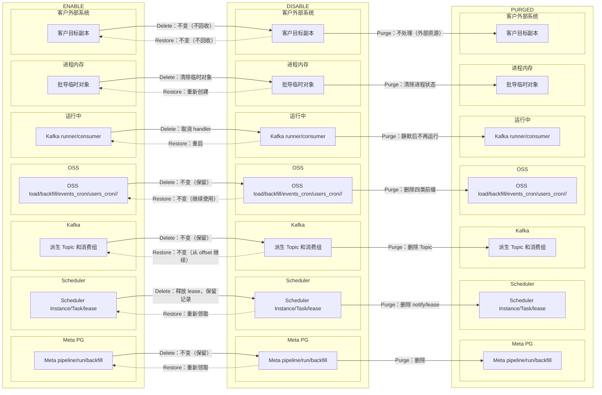

### PM 接入现状与代码改动

**PM 接入状态**：注册了 `ProjectInfoHooker` 但 `OnProjectDelete` 为空（`connector/service/pipeline.go` 搜索 `OnProjectDelete`）

| 阶段 | 现状 | 本期内容 | 代码文件 | 搜索关键词 |
| --- | --- | --- | --- | --- |
| Delete | Hook 为空 | 不补全——实际运行由 Scheduler 间接控制，统一由 Scheduler 门禁和 heartbeat 收敛 | — | — |
| Restore | 无 Restore 处理 | Scheduler 处理，不增加第二套逻辑 | — | — |
| Purge | 客户外部目标排除 | 不清理客户外部目标 | `connector/service/pipeline.go` | `target` |


---
## 8. apps/ma

### 定位

MA 是营销自动化引擎。

### 流量入口与任务

ConfigSync 管理 view/tracking/subscription，Runtime 持有 consumer、watcher、matcher、feedback/config/cohort cache 等项目级资源。

**MA 的独特性**：MA 使用 Web 无法访问的独享 Redis 存储项目运行时状态。Purge 不能由 Web 的 `ProjectResourcePurger` 直接清理，需要通过 MA 内部 HTTP endpoint 调用。

### 资源台账

| 存储位置 | 资源 | 类型 | 内容与作用 | Delete | Restore | Purge | 代码文件 | 搜索关键词 |
| --- | --- | --- | --- | --- | --- | --- | --- | --- |
| 进程内存 | ConfigSync view/tracking/subscription | 进程内状态 | 项目配置同步跟踪 | Hook 清理 | Hook 重建 | 内部 endpoint | `apps/ma/service/configsync/sync.go` | ConfigSync view/tracking/subscription |
| 进程内存 | Runtime feedback/config/cohort cache | 进程内状态 | 反馈、配置、队列查询 | Hook 驱逐 | Hook 重建 | 内部 endpoint | `apps/ma/service/eventconsumer/consumer.go` | Runtime feedback/config/cohort cache |
| 进程内存 | Runtime consumer/watcher/matcher | 运行资源 | 事件消费、变化监听 | Scheduler heartbeat | Scheduler 重建 | 内部 endpoint | `apps/ma/service/eventconsumer/consumer.go` | Runtime consumer/watcher/matcher |
| MA 独享 Redis | `ma:p:<pid>:*` | 持久资源 | 项目运行数据 | 保留 | 保留 | 内部 endpoint 删除 | `apps/ma/service/eventconsumer/` | ma:p:<pid>:* |
| 共享 Redis | `ma:{p:<pid>}:*` | 持久资源 | 项目共享运行数据 | 保留 | 保留 | 内部 endpoint 删除 | `apps/ma/service/eventconsumer/` | ma:{p:<pid>}:* |
| Kafka | MA 消费组 | 持久资源 | broker group metadata | 保留 | 保留 | 内部 endpoint 删除 | `apps/ma/service/eventconsumer/` | ma-consumer-group |

### 生命周期变化图

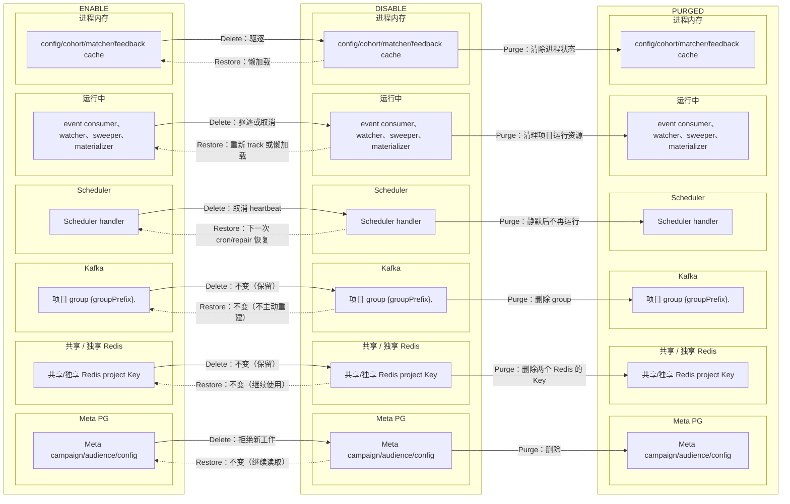

### PM 接入现状与代码改动

**PM 接入状态**：ConfigSync 已注册 `ProjectInfoHooker`，`Untrack` 可清理自身；Runtime 部分枚举 PM 部分无 Hook（`ma/service/configsync/sync.go` 搜索 `OnProjectDelete`）

| 阶段 | 现状 | 本期内容 | 代码文件 | 搜索关键词 |
| --- | --- | --- | --- | --- |
| Delete | ConfigSync 有 `Untrack`；Runtime 部分枚举 PM | ConfigSync 纳入统一 Delete Hook；Runtime 统一注册 PM Delete Hook | `ma/service/configsync/sync.go` | `OnProjectDelete` |
| Restore | 无 Restore 处理 | ConfigSync `SetInfo` 重建 tracking/subscription | `ma/service/configsync/sync.go` | `OnProjectUpdate` |
| Purge | MA 独享 Redis | **新增内部 endpoint** `POST /internal/v1/project/purge`：清独享 Redis `ma:p:<pid>:*` + 共享 Redis `ma:{p:<pid>}:*` + 消费组 | `ma/service/`（新增 `purge.go`） | `purge` / `ma:p:` |


**MA Runtime Purge 顺序**（endpoint 内部）：
1. 对当前进程执行幂等本地驱逐（再次确认 Hook 已执行）
2. 删除共享 Redis `ma:{p:<pid>}:*`
3. 删除 MA 独享 Redis `ma:p:<pid>:*`
4. 删除 MA 项目消费组
5. 重新查询两个 Redis 和 Kafka；全部不存在才返回成功

---
## 9. apps/simulator

### 定位

Simulator 是模拟/测试工具，不初始化 PM、不注册生产 Scheduler handler、不持有 Wave 项目资源。在生产生命周期中无角色。

### PM 接入现状与代码改动

**PM 接入状态**：不初始化 PM（无 PM 接入）

| 阶段 | 现状 | 本期内容 | 代码文件 | 搜索关键词 |
| --- | --- | --- | --- | --- |
| Delete | 无生产项目资源 | 不处理 | — | — |
| Restore | 无生产项目资源 | 不处理 | — | — |
| Purge | 无生产项目资源 | 不处理 | — | — |


---

## 10. 共享基础设施

### 10.1 pkg/pm：可用项目目录与 Hook 管理

PM 是所有组件接入生命周期的核心。它维护可用项目目录，并在项目状态变化时通知已注册的 Hook。

**资源台账**

| 存储位置 | 资源 | 类型 | 内容与作用 | Delete | Restore | Purge | 代码文件 | 搜索关键词 |
| --- | --- | --- | --- | --- | --- | --- | --- | --- |
| Redis | 可用项目集合索引 `sys:{pm}:projects` | 运行资源 | Set 结构，供组件枚举 | 移除 ID | 写回 ID | 确认不含 | `pkg/pm/project_manager.go` | KeySysPMProjects |
| Redis | 项目运行时快照 `sys:{pm}:info:<pid>` | 运行资源 | Secret、状态、配置 JSON | 删除 | 写回 | 确认不存在 | `pkg/pm/project_manager.go` | KeySysPMInfoPrefix |
| Redis | `sys:{pm}:info_change` Pub/Sub | 运行资源 | 变更通知 | 发布变更 | 发布变更 | — | `pkg/pm/project_manager.go` | sys:{pm}:info_change |
| 进程内存 | Manager `projects` map | 进程内状态 | 本地项目快照 | Pub/Sub 或对账更新 | Pub/Sub 或对账更新 | — | `pkg/pm/project_manager.go` | projects |

**代码改动**

| 文件 | 改动 |
| --- | --- |
| `pkg/pm/project_manager.go` | 关键 Redis 错误上抛；写后本地同步；订阅断开重连后双快照对账 |
| — | 保留 `SetInfo/DeleteInfo`，不新增 Restore 事件或方法 |

### 10.2 pkg/scheduler：分布式任务调度

Scheduler Master 负责 cron/notify 和 Instance 生命周期。Worker 负责任务领取和执行 heartbeat。

**代码改动**

| 文件 | 改动 |
| --- | --- |
| `pkg/scheduler/master.go` | refresh cron 和生成 Instance 前检查 PM |
| `pkg/scheduler/worker.go` | 领取 Instance/Task 和 heartbeat 时检查 PM；缺失时取消 context、释放 lease |
| `pkg/scheduler/purge.go` **新增** | `PurgeProjectRedisState`：定向移除目标项目 notify/delayed member 和 heartbeat/lease key |

> 不修改 Job/Instance/Task 持久状态。Master 只不生成，Worker 只释放 lease。

### 10.3 pkg/dispatch：任务拓扑分配

Dispatch Node 通过 PM Hook 接收项目变化，通过 `refreshTopo` 重写 task map。当前 `OnProjectDelete` 只删除 Redis counts，未可靠触发 topology 重写。

**代码改动**

| 文件 | 改动 |
| --- | --- |
| `pkg/dispatch/node.go` | 修正 `OnProjectDelete`：标记 topology changed + 重写 task map 并关闭 ITasker |
| `pkg/dispatch/task.go` | 验证 `OnProjectDelete` 后 project task map 和 counts 已清除 |

### 10.4 存储 client

| 包 | Purge 职责 | 说明 |
| --- | --- | --- |
| `dal/pgsqlx` | Meta/Data Schema `DROP SCHEMA IF EXISTS CASCADE` | 由 PG owner 在 Purge 步骤中执行 |
| `dal/dorisx` | `DROP DATABASE IF EXISTS` | Doris 清理 |
| `dal/kafkax` | 删除 Topic + 按前缀删除 consumer group | C1 producer 关闭自动建 Topic |
| `dal/redisx` | 按项目前缀 `p:<pid>:*` 定向删除 | 不新增通用 prefix delete 接口 |

---

## 11. Purge 固定顺序与资源 owner

### Purge 顺序

Purge 是同步、可重入的。`ProjectResourcePurger` 按固定顺序调用各资源 owner。任一步失败停止，重试从第一步开始。

| 顺序 | step | owner | 清理内容 |
| --- | --- | --- | --- |
| 1 | `project_pm` | PM | 确认项目已从 PM 移除 |
| 2 | `project_quiescence` | ProjectService | 确认 Scheduler、Dispatch、Wagent 运行面已静默 |
| 3 | `project_dispatch` | Dispatch | 清理 Redis task map |
| 4 | `project_ma` | MA client | 调用 MA 内部 endpoint 清理独享/共享 Redis + 消费组 |
| 5 | `project_wagent` | Wagent | 清理 Stream/DLQ、`p:<pid>:*`、quota/rate-limit |
| 6 | `project_redis` | Redis owner | 按项目前缀清理权限缓存、QE lock 等 |
| 7 | `project_oss` | OSS owner | 删除 `load/backfill/events_cron/users_cron/<pid>/` |
| 8 | `project_kafka` | Kafka owner | 删除 Topic + consumer group |
| 9 | `project_doris` | Doris owner | `DROP DATABASE IF EXISTS` |
| 10 | `project_data_pg` | PG owner | `DROP SCHEMA <data_schema> CASCADE` |
| 11 | `project_meta_pg` | PG owner | `DROP SCHEMA <meta_schema> CASCADE` |
| 12 | `final_global` | ProjectService | 最终核验 → Global PG 事务写 `PURGED,true` |

### 关键规则

- 资源不存在视为成功（幂等）。
- Kafka、OSS 等最终一致资源在步骤内做必要验证。
- `project_quiescence` 只检查条件：确认 Scheduler heartbeat 已取消所有 handler，Dispatch 已重写 topo，Wagent 已停止。不强制杀死进程。
- Meta Schema 在最后删除，保证前置清理仍可读取项目元数据。
- 最终事务前做一次显式最终核验。

---

## 12. 契约

### 12.1 Schema 与条件更新

```sql
ALTER TABLE organization
    ADD COLUMN IF NOT EXISTS status VARCHAR(64) NOT NULL DEFAULT 'ENABLE';

COMMENT ON COLUMN organization.status
    IS '组织状态：ENABLE/DISABLE/PURGING/PURGED';
```

| 操作 | SQL 条件 |
| --- | --- |
| Project Delete | `id=? AND status='ENABLE' AND is_deleted=false` |
| Project Restore | `id=? AND status='DISABLE' AND is_deleted=false` |
| Project Purge 新数据 | `id=? AND status IN ('DISABLE','INITIALIZING') AND is_deleted=false` |
| Project Purge 历史数据 | `id=? AND status='DISABLE' AND is_deleted=true` |
| Project Purge 重试 | `id=? AND status='PURGING'`，保持原 `is_deleted` |
| Organization Delete/Restore | 相应 `ENABLE/DISABLE AND is_deleted=false` |
| Organization Purge | `status='DISABLE' AND is_deleted=false`；`PURGING` 可重试 |

DAO 新增方法（`dao/global/project.go` + `dao/global/organization.go`）：
`UpdateStatusIf`、`GetByIDWithDeleted`、`ListLifecycleByOrg`、`GetAllMigrationProjects`。

### 12.2 Purge 内部类型

```go
type PurgeTarget struct {
    ProjectID          int64
    OrganizationID     int64
    KafkaTopics        []string
    KafkaGroupPrefixes []string
    OSSPrefixes        []string
    DorisDatabase      string
    DataSchema         string
    MetaSchema         string
}

type PurgeResult struct {
    ResourceID int64
    Status     string
    Purged     bool
}

type PurgeStepError struct {
    Step string
    Err  error
}
```

`PurgeTarget` 在写 `PURGING` 的同一短锁阶段构造，仅本次调用内传递，不持久化。

### 12.3 MA 内部 endpoint

```text
POST /internal/v1/project/purge
Authorization: Bearer <MA_PROJECT_PURGE_TOKEN>
X-Internal-Service: web
Project: <positive int64>
```

| 响应码 | 语义 |
| --- | --- |
| 204 | 幂等成功 |
| 400 | Project header 缺失或无效 |
| 401 | Secret 不匹配 |
| 503 | MA Runtime 未就绪 |
| 500 | 清理或核验失败 |

Web 将非 204 映射为 `project_ma` 步骤错误。

### 12.4 OP API 请求

```yaml
CustomerLifecycleProjectActionRequest:
  required: [customer_id, project_id, confirm_value, reason]
  properties:
    customer_id: { type: integer, format: int64, minimum: 1 }
    project_id: { type: integer, format: int64, minimum: 1 }
    confirm_value: { type: string, minLength: 1, maxLength: 32 }
    reason: { type: string, minLength: 1, maxLength: 1000 }
```

动作成功返回 `resource_id/status/purged`。失败返回结构化 data：`resource_id`、至多 20 个 `blocked_ids`、`blocked_count`、`step`。

## 13. 错误处理与测试策略

### 13.1 错误与事务

| 场景 | 结果 |
| --- | --- |
| 非 OP、跨客户、参数非法 | PermissionDenied/BadParam，记 `verify_failed` |
| 短锁占用 | Conflict，状态不变 |
| PM/DB 部分成功 | fail-closed，重复动作对账 |
| Purge writer 未静默 | Conflict + `project_quiescence`，保留 `PURGING` |
| 任一 owner 失败 | 保留 `PURGING`，从头重跑 |
| 最终核验失败 | 保留 `PURGING` |
| `PURGED,true` | 返回当前墓碑 |

所有 Global 状态切换是条件 UPDATE。Redis/MA/Kafka/OSS/Doris/PG 删除全在事务外。

### 13.2 单元测试覆盖

| 范围 | 必测行为 |
| --- | --- |
| Project Service | Delete/Restore 幂等、组织边界、`PURGED` 快速返回 |
| ProjectResourcePurger | 固定顺序、失败即停、重跑幂等、target 不变、最终核验 |
| Organization Service | 逐项目约束、Restore 不级联 |
| PM | 写错误、本地同步、重复 Hook 去重、订阅重连 |
| Scheduler | Master/Worker/heartbeat 三层门禁、11 个 JobType |
| Dispatch/C1 | 重写 map、Tasker 关闭、metadata 驱逐、auto-create 关闭 |
| MA endpoint | Secret/caller 校验、两个 Redis、消费组、多副本 |
| Web 旁路 | MCP/Internal/QE/LiveEvent/Asset/Wagent 行为 |
| 存储 owner | Redis 定向、OSS 空前缀、Kafka 删除轮询 |

### 13.3 集成验证

1. 建立包含全部项目资源的 fixture
2. Delete 前后逐项比较持久资源未减少，新工作被拒绝
3. 执行 migration，确认 `DISABLE,false` 项目继续升级
4. Restore 后新工作恢复，错过的不补偿
5. 每个 Purge step 分别注入失败，确认重跑幂等
6. 清理后触发旧 producer/notify，确认不复活
7. 多 PM/MA 实例验证订阅重连
8. 六类动作全部有脱敏审计

```bash
go test ./apps/web/service/project ./apps/web/service/organization ./pkg/pm ./pkg/scheduler
go test ./apps/edge/... ./apps/adtol/... ./apps/abol/... ./apps/connector/...
go test ./apps/c1/... ./apps/ma/... ./apps/simulator/...
go test ./apps/web/qe/catalog ./apps/web/service/liveevent ./apps/web/service/asset
go test ./apps/web/wagent/... ./apps/web/op/...
```