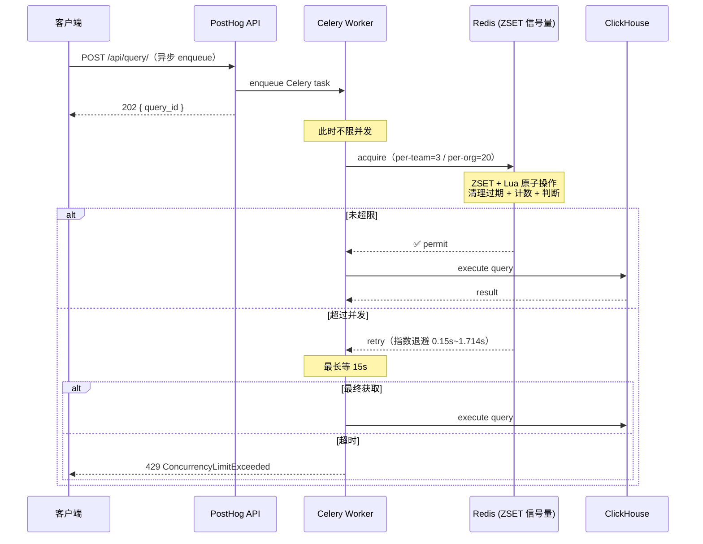

# PostHog API 限流、凭证设计与商业策略调研

> 调研日期：2026-07-20  
> 调研范围：PostHog 本地源码快照（`/Users/wenshiqin/go-project/posthog-master/`）及 PostHog 官方公开定价与产品策略资料  
> 文档性质：竞品调研，所有结论有源码或官方公开资料直接支持  
> 阅读建议：先读核心发现，再按"现状→设计逻辑→商业策略→MCP→启示"顺序阅读

## 核心发现

PostHog 的关键不是"给每个 API token 设置一个 QPS"，而是把不同问题拆成多层控制：

```text
组织 / 套餐       → 决定购买了哪些产品能力、长期用量和 quota
项目 / Team       → 决定数据隔离、资源归属和部分运行时聚合
凭证 / API key    → 决定身份、scope、撤销、审计和公平性
接口 / 资源       → 决定请求速率、查询成本和并发上限
Redis / Cache     → 承载短时计数、并发占用和 quota enforcement
```

最值得 Wave 借鉴的五条线索：

1. **商业归属在 organization，运行时保护不只在 organization**——billing usage 是 organization 级，但 API rate limit 会按 personal API key、project/team、接口类型分别处理，查询并发还区分 team 和 organization。
2. **API key 是访问凭证，不是独立商业容量**——PostHog 对 Project Secret API Key 同时做"单 key 限制"和"team aggregate 限制"，明确防止客户通过创建多个 key 叠加容量。
3. **QPS 不能代表高成本查询的全部保护**——HogQL、ClickHouse 和 API query 有单独 rate/concurrency；API query 的商业 quota 甚至以 `api_queries_read_bytes` 计量，不是简单请求数。
4. **MCP 不是另一套绕过权限的 API**——MCP 以 token hash 识别调用方，先做认证、scope/tool filtering、project/org pinning，再做 480/min + 4800/hour 的 burst/sustained 限流。
5. **运行时限流故障优先放行，启动期依赖必须存在**——MCP Redis 计数失败时 fail-open；REST throttle 异常路径也返回 allow。但 MCP 进程启动时要求 Redis 可连接。这是"运行期不过度扩大故障面，启动期保证依赖存在"的组合。

## 一、Token 分类与限流现状

### 1.1 对象模型：Organization、Project、Token 不是一回事

PostHog 源码里的历史命名容易造成误解：产品界面称 Project，核心模型常称 `Team`，`Team` 具有 `organization_id`。

| 对象 | PostHog 语义 | 对 Wave 的研究意义 |
| --- | --- | --- |
| Organization | 商业、成员、可用产品 feature、usage、billing period 的聚合单位 | 更适合承载套餐、购买能力、月度用量和组织级 spend/quota |
| Project / Team | 数据与资源隔离单位；有自己的 API token | 更适合承载资源边界、项目级权限、部分 API aggregate |
| Personal API Key | 用户创建的机器凭证；可 scope 到组织或项目；带 API scopes | 适合自动化、审计、撤销和最小权限，不应天然获得独立套餐容量 |
| Project Secret API Key | 绑定一个项目的项目级机器凭证；不依赖创建者仍是成员 | 适合服务端 ingestion、Feature Flags、Endpoints 等 project-scoped 程序访问 |
| Session auth | 登录用户会话；正常情况下绕过 API scope，但仍受成员关系和访问控制约束 | Session Token 应单独做反滥用和攻击保护，不宜直接当成 Account API Token 的替代品 |
| MCP session | 在 token/userHash、组织、项目、MCP session 等上下文中执行 tool call | MCP session 只解决协议上下文，不应成为权限或套餐边界本身 |

> 源码证据：[`PersonalAPIKey` 模型](posthog/models/personal_api_key.py:34)、[`ProjectSecretAPIKey` 模型](posthog/models/project_secret_api_key.py:13)、[`Organization.get_plan_tier`](posthog/models/organization.py:396)

### 1.2 Personal API Key 的安全和生命周期

源码体现出一套完整的机器凭证产品设计：

| 能力 | 实现 | 源码位置 |
| --- | --- | --- |
| 数量限制 | 每个用户最多 10 个 personal API key | `posthog/api/personal_api_key.py:21` |
| 创建时字段 | secure hash、masked value、label、created/last-used/rolled 时间；原始 token 仅创建时返回一次 | `posthog/models/personal_api_key.py:34` |
| 权限控制 | key 可携带 `scopes`、`scoped_teams`、`scoped_organizations`；scope 校验和 org/项目范围校验是两步 | `posthog/permissions.py:616` |
| 生命周期 | 支持 roll、revoke 等操作；`last_used` 用于管理和审计 | `posthog/api/personal_api_key.py:227` |
| 组织管控 | 组织可禁止普通成员使用 personal API key（管理员例外） | `posthog/permissions.py:676` |
| 限流身份 | 限流指标使用 hashed key，不记录 raw token | `posthog/rate_limit.py:177` |

> 产品含义：如果 Wave 要允许 Account API Token 接入 OpenAPI/MCP，第一版最有价值的不是再做复杂 token 类型，而是补齐 token 的 scope、项目/组织范围、roll/revoke、last-used、审计和组织安全开关。QPS 是其中一个运行时属性。

### 1.3 REST API 限流：burst + sustained

PostHog 的 DRF 默认 throttle 使用 burst 和 sustained 两层：

| 限流层 | 默认值 | 除外路径 | 作用域 |
| --- | --- | --- | --- |
| BurstRateThrottle | 480/minute | capture、decide 等 | 对 personal API key 优先使用 key hash，其次回退到 team/user/IP |
| SustainedRateThrottle | 4800/hour | capture、decide 等 | 同上 |

> 源码 nuance：不能只读注释就断言默认 API key rate 是 per project，也不能只读 MCP 常量就断言所有 PostHog API 都是 per token。当前源码体现的是"API key 优先按 key 公平，非 key 请求再按项目/用户/IP 回退"。

### 1.4 Project Secret API Key：per-key + team aggregate

对于 project secret API key，源码定义了两层限制，第二层明确防止容量放大：

| 限流层 | 作用 |
| --- | --- |
| `PersonalOrProjectSecretApiKeyRateThrottle` | 按单个 PSAK 计数 |
| `ProjectSecretApiKeyTeamRateThrottle` | 按 team 聚合所有 PSAK 请求（防止创建多个 key 乘倍获得容量） |

> 源码：[`ProjectSecretApiKeyTeamRateThrottle`](posthog/rate_limit.py:385)

### 1.5 高成本查询：rate 与 concurrency 分离

Query API 根据 action、组织 feature、团队配置和查询类型选择不同 throttle：

| 查询类型 | 速率限制 | 并发限制 | 配置维度 |
| --- | --- | --- | --- |
| HogQL | 120/hour | — | 默认 |
| API query burst/sustained | 240/min + 2400/hour | per-team 默认 3 | team/api_query_rate_limit 可覆盖（如 200/day） |
| ClickHouse query | 240/min + 1200/hour | per-org 默认 20 | 组织 feature 可开启并发检查 |
| Dashboard query | — | per-org 默认 6 | 不同 workload 有各自 team limit |

**关键区分：并发限制在查询执行层，不在 HTTP 层。**

PostHog 的查询是异步的——`POST /api/query/` 不直接执行查询，而是 enqueue Celery task 后返回 `202 { query_id }`，客户端再通过 `GET /api/query/{id}/` 轮询结果。因此 HTTP 入口处不限并发，无所谓"异步返回不代表查询完成"的问题。

并发限制发生在 Celery worker **真正开始执行查询时**，使用 Redis ZSET + Lua 原子操作实现的信号量：



**多个并发限制器同时生效**——`query_runner.py` 在同一个 `with` 语句中获取所有信号量：

```python
with (
    get_materialized_endpoints_rate_limiter().run(...),    # per-team 10
    get_api_team_rate_limiter().run(...),                   # per-team 3
    get_app_org_rate_limiter().run(...),                    # per-org 20
    get_app_dashboard_queries_rate_limiter().run(...),      # per-org 6
):
    query_result = self.calculate()
```

> 源码：[`RateLimit.run`](posthog/clickhouse/client/limit.py:83)、[`query_runner.py`](posthog/hogql_queries/query_runner.py:1415)

**对 Wave 的启示**：Wave 的查询也是异步的（HTTP 不代表完成），API 层 semaphore 无效。但 PostHog 展示了"在查询执行层做并发控制"的模式——未来可在 Wave 的查询执行器中增加类似 Redis 信号量，独立于 #3 项目聚合加权速率之外。这不是 P0，但可以作为查询成为瓶颈后的演进方向。

### 1.6 其他 endpoint 的分层保护

| Endpoint | 限流值 | 说明 |
| --- | --- | --- |
| Feature Flags Remote Config | 600/min（可 team 覆盖） | 与普通 API 限制分开 |
| Event API | ClickHouse burst/sustained | 独立限制 |
| Event values | 60/min + 300/hour | 独立限制 |

> 产品含义：便宜、短请求可以共享默认保护；查询、写入、实时配置等不同资源使用不同保护；高风险/高成本操作不应和普通 CRUD 共用一个 bucket。

### 1.7 MCP 限流：独立 TypeScript 服务 + 独立 Redis 限流器

PostHog 的 MCP 是**独立于 Django REST API 的 TypeScript 服务**（Cloudflare Worker + Hono），有自己独立的认证和限流体系。

#### 架构

```
MCP 客户端 (Claude Code 等)
       │
       ▼
Cloudflare Worker (index.ts) ── 校验 token 前缀
       │
       ▼
Hono App (app.ts)
  ├── securityHeaders 中间件
  ├── httpMetrics 中间件
  └── StreamableMcpHandler.fetch()
        ├── authenticateAndParse()         → 401
        ├── rateLimiter.check(userHash)    → 429
        └── dispatcher.handleRequest()     → JSON-RPC 方法分派
              ├── MAX_BATCH_SIZE = 100
              └── MAX_BODY_BYTES = 1MB
```

#### 认证：只接受 API token，不接受 session

MCP `authenticateAndParse()` 仅检查 `Authorization: Bearer`，支持三种 token 格式：

| 凭证 | 前缀 | 说明 |
|------|------|------|
| Personal API Key | `phx_` | 用户手动创建的 API key |
| OAuth Access Token | `pha_` | OAuth 2.1 授权码流程颁发 |
| ID-JAG JWT | — | RFC 9068 JWT（需要 JWKS 验证） |

> 源码：[Cloudflare Worker token 提取](services/mcp/src/index.ts:183–215)、[Hono authenticateAndParse](services/mcp/src/hono/request-utils.ts:55–93)

**Session 不能走 MCP**——MCP 完全不读 cookie，也不检查 session token。这与 D2 理念一致：API 通道和浏览器通道物理隔离。

#### 限流：独立 Redis 限流器，值对等到 REST API

MCP 有自己独立的 Redis 滑动窗口限流器，和 REST API 值相同但 Redis key 独立：

```typescript
// rate-limiter.ts (第 25–35 行)
const DEFAULT_BURST_LIMIT = 480      // 480 请求 / 60s 窗口
const DEFAULT_SUSTAINED_LIMIT = 4800  // 4800 请求 / 3600s 窗口
```

- **Key 维度**：`mcp:rl:<scope>:<userHash>` —— `userHash` 是 token 的 PBKDF2 哈希
- **分 scope 独立计数**：burst 和 sustained 各一个 Redis key
- **fail-open**：Redis 出错时放行（第 48–52 行）
- **429 响应头**：携带标准 `RateLimit-*` 头（[buildRateLimitResponse](services/mcp/src/hono/rate-limiter.ts:113–125)）

> 源码：[RateLimiter 实现](services/mcp/src/hono/rate-limiter.ts)、[StreamableMcpHandler.fetch](services/mcp/src/hono/streamable-handler.ts:26–52)

#### 资源保护（非速率类）

| 限制 | 值 | 源码位置 |
|------|-----|---------|
| JSON-RPC batch 上限 | 100 条消息 | [`dispatcher.ts:39`](services/mcp/src/hono/dispatcher.ts:39) |
| 请求体大小上限 | 1MB（1,048,576 字节） | [`dispatcher.ts:40`](services/mcp/src/hono/dispatcher.ts:40) |
| 关闭优雅期 | 300s（5min） | [`shutdown.ts:10–36`](services/mcp/src/hono/shutdown.ts:10) |
| 并发限制 | ❌ 无（仅有监控指标 `mcp_inflight_requests`） | [`metrics.ts:48–52`](services/mcp/src/hono/metrics.ts:48) |

> **对 Wave 的启示**：(1) PostHog 的 MCP 与 REST API 限流值相同但 key 独立，Wave 也可考虑此模式而非直接复用 per-token + global；(2) MCP 不接受 session，与 D2 架构一致；(3) batch/body 上限作为资源保护层，Wave 当前 MCP 无此限制。

## 二、设计逻辑：商业归商业，运行时归运行时

PostHog 最值得关注的设计原则是"商业归属和运行时保护故意分离"——billing 判断在 organization，fast path 可以按项目 token 做。以下是支撑这一原则的关键设计选择：

### 2.1 为什么 billing 是 org 级，限流不完全是

Organization 的 usage 包含 `usage`、`todays_usage`、`limit` 和 billing period。当 organization 被限制时，源码会把组织内各 Team 的 API token 写入 Redis sorted set，过期时间设为 billing cycle 结束。解除限制时反向移除。

但 API rate limit 本身不会只按 organization 计算——它同时检查 personal API key、team/project、endpoint 类型。这是为了：

- **安全性**：单个 key 的泄露不应耗尽 org 容量（per-key 公平性）
- **隔离性**：一个 team 的突发流量不应影响同 org 的其他 team（team aggregate）
- **后端保护**：昂贵操作需要独立保护（per-endpoint rate + concurrency）

> 源码：`Organization.limit_product_until_end_of_billing_cycle`、`replace_limited_team_tokens`（`posthog/models/organization.py:407`、`ee/billing/quota_limiting.py:140`）

### 2.2 为什么需要 per-key + team aggregate 两层

Project Secret API Key 的第二层聚合（`ProjectSecretApiKeyTeamRateThrottle`）的注释直接写明了目的：**防止客户通过创建很多 project secret key 来乘倍获得容量**。

这是对"API key 不是独立商业容量"的最明确表达——token 是身份，不是套餐。

> 商业推论：如果 Wave 允许一个组织创建多个 Account API Token，至少应有组织或项目聚合预算；否则"token 级 QPS × token 数量"会把套餐容量变成可无限自助扩容的漏洞。

### 2.3 为什么 QPS 不是唯一的保护维度

PostHog 对不同类型的查询使用了 rate + concurrency 两套独立保护：

- **Rate** 控制"多快能发起请求"——适合短请求、低成本的 CRUD
- **Concurrency** 控制"同时有多少请求在执行"——适合长查询、高成本的分析操作

如果只有 QPS 限制而没有 concurrency 限制，一个客户可以通过低 QPS 发起大量长查询，后端 worker 仍然会被占满。PostHog 对 API query 和 ClickHouse query 都有独立的 concurrency limit（3 per team、20 per org 等）。

### 2.4 不是所有 "limit" 都应该是 429

PostHog 的 `check_count_limit` 在 dashboard、insight、widget、alert 等资源上达到阈值时发出 `resource limit hit` 事件，不抛错、不阻断创建——它是 notification-only。

这意味着至少需要区分四类"限制"：

| 类别 | 含义 | 产品反馈 |
| --- | --- | --- |
| entitlement denied | 套餐没有该能力 | 403 或产品引导 |
| operational rate/concurrency | 保护系统 | 429 + Retry-After |
| billable quota | 已购买用量耗尽 | 降级、暂停、超额计费或到期恢复 |
| soft resource limit | 建议清理或升级 | 通知，不立即阻断 |

### 2.5 Redis 故障的取舍逻辑

PostHog 的 MCP Redis 策略体现了"运行时 vs 启动期"的区分：

| 阶段 | 行为 | 逻辑 |
| --- | --- | --- |
| 启动时 | Redis 必须可连接，否则进程退出 | 避免服务处于不确定状态 |
| 运行时 | Redis 计数失败时 fail-open，放行请求 | 避免 Redis 故障把 MCP 变成 5xx |
| 运行后 | metrics 记录 rate-limit error | 允许运营发现限流暂时失效 |

> 对 Wave 的建议：在没有攻击/故障数据前，先以 fail-open + 后端并发保护为基线；不要在没有证据的前提下引入多级分布式 fallback。

## 三、商业策略

### 3.1 定价定位：usage-based，不是卖 QPS

PostHog 公开采用 usage-based pricing。付费产品按使用量计费，提供较大的月度免费额度：

| 计价维度 | 示例计费单位 | 说明 |
| --- | --- | --- |
| Product Analytics | per event（1M/月免费） | 事件量 |
| Session Replay | per recording | 录制量 |
| Feature Flags | per request | 请求量 |
| Data Warehouse | per row | 数据行 |

> 不是所有产品都用同一个单位定价。这支撑了"QuotaResource 不是统一总额度，而是按可售卖资源拆分"的源码设计。

定价策略背后的产品逻辑：

- ICP 是高增长 startup 的 product engineer，因此选择 self-serve、透明、usage-based
- 数据从"摄入 events"调整为"导出 rows / triggered events"——因为后者更贴近客户感知的价值
- billing 页面、用量 dashboard、spend limit、超额行为说明共同降低账单恐惧
- enterprise 需要折扣、合同、credits、invoice 等 billing flexibility

> 证据：[PostHog Pricing](https://posthog.com/)、[定价方法与商业取舍](https://newsletter.posthog.com/p/non-obvious-pricing-advice-for-startups)、[ICP 说明](https://newsletter.posthog.com/p/defining-our-icp-is-the-most-important)

### 3.2 Quota 的源码设计：按资源拆分的组织级聚合

源码中的 `QuotaResource` 不是统一总额度，而是按可售卖/可计量资源拆分：

events、exceptions、recordings、rows synced、feature flag requests、**api_queries_read_bytes**、survey responses、LLM events、rows exported、AI credits、workflow emails、logs 等。

每个 organization 的 usage summary：

```text
Organization.usage[resource]
  -> usage / todays_usage / limit / billing period / grace state
  -> quota_limited_until
```

quota 的商业状态和运行时状态分开处理：

```text
商业判断（organization）→ 写入 Redis（team API token → 过期时间）→ 请求 fast path 检查
```

部分资源有 overage buffer；Feature Flags 至少有 2 天 grace，AI credits 不享受 grace。

> 产品含义：对 Wave，"商业边界"和"请求执行边界"有意分离——商业判断在 organization，实际 fast path 可以按项目 token 做。

## 四、MCP 设计与限流

### 4.1 MCP 请求生命周期（handler 顺序）

```text
Bearer token
  → token 格式与 session 初始化
  → token hash / org / project 上下文
  → scope 与 scoped project/org 过滤工具
  → MCP rate limiter
  → JSON-RPC body / batch / 参数校验
  → tool dispatch 到 PostHog API
  → 上游 429 重试或返回 rate-limit error
```

> 源码：`services/mcp/src/index.ts:183`、`services/mcp/src/hono/request-state-resolver.ts:90`、`services/mcp/src/hono/streamable-handler.ts:26`

### 4.2 MCP rate limiter：burst + sustained

MCP `RateLimiter` 对同一个 `userHash` 同时检查两个 fixed-window Redis counter：

| 维度 | 默认值 | bucket key 格式 |
| --- | --- | --- |
| Burst | 480/minute | `mcp:rl:<scope>:<userHash>` |
| Sustained | 4800/hour | `mcp:rl:<scope>:<userHash>` |

**行为**——超限返回 429，携带完整响应头：

- `Retry-After`——建议等待秒数
- `X-RateLimit-Limit`、`X-RateLimit-Remaining`、`X-RateLimit-Reset`、`X-RateLimit-Scope`

> 注意：userHash 由认证 token 计算而来，MCP fast path 更接近**每 token 的公平性限制**，不是 organization aggregate。组织/项目权限和底层 API aggregate 仍在其他层处理。
>
> 源码：[MCP rate-limiter defaults](services/mcp/src/hono/rate-limiter.ts:23)、[`RateLimiter.check`](services/mcp/src/hono/rate-limiter.ts:37)、[429 response headers](services/mcp/src/hono/rate-limiter.ts:111)、[Rate-limiter tests](services/mcp/tests/hono/rate-limiter.test.ts:111)

### 4.3 MCP 请求形状边界

MCP 入口不只是加一个 rate limiter，还有以下保护：

| 保护维度 | 限制值 |
| --- | --- |
| 单次 body 大小 | 最大 1 MiB |
| JSON-RPC batch | 最大 100 个请求（并行 dispatch） |
| 每个 tool 输入 | schema 验证 + 字段上限 |
| Telemetry project ID | 数字格式、长度和数量上限（防 cardinality/heap 被打爆） |
| 认证失败 | 401 |
| 关闭/生命周期切换 | 可能返回 503 |

> 产品含义：MCP 付费能力应以"可调用哪些工具、能访问哪些项目、读写 scope、包含多少资源/查询预算"表达；batch/body/tool 参数是安全和稳定性约束，不必都暴露成客户套餐字段。

### 4.4 MCP 对上游 429 的处理（两层限流）

MCP 内部 API client 把 REST API 视为 rate limit 的权威来源：

- 收到 429 后读取 `Retry-After`
- 没有有效 header 时使用带 jitter 的指数退避
- 最多重试 3 次，总等待预算 30 秒
- 耗尽后返回 `PostHogRateLimitError`

这意味着 MCP 有两层限流：

```text
MCP 入口 token limiter     防止一个 MCP client 持续打入口
上游 REST / query limiter   保护具体资源，并反映真实 endpoint 成本
```

两层都需要存在，但不能各自独立地给客户承诺一份可叠加容量——否则客户从 MCP 入口和 OpenAPI 入口同时调用时，会绕开组织聚合预算。

> 源码：[`fetchJson` 429 retry policy](services/mcp/src/api/client.ts:25)

## 五、对 Wave 的启示

### 5.1 推荐的产品模型

| 层 | 建议承担的职责 | 不建议承担的职责 |
| --- | --- | --- |
| Organization / plan | machine API/MCP 是否可用、包含容量、长期 quota、spend limit、跨项目聚合 | 不直接作为所有请求唯一 bucket |
| Project | 数据隔离、scope、资源归属、查询/写入的主要运行时边界 | 不允许通过创建项目无限扩容组织能力 |
| Account API Token | 身份、scope、撤销、审计、token 级公平性和突发保护 | 不把每个 token 当成一份独立套餐容量 |
| Endpoint / tool | 资源成本、请求权重、并发、body/batch 参数边界 | 不让所有操作共享一个等价 QPS |
| Session Token | 登录态安全、预认证/IP/device/行为反滥用、全局后端保护 | 不把浏览器会话直接当成长期机器凭证 |

### 5.2 P0：机器访问必须是可治理的产品能力

从 PostHog 源码可以还原出以下最低产品需求：

- 组织能否使用 API/MCP 由产品 feature/plan 决定
- token 必须可命名、查看 last used、roll/revoke
- 支持 read/write scope 和 project/org scope
- 组织管理员可以禁止普通成员使用 personal token
- MCP tool 列表应随 token scope、项目范围和产品 feature 过滤
- OpenAPI 与 MCP 不能绕过同一资源的权限和 quota

### 5.3 限流必须保护"后端成本"，不只是保护 HTTP 入口

- 普通请求：burst + sustained
- 高成本 query：独立请求预算
- 长查询：独立 concurrency
- 项目 secret key：per-key + project/team aggregate
- organization：商业 quota 和跨项目聚合
- batch/body/tool params：限制单次请求的放大倍数

### 5.4 OpenAPI 与 MCP 的商业包装

可以把 OpenAPI 和 MCP 放入同一个 `machine_api` entitlement——客户购买的是"程序化访问/自动化能力"，不是某一种 transport。实现上仍保留两个入口 limiter，但它们应共享：

- 组织级 quota/cost ledger
- project/resource 权限
- 关键查询的 concurrency budget
- token 撤销和审计
- 429、quota exhausted、permission denied 的错误语义

### 5.5 Redis 限流故障的推荐基线

PostHog 提供了一个可讨论的最小方案（供 Wave 参考）：

- 入口短时限流：Redis 失败时 fail-open，保证正常请求可用
- 后端查询并发：仍由资源侧 limiter 保护，必要时等待或拒绝
- 指标明确记录 limiter error
- 启动时验证 Redis 依赖
- 不立即引入本地计数、Redis fallback、数据库 fallback 三套状态

在决定是否需要 fallback 前，建议先回答三个问题：

1. Redis 故障期间，攻击者是否能够绕过现有 ingress/WAF/网关，把请求量放大到足以拖垮服务？
2. 如果限流状态暂时丢失，客户最不能接受的是短暂放行，还是正常流量被 5xx 拒绝？
3. 我们是否已有稳定的进程内/网关级粗粒度保护，可以在 Redis 失效时接管？

## 六、未确认问题

### 6.1 仍需要产品/实测确认的问题

| 问题 | 为什么重要 |
| --- | --- |
| PostHog Cloud 当前 snapshot 与本地源码是否完全一致 | 本调研不能给本地快照打 commit 级版本承诺 |
| MCP 的 480/min、4800/hour 是否在 Cloud 按 organization、用户或不同客户合同覆盖 | 决定 Wave 是否沿用或调整这些数值 |
| MCP tool 是否所有调用都进入同一个 `api_queries_read_bytes` 商业 quota | 决定 MCP 和 OpenAPI 是否共享同一份资源预算 |
| 企业客户是否可以购买更高 API query concurrency、专属容量或不同 quota behavior | 影响 Wave 的企业套餐设计 |
| quota 超额时具体是 hard stop、grace、降级还是 overage | 影响产品反馈设计 |

### 6.2 建议的后续研究验证

在把研究发现转化为 Wave 实现前，建议完成以下验证：

1. 用 Wave 的真实 API 路径列出低成本 CRUD、高成本 query、写入、MCP tool 四类资源，判断哪些需要独立 rate/concurrency/cost
2. 用两个 organization、多个 project、多个 token 做容量模型——验证"组织额度是否共享""token 是否只是公平性""项目是否是运行时聚合"
3. 设计 429/403/quota-exhausted 的产品反馈，确认客户能否从响应中知道是权限不足、瞬时超限还是本周期用量耗尽
4. 盘点 Session Token 的预认证入口、匿名/IP/device 维度和现有网关保护
5. 在确定真实攻击/成本数据后，再决定 Redis fail-open 是否需要本地粗粒度 fallback

## 七、证据索引

### 源码路径

| 研究主题 | 关键源码 |
| --- | --- |
| REST 默认 throttle 与 key 维度 | `posthog/rate_limit.py:133`、`posthog/settings/web.py:394` |
| Project Secret API Key 聚合 | `posthog/rate_limit.py:385` |
| Query API 按查询类型选 throttle | `posthog/api/query.py:128` |
| Query concurrency | `posthog/clickhouse/client/limit.py:83` |
| Team query rate override | `posthog/models/team/team.py:625` |
| Organization usage/quota resource | `ee/billing/quota_limiting.py:66` |
| Organization quota 到项目 token enforcement | `posthog/models/organization.py:407` |
| Feature Flags Remote Config | `products/feature_flags/backend/api/feature_flag.py:454` |
| Event API throttles | `posthog/api/event.py:171` |
| Plan tier 与资源限制 | `posthog/models/organization.py:396`、`posthog/resource_limits/registry.py:5`、`posthog/resource_limits/evaluator.py:30` |
| API scopes 与组织/项目约束 | `posthog/permissions.py:511` |
| Personal / Project Secret API Key | `posthog/models/personal_api_key.py:34`、`posthog/models/project_secret_api_key.py:13` |
| MCP 入口、session 与 token hash | `services/mcp/src/index.ts:183`、`services/mcp/src/lib/request-properties.ts:8` |
| MCP rate limiter、Redis fail-open、429 headers | `services/mcp/src/hono/rate-limiter.ts:23`、`services/mcp/tests/hono/rate-limiter.test.ts:111` |
| MCP Redis 启动策略 | `services/mcp/src/hono/index.ts:11` |
| MCP batch/body 与 telemetry 保护 | `services/mcp/src/hono/dispatcher.ts:39`、`services/mcp/src/hono/rate-limit-telemetry.ts:10` |
| MCP 对上游 429 重试 | `services/mcp/src/api/client.ts:25` |

### 官方资料

- [PostHog Pricing](https://posthog.com/)
- [定价方法与商业取舍](https://newsletter.posthog.com/p/non-obvious-pricing-advice-for-startups)
- [ICP 说明](https://newsletter.posthog.com/p/defining-our-icp-is-the-most-important)
- [早期 self-serve 产品策略](https://newsletter.posthog.com/p/how-we-got-our-first-1000-users)
