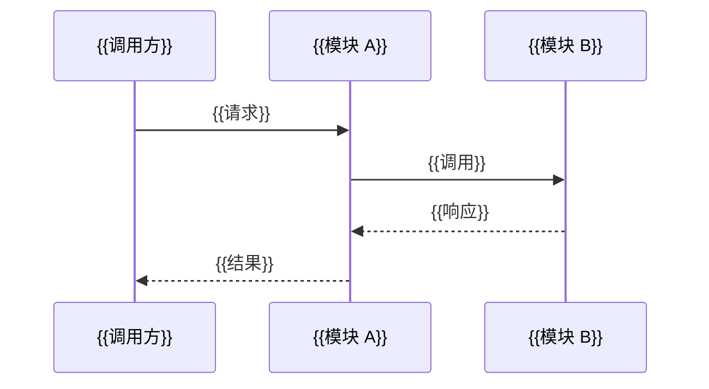

# 概要设计：{{功能名称}}

| 元数据 | |
|---|---|
| **目录** | `YYYYMMDD-Project-TAG-Desc` |
| **创建日期** | {{YYYY-MM-DD}} |
| **状态** | Draft / Reviewing / Approved |
| **关联 spec** | [01-spec.md](./01-spec.md) |
| **设计者** | |
| **产出命名** | `03-plan.md`（单方案）或 `03-plan-{后缀}.md`（多方案） |

---

## 1. 背景与目标

### 1.1 要解决什么

{{当前问题：用户在什么场景下遇到什么痛点，当前系统为什么不能满足}}

### 1.2 成功标准

- {{可量化的验收条件，如：P50 延迟 < 200ms、支持 1000 并发等}}
- {{非功能性指标}}

### 1.3 本次不解决什么

- {{明确的 out-of-scope，防止 scope creep}}
- {{哪些看起来相关的功能故意不做，为什么}}

---

## 2. 领域模型

> 从 spec 中提取核心实体和关系，建立通用语言。*参考 domain-modeling 模式。*

### 2.1 核心实体

| 实体 | 职责 | 关键属性 | 与其他实体的关系 |
|---|---|---|---|
| `{{Entity1}}` | {{一句话职责}} | {{关键字段}} | {{多对一/一对多/聚合关系}} |
| `{{Entity2}}` | {{一句话职责}} | {{关键字段}} | {{关系说明}} |

### 2.2 限界上下文

{{如果涉及多个上下文，说明边界和交互方式。简单变更可省略。}}

### 2.3 通用语言

| 术语 | 定义 | 避免混淆的别名 |
|---|---|---|
| {{术语 1}} | {{精确含义}} | {{不是 XX，也不是 YY}} |
| {{术语 2}} | {{精确含义}} | {{同上}} |

---

## 3. 现状与约束

### 3.1 当前架构

{{现有系统中与本次变更相关的模块/能力/数据模型。可通过代码搜索确认。}}

### 3.2 约束条件

| 类型 | 约束 | 来源/原因 |
|---|---|---|
| 技术 | {{如：必须使用 PostgreSQL，不能引入新中间件}} | {{团队决定 / 架构原则}} |
| 业务 | {{如：必须在 Q3 前上线}} | {{业务需求}} |
| 运维 | {{如：必须兼容现有部署方式}} | {{运维限制}} |

### 3.3 既有模块依赖分析

```mermaid
flowchart LR
    {{ModuleA}} --> {{ModuleB}}
    {{ModuleA}} --> {{ModuleC}}
    {{ModuleC}} --> {{ModuleD}}
    style {{ChangedModule}} fill:#f96
```

> 标注本次改动的模块。

---

## 4. 方案设计

> 必须生成至少 2 种候选方案，以表格对比后再推荐。*参考 design-an-interface 模式。*

### 4.1 候选方案对比

| 对比维度 | 方案 A：{{名称}} | 方案 B：{{名称}} | 方案 C（如有）：{{名称}} |
|---|---|---|---|
| **核心思路** | {{一句话描述}} | {{一句话描述}} | {{一句话描述}} |
| **架构方式** | {{如：集中式网关}} | {{如：嵌入 SDK}} | {{如：Sidecar}} |
| **接口复杂度** | {{小/中/大}} | {{小/中/大}} | {{小/中/大}} |
| **实现工作量** | {{人天估算}} | {{人天估算}} | {{人天估算}} |
| **扩展性** | {{如何支持未来需求}} | {{同上}} | {{同上}} |
| **运维成本** | {{部署/监控/排障}} | {{同上}} | {{同上}} |
| **性能影响** | {{延迟/吞吐/资源}} | {{同上}} | {{同上}} |
| **可测试性** | {{单元/集成/E2E}} | {{同上}} | {{同上}} |
| **隐藏复杂度** | {{看起来简单但实际棘手的地方}} | {{同上}} | {{同上}} |

### 4.2 推荐方案：方案 {{A/B/C}}

**选择理由：**

1. {{理由 1：最匹配核心约束}}
2. {{理由 2：性价比最高}}
3. {{理由 3：未来扩展性好}}

**不选其他方案的理由：**

| 方案 | 不选原因 | 什么条件下可能会选 |
|---|---|---|
| {{方案 X}} | {{具体缺陷}} | {{如：如果延迟要求提高 10 倍则需重新考虑}} |

---

## 5. 架构总览

### 5.1 系统架构图

```mermaid
flowchart TD
    subgraph Layer1[{{层名}}]
        A[{{组件}}] --> B[{{组件}}]
    end
    subgraph Layer2[{{层名}}]
        C[{{组件}}] --> D[{{组件}}]
    end
    B --> C
```

> 必须展示：新增组件、修改组件、关键数据流方向。

### 5.2 核心数据流



### 5.3 模块深度分析

> 对涉及的模块评估"深度"（Interface 小而实现复杂的深层模块 vs Interface 大而实现薄的浅层模块）。*参考 codebase-design 模式。*

| 模块 | 当前深度 | 目标深度 | 说明 |
|---|---|---|---|
| `{{Module}}` | 浅/深 | 保持/加深 | {{如：当前接口暴露太多内部细节，需收窄}} |

---

## 6. 模块影响矩阵

| 模块 | 变更类型 | 影响程度 | 改动要点 | 风险等级 |
|---|---|---|---|---|
| `{{module/path}}` | 新增/修改/删除 | 🔴高/🟡中/🟢低 | {{具体改动描述}} | 高风险/可控/低 |
| `{{module/path}}` | 修改 | 🟡中 | {{具体改动描述}} | 可控 |

> 变更类型：新增 / 修改 / 删除 / 仅引用
> 影响程度：🔴高（核心逻辑变更） / 🟡中（局部修改） / 🟢低（配置/测试）

---

## 7. 接口设计（如需）

> 如果本次变更涉及模块间或服务间接口，在此定义关键接口。*参考 codebase-design 的 Seam 模式。*

### 7.1 关键接口

```typescript
// 接口签名 + 说明
interface {{InterfaceName}} {
  {{method}}({{params}}): {{returnType}}
}
```

### 7.2 接口深度分析

- **Interface 大小**：{{几个方法、几个参数}}
- **隐藏的实现复杂度**：{{接口背后封装了多少逻辑}}
- **可测试性**：{{通过该接口能否直接测试核心逻辑}}

### 7.3 调用关系图

```mermaid
flowchart LR
    {{Caller}} -->|{{调用}}| {{Interface}}
    {{Interface}} -->|{{转发}}| {{Impl}}
```

---

## 8. 设计拷问

> 列出本方案最可能被挑战的 5 个点，并给出回应。*参考 grilling/grill-me 模式。*

| # | 挑战 | 回应 | 是否可接受 |
|---|---|---|---|
| 1 | {{质疑点}} | {{为什么这样设计}} | ✅ 可接受 / ❌ 需重新设计 |
| 2 | {{质疑点}} | {{同上}} | ✅ 可接受 |
| 3 | {{质疑点}} | {{同上}} | ✅ 可接受 |
| 4 | {{质疑点}} | {{同上}} | ✅ 可接受 |
| 5 | {{质疑点}} | {{同上}} | ✅ 可接受 |

---

## 9. 落地顺序

| Phase | 内容 | 依赖 | 交付物 | 预估时长 |
|---|---|---|---|---|
| **Phase 1** | {{最小可行}} | 无 | {{可运行的子集}} | {{X 天}} |
| **Phase 2** | {{扩展功能}} | Phase 1 | {{完整功能}} | {{X 天}} |
| **Phase 3** | {{优化/迁移}} | Phase 2 | {{最终形态}} | {{X 天}} |

---

## 10. 风险与 Trade-off

| 风险类型 | 描述 | 概率 | 影响 | 应对措施 |
|---|---|---|---|---|
| 性能 | {{风险描述}} | 高/中/低 | {{影响范围}} | {{降级/缓存/限流}} |
| 可靠性 | {{风险描述}} | 高/中/低 | {{影响范围}} | {{重试/对账/补偿}} |
| 安全 | {{风险描述}} | 高/中/低 | {{影响范围}} | {{权限校验/审计}} |
| 复杂度 | {{风险描述}} | 高/中/低 | {{维护成本}} | {{抽象/文档}} |

---

## 11. 下一阶段建议

**建议**：
- `进入 speckit.tasks` — 方案确定，可直接拆任务实现
- `先进入 speckit.detail` — 需进一步细化实现方案

**判断依据**：
- {{变更复杂度评估}}
- {{是否存在未解决的争议}}
- {{是否需要外部依赖的详细设计}}

---

## Quality Gates

- [ ] **背景与目标清晰**：问题定义、成功标准、out-of-scope 完整
- [ ] **领域模型完整**：核心实体、关系、通用语言已定义
- [ ] **代码探索确认**：已通过代码搜索确认现有架构与假设一致
- [ ] **多方案对比**：至少 2 种候选方案，有对比表格和选择理由
- [ ] **架构图完整**：包含 Mermaid 系统架构图和核心数据流图
- [ ] **模块影响明确**：每个受影响模块的变更类型和风险等级已标注
- [ ] **设计已拷问**：至少 5 个潜在挑战已记录和回应
- [ ] **风险已分析**：性能、可靠性、安全、复杂度均有评估
- [ ] **落地顺序可行**：Phase 划分合理，依赖关系清楚
- [ ] **下一阶段有明确建议**：tasks 或 detail，含判断依据
