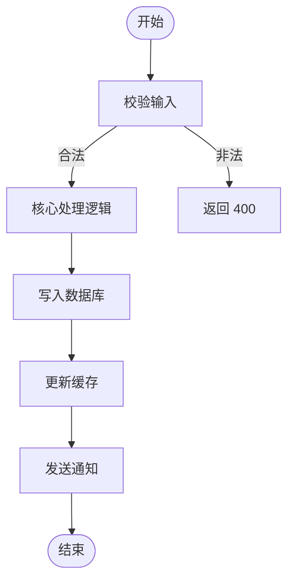
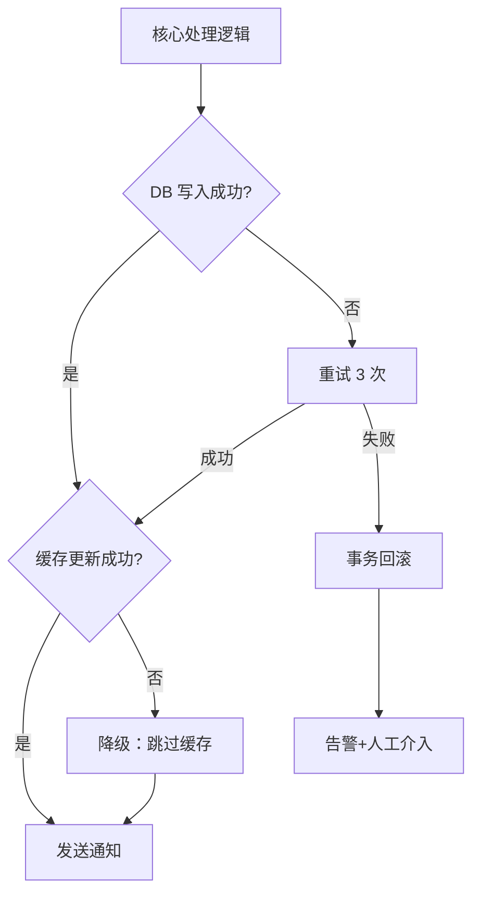
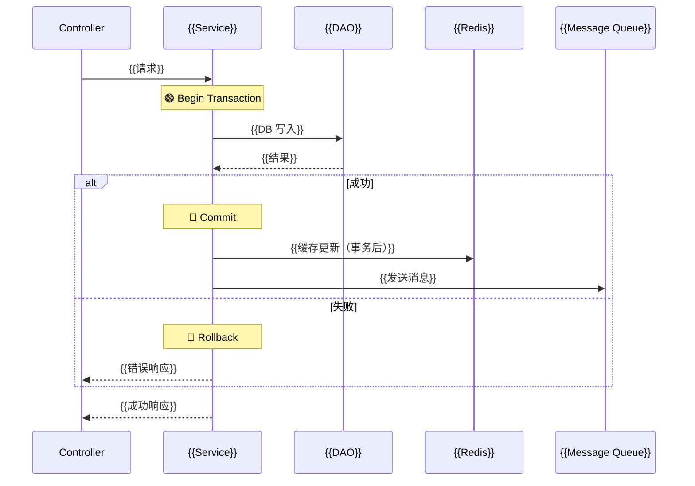

# 详细设计：{{功能名称}}

| 元数据 | |
|---|---|
| **目录** | `YYYYMMDD-Project-TAG-Desc` |
| **创建日期** | {{YYYY-MM-DD}} |
| **状态** | Draft / Reviewing / Approved |
| **关联 spec** | [01-spec.md](./01-spec.md) |
| **关联 plan** | [03-plan.md](./03-plan.md) |
| **设计者** | |
| **产出命名** | `04-detail.md`（单方案）或 `04-detail-{后缀}.md`（多方案） |

---

## 1. 背景承接

### 1.1 回顾

{{用 1-2 段承接 plan.md 的主要结论和推荐方案。}}

### 1.2 本详细设计聚焦的实现问题

- {{Plan 阶段未解决的实现细节问题}}
- {{需要在代码层面确认的技术假设}}
- {{最需要谨慎处理的关键路径}}

---

## 2. 一致性校验

> 在写实现方案前，先交叉验证各 artifacts 之间的一致性。

### 2.1 Spec vs Plan

| 校验项 | 状态 | 说明 |
|---|---|---|
| spec 所有用户故事在 plan 中有对应方案 | ✅ 匹配 / ❌ 遗漏 | {{如有遗漏，标注}} |
| Plan 的 out-of-scope 与 spec 一致 | ✅ 一致 / ❌ 偏离 | {{说明}} |
| spec 中的边界情况在 plan 中有考量 | ✅ 覆盖 / ❌ 缺失 | {{说明}} |

### 2.2 Plan vs 代码现实

> 通过代码搜索验证 plan 的技术假设是否成立。

| 假设 | 验证结果 | 备注 |
|---|---|---|
| {{plan 中假设的现有模块存在}} | ✅ 存在 / ⚠️ 需调整 / ❌ 不存在 | {{实际代码路径}} |
| {{接口签名与 plan 描述一致}} | ✅ 一致 / ⚠️ 有差异 | {{实际签名}} |
| {{数据模型与 plan 一致}} | ✅ 一致 / ⚠️ 需扩展 | {{当前 DDL}} |

### 2.3 修正记录

> 如果发现上述校验不匹配，在此记录对 plan 的修正。

- {{修正点 1}}：{{原描述}} → {{修正后}}
- {{修正点 2}}：{{原描述}} → {{修正后}}

---

## 3. 实现总览

### 3.1 变更地图

{{用自然语言描述实现全貌：哪些层会新增/修改、数据如何跨越这些层流动、关键的调用链路。}}

### 3.2 文件影响清单

| 文件 | 变更类型 | 改动内容 | 改动的理由（为什么必须改这里） |
|---|---|---|---|
| `{{path/to/file.go}}` | 新增 | {{新增内容}} | {{为什么不能放在现有关联文件中}} |
| `{{path/to/file.go}}` | 修改 | {{行号范围+改动}} | {{为什么是这里，而不是其他地方}} |
| `{{path/to/file.go}}` | 删除 | {{删除内容}} | {{删除后的能力由谁接管}} |
| `{{path/to/file_test.go}}` | 新增 | {{测试策略}} | {{测试的重点是什么}} |

---

## 4. 数据模型 / API / 配置定义

> 所有定义必须精确到字段、类型、约束，不允许占位符。*参考 domain-modeling 模式的精确性要求。*

### 4.1 数据模型

#### 新增表 / 字段

```sql
-- DDL 语句（精确到约束、索引、默认值）
-- 注意：语法按项目实际数据库方言调整（PG / MySQL / 其他）
-- PostgreSQL 示例：
CREATE TABLE {{schema_name}}.{{table_name}} (
    {{field}}  {{type}} {{constraints}},
    ...
    PRIMARY KEY ({{key}})
);

CREATE INDEX CONCURRENTLY IF NOT EXISTS {{idx_name}}
    ON {{schema_name}}.{{table_name}} ({{field}});

COMMENT ON COLUMN {{schema_name}}.{{table_name}}.{{field}} IS '{{说明}}';
```

| 字段 | 类型 | 约束 | 默认值 | 说明 |
|---|---|---|---|---|
| `{{field}}` | `{{type}}` | NOT NULL / UNIQUE / FK | `{{default}}` | {{说明}} |

#### 修改表

| 表名 | 操作 | 变更内容 | 兼容性 |
|---|---|---|---|
| `{{table}}` | ADD/ALTER/DROP | {{DDL}} | 向前兼容? Y/N |

#### 索引策略

| 索引 | 所属表 | 列 | 原因 |
|---|---|---|---|
| `{{idx_name}}` | `{{table}}` | `{{columns}}` | {{查询场景}} |

### 4.2 API / 接口

#### 新增接口

| 方法 | 路径 | 输入 | 输出 | 权限 | 频率限制 |
|---|---|---|---|---|---|
| `POST` | `/api/v1/{{resource}}` | `{{请求 body 结构}}` | `{{响应结构}}` | `{{角色/权限}}` | {{限流策略}} |

#### 修改接口

| 接口 | 变更 | 向后兼容 |
|---|---|---|
| `{{原接口}}` | {{变更描述}} | ✅ / ❌（需升级调用方） |

### 4.3 配置项

| 配置键 | 类型 | 默认值 | 说明 | 动态生效? |
|---|---|---|---|---|
| `{{config.key}}` | `string/int/bool` | `{{default}}` | {{说明}} | ✅ / ❌ |

### 4.4 事件结构（如有）

| 事件名称 | 生产者 | 消费者 | Payload |
|---|---|---|---|
| `{{event.name}}` | {{module}} | {{module}} | `{{JSON schema}}` |

### 4.5 外部依赖与集成契约

> 记录本变更所依赖的外部系统/服务及其集成方式。*参考 grilling 模式：拷问依赖边界。*

#### 依赖清单

| 外部系统/模块 | 依赖类型 | 提供的接口 | 集成方式 | 版本要求 | SLA | 故障影响 |
|---|---|---|---|---|---|---|
| {{system}} | 内部模块/第三方API/基础设施 | {{接口描述}} | HTTP/gRPC/事件/DB直连 | {{version}} | {{SLA}} | {{故障时的影响}} |

#### 集成契约

对每个外部依赖，明确以下内容：

- **接口契约**：请求/响应的字段、类型、约束（可将 Swagger/Protobuf 链接附上）
- **鉴权方式**：API Key / OAuth / mTLS / 无
- **错误语义**：哪些错误码可重试、哪些不可恢复
- **超时配置**：连接超时、读取超时、总超时
- **熔断降级**：是否接入熔断、降级后的行为
- **联调计划**：是否需要跨团队联调，预计时间窗口

---

## 5. 分模块详细技术方案

> 每个模块至少说明以下五个方面。*参考 codebase-design 的深度分析 + grilling 的失败路径思维。*

### 5.1 {{模块 A 名称}}

#### 职责

{{一句话说明这个模块在本功能中的职责。}}

#### 关键函数/方法

```typescript
// 精确到参数和返回值
function {{methodName}}({{param}}: {{type}}): {{returnType}}
```

| 函数 | 作用 | 事务边界 | 权限校验 | 重入安全? |
|---|---|---|---|---|
| `{{func}}` | {{说明}} | 🟢事务开始 / 🔴提交 / 🔄回滚 | {{角色+校验点}} | ✅幂等 / ❌不幂等 |

#### 核心逻辑流程

{{自然语言描述 + 伪代码（可选），重点说明为什么这样设计而不是其他方式。}}

#### 事务边界标记

```
🟢 ── Begin Transaction ──────────────────────────
    │ 1. 操作 A：{{说明}}
    │ 2. 操作 B：{{说明}}
    │ 3. 影响范围：{{哪些表/行被锁定}}
🔴 ── Commit / 🔄 Rollback ──────────────────────
```

> 团队规则：事务内不能包含跨网络调用（RPC/HTTP/消息队列发送等）。

#### 错误处理

| 失败场景 | 错误类型 | 处理方式 | 补偿机制 |
|---|---|---|---|
| {{场景 1：如 DB 写入失败}} | 可重试 / 不可恢复 | {{如：重试 3 次+指数退避}} | {{如：对账任务}} |
| {{场景 2：如外部依赖超时}} | 可降级 / 不可降级 | {{如：返回降级数据}} | {{如：异步刷新}} |
| {{场景 3：如参数非法}} | 客户端错误 | {{如：直接返回 400}} | 无需补偿 |

#### 缓存策略（如有）

| 缓存 | Key 模式 | 过期时间 | 更新策略 | 一致性要求 |
|---|---|---|---|---|
| Redis / Local | `{{key}}` | {{TTL}} | Write-Through / Cache-Aside | {{最终/强一致}} |

#### 监控与日志

| 指标 | 类型 | 维度 | 告警阈值 |
|---|---|---|---|
| {{metric}} | Counter/Histogram | {{labels}} | {{threshold}} |

#### 接口深度评估

> *参考 codebase-design 的深度概念。*

- **Interface 大小**：{{方法数、参数复杂度}}
- **隐藏的实现复杂度**：{{接口背后封装了多少逻辑}}
- **可测试性**：{{是否可以通过该接口直接测试核心逻辑}}
- **评价**：Deep ✅ / Shallow ⚠️ — {{原因}}

---

### 5.2 {{模块 B 名称}}

{{同上结构}}

---

## 6. 业务流程图

### 6.1 正常流程



### 6.2 失败流程



---

## 7. 时序图

### 7.1 主调用链路



---

## 8. 测试策略

### 8.1 测试矩阵

| 测试类型 | 覆盖范围 | 方法 | 关键场景 |
|---|---|---|---|
| **单元测试** | {{函数/方法级}} | {{框架}} + Mock {{依赖}} | {{正常路径、各失败路径}} |
| **集成测试** | {{DB + 缓存 + 外部依赖}} | {{docker-compose / testcontainers}} | {{事务回滚、并发写入}} |
| **边界测试** | {{特殊值}} | {{参数化测试}} | {{空列表、极限值、null 输入}} |
| **并发测试** | {{竞态场景}} | {{goroutine / 并发请求}} | {{重复提交、超时+重试}} |

### 8.2 可测试性分析

> *参考 codebase-design 的可测试性原则。*

| 模块 | 测试策略 | 依赖注入方式 | 是否需要 Mock 服务 |
|---|---|---|---|
| {{Module A}} | {{纯函数测试/接口测试}} | {{构造函数/参数传参}} | {{是/否 + Mock 工具}} |
| {{Module B}} | {{集成测试}} | {{无，直接调用}} | {{是，需 Mock HTTP}} |

---

## 9. 实现风险评估

> *参考 grilling 模式：拷问实现过程中最可能出错的地方。*

| # | 风险点 | 概率 | 影响 | 预防措施 | 补救措施 |
|---|---|---|---|---|---|
| 1 | {{如：事务范围过大导致锁竞争}} | 中 | 高 | {{标注事务边界+锁分析}} | {{拆分事务}} |
| 2 | {{如：缓存与 DB 不一致}} | 高 | 中 | {{Cache-Aside + 最终一致}} | {{对账任务}} |
| 3 | {{如：第三方 API 限流}} | 中 | 高 | {{熔断+降级}} | {{手动重试}} |

### 9.1 补偿策略总表

| 失败场景 | 可重试? | 重试策略 | 回滚策略 | 最终一致性保障 |
|---|---|---|---|---|
| {{场景}} | ✅ / ❌ | {{如：3 次 + 指数退避}} | {{事务回滚}} | {{对账 / 补偿事务}} |
| {{场景}} | ✅ / ❌ | {{同上}} | {{同上}} | {{同上}} |

---

## 10. 上线与回滚方案

> 每次变更必须有安全的发布和回退计划。*参考 grilling 模式：拷问"上线出问题了怎么办"。*

### 10.1 部署顺序

| 步骤 | 操作 | 预期影响 | 回滚方式 |
|---|---|---|---|
| 1 | {{如：执行数据库 migration}} | {{如：新增表，无向前不兼容}} | {{如：DROP TABLE / ALTER 回退}} |
| 2 | {{如：发布新版本服务}} | {{如：无损，新老兼容}} | {{如：回滚到上一版本}} |
| 3 | {{如：开启 feature flag}} | {{如：功能可见}} | {{如：关闭 feature flag}} |
| 4 | {{如：数据迁移/回填}} | {{如：后台任务，可暂停}} | {{如：反向迁移}} |

### 10.2 Feature Flag（如有）

| Flag 名称 | 类型 | 默认值 | 作用域 | 预期持有时间 |
|---|---|---|---|---|
| `{{flag_name}}` | 发布/百分比/用户 | `off` | {{org/project}} | {{如：发布后 1 周}} |

### 10.3 回滚检查清单

- [ ] 数据库 migration 可回退（编写了 `DOWN` 语句）
- [ ] 旧版代码与新版 schema 兼容（前向兼容性验证）
- [ ] 数据迁移任务可暂停/重试
- [ ] 回滚后业务数据不丢失
- [ ] 回滚测试已在类生产环境执行过

### 10.4 上线观测

| 关注指标 | 正常范围 | 告警触发 | 回滚触发条件 |
|---|---|---|---|
| {{指标}} | {{范围}} | {{阈值}} | {{阈值}} |
| {{指标}} | {{范围}} | {{阈值}} | {{阈值}} |

---

## Quality Gates

### QG-1: Performance — N+1 查询禁止
- [ ] 集合操作用 batch/bulk 接口，逐条查询已标注原因
- [ ] 大事务锁范围已评估（目标：单事务 < {{项目事务耗时阈值，如 200ms}}）
- [ ] 关键查询已设计索引

### QG-2: Data Integrity — 禁止孤儿数据
- [ ] 操作在同一事务内完成，事务边界清晰标注
- [ ] 数据清理/同步有异常补偿机制

### QG-3: Security
- [ ] 每个接口标注了权限校验逻辑
- [ ] 跨组织数据访问显式隔离

### QG-4: Simplicity — 禁止过度设计
- [ ] 无新框架/中间件引入（如需引入已论证必要性）
- [ ] 不涉及 3+ 文件且可简化时已评估合并方案
- [ ] 抽象层级不超过 2 层

### QG-5: Completeness
- [ ] 文件影响清单完整，每个文件有修改理由
- [ ] 主要失败路径已分析（外部依赖异常、参数非法、事务回滚）
- [ ] 新增逻辑有对应测试策略

### QG-6: Architecture — 跨模块只能依赖 Service
- [ ] 无跨模块 DAO 直接注入
- [ ] 跨模块事务通过 context 传播

### QG-7: Cache / Redis 安全
- [ ] 缓存操作在事务提交后执行
- [ ] 批量变更标注了缓存影响范围
- [ ] 多副本部署下缓存一致性窗口已评估

### QG-8: 分布式部署兼容性
- [ ] 事务内无跨网络调用（RPC/HTTP/消息队列）
- [ ] 跨服务补偿/重试逻辑已保证幂等

### QG-9: 一致性校验通过
- [ ] Spec vs Plan 无遗漏
- [ ] Plan vs 代码现实无矛盾（或已修正）

### QG-10: 外部依赖
- [ ] 所有外部依赖及其接口契约已记录
- [ ] 每个依赖的故障影响已评估（降级/熔断/超时策略）

### QG-11: 上线与回滚
- [ ] 数据库 migration 有可回退的 DOWN 语句
- [ ] 回滚检查清单已逐项确认
- [ ] 上线观测指标和回滚触发条件已定义
